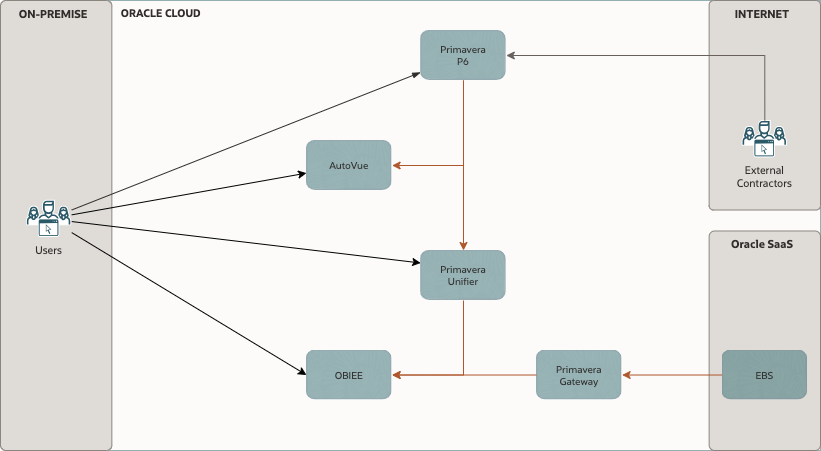

<!---   
      Replace ${doc.customer.name} in this document with the customer's name.           
--->

*Guide:*

*Author Responsibility*

- *Chapter 1-3: Sales Consultant*

# Document Control

*Guide:*

*The first chapter of the document describes the metadata for the document. Such as versioning and team members.*

## Version Control

*Guide:*

*A section describing the versions of this document and its changes.*

*Example:*

Version     | Author          | Date                    | Comment
:---        |:---             |:---                     |:---
0.1         | Name            | June 12th, 2023     | Updates to network design
1.0         | Name            | June 13th, 2023     | Updates to HA design

## Team

*Guide:*

*A section describing the Oracle team.*

*Example:*

This is the team that is delivering the WAD.

Name           | eMail                     | Role                    | Company
:---           |:---                       |:---                     |:---
Name   | email@example.com     | Project Manager         | Oracle
Name  | email@example.com     | Cloud Architect         | Oracle

## Abbreviations and Acronyms (Optional)

*Guide:*

*If needed, maintain a list of:*
- *Abbreviation: a shortened form of a word or phrase.*
- *Acronyms: an abbreviation formed from the initial letters of other words and pronounced as a word (e.g. ASCII, NASA ).*

*Example:*

| Term         | Meaning                               |
|:-------------|:--------------------------------------|
| AD-Bridge    | Active Directory Bridge               |
| CG           | Oracle Cloud Guard                    |
| EBS          | E-Business Suite                      |
| EBS-Asserter | Oracle E-Business Suite Asserter      |
| IaaS         | Infrastructure as a Service           |
| IaaS         | ABC                                   |
| IDCS         | Oracle Identity Cloud Service         |
| MFA          | Multi Factor Authentication           |
| NSG          | Network Security Group                |
| OAC          | Oracle Analytics Cloud                |
| OCI          | Oracle Cloud Infrastructure           |
| OIC          | Oracle Integration Cloud              |
| SSO          | Single Sign-On                        |
| VCN          | Virtual Cloud Network                 |
| VSS          | Oracle Vulnerability Scanning Service |
| WLS          | Weblogic Server                       |

## Document Purpose

*Guide:*

*Describe the purpose of this document and the Oracle-specific terminology, specifically around 'Workload'.*

*Example:*

This document provides a high-level solution definition for the Oracle solution and aims at describing the current state, and to-be state as well as a potential project scope and timeline. The intended purpose is to provide all parties involved with a clear and well-defined insight into the scope of work and intention of the project.

The document may refer to a 'Workload', which summarizes the full technical solution for a customer (You) during a single engagement. The Workload is described in the chapter Workload Requirements and Architecture.

<!--                            -->
<!-- End of 1) Document Control -->
<!--                            -->

# Business Context

*Guide:*

*Describe the customer's business and background. What is the context of the customer's industry and line of business? What are the business needs and goals which this Workload is an enabler for? How does this technical solution impact and support the customer's business goals? Does this solution support a specific customer strategy, or maybe certain customer values? How does this solution help our customers to either generate more revenue or save costs?*

Example:

${doc.customer.name} is one of the world's most valuable XXX companies. It is a multi-national company located in the XXX. The company operates internationally providing XXX services.

Currently ${doc.customer.name} uses Primavera application extensively for the project planning and scheduling of their construction projects. They want to move their Primavera applications to cloud to reduce the cost and to leverage the agility and scalability of cloud.

This project will use Oracle OCI cloud to create a standby system for the existing Primavera implementation, thereby providing customer with much better fault-tolerance compared to the current architecture.

## Executive Summary

*Guide:*

*A section describing the Oracle differentiator and key values of the solution for the customer, allowing the customer to make decisions quickly.*

Example:

The following document defines a tentative high level deployment architecture that may be used at ${doc.customer.name}.

Highlighted details are only presented for the Primavera application environment.

## Workload Business Value

*Guide:*

*A clear statement of specific business value as part of the full workload scope. Try to keep it SMART: Specific, Measurable, Assignable, Realistic, and Time-Related - Agree on the business value with the customer. Keep it business-focused, and speak the language of the LoB which benefits from this Workload: "Increase Customer Retention by 3% in the next year" or "Grow Customer Base with Executive Decision-Making from our Sales and Support Data". Avoid technical success criteria such as "Migrate App X to Oracle Cloud" or "Provision 5 Compute Instances".*

Example:

The success completion of this project is to provide a fully migrated Primavera comprising of XXX x non-production environments, XXX x production-support environment XXX x production environment and 1 x DR environment.

The production environment should be
- **Performant:** at least matching the on-premise system
- **Secure:** comply with ${doc.customer.name}'s cloud security model (to be provided)

<!--                            -->
<!-- End of 2) Business Context -->
<!--                            -->

# Workload Requirements and Architecture

## Overview

*Guide:*

*Describe the Workload: What applications and environments are part of this Workload migration or new implementation project, and what are their names? The implementation will be scoped later and can be a subset of the Solution Definition and proposed overall solution. For example, a Workload could exist of two applications, but the implementer would only include one environment of one application. The workload chapter is about the whole Workload and the implementation scope will be described late in the chapter Solution Scope.*

Example:

The Primavera workload described here documents a full Oracle Cloud Infrastructure (OCI) solution which replicates ${doc.customer.name}'s existing on-premises Oracle Primavera implementation.

## Functional Requirements (Optional)

*Guide:*

*Provide a brief overview of the functional requirements, the functional area they belong to, the impacted business processes, etc.*

*Provide a formal description of the requirements as 1. a set of Use Cases or 2. a description of Functional Capabilities or 3. a Requirement Matrix. The three descriptions are not mutually exclusive.*

### Use Cases (Optional)

*Guide:*

*A Use Case (UC) can be represented in a table as the following one. See https://www.visual-paradigm.com/guide/use-case/what-is-use-case-specification/ for a quick introduction to the concept of UC. See https://www.usability.gov/how-to-and-tools/methods/use-cases.html for more examples and detailed instructions.*

### Functional Capabilities (Optional)

*Guide:*

*In specific cases, a set of Functional Capabilities can be represented in a functional decomposition diagram. This is typical of functional analysis in the System Engineering domain. For more information on Functional Analysis see, e.g. https://spacese.spacegrant.org/functional-analysis/.*

### Requirement Matrix (Optional)

*Guide:*

*A Requirement Matrix can be used when the solution will be based on software capabilities already available in existing components (either custom or vendor provided). The Requirements Matrix is a matrix that is used to capture client requirements for software selection and to evaluate the initial functional “fit” of a vendor’s software solution to the business needs
of the client.*

## Non-Functional Requirements

*Guide:*

*Describe the high-level technical requirements for the Workload. Consider all sub-chapters, but decide and choose which Non-Functional Requirements are necessary for your engagement. You might not need to capture all requirements for all sub-chapters.*

*This chapter is for describing customer-specific requirements (needs), not to explain Oracle solutions or capabilities.*

Example:

The solution as described in this document will be based withwithin a single OCI Region, utilising a single Availability Domain to deliver the solution.

Each OCI Availability Domain contains 3 x Fault Domains and these will be utilised to ensure that the solution delivers a high level of availability and component fault tolerance.

### Regulations and Compliances Requirements

*Guide:*

*This section captures specific regulatory or compliance requirements for the Workload. These may limit the types of technologies that can be used and may drive some architectural decisions.*

*The Oracle Cloud Infrastructure Compliance Documents service lets you view and download compliance documents:
https://docs.oracle.com/en-us/iaas/Content/ComplianceDocuments/Concepts/compliancedocsoverview.htm*

*If there are none, then please state it. Leave the second sentence as a default in the document.*

*Example:*

At the time of this document creation, no Regulatory and Compliance requirements have been specified.

In addition to these requirements, the [CIS Oracle Cloud Infrastructure Foundation Benchmark, v1.2](https://www.cisecurity.org/benchmark/Oracle_Cloud) will be applied to the Customer tenancy.

### Environments

*Guide:*

*A diagram or list detailing all the required environments (e.g. development, text, live, production, etc).*

*If you like to describe a current state, you can use or add the chapter 'Current Sate Architecture' before the 'Future State Architecture'.*

Example:

${doc.customer.name}'s Primavera environments:

| Name       | Size of Prod | Location | MAA  | Scope                         |
|:-----------|:-------------|:---------|:-----|:------------------------------|
| Production | 100%         | Dubai    | Gold | Not in Scope / On-prem        |
| DR         | 50%          | Jeddah   | None | OCI Workload                  |
| Dev & Test | 25%          | Dubai    | None | OCI Workload -  Migration |

### High Availability and Disaster Recovery Requirements

*Guide:*

*This section captures the resilience and recovery requirements for the Workload. Note that these may be different from the current system.*

*The Recovery Point Objective (RPO) and Recovery Time Objective (RTO) requirement of each environment should be captured in the environments section above, and wherever possible.*

- *What are the RTO and RPO requirements of the Application?*
- *What are the SLAs of the application?*
- *What are the backup requirements*

*Note that if needed, this section may also include an overview of the proposed backup and disaster recovery proposed architectures.*

*This chapter is mandatory, while there could be no requirements on HA/DR, please mention that in a short single sentence.*

*Example:*

At the time of this document creation, no Resilience or Recovery requirements have been specified.

#### High Availability (Optional)

*Guide:*

*A subsection, if cleaner separation of Resilience and Recovery into HA, DR, and Backup & Restore is needed.*

*Example:*

The following table captures the High availability requirements for the Production environment:

Service Name  	| KPI	            	| Unit	  	| Value
---		      		|---	            	|---	    	|---
Oracle DB		       		| Uptime	          | percent		| 99.98
Primavera Application	| Max Interruption	| minutes 	| 20

#### Disaster Recovery (Optional)

*Guide:*

*A subsection, if cleaner separation of Resilience and Recovery into HA, DR, and Backup & Restore is needed.*

*Example:*

Environment  |RPO   |RTO
--|---|--
PROD  | 24 Hours  |  4 Hours
UAT  | 24 Hours  |  4 Hours

#### Backup and Restore (Optional)

*Guide:*

*A subsection, if cleaner separation of Resilience and Recovery into HA, DR, and Backup & Restore is needed.*

*Example:*

Service Name	    | KPI		    | Unit		| Value
:---			   	|:---		    |:---		|:---
Database			    	| Frequency	  	| /day		| 2
Block Storage			    	| BckpTime (F)	| hours		| 4

For OCI, the Backup tier will be set to Gold: The gold policy includes daily incremental backups, retained for seven days, along with weekly incremental backups, run on Sunday and retained for four weeks. Includes monthly incremental backups, run on the first day of the month, retained for twelve months. Also, include a full backup, run yearly, during the first part of January. This backup is retained for five years. The backups can be potentially done to a different cloud region as well. Refer to the documentation for more details: [Scheduling volume backups](https://docs.oracle.com/en-us/iaas/Content/Block/Tasks/schedulingvolumebackups.htm)

### Security Requirements

*Guide:*

*Capture the Non-Functional Requirements for security-related topics. Security is a mandatory subsection that is to be reviewed by the x-workload security team. The requirements can be separated into:*
- *Identity and Access Management*
- *Data Security*

*Other security topics, such as network security, application security, key management or others can be added if needed.*

*Example:*

At the time of this document creation, no Security requirements have been specified.

#### Identity and Access Management (Optional)

*Guide:*

*The requirements for identity and access control. This section describes any requirements for authentication, identity management, single-sign-on, and necessary integrations to retained customer systems (e.g. corporate directories).*
- *Is there any Single Sign On or Active Directory Integration Requirement?*
- *Is the OS hardened if so please share the hardening guideline.*

#### Data Security (Optional)

*Guide:*

*Capture any specific or special requirements for data security. This section should also describe any additional constraints such as a requirement for data to be held in a specific location or for data export restrictions.*

### Integration and Interfaces (Optional)

*Guide:*

*A list of all the interfaces into and out of the defined Workload. The list should detail the type of integration, the type of connectivity required (e.g. VPN, VPC, etc) the volumes, and the frequency.*
- *list of integrations*
- *list of user interfaces*

### System Configuration Control Lifecycle (Optional)

*Guide:*

*This section should detail the requirements for the development and deployment lifecycle across the Workload. This details how code will be deployed and how consistency across the environments will be maintained over future software deployment. This may include a need for CI/CD.*
- *Will a CI/CD tool need access to deploy to the target environment*
- *Does the customer require software to be delivered to a repository*
- *How will configuration and software be promoted through the environments*

Example:

Oracle recommends the below approach to automate continuous delivery onto servers running on OCI for customer's application:

- Git version management
- Automating deployment

### Operating Model (Optional)

*Guide:*

*This section captures requirements on how the system will be managed after implementation and migration. In the vast majority of cases, the solution will be handed back to the customer (or the customer's SI/partner).*

*Also, capture requirements for tools to monitor and manage the solution.*

### Management and Monitoring (Optional)

*Guide:*

*This subsection captures any requirements for integrations into the customer's existing management and monitoring systems - e.g. system monitoring, systems management, etc. Also, if the customer requires new management or monitor capabilities, these should be recorded.*

*Example:*

Tool		            | Task				     | Target		    | Location   	    | New   | Notes
:---			        |:---					 |:---		        |:---		        |:---	|:---
Splunk		            | Log Data Consolidation | All targets	    | On-Prem           | No	|
Enterprise Manager		| Manage DB Instances    | All Oracle DBs	| OCI	(Migration) | No	|

### Performance (Optional)

*Guide:*

*The performance requirements cover all aspects related to the time required to perform a given operation. They can be measured in different ways, for example: (1) AvrgTime: average response time that can be accepted for a given online or real interaction (data retrieve, data insert, etc.) (2) MaxTime: maximum response time for the same operations defined for AvrgRtime The operations can be online (user interactions), offline (batch execution) or (near)realtime (messaging).*

### Capacity (Optional)

*Guide:*

*Capacity is a measure of the total workload the system can bear without affecting performance. There are many KPIs to measure capacity, depending on the system's functionalities. Some of the most relevant KPIs are:*
- *MaxVol: maximum volume of data that can be stored in the system (can be different for different types of data, e.g. relational and file): 800-900GB current database size (probably with a significant waste of space)*
- *MaxFlow: maximum data flow (input/output) that can be managed by the system (can be two different numbers for each major system interface and/or operation): the current value has not been measured but is expected to be at most a few GB.*
- *MaxUser: maximum number of concurrent users (can be differentiated by user profile): up to 10 (number of registered users).*

## Constraints and Risks (Optional)

*Guide:*

*Constraints are limitations that will impact the resulting project or Solution Architecture. It is a technology- or project-related condition or event that prevents the project from fully delivering the ideal solution to customers and end-users. Constraints can be identified on our customer, partner, or even Oracle's side.*

*A project risk is an uncertain event that may or may not occur during a project.*

*Describe constraints and risks affecting the Workload and possible Logical Solution Architecture. These can be technical, but might also be non-technical. Consider budgets, timing, preferred technologies, skills in the customer organization, location, etc.*

*Example:*

Name                | Description                                                               | Type        | Impact               | Mitigation Approach
:---                |:---                                                                       |:---         |:---                  |:---
OCI skills          | Limited OCI skills in customers organization                              | Risk        | No Operating Model   | Involve Ops partner, for example, Oracle ACS
Team Availability   | A certain person is only available on Friday CET time zone                | Constraint  |                      | Arrange meetings to fit that person's availability
Access Restriction  | We are not allowed to access a certain tenancy without customer presence  | Constraint  |                      | Invite customer key person to implementation sessions

## Current State Architecture (Optional)

*Guide:*

*Provide a high-level logical description of the Workload's current state. Stay in the Workload scope, and show potential integrations, but do not try to create a full customer landscape. Use architecture diagrams to visualize the current state. I recommend not putting lists of technical resources or dependencies here. Refer to the attachments instead.*

## Future State Architecture

*Guide:*

*The Workload Future State Architecture can be described in various forms. In the easiest case, we describe a Logical Architecture, possibly with a System Context Diagram. A high-level physical architecture is mandatory as a description of your solution.*

*This should be the final architecture as part of the pre-sales solution, not an intermediate or draft version*

*Additional architectures, in the subsections, can be used to describe needs for specific workloads.*

### Mandatory Security Best Practices

*Guide:*

*Use this text for every engagement. Do not change. Aligned with the Cloud Adoption Framework*

The safety of the ${doc.customer.name}'s Oracle Cloud Infrastructure (OCI) environment and data is the ${doc.customer.name}’s priority.
To following table of OCI Security Best Practices lists the recommended topics to provide a secure foundation for every OCI implementation. It applies to new and existing tenancies and should be implemented before the Workload defined in this document will be implemented.
Workload-related security requirements and settings like tenancy structure, groups, and permissions are defined in the respective chapters.
Any deviations from these recommendations needed for the scope of this document will be documented in chapters below. They must be approved by ${doc.customer.name}.

${doc.customer.name} is responsible for implementing, managing, and maintaining all listed topics.

Category  |Topic   |Details
--|---|--
| User Management          | IAM Default Domain        | Multi-factor Authentication (MFA) should be enabled and enforced for every non-federated OCI user account.                                                                                           |
|                          |                           | - For configuration details see Managing Multi-Factor Authentication.                          |
|                          |                           |                                                                                                                                                                                                      |
|                          |                           | In addition to enforce MFA for local users, Adaptive Security will be enabled to track the Risk Score of each user of the Default Domain.                                                            |
|                          |                           | - For configuration details see Managing Adaptive Security and Risk Providers.                                  |
|                          | OCI Emergency Users       | A maximum of three non-federated OCI user accounts should be present with the following requirements:                                                                                            |
|                          |                           | - Username does not match any username in the Customer’s Enterprise Identity Management System                                                                                                       |
|                          |                           | - Are real humans.                                                                                                                                                                                   |
|                          |                           | - Have a recovery email address that differs from the primary email address.                                                                                                                         |
|                          |                           | - User capabilities has Local Password enabled only.                                                                                                                                                 |
|                          |                           | - Has MFA enabled and enforced (see IAM Default Domain).                                                                                                                                             |
|                          | OCI Administrators        | Daily business OCI Administrators are managed by the Customer’s Enterprise Identity Management System .                                                                                              |
|                          |                           | This system is federated with the IAM Default Domain following these configuration steps:                                                                                                            |
|                          |                           | - Federation Setup                                                                                                                                                                                   |
|                          |                           | - User Provisioning                                                                                                                                                                                  |
|                          |                           | - For configuration guidance for major Identity Providers see the OCI IAM Identity Domain tutorials.                                                                                                 |
|                          | Application Users         | Application users like OS users, Database users, or PaaS users are not managed in the IAM Default Domain but either directly or in dedicated identity domains.                                       |
|                          |                           | These identity domains and users are covered in the Workload design.                                                                                                                                 |
|                          |                           | For additional information see Design Guidance for IAM Security Structure.                         |
| Cloud Posture Management | OCI Cloud Guard           | OCI Cloud Guard will be enabled at the root compartment of the tenancy home region. This way it covers all future extensions, like new regions or new compartments, of your tenancy automatically.   |
|                          |                           | It will use the Oracle Managed Detector and Responder recipes at the beginning and can be customized by the Customer to fulfil the Customer’s security requirements.                                 |
|                          |                           | - For configuration details see Getting Started with Cloud Guard.                                                             |
|                          |                           | Customization of the Cloud Guard Detector and Responder recipes to fit with the Customer’s requirements is highly recommended. This step requires thorough planning and decisions to make.           |
|                          |                           | - For configuration details see Customizing Cloud Guard Configuration                                                     |
|                          | OCI Vulnerability         | In addition to OCI Cloud Guard, the OCI Vulnerability Scanning Service will be enabled at the root compartment in the home region.                                                                   |
|                          | Scanning Service          | This service provides vulnerability scanning of all Compute instances once they are created.                                                                                                         |
|                          |                           | - For configuration details see Vulnerability Scanning.                                                                                      |
| Monitoring               | SIEM Integration          | Continuous monitoring of OCI resources is key for maintaining the required security level (see Regulations and Compliance for specific requirements).   |
|                          |                           | See Design Guidance for SIEM Integration to implement integration with the existing SIEM system.         |
| Additional Services      | Budget Control            | OCI Budget Control provides an easy to use and quick notification on changes of the tenancy’s budget consumption. It will be configured to quickly identify unexpected usage of the tenancy.         |
|                          |                           | - For configuration details see Managing Budgets                                                                     |

### OCI Secure Landing Zone Architecture

*Guide:*

*This chapter describes landing zone best practices and usually does not require any changes. The full landing zone needs to be described in the Solution Design by the service provider.*

*Use this template ONLY for new cloud deployments and remove it for brownfield deployments.*

The design considerations for an OCI Cloud Landing Zone have to do with OCI and industry architecture best practices, along with ${doc.customer.name} specific architecture requirements that reflect the Cloud Strategy (hybrid, multi-cloud, etc). An OCI Cloud Landing zone involves a variety of fundamental aspects that have a broad level of sophistication. A good summary of a Cloud Landing Zone has been published in the [OCI User Guide](https://docs.oracle.com/en-us/iaas/Content/cloud-adoption-framework/landing-zone.htm).

# Naming Convention
*Guide*
*If the customer provides a resource naming convention use it. They should have it already for their on-premises compute resources.*

A naming convention is an important part of any deployment to ensure consistency as well as security within your tenancy. Hence, we jointly agree on a naming convention, matching Oracle's best practices and ${doc.customer.name} requirements.

Oracle recommends the following Resource Naming Convention:

- The name segments are separated by “-“
- Within a name segment avoid using <space> and “.”
- Where possible intuitive/standard abbreviations should be considered (e.g. “shared“ compared to "shared.cloud.team”)
- When referring to the compartment full path, use “:” as a separator, e.g. cmp-shared:cmp-security

Some examples of naming are given below:

- cmp-shared
- cmp-\<workload>
- cmp-networking

The patterns used are these:

- \<resource-type>-\<environment>-\<location>-\<purpose>
- \<resource-type>-\<environment>-\<source-location>-\<destination-location>-\<purpose>
- \<resource-type>-\<entity/sub-entity>-\<environment>-\<function/department>-\<project>-\<custom>
- \<resource-type>-\<environment>-\<location>-\<purpose>

Abbreviations per resource type are listed below. This list may not be complete.

| Resource Type | Abbreviation | Example |
|---|---|---|
| Bastion Service | bst | bst-\<location>-\<network> |
| Block Volume | blk | blk-\<location>-\<project>-\<purpose>
| Compartment | cmp | cmp-shared, cmp-shared-security |
| Customer Premise Equipment | cpe | cpe-\<location>-\<destination> |
| DNS Endpoint Forwarder | dnsepf | dnsepf-\<location> |
| DNS Endpoint Listener | dnsepl | dnsepl-\<location> |
| Dynamic Group | dgp | dpg-security-functions |
| Dynamic Routing Gateway | drg | drg-prod-\<location>
| Dynamic Routing Gateway Attachment | drgatt | drgatt-prod-\<location>-\<source_vcn>-\<destination_vcn> |
| Fast Connect | fc# <# := 1...n> | fc0-\<location>-\<destination> |
| File Storage | fss | fss-prod-\<location>-\<project> |
| Internet Gateway | igw | igw-dev-\<location>-\<project> |
| Jump Server | js | js-\<location>-xxxxx |
| Load Balancer | lb | lb-prod-\<location>-\<project> |
| Local Peering Gateway | lpg | lpg-prod-\<source_vcn>-\<destination_vcn> |
| NAT Gateway | nat | nat-prod-\<location>-\<project> |
| Network Security Group | nsg | nsg-prod-\<location>-waf |
| Managed key | key | key-prod-\<location>-\<project>-database01 |
| OCI Function Application | fn | fn-security-logs |
| Object Storage Bucket | bkt | bkt-audit-logs |
| Policy | pcy | pcy-services, pcy-tc-security-administration |
| Region Code, Location | xxx | fra, ams, zch # three letter region code |
| Routing Table | rt | rt-prod-\<location>-network |
| Secret | sec | sec-prod-wls-admin |
| Security List | sl | sl-\<location> |
| Service Connector Hub | sch | sch-\<location> |
| Service Gateway | sgw | sgw-\<location> |
| Subnet | sn | sn-\<location> |
| Tenancy | tc | tc |
| Vault | vlt | vlt-\<location> |
| Virtual Cloud Network | vcn | vcn-\<location> |
| Virtual Machine | vm | vm-xxxx |

# Security and Identity Management

This chapter covers the Security and Identity Management definitions and resources which will be implemented for ${doc.customer.name}.

## Universal Security and Identity and Access Management Principles

- Groups will be configured at the tenancy level and access will be governed by policies configured in OCI.
- Any new project deployment in OCI will start with the creation of a new compartment. Compartments follow a hierarchy, and the compartment structure will be decided as per the application requirements.
- It is also proposed to keep any shared resources, such as Object Storage, Networks, etc. in a shared services compartment. This will allow the various resources in different compartments to access and use the resources deployed in the shared services compartment and user access can be controlled by policies related to specific resource types and user roles.
- Policies will be configured in OCI to maintain the level of access/control that should exist between resources in different compartments. These will also control user access to the various resources deployed in the tenancy.
- The tenancy will include a pre-provisioned Identity Cloud Service (IDCS) instance (the primary IDCS instance) or, where applicable, the Default Identity Domain. Both provide access management across all Oracle cloud services for IaaS, PaaS, and SaaS cloud offerings.
- The primary IDCS or the Default Identity Domain will be used as the access management system for all users administrating (OCI Administrators) the OCI tenant.

## Authentication and Authorization for OCI

The provisioning of respective OCI administration users will be handled by ${doc.customer.name}.

### User Management

Only OCI Administrators are granted access to the OCI Infrastructure. As a good practice, these users are managed within the pre-provisioned and pre-integrated Oracle Identity Cloud Service (primary IDCS) or, where applicable, the OCI Default Identity Domain, of OCI tenancy. These users are members of groups. IDCS Groups can be mapped to OCI groups while Identity Domains groups do not require any mapping. Each mapped group membership will be considered during login.

**Local Users**

The usage of OCI Local Users is not recommended for the majority of users and is restricted to a few users only. These users include the initial OCI Administrator created during the tenancy setup and additional emergency administrators.

**Local Users are considered Emergency Administrators and should not be used for daily administration activities!**

**No additional users are to be, nor should be, configured as local users.**

**${doc.customer.name} is responsible to manage and maintain local users for emergency use cases.**

**Federated Users**

Unlike Local Users, Federated Users are managed in the Federated or Enterprise User Management system. In the OCI User list Federated Users may be distinguished by a prefix that consists of the name of the federated service in lower case, a '/' character followed by the user name of the federated user, for example:

`oracleidentityservicecloud/user@example.com`

Providing the same attributes (OCI API Keys, Auth Tokens, Customer Secret Keys, OAuth 2.0 Client Credentials, and SMTP Credentials) for Local and *Federated Users* federation with third-party Identity Providers should only be done in the pre-configured primary IDCS or the Default Identity Domain where applicable.

All users have the same OCI-specific attributes (OCI API Keys, Auth Tokens, Customer Secret Keys, OAuth 2.0 Client Credentials, and SMTP Credentials).

OCI Administration users should only be configured in the pre-configured primary IDCS or the Default Identity Domain where applicable.

**Note:** Any federated user can be a member of 100 groups only. The OCI Console limits the number of groups in a SAML assertion to 100 groups. User Management in the Enterprise Identity Management system will be handled by ${doc.customer.name}.

**Authorization**

In general, policies hold permissions granted to groups. Policy and Group naming follows the Resource Naming Conventions.

**Tenant Level Authorization**

The policies and groups defined at the tenant level will provide access to administrators and authorized users, to manage or view resources across the entire tenancy. The tenant-level authorization will be granted to tenant administrators only.

These policies follow the recommendations of the [CIS Oracle Cloud Infrastructure Foundations Benchmark v1.2.0, recommendations 1.1, 1.2, 1.3](https://www.cisecurity.org/cis-benchmarks).

**Service Policy**

A Service Policy is used to enable services at the tenancy level. It is not assigned to any group.

**Shared Compartment Authorization**

Compartment-level authorization for the cmp-shared compartment structure uses the following specific policies and groups.

Apart from tenant-level authorization, authorization for the cmp-shared compartment provides specific policies and groups. In general, policies will be designed so that lower-level compartments are not able to modify the resources of higher-level compartments.

Policies for the cmp-shared compartment follow the recommendations of the [CIS Oracle Cloud Infrastructure Foundations Benchmark v1.2.0, recommendations 1.1, 1.2, 1.3](https://www.cisecurity.org/cis-benchmarks).

**Compartment Level Authorization**

Apart from tenant-level authorization, compartment-level authorization provides compartment structure-specific policies and groups. In general, policies will be designed so that lower-level compartments are not able to modify the resources of higher-level compartments.

**Authentication and Authorization for Applications and Databases**

Application (including Compute Instances) and Database User management are completely separate and done outside the primary IDCS or Default Identity Domain. The management of these users is the sole responsibility of ${doc.customer.name} using the application, compute instance, and database-specific authorization.

## Security Posture Management

**Oracle Cloud Guard**

Oracle Cloud Guard Service will be enabled using the pcy-service policy and with the following default configuration. Customization of the Detector and Responder Recipes will result in clones of the default (Oracle Managed) recipes.

Cloud Guard default configuration provides several good settings. It is expected that these settings may not match ${doc.customer.name}'s requirements.

**Targets**

In accordance with the [CIS Oracle Cloud Infrastructure Foundations Benchmark, v1.2.0, Chapter 3.15](https://www.cisecurity.org/cis-benchmarks), Cloud Guard will be enabled in the root compartment.

**Detectors**

The Oracle Default Configuration Detector Recipes and Oracle Default Activity Detector Recipes are implemented. To better meet the requirements, the default detectors must be cloned and configured by ${doc.customer.name}.

**Responder Rules**

The default Cloud Guard Responders will be implemented. To better meet the requirements, the default detectors must be cloned and configured by ${doc.customer.name}.

**Vulnerability Scanning Service**

In accordance with the [CIS Oracle Cloud Infrastructure Foundations Benchmark, v1.2.0, OCI Vulnerability Scanning](https://www.cisecurity.org/cis-benchmarks) will be enabled using the pcy-service policy.

Compute instances that should be scanned *must* implement the *Oracle Cloud Agent* and enable the *Vulnerability Scanning plugin*.

**OCI OS Management Service**

Required policy statements for OCI OS Management Service are included in the pcy-service policy.

By default, the *OS Management Service Agent plugin* of the *Oracle Cloud Agent* is enabled and running on current Oracle Linux 6, 7, 8, and 9 platform images.

## Monitoring, Auditing, and Logging

In accordance with the [CIS Oracle Cloud Infrastructure Foundations Benchmark, v1.2.0, Chapter 3 Logging and Monitoring](https://www.cisecurity.org/cis-benchmarks) the following configurations will be made:

- OCI Audit log retention period set to 365 days.
- At least one notification topic and subscription to receive monitoring alerts.
- Notification for Identity Provider changes.
- Notification for IdP group mapping changes.
- Notification for IAM policy changes.
- Notification for IAM group changes.
- Notification for user changes.
- Notification for VCN changes.
- Notification for changes to route tables.
- Notification for security list changes.
- Notification for network security group changes.
- Notification for changes to network gateways.
- VCN flow logging for all subnets.
- Write level logging for all Object Storage Buckets.
- Notification for Cloud Guard detected problems.
- Notification for Cloud Guard remedied problems.

For IDCS or OCI Identity Domain Auditing events, the respective Auditing API can be used to retrieve all required information.

## Data Encryption

All data will be encrypted at rest and in transit. Encryption keys can be managed by Oracle or the customer and will be implemented for identified resources.

### Key Management

All keys for **OCI Block Volume**, **OCI Container Engine for Kubernetes**, **OCI Database**, **OCI File Storage**, **OCI Object Storage**, and **OCI Streaming** are centrally managed in a shared or a private virtual vault will be implemented and placed in the compartment cmp-security.

**Object Storage Security**

For Object Storage security the following guidelines are considered.

- **Access to Buckets** -- Assign least privileged access for IAM users and groups to resource types in the object-family (Object Storage Buckets & Object)
- **Encryption at rest** -- All data in the Object Storage is encrypted at rest using AES-256 and is on by default. This cannot be turned off and objects are encrypted with a master encryption key.

**Data Residency**

It is expected that data will be held in the respective region and additional steps will be taken when exporting the data to other regions to comply with the applicable laws and regulations. This should be reviewed for every project onboard into the tenancy.

## Operational Security

**Security Zones**

Whenever possible OCI Security Zones will be used to implement a security compartment for Compute instances or Database resources. For more information on Security Zones refer to the *Oracle Cloud Infrastructure User Guide* chapter on [Security Zones](https://docs.oracle.com/en-us/iaas/security-zone/using/security-zones.htm).

**Remote Access to Compute Instances or Private Database Endpoints**

To allow remote access to Compute Instances or Private Database Endpoints, the OCI Bastion will be implemented for defined compartments.

To be able to use OCI services for OS management, Vulnerability Scanning, Bastion Service, etc. it is highly recommended to implement the Oracle Cloud Agent as documented in the *Oracle Cloud Infrastructure User Guide* chapter [Managing Plugins with Oracle Cloud Agent](https://docs.oracle.com/en-us/iaas/Content/Compute/Tasks/manage-plugins.htm).

## Network Time Protocol Configuration for Compute Instance

Synchronized clocks are a necessity for securely operating environments. OCI provides a Network Time Protocol (NTP) server using the OCI global IP number 169.254.169.254. All compute instances should be configured to use this NTP service.

## Regulations and Compliance

The customer is responsible for setting the access rules to services and environments that require stakeholders’ integration into the tenancy to comply with all applicable regulations. Oracle will support in accomplishing this task.

### Functional Architecture (Optional)

*Guide:*

*Provide a brief description of the functional architecture, split into two main areas: application capabilities and data.*

### Logical Architecture (Optional)

*Guide:*

*Use [System Context Diagram](https://online.visual-paradigm.com/knowledge/system-context-diagram/what-is-system-context-diagram/) to show integration for the Workload solution.*

*Provide a high-level logical Oracle solution for the complete Workload. Indicate Oracle products as abstract groups, and not as physical detailed instances. Create an architecture diagram following the latest notation and describe the solution.*

*[The Oracle Cloud Notation, OCI Architecture Diagram Toolkits](https://docs.oracle.com/en-us/iaas/Content/General/Reference/graphicsfordiagrams.htm)*

Example:

The below diagram describes the future logical architecture for Primavera at ${doc.customer.name}

### Physical Architecture

*Guide:*

*The Workload Architecture is typically described in a physical form. This should include all solution components. You do not have to provide solution build or deployment details such as IP addresses.*

*Please describe the solution as a written text. If you have certain specifics you like to explain, you can also use the Solution Consideration chapter to describe the details there.*

*[The Oracle Cloud Notation, OCI Architecture Diagram Toolkits](https://docs.oracle.com/en-us/iaas/Content/General/Reference/graphicsfordiagrams.htm)*

*Example:*

The below diagram describes the future physical architecture for Primavera at ${doc.customer.name}

 

*The attached "images" folder includes alternative architectural designs, encompassing both multi-availability domain (AD) and multi-region deployments. The diagrams are provided in draw.io format and are editable.*

In the proposed cloud architecture, to ensure the security of the system, inbound and outbound data traffic will be screened utilizing Network Security Groups (NSGs) attached to Oracle Cloud Infrastructure (OCI) resources like compute instances and database services.

The intended environments will be segregated by situating them in distinct Virtual Cloud Networks (VCNs), a strategy aimed at facilitating granular control over network traffic, improving fault isolation, and enhancing security through minimizing potential attack surfaces. This structural division ensures a reduced risk of cross-contamination between different parts of the architecture in the event of a security incident.

Moreover, within these environments, the application tiers will be further segregated via the implementation of distinct subnets. This measure will facilitate enhanced access control, improved network traffic management, and additional security isolation. By isolating tiers into separate subnets, we can define fine-grained security rules for the inbound and outbound traffic specific to each application tier, further hardening our system against potential security threats.

### Data Architecture (Optional)

*Guide:*

*Show how data is acquired, transported, stored, queried, and secured as in the scope of this Workload. This could include Data Ecosystem Reference Architectures, Master Data Management models, or any other data-centric model.*

## Solution Considerations

*Guide:*

*Describe certain aspects of your solution in detail. What are the security, resilience, networking, and operations decisions you have taken that are important for your customer?*

### High Availability and Disaster Recovery

*Reference:*

[Primavera Performance and Sizing Guide](https://docs.oracle.com/cd/F25601_01/English/Planning/p6_eppm_performance_sizing/p6_eppm_performance_sizing.pdf)

### Security

*Guide:*

*Please describe your solution from a security point of view. Generic security guidelines are in the Annex chapter.*

Please see our security guidelines in the [Annex](#security-guidelines).

### Networking

*Reference:*

[Overview of Networking in OCI](https://docs.public.oneportal.content.oci.oraclecloud.com/en-us/iaas/Content/Network/Concepts/landing.htm)

### Operations (Optional)

*Guide:*

*In this chapter, we provide a high-level introduction to various operations-related topics around OCI. We do not design, plan or execute any detailed operations for our customers. We can provide some best practices and workload-specific recommendations.*

*Example:*

This chapter provides an introduction and collection of useful resources, to relevant topics to operate the solution on Oracle Infrastructure Cloud.

Cloud Operations Topic                       | Short Summary      | References
:---                                         |:------             |:---
Cloud Shared Responsibility Model            | The shared responsibility model conveys how a cloud service provider is responsible for managing the security of the public cloud while the subscriber of the service is responsible for securing what is in the cloud.	                |  [Shared Services Link](https://www.oracle.com/a/ocom/docs/cloud/oracle-ctr-2020-shared-responsibility.pdf)
Oracle Support Portal	                       | Search Oracle knowledge base and engage communities to learn about products, services, and to find help resolving issues.	   |  [Oracle Support Link](https://support.oracle.com/portal/)
Support Management API	                     | Use the Support Management API to manage support requests	  |  [API Documentation Link](https://docs.oracle.com/en-us/iaas/api/#/en/incidentmanagement/20181231/) and [Other OCI Support Link](https://docs.oracle.com/en-us/iaas/Content/GSG/Tasks/contactingsupport.htm)
OCI Status	                                 | Use this link to check the global status of all OCI Cloud Services in all Regions and Availability Domains.	  |  [OCI Status Link](https://ocistatus.oraclecloud.com/)
Oracle Incident Response	                   | Reflecting the recommended practices in prevalent security standards issued by the International Organization for Standardization (ISO), the United States National Institute of Standards and Technology (NIST), and other industry sources, Oracle has implemented a wide variety of preventive, detective, and corrective security controls with the objective of protecting information assets.	  |  [Oracle Incident Response Link](https://ocistatus.oraclecloud.com/)
Oracle Cloud Hosting and Delivery Policies   | Describe the Oracle Cloud hosting and delivery policies in terms of security, continuity, SLAs, change management, support, and termination.	  |  [Oracle Cloud Hosting and Delivery Policies](https://www.oracle.com/us/corporate/contracts/ocloud-hosting-delivery-policies-3089853.pdf)
OCI SLAs                                     | Mission-critical workloads require consistent performance, and the ability to manage, monitor, and modify resources running in the cloud at any time. Only Oracle offers end-to-end SLAs covering performance, availability, manageability of services. This document applies to Oracle PaaS and IaaS Public Cloud Services purchased, and supplements the Oracle Cloud Hosting and Delivery Policies | [OCI SLA's](https://www.oracle.com/cloud/sla/) and [PDF Link](https://www.oracle.com/assets/paas-iaas-pub-cld-srvs-pillar-4021422.pdf)

## Roadmap (Optional)

*Guide:*

*Explain a high-level roadmap for this Workload. Include a few easy high-level steps to success (See Business Context). Include implementation services (if possible) as a first fast step. Add other implementation partners and their work as part of your roadmap as well. Do not include details about the implementation scope or timeline. This is not about product roadmaps.*

## Sizing and Bill of Materials

*Guide:*

*Estimate and size the physically needed resources of the Workload. The information can be collected and is based upon previously gathered capacities, business user numbers, integration points, or translated existing on-premises resources. The sizing is possibly done with or even without a Physical Architecture. It is ok to make assumptions and to clearly state them!*

*Clarify with sales your assumptions and your sizing. Get your sales to finalize the BoM with discounts or other sales calculations. Review the final BoM and ensure the sales are using the correct product SKUs / Part Number.*

*Even if the BoM and sizing were done with the help of Excel between the different teams, ensure that this chapter includes or links to the final BoM as well.*

<!--                                                 -->
<!-- End of 3) Workload Requirements and Architecture -->
<!--                                                 -->

# Glossary (Optional)

*Guide:*

*A chapter for Product, Technology, or Concept descriptions*

*Please avoid describing products, and linking to product documentation at the first occurrence of a product.*

*Example:*

You can learn about Oracle Cloud Infrastructure terms and concepts in this [glossary](https://docs.oracle.com/en-us/iaas/Content/libraries/glossary/glossary-intro.htm). Further terms, product names, or concepts are described below in each subsection.

## 2-Factor Authentication

*Example:*

A second verification factor is required each time that a user signs in. Users can't sign in using just their username and password.

For more information please visit our documentation for [Administering Oracle Identity Cloud](https://docs.oracle.com/en/cloud/paas/identity-cloud/uaids/enable-multi-factor-authentication-security-oracle-cloud.html).

## Other

# Annex

# Security Guidelines

## Oracle Security, Identity, and Compliance

Oracle Cloud Infrastructure (OCI) is designed to protect customer workloads with a security-first approach across compute, network, and storage – down to the hardware. It’s complemented by essential security services to provide the required levels of security for your most business-critical workloads.

- [Security Strategy](https://docs.oracle.com/en-us/iaas/Content/cloud-adoption-framework/security-strategy.htm) – To create a successful security strategy and architecture for your deployments on OCI, it's helpful to understand Oracle's security principles and the OCI security services landscape.
- The [security pillar capabilities](https://docs.oracle.com/en-us/iaas/Content/cloud-adoption-framework/security.htm#capabilities) pillar capabilities reflect fundamental security principles for architecture, deployment, and maintenance. The best practices in the security pillar help your organization to define a secure cloud architecture, identify and implement the right security controls, and monitor and prevent issues such as configuration drift.

### References

- The Best Practices Framework for OCI provides architectural guidance about how to build OCI services in a secure fashion, based on recommendations in the [Best practices framework for Oracle Cloud Infrastructure](https://docs.oracle.com/en/solutions/oci-best-practices).
- Learn more about [Oracle Cloud Security Practices](https://www.oracle.com/corporate/security-practices/cloud/).
- For detailed information about security responsibilities in Oracle Cloud Infrastructure, see the [Oracle Cloud Infrastructure Security Guide](https://docs.oracle.com/iaas/Content/Security/Concepts/security_guide.htm).

## Compliance and Regulations

Cloud computing is fundamentally different from traditionally on-premises computing. In the traditional model, organizations are typically in full control of their technology infrastructure located on-premises (e.g., physical control of the hardware, and full control over the technology stack in production). In the cloud, organizations leverage resources and practices that are under the control of the cloud service provider, while still retaining some control and responsibility over other components of their IT solution. As a result, managing security and privacy in the cloud is often a shared responsibility between the cloud customer and the cloud service provider. The distribution of responsibilities between the cloud service provider and customer also varies based on the nature of the cloud service (IaaS, PaaS, SaaS).

# Additional Resources
- [Oracle Cloud Compliance](https://www.oracle.com/corporate/cloud-compliance/) – Oracle is committed to helping customers operate globally in a fast-changing business environment and address the challenges of an ever more complex regulatory environment. This site is a primary reference for customers on Shared Management Model with Attestations and Advisories.
- [Oracle Security Practices](https://www.oracle.com/corporate/security-practices/) – Oracle’s security practices are multidimensional, encompassing how the company develops and manages enterprise systems, and cloud and on-premises products and services.
- [Oracle Cloud Security Practices](https://www.oracle.com/corporate/security-practices/cloud/) documents.
- [Contract Documents](https://www.oracle.com/contracts/cloud-services/#online) for Oracle Cloud Services.
- [OCI Shared Security Model](https://docs.oracle.com/en-us/iaas/Content/cloud-adoption-framework/security.htm#shared-security-model)
- [OCI Cloud Adoption Framework Security Strategy](https://docs.oracle.com/en-us/iaas/Content/cloud-adoption-framework/security-strategy.htm)
- [OCI Security Guide](https://docs.oracle.com/en-us/iaas/Content/Security/Concepts/security_guide.htm)
- [OCI Cloud Adoption Framework Security chapter](https://docs.oracle.com/en-us/iaas/Content/cloud-adoption-framework/security.htm)

<!--
⠀⠀⠀⠀⠀⠀⠀⠀⠀⠀⠀⠀⠀⠀⠀⠀⠀⢀⡀⠀⠀⠀⠀⠀⠀⠀⠀⠀⠀⠀
⠀⠀⠀⠀⠀⠀⠀⢠⠀⠀⠀⠀⠀⠀⠀⠀⢰⣿⡀⠀⠀⠀⠀⠀⠀⠀⠀⠀⠀⠀
⠀⠀⠀⠀⠀⠀⠀⠸⣷⣦⣀⠀⠀⠀⠀⠀⣿⣿⡇⠀⠀⠀⠀⠀⠀⠀⠀⠀⠀⠀
⠀⠀⠀⠀⠀⠀⠀⠀⠙⣿⣿⣿⣦⠀⠠⠾⠿⣿⣷⠀⠀⠀⠀⠀⣠⣤⣄⠀⠀⠀
⠀⠀⠀⠀⠀⠀⠀⠀⠀⢸⠟⢉⣠⣤⣶⡆⠀⣠⣈⠀⢀⣠⣴⣿⣿⠋⠀⠀⠀⠀
⠀⢀⡀⢀⣀⣀⣠⣤⡄⢀⣀⡘⣿⣿⣿⣷⣼⣿⣿⣷⡄⠹⣿⡿⠁⠀⠀⠀⠀⠀
⠀⠀⠻⠿⢿⣿⣿⣿⠁⣼⣿⣿⣿⣿⣿⣿⣿⣿⣿⣟⣁⠀⠋⠀⠀⠀⠀⠀⠀⠀
⠀⠀⠀⠀⠀⠀⠈⠻⠀⣿⣿⣿⣿⣿⣿⣿⣿⣿⣿⣿⣿⡇⢰⣄⣀⠀⠀⠀⠀⠀
⠀⠀⠀⠀⠀⠀⠀⣠⡀⠀⣴⣿⣿⣿⣿⣿⣿⣿⡿⢿⡿⠀⣾⣿⣿⣿⣿⣶⡄⠀
⠀⠀⠀⠀⠀⢀⣾⣿⣷⡀⠻⣿⣿⡿⠻⣿⣿⣿⣿⠀⠀⠈⠉⠉⠉⠀⠀⠀⠀⠀
⠀⠀⠀⠀⣠⣾⡿⠟⠉⠉⠀⢀⡉⠁⠀⠛⠛⢉⣠⣴⣧⠀⠀⠀⠀⠀⠀⠀⠀⠀
⠀⠀⠀⠈⠉⠉⠀⠀⠀⠀⠀⢸⣿⣿⡿⠉⠀⠙⠿⣿⣿⣧⡀⠀⠀⠀⠀⠀⠀⠀
⠀⠀⠀⠀⠀⠀⠀⠀⠀⠀⠀⠘⣿⣿⠁⠀⠀⠀⠀⠀⠙⠿⣷⠀⠀⠀⠀⠀⠀⠀
⠀⠀⠀⠀⠀⠀⠀⠀⠀⠀⠀⠀⣿⠟⠀⠀⠀⠀⠀⠀⠀⠀⠃⠀⠀⠀⠀⠀⠀⠀

        Have a great summer 2023!⠀⠀⠀⠀⠀⠀⠀⠀⠀⠀⠀⠀⠀⠀⠀⠀⠀⠀⠀⠀⠀⠀⠀⠀⠀⠀⠀⠀⠀⠀
-->
