---
doc:
  author: Name, Surname 
  version: 0.1
  cover:
    title:
      - ${doc.customer.name}
      - Siebel to OCI
    subtitle:
      - Solution Definition
  customer:                             
    name: CustomerName                           
    alias: CustomerAlias                          
  config:
    impl:
      type: \<Service Provider\>            # Can be 'Oracle Lift', 'Oracle Fast Start', 'Partner' etc. Use with ${doc.config.impl.type}     
      handover: ${doc.customer.name}    # Please specify to whom to hand over the project after implementation. eg.: The Customer, a 3rd party implementation or operations partner, etc.           
  history:
    - version: 0.1
      date: Aug 2023 
      authors: 
        - ${doc.author} 
      comments:
        - First draft
  team:
    - name:	${doc.author}  
      email:	 example@example.com 
      role:	 Solution Specialist 
      company: Oracle
  acronyms:
    Dev: Development
---

<!--
    Last Change: 8 Aug 2023
    Review Status: draft
    Based on WAD Template Version: 1.2
-->
# Document Control
<!-- GUIDANCE -->
<!--First Chapter of the document, describes meta data for the document. Such as versioning and team members. -->

## Version Control
 <!-- GUIDANCE -->
 <!-- A section describing the versions of this document and its changes.-->

| Version | Authors | Date   | Comments      |
|---------|---------|--------|---------------|
| 0.1     | Name    | Aug 23 | initial draft |

## Team
<!-- GUIDANCE -->
<!--A section describing the key people involved with the workload, both Oracle and Customer-->

| Name  | Email | Role | Company |
|-------|-------|------|---------|
| name  | email | role | company |

## Document Purpose

<!-- GUIDANCE -->
<!--Describe the purpose of this document and the Oracle specific terminology, specifically around 'Workload' and 'Lift'-->

This document provides a high-level solution definition for the Oracle solution and aims at describing the current state and to-be state

The document may refer to a 'Workload', which summarizes the full technical solution for a customer (You) during a single engagement. The Workload is described in chapter [Workload Requirements and Architecture](#workload-requirements-and-architecture). 

This is a living document, additional sections will be added as the engagement progresses resulting in a final workload architecture to be handed over at the end of the customer engagement. Where Oracle Lift is involved, certain sections will only be completed after customer acceptance of the content of the Workload Architecture document as it stands at the time acceptance is requested.

\pagebreak
# Business Context
<!-- GUIDANCE -->
<!--Describe the customers business and background. What is the context of the customers industry and LOB. What are the business needs and goals which this Workload is an enabler for? How does this technical solution impact and support the customers business goals? Does this solution support a specific customer strategy, or maybe certain customer values? How does this solution help our customers to either generate more revenue or save costs.-->

<!-- Background of the customer-->
<!--business details-->
<!-- driving force to move to Cloud-->
<!--Business needs for using current workload (business function served, related solution components)-->
<!--Any specific expectations to move the workload to Cloud (higher performance, better availability, better integration etc)-->
<!--How this is aligned with the overall business strategy of the Customer-->
<!--key values of the solution to the customer-->

CUST_NAME is a INDUSTRY_NAME company operating in COUNTRY_NAME and on the international markets, providing services to consumers, businesses and the public sector.

Oracle Siebel is the strategic platform for B2B/B2C sales and marketing activities called "XYZ". Siebel implementation has performance issues with the Remote Product Configurator. Assessment has been done by ACS to perform some configuration changes.

Oracle Cloud Infrastructure (OCI) was designed specifically to support workloads like Oracle Siebel. By moving CUST_NAME’s Siebel workload completely to OCI it will allow them to enjoy improved efficiency, cost savings, and performance gains compared to on-premises deployments and other Cloud vendors, along with the elasticity and agility of the Cloud.

There are a number of interfaces from and to the Siebel application, but these are not in scope of this cloud migration activity and have not been included here.

## Workload Business Value
<!-- GUIDANCE -->
<!--A clear statement of specific business value as part of the full workload scope. Try to keep it SMART: Specific, Measurable, Assignable, Realistic, and Time-Related - Agree the SMART business value with the customer. Keep it business focused, and speak the language of the LOB which benefits from this Workload: "Increase Customer Retention by 3% in the next year" or "Grow Customer Base with Executive Decision-Making from our Sales and Support Data". Avoid technical success criteria such as "Migrate App X to Oracle Cloud" or "Provision 5 Compute Instances". Avoid Oracle success criteria and language "Get Workload Consuming on OCI".-->

The workload addresses the following key concerns:

1. Improve Siebel Performance and response time leveraging a modern cloud infrastructure.
2. Ensure that the Siebel application can scale up to the real time transaction processing volume.
3. Leverage OCI capabilities such as auto-scaling & enhance infrastructure availability, security and resilience.
4. Environment consistency/availability and rapid in-place technology refreshes, patching and updates.

There is an opportunity for the Oracle Cloud Infrastructure to help assist and support this transition to a new environment by providing additional deployment options. The advantages of using the Oracle Cloud include:

- Resolution of performance issues on existing on-premise deployment.
- Considerable reduction in the time it takes to provision new environments on the existing infrastructure.
- Potential cost savings in moving to the Oracle Cloud.
- Ability to utilize existing Oracle Cloud Credits.
- Availability of multiple different compute shapes that can be used to provide maximum performance at the lowest cost.
- Option to fine tune consumption e.g. by shutting-down non-production environments when not needed such as evenings and weekends.

**More business value Examples**
- Siebel database tier will be using a long term supported database and might even leverage Autonomous Database
- Siebel application tier will benefit from the "pay as you go" UCM model
- Siebel application will benefit from the Siebel architecture on OCI leveraging the Siebel Cloud Manager and docker containers
- Automation may be put in place for environments creation, Siebel updates and DevOps
- OCI cost monitoring will be available for use for the complete Siebel environment
- Moving Siebel to OCI may be conducive to broader data centre exit initiatives

The success implementation of this project is to:

1. Deliver Oracle Siebel CRM running on OCI in the specified architecture for the "Stress Testing Environment".
2. Deliver the specified environments in such a way that CUST_NAME on-premise applications and other third party systems can be successfully and integrated.
3. Deliver the To-Be architecture with the Terraform scripts to be used for other environments.

## Executive Summary

<!-- GUIDANCE -->
<!--A section describing the Oracle differentiator and key values of the solution of our solution for the customer, allowing the customer to make decisions quickly.-->

<!--Scope-->
<!--Differentiators-->
<!--Reference to Lift sections - which is likely to be just part of the overall workload-->

The complete scope of the Workload is to deliver a future state architecture that migrates **WHAT** environments to OCI. 

Oracle Cloud Infrastructure (OCI) was designed specifically to support workloads like Siebel. By further migrating CUST_NAME Siebel workload to more OCI services it will allow them to enjoy improved efficiency, cost savings, and performance gains compared to on-premises deployments and other Cloud vendors, along with the elasticity and agility of the Cloud.

# Workload Requirements and Architecture
<!-- GUIDANCE -->
<!--Describe the Workload: What applications and environments are part of this Workload, what are their names? Lift will be scoped later and is typically a subset of the Workload. For example a Workload could exists of two applications, but Lift would only include one environment of one application. This Workload chapter is about the whole Workload and Lift will be described later.-->

## Overview
<!-- GUIDANCE -->
<!--Describe the Workload: What applications and environments are part of this Workload, what are their names? Lift will be scoped later and is typically a subset of the Workload. For example a Workload could exists of two applications, but Lift would only include one environment of one application. This Workload chapter is about the whole Workload and Lift will be described later.-->

The SIEBEL workload described in this document documents an Oracle Cloud Infrastructure (OCI) solution which replicates CUST_NAME existing on-premises Oracle Siebel implementation.

CUST_NAME is currently running Siebel **specify version** with database **specify version**. / **specify for all Environments**

**describe other features of the customer workload - example areas:**

- Customization complexity, java, siebel tools...etc.
- Application modules - Siebel Loyalty, Siebel Smart Answers etc.
- Connectivity - on-premises, Internet
- Disaster Recovery

## Non Functional Requirements
<!-- GUIDANCE -->
<!--Describe the high-level technical requirements for the whole Workload. Consider all sub-chapters but decide and choose which Non Functional Requirements are actually necessary for your engagement. You might not need to capture all requirements for all sub-chapters.-->

### Integration and Interfaces
<!-- GUIDANCE -->
<!--
A list of all the interfaces into and out of the defined Workload. The list should detail the type of integration, the type connectivity required (e.g. VPN, VPC etc) the volumes and the frequency
- list of integrations
- list of user interfaces
-->

<!-- EXMAPLE / TEMPLATE / CAN BE ONLY A LIST -->
Name	                      | Source    		| Target	  	| Protocol	| Function
---		                      |---		      	|---		    	|---		   	|---
Billing Revenue Management           | Siebel        | Oracle BRM  | AIA       | Online

### Regulations and Compliances
<!-- GUIDANCE -->
<!--This section captures and specific regulatory of compliance requirements for the Workload. These may limit the types of technologies that can be used and may drive some architectural decisions. If there are none, then please state None-->

No specific Regulation or Compliance requirements have been stipulated by CUST_NAME.
Data has been classified by CUST_NAME as Business Confidential / Highly Confidential etc.

### Environments
<!-- GUIDANCE -->
<!--A diagram or list detailing all the required environments (e.g. development, text, live, production etc).
- list each environment included in the scope
- map each environment to bronze/silver/gold MAA-->

CUST_NAME Siebel **version** environments:

Name | Size of Prod | Location | MAA | Scope
:--- |:--- |:--- |:--- |:---
Dev & Test | 25% | Dubai | None | OCI Workload Migration
DR | 50% | Amsterdam | None | OCI Workload  |   |   |   |

Details concerning Maximum Availability Architectures for Oracle Cloud can be found <[here](https://www.oracle.com/database/maximum-availability-architecture/)>

<!-- ADB Specifics
The default level for Autonomous Database - Shared Infrastructure is currently Silver.

The 'out of the box' features are:
- Backup from primary and standby to object storage via Autonomous Backups
- Automatically done by the service (full every 60 days, daily incremental, weekly cumulative, hourly archivelog)
- Service-managed bucket, no direct customer access
- 3-ways mirrored backup
- No charge for automatic backups
- Exadata's (the underlying platform for ADW) inherent HA, Quality of Service and performance benefits -->

### Resilience and Recovery
<!-- GUIDANCE -->
<!--This section captures the resilience and recovery requirements for the Workload. Note that these may be different from the current system.

The RPO and RTO requirement of each environment should be captured in the environments section above, and wherever possible, these should be mapped to the standard Bronze, Silver and Gold levels of Oracle's MAA.

- What are RTO and RPO requirements of the Application?
- What are SLA's of the application?
- What are the backup requirements

Note that if needed, this section may also include an overview of the proposed backup and disaster recovery proposed architectures.

Recommended Chapter
-->

This is written on a case-by-case basis.

- Add details of HA requirements, if any.

- Add details of DR requirements, if any.

- Add details of Backup/Restore requirements, if any.

The Production environment has:

Recovery Point Objective : 10 minutes
Recovery Time Objective : 4 hours

In order to achieve these requirements the Production environment 
- will be backed-up using standard OCI Gold backups
- Databases will be synchronised to a DR database using Oracle Data Guard
- Key Compute files will be synchronised to a DR equivalent using RSYNC
- OCI's Load Balancer as a Service (LBaaS) will be deployed to ensure users are easily migrated from Production to DR in the event on an invocation.

The Non-Production environments have:

Recovery Point Objective : Previous evenings backup
Recovery Time Objective : 1 days

In order to achieve these requirements the Non-Production environments will be backed up using standard OCI Gold backups

### Security
<!-- GUIDANCE -->
<!--Capture the non functional requirements for security related topics. The requirements can be separated into:
- Identity and Access Management
- Data Security

Other security topics, such as network security, application security or other can be added if needed.
The requirements for identity and access control. This section describes any requirements for authentication, identity management, single-sign-on and necessary integrations to retained customer systems (e.g. corporate directories)-->

- Is there any Single Sign On or Active Directory Integration Requirement?
- Is the OS hardened if so please share the hardening guide line?
- What is the data classification?

## Constraints and Risks
<!-- GUIDANCE -->
<!--
Constraints are limitations which will impact the resulting project or Solution Architecture. It is a technology- or project-related condition or event that prevents the project from fully delivering the ideal solution to customers and end-users. Constraints can be identified on our customer, partner or even Oracle's side.

A project risk is an uncertain event that may or may not occur during a project.

Describe constraints and risks affecting the Workload and possible Logical Solution Architecture. These can be of technical nature, but might also be non-technical. Consider: budgets, timing, preferred technologies, skills in the customer organization, location, etc.

Recommended Chapter

Role  | RACI
------|-----
WLA   | R/A
Impl. | None
PPM   | None
-->
Name                | Description                                    | Type           | Impact                         | Mitigation Approach
:---                |:---                                            |:---            |:---                              |:---
OCI skills          | Limited OCI skills in customers organization   | Risk     | No Operating Model                | Involve Ops partner, for example Oracle ACS
Team Availability  | A certain person is only available on Friday CET time zone  | Constraint  | | Arrange meetings to fit that persons availability
Access Restriction  | We are not allowed to access a certain tenancy without customer presence  | Constraint   | | Invite customer key person to implementation sessions

## Current State Architecture
<!-- GUIDANCE -->
<!--Provide a high-level logical description of the Workload current state. Stay in the Workload scope, show potential integrations, but do not try to create a full customer landscape. Use architecture diagrams to visualize the current state. We recommend not putting lists of technical resources or dependencies here. Refer to attachments instead.-->

- Logical representation of the current Siebel estate architecture in the scope of business needs and current IT estate. Usually showing business flows and capabilities with high-level data flows and user interactions

- Include a diagram using the logical architecture notation or any on-premises architecture artifacts provided by Customer

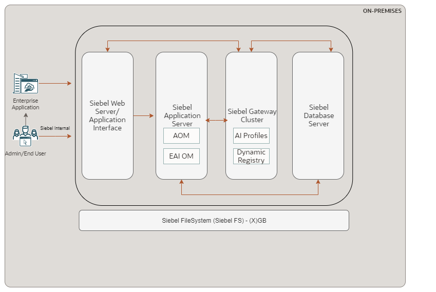

- Include any available diagrams such as current networking architecture.

- Current Siebel environment details (current Production and non-Production environments)

Description of the current Siebel environment

  - Integration (with SaaS, other 3rd party applications like Genesys, Billing, core banking)
  - Authentication (SSO, interface with Oracle Access Manager, LDAP like OID or Microsoft AD etc)
  - Shared File System with other environments if any (with other non-production environment or 3rd party applications)

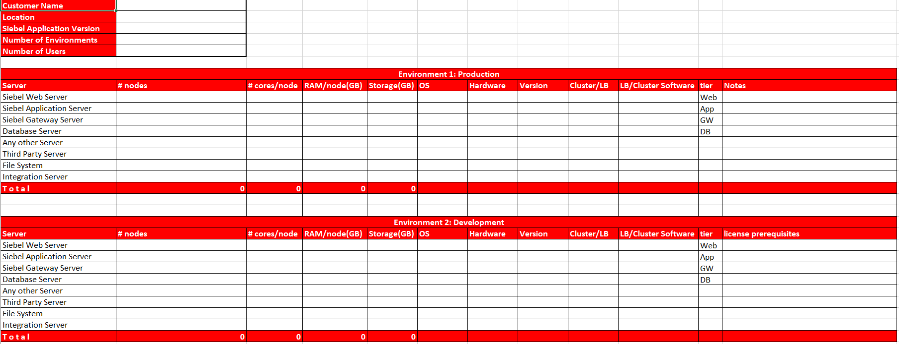

OR

The following information has been provided from answers to the Discovery Questionnaire:

<!--SAMPLE-->

_Database Tier_

- Database Version: 12.1.0.2.0
- Source Operating System Version and Release: Oracle Linux Server release 7.9
- Database size (in GB): 280
- DB Character set on source: AL32UTF8
- Oracle RAC configured: No
- Disaster recover plan/solution in place? No

_Siebel Application Tier_

- Oracle Siebel Version: IP15
- Source Operating System Version and Release: Oracle Linux Server release 7.9
- Number of application nodes: Single Node
- What languages other than English are installed on Siebel, if any? None
- Load balancer implemented ? Yes, F5
- DMZ setup or any external tiers: No
- Single Sign On implemented: No
- SSL implemented: Yes, terminated at F5 load balancer
- Siebel is integrated with any other Oracle Products like OBIEE/SOA/IDM...etc.

## Future State Architecture

### Oracle Cloud Infrastructure Overview (OCI)
<!-- GUIDANCE -->
<!--OCI Cloud Infrastructure Overview to be tailored to match any BOM differences - e.g. database on Compute rather than DBCS, RAC etc. Covers the features that will be diagrammed and described later-->

#### Foundation

The following are foundational OCI features.

__Tenancy__

When you sign up for Oracle Cloud Infrastructure, Oracle creates a tenancy for you in one of the available Commercial or Government Regions. This is your home region.

__Region__

An Oracle Cloud Infrastructure Region is a localized geographic area that contains one or more data centers, called availability domains. Regions are independent of other regions, and vast distances can separate them (across countries or even continents).

The resources in this architecture are deployed in either the Home Region of Frankfurt or Amsterdam.

__Availability Domain__

Availability Domains (AD) are standalone, independent data centres within a Region. The physical resources in each availability domain are isolated from the resources in the other availability domains, which provides fault tolerance. Availability Domains don’t share infrastructure such as power or cooling, or the internal Availability Domain network. So, a failure at one Availability Domain is unlikely to affect the other availability domains in the Region.

__Fault Domain__

A Fault Domain is a logical grouping of hardware and infrastructure within an Availability Domain to provide isolation of resources in case of hardware failure or unexpected software changes. Fault domains enable you to distribute your compute instances so that they are not on the same physical hardware within a single Availability Domain, thereby introducing another layer of fault tolerance. In addition to host anti-affinity, you get a level of power anti-affinity since the physical hardware has independent and redundant power supplies preventing power faults within a Fault Domain from affecting other Fault Domains.

Fault Domains can protect your application against unexpected hardware failures or outages caused by maintenance on the underlying compute hardware. Additionally, you can launch instances of all shapes within a Fault Domain. Every Availability Domain generally has three Fault Domains. If you don’t specify a Fault Domain, an instance will be distributed *automatically* in one of the three Fault Domains within that Availability Domain.

#### Identity and Access Management (IAM)

Oracle Cloud Infrastructure Identity and Access Management (IAM) provides identity and access management features such as authentication and authorization. The following are included in IAM.

__Users__

An individual employee or system that needs to manage or use your company's Oracle Cloud Infrastructure resources. Users might need to launch instances, work with your virtual cloud network, etc. Users have one or more IAM credentials. End users of your application are not typically IAM users.

__Group__

A collection of users who all need the same type of access to a particular set of resources or compartment. A user can belong to many Groups.

__Compartment__

A collection of related resources. Compartments are a fundamental component of Oracle Cloud Infrastructure for organising and isolating your cloud resources. You use them to clearly separate resources for the purposes of measuring usage and billing, access (through the use of policies), and isolation (separating the resources for one project or business unit from another).

Your Tenancy is created with the root Compartment that holds all Customer resources. A default Compartment to connect the PaaS services (ManagedCompartmentForPaaS) is also automatically provisioned.

It is best practice to create a hierarchy of Compartments under the root compartment to organise and isolate your cloud resources, e.g. separate Compartments for Network, E-Business Suite environment etc.

Further details about IAM are available in the [IAM documentation](https://docs.oracle.com/en-us/iaas/Content/Identity/home.htm)

__Policy__

A document that specifies who can access which resources, and how. You can write policies to control access to all of the services within Oracle Cloud Infrastructure. Access is granted at the group and compartment level, which means you can write a policy that gives a group a specific type of access within a specific compartment, or to the tenancy itself. If you give a group access to the tenancy, the group automatically gets the same type of access to all the compartments inside the tenancy. For more information, see Example Scenario and How Policies Work. The word "policy" is used by people in different ways: to mean an individual statement written in the policy language; to mean a collection of statements in a single, named "policy" document (which has an Oracle Cloud ID (OCID) assigned to it); and to mean the overall body of policies your organization uses to control access to resources.

__Home Region__

The region where your IAM resources reside. All IAM resources are global and available across all regions, but the master set of definitions reside in a single region, the home region. You must make changes to your IAM resources in your home region. The changes will be automatically propagated to all regions. For more information, see Managing Regions.

__IAM Relationships__

The following diagrams shows the relationship between the IAM components outlined above:

#### Networking

Networking is the cornerstone of an OCI architecture and a unique characteristic of OCI Gen2 cloud. In simple terms Oracle offers to customers a flat network topology built on a highly scalable physical network which is not oversubscribed. Storage and network IO is moved out of the hypervisor into the custom firmware on the physical NICs (Network Interface Card), and that enables lower overhead.

This off-box network is virtualized separately to the infrastructure and the “Oracle Code” and that gives customers a guaranteed maximum of 2 hops between any services which ran on Oracle Network Fabric and protection from issues like the “noisy-neighbour”.

Below is a summary of the basic components that are considered in a network design:

- __Virtual cloud network (VCN)__: A VCN is a software-defined network that you set up in the Oracle Cloud Infrastructure data centers in a particular region. VCNs are segmented into subnets in which elements are registered. Both subnets and VCNs are protected via the mechanisms of Route Table, Security List and Network Security Groups. Any connection outside a VCN is established via the structure of __Gateways__:

- __NAT Gateway__: Instances in a private subnet don't have public IP addresses. With the NAT gateway, they can initiate connections to the internet and receive responses, but not receive inbound connections initiated from the internet.
- __Service Gateway__: A service gateway lets your virtual cloud network (VCN) privately access specific Oracle services without exposing the data to the public internet. No internet gateway or NAT is required to reach those specific services. The resources in the VCN can be in a private subnet and use only private IP addresses. The traffic from the VCN to the Oracle service travels over the Oracle network fabric and never traverses the internet
- __Dynamic Routing Gateway (DRG)__: The DRG is a virtual router that provides a path for private network traffic between VCNs, or a network outside the region, an on-premises network, or a network with another cloud provider such as AWS or Azure.
- __Local Peering Gateway (LPG)__: LPGs enable to peer one VCN with another VCN in the same region. Peering means the VCNs communicate using private IP addresses, without the traffic traversing the internet or routing through your on-premises network. This feature can still be used, however best practice is to now use the upgraded DRG for this as it simplifies the network configuration. LPG is now only needed for extreme low latency requirements.

- __Load Balancer__: A load balancer improves resource utilization, facilitates scaling, and helps ensure high availability. The Oracle Cloud Infrastructure Load Balancing service provides automated traffic distribution from one entry point to multiple servers reachable from the VCN. In OCI this is a managed service. It offers a load balancer with your choice of a public or private IP address, and provisioned bandwidth.

A load balancer (LB) protects backends, improves resource utilisation (SSL-offloading), facilitates scaling, and helps ensure high availability. A customer can configure multiple load balancing policies and application-specific “health checks” to ensure that the load balancer directs traffic only to healthy instances. The load balancer can reduce the customer's maintenance window by draining traffic from an unhealthy application server before it is removed from service for maintenance.

Flexible Shapes allow you to specify minimum and maximum values to create an upper and lower size range for the load balancer's bandwidth shape. Possible sizes range from 10 Mbps to 8000 Mbps. Existing Dynamic Shapes users can upgrade their load balancers to take advantage of this new feature.

For additional information see the [public documentation](https://docs.oracle.com/en-us/iaas/Content/Balance/Concepts/balanceoverview.htm) online.

Each Load Balancer has different entry points to further route traffic to specific back-end servers and ports in OCI. These are called backend sets. The Load Balancers will not do SSL tunnelling for the HTTP traffic, but terminate the SSL traffic from the client. The traffic between the Load Balancer and the backend host(s) will therefore not be encrypted.

- __Subnet__: A subnet is a segment of a VCN and any online OCI resource is associated with a specific subnet. A subnet reserves a subset (less significant bits) of the IP addresses allocated to the VCN (following the CIDR notation), can be specific to an Availability Domain or to a region (regional subnet), can be private or public (accessible by Internet) and is secured with the Security List and Routing Table components.

- __Security List (SL)__: Each subnet and/or host will have security rules that specify the source, destination, and type of traffic that must be allowed in and out of the subnet. In simple terms an SL is a virtual firewall for each subnet/VCN controlling ingress and egress traffic.

The [Siebel Security List documentation](https://docs.oracle.com/en/solutions/learn-architecture-deploy-siebel/index.html#GUID-08AE773F-0AD6-45CB-95FA-080456833291) provides the blueprint of the Security List entries required for the Siebel Load Balancer, Application and Database tiers. This will be used during implementation and Security Lists created with the actual implementation values. For additional information about Security Lists see the [public documentation](https://docs.oracle.com/en-us/iaas/Content/Network/Concepts/securitylists.htm#Security_Lists) online.

- __Route Table__: Virtual route table contain rules to route traffic from subnets to destinations outside a VCN, typically through gateways. For additional information on Route Tables see the [public documentation](https://docs.oracle.com/en-us/iaas/Content/Network/Tasks/managingroutetables.htm) online.

- __Network Security Group (NSG)__: Network security groups (NSGs) act as a virtual firewall for your Compute instances and other kinds of resources. An NSG consists of a set of ingress and egress security rules that apply only to a set of VNICs of your choice in a single VCN (for example: all the Compute instances that act as web servers in the web tier of a multi-tier application in your VCN). Compared to security lists, NSGs let you separate your VCN's subnet architecture from your application security requirements.

- __VNIC__: A virtual network interface card (VNIC), which attaches to an instance and resides in a subnet to enable a connection to the subnet's VCN. The VNIC determines how the instance connects with endpoints inside and outside the VCN. Each instance has a primary VNIC that's created during instance launch and cannot be removed. You can add secondary VNICs to an existing instance (in the same availability domain as the primary VNIC), and remove them as you like. Each secondary VNIC can be in a subnet in the same VCN as the primary VNIC, or in a different subnet that is either in the same VCN or a different one.

- __Private IP__: A private IPv4 address and related information for addressing an instance (for example, a hostname for DNS). Each VNIC has a primary private IP, and you can add and remove secondary private IPs.

- __Public IP__: A public IPv4 address and related information. You can optionally assign a public IP to your instances or other resources that have a private IP. Public IPs can be either ephemeral or reserved.

- __VPN Connect__: VPN Connect provides site-to-site IPsec VPN connectivity between your on-premises network and VCNs in Oracle Cloud Infrastructure. The IPsec protocol suite encrypts IP traffic before the packets are transferred from the source to the destination and decrypts the traffic when it arrives.

- __FastConnect__: Oracle Cloud Infrastructure FastConnect provides an easy way to create a dedicated, private connection between your data center and Oracle Cloud Infrastructure. FastConnect provides higher-bandwidth options, and a more reliable and consistent networking experience compared to internet-based connections.

#### Connectivity with On-Premises

Site-to-Site VPN offers connection from a customer's on premise infrastructure to OCI by using IPSec VPN Connect OCI native setup. Oracle Cloud Infrastructure FastConnect, can be considered for future use for any production workloads implemented in OCI that require higher bandwidth and lower latency and direct internal use.

In order to make easier the setup of a site-to-site VPN between on-premises an Oracle Cloud, Oracle provides comprehensive documentation and guidance as well as sample configurations for most common customer premises devices:

- [VPN Connect Quickstart](https://docs.oracle.com/en-us/iaas/Content/Network/Tasks/quickstartIPsec.htm#VPN_Connect_Quickstart) - a guided, step-by-step process in the Console that sets up the VPN
- [CPE Configuration Helper](https://docs.oracle.com/en-us/iaas/Content/Network/Tasks/CPEconfigurationhelper.htm#Using_the_CPE_Configuration_Helper) - a tool in the Oracle Console that generates a set of content that the network engineer can use when configuring the CPE
- [Verified CPE Devices](https://docs.oracle.com/en-us/iaas/Content/Network/Reference/CPElist.htm#Verified_CPE_Devices) - configurations and instructions for most common devices and vendors.
- [Supported IPSec Parameters](https://docs.oracle.com/en-us/iaas/Content/Network/Reference/supportedIPsecparams.htm#Supported_IPSec_Parameters) - lists the supported phase 1 (ISAKMP) and phase 2 (IPSec) configuration parameters for Site-to-Site VPN
- [Setting Up VPN Connect](https://docs.oracle.com/en-us/iaas/Content/Network/Tasks/settingupIPsec.htm#Setting_Up_VPN_Connect) - complete instructions for constructing a Site-to-Site VPN IPSec connection from an on-premises network to your VCN

#### Compute

The Oracle Cloud Infrastructure Compute service enables you provision and manage compute hosts in the cloud. You can launch compute instances with shapes that meet your resource requirements (CPU, memory, network bandwidth, and storage). After creating a compute instance, you can access it securely, restart it, attach and detach volumes, and terminate it when you don't need it.

For additional information see the [public documentation](https://docs.oracle.com/en-us/iaas/Content/Compute/Concepts/computeoverview.htm) online. More information on the OS images to be used for the [boot volumes](https://docs.oracle.com/en-us/iaas/Content/Block/Concepts/bootvolumes.htm) can be found [here](https://docs.oracle.com/en-us/iaas/Content/Compute/References/images.htm).

#### Database Service

Oracle Cloud Infrastructure offers single-node database systems on either bare metal or virtual machines, and 2-node RAC database systems on virtual machines, ExaCS and ADB-D/ADB-S

All single-node DB systems support the following Oracle DBCS editions: Standard Edition, Enterprise Edition (EE), EE - High Performance, EE - Extreme Performance. Two-node Oracle RAC DB systems require Oracle Enterprise Edition - Extreme Performance which includes the Real Application Clusters license.

Each database will be single node, [for information see](https://docs.oracle.com/en-us/iaas/Content/Database/Concepts/overview.htm) with ASM as the Storage Management option. By default, the database listener runs on port 1521.

The Database Service uses its own hidden default Object Storage when employing the [built-in backup capabilities](https://docs.oracle.com/en-us/iaas/Content/Database/Tasks/backingupOS.htm#Backing_Up_a_Database_to_Oracle_Cloud_Infrastructure_Object_Storage) for scheduling automated backups. The DB automatic backup configuration is defined in the deployment section of this design. However many customers prefer a more flexible scheduling or want to have access to the backups from outside the DB Service. The DB backup bucket will be created for this purpose.

A DB System in DBCS can be [easily scaled](https://docs.oracle.com/en-us/iaas/Content/Database/Tasks/managingDBsystem.htm)

**Please consider changing the above for ExaCS and ADB**

#### Object Storage

Object storage provides quick access to large amounts of structured and unstructured data of any content type, including database backups, analytic data, and rich content such as images and videos. Use standard storage for "hot" storage that you need to access quickly, immediately, and frequently. Use archive storage for "cold" storage that you retain for long periods of time and seldom or rarely access.

All data in Object Storage is encrypted at rest by using AES-256. Encryption is on by default and cannot be turned off. Each object is encrypted with its own encryption key, and the object encryption keys are encrypted with a master encryption key.

Object Storage is inherently a highly durable storage service. All the objects are redundantly stored on multiple storage servers within a region. In each region, data is automatically distributed across availability domains and fault domains to maximize durability. Data integrity is continuously monitored by using checksums, and corrupt data is healed in the background without impact to usability. These native object storage durability characteristics eliminate the need for traditional backups. Object Storage is highly reliable and designed for 99.9% availability.

Further details about Object Storage are available in the [OCI documentation](https://docs.oracle.com/en-us/iaas/Content/Object/home.htm)

#### Block Storage

The OCI Block Storage lets you dynamically provision and manage persistent block storage volumes. You can create, attach, connect, backup and move or clone volumes, as well as change volume performance, as needed, to meet your storage, performance, and application requirements. After you attach and connect a volume to an instance, you can use the volume like a regular hard drive. You can also disconnect a volume and attach it to another instance without the loss of data.

A common usage of Block Volume is adding storage capacity to an OCI Compute Instance. After you have launched an instance and set up your cloud network, you can create a block storage volume through the Console or API. Then, you attach the volume to an instance using a volume attachment. After the volume is attached, you connect to the volume from your instance's guest OS using iSCSI . The volume can then be mounted and used by your instance. This process can also be scripted and automated using e.g. Terraform and the Resource Manager Service.

Currently, Block Volumes can be created in sizes ranging from 50 GB to 32 TB in 1 GB increments. The current maximum of block volumes attached per compute instance is 32 (thirty-two).

_Block Volume backups_

The backups feature of the Oracle Cloud Infrastructure Block Volume service lets you make a point-in-time snapshot of the data on a block volume. You can make a backup of a volume when it is attached to an instance or while it is detached. These backups can then be restored to new volumes either immediately after a backup or at a later time that you choose.

The backup volume provides a reliable copy of your data and enables you to successfully complete DR within the same region. You can perform manual backups or implement automated policy-driven backups. For durability of data, multiple copies of data are stored redundantly across multiple storage servers within an availability domain. To protect against the impact of the failure or unavailability of an availability domain, we _recommend_ making regular backups to a _remote region_.

Oracle provides three standard levels of Block Volume backup:

- Bronze - Monthly incremental backups. At midnight on the 1st of the month. Retain 12 months. Yearly full backups. At midnight January 1. Retain 5 years.
- Silver - Weekly incremental backups. At midnight Sunday. Retain 4 weeks. Monthly incremental backups. At midnight on the 1st of the month. Retain 12 months. Yearly full backups. At midnight January 1. Retain 5 years.
- Gold - Daily incremental backups at midnight. Retain 7 days. Weekly incremental backups. At midnight Sunday. Retain 4 weeks. Monthly incremental backups. At midnight on the 1st of the month. Retain 12 months. Yearly full backups. At midnight January 1. Retain 5 years.

_Cloning Volumes_

You can easily create a clone from a volume using the Block Volume service. Cloning enables you to make a copy of an existing block volume without needing to go through the backup and restore process.

A cloned volume is a point-in-time direct disk-to-disk deep copy of the source volume, so all the data that is in the source volume when the clone is created is copied to the clone volume. Any subsequent changes to the data on the source volume are not copied to the clone. Since the clone is a copy of the source volume it will be the same size as the source volume unless you specify a larger volume size when you create the clone.

The Oracle Cloud Infrastructure Block Volume service lets you expand the size of block volumes and boot volumes after creation. You have several options to increase the size of your volumes.

For additional information on Block Storage see the [public documentation](https://docs.oracle.com/en-us/iaas/Content/Block/Concepts/overview.htm) online.

#### Security

The objective of the security architecture is to enable you to maintain your security posture when running applications in the Oracle Cloud. The following section highlights the security implementation in OCI.

Oracle has designed security into every aspect of our infrastructure to help our customers achieve better protection, isolation and control. We started with taking a unique design approach, separating the network and server environments. This way, if an attack occurs on a VM, we can contain that threat and prevent it from moving to other servers, resulting in better protection and lower risk for customers.

We also hyper-segment our physical network and backend infrastructure for secure isolation between customer instances and backend hosts. Additionally, we’ve implemented hardware-based root of trust, making sure each server is pristine each and every time it is provisioned.

For each customer’s VCN there is a range of defence in depth protections available spanning Open Systems Interconnection model (OSI model) layers 3-7.

VCN: A VCN provides isolation for your workload from any other workload on Oracle Cloud Infrastructure, including your other workloads in a different VCN.

Internal Firewalls: Implement virtual firewalls at the subnet level using VCN Security Lists and Network Security Groups.

Load Balancing Traffic Securely: TLS 1.2 is supported by default to securely balance traffic within the implementation and from external connections.

Secure Traffic Between ADs and Regions: Communications between ADs are encrypted with Media Access Control security (MACsec) to prevent layer 2 security threats such as wiretapping, DDoS, intrusion, man-in-the-middle and playback attacks. VCN traffic that travel between regions are either sent over private links or are encrypted.

Secure Connectivity to Public Internet: For security, a VCN has no internet connectivity by default. Therefore, internet bound traffic to / from a VCN must pass through an IGW. Virtual routing tables can be implemented with private IP addresses for use with NAT and 3rd party firewall devices for additional security.

Secure Connectivity Between Your VCN and Data Centre: Traffic can be routed through a DRG for private traffic. It is used with an IPSec VPN or FastConnect connection to establish private connectivity between a VCN and an on-premises or other cloud network.

Bastion Service: Oracle Cloud Infrastructure Bastion provides restricted and time-limited access to target resources that don't have public endpoints.
Bastions let authorised users connect from specific IP addresses to target resources using Secure Shell (SSH) sessions. When connected, users can interact with the target resource by using any software or protocol supported by SSH. Targets can include resources like compute instances and DB systems. The Bastion Service allows access only from IP addresses configured in the CIDR block allowlist. A session must be started in OCI prior to connecting from a client on the allowlist. Each Bastion Service configured targets a single private endpoint IP address. A bastion is associated with a single VCN. You cannot create a bastion in one VCN and then use it to access target resources in a different VCN. Further information about the Bastion Service is available in the [documentation](https://docs.oracle.com/en-us/iaas/Content/Bastion/Concepts/bastionoverview.htm)

Protect Internet-Facing Applications: Oracle provides a Web Application Firewall (WAF) service with 250 pre-defined OWASP and compliance rules. Oracle Cloud Infrastructure WAF acts as a reverse proxy that inspects all traffic flows or requests before they arrive at the origin web application. It also inspects any request going from the web application server to the end user. Additionally, Oracle’s optional global 'anycast' DNS service also takes advantage of DNS-based DDoS protections providing resiliency at the DNS layers. (WAF is not in the Bill of Materials but is recommended - see Additional Recommendations section).

Cloud Guard: Oracle Cloud Guard is an Oracle Cloud Infrastructure service that helps customers monitor, identify, achieve, and maintain a strong security posture on Oracle Cloud. Use the service to examine your Oracle Cloud Infrastructure resources for security weakness related to configuration, and your operators and users for risky activities. Upon detection, Cloud Guard can suggest, assist, or take corrective actions, based on your configuration. Oracle-managed detector recipes are provided. You can read more about Cloud Guard [here](https://docs.oracle.com/en-us/iaas/cloud-guard/using/index.htm).

Vulnerability Scanning: Oracle Vulnerability Scanning Service helps improve your security posture in Oracle Cloud by routinely checking hosts for potential vulnerabilities. The service generates reports with metrics and details about these vulnerabilities. Documentation about the Vulnerability Scanning Service can be found in the [documentation](https://docs.oracle.com/en-us/iaas/scanning/using/overview.htm).

Multi-Factor Authentication (MFA): requires the use of more than one factor to verify a user’s identity. With MFA enabled in Identity and Access Management, when a user signs in to OCI (i.e. not Siebel where users authenticate via the OAM/OUD flow), they are prompted for their user name and password, which is the first factor (something that they know). The user is then prompted to provide a second verification code from a registered MFA device, which is the second factor (something that they have). The two factors work together, requiring an extra layer of security to verify the user’s identity and complete the sign-in process. OCI supports two-factor authentication using a password (first factor) and a device that can generate a time-based one-time password (TOTP) (second factor). MFA is enabled for a specific user and for a specific device. The procedure to enable MFA for a user includes the registration of the mobile device. This same device must be used to generate the time-based one-time passcode every time the user signs in. If the registered mobile device becomes unavailable, an administrator must disable MFA for the user so that MFA can be re-enabled with a new device. Only the user can enable MFA. Oracle Mobile Authenticator and Google Authenticator are supported mobile apps for this purpose. Enabling MFA is considered a best practice, particularly for administrators. Documentation about MFA can be found [here](https://docs.oracle.com/en-us/iaas/Content/Identity/Tasks/usingmfa.htm)

Further details about OCI security can be found in the [OCI Security Guide](https://docs.oracle.com/en-us/iaas/Content/Security/Concepts/security_guide.htm)

#### Data Security

The following data security features are applicable:

_Block Storage Encryption_

The Oracle Cloud Infrastructure Block Volume service always encrypts all block volumes, boot volumes, and volume backups at rest by using the Advanced Encryption Standard (AES) algorithm with 256-bit encryption. By default all volumes and their backups are encrypted using the Oracle-provided encryption keys. Each time a volume is cloned or restored from a backup the volume is assigned a new unique encryption key. For more information, see [Block Volume Encryption](https://docs.oracle.com/en-us/iaas/Content/Block/Concepts/overview.htm#BlockVolumeEncryption).

_Database Storage Encryption_

All PaaS databases created in Oracle Cloud Infrastructure are encrypted using Transparent Data Encryption (TDE). TDE is provided free of charge for PaaS databases regardless of the DBCS Edition.

_Database Backup Encryption_

Oracle recommends using Managed backups (a.k.a Automatic Backups; backups created using the Oracle Cloud Infrastructure Console or the API) whenever possible. When you use managed backups, Oracle manages the object store user and credentials, and rotates these credentials every 3 days. Oracle Cloud Infrastructure encrypts all managed backups in the object store. Oracle uses the Database Transparent Encryption feature by default for encrypting the backups. For more information see the [Database Security documentation](https://docs.oracle.com/en-us/iaas/Content/Security/Reference/dbaas_security.htm)

_Object Storage Encryption_

All data in Object Storage is encrypted at rest by using AES-256. Encryption is on by default and cannot be turned off. Each object is encrypted with its own encryption key, and the object encryption keys are encrypted with a master encryption key. In addition, customers can use client-side encryption to encrypt objects with their encryption keys before storing them in Object Storage buckets. For more information, see [Securing Object Storage](https://docs.oracle.com/en-us/iaas/Content/Security/Reference/objectstorage_security.htm)

#### Management and Monitoring

OCI can provide metrics automatically for many of the native resources. There is no need to install an agent on a block storage volume or VCN, as these resources will emit predefined metrics on their own.

The following table lists some of the different kinds of metrics and logs that can be collected and used in monitoring the proposed solution:

|Components| Logs/Metrics |Agent Based |Types of Data|
|----------|--------------|------------|-------------|
|Audit|Log|No|OCI Audit Log|
|VCN|Metrics|No|VNIC traffic (packets), Security Lists Statistics|
|VCN|Log|No|Flow logs|
|Compute|Metrics|Yes|CPU, Disk, Memory, Network usage|
|Block Storage|Metrics|No|IOPS and throughput|
|Load Balancer|Metrics|No|Typical performance metrics|
|OS|Metrics|Yes|Process information|
|OS|Logs|Yes|Syslogs and other defined logs, Ex: ssh access|
|Database|Metrics|Yes|CPU| Memory, Disk usage, SQL performance|
|Database|Logs|Yes|DB logs, Listener Logs and Audit Logs|
|Application Server|Metrics|Yes|WLS and OHS specific metrics, response times, memory usage etc.|
|Application Server|Logs|Yes|WLS and OHS specific Logs|
|Browser|Metrics|No|Response Time and transaction correlation|

The Oracle Cloud Infrastructure Monitoring service enables you to actively and passively monitor your cloud resources using the Metrics and Alarms features. The Monitoring service uses metrics to monitor resources and alarms to notify you when these metrics meet alarm-specified triggers.

Metrics are emitted to the Monitoring service as raw data points, or timestamp-value pairs, along with dimensions and metadata. Metrics come from a variety of sources. Metric data posted to the Monitoring service is only presented to you or consumed by the Oracle Cloud Infrastructure features that you enable to use metric data.

For more information please see [the online documentation](https://docs.oracle.com/en-us/iaas/Content/Monitoring/Concepts/monitoringoverview.htm).

To enable monitoring for Compute Instances, please see [here](https://docs.oracle.com/en-us/iaas/Content/Compute/Tasks/enablingmonitoring.htm)

For information on Block Volume Metrics, please see [here](https://docs.oracle.com/en-us/iaas/Content/Block/References/volumemetrics.htm)

For information on Object Storage Metrics, please see [here](https://docs.oracle.com/en-us/iaas/Content/Object/Reference/objectstoragemetrics.htm)

### Logical Architecture
<!-- GUIDANCE -->
<!--Use [System Context Diagram](https://online.visual-paradigm.com/knowledge/system-context-diagram/what-is-system-context-diagram/) to show integration for the Workload solution.

Provide a high-level logical Oracle solution for the complete Workload. Indicate Oracle products as abstract groups, and not as a physical detailed instances. Create an architecture diagram following the latest notation and describe the solution.-->

Provide a Logical representation of the future state architecture. Including high-level products or capabilities and data flows. While this will show which components exist in which locations, it will not show connectivity.

Document the discrete user communities that will be using the defined scope. These communities should be clearly reflected on the logical overview diagram. The number of users of each community should be included, together with any relevant concurrency information i.e. # of internal and # of external users.

Logical architecture in OCI will be depicted here:

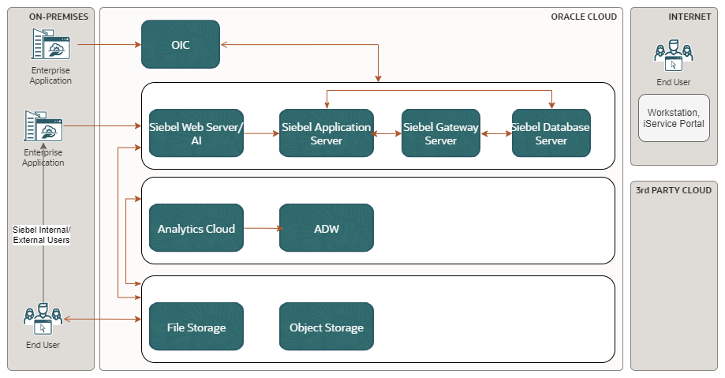

### Physical Architecture
<!--GUIDANCE-->
<!--The Workload Architecture is typically not described in a physical form. If we deliver a Lift project, the scoped Lift Project in chapter 4 includes the physical architecture.

Nevertheless, an architect might want to describe the full physical Workload here, particularly if this is a non-Lift project or if 3rd party implementation partner implement the non Lift environments.-->

<!--Description and high level diagram of the future Siebel environment in Oracle Cloud Infrastructure(OCI). This should detail the datacenter locations, the location of the main components of the architecture, and the connectivity between the locations. Technical details such as Networking, Availability Domains or hardware resource metrics are NOT required in this document.

- If the application is currently accessible via the internet, then this section should cover both the existing method (e.g. VPN etc) and also the proposed method. This section should include a high level connectivity diagram.

- Describe VCN and subnets approach
- SSL will be enabled and terminated at each Load Balancer.
- Storage being used - e.g. Block, File
- Bastion server or Bastion Service
- DR and HA
- Internal and External user tiers-->

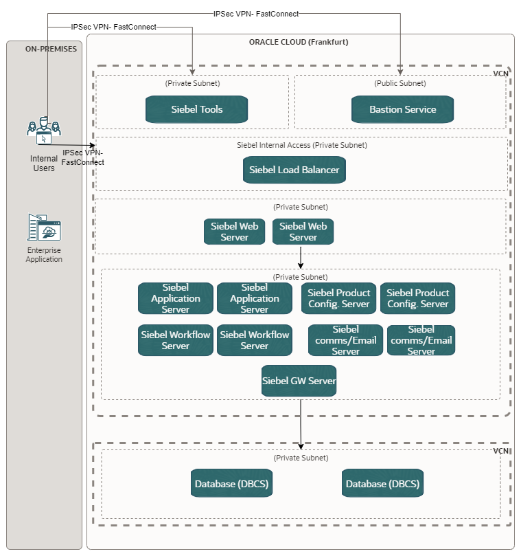
\newpage

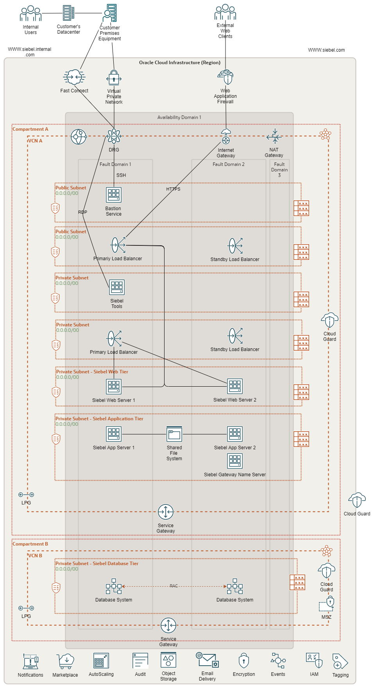
\pagebreak

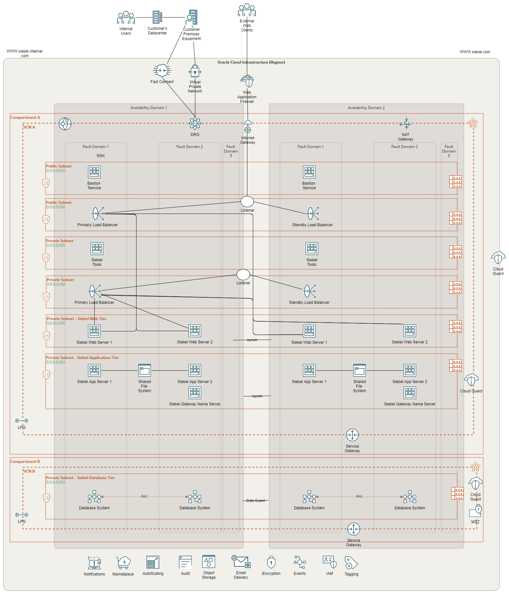
\pagebreak

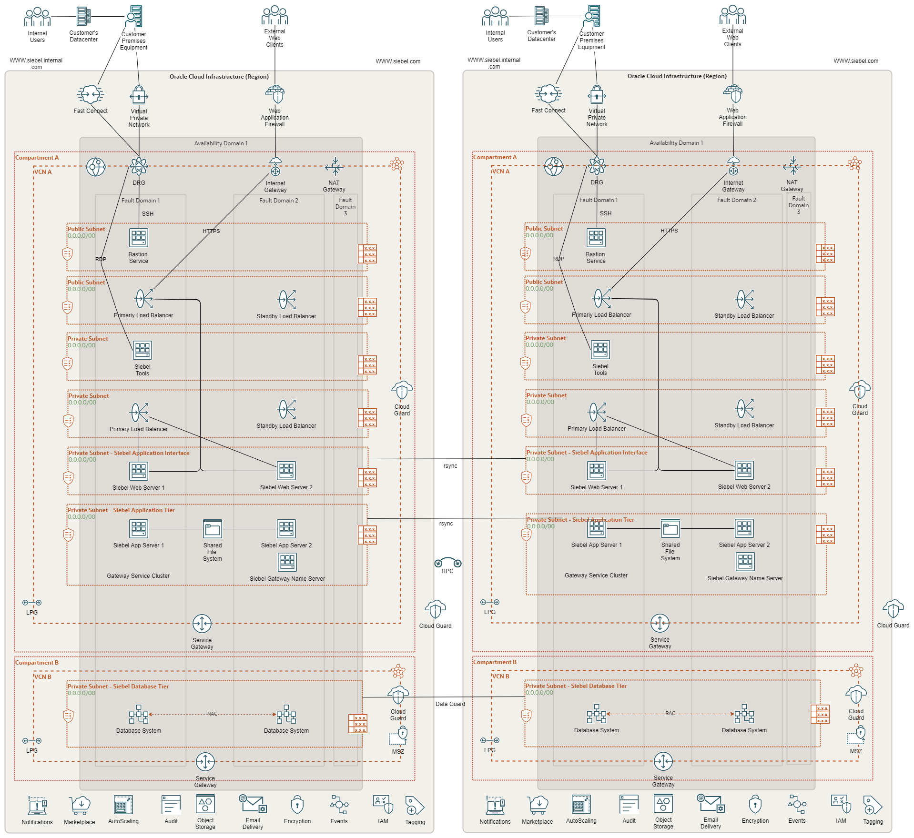
\pagebreak

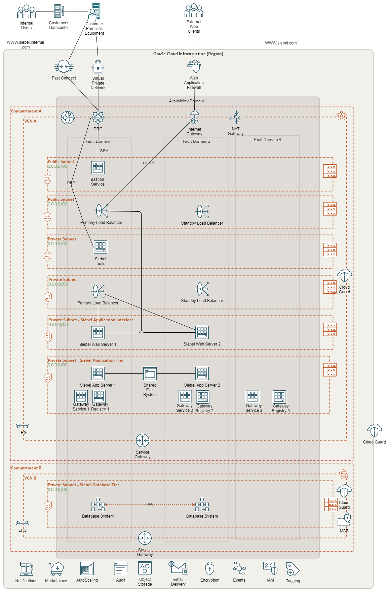
\pagebreak

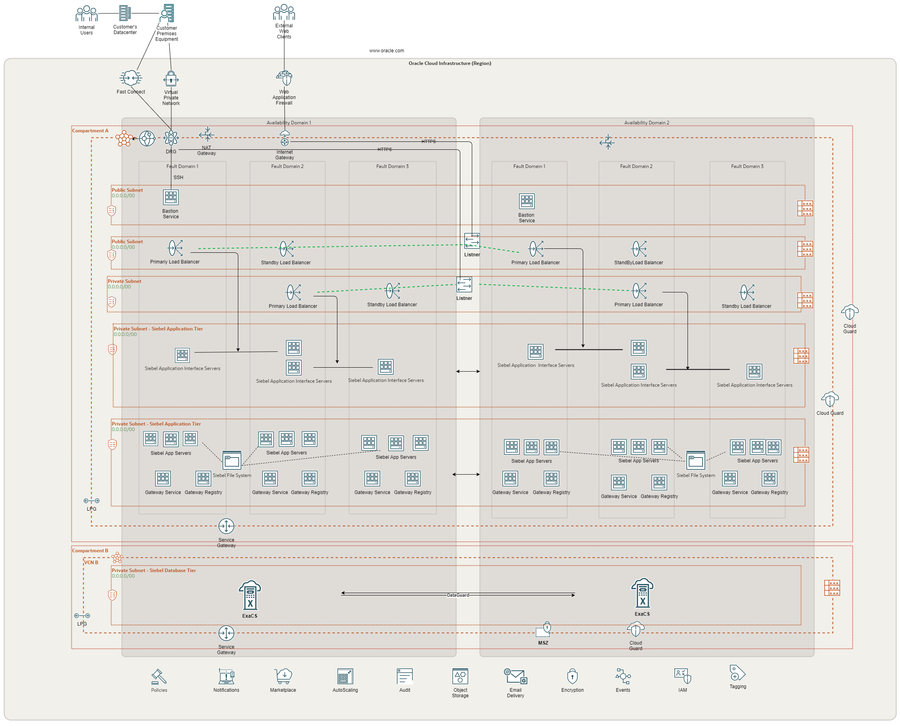
\pagebreak

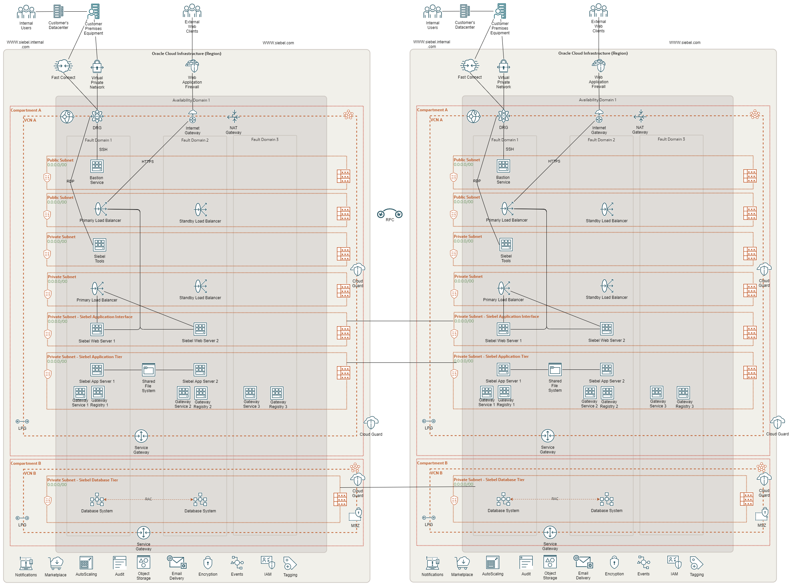
\pagebreak

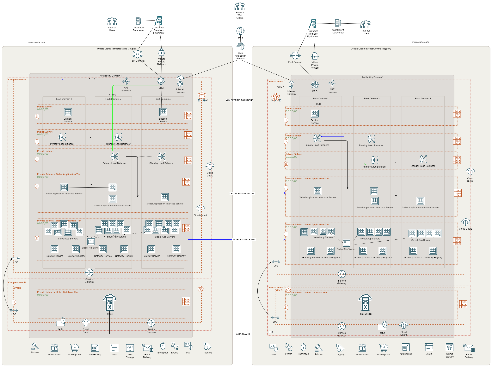
\pagebreak

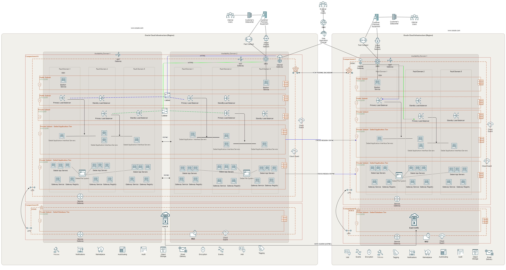

\newpage

<!--In case of a landing zone deployment-->
<!--Build the design of the Siebel solution based on the landing zone recommendations even if we are not deploying it for customers, in the future, it can be deployed with already considered best practices design-->
## OCI Cloud Landing Zone Architecture
<!-- GUIDANCE -->
<!--

Mandatory Chapter

Role  | RACI
------|-----
WLA   | R/A
Impl. | None
PPM   | None
-->

The design considerations for an OCI Cloud Landing Zone have to do with OCI and industry architecture best practices, along with customer specific architecture requirements that reflect the Cloud Strategy (hybrid, multi-cloud, etc). An OCI Cloud Landing zone involves a variety of fundamental aspects that have a broad level of sophistication. A good summary of a Cloud Landing Zone has been published by [Cap Gemini](https://www.capgemini.com/2019/06/cloud-landing-zone-the-best-practices-for-every-cloud/).

### Resource Naming Convention
<!-- GUIDANCE -->
<!--
If the customer provides a resource naming convention use it. They should have it already for their on-premises compute resources.
-->

Oracle recommends the following Resource Naming Convention:

- The name segments are separated by “-“
- Within a name segment avoid using <space> and “.”
- Where possible intuitive/standard abbreviations should be considered (e.g. “shared“ compared to "shared.cloud.team”)
- When referring to the compartment full path, use “:” as separator, e.g. cmp-shared:cmp-security

Some examples of naming are given below:

- cmp-shared
- cmp-\<workload>
- cmp-networking

The patterns used are these:

- \<resource-type>-\<environment>-\<location>-\<purpose>
- \<resource-type>-\<environment>-\<source-location>-\<destination-location>-\<purpose>
- \<resource-type>-\<entity/sub-entity>-\<environment>-\<function/department>-\<project>-\<custom>
- \<resource-type>-\<environment>-\<location>-\<purpose>

Abbreviation per resource type are listed below. This list may not be complete.

| Resource type | Abbreviation | Example |
|---|---|---|
| Bastion Service | bst | bst-\<location>-\<network> |
| Block Volume | blk | blk-\<location>-\<project>-\<purpose>
| Compartment | cmp | cmp-shared, cmp-shared-security |
| Customer Premise Equipment | cpe | cpe-\<location>-\<destination> |
| DNS Endpoint Forwarder | dnsepf | dnsepf-\<location> |
| DNS Endpoint Listener | dnsepl | dnsepl-\<location> |
| Dynamic Group | dgp | dpg-security-functions |
| Dynamic Routing Gateway | drg | drg-prod-\<location>
| Dynamic Routing Gateway Attachment | drgatt | drgatt-prod-\<location>-\<source_vcn>-\<destination_vcn> |
| Fast Connect | fc# <# := 1...n> | fc0-\<location>-\<destination> |
| File Storage | fss | fss-prod-\<location>-\<project> |
| Internet Gateway | igw | igw-dev-\<location>-\<project> |
| Jump Server | js | js-\<location>-xxxxx |
| Load Balancer | lb | lb-prod-\<location>-\<project> |
| Local Peering Gateway | lpg | lpg-prod-\<source_vcn>-\<destination_vcn> |
| NAT Gateway | nat | nat-prod-\<location>-\<project> |
| Network Security Group | nsg | nsg-prod-\<location>-waf |
| Managed key | key | key-prod-\<location>-\<project>-database01 |
| OCI Function Application | fn | fn-security-logs |
| Object Storage Bucket | bkt | bkt-audit-logs |
| Policy | pcy | pcy-services, pcy-tc-security-administration |
| Region Code, Location | xxx | fra, ams, zch # three letter region code |
| Routing Table | rt | rt-prod-\<location>-network |
| Secret | sec | sec-prod-wls-admin |
| Security List | sl | sl-\<location> |
| Service Connector Hub | sch | sch-\<location> |
| Service Gateway | sgw | sgw-\<location> |
| Subnet | sn | sn-\<location> |
| Tenancy | tc | tc |
| Vault | vlt | vlt-\<location> |
| Virtual Cloud Network | vcn | vcn-\<location> |
| Virtual Machine | vm | vm-xxxx |
| | | |

**Note:** Resource names are limited to 100 characters.

#### Group Names

OCI Group Names should follow the naming scheme of the Enterprise Identity Management system for Groups or Roles.

Examples for global groups are:

- \<prefix>-\<purpose>-admins
- \<prefix>-\<purpose>-users

For departmental groups:

- \<prefix>-\<compartment>-\<purpose>-admins
- \<prefix>-\<compartment>-\<purpose>-users

The value for \<prefix> or the full names **must be agreed** with customer.

### Security and Identity Management

This chapter covers the Security and Identity Management definitions and resources which will be implemented for customer.

#### Universal Security and Identity and Access Management Principles

- Groups will be configured at the tenancy level and access will be governed by policies configured in OCI.
- Any new project deployment in OCI will start with the creation of a new compartment. Compartments follow a hierarchy, and the compartment structure will be decided as per the application requirements.
- It is also proposed to keep any shared resources, such as Object Storage, Networks etc. in a shared services compartment. This will allow the various resources in different compartments to access and use the resources deployed in the shared services compartment and user access can be controlled by policies related to specific resource types and user roles.
- Policies will be configured in OCI to maintain the level of access / control that should exist between resources in different compartments. These will also control user access to the various resources deployed in the tenancy.
- The tenancy will include a pre-provisioned Identity Cloud Service (IDCS) instance (the primary IDCS instance) or, where applicable, the Default Identity Domain. Both provide access management across all Oracle cloud services for IaaS, PaaS and SaaS cloud offerings.
- The primary IDCS or the Default Identity Domain will be used as the access management system for all users administrating (OCI Administrators) the OCI tenant.

#### Authentication and Authorization for OCI

Provisioning of respective OCI administration users will be handled by the customer.

##### User Management

Only OCI Administrators are granted access to the OCI Infrastructure. As a good practice, these users are managed within the pre-provisioned and pre-integrated Oracle Identity Cloud Service (primary IDCS) or, where applicable, the OCI Default Identity Domain, of OCI tenancy. These users are members of groups. IDCS Groups can be mapped to OCI groups while Identity Domains groups do not require any mapping. Each mapped group membership will be considered during login.

**Local Users**

The usage of OCI Local Users is not recommended for the majority of users and is restricted to a few users only. These users include the initial OCI Administrator created during the tenancy setup, and additional emergency administrators.

**Local Users are considered as Emergency Administrators and should not be used for daily administration activities!**

**No additional users are to be, nor should be, configured as local users.**

**The customer is responsible to manage and maintain local users for emergency use cases.**

**Federated Users**

Unlike Local Users, Federated Users are managed in the Federated or Enterprise User Management system. In the OCI User list Federated Users may be distinguished by a prefix which consists of the name of the federated service in lower case, a '/' character followed by the user name of the federated user, for example:

`oracleidentityservicecloud/user@example.com`

In order to provide the same attributes (OCI API Keys, Auth Tokens, Customer Secret Keys, OAuth 2.0 Client Credentials, and SMTP Credentials) for Local and *Federated Users* federation with third-party Identity Providers should only be done in the pre-configured primary IDCS or the Default Identity Domain where applicable.

All users have the same OCI-specific attributes (OCI API Keys, Auth Tokens, Customer Secret Keys, OAuth 2.0 Client Credentials, and SMTP Credentials).

OCI Administration user should only be configured in the pre-configured primary IDCS or the Default Identity Domain where applicable.

**Note:** Any federated user can be a member of 100 groups only. The OCI Console limits the number of groups in a SAML assertion to 100 groups. User Management in the Enterprise Identity Management system will be handled by the customer.

**Authorization**

In general, policies hold permissions granted to groups. Policy and Group naming follows the Resource Naming Conventions.

**Tenant Level Authorization**

The policies and groups defined at the tenant level will provide access to administrators and authorized users, to manage or view resources across the entire tenancy. Tenant level authorization will be granted to tenant administrators only.

These policies follow the recommendations of the [CIS Oracle Cloud Infrastructure Foundations Benchmark v1.1.0, recommendations 1.1, 1.2, 1.3](https://www.cisecurity.org/cis-benchmarks).

**Service Policy**

A Service Policy is used to enable services at the tenancy level. It is not assigned to any group.

**Shared Compartment Authorization**

Compartment level authorization for the cmp-shared compartment structure uses the following specific policies and groups.

Apart from tenant level authorization, authorization for the cmp-shared compartment provides specific policies and groups. In general, policies will be designed that lower-level compartments are not able to modify resources of higher-level compartments.

Policies for the cmp-shared compartment follow the recommendations of the [CIS Oracle Cloud Infrastructure Foundations Benchmark v1.1.0, recommendations 1.1, 1.2, 1.3](https://www.cisecurity.org/cis-benchmarks).

**Compartment Level Authorization**

Apart from tenant level authorization, compartment level authorization provides compartment structure specific policies and groups. In general, policies will be designed that lower-level compartments are not able to modify resources of higher-level compartments.

**Authentication and Authorization for Applications and Databases**

Application (including Compute Instances) and Database User management is completely separate of and done outside of the primary IDCS or Default Identity Domain. The management of these users is the sole responsibility of the customer using the application, compute instance and database specific authorization.

#### Security Posture Management

**Oracle Cloud Guard**

Oracle Cloud Guard Service will be enabled using the pcy-service policy and with the following default configuration. Customization of the Detector and Responder Recipes will result in clones of the default (Oracle Managed) recipes.

Cloud Guard default configuration provides a number of good settings. It is expected that these settings may not match with the customer's requirements.

**Targets**

In accordance with the [CIS Oracle Cloud Infrastructure Foundations Benchmark, v1.1.0, Chapter 3.15](https://www.cisecurity.org/cis-benchmarks), Cloud Guard will be enabled in the root compartment.

**Detectors**

The Oracle Default Configuration Detector Recipes and Oracle Default Activity Detector Recipes are implemented. To better meet the requirements, the default detectors must be cloned and configured by the customer.

**Responder Rules**

The default Cloud Guard Responders will be implemented. To better meet the requirements, the default detectors must be cloned and configured by the customer.

**Vulnerability Scanning Service**

In accordance with the [CIS Oracle Cloud Infrastructure Foundations Benchmark, v1.1.0, OCI Vulnerability Scanning](https://www.cisecurity.org/cis-benchmarks) will be enabled using the pcy-service policy.

Compute instances which should be scanned *must* implement the *Oracle Cloud Agent* and enable the *Vulnerability Scanning plugin*.

**OCI OS Management Service**

Required policy statements for OCI OS Management Service are included in the pcy-service policy.

By default, the *OS Management Service Agent plugin* of the *Oracle Cloud Agent* is enabled and running on current Oracle Linux 6 and Oracle Linux 7 platform images.

#### Monitoring, Auditing and Logging

In accordance with the [CIS Oracle Cloud Infrastructure Foundations Benchmark, v1.1.0, Chapter 3 Logging and Monitoring](https://www.cisecurity.org/cis-benchmarks) the following configurations will be made:

- OCI Audit log retention period set to 365 days. See [CIS Oracle Cloud Infrastructure Foundations Benchmark, v1.1.0, Chapter 3.1](https://www.cisecurity.org/cis-benchmarks)
- At least one notification topic and subscription to receive monitoring alerts. See [CIS Oracle Cloud Infrastructure Foundations Benchmark, v1.1.0, Chapter 3.3](https://www.cisecurity.org/cis-benchmarks)
- Notification for Identity Provider changes. [See CIS Oracle Cloud Infrastructure Foundations Benchmark, v1.1.0, Chapter 3.4](https://www.cisecurity.org/cis-benchmarks)
- Notification for IdP group mapping changes. [See CIS Oracle Cloud Infrastructure Foundations Benchmark, v1.1.0, Chapter 3.5](https://www.cisecurity.org/cis-benchmarks)
- Notification for IAM policy changes. See [CIS Oracle Cloud Infrastructure Foundations Benchmark, v1.1.0, Chapter 3.6](https://www.cisecurity.org/cis-benchmarks)
- Notification for IAM group changes. See [CIS Oracle Cloud Infrastructure Foundations Benchmark, v1.1.0, Chapter 3.7](https://www.cisecurity.org/cis-benchmarks)
- Notification for user changes. See [CIS Oracle Cloud Infrastructure Foundations Benchmark, v1.1.0, Chapter 3.8](https://www.cisecurity.org/cis-benchmarks)
- Notification for VCN changes. See [CIS Oracle Cloud Infrastructure Foundations Benchmark, v1.1.0, Chapter 3.9](https://www.cisecurity.org/cis-benchmarks)
- Notification for changes to route tables. See [CIS Oracle Cloud Infrastructure Foundations Benchmark, v1.1.0, Chapter 3.10](https://www.cisecurity.org/cis-benchmarks)
- Notification for security list changes. See [CIS Oracle Cloud Infrastructure Foundations Benchmark, v1.1.0, Chapter 3.11](https://www.cisecurity.org/cis-benchmarks)
- Notification for network security group changes. See [CIS Oracle Cloud Infrastructure Foundations Benchmark, v1.1.0, Chapter 3.12](https://www.cisecurity.org/cis-benchmarks)
- Notification for changes to network gateways. See [CIS Oracle Cloud Infrastructure Foundations Benchmark, v1.1.0, Chapter 3.13](https://www.cisecurity.org/cis-benchmarks)
- VCN flow logging for all subnets. See [CIS Oracle Cloud Infrastructure Foundations Benchmark, v1.1.0, Chapter 3.14](https://www.cisecurity.org/cis-benchmarks)
- Write level logging for all Object Storage Buckets. See [CIS Oracle Cloud Infrastructure Foundations Benchmark, v1.1.0, Chapter 3.17](https://www.cisecurity.org/cis-benchmarks)
- Notification for Cloud Guard detected problems.
- Notification for Cloud Guard remedied problems.

For IDCS or OCI Identity Domain Auditing events, the respective Auditing API can be used to retrieve all required information.

#### Data Encryption

All data will be encrypted at rest and in transit. Encryption keys can be managed by Oracle or the customer and will be implemented for identified resources.

##### Key Management
<!--
Make sure that the correct type of the vault is used:
shared - cheap to moderate pricing
private - expensive pricing
-->

All keys for **OCI Block Volume**, **OCI Container Engine for Kubernetes**, **OCI Database**, **OCI File Storage**, **OCI Object Storage**, and **OCI Streaming** are centrally managed in a shared or a private virtual vault will be implemented and placed in the compartment cmp-security.

**Object Storage Security**

For Object Storage security the following guidelines are considered.

- **Access to Buckets** -- Assign least privileged access for IAM users and groups to resource types in the object-family (Object Storage Buckets & Object)
- **Encryption at rest** -- All data in the Object Storage is encrypted at rest using AES-256 and is on by default. This cannot be turned off and objects are encrypted with a master encryption key.

**Data Residency**

It is expected that data will be held in the respective region and additional steps will be taken when exporting the data to other regions to comply with the applicable laws and regulations. This should be review for every project onboard into the tenancy.

#### Operational Security

**Security Zones**

Whenever possible OCI Security Zones will be used to implement a security compartment for Compute instances or Database resources. For more information on Security Zones refer to the in the *Oracle Cloud Infrastructure User Guide* chapter on [Security Zones](https://docs.oracle.com/en-us/iaas/security-zone/using/security-zones.htm).

**Remote Access to Compute Instances or Private Database Endpoints**

To allow remote access to Compute Instances or Private Database Endpoints, the OCI Bastion will be implemented for defined compartments.

To be able to use OCI services to for OS management, Vulnerability Scanning, Bastion Service, etc. it is highly recommended to implement the Oracle Cloud Agent as documented in the *Oracle Cloud Infrastructure User Guide* chapter [Managing Plugins with Oracle Cloud Agent](https://docs.oracle.com/en-us/iaas/Content/Compute/Tasks/manage-plugins.htm).

#### Network Time Protocol Configuration for Compute Instance

Synchronized clocks are a necessity for securely operating environments. OCI provides a Network Time Protocol (NTP) server using the OCI global IP number 169.254.169.254. All compute instances should be configured to use this NTP service.

#### Regulations and Compliance

The customer is responsible for setting the access rules to services and environments that require stakeholders’ integration to the tenancy to comply with all applicable regulations. Oracle will support in accomplishing this task.

<!--End of Landing Zone section-->

<!--OCI Operations-->
## Operations
<!-- GUIDANCE -->
<!--
In this chapter we provide a high-level introduction to various operations related topics around OCI. We do not design, plan or execute any detailed operations for our customers. We can provide some best practices and workload specific recommendations.

Please visit our Operations Catalogue for more information, best practices, and examples: https://confluence.oraclecorp.com/confluence/pages/viewpage.action?pageId=3403322163

The below example text represents the first asset from this catalogue PCO#01. Please consider including other assets as well. You can find MD text snippets within each asset.

Recommended Chapter

Role  | RACI
------|-----
WLA   | R/A
Impl. | None
PPM   | None
-->

This chapter provides an introduction and collection of useful resources, to relevant topics to operate the solution on Oracle Infrastructure Cloud.

Cloud Operations Topic                       | Short Summary      | References
:---                                         |:------             |:---
Cloud Shared Responsibility Model            | The shared responsibility model conveys how a cloud service provider is responsible for managing the security of the public cloud while the subscriber of the service is responsible for securing what is in the cloud.	                |  [Shared Services Link](https://www.oracle.com/a/ocom/docs/cloud/oracle-ctr-2020-shared-responsibility.pdf)
Oracle Support Portal	                       | Search Oracle knowledge base and engage communities to learn about products, services, and to find help resolving issues.	   |  [Oracle Support Link](https://support.oracle.com/portal/)
Support Management API	                     | Use the Support Management API to manage support requests	  |  [API Documentation Link](https://docs.oracle.com/en-us/iaas/api/#/en/incidentmanagement/20181231/) and [Other OCI Support Link](https://docs.oracle.com/en-us/iaas/Content/GSG/Tasks/contactingsupport.htm)
OCI Status	                                 | Use this link to check the global status of all OCI Cloud Services in all Regions and Availability Domains.	  |  [OCI Status Link](https://ocistatus.oraclecloud.com/)
Oracle Incident Response	                   | Reflecting the recommended practices in prevalent security standards issued by the International Organization for Standardization (ISO), the United States National Institute of Standards and Technology (NIST), and other industry sources, Oracle has implemented a wide variety of preventive, detective, and corrective security controls with the objective of protecting information assets.	  |  [Oracle Incident Response Link](https://ocistatus.oraclecloud.com/)
Oracle Cloud Hosting and Delivery Policies   | Describe the Oracle Cloud hosting and delivery policies in terms of security, continuity, SLAs, change management, support, and termination.	  |  [Oracle Cloud Hosting and Delivery Policies](https://www.oracle.com/us/corporate/contracts/ocloud-hosting-delivery-policies-3089853.pdf)
OCI SLAs                                     | Mission-critical workloads require consistent performance, and the ability to manage, monitor, and modify resources running in the cloud at any time. Only Oracle offers end-to-end SLAs covering performance, availability, manageability of services. This document applies to Oracle PaaS and IaaS Public Cloud Services purchased, and supplements the Oracle Cloud Hosting and Delivery Policies | [OCI SLA's](https://www.oracle.com/cloud/sla/) and [PDF Link](https://www.oracle.com/assets/paas-iaas-pub-cld-srvs-pillar-4021422.pdf)

<!-- END of OCI Operations Section-->

## Bill of Materials
<!-- GUIDANCE -->
<!--
Estimate and size the physical needed resources of the Workload. The information can be collected and is based upon previously gathered capacities, business user numbers, integration points, or translated existing on-premises resources. The sizing is possibly done with or even without a Physical Architecture. It is ok to make assumptions and to clearly state them!

Clarify with sales your assumptions and your sizing. Get your sales to finalize the BoM with discounts or other sales calculations. Review the final BoM and ensure the sales is using the correct product SKU's / Part Number.

Even if the BoM and sizing was done with the help of Excel between the different teams, ensure that this chapter includes or links to the final BoM as well.

Price Lists and SKU's / Part Numbers: https://esource.oraclecorp.com/sites/eSource/ESRCHome-->

This section should list all the Oracle software components that are in the proposed target architecture.

For each component of the system, this section captures the existing sizing, plus any additional sizing requirements that the customer might have (e.g. where the customer wishes to extend or expand an existing system). This should include :
- A list of all database storage sizes
- All servers with CPU type and counts
- Any file-system storage required

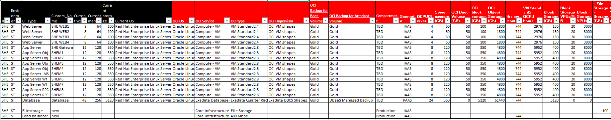

###  Future Environment components

Component	|	Qty	|	Note
--- | --- | ---
Virtual Cloud Network |	3	| Stress Testing Environment
Subnets  |  6  | 1 x Siebel Tools, 1 regional x LBaaS, 1 x web tier, 1 x Application/GW tier, 1 x DB tier , 1 Palo Alto VM Series
Bastion Service  |  1  | 1 x Bastion Service for remote access  |   |
Load Balancer  | 1 x Siebel LBaaS  |  400 Mbps SSL Offloading/Termination
Service Gateway  | 1  | Connect to object storage for backups
NAT gateway  | 1 | Outbound WWW connectivity
Exadata Cloud Services  | 2 | RAC
Web servers  | 4 | VM.Standard.E4.Flex
Gateway server  | 1  | VM.Standard.E4.Flex
Application Servers  | 9 |  VM.Standard.E4.Flex

#### Specific Technical Information

- [Siebel Enterprise Architecture](https://confluence.oraclecorp.com/confluence/display/CRMODDG/Siebel+Enterprise+Architecture)
- [Suggested Learning Paths for Siebel CRM](https://confluence.oraclecorp.com/confluence/display/OCUPM/Siebel+CLS+Learning+Path+Reference)
- [Siebel CRM Bookshelf](https://www.oracle.com/documentation/siebel-crm-libraries.html)
- [Siebel CRM Releases Information](https://my.oracle.com/site/ibu/abu/CRM2/ProductLines/SiebelCRM/ip/index.html?ssSourceNodeId=44522&ssSourceSiteId=ibu)
- [Siebel Virtual Summit 2020](https://go.oracle.com/OracleSiebelCRMVirtualSummit#sep29oct01)
- [Siebel Virtual Summit 2021](https://oradocs-prodapp.cec.ocp.oraclecloud.com/documents/folder/F067C8AE1C8E61E909E8E27CD9F4A45A8AAB84D20FD1/_Siebel_Virtual_Summit_2021)
- [Learn About Deploying Siebel CRM on Oracle Cloud Infrastructure](https://docs.oracle.com/en/solutions/infrastructure-components-siebel/index.html#GUID-D6F99470-2253-4544-8C6A-0BE54BDA54FD)
- [Siebel Cloud Manager](https://docs.oracle.com/cd/F26413_43/books/DeploySCM/index.html#id0894FK005PF)

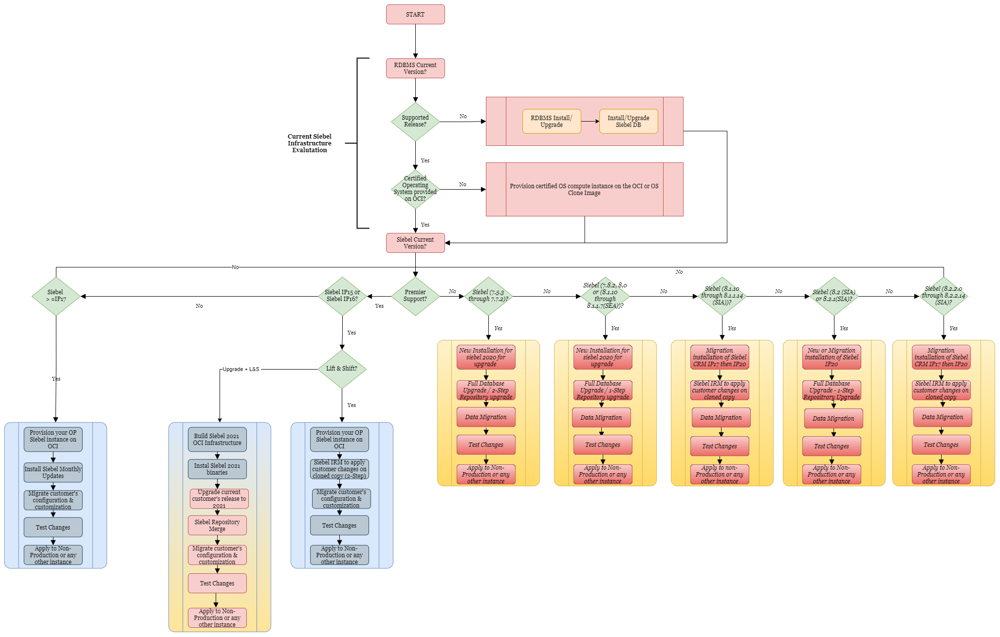

##### Use Case 1: Customers on Siebel CRM IP2017 onwards
1. Target Upgrade update is Siebel Siebel 21.x
2. Neither an Incremental Repository Merge nor a Database Upgrade is required for Siebel CRM 17.0 or later)
3. Quick Provisioning (available now on Oracle Marketplace).
4. Lift and Shift tooling:
   1. Clone existing instances to the Oracle Cloud
   2. Install "Monthly updates" to the cloned copy.
   3. Test changes, etc.
   4. Apply changes to Non-Production.

##### Use Case 2: Customers on Siebel CRM IP2015 or IP2016
1. Target Upgrade update is Siebel 21.x
2. Quick Provisioning (available now on Oracle Marketplace)
3. Lift and Shift tooling:
   1. Clone existing instances to the Oracle Cloud
   2. Use Siebel IRM to apply customer changes to cloned copy (__two Step migration__: IP17 and then Siebel 21)
   3. Test changes, etc.
   4. Apply changes to Production

##### Use Case 3: Customers on Sustaining or Extended support release (7.5, 7.7, 7.8, 8.0, 8.1, 8.1)
1. Option 1: Migrate your application into Partner/Oracle Managed Cloud Service (OMCS) Hosting
2. Option 2: Upgrade to IP2020 using Partner/OMCS upgrade services
    1. Target Upgrade update is Siebel Siebel 21.x
    2. New or Migration installation of Siebel 21.x
    3. Single-Step or Two-Step Repository Upgrade based on the current version
    4. Full Database Upgrade or IRM based on the current version

[Supported Upgrade Paths for Siebel CRM Version 20.0](https://docs.oracle.com/cd/F26413_12/books/UPG/overview-of-siebel-database-environments.html#c_Supported_Upgrade_Paths_for_Siebel_CRM_Version170_cz1184825)

[Supported Upgrade Paths for Siebel CRM Version 19.0](https://docs.oracle.com/cd/F14158_13/books/UPG/overview-of-siebel-database-environments.html#c_Supported_Upgrade_Paths_for_Siebel_CRM_Version170_cz1184825)

[Supported Upgrade Paths for Siebel CRM Version 18.0](https://docs.oracle.com/cd/E95904_01/books/UPG/overview-of-siebel-database-environments.html#c_Supported_Upgrade_Paths_for_Siebel_CRM_Version170_cz1184825)

[Supported Upgrade Paths for Siebel CRM Version 17.0](https://docs.oracle.com/cd/E88140_01/books/UPG/UPG_SimplOver2.html#wp1184825)

[Supported Upgrade Paths for Siebel CRM Version 16.0](https://docs.oracle.com/cd/E74890_01/books/UPG/UPG_SimplOver2.html)

[Supported Upgrade Paths for Siebel CRM Version 15.5 or later](https://docs.oracle.com/cd/E63029_01/books/UPG/UPG_SimplOver2.html#wp1173401)

[Supported Upgrade Paths for Siebel CRM Version 8.1.1.x](https://docs.oracle.com/cd/E14004_01/books/UPG/UPG_SimplOver2.html#wp1116759)

[Supported Upgrade Paths for Siebel CRM Version 8.2.2.x](https://docs.oracle.com/cd/E14004_01/books/UPG/UPG_SimplOver3.html#wp1136995)

[Supported Platform for Siebel](https://docs.oracle.com/cd/E11886_01/siebel/srsphomepage.html)

