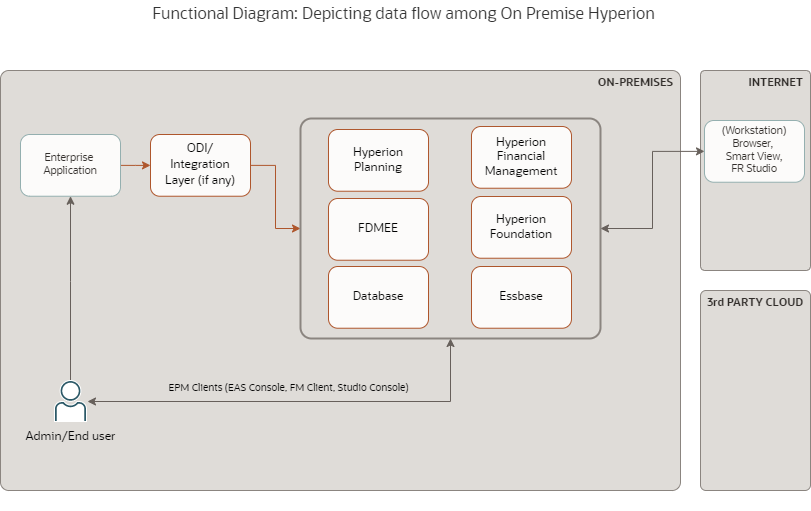
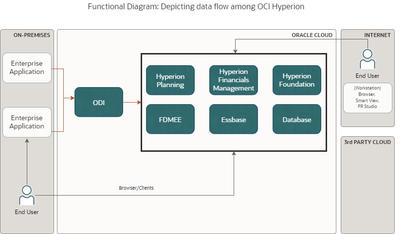
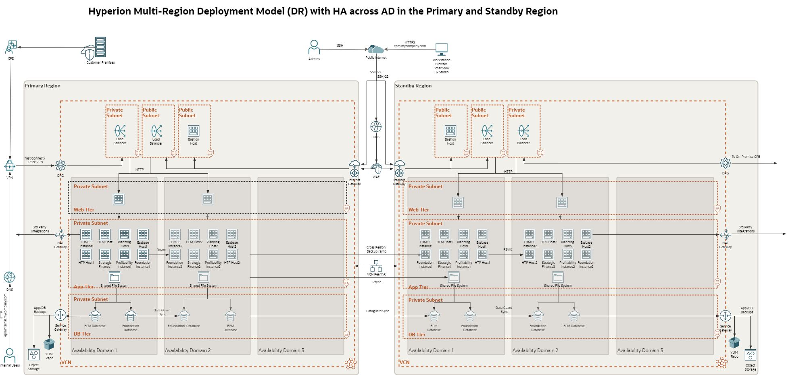

---
doc:
    author: Manish Palaparthy, Grzegorz Reizer
    version: 1.1
    cover:
        title:
        - ${doc.customer.name}
        - Hyperion
        subtitle:
        - Workload Architecture Document 
        - Solution Definition and Design
    customer:
        name: A Company Making Everything
        alias: ACME
---

<!--
    Last Change: 29 June 2023
    Review Status: Live
    Review Notes: missing images
    Based on WAD Template Version: 1.2
-->

# Document Control
<!-- GUIDANCE -->
<!--
First Chapter of the document, describes meta data for the document. Such as versioning and team members.
 -->

## Version Control
<!-- GUIDANCE -->
<!--
A section describing the versions of this document and it changes.

Mandatory Chapter

Role  | RACI
------|-----
WLA   | R/A
Impl. | None
PPM   | None
-->

<!-- EXAMPLE / TEMPLATE -->
Version     | Author          | Date                    | Comment
:---        |:---             |:---                     |:---
1.0         | Name            | June 12th, 2023     | Initial version
2.0         | Name            | June 13th, 2023     | Draft for Review

## Team
<!-- GUIDANCE -->
<!--
A section describing the versions of this documents and it changes.

Mandatory Chapter

Role  | RACI
------|-----
WLA   | R/A
Impl. | None
PPM   | None
-->

<!-- EXAMPLE / TEMPLATE -->
Name           | eMail                     | Role                    | Company
:---           |:---                       |:---                     |:---
Ada Lovelace   | ada.lovelace@example.com     | Project Manager         | ACME
Mark Watson  | mark.watson@example.com     | Cloud Architect         | Oracle

## Abbreviations and Acronyms
<!-- Guidance -->
<!--
Abbreviation: a shortened form of a word or phrase.
Acronyms: an abbreviation formed from the initial letters of other words and pronounced as a word (e.g. ASCII, NASA ).

Optional Chapter

Role  | RACI
------|-----
WLA   | R/A
Impl. | None
PPM   | None
-->

<!-- EXAMPLE / TEMPLATE -->
Term          | Meaning
:---          |:------
OCI           | Oracle Cloud Infrastructure
HFM           | Hyperion Financial Management
Dev           | Development

## Document Purpose
<!-- GUIDANCE -->
<!--
Describe the purpose of this document and the Oracle specific terminology.

Mandatory Chapter

Role  | RACI
------|-----
WLA   | R/A
Impl. | None
PPM   | None
-->

<!-- EXAMPLE / TEMPLATE -->
This document provides a high-level solution definition for the Oracle solution and aims at describing the current state, to-be state as well as a potential project scope and timeline. The intended purpose is to provide all parties involved a clear and well-defined insight into the scope of work and intention of the project.

The document may refer to a 'Workload', which summarizes the full technical solution for a customer (You) during a single engagement. The Workload is described in chapter [Workload Requirements and Architecture](#workload-requirements-and-architecture).

# Business Context
<!-- GUIDANCE -->
<!--
Describe the customers business and background. What is the context of the customers industry and LOB. What are the business needs and goals which this Workload is an enabler for? How does this technical solution impact and support the customers business goals? Does this solution support a specific customer strategy, or maybe certain customer values? How does this solution help our customers to either generate more revenue or save costs.

Mandatory Chapter

Role  | RACI
------|-----
WLA   | R/A
Impl. | None
PPM   | None
ACE   | R
-->

## Executive Summary
<!-- GUIDANCE -->
<!--
A section describing the Oracle differentiator and key values of the solution of our solution for the customer, allowing the customer to make decisions quickly.

Mandatory Chapter

Role  | RACI
------|-----
WLA   | R/A
Impl. | None
PPM   | None
ACE   | R
-->
Most on-premises Hyperion deployments can be migrated to run on Oracle Cloud Infrastructure without requiring significant configuration, integration, or process changes. The resulting implementation will be more flexible and more reliable, perform better, and cost less than on-premises or other cloud deployments.
Oracle has a validated solution to accomplish these goals, quickly and reliably. This solution includes procedures, supporting Oracle Cloud Infrastructure platform services, and reference architectures. These consider real production needs, like security, network configuration, high availability (HA), disaster recovery (DR), identity integration, and cost management.

1. Lower total cost of ownership (TCO) than on-premises deployments
2. Managing and reducing CAPEX, and ensuring that the data centers you maintain are efficient, while eliminating server hardware, and taking advantage of cloud flexibility where possible
3. Rapid in-place technology refresh and patching
4. Proactive monitoring of usage and costs
5. Scaling up or down to handle business growth or workload bursts
6. Federated identity with your existing systems
7. Rapid deployment that leverages Terraform templates, to deploy a Hyperion cluster in minutes instead of days

## Workload Business Value
<!-- GUIDANCE -->
<!--
A clear statement of specific business value as part of the full workload scope. Try to keep it SMART: Specific, Measurable, Assignable, Realistic, and Time-Related - Agree the SMART business value with the customer. Keep it business focused, and speak the language of the LOB which benefits from this Workload: "Increase Customer Retention by 3% in the next year" or "Grow Customer Base with Executive Decision-Making from our Sales and Support Data". Avoid technical success criteria such as "Migrate App X to Oracle Cloud" or "Provision 5 Compute Instances". Avoid Oracle success criteria and language "Get Workload Consuming on OCI".

Mandatory Chapter

Role  | RACI
------|-----
WLA   | R/A
Impl. | None
PPM   | None
ACE   | R
-->
Customer has been using Hyperion Planning and Essbase for more than 6 years and is one of the key strategic applications that is used to analyze data and support enterprise-wide planning, budgeting, and forecasting. Customer intends to improve the overall performance and availability of the Hyperion applications to enable faster month end, quarter end, year end consolidation processes. With Oracle Cloud Infrastructure, customer benefits by eliminating hardware management and flexible scaling options for increased usage during consolidation processes.

# Workload Requirements and Architecture

## Overview
<!-- GUIDANCE -->
<!--
Describe the Workload: What applications and environments are part of this Workload, what are their names? (#scope).

Mandatory Chapter

Role  | RACI
------|-----
WLA   | R/A
Impl. | None
PPM   | None
-->
This project involves the migration of following Hyperion applications currently hosted on-premises and used by the customer to Oracle Cloud Infrastructure (OCI):

1. Hyperion planning
2. Essbase
3. Hyperion Financial Management
4. Hyperion Financial Data Quality Management (FDMEE)

The customer has 3 Hyperion environments currently:

1. Production
2. UAT
3. DEV

## Functional Requirements
<!-- GUIDANCE -->
<!--
Provide a brief overview of the functional requirements, the functional area they belong to, the impacted business processes, etc.

Provide a formal description of the requirements as 1. a set of Use Cases or 2. a description of Functional Capabilities or 3. a Requirement Matrix. The three descriptions are not mutually exclusive.

Some Workload team, especially the Analytics and Merging Tech teams, will create new application based on functional requirements, some Workload team will not touch the functional requirements at all and just change the platform under an application. But it is important to understand who is using the system and for what reason.

Recommended Chapter (Mandatory for Analytics and Emerging Tech)

Role  | RACI
------|-----
WLA   | R/A
Impl. | None
PPM   | None
-->
This section provides the details of the functional modules of Oracle Hyperion used by the customer. However, as part of the workload migration project, no functional changes are implemented to the Hyperion application. The Hyperion application would be migrated as-is with an upgrade (if required to 11.2.x) to OCI without impacting any existing functionality. The only exception is for EPMA to Classic conversion (if applicable for the customer) which will be explained under the section [Requirement Matrix](###Requirement-Matrix).

### Functional Capabilities
<!-- GUIDANCE -->
<!--
In specific cases, a set of Functional Capabilities can be represented in a Functional Decomposition Diagram. This is typical of Functional Analysis in System Engineering domain. For more information on Functional Analysis see, e.g. https://spacese.spacegrant.org/functional-analysis/.

Recommended Chapter

Role  | RACI
------|-----
WLA   | R/A
Impl. | None
PPM   | None
-->

_**Note: From the below section, remove the modules that are not used by the customer.**_

Oracle Enterprise Performance Management (also known as Hyperion or Hyperion EPM) is based on 5 major components. For EPM 11.2, the main functional modules in Hyperion include:

- Oracle Hyperion Foundation Services: Unified common layer for EPM Products that includes
Weblogic 12c (12.2.1.+), OHS 12c (12.2.1.+), Foundation Services like security(users/groups/provisioning), life cycle management (LCM), Workspace, SmartView (MS Office) and Calculation Manager.
- Oracle Hyperion Financial Reporting (FR): providing end-user driven financial report generation capabilities with outputs in different formats e.g. HTML, PDF, Excel.
- Oracle Essbase: Essbase stands for Extended Spread Sheet Database. Essbase is an OLAP (On-line Analytic Processing) business analysis server technology that provides an environment for rapidly developing custom analytic and EPM applications. uses complex queries to analyze aggregated historical data from OLTP systems. Multidimensional analysis uses a database that is structured on business concepts and that is designed around business needs.
- Oracle Hyperion Financial Performance Management Applications: A suite of financial applications including -
  - Oracle Hyperion Planning (planning, budgeting, and forecasting solution)
  - Oracle Hyperion Financial Management HFM (financial consolidation and reporting application)
  - Oracle Hyperion Profitability and Cost Management HPCM (provides calculation and analysis capability for an organization's cost and/or profits)
  - Oracle Hyperion Financial Close Management FCM (management of period-end close activities across the extended financial close cycle)
  - Oracle Hyperion Tax Governance
  - Oracle Hyperion Tax Provision
- Oracle's Data Management: This includes data integration and management applications. This consists of -
  - Oracle Hyperion Financial Data Quality Management, Enterprise Edition (FDMEE)
  - Oracle Data Relationship Management (DRM)

In addition to the above functional modules, the Hyperion application is built on middle tier application server (Weblogic by default) and DB tier (Oracle or MS SQL Server).

### Requirement Matrix
<!-- GUIDANCE -->
<!--
A Requirement Matrix can be used when the solution will be based on software capabilities already available in existing components (either custom or vendor provided). The Requirements Matrix is a matrix that is used to capture client requirements for software selection and to evaluate the initial functional “fit” of a vendor’s software solution to the business needs
of the client.

For example, rows can list required functional capabilities and columns can list available software components. Cells can contain a simple Y/N or provide more detail. The Requirements Matrix also is used to identify initial functional gaps or special software enhancements needed to enable each vendor’s software to fulfill the client’s desired system capabilities.

Recommended Chapter

Role  | RACI
------|-----
WLA   | R/A
Impl. | None
PPM   | None
-->

Requirement/Component  |Currently Used   |On OCI
--|---|--
Hyperion Modules | Workspace, HFM, FR, FDMEE (11.1.2.4)| Workspace, HFM, FR, FDMEE (11.2.x)
Database  |Microsoft SQL 2012 R2 Standard x64 |  Oracle Database 19c/ Microsoft SQL 2019
Operating System|  Microsoft Windows 2012 R2 Standard x64 |  Windows Server 2022
EPMA/Classic  |EPMA   |  Classic/ DRM*
ETL  |  ODI Knowledge Modules** |  FDMEE

* **EPM Architect (EPMA)** will NOT be available as a foundation component in EPM 11.2 and beyond. Hence, For existing deployments of EPMA, the recommended approaches are:
1. **Data Relationship Management (DRM)** will be offered under a Restricted Used License to facilitate Oracle Hyperion EPM (on premise only) dimension maintenance. A Migration Kit is published including a [technical brief](https://support.oracle.com/epmos/main/downloadattachmentprocessor?parent=DOCUMENT&sourceId=2626317.1&attachid=2626317.1:ADS_CONVERTER&clickstream=yes) and scripts to assist with dimension extraction from EPMA to DRM. (Oracle Support Note: 2626317.1). Migration information from EPMA to DRM is available [HERE](https://docs.oracle.com/en/applications/enterprise-performance-management/11.2/drint/epma_migration_overview_102x746c2eb1.html).
2. Alternatively convert to **Classic Application**

** **ODI Knowledge Modules** for Oracle EPM are not supported in EPM 11.2 version as per the support note [2782684.1](https://support.oracle.com/epmos/faces/DocumentDisplay?_afrLoop=192846869020265&id=2782684.1&_adf.ctrl-state=1orhfiyog_52) and the statement of direction attached in it.

## Non Functional Requirements
<!-- GUIDANCE -->
<!--
Describe the high-level technical requirements for the Workload. Consider all sub-chapters, but decide and choose which Non Functional Requirements are actually necessary for your engagement. You might not need to capture all requirements for all sub-chapters.

This chapter is for describing customer specific requirements (needs), not to explain Oracle solutions or capabilities.

Mandatory Chapter

Role  | RACI
------|-----
WLA   | R/A
Impl. | None
PPM   | None
-->

This section captures all the non-functional requirements of the workload migration project.

### Integration and Interfaces
<!-- GUIDANCE -->
<!--
A list of all the interfaces into and out of the defined Workload. The list should detail the type of integration, the type connectivity required (e.g. VPN, VPC etc) the volumes and the frequency
- list of integrations
- list of user interfaces

Recommended Chapter
-->

The following table lists the integrations that exist in the customer environment.

<!-- EXAMPLE / TEMPLATE -->

Name	                      | Source    		| Target	  	| Protocol	| Function
---		                      |---		      	|---		    	|---		   	|---
ELT	- ODI                  	| EBS DB		    | SQL Server	| DB Connector   | Data extraction
ELT - ODI  |SQL Server   |Planning   | ODI KM  |  Data loading

### Regulations and Compliances
<!-- GUIDANCE -->
<!--
This section captures and specific regulatory of compliance requirements for the Workload. These may limit the types of technologies that can be used and may drive some architectural decisions.

If there are none, then please state None.

Mandatory Chapter
-->

At the time of this document creation, no Regulatory and Compliance requirements have been specified.

### Environments
<!-- GUIDANCE -->
<!--
A diagram or list detailing all the required environments (e.g. development, text, live, production etc).
- list each environment included in the scope
- map each environment to bronze/silver/gold MAA

Mandatory Chapter
-->

The following table lists all the environments (current + required) as part of the workload project. The scope column mentions whether the environment is included in the workload migration project scope or not.

Name	          | Size of Prod  | Customer DC/ OCI Region  | MAA   | Scope
---		          |---		      	|---		    	|---    |---
Production      | 100%        	| Customer DC	| NA  | Not in Scope / Continue On-prem
UAT             | 50%           | Frankfurt   | Silver  | Workload
DEV             | 25%           | Frankfurt   | Bronze| Workload

### System Configuration Control Lifecycle
<!-- GUIDANCE -->
<!--
This section should detail the requirements for the development and deployment lifecycle across the Workload. This details how code will be deployed and how consistency across the environments will be maintained over future software deployment. This may include a need for CI/CD.
- will a CI/CD tool need access to deploy to the target environment
- does the customer require software to be delivered to a repository
- how will configuration and software be promoted through the environments

Optional Chapter
-->

Oracle recommends the below approach to automate continuous delivery onto servers running on OCI for customer’s application:

- Git version management
- Automating deployment
- Automate LCM export

More details on automating the Infrastructure deployments on OCI for Hyperion reference architecture can be found [here](https://github.com/oracle-quickstart/oci-hyperion).

More information on automating the Hyperion installation through silent installation can be found [here](https://docs.oracle.com/en/applications/enterprise-performance-management/11.2/hitis/performing_silent_installations.html).

### Resilience and Recovery
<!-- GUIDANCE -->
<!--
This section captures the resilience and recovery requirements for the Workload. Note that these may be different from the current system.

The Recovery Point Objective (RPO) and Recovery Time Objective (RTO) requirement of each environment should be captured in the environments section above, and wherever possible, these should be mapped to the standard Bronze, Silver and Gold levels of Oracle's MAA.

- What are RTO and RPO requirements of the Application?
- What are SLA's of the application?
- What are the backup requirements

Note that if needed, this section may also include an overview of the proposed backup and disaster recovery proposed architectures.

This chapter is mandatory, while there could be no requirements on HA/DR, please mention that in a short single sentence.

Mandatory Chapter
-->

The following table captures the RPO and RTO requirements of each of the environments for the workload.

Environment  |RPO   |RTO
--|---|--
UAT  | 24 Hours  |  4 Hours
DEV  | 24 Hours  |  4 Hours

**Backup requirements:**

Current Backup Schedule:

Currently, Essbase is backed up with some backup scripts once every day. MSSQL uses full backups once every week, incremental backups once every day and log backups once every hour.

OCI Backup Requirements:

For OCI, the Backup tier will be set to Gold: The gold policy includes daily incremental backups, retained for seven days, along with weekly incremental backups, run on Sunday and retained for four weeks. Includes monthly incremental backups, run on the first day of the month, retained for twelve months. Also include a full backup, run yearly, during the first part of January. This backup is retained for five years. The backups can be potentially done to a different cloud region as well. Refer the documentation for more details: [Scheduling volume backups](https://docs.oracle.com/en-us/iaas/Content/Block/Tasks/schedulingvolumebackups.htm)

#### High Availability
<!-- GUIDANCE -->
<!--
A subsubsection, if cleaner separation of Resilience and Recovery into HA, DR, and Backup & Restore is needed.

Recommended Chapter
-->

<!-- EXAMPLE / TEMPLATE -->
Service Name  	| KPI	            	| Unit	  	| Value
---		      		|---	            	|---	    	|---
Oracle DB		       		| Uptime	          | percent		| 99.98
Hyperion Application	| Max Interruption	| minutes 	| 20

#### Disaster Recovery
<!-- GUIDANCE -->
<!--
A subsubsection, if cleaner separation of Resilience and Recovery into HA, DR, and Backup & Restore is needed.

Recommended Chapter
-->

<!-- EXAMPLE / TEMPLATE -->
Service Name   	| KPI		| Unit		| Value
:---		      	|:---		|:---	    |:---
Hyperion Application	| RTO		| minutes	| 120
Hyperion Application	| RPO		| minutes	| 10

#### Backup and Restore
<!-- GUIDANCE -->
<!--
A subsubsection, if cleaner separation of Resilience and Recovery into HA, DR, and Backup & Restore is needed.

Recommended Chapter
-->

<!-- EXAMPLE / TEMPLATE -->

Service Name	| KPI		      	| Unit		| Value
---			    	|---		      	|---		  |---
Block Volumes	| Frequency	  	| /day		| 1

### Operating Model
<!-- GUIDANCE -->
<!--
This section captures requirements on how the system will be managed after implementation and migration. In the vast majority of cases, the solution will be handed back to the customer (or the customer's SI/partner), but in some cases, Oracle may also take on some sustaining responsibilities through ACS or OC

Also capture requirements for tools to monitor and manage the solution.

Optional Chapter
-->

The workload migration will be implemented by Customer/Partner/Oracle Consulting or a combination of these. Post implementation, the Hyperion environemnts in scope of the project will be handed over to the customer/partner/Oracle ACS team as agreed with the customer. Customer/Partner/Oracle ACS team will be responsible for managing and maintaining the Hyperion workload and OCI post implementation.

### Management and Monitoring
<!-- GUIDANCE -->
<!--
This subsection captures any requirements for integrations into the customer's existing management and monitoring systems - e.g. system monitoring, systems management etc. Also, if the customer requires new management or monitor capabilities, these should also be recorded.

Optional Chapter
-->

OCI can provide metrics automatically for many of the native resources. There is no need to install an agent on a block storage volume or VCN, as these resources will emit predefined metrics on their own.

The following table lists all the different kinds of metrics and logs that can be collected and used in monitoring the proposed solution:

| **Components**     | **Logs/Metrics** | **Agent Based** | **Types of data**                                                                                  |
| ------------------ | ---------------- | --------------- | -------------------------------------------------------------------------------------------------- |
| Audit              | Log              | No              | OCI Audit Log                                                                                      |
| VCN                | Metrics          | No              | VNIC traffic (packets), Security List statistics                                                   |
| VCN                | Logs             | No              | Flow logs                                                                                          |
| Compute            | Metrics          | Yes             | CPU, Disk, Memory, Network usage                                                                   |
| Block Storage      | Metrics          | No              | IOPS and throughput                                                                                |
| LBR                | Metrics          | No              | Typical performance metrics                                                                        |
| OS                 | Metrics          | Yes             | Process information                                                                                |
| OS                 | Logs             | Yes             | Syslogs and other defined logs, ex: ssh acces logs                                                 |
| Database           | Metrics          | Yes             | CPU, Memory, Disk usage, SQL performance, etc                                                      |
| Database           | Logs             | Yes             | DB, listener and audit logs                                                                        |
| Application server | Metrics          | Yes             | WLS and OHS specific metrics: response times, memory usage, etc. For ATP/ADW no agent is required. |
| Application server | Logs             | Yes             | WLS and OHS specific logs                                                                          |
| Browser            | Metrics          | No              | Response time and transaction correlation                                                          |

Oracle recommends leveraging Oracle Management Cloud which provides integrated monitoring across hybrid and multi-cloud environments. It performs monitoring through use of agents across various tiers from infrastructure to application performance, security, and even end-user activity. It also integrates with Oracle Enterprise Manager for Oracle Database performance and capacity analytics.

### Performance
<!-- GUIDANCE -->
<!--
The performance requirements cover all aspects related to the time required to perform a given operation. They can be measured in different ways, for example: (1) AvrgTime: average response time that can be accepted for a given online or real interactions (data retrieve, data insert, etc.) (2) MaxTime: maximum response time for the same operations defined for AvrgRtime The operations can be online (user interactions), offline (batch execution) or (near)realtime (messaging).

Optional Chapter
-->

<!-- EXAMPLE / TEMPLATE -->

_The table below lists indicative performance metrics that can be used to validate the performance of Hyperion application between source and target (OCI)._

<!-- EXAMPLE / TEMPLATE -->
Type		  | Operation				       | KPI		  | Unit	| Value	| Notes
---			  |---					           |---		    |---		|---	  |---
Online		| Data Load (FDMEE) | MaxTime	| sec		| TBD	  | Compare selected data load times between the source and target environments
Online		| Consolidation Time (HFM) | MaxTime	| sec		| TBD	  | Compare selected consolidation times between the source and target environments
Online    |	Run calculation in a webform (Planning)	 | MaxTime	| sec	| TBD	  | Compare calculation time for selected webforms between the source and target environments
Online    | Run selected calculations in Essbase application (Essbase)  | MaxTime  | sec  | TBD  |  Compare selected calculation time in Essbase applications between the source and target environments

### Capacity
<!-- GUIDANCE -->
<!--
Capacity is a measure of the total workload the system can bear without affecting performance. There are many KPIs to measure capacity, depending on the system functionalities. Some of the most relevant KPIs are:
(1) MaxVol: maximum volume of data that can be stored in the system (can be different for different types of data, e.g. relational and file): **800-900GB** current database size (probably with significant waste of space)
(2) MaxFlow: maximum data flow (input/output) that can be managed by the system (can be two different numbers for each major system interface and/or operation): the current value has not been measured but is expected to be **at most a few GB.**
(3) MaxUser: maximum number of concurrent users (can be differentiated by user profile): up to **10 (number of registered users)**.

Recommended Chapter
-->

<!-- EXAMPLE / TEMPLATE -->
The following table indicates the current sizing available onpremises and also outlines any additional capacity requested by the customer or required for the workload migration to OCI. Incase of 1:1 sizing and no performance issues/growth considerations, the current capacity will be matched on OCI.

<!-- EXAMPLE / TEMPLATE -->
| System      | Capacity                | KPI		    | Unit   | Value  | Notes |
|:---		    	|:---					            |:---		    |:---		 |:---	  |:---   |
| DB server	  | DB size                 | MaxVol	  | GB     | 1024	  |       |
| Hyperion Application Server  | Simultaneous users      | MaxUsers  | Number			 | 50	    |       |

### Security
<!-- GUIDANCE -->
<!--
Capture the non functional requirements for security related topics. Security is a mandatory subsection which is to be reviewed by the x-workload security team. The requirements can be separated into:
- Identity and Access Management
- Data Security

Other security topics, such as network security, application security or other can be added if needed.

Mandatory Chapter
-->

At the time of this document creation, no Security requirements have been specified.

#### Identity and Access Management
<!-- GUIDANCE -->
<!--
The requirements for identity and access control. This section describes any requirements for
authentication, identity management, single-sign-on and necessary integrations to retained customer systems
(e.g. corporate directories)
- Is there any Single Sign On or Active Directory Integration Requirement?
- Is the OS hardened if so please share the hardening guide line?

Recommended Chapter
-->

#### Data Security
<!-- GUIDANCE -->
<!--
Capture any specific or special requirements for data security. This section should also describe any additional constraints such as a requirement for data to be held in a specific locations or for data export restrictions

Recommended Chapter
-->

## Constraints and Risks
<!-- GUIDANCE -->
<!--
Constraints are limitations which will impact the resulting project or Solution Architecture. It is a technology- or project-related condition or event that prevents the project from fully delivering the ideal solution to customers and end-users. Constraints can be identified on our customer, partner or even Oracle's side.

A project risk is an uncertain event that may or may not occur during a project.

Describe constraints and risks affecting the Workload and possible Logical Solution Architecture. These can be of technical nature, but might also be non-technical. Consider: budgets, timing, preferred technologies, skills in the customer organization, location, etc.

Recommended Chapter

Role  | RACI
------|-----
WLA   | R/A
Impl. | None
PPM   | None
-->
Name                | Description                                    | Type           | Impact                         | Mitigation Approach
:---                |:---                                            |:---            |:---                              |:---
OCI skills          | Limited OCI skills in customers organization   | Risk     | No Operating Model                | Involve Ops partner, for example Oracle ACS
Team Availability  | A certain person is only available on Friday CET time zone  | Constraint  | | Arrange meetings to fit that persons availability
Access Restriction  | We are not allowed to access a certain tenancy without customer presence  | Constraint   | | Invite customer key person to implementation sessions

## Current State Architecture
<!-- GUIDANCE -->
<!--
Provide a high-level logical description of the Workload current state. Stay in the Workload scope, show potential integrations, but do not try to create a full customer landscape. Use architecture diagrams to visualize the current state. I recommend not putting lists of technical resources or dependencies here. Refer to attachments instead.

Recommended Chapter

Role  | RACI
------|-----
WLA   | R/A
Impl. | None
PPM   | None
-->

This section describes the current state architecture and environments.

| Environment | Description                                                  |
|:------------|:-------------------------------------------------------------|
| PROD        | Oracle DB single node, single application node EPM 11.1.2.4  |
| DEV         | Oracle DB single node, single  application node EPM 11.1.2.4 |
| DR          | Oracle DB single node, single application node EPM 11.1.2.4  |

## Future State Architecture
<!-- GUIDANCE -->
<!--
The Workload Future State Architecture can be described in various forms. In the easiest case we  just describe a Logical Architecture, possibly with a System Context Diagram.

Additional architectures, in the subsections, can be used to describe needs for specific workloads.

Mandatory Chapter

Role  | RACI
------|-----
WLA   | R/A
Impl. | None
PPM   | None
-->

This section describes the future state logical and physical deplyment architecture of the Hyperion application on Oracle Cloud Infrastructure and also lists the environemnts.

| Environment | Description                                                                                                 |
|:------------|:------------------------------------------------------------------------------------------------------------|
| PROD        | Private Load Balancer, Public Load Balancer, Oracle DBCS, single application node EPM 11.2.13 (Windows 2022) |
| DEV         | Private Load Balancer, Public Load Balancer, Oracle DBCS, single application node EPM 11.2.13 (Windows 2022) |
| DR          | Private Load Balancer, Public Load Balancer, Oracle DBCS, single application node EPM 11.2.13 (Windows 2022) |

### Logical Architecture
<!-- GUIDANCE -->
<!--
Use [System Context Diagram](https://online.visual-paradigm.com/knowledge/system-context-diagram/what-is-system-context-diagram/) to show integration for the Workload solution.

Provide a high-level logical Oracle solution for the complete Workload. Indicate Oracle products as abstract groups, and not as a physical detailed instances. Create an architecture diagram following the latest notation and describe the solution.

Mandatory Chapter
-->

### Physical Architecture
<!-- GUIDANCE -->
<!--

The Workload Architecture is  described here.

Recommended Chapter

Role  | RACI
------|-----
WLA   | R/A
Impl. | None
PPM   | None
-->

<!--### Data Architecture
<!-- GUIDANCE -->
<!--
Show how data is acquired, transported, store, queried, and secured as in scope of this Workload. This could include Data Ecosystem Reference Architectures, Master Data Management models or any other data centric model.

Optional Chapter

Role  | RACI
------|-----
WLA   | R/A
Impl. | None
PPM   | None
-->

<!--### Functional Architecture
<!-- GUIDANCE -->
<!--
Provide a brief description of the functional architecture, split into two main areas: application capabilities and data.

Optional Chapter

Role  | RACI
------|-----
WLA   | R/A
Impl. | None
PPM   | None
-->

### Architecture Decisions
<!-- GUIDANCE -->
<!--
List the architecture decisions for the previous future state architecture(s). The decisions can be based upon the previously defined requirements or can be based on common architecture best practices or architecture design patterns.

Role  | RACI
------|-----
WLA   | R/A
Impl. | None
PPM   | None
-->

#### Requirements Evaluation
<!-- GUIDANCE -->
<!--
List architecture decisions and how they impact previous functional, non-function, or other requirement. Do a realist evaluation and also highlight lowlights where an architecture decision might not fully comply to a previous requirement. Discuss with your customer and get feedback from your colleagues if some requirements are not fully satisfied.

Recommended Chapter
-->

| Architecture Decision               | Description                                                                                                                                                                                                                                                   | Comments |
|:------------------------------------|:--------------------------------------------------------------------------------------------------------------------------------------------------------------------------------------------------------------------------------------------------------------|:---------|
| AD1: Essbase Edition and Version    | The Oracle Essbase Marketplace edition with the version 21.2 C has been choosen as the target for the customer's Essbase deployment.                                                                                                                          |          |
| AD2: Database Edition and Version   | The Oracle ATP Database version 19c on OCI has been selected as the database for Essbase’s metadata repository and staging area for Data before the data moves to Essbase cubes                                                                               |          |
| AD3: Access through public Internet | The services and functionality of Essbase will only be accessed from the Internet over http(s). Customer to share the HTTPS certificates needed to be imported by Essbase. The access is available only to a set of allowed IPs provided by the customer |          |

#### Architecture Best Practices
<!-- GUIDANCE -->
<!--
Refer or cite architecture best practices or design patterns. Explain how they are reflected in your architecture and how they improve the solution.

Recommended Chapter
-->

| Architecture Best Practice | Description                                                                                                                                                                                                   | Status        |
|:---------------------------|:--------------------------------------------------------------------------------------------------------------------------------------------------------------------------------------------------------------|:--------------|
| Disaster Recovery          | It is recommended to have a replica of the servers in another Availability Domain or in another region based on the RPO and RTO requirements                                                                  | Future        |
| Fast Connect               | It is recommended to have fastconnect connectivity from the customer data center to OCI. This eliminates internet exposure and essentially extends your data center directly into Oracle Cloud Infrastructure | Project Scope |

## OCI Cloud Landing Zone Architecture
<!-- GUIDANCE -->
<!--

Mandatory Chapter

Role  | RACI
------|-----
WLA   | R/A
Impl. | None
PPM   | None
-->

The design considerations for an OCI Cloud Landing Zone have to do with OCI and industry architecture best practices, along with customer specific architecture requirements that reflect the Cloud Strategy (hybrid, multi-cloud, etc). An OCI Cloud Landing zone involves a variety of fundamental aspects that have a broad level of sophistication. Oracle Cloud Infrastructure (OCI) provides multiple landing zone implementations that you can choose from [link](https://docs.oracle.com/en-us/iaas/Content/cloud-adoption-framework/technology-implementation.htm).

### Resource Naming Convention
<!-- GUIDANCE -->
<!--
If the customer provides a resource naming convention use it. They should have it already for their on-premises compute resources.
-->

Oracle recommends the following Resource Naming Convention:

- The name segments are separated by “-“
- Within a name segment avoid using <space> and “.”
- Where possible intuitive/standard abbreviations should be considered (e.g. “shared“ compared to "shared.cloud.team”)
- When referring to the compartment full path, use “:” as separator, e.g. cmp-shared:cmp-security

Some examples of naming are given below:

- cmp-shared
- cmp-\<workload>
- cmp-networking

The patterns used are these:

- \<resource-type>-\<environment>-\<location>-\<purpose>
- \<resource-type>-\<environment>-\<source-location>-\<destination-location>-\<purpose>
- \<resource-type>-\<entity/sub-entity>-\<environment>-\<function/department>-\<project>-\<custom>
- \<resource-type>-\<environment>-\<location>-\<purpose>

Abbreviation per resource type are listed below. This list may not be complete.

| Resource type | Abbreviation | Example |
|---|---|---|
| Bastion Service | bst | bst-\<location>-\<network> |
| Block Volume | blk | blk-\<location>-\<project>-\<purpose>
| Compartment | cmp | cmp-shared, cmp-shared-security |
| Customer Premise Equipment | cpe | cpe-\<location>-\<destination> |
| DNS Endpoint Forwarder | dnsepf | dnsepf-\<location> |
| DNS Endpoint Listener | dnsepl | dnsepl-\<location> |
| Dynamic Group | dgp | dpg-security-functions |
| Dynamic Routing Gateway | drg | drg-prod-\<location>
| Dynamic Routing Gateway Attachment | drgatt | drgatt-prod-\<location>-\<source_vcn>-\<destination_vcn> |
| Fast Connect | fc# <# := 1...n> | fc0-\<location>-\<destination> |
| File Storage | fss | fss-prod-\<location>-\<project> |
| Internet Gateway | igw | igw-dev-\<location>-\<project> |
| Jump Server | js | js-\<location>-xxxxx |
| Load Balancer | lb | lb-prod-\<location>-\<project> |
| Local Peering Gateway | lpg | lpg-prod-\<source_vcn>-\<destination_vcn> |
| NAT Gateway | nat | nat-prod-\<location>-\<project> |
| Network Security Group | nsg | nsg-prod-\<location>-waf |
| Managed key | key | key-prod-\<location>-\<project>-database01 |
| OCI Function Application | fn | fn-security-logs |
| Object Storage Bucket | bkt | bkt-audit-logs |
| Policy | pcy | pcy-services, pcy-tc-security-administration |
| Region Code, Location | xxx | fra, ams, zch # three letter region code |
| Routing Table | rt | rt-prod-\<location>-network |
| Secret | sec | sec-prod-wls-admin |
| Security List | sl | sl-\<location> |
| Service Connector Hub | sch | sch-\<location> |
| Service Gateway | sgw | sgw-\<location> |
| Subnet | sn | sn-\<location> |
| Tenancy | tc | tc |
| Vault | vlt | vlt-\<location> |
| Virtual Cloud Network | vcn | vcn-\<location> |
| Virtual Machine | vm | vm-xxxx |
| | | |

**Note:** Resource names are limited to 100 characters.

#### Group Names

OCI Group Names should follow the naming scheme of the Enterprise Identity Management system for Groups or Roles.

Examples for global groups are:

- \<prefix>-\<purpose>-admins
- \<prefix>-\<purpose>-users

For departmental groups:

- \<prefix>-\<compartment>-\<purpose>-admins
- \<prefix>-\<compartment>-\<purpose>-users

The value for \<prefix> or the full names **must be agreed** with customer.

### Security and Identity Management

This chapter covers the Security and Identity Management definitions and resources which will be implemented for customer.

#### Universal Security and Identity and Access Management Principles

- Groups will be configured at the tenancy level and access will be governed by policies configured in OCI.
- Any new project deployment in OCI will start with the creation of a new compartment. Compartments follow a hierarchy, and the compartment structure will be decided as per the application requirements.
- It is also proposed to keep any shared resources, such as Object Storage, Networks etc. in a shared services compartment. This will allow the various resources in different compartments to access and use the resources deployed in the shared services compartment and user access can be controlled by policies related to specific resource types and user roles.
- Policies will be configured in OCI to maintain the level of access / control that should exist between resources in different compartments. These will also control user access to the various resources deployed in the tenancy.
- The tenancy will include a pre-provisioned Identity Cloud Service (IDCS) instance (the primary IDCS instance) or, where applicable, the Default Identity Domain. Both provide access management across all Oracle cloud services for IaaS, PaaS and SaaS cloud offerings.
- The primary IDCS or the Default Identity Domain will be used as the access management system for all users administrating (OCI Administrators) the OCI tenant.

#### Authentication and Authorization for OCI

Provisioning of respective OCI administration users will be handled by the customer.

##### User Management

Only OCI Administrators are granted access to the OCI Infrastructure. As a good practice, these users are managed within the pre-provisioned and pre-integrated Oracle Identity Cloud Service (primary IDCS) or, where applicable, the OCI Default Identity Domain, of OCI tenancy. These users are members of groups. IDCS Groups can be mapped to OCI groups while Identity Domains groups do not require any mapping. Each mapped group membership will be considered during login.

**Local Users**

The usage of OCI Local Users is not recommended for the majority of users and is restricted to a few users only. These users include the initial OCI Administrator created during the tenancy setup, and additional emergency administrators.

**Local Users are considered as Emergency Administrators and should not be used for daily administration activities!**

**No additional users are to be, nor should be, configured as local users.**

**The customer is responsible to manage and maintain local users for emergency use cases.**

**Federated Users**

Unlike Local Users, Federated Users are managed in the Federated or Enterprise User Management system. In the OCI User list Federated Users may be distinguished by a prefix which consists of the name of the federated service in lower case, a '/' character followed by the user name of the federated user, for example:

`oracleidentityservicecloud/user@example.com`

In order to provide the same attributes (OCI API Keys, Auth Tokens, Customer Secret Keys, OAuth 2.0 Client Credentials, and SMTP Credentials) for Local and *Federated Users* federation with third-party Identity Providers should only be done in the pre-configured primary IDCS or the Default Identity Domain where applicable.

All users have the same OCI-specific attributes (OCI API Keys, Auth Tokens, Customer Secret Keys, OAuth 2.0 Client Credentials, and SMTP Credentials).

OCI Administration user should only be configured in the pre-configured primary IDCS or the Default Identity Domain where applicable.

**Note:** Any federated user can be a member of 100 groups only. The OCI Console limits the number of groups in a SAML assertion to 100 groups. User Management in the Enterprise Identity Management system will be handled by the customer.

**Authorization**

In general, policies hold permissions granted to groups. Policy and Group naming follows the Resource Naming Conventions.

**Tenant Level Authorization**

The policies and groups defined at the tenant level will provide access to administrators and authorized users, to manage or view resources across the entire tenancy. Tenant level authorization will be granted to tenant administrators only.

These policies follow the recommendations of the [CIS Oracle Cloud Infrastructure Foundations Benchmark v1.1.0, recommendations 1.1, 1.2, 1.3](https://www.cisecurity.org/cis-benchmarks).

**Service Policy**

A Service Policy is used to enable services at the tenancy level. It is not assigned to any group.

**Shared Compartment Authorization**

Compartment level authorization for the cmp-shared compartment structure uses the following specific policies and groups.

Apart from tenant level authorization, authorization for the cmp-shared compartment provides specific policies and groups. In general, policies will be designed that lower-level compartments are not able to modify resources of higher-level compartments.

Policies for the cmp-shared compartment follow the recommendations of the [CIS Oracle Cloud Infrastructure Foundations Benchmark v1.1.0, recommendations 1.1, 1.2, 1.3](https://www.cisecurity.org/cis-benchmarks).

**Compartment Level Authorization**

Apart from tenant level authorization, compartment level authorization provides compartment structure specific policies and groups. In general, policies will be designed that lower-level compartments are not able to modify resources of higher-level compartments.

**Authentication and Authorization for Applications and Databases**

Application (including Compute Instances) and Database User management is completely separate of and done outside of the primary IDCS or Default Identity Domain. The management of these users is the sole responsibility of the customer using the application, compute instance and database specific authorization.

#### Security Posture Management

**Oracle Cloud Guard**

Oracle Cloud Guard Service will be enabled using the pcy-service policy and with the following default configuration. Customization of the Detector and Responder Recipes will result in clones of the default (Oracle Managed) recipes.

Cloud Guard default configuration provides a number of good settings. It is expected that these settings may not match with the customer's requirements.

**Targets**

In accordance with the [CIS Oracle Cloud Infrastructure Foundations Benchmark, v1.1.0, Chapter 3.15](https://www.cisecurity.org/cis-benchmarks), Cloud Guard will be enabled in the root compartment.

**Detectors**

The Oracle Default Configuration Detector Recipes and Oracle Default Activity Detector Recipes are implemented. To better meet the requirements, the default detectors must be cloned and configured by the customer.

**Responder Rules**

The default Cloud Guard Responders will be implemented. To better meet the requirements, the default detectors must be cloned and configured by the customer.

**Vulnerability Scanning Service**

In accordance with the [CIS Oracle Cloud Infrastructure Foundations Benchmark, v1.1.0, OCI Vulnerability Scanning](https://www.cisecurity.org/cis-benchmarks) will be enabled using the pcy-service policy.

Compute instances which should be scanned *must* implement the *Oracle Cloud Agent* and enable the *Vulnerability Scanning plugin*.

**OCI OS Management Service**

Required policy statements for OCI OS Management Service are included in the pcy-service policy.

By default, the *OS Management Service Agent plugin* of the *Oracle Cloud Agent* is enabled and running on current Oracle Linux 6 and Oracle Linux 7 platform images.

#### Monitoring, Auditing and Logging

In accordance with the [CIS Oracle Cloud Infrastructure Foundations Benchmark, v1.1.0, Chapter 3 Logging and Monitoring](https://www.cisecurity.org/cis-benchmarks) the following configurations will be made:

- OCI Audit log retention period set to 365 days. See [CIS Oracle Cloud Infrastructure Foundations Benchmark, v1.1.0, Chapter 3.1](https://www.cisecurity.org/cis-benchmarks)
- At least one notification topic and subscription to receive monitoring alerts. See [CIS Oracle Cloud Infrastructure Foundations Benchmark, v1.1.0, Chapter 3.3](https://www.cisecurity.org/cis-benchmarks)
- Notification for Identity Provider changes. [See CIS Oracle Cloud Infrastructure Foundations Benchmark, v1.1.0, Chapter 3.4](https://www.cisecurity.org/cis-benchmarks)
- Notification for IdP group mapping changes. [See CIS Oracle Cloud Infrastructure Foundations Benchmark, v1.1.0, Chapter 3.5](https://www.cisecurity.org/cis-benchmarks)
- Notification for IAM policy changes. See [CIS Oracle Cloud Infrastructure Foundations Benchmark, v1.1.0, Chapter 3.6](https://www.cisecurity.org/cis-benchmarks)
- Notification for IAM group changes. See [CIS Oracle Cloud Infrastructure Foundations Benchmark, v1.1.0, Chapter 3.7](https://www.cisecurity.org/cis-benchmarks)
- Notification for user changes. See [CIS Oracle Cloud Infrastructure Foundations Benchmark, v1.1.0, Chapter 3.8](https://www.cisecurity.org/cis-benchmarks)
- Notification for VCN changes. See [CIS Oracle Cloud Infrastructure Foundations Benchmark, v1.1.0, Chapter 3.9](https://www.cisecurity.org/cis-benchmarks)
- Notification for changes to route tables. See [CIS Oracle Cloud Infrastructure Foundations Benchmark, v1.1.0, Chapter 3.10](https://www.cisecurity.org/cis-benchmarks)
- Notification for security list changes. See [CIS Oracle Cloud Infrastructure Foundations Benchmark, v1.1.0, Chapter 3.11](https://www.cisecurity.org/cis-benchmarks)
- Notification for network security group changes. See [CIS Oracle Cloud Infrastructure Foundations Benchmark, v1.1.0, Chapter 3.12](https://www.cisecurity.org/cis-benchmarks)
- Notification for changes to network gateways. See [CIS Oracle Cloud Infrastructure Foundations Benchmark, v1.1.0, Chapter 3.13](https://www.cisecurity.org/cis-benchmarks)
- VCN flow logging for all subnets. See [CIS Oracle Cloud Infrastructure Foundations Benchmark, v1.1.0, Chapter 3.14](https://www.cisecurity.org/cis-benchmarks)
- Write level logging for all Object Storage Buckets. See [CIS Oracle Cloud Infrastructure Foundations Benchmark, v1.1.0, Chapter 3.17](https://www.cisecurity.org/cis-benchmarks)
- Notification for Cloud Guard detected problems.
- Notification for Cloud Guard remedied problems.

For IDCS or OCI Identity Domain Auditing events, the respective Auditing API can be used to retrieve all required information.

#### Data Encryption

All data will be encrypted at rest and in transit. Encryption keys can be managed by Oracle or the customer and will be implemented for identified resources.

##### Key Management
<!--
Make sure that the correct type of the vault is used:
shared - cheap to moderate pricing
private - expensive pricing
-->

All keys for **OCI Block Volume**, **OCI Container Engine for Kubernetes**, **OCI Database**, **OCI File Storage**, **OCI Object Storage**, and **OCI Streaming** are centrally managed in a shared or a private virtual vault will be implemented and placed in the compartment cmp-security.

**Object Storage Security**

For Object Storage security the following guidelines are considered.

- **Access to Buckets** -- Assign least privileged access for IAM users and groups to resource types in the object-family (Object Storage Buckets & Object)
- **Encryption at rest** -- All data in the Object Storage is encrypted at rest using AES-256 and is on by default. This cannot be turned off and objects are encrypted with a master encryption key.

**Data Residency**

It is expected that data will be held in the respective region and additional steps will be taken when exporting the data to other regions to comply with the applicable laws and regulations. This should be review for every project onboard into the tenancy.

#### Operational Security

**Security Zones**

Whenever possible OCI Security Zones will be used to implement a security compartment for Compute instances or Database resources. For more information on Security Zones refer to the in the *Oracle Cloud Infrastructure User Guide* chapter on [Security Zones](https://docs.oracle.com/en-us/iaas/security-zone/using/security-zones.htm).

**Remote Access to Compute Instances or Private Database Endpoints**

To allow remote access to Compute Instances or Private Database Endpoints, the OCI Bastion will be implemented for defined compartments.

To be able to use OCI services to for OS management, Vulnerability Scanning, Bastion Service, etc. it is highly recommended to implement the Oracle Cloud Agent as documented in the *Oracle Cloud Infrastructure User Guide* chapter [Managing Plugins with Oracle Cloud Agent](https://docs.oracle.com/en-us/iaas/Content/Compute/Tasks/manage-plugins.htm).

#### Network Time Protocol Configuration for Compute Instance

Synchronized clocks are a necessity for securely operating environments. OCI provides a Network Time Protocol (NTP) server using the OCI global IP number 169.254.169.254. All compute instances should be configured to use this NTP service.

#### Regulations and Compliance

The customer is responsible for setting the access rules to services and environments that require stakeholders’ integration to the tenancy to comply with all applicable regulations. Oracle will support in accomplishing this task.

## Operations
<!-- GUIDANCE -->
<!--
In this chapter we provide a high-level introduction to various operations related topics around OCI. We do not design, plan or execute any detailed operations for our customers. We can provide some best practices and workload specific recommendations.

Please visit our Operations Catalogue for more information, best practices, and examples: https://confluence.oraclecorp.com/confluence/pages/viewpage.action?pageId=3403322163

The below example text represents the first asset from this catalogue PCO#01. Please consider including other assets as well. You can find MD text snippets within each asset.

Recommended Chapter

Role  | RACI
------|-----
WLA   | R/A
Impl. | None
PPM   | None
-->

This chapter provides an introduction and collection of useful resources, to relevant topics to operate the solution on Oracle Infrastructure Cloud.

Cloud Operations Topic                       | Short Summary      | References
:---                                         |:------             |:---
Cloud Shared Responsibility Model            | The shared responsibility model conveys how a cloud service provider is responsible for managing the security of the public cloud while the subscriber of the service is responsible for securing what is in the cloud.	                |  [Shared Services Link](https://www.oracle.com/a/ocom/docs/cloud/oracle-ctr-2020-shared-responsibility.pdf)
Oracle Support Portal	                       | Search Oracle knowledge base and engage communities to learn about products, services, and to find help resolving issues.	   |  [Oracle Support Link](https://support.oracle.com/portal/)
Support Management API	                     | Use the Support Management API to manage support requests	  |  [API Documentation Link](https://docs.oracle.com/en-us/iaas/api/#/en/incidentmanagement/20181231/) and [Other OCI Support Link](https://docs.oracle.com/en-us/iaas/Content/GSG/Tasks/contactingsupport.htm)
OCI Status	                                 | Use this link to check the global status of all OCI Cloud Services in all Regions and Availability Domains.	  |  [OCI Status Link](https://ocistatus.oraclecloud.com/)
Oracle Incident Response	                   | Reflecting the recommended practices in prevalent security standards issued by the International Organization for Standardization (ISO), the United States National Institute of Standards and Technology (NIST), and other industry sources, Oracle has implemented a wide variety of preventive, detective, and corrective security controls with the objective of protecting information assets.	  |  [Oracle Incident Response Link](https://ocistatus.oraclecloud.com/)
Oracle Cloud Hosting and Delivery Policies   | Describe the Oracle Cloud hosting and delivery policies in terms of security, continuity, SLAs, change management, support, and termination.	  |  [Oracle Cloud Hosting and Delivery Policies](https://www.oracle.com/us/corporate/contracts/ocloud-hosting-delivery-policies-3089853.pdf)
OCI SLAs                                     | Mission-critical workloads require consistent performance, and the ability to manage, monitor, and modify resources running in the cloud at any time. Only Oracle offers end-to-end SLAs covering performance, availability, manageability of services. This document applies to Oracle PaaS and IaaS Public Cloud Services purchased, and supplements the Oracle Cloud Hosting and Delivery Policies | [OCI SLA's](https://www.oracle.com/cloud/sla/) and [PDF Link](https://www.oracle.com/assets/paas-iaas-pub-cld-srvs-pillar-4021422.pdf)

## Roadmap
<!-- GUIDANCE -->
<!--
Explain a high-level roadmap for this Workload. Include a few easy high-level steps to success (See Business Context). Add implementation partners and their work as part of your roadmap as well. This is not about product roadmaps.

Recommended Chapter

Role  | RACI
------|-----
WLA   | R/A
Impl. | None
PPM   | None
-->

Customer can consider the feasibility of moving to Oracle EPM Cloud SaaS solution as a next step in their cloud transformation journey.

## Sizing and Bill of Materials
<!-- GUIDANCE -->
<!--
Estimate and size the physical needed resources of the Workload. The information can be collected and is based upon previously gathered capacities, business user numbers, integration points, or translated existing on-premises resources. The sizing is possibly done with or even without a Physical Architecture. It is ok to make assumptions and to clearly state them!

Clarify  your assumptions and your sizing. Get your sales to finalize the BoM with discounts or other sales calculations. Review the final BoM and ensure the sales is using the correct product SKU's / Part Number.

-->

### Sizing
<!-- GUIDANCE -->
<!--
Describe the sizes of the complete workload solution and its components.

Mandatory Chapter

Role  | RACI
------|-----
WLA   | R/A
Impl. | C
PPM   | None
Sales | C
-->

### Bill of Material
<!-- GUIDANCE -->
<!--
A full Bill of Material can be described in addition.

Optional Chapter

Role  | RACI
------|-----
WLA   | R/A
Impl. | None
PPM   | None
Sales | R
-->

<!-- Use the below chapter only for Oracle Implementations such as Lift and FastStart. do not describe the work plan for 3rd Party implementation partners --> 

## Solution Scope

### Disclaimer
<!-- GUIDANCE -->
<!--
A scope disclaimer should limit scope changes and create awareness that a change of scope needs to be agreed by both parties.
-->

<!-- EXAMPLE / TEMPLATE -->
As part of the implementation project, any scope needs to be agreed upon by both the customer and the implementation partner. A scope can change but must be confirmed again by both parties. The implementer can reject scope changes for any reason and may only design and implement a previously agreed scope. A change of scope can change any agreed times or deadlines and needs to be technically feasible.

All items not explicitly stated to be within the scope of the implementation project will be considered out of scope. Oracle recommends the use of professional services to implement extensions or customizations beyond the original scope, as well as to operate the solution, with an Oracle-certified partner.

### Overview
<!-- GUIDANCE -->
<!--
Describe the implementer's scope of as a sub-set of the Workload scope. For example one environment from one application. Describe the sub-chapters

Mandatory Chapter

Role  | RACI
------|-----
WLA   | R/A
Impl. | R
PPM   | C
-->

### Business Value
<!-- GUIDANCE -->
<!--
What's the value for the customer to use implementer's services?

Mandatory Chapter

Role  | RACI
------|-----
WLA   | R/A
Impl. | C
PPM   | C
-->

### Success Criteria
<!-- GUIDANCE -->
<!--
Technical success criteria for the implementing partner. As always be S.M.A.R.T: Specific, Measurable, Achievable, Relevant, Timebound. Example: 'Deployment of all OCI resources for the scoped environments in 3 month'.

Mandatory Chapter

Role  | RACI
------|-----
WLA   | R/A
Impl. | R
PPM   | C
-->

The below listed success criteria are for the implementation part only.

- Finish provisioning of all OCI resources
- Establish all required network connectivity
- Successfully pass all test cases
- Finished handover with documentation
- Complete the Implementation Security Checklist

### Specific Requirements and Constraints
<!-- GUIDANCE -->
<!--
If implementing partner's scope has special or different requirements as otherwise explained in the Workload.

Optional Chapter

Role  | RACI
------|-----
WLA   | R/A
Impl. | C
PPM   | None
-->

## Workplan

### Deliverables
<!-- GUIDANCE -->
<!--
Describe deliverables within the implementing partner's scope. Including this documentation as Workload  Architecture Document - Solution Definition and the later following Workload Architecture Document - Solution Design. This should be a generic reusable text, provided by the implementers.

Mandatory Chapter

Role  | RACI
------|-----
WLA   | A
Impl. | R
PPM   | None
-->

### Included Activities
<!-- GUIDANCE -->
<!--
Describe the implementation activities. It does need to include a detailed list of cloud services or OCI capabilities, but rather includes activities such as 'Provisioning of Infrastructure Components'. This should be a generic reusable text, provided by the implementers.

Mandatory Chapter

Role  | RACI
------|-----
WLA   | A
Impl. | R
PPM   | None
-->

### Recommended Activities
<!-- GUIDANCE -->
<!--
Exclude all activities with the provided boilerplate text below. Agree on a few bullet points

Mandatory Chapter

Role  | RACI
------|-----
WLA   | A
Impl. | R
PPM   | None
-->

### Timeline
<!-- GUIDANCE -->
<!--
Provide a very high-level implementation plan. Use Phases to communicate an iterative implementation (called Delivery Geared Design)

Mandatory Chapter

Role  | RACI
------|-----
WLA   | A
Impl. | R
PPM   | C/I
-->

#### Phase 1: <Name>

#### Phase n: <name>

### Implementation RACI
<!-- GUIDANCE -->
<!--
Clarify implementation responsibilities between all parties, possibly including consulting partners. High- level view, without going into deployment or physical details.

Mandatory Chapter

Role  | RACI
------|-----
WLA   | A
Impl. | R
PPM   | None
-->

### Assumptions
<!-- GUIDANCE -->
<!--
List any  assumptions, if any, which could impact the solution architecture or the implementation.

Mandatory Chapter

Role  | RACI
------|-----
WLA   | R/A
Impl. | R
PPM   | None
-->

<!-- EXAMPLE / TEMPLATE -->

### Obligations
<!-- GUIDANCE -->
<!--
List any obligations required by the customer to perform or have available, if any, which could impact the solution architecture or the implementation. Please always include this chapter to capture the obligation that we have admin access to the customers tenancy.

Mandatory Chapter

Role  | RACI
------|-----
WLA   | R/A
Impl. | R
PPM   | None
-->

<!-- EXAMPLE / TEMPLATE -->
- You will have purchased the appropriate Universal Credits for the services required for the project.
- The implementation team will have admin access to the customers tenancy for implementation.
- You will ensure the appropriate product training has been obtained to maintain and support the implementation
- Your business team will be available for the Testing phase, which will be completed within the agreed testing window.
- You will provide project management for the project and will manage any third party suppliers or vendors.

<!-- End Solution Definition -->
<!-- Begin Solution Design -->

## Physical Future State Architecture
<!-- GUIDANCE -->
<!--
Create a detailed physical solution architecture for implementation. It will include physical attributes such as IP ranges or compute shaped. The architecture is ready for implementation.

Mandatory Chapter (Can be logical/skipped for PaaS-only Projects)

Role  | RACI
------|-----
WLA   | R/A
Impl. | R
PPM   | None
-->

## Architecture Views
<!-- GUIDANCE -->
<!--
Emphasize on specific aspects of the solution architecture. See non functional requirements list for inspiration and identify important non functional requirements for your customer. Apply 'Just enough architecture', do not describe every possible non functional requirement as an architecture view.

Views for Security and Networking are mandatory if you are engaged with the x workload teams.

WLA: R/A
Impl.: C
PPM: None
-->

### Architecture View for Security
<!-- GUIDANCE -->
<!--
Architect Views for anything security, including Network, Data, Identify or other security topics.

Optional or Mandatory Chapter

Role  | RACI
------|-----
WLA   | R/A
Impl. | R
PPM   | None
-->

### Architecture View for Networking
<!-- GUIDANCE -->
<!--
Architect Views for anything networking.

Optional or Mandatory Chapter

Role  | RACI
------|-----
WLA   | R/A
Impl. | R
PPM   | None
-->

<!--### Architecture View for <name>
<!-- GUIDANCE -->
<!--

Use this sub-section multiple times for any number of additional views if needed.

Optional Chapter

Role  | RACI
------|-----
WLA   | R/A
Impl. | None
PPM   | None
-->

# Implementation

## Approach
<!-- GUIDANCE -->
<!--

Mandatory Chapter

Role  | RACI
------|-----
WLA   | A
Impl. | R
PPM   | None
-->

## Project Prerequisites

<!-- GUIDANCE -->
<!--
The purpose of this section is to document all the technical items that customer is expected to undertake, for example:

- ingress/egress between on-prem & OCI so the customer firewall can be configured
- VPN/FastConnect config
- any specific commands for data export.

Optional Chapter

Role  | RACI
------|-----
WLA   | R/A
Impl. | None
PPM   | None
-->

<!-- EXAMPLE / TEMPLATE -->

### Customer / OCI Network

#### Ingress/Egress

| Item | From CIDR      | From Port | To CIDR         | To Port | Description           |
|:----:|:---------------|:----------|:----------------|:--------|:----------------------|
| 1    | 192.168.0.0/24 | TCP-22    | 10.0.1.0/24     | TCP-22  | SSH to Bastion Subnet |
| 2    | 10.0.1.25/32   | TCP-25    | 192.168.2.25/32 | TCP-25  | SMTP Out              |
| 3    | 192.168.2.0/24 | TCP-443   | 10.0.2.0/24     | TCP-443 | HTTPS                 |

#### IPSEC/VPN

Details of the customer's IPSEC/VPN On-Premise to OCI network connection are detailed in the document "CUSTOMERNAME_OCI_Site-to-Site-VPN-Request Form_v1.1.xlsx"

#### FastConnect

Details of the customer's FastConnect On-Premise to OCI network connection are detailed in the document "CUSTOMERNAME_OCI _Fast Connect_Request Form_v1.0_.xlsx"

## Design
<!-- GUIDNCE -->
<!--

Recommended Chapter

Role  | RACI
------|-----
WLA   | A
Impl. | R
PPM   | None
-->

### Design Principles
<!-- GUIDANCE -->
<!--

Recommended Chapter

Role  | RACI
------|-----
WLA   | A
Impl. | R
PPM   | None
-->

### Specification
<!-- GUIDANCE -->
<!--

Recommended Chapter

Role  | RACI
------|-----
WLA   | A
Impl. | R
PPM   | None
-->

<!-- EXAMPLE / TEMPLATE -->

### Mockups
<!-- GUIDANCE -->
<!--

Recommended Chapter

Role  | RACI
------|-----
WLA   | A
Impl. | R
PPM   | None
-->

## Project Plan
<!-- GUIDANCE -->
<!--
The final 'alive' project plan which gets maintained throughout the complete implementation. Do not replicate a project plan in this document, it is a separate document which is only mentioned here. Link to a shared repository, such as customer Confluence Spaces, OraSites or possible slack channels. Alternatively a Project Plans and updates can be shared via emails.

Include Customer Responsibilities from previous chapter.

Recommended Chapter

Role  | RACI
------|-----
WLA   | I/A
Impl. | C
PPM   | R

-->

<!-- EXAMPLE / TEMPLATE -->
The implementation project plan can be found in our shared project repository [here](www.google.com).

<!-- EXAMPLE / TEMPLATE -->
Project plans are communicated bi-weekly to the following recipients via email:

- hello.world@example.com
- ron.smith@example.com

## RAID Analysis
<!-- GUIDANCE -->
<!--
This chapter presents the standard Risk/Assumptions/Issues/Dependencies analysis for the implementation project. It may partially overlap with the previous parts of the Implementation chapter, so some rework may be required to align them without overlap or repetitions. Since RAID is a standard, simple PM technique, there is a lot of documentation online. Two good starting points for the reader are [here](https://www.projectsmart.co.uk/raid-log.php) and [here](https://www.groupmap.com/map-templates/raid-analysis/).

As attachment.

Recommended Chapter

Role  | RACI
------|-----
WLA   | I/A
Impl. | C
PPM   | R
-->

<!-- Rotate PDF pages, to give tables more space. Please put in comments here and also after the Deployment Build to remove -->
\newpage
\blandscape

## Deployment Build
<!-- GUIDANCE -->
<!--
The Deployment Build is a list of all OCI resources needed for the implementation. It serves two purposes: as a customers documentation; and as a implementer handover. The checklist below defines mandatory requirements as per project scope for the implementation. This table replaces the CD3 file for the architecture team.

Agile Approach: The architect creates and fills in the first version of this table. We work together with our customers to get and confirm the detailed data. Afterwards, the architect and the implementer are working together to iteratively fill these tables. In the meantime some development might already been done by the implementers.

RACI: The architect is Accountable and Responsible for this section. The implementer will actively Consult to provide missing data.

Automatic Parsing: This section is going to be automatically parsed by the implementers. As architects, please try to avoid changing the sub-section names or table structures and attributes. Change only with a strong need, and let me (Alexander Hodicke) know if you need a change here. In addition, please put a comment around each table as seen in the example below - Do not delete them.

For all sub-chapters:

Mandatory Chapter (Partly Optional: If part of your solution / Some subchapters might be mutual exclusive.)

Role  | RACI
------|-----
WLA   | R/A
Impl. | C
PPM   | None
-->

### Phase 1: <name>
<!-- Guidance -->
<!--
Please group the Deployment Build into phases depending on the size of the engagement. Each chapter of the Deployment Build belongs to a phase and represents an iterative implementation. First we implement phase 1 and we need to collect data here for that phase. Rearrange the chapters to fit to the right phases. An implementation could have as many phases as needed, and if it has just one, do not group it into just a single phase.

-->

#### Compartments
<!-- GUIDANCE -->
<!--
All the fields are mandatory except Tags.
Parent Compartment:- Leave it empty or mention 'root' to create under root compartment, mention compartment in compartment1:compartment2 order if not below root compartment.
Region:- Home Region of Tenancy.
-->

<!-- EXAMPLE / TEMPLATE -->
<!--START-->
| Name     | Region | Parent Compartment | Description                                                                                          | Tags |
|:---------|:-------|:-------------------|:-----------------------------------------------------------------------------------------------------|:-----|
| Network  |        |                    | OCI network elements: VCNs, subnets, security groups/lists, gateways                                 |      |
| Security |        |                    | OCI security elements: notifications, topics, vulnerability scanning, key management, logs           |      |
| AppDev   |        |                    | OCI application compartment: object block and file storage, compute, functions, streams, API gateway |      |
| Database |        |                    | OCI DB compartment: VM, BM and EXA DB, ATP, ADW                                                      |      |
<!--END-->

#### Policies
<!-- GUIDANCE -->
<!--
All the fields are mandatory except Tags.
Statements:- Policy to create.
Region: Home region of Tenancy
-->

<!-- EXAMPLE / TEMPLATE -->
<!--START-->
| Name            | Statements                                                                  | Region | Compartment | Description                                                          | Tags |
|:----------------|:----------------------------------------------------------------------------|:-------|:------------|:---------------------------------------------------------------------|:-----|
| IAM Policy      | Allow group IAM Admins to manage policies in tenancy                        |        | root        | Allow users to manage policies                                       |      |
| Network Policy  | Allow group Network Admins to manage all-resources in compartment Network   |        | Network     | Manage all resources in Network compartment                          |      |
| Security Policy | Allow group Security Admins to manage all-resources in compartment Security |        | Security    | Manage all resources in Security compartment + Events and Data Guard |      |
| AppDev Policy   | Allow group AppDev Admins to manage all-resources in compartment AppDev     |        | AppDev      | Manage all resources in AppDev compartment                           |      |
| Database Policy | Allow group AppDev Admins to manage all-resources in compartment AppDev     |        | Database    | Manage all resources in Database compartment                         |      |
<!--END-->

#### Groups
<!-- GUIDANCE -->
<!--
Optional Chapter
-->

<!-- EXAMPLE / TEMPLATE -->
<!--START-->
| Name            | Matching Rule   | Region    | Authentication | Description                                         | Tags |
|:----------------|:----------------|:----------|:---------------|:----------------------------------------------------|:-----|
| IAM Admins      | IAM Policy      | Frankfurt | IAM            | Users that have admin access to policies in tenancy |      |
| Network Admins  | Network Policy  |           | IAM            | Users managing Network compartment                  |      |
| Security Admins | Security Policy |           | IAM            | Users managing Security compartment                 |      |
| AppDev Admins   | AppDev Policy   |           | IAM            | Users managing AppDev compartment                   |      |
| Database Admins | Database Policy |           | IAM            | Users managing Database  compartment                |      |
<!--END-->

#### Dynamic Group Policies
<!-- GUIDANCE -->
<!--
Optional Chapter
-->

<!-- EXAMPLE / TEMPLATE -->
<!--START-->
Name | Policy | Region | Description | Tags
:--- |:---    |:---    |:---         |:---
examplepolicy | Allow dynamic-group examplegroup to inspect autonomous-database-family in compartment Production | | |
<!--END-->

#### Tags
<!-- GUIDANCE -->
<!--
<!--
All the fields are mandatory.
Tag Namespace: Specify the Tag Namespace.
Namespace Description: Description of Tags Namespace.
Cost Tracking: Specify "Yes" if tag is cost tracking tag else "No".
-->

<!-- EXAMPLE / TEMPLATE -->
<!--START-->
Tag Namespace | Namespace Description | Tag Keys | Tag Description | Cost Tracking | Tag Values | Region
:---          |:---                   |:---      |:---             |:---           |:---        |:---
Application | Inventory | Environment | Environments Identification | Yes | Production Development Test | Region
<!--END-->

#### Users
<!-- EXAMPLE / TEMPLATE -->
Name | Email | Group | Description
:--- |:---   |:---   |:---
 |   |   |

#### Virtual Cloud Networks
<!-- GUIDANCE -->
<!--
All the fields are mandatory except Tags and DNS Label. If DNS Label is left empty, DNS Label will be created with VCN Name.
IGW:- Internet Gateway, mention the name of internet gateway, enter None if not needed, if left empty it will treated as None.
SGW:- Service Gateway, mention the name of Service gateway, enter None if not needed, if left empty it will treated as None.
NGW:- NAT Gateway, mention the name of NAT gateway, enter None if not needed, if left empty it will treated as None.
DRG:- Dynamic Routing Gateway, enter the name of Dynamic Routing gateway, mention None if not needed, if left empty it will treated as None. DRG should be unique in the region. If same DRG to be attached to multiple VCN please mention same in respective VCN's.
Region:- Region under which VCN's to be created
-->

<!-- EXAMPLE / TEMPLATE -->
<!--START-->
Compartment | VCN Name | CIDR Block | DNS Label | IGW | DRG | NGW | SGW | Region | Tags
:---        |:---      |:---        |:---       |:--- |:--- |:--- |:--- |:---    |:---
Network | examplevcn |  10.0.1.0/24 |  examplevcn | | | | | Region |
<!--END-->

#### Virtual Cloud Network Information
<!-- GUIDANCE -->
<!--
None of the fields are mandatory.
onprem_destinations: Enter on-premise CIDR, separated by comma.
ngw_destination: Enter NAT Gatewat CIDR.
igw_destination: Enter Internet Gatewat CIDR.
subnet_name_attach_cidr: Mention y if you want to attachd AD and CIDR to object's display name; defaults to n.
-->
<!-- EXAMPLE / TEMPLATE -->
<!--START-->
Property | Value
:---     |:---
onprem_destinations | 10.0.0.0/16
ngw_destination | 0.0.0.0/0
igw_destination | 0.0.0.0/0
subnet_name_attach_cidr | n
<!--END-->

#### Subnets
<!-- GUIDANCE -->
<!--
All the fields are mandatory except Security List Name, Route Table Name and Tags.
Subnet Span:- Valid Values are AD1/AD2/AD3/Regional.
Type:- Valid Values are Private/Public
Security List Name:- Specify Security list to be attached to subnet, if left blank security list with name as that of subnet will attached,
specify None if not to attach any custom security list.
Route Table Name:- Specify Route Table Name to be attached to subnet, if left blank route Table with name as that of subnet will attached,
specify None if not to attach any custom route table.
-->

<!-- EXAMPLE / TEMPLATE -->
<!--START-->
| Compartment | VCN Name | Subnet Name | CIDR Block | Subnet Span | Type | Security List Name | Route Table Name | Region | Tags |
|:------|:------|:------|:------|:------|:------|:------|:------|:------|:------|
| Network | examplevcn |  appsubnet |  10.0.1.0/25 | Regional  | Private | | | Region | |
| Network | examplevcn  | bastionsubnet  | 10.0.1.128/25  | AD1  | Public  | | | Region | |
| Network | examplevcn  | websubnet  |   | Regional  | Private  |   |   | Region  |   |
| Network | examplevcn  | dbsubnet  |   | Regional  | Private  |   |   | Region  |   |
<!--END-->

### Phase 2: <name>
<!-- Guidance -->
<!--
Please group the Deployment Build into phases depending on the size of the engagement. Each chapter of the deployment Build belongs to a phase and represents an iterative implementation. Secondly we implement phase 2 and we need to collect data here for that phase. Rearrange the chapters to fit to the right phases. An implementation could have as many Phases as needed, and if it has just one, do not group it into just a single Phases.

-->

#### DNS Zones
<!-- EXAMPLE / TEMPLATE -->
<!--START-->
Zone Name | Compartment | Region | Zone Type | Domain | TTL | IP Address | View Name | Tags
:---      |:---         |:---    |:---       |:---    |:--- |:---        |:---       |:---
PrivateZone | anand.as.singh | zurich | private/public | example.com | 300 | 10.0.0.0/32 | privateview |
<!--END-->

#### DNS Endpoint
<!-- EXAMPLE / TEMPLATE -->
<!--START-->
Name | Subnet | Endpoint Type | NSG | IPAddress (Listner/Forwarder)
:--- |:---    |:---           |:--- |:---
privateforwarder | subnetname | Listening/Fowarding | nsg | ipaddress
<!--END-->

#### Dynamic Routing Gateways Attachment
<!-- GUIDANCE -->
<!--
All the fields are mandatory except Tags.
IPSEC/Virtual Circuit: Ipsec VPN or FastConnect Virtual Circuit Name, Leave empty if not needed.
-->
<!-- WIP: Split IPSEC and Virtual Circuit into two coloumns (By JC, to be reviewed by Impl) -->

<!-- EXAMPLE / TEMPLATE -->
<!--START-->
Name | VCN | Compartment | IPSEC/ Virtual Circuit | Region | Tags
:--- |:--- |:---         |:---                    |:---    |:---
exampledrg | examplevcn | examplecompartment | examplevpn | Region |
<!--END-->

#### Route Tables
<!-- GUIDANCE -->
<!--
All the fields are mandatory except Tags.
Table Compartment: Specify Compartment in which route table is to be created.
Destination CIDR: Specify the destination CIDR.
Target Type: Valid options are CIDR_BLOCK/Service
Target Compartment: Specify the Compartment in which Target Exist.
Target: Valid Targets are Name of the DRG/IGW/SGW/LPG/Private IP/NGW
-->

<!-- EXAMPLE / TEMPLATE -->
<!--START-->
Name | Table Compartment | Destination CIDR | Target Type | Target Compartment | Target | Region | Description | Tags | VCN Name
:--- |:---               |:---              |:---         |:---                |:---    |:---    |:---           |:---  |:---
exampleroute | Networks | 0.0.0.0/0 | NAT | Networks | examplenat | Region | | |
<!--END-->

#### Network Security Groups
<!-- GUIDANCE -->
<!--
All the fields are mandatory.
-->

<!-- EXAMPLE / TEMPLATE -->
<!--START-->
Name | VCN | Compartment | Region | Description | Tags
:--- |:--- |:---         |:---    |:---         |:---
examplensg | examplevcn | examplecompartment | Region | |
<!--END-->

#### NSG Rules (Egress)
<!-- GUIDANCE -->
<!--
All the fields are mandatory.
Egress Type: Valid options are CIDR_BLOCK/NETWORK_SECURITY_GROUP/SERVICE_CIDR_BLOCK.
protocol: Valid options are TCP/UDP/HTTP.
Destination: Specify the Destination CIDR.
Destination Port: Specify the Destination Port.
Attached Components: Leave it empty as of now
-->

<!-- EXAMPLE / TEMPLATE -->
<!--START-->
| NSG Name | Attached Components | Egress Type | Destination | Protocol | Source Port | Destination Port | Region | Description | Tags |
|:------|:------|:------|:------|:------|:------|:------|:------|:------|:------|
| epm\_nonprod\_ng\_lb\_01 | LB Subnet | CIDR | CUSTOMER | TCP | ALL | ALL | London | LBaaS tier egress customer |   |
| epm\_nonprod\_ng\_lb\_01 | LB Subnet | CIDR | WEB subnet CIDR | TCP | ALL | ALL | London | LBaaS tier egress web tier |   |
| epm\_nonprod\_ng\_lb\_01 | LB Subnet | CIDR | APP subnet CIDR | TCP | ALL | ALL | London | LBaaS tier egress app tier |   |
| epm\_nonprod\_ng\_lb\_01 | LB Subnet | CIDR | DB Subnet CIDR | TCP | ALL | ALL | London | LBaaS tier egress database tier |   |
| epm\_nonprod\_ng\_web\_01 | Web Subnet | CIDR | CUSTOMER | TCP | ALL | ALL | London | Web tier egress customer |   |
| epm\_nonprod\_ng\_web\_01 | Web Subnet | CIDR | LB subnet CIDR | TCP | ALL | ALL | London | Web tier egress Lbaas |   |
| epm\_nonprod\_ng\_web\_01 | Web Subnet | CIDR | APP subnet CIDR | TCP | ALL | ALL | London | Web tier egress app tier |   |
| epm\_nonprod\_ng\_web\_01 | Web Subnet | CIDR | DB Subnet CIDR | TCP | ALL | ALL | London | Web tier egress database tier |   |
| epm\_nonprod\_ng\_app\_01 | App Subnet | CIDR | CUSTOMER | TCP | ALL | ALL | London | App tier egress customer |   |
| epm\_nonprod\_ng\_app\_01 | App Subnet | CIDR | LB subnet CIDR | TCP | ALL | ALL | London | App tier egress Lbaas |   |
| epm\_nonprod\_ng\_app\_01 | App Subnet | CIDR | APP subnet CIDR | TCP | ALL | ALL | London | App tier egress web tier |   |
| epm\_nonprod\_ng\_app\_01 | App Subnet | CIDR | DB Subnet CIDR | TCP | ALL | ALL | London | App tier egress database tier |   |
| epm\_nonprod\_ng\_db\_01 | DB Subnet | CIDR | CUSTOMER | TCP | ALL | ALL | London | DB tier egress customer |   |
| epm\_nonprod\_ng\_db\_01 | DB Subnet | CIDR | WEB subnet CIDR | TCP | ALL | ALL | London | DB tier egress Lbaas |   |
| epm\_nonprod\_ng\_db\_01 | DB Subnet | CIDR | APP subnet CIDR | TCP | ALL | ALL | London | DB tier egress web tier |   |
| epm\_nonprod\_ng\_db\_01 | DB Subnet | CIDR | DB Subnet CIDR | TCP | ALL | ALL | London | DB tier egress app tier |   |
<!--END-->

#### NSG Rules (Ingress)
<!-- GUIDANCE -->
<!--
All the fields are mandatory.
Ingress Type: Valid options are CIDR_BLOCK/NETWORK_SECURITY_GROUP/SERVICE_CIDR_BLOCK.
protocol: Valid options are TCP/UDP/HTTP.
Source: Specify the Source CIDR.
Source Port: Specify the Source Port.
Attached Components: Leave it empty as of now
-->

<!-- EXAMPLE / TEMPLATE -->
<!--START-->
| NSG Name | Attached Components | Ingress Type | Source | Protocol | Source Port | Destination Port | Region | Description | Tags |
|:------|:------|:------|:------|:------|:------|:------|:------|:------|:------|
| epm\_nonprod\_ng\_lb\_01 | LB Subnet | CIDR | LB subnet CIDR | TCP | ALL | 443,80 | London | LBaaS tier ingress customer |   |
| epm\_nonprod\_ng\_lb\_01 | LB Subnet | CIDR | LB subnet CIDR | TCP | ALL | 443,80 | London | LBaaS tier ingress web tier |   |
| epm\_nonprod\_ng\_lb\_01 | LB Subnet | CIDR | LB subnet CIDR | TCP | ALL | 443,80 | London | LBaaS tier ingress app tier |   |
| epm\_nonprod\_ng\_lb\_01 | LB Subnet | CIDR | LB subnet CIDR | TCP | ALL | 443,80 | London | LBaaS tier ingress database tier |   |
| epm\_nonprod\_ng\_web\_01 | Web Subnet | CIDR | WEB subnet CIDR | TCP | ALL | 22,3389,80,6860,6861,28080,8500,45000,13080,3388,6550,5300,7001,7363,5251,5255,7001,9000,45000,19000,8205-8228 | London | Web tier ingress customer |   |
| epm\_nonprod\_ng\_web\_01 | Web Subnet | CIDR | WEB subnet CIDR | TCP | ALL | 22,3389,80,6860,6861,28080,8500,45000,13080,3388,6550,5300,7001,7363,5251,5255,7001,9000,45000,19000,8205-8228 | London | Web tier ingress Lbaas |   |
| epm\_nonprod\_ng\_web\_01 | Web Subnet | CIDR | WEB subnet CIDR | TCP | ALL | 22,3389,80,6860,6861,28080,8500,45000,13080,3388,6550,5300,7001,7363,5251,5255,7001,9000,45000,19000,8205-8228 | London | Web tier ingress app tier |   |
| epm\_nonprod\_ng\_web\_01 | Web Subnet | CIDR | WEB subnet CIDR | TCP | ALL | 22,3389,80,6860,6861,28080,8500,45000,13080,3388,6550,5300,7001,7363,5251,5255,7001,9000,45000,19000,8205-8228 | London | Web tier ingress database tier |   |
| epm\_nonprod\_ng\_app\_01 | App Subnet | CIDR | APP subnet CIDR | TCP | ALL | 22,3389,9091,1423,32768-33768,10001-10020 | London | App tier ingress customer |   |
| epm\_nonprod\_ng\_app\_01 | App Subnet | CIDR | APP subnet CIDR | TCP | ALL | 22,3389,9091,1423,32768-33768,10001-10020 | London | App tier ingress Lbaas |   |
| epm\_nonprod\_ng\_app\_01 | App Subnet | CIDR | APP subnet CIDR | TCP | ALL | 22,3389,9091,1423,32768-33768,10001-10020 | London | App tier ingress web tier |   |
| epm\_nonprod\_ng\_app\_01 | App Subnet | CIDR | APP subnet CIDR | TCP | ALL | 22,3389,9091,1423,32768-33768,10001-10020 | London | App tier ingress database tier |   |
| epm\_nonprod\_ng\_db\_01 | DB Subnet | CIDR | DB Subnet CIDR | TCP | ALL | 22,1521 | London | DB tier ingress customer |   |
| epm\_nonprod\_ng\_db\_01 | DB Subnet | CIDR | DB Subnet CIDR | TCP | ALL | 22,1521 | London | DB tier ingress Lbaas |   |
| epm\_nonprod\_ng\_db\_01 | DB Subnet | CIDR | DB Subnet CIDR | TCP | ALL | 22,1521 | London | DB tier ingress web tier |   |
| epm\_nonprod\_ng\_db\_01 | DB Subnet | CIDR | DB Subnet CIDR | TCP | ALL | 22,1521 | London | DB tier ingress database tier |   |
<!--END-->

#### Security Lists (Egress)
<!-- GUIDANCE -->
<!--
All the fields are mandatory except Tags.
Destination: Specify Destination CIDR.
Protocol: Specify the protocol For Example: TCP/HTTP/ICMP
Destination Port: Specify egress port to allow.
Egress Type: Valid option is CIDR
-->

<!-- EXAMPLE / TEMPLATE -->
<!--START-->
Name | Compartment | Egress Type | Destination | Protocol | Source Port | Dest. Port | VCN Name | Region | Description | Tags
:--- |:---         |:---         |:---         |:---      |:---         |:---        |:---      |:---    |:---          |:---
examplelist | compartment | Stateful/ CIDR | 0.0.0.0/0 | TCP | all | all | | Region | | |
<!--END-->

#### Security Lists (Ingress)
<!-- GUIDANCE -->
<!--
All the fields are mandatory except Tags.
Destination: Specify Destination CIDR.
Protocol: Specify the protocol For Example: TCP/HTTP/ICMP
Destination Port: Specify ingress port to allow.
Ingress Type: Valid option is CIDR
-->

<!-- EXAMPLE / TEMPLATE -->
<!--START-->
Name | Compartment | Ingress Type | Source | Protocol | Source Port | Dest. Port | VCN Name | Region | Description | Tags
:--- |:---         |:---          |:---    |:---      |:---         |:---        |:---      |:---    |:---           |:---
examplelist | compartment | Stateful/ CIDR | 0.0.0.0/0 | TCP | all | all | | Region | |
<!--END-->

#### Local Peering Gateways
<!-- GUIDANCE -->
<!--
Optional chapter
-->

<!-- EXAMPLE / TEMPLATE -->
<!--START-->
Name | LPG Compartment | Source VCN | Target VCN | Region | Description | Tags
:--- |:---             |:---        |:---        |:---    |:---         |:---
examplelpg | Networks | examplevcn | examplevcn2 | Region | |
examplelpg2 | Networks | examplevcn2 | examplevcn | Region | |
<!--END-->

#### Compute Instances
<!-- GUIDANCE -->
<!--
All the fields are mandatory except NSG and Tags.
Availability Domain:- Valid values are AD1/AD2/AD3 which also depend upon Region.
Fault Domain:- Valid values are FD1/FD2/FD3 or FD-1/FD-2/FD-3, if left blank OCI will take it default.
OS Image:- Valid Values are image name with version without period(.) For Example: OracleLinux79 or Windows2012,
to create instance from boot volume bootvolume OCID.
Shape: Valid Values are compute shapes, for Flex shapes specify Flexshape::NoCPU For Example: VM.Standard.E3.Flex::2.
Backup Policy: Valid Values are Gold/Silver/Bronze
-->

<!-- EXAMPLE / TEMPLATE -->
<!--START-->
| Compartment | Availability Domain | Name | Fault Domain | Subnet | OS Image | Shape | Backup Policy | Region | NSG | Tags |
|:------|:------|:------|:------|:------|:------|:------|:------|:------|:------|:------|
| Production | AD1 |  hypinstance |  FD1 | appsubnet  | Oracle Linux 7.9 | VM.Standard.E3.Flex::2 | | Region | | |
| Development | AD2  | bastion  | FD3  | bastionsubnet  | Oracle Linux 7.9  | VM.Standard.E3.Flex::2| | Region | | |

<!--END-->

#### Block Volumes
<!-- GUIDANCE -->
<!--
All the fields are mandatory except tags.
Size (in GB):- Specify Block Volume size in GB's.
Availability Domain:- Valid values are AD1/AD2/AD3, make sure to specify same AD in which instance is provisioned.
Attached to Instance:- Instance to which Block Volume to be attached.
Backup Policy:- Valid values are Gold/Silver/bronze
-->

<!-- EXAMPLE / TEMPLATE -->
<!--START-->
| Compartment | Name | Size (in GB) | Availability Domain | Attached to Instance | Backup Policy | Region | Tags |
|:------|:------|:------|:------|:------|:------|:------|:------|
| Production | hypinstance-blkvol01 |  150 |  AD1 | hypinstance  | Gold | Region | |
| Development | bastion-blkvol01  | 100  | AD2  | bastion  | None  | Region | |
<!--END-->

#### Object Storage Buckets
<!-- GUIDANCE -->
<!--
Optional Chapter
-->

<!-- EXAMPLE / TEMPLATE -->
<!--START-->
| Compartment        | Bucket                   | Visibility | Region | Description | Tags |
|:----------        | :------------            | :------------|:------|:------|:------|
| Development        | devhypbucket             | Private | Region | | |
<!--END-->

#### File Storage
<!-- GUIDANCE -->
<!--
Optional Chapter
-->

<!-- EXAMPLE / TEMPLATE -->
<!--START-->
| Compartment | Availability Domain | Mount Target Name | Mount Target Subnet | FSS Name | Path | IP Allowlist | Region | NSG | Tags |
|:------|:------|:------|:------|:------|:------|:------|:------|:------|:------|
| Production | AD1 |  prdhypmt |  appsubnet | prodhypfss  | /prodhypfss | 10.0.1.0/25 | Region | | |
| Non-Production   | AD2  | nprodhypmt  | appsubnet  | nprodhypfss  | /nprodhypfss  | 10.0.2.0/25  | Region  |   |   |
<!--END-->

#### Load Balancers
<!-- GUIDANCE -->
<!--
All the fields are mandatory except tags
LB Name:- Specify LB Name
Shape:- Specify LB Shapes in 10Mbps/100Mbps/400Mbps/8000Mbps
Visibility:- Valid values are Private/Public
LBR Hostname: Valid values are Name:Hostname
-->

_Recommend OCI Flexible Load Balancing_

<!-- EXAMPLE / TEMPLATE -->
<!--START-->
| Compartment | LB Name | Shape | Subnet | Visibility | Hostnames | NSG | Region | Tags |
|:------|:------|:------|:------|:------|:------|:------|:------|:------|
|  Network | prdhyplb |  100Mbps |  appsubnet | Private  | www.example.com hyp.application.com | Region | | |
<!--END-->

##### Backend Sets
<!-- GUIDANCE -->
<!--
All the fields are Mandatory.
LB Name:- Load Balancer Name should exist in Load Balancer Chapter.
Backend Set Name: Specify Backend Set Name.
Backend Server:Port: Specify Backend Server name:Port.Backend server should exist in tenancy.
Backend Policy:- Valid options for backend policy is LEAST_CONNECTIONS/IP_HASH/ROUND_ROBIN.
SSL: Valid option to use SSL is 'yes'/'no'.
HC Protocol: Health Check Protocol valid options are HTTP/TCP.
HC Port: Health Check Port Specify Health Check Port.
-->

<!-- EXAMPLE / TEMPLATE -->
<!--START-->
| LB Name | Backend Set Name | Backend Server:Port | Backend Policy | SSL | Region | Tags | HC Protocol | HC Port |
|:------|:------|:------|:------|:------|:------|:------|:------|:------|
| prdhyplb | prdhypbs |  hypinstance1:8005 hypinstance2:8005 |  Round Robin | No  | Region | | | |
<!--END-->

##### Listeners
<!-- GUIDANCE -->
<!--
All the fields are mandatory.
LB Name: Specify Load Balancer Name should exist in Load Balancer Chapter.
Backend Set Name: Specify Backend Set Name should exist in Backend Sets Chapter.
Hostname: Spcify name ( name:hostnames ) hostname fields from Load Balancer Chapter.
SSL: Specify 'yes' if SSL Listener 'no' if non SSL Listener.
Protocol: Valid options are HTTP/TCP.
-->

<!-- EXAMPLE / TEMPLATE -->
<!--START-->
| LB Name | Backend Set Name | Hostname | SSL | Listener Name | Protocol | Port | Region |
|:------|:------|:------|:------|:------|:------|:------|:------|
| prdhyplb | prdhypbs | hyp.application.com | Yes | Listener1  | HTTP | 443 | Region |
<!--END-->

#### Databases

##### DBSystem Info
<!-- GUIDANCE -->
<!--
All the Fields are Mandatory Except Tags.
Shape: Specify VM.Standard for VM DBCS BM.DenseIO2 for Bare Metal DBCS and Exadata for Exadata DBCS System.
DB Software Edition: Valid Options are ENTERPRISE_EDITION_EXTREME_PERFORMANCE, STANDARD_EDITION, ENTERPRISE_EDITION, ENTERPROSE_EDITION_HIGH_PERFORMANCE.
DB Size: Specify DB Size in GB's.
DB Disk Redundancy: Valid options are High/Low.
-->

<!-- EXAMPLE / TEMPLATE -->
<!--START-->
| Region | Compartment  | Display Name | Shape | Total Node count | DB Software Edition | DB Size | DB Disk Redundancy | Region | Tags |
|:-------|:------------|:------------|:--------------------|:-------------|:------|:-----------------|:--------------|:------|:------|
| amsterdam | network|devdb | VMStandard/BMStandard/Exa | 1 | ENTERPRISE_EDITION | 256 | Normal/High | Region | |
<!--END-->

**DB Size:** Virtual machine DB systems use Oracle Cloud Infrastructure block storage. More details on available storage options for the VM DB System can be found in the documentation [here](https://docs.oracle.com/en-us/iaas/Content/Database/Concepts/overview.htm)
<!--END-->

##### DBSystem Network
<!-- GUIDANCE -->
<!--
All the Fields are mandatory
Display Name: Specify the display name should exist in DBSystem Info Chapter.
Availability Domain: Valid Options are AD1/AD2/AD3, AD varies Region to Region.
License Type: Valid options are LICENSE_INCLUDED/BRING_YOUR_OWN_LICENSE, please specify one of them.
Time Zone: Specify the appropriate time zone.
-->

<!-- EXAMPLE / TEMPLATE -->
<!--START-->
| Display Name | Hostname Prefix | Subnet Name | Availability Domain | License Type | Time Zone |
|:-----------|:----------------|:------------|:--------------------|:-------------|:---------|
| devdb | dbhost | db-sl | AD1 | LICENSE_INCLUDED/BRING_YOUR_OWN_LICENSE | UTC |
<!--END-->

##### Database
<!-- GUIDANCE -->
<!--
All the Fields are mandatory
Display Name: Specify the display name should exist in DBSystem Info Chapter.
Workload Type: Valid Options are OLTP/DSS.
Database Version: Valid options are given below. Please specify one from the below.
11.2.0.4 or 11.2.0.4.201020 or 11.2.0.4.210119 or 11.2.0.4.210420 or 12.1.0.2 or 12.1.0.2.201020 or 12.1.0.2.210119 or 12.1.0.2.210420
or 12.2.0.1 or 12.2.0.1.201020 or 12.2.0.1.210119 or 12.2.0.1.210420 or 18.0.0.0 or 18.12.0.0 or 18.13.0.0 or 18.14.0.0 or 19.0.0.0 or 19.10.0.0 or 19.11.0.0
or 19.9.0.0 or 21.0.0.0 or 21.1.0.0
nCharacter Set: Valid Options are AL16UTF16/UTF8.
-->

<!-- EXAMPLE / TEMPLATE -->
<!--START-->
| Display Name | PDB Name | Workload Type | Database Name | Database Version | Character Set | ncharacter Set |
|:------------|:---------|:--------------|:--------------|:----------------|:--------------|:-------------|
| devdb | | OLTP/DSS | Testdb | 19c | | |
<!--END-->

#### Autonomous Databases

_Autonomous DB is not yet certified for Hyperion except Essbase 21c._

##### Autonomous Database Information
<!-- GUIDANCE -->
<!--
All the fields are mandatory except Tags.
Workload Type: Valid options are ADW/ATP.
Infrastructure Type: Valid Options are Shared/Dedicated.
-->

<!-- EXAMPLE / TEMPLATE -->
<!--START-->
Compartment | Display Name | DB Name | Workload Type | Infra. Type |  DB Version | OCPU Count | Storage (TB) | Region | Tags
:---        |:---          |:---     |:---           |:---         |:---         |:---        |:---         |:---         |:---
compartment | dbsystem | db | ADW/ ATP | Shared/ Dedicated | 19c | 2 | 1 | Region | Tags
<!--END-->

##### Automation Database Network
<!-- GUIDANCE -->
<!--
All the Fields are mandatory
Display Name: Specify the display name should exist in Autonomous Database Information Chapter.
Auto Scaling: Valid Options are Yes/No.
Network Access: Valid options are Shared/Private.
Access Control Rules: Leave it Blank as of now.
License Type: Valid Options BYOL/LICENSE_INCLUDED
-->

<!-- EXAMPLE / TEMPLATE -->
<!--START-->
Display Name | Auto Scaling | Network Access | Access Control Rules | Subnet Name | License Type | NSG
:---         |:---          |:---            |:---                  |:---         |:---          |:---
dbsystem | Yes/ No | Shared only | Shared/ Secure Access only | Shared only | network | BYOL/ Included |
<!--END-->

#### Key Management System Vaults
<!-- GUIDANCE -->
<!--
Optional Chapter
-->

<!-- EXAMPLE / TEMPLATE -->
<!--START-->
Compartment | Name | Type | Region | Description | Tags
:---        |:---  |:---  |:---    |:---         |:---
A | B | Virtual private | Region | |
A | B | Non virtual private | Region | |
<!--END-->

#### Key Management System Keys
<!-- GUIDANCE -->
<!--
Optional Chapter
-->

<!-- EXAMPLE / TEMPLATE -->
<!--START-->
Compartment | Protection Mode | Name | Key Algorithm | Key Length
:---        |:---             |:---  |:---           |:---
A | Software  | X  | AES  | 128 bits
B | HSM  | C  | RSA  | 256 bits
<!--END-->

<!-- Rotate PDF pages, to give tables more space. Please put in comments here and also before the Deployment Build to remove -->
\elandscape
\newpage

# Glossary
<!-- GUIDANCE -->
<!--
A chapter for Product, Technology or Concept descriptions

Please avoid describing products, and link to product documentation at the first occurrence of a product.

Optional Chapter

Role  | RACI
------|-----
WLA   | R/A
Impl. | C
PPM   | None
-->

You can learn about Oracle Cloud Infrastructure terms and concepts in this [glossary](https://docs.oracle.com/en-us/iaas/Content/libraries/glossary/glossary-intro.htm). Further terms, product names or concepts are described below in each subsection.

## 2-Factor Authentication

A second verification factor is required each time that a user signs in. Users can't sign in using just their user name and password.

For more information please visit our documentation for [Administering Oracle identity Cloud](https://docs.oracle.com/en-us/iaas/Content/Identity/mfa/understand-multi-factor-authentication.htm).

## Other

<!-- End of Solution Design -->

<!--
          ^^                   @@@@@@@@@
     ^^       ^^            @@@@@@@@@@@@@@@
                           @@@@@@@@@@@@@@@@@@              ^^
                          @@@@@@@@@@@@@@@@@@@@
~~~~ ~~ ~~~~~ ~~~~~~~~ ~~ &&&&&&&&&&&&&&&&&&&& ~~~~~~~ ~~~~~~~~~~~ ~~~
~         ~~   ~  ~       ~~~~~~~~~~~~~~~~~~~~ ~       ~~     ~~ ~
  ~      ~~      ~~ ~~ ~~  ~~~~~~~~~~~~~ ~~~~  ~     ~~~    ~ ~~~  ~ ~~
  ~  ~~     ~         ~      ~~~~~~  ~~ ~~~       ~~ ~ ~~  ~~ ~
~  ~       ~ ~      ~           ~~ ~~~~~~  ~      ~~  ~             ~~
      ~             ~        ~      ~      ~~   ~             ~
-->
