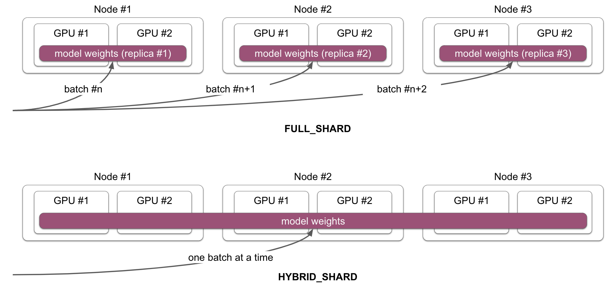
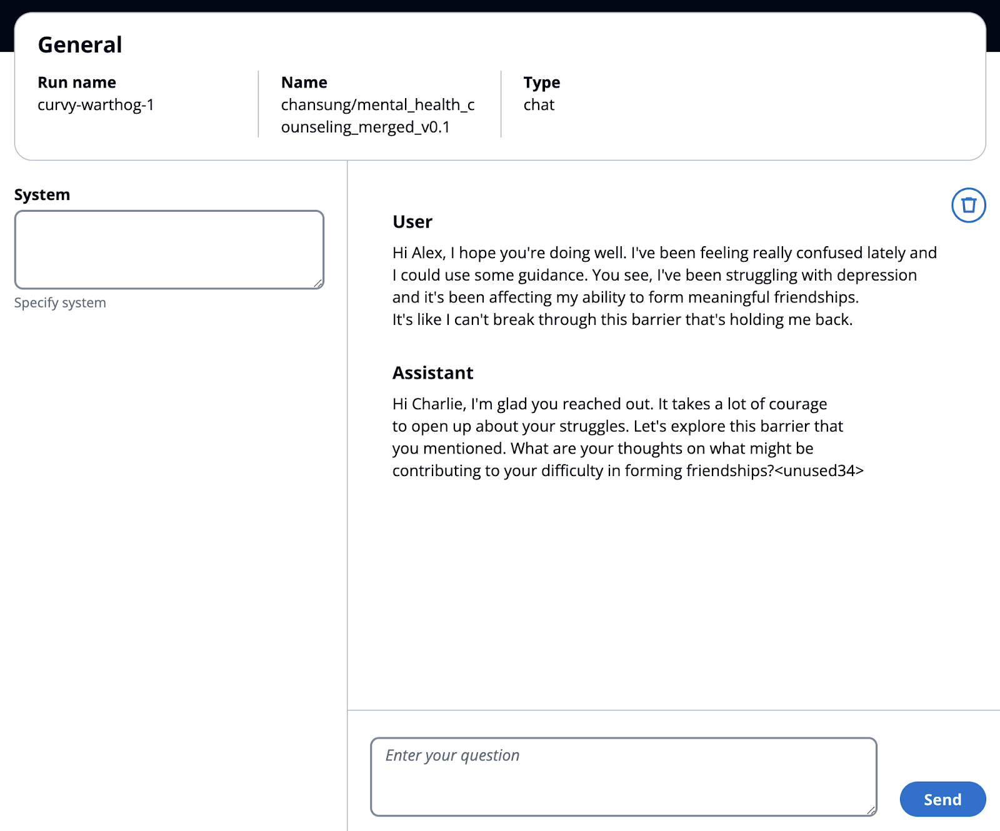

# From Fine-Tuning to Serving LLMs with OCI and dstack

dstack is an open-source tool that simplifies AI container orchestration and makes distributed training and deployment of LLMs more accessible. Combining dstack and OCI unlocks a streamlined process for setting up cloud infrastructure for distributed training and scalable model deployment.

This article walks you through fine-tuning a model using dstack on OCI, incorporating best practices from the Hugging Face Alignment Handbook, and then deploying the model using Hugging Face’s Text Generation Inference (TGI).

**NOTE**: The experiment described in the article used an OCI cluster of three nodes, each with 2 x A10 GPUs, to fine-tune the Gemma 7B model.

## How dstack works

dstack offers a unified interface for the development, training, and deployment of AI models across any cloud or data center. For example, you can specify a configuration for a training task or a model to be deployed, and dstack will take care of setting up the required infrastructure and orchestrating the containers. One of the advantages dstack offers is that it allows the use of any hardware, frameworks, and scripts.

## Setting up dstack with OCI

With four simple steps, we can use dstack with OCI. First, we need to install the dstack Python package. Since dstack supports multiple cloud providers, we can narrow down the scope to OCI:

```
pip install dstack[oci]
```

Next, we need to configure the OCI specific credentials inside the `~/.dstack/server/config.yml`. Below assumes that you have credentials for OCI CLI configured. For other configuration options, please follow the dstack’s official document.

```
projects:
- name: main
  backends:
  - type: oci
    creds:
      type: default
```

The final step is to run the dstack server as below.

```
dstack server
INFO     Applying ~/.dstack/server/config.yml...
INFO     Configured the main project in ~/.dstack/config.yml
INFO     The admin token is ab6e8759-9cd9-4e84-8d47-5b94ac877ebf
INFO     The dstack server 0.18.4 is running at http://127.0.0.1:3000
```

Then, switch to the folder with your project scripts and initialize dstack.

```
dstack init
```

## Fine-Tuning on OCI with dstack
To fine-tune Gemma 7B model, we’ll be using the Hugging Face Alignment Handbook to ensure the incorporation of the best fine-tuning practices. The source code of this tutorial can be obtained from GitHub. Let's dive into the practical steps for fine-tuning your LLM. 

Once, you switch to the project folder, here's the command to initiate the fine-tuning job on OCI with dstack:

```
ACCEL_CONFIG_PATH=fsdp_qlora_full_shard.yaml \   
  FT_MODEL_CONFIG_PATH=qlora_finetune_config.yaml \
  HUGGING_FACE_HUB_TOKEN=xxxx \
  WANDB_API_KEY=xxxx \
  dstack run . -f ft.task.dstack.yml
```

The `FT_MODEL_CONFIG_PATH`, `ACCEL_CONFIG_PATH`, `HUGGING_FACE_HUB_TOKEN`, and `WANDB_API_KEY` environment variables are defined inside the `ft.task.dstack.yml` task configuration. `dstack run` submits the task defined in `ft.task.dstack.yml` on OCI. 

**NOTE**: that dstack automatically copies the current directory’s content when executing the task.

Let’s explore the key parts of each YAML file (for the full contents, check the repository). 

The `qlora_finetune_config.yaml` file is the recipe configuration that the Alignment Handbook can understand about how you would want to fine-tune an LLM:

```
# Model arguments
model_name_or_path: google/gemma-7b
tokenizer_name_or_path: philschmid/gemma-tokenizer-chatml 
torch_dtype: bfloat16
bnb_4bit_quant_storage: bfloat16

# LoRA arguments
load_in_4bit: true
use_peft: true
lora_r: 8
lora_alpha: 16
lora_dropout: 0.05
lora_target_modules:
  - q_proj
  - k_proj
# ...


# Data training arguments
dataset_mixer:
  chansung/mental_health_counseling_conversations: 1.0
dataset_splits:
  - train
  - test
# ...
```

* **Model arguments**

    * `model_name_or_path`: Google’s Gemma 7B is chosen as the base model
    * `tokenizer_name_or_path`: alignment-handbook uses apply_chat_template() method of the chosen tokenizer. This tutorial uses the ChatML template instead of the Gemma 7B’s standard conversation template.
    * `torch_dtype` and `bnb_4bit_quant_storage`: these two values should be defined the same if we want to leverage FSDP+QLoRA fine-tuning method. Since Gemma 7B is hard to fit into a single A10 GPU, this blog post uses FSDP+QLoRA to shard a model into 2 x A10 GPUs while leveraging QLoRA technique.
* **LoRA arguments**: LoRA specific configurations. Since this blog post leverages FSDP+QLoRA technique, `load_in_4bit` is set to `true`. Other configurations could vary from experiment to experiment.
* **Data training arguments**: we have prepared a dataset which is based on Amod’s mental health counseling conversations’ dataset. Since alignment-handbook only understands the data in the form of `[{"role": "user", "content": "..."}, {"role": "assistant", "content": "..."}, …]` which can be interpreted with tokenizer’s `apply_chat_template()` method, the prepared dataset is basically the conversion of the original dataset into the `apply_chat_template()` compatible format.

The `fsdp_qlora_full_shard.yaml` file configures accelerate how to use the underlying infrastructure for fine-tuning the LLM:

```
compute_environment: LOCAL_MACHINE
distributed_type: FSDP  # Use Fully Sharded Data Parallelism
fsdp_config: 
  fsdp_auto_wrap_policy: TRANSFORMER_BASED_WRAP
  fsdp_backward_prefetch: BACKWARD_PRE
  fsdp_cpu_ram_efficient_loading: true
  fsdp_use_orig_params: false 
  fsdp_offload_params: true
  fsdp_sharding_strategy: FULL_SHARD
  # ... (other FSDP configurations)
# ... (other configurations)
```

* `distributed_type`: `FSDP` indicates the use of Fully Sharded Data Parallel (FSDP), a technique that enables training large models that would otherwise not fit on a single GPU.
* `fsdp_config`: These set up how FSDP operates, such as how the model is sharded (`fsdp_sharding_strategy`) and whether parameters are offloaded to CPU (`fsdp_offload_params`).



With the `FSDP` of `distributed_type` and `FULL_SHARD` of `fsdp_config`’s `fsdp_sharding_strategy`, a model will be sharded across multiple GPUs in a single machine. When dealing with multiple compute nodes, each node will host an identical copy of the model, which is itself split across multiple GPUs within that node. This means each partitioned model instance on each node processes different sections or batches of your dataset. To distribute a single model across multiple GPUs spanning across multiple nodes, configure the parameter `fsdp_sharding_strategy` as `HYBRID_SHARD`.

Additional parameters like "machine_rank," "num_machines," and "num_processes" are important for coordination. However, it's recommended to set these values dynamically at runtime, as this provides flexibility when switching between different infrastructure setups.

## The power of dstack: simplified configuration

Finally, let's explore the `fsdp_qlora_full_shard.yaml` configuration that puts everything together and instructs dstack on how to provision infrastructure and run the task.

```
type: task
nodes: 3

python: "3.11" 
env:
  - ACCEL_CONFIG_PATH
  - FT_MODEL_CONFIG_PATH
  - HUGGING_FACE_HUB_TOKEN
  - WANDB_API_KEY 
commands:
  # ... (setup steps, cloning repo, installing requirements)
  - ACCELERATE_LOG_LEVEL=info accelerate launch \
      --config_file recipes/custom/accel_config.yaml \
      --main_process_ip=$DSTACK_MASTER_NODE_IP \
      --main_process_port=8008 \
      --machine_rank=$DSTACK_NODE_RANK \
      --num_processes=$DSTACK_GPUS_NUM \
      --num_machines=$DSTACK_NODES_NUM \
      scripts/run_sft.py recipes/custom/config.yaml
ports:
  - 6006 
resources:
  gpu: 1..2
  shm_size: 24GB
```

**Key points to highlight**:
* **Seamless Integration**: dstack effortlessly integrates with Hugging Face's open source ecosystem. In Particular, you can simply use the accelerate library with the configurations that we defined in `fsdp_qlora_full_shard.yaml` as normal.
* **Automatic Configuration**: `DSTACK_MASTER_NODE_IP`, `DSTACK_NODE_RANK`, `DSTACK_GPUS_NUM`, and `DSTACK_NODES_NUM` variables are automatically managed by dstack, reducing manual setup.
* **Resource Allocation**: dstack makes it easy to specify the number of nodes and GPUs (gpu: 1..2) for your fine-tuning job. Hence, for this blog post, there are three nodes each of which is equipped with 2 x A10(24GB) GPUs.

## Serving your fine-tuned model with dstack

Once your model is fine-tuned, dstack makes it a breeze to deploy it on OCI using Hugging Face's Text Generation Inference (TGI) framework. 

Here's an example of how you can define a service in dstack:

```
type: service
image: ghcr.io/huggingface/text-generation-inference:latest
env: 
  - HUGGING_FACE_HUB_TOKEN
  - MODEL_ID=chansung/mental_health_counseling_merged_v0.1 
commands: 
  - text-generation-launcher \
    --max-input-tokens 512 --max-total-tokens 1024 \      
    --max-batch-prefill-tokens 512 --port 8000
port: 8000

resources:
  gpu:
    memory: 48GB

# (Optional) Enable the OpenAI-compatible endpoint
model: 
  format: tgi
  type: chat
  name: chansung/mental_health_counseling_merged_v0.1 
```

**Key advantages of this approach**:
* **Secure HTTPS Gateway**: Dstack simplifies the process of setting up a secure HTTPS connection through a gateway, a crucial aspect of production-level model serving.
* **Optimized for Inference**: The TGI framework is designed for efficient text generation inference, ensuring your model delivers responsive and reliable results.
* **Auto-scaling**: dstack allows to specify the auto-scaling policy, including the minimum and maximum number of model replicas.

At this point, you can interact with the service via standard curl command and Python’s requests, OpenAI SDK, and Hugging Face’s InferenceClient libraries. For instance, the code snippet below shows an example of curl.

```
curl -X POST https://black-octopus-1.mycustomdomain.com/generate \
  -H "Authorization: Bearer <dstack-token>" \
  -H 'Content-Type: application/json' \
  -d '{"inputs": "I feel bad...", "parameters": {"max_new_tokens": 128}}' 
```

Additionally, for a deployed model, dstack automatically provides a user interface to directly interact with the model:



## Conclusion

By following the steps outlined in this article, you've unlocked a powerful approach to fine-tuning and deploying LLMs using the combined capabilities of dstack, OCI, and Hugging Face's ecosystem. You can now leverage dstack's user-friendly interface to manage your OCI resources effectively, streamlining the process of setting up distributed training environments for your LLM projects. 

Furthermore, the integration with Hugging Face's Alignment Handbook and TGI framework empowers you to fine-tune and serve your models seamlessly, ensuring they're optimized for performance and ready for real-world applications. We encourage you to explore the possibilities further and experiment with different models and configurations to achieve your desired outcomes in the world of natural language processing.

**About the author**: Chansung Park is a HuggingFace fellow and is an AI researcher working on LLMs.