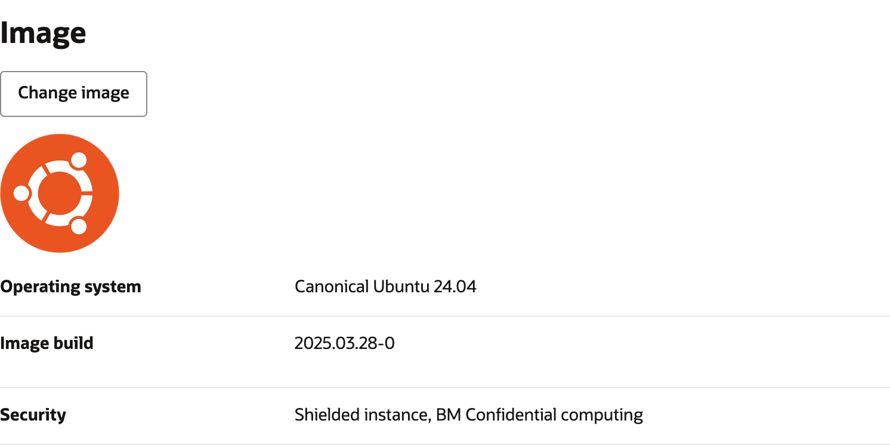

# LLM Benchmarking with Docker Compose

This repository demonstrates how to benchmark LLM with
[vLLM](https://vllm.ai)
and
[genai-perf](https://docs.nvidia.com/nim/benchmarking/llm/latest/step-by-step.html#using-genai-perf-to-benchmark)
using
[Docker Compose](https://docs.docker.com/compose/).

Reviewed: 20.05.2025

# When should this asset be used?

* If you want to evaluate the performance of various LLM models or various shapes on OCI.

# How is this asset used?

## Prerequisites

* You have access to an Orcale Cloud Tenancy.
* You have access to shapes with NVIDIA GPUs such as the A10.
* You have a HuggingFace account and access to `meta-llama/Llama-3.1-8B-Instruct`.

## Infrastructure Setup

1. Create a new instance using a GPU shape.

   * Use Ubuntu as the system image for simplicity.

     

   * Create a large enough boot volume, e.g., with 200GB space.

2. Log into the machine and install NVIDIA drivers:
   ```sh
   sudo apt-get update
   sudo apt-get install -y ubuntu-drivers-common
   sudo ubuntu-drivers install --gpgpu nvidia:570-server
   ```
   If your shape has a NVLink fabric, also install the matching fabric manager
   from NVIDIA:
   ```sh
   sudo apt-get install -y nvidia-fabricmanager-570
   ```

3. Install Docker Compose:
   ```sh
   sudo apt-install -y docker-compose
   ```
   and add yourself to the `docker` group:
   ```sh
   sudo usermod -aG docker ubuntu
   ```

4. Then install and configure the container toolkit.
   In depth instructions on the NVIDIA container toolkit can be found
   [on NVIDIA's website](https://docs.nvidia.com/datacenter/cloud-native/container-toolkit/latest/install-guide.html#with-apt-ubuntu-debian).
   ```sh
   curl -fsSL https://nvidia.github.io/libnvidia-container/gpgkey | sudo gpg --dearmor -o /usr/share/keyrings/nvidia-container-toolkit-keyring.gpg \
   && curl -s -L https://nvidia.github.io/libnvidia-container/stable/deb/nvidia-container-toolkit.list | \
     sed 's#deb https://#deb [signed-by=/usr/share/keyrings/nvidia-container-toolkit-keyring.gpg] https://#g' | \
     sudo tee /etc/apt/sources.list.d/nvidia-container-toolkit.list
   sudo apt-get install -y nvidia-container-toolkit
   sudo nvidia-ctk runtime configure --runtime=docker
   ```

5. Reboot the machine.

## Environment Configuration

This section is only needed if you wish to run LLM models from HuggingFace that
are gated and require an access token.

1. Install `uv`:
   ```sh
   sudo snap install --classic astral-uv
   ```

2. Install the HuggingFace package:
   ```sh
   uv venv
   uv pip install huggingface_hub
   ```

3. Log into HuggingFace with your access token:
   ```sh
   uv run huggingface-cli login
   ```

## Executing the Benchmarks

1. Download the contents of the folder ["files"](./files).
   Then build the necessary containers with `docker-compose`:
   ```sh
   docker-compose --profile benchmark build
   ```

2. Edit the configuration file, `config.json`.  This will specify all necessary
   settings with which the LLM is served.  For example:
   ```json
   {
       "model": "meta-llama/Llama-3.1-8B-Instruct",
       "gpu_memory_utilization": 0.98,
       "tensor_parallel_size": 1,
       "max_model_len": 8192,
       "max_num_batched_tokens": 8192
   }
   ```
   will run Llama 3.1.  Modify this file to the settings you desire.

3. Launch the LLM in the background:
   ```sh
   docker-compose up -d llm
   ```
   You can follow the start-up of the vLLM service with:
   ```sh
   docker-compose logs -f llm
   ```

4. Start the benchmarking container:
   ```sh
   docker-compose run perf
   ```
   This will execute multiple runs of NVIDIA's `genai-perf`, and store the
   results in the directory `./results`, containing information about the vLLM
   parameters and the shape used.

   To run only certain scenarios and concurrent request settings, modify
   [`compose.yaml`](files/compose.yaml) and have the `command` for the `perf`
   container read, i.e:
   ```yaml
       command:
         - "wait-for-it.sh"
         - "--timeout=300"
         - "llm:8000"
         - "--"
         - "/appli/scripts/benchmark.py"
         - "--scenario"
         - "chatbot"
         - "--concurrency"
         - "1"
         - "4"
         - "16"
   ```

5. Run the plotting:
   ```sh
   docker-compose run plot
   ```
   The output files will be in `./plots`.

6. Shut down all remaining containers:
   ```sh
   docker-compose down
   ```

# Acknowledgments

- **Author** - Omar Awile (GPU Specialist)
- **Author** - Matthias Wolf (GPU Specialist)

# License
 
Copyright (c) 2025 Oracle and/or its affiliates.
 
Licensed under the Universal Permissive License (UPL), Version 1.0.
 
See [LICENSE](https://github.com/oracle-devrel/technology-engineering/blob/main/LICENSE) for more details.
