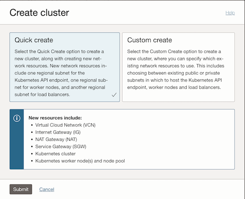

# Deploying Ollama and Open WebUI on OKE

In this tutorial, we will explain how to use famous Mistral models in a browser using Open WebUI. The LLM will be served using Ollama and the overal infrastructure will rely on an Oracle Kubernetes Engine with a NVIDIA A10 GPU node pool.

## Prerequisites

To run this tutorial, you will need:
* An OCI tenancy with limits set for A10 based instances 

## Deploying the infrastructure

### Creating the OKE cluster with a CPU node pool

The first step consists in creating a Kubernetes cluster. Initially, the cluster will be configured with a CPU node pool only. GPU node pool will be added afterwards.



The easiest way is to use the Quick Create cluster assistant with the following options:
* Public Endpoint,
* Self-Managed nodes,
* Private workers,
* VM.Standard.E5.Flex compute shapes,
* Oracle Linux OKE specific image.

### Accessing the cluster

Click Access Cluster, choose Cloud Shell Access or Local Access and follow the instructions. If you select Local Access, you must first install and configure the OCI CLI package. Check that the nodes are there:
```
kubectl get nodes
```

### Adding a GPU node pool

Once the cluster is available, we can add a GPU node pool. Go to `Node pools` on the left panel and click on `Add node pool` and use the following options:
* Public endpoint,
* Self-Managed Nodes,
* VM.GPU.A10.1 nodes,
* Oracle Linux GPU OKE image.
* Specify a custom boot volume size of 250 GB and add an Initialization script (Advanced options) to apply the changes.
```
#!/bin/bash
curl --fail -H "Authorization: Bearer Oracle" -L0 http://169.254.169.254/opc/v2/instance/metadata/oke_init_script | base64 --decode >/var/run/oke-init.sh
bash /usr/libexec/oci-growfs -y
bash /var/run/oke-init.sh
```
Click on Create to add the GPU instances and wait for the node pool to be `Active` and the nodes to be in the `Ready` state. Check again the nodes that are available:
```
kubectl get nodes
```
Check device visibility on the GPU node whose name is `xxx.xxx.xxx.xxx`:
```
kubectl describe nodes xxx.xxx.xxx.xxx | grep gpu
```
You will get the following output:
```
                    nvidia.com/gpu=true
Taints:             nvidia.com/gpu=present:NoSchedule
  nvidia.com/gpu:     1
  nvidia.com/gpu:     1
  kube-system                 nvidia-gpu-device-plugin-8ktcj    50m (0%)      50m (0%)    200Mi (0%)       200Mi (0%)     4m48s
  nvidia.com/gpu     0           0
```
(The following manifests are not tied to any GPU type.)


### Installing the NVIDIA GPU Operator

You can access the cluster either using Cloud Shell or using a standalone instance. The NVIDIA GPU Operator enhances the GPU features visibility in Kubernetes. The easiest way to install it is to use `helm`.
```
helm repo add nvidia https://helm.ngc.nvidia.com/nvidia
helm repo update
helm install gpu-operator nvidia/gpu-operator --namespace gpu-operator --create-namespace
```
Check again the device visibility on the GPU node:
```
kubectl describe nodes xxx.xxx.xxx.xxx | grep gpu
```
You will get the following output:
```
                    nvidia.com/gpu=true
                    nvidia.com/gpu-driver-upgrade-state=upgrade-done
                    nvidia.com/gpu.compute.major=8
                    nvidia.com/gpu.compute.minor=6
                    nvidia.com/gpu.count=1
                    nvidia.com/gpu.deploy.container-toolkit=true
                    nvidia.com/gpu.deploy.dcgm=true
                    nvidia.com/gpu.deploy.dcgm-exporter=true
                    nvidia.com/gpu.deploy.device-plugin=true
                    nvidia.com/gpu.deploy.driver=pre-installed
                    nvidia.com/gpu.deploy.gpu-feature-discovery=true
                    nvidia.com/gpu.deploy.node-status-exporter=true
                    nvidia.com/gpu.deploy.operator-validator=true
                    nvidia.com/gpu.family=ampere
                    nvidia.com/gpu.machine=Standard-PC-i440FX-PIIX-1996
                    nvidia.com/gpu.memory=23028
                    nvidia.com/gpu.mode=compute
                    nvidia.com/gpu.present=true
                    nvidia.com/gpu.product=NVIDIA-A10
                    nvidia.com/gpu.replicas=1
                    nvidia.com/gpu.sharing-strategy=none
                    nvidia.com/vgpu.present=false
                    nvidia.com/gpu-driver-upgrade-enabled: true
Taints:             nvidia.com/gpu=present:NoSchedule
  nvidia.com/gpu:     1
  nvidia.com/gpu:     1
  gpu-operator                gpu-feature-discovery-9jmph                         0 (0%)        0 (0%)      0 (0%)           0 (0%)         3m1s
  gpu-operator                gpu-operator-node-feature-discovery-worker-t6b75    5m (0%)       0 (0%)      64Mi (0%)        512Mi (0%)     3m16s
  gpu-operator                nvidia-container-toolkit-daemonset-t5tpc            0 (0%)        0 (0%)      0 (0%)           0 (0%)         3m3s
  gpu-operator                nvidia-dcgm-exporter-2jvhz                          0 (0%)        0 (0%)      0 (0%)           0 (0%)         3m2s
  gpu-operator                nvidia-device-plugin-daemonset-zbk2b                0 (0%)        0 (0%)      0 (0%)           0 (0%)         3m2s
  gpu-operator                nvidia-operator-validator-wpkxt                     0 (0%)        0 (0%)      0 (0%)           0 (0%)         3m3s
  kube-system                 nvidia-gpu-device-plugin-8ktcj                      50m (0%)      50m (0%)    200Mi (0%)       200Mi (0%)     12m
  nvidia.com/gpu     0           0
  Normal  GPUDriverUpgrade         2m52s              nvidia-gpu-operator    Successfully updated node state label to upgrade-done
```

## Deploying Ollama

### Creating Ollama deployment

To deploy Ollama, simply use the `ollama-deployment.yml` manifest.
```
kubectl apply -f ollama-deployment.yaml
```
Check that the deployment is ready:
```
kubectl get all
```

### Pulling the model from pod

Enter the container:
```
kubectl exec -ti ollama-deployment-pod -- /bin/bash
```
where `ollama-deployment-pod` is the name of the pod displayed by the `kubectl get pods` command.
Check Ollama installation and pull desired model(s), here Mistral 7B version 0.3 from Mistral AI, simply referred to as `mistral`:
```
ollama --version (optional)
ollama pull mistral
```
For more model options, the list of all supported models can be found in [here](https://ollama.com/search).

Optionnally, the model can be tested from the container:
```
ollama run mistral
>>> Tell me about Mistral AI.
 Mistral AI is a cutting-edge company based in Paris, France, developing large language models. Founded by CTO Edouard Dumoulin and CEO Thibault Favodi in 2021, Mistral AI aims to create advanced artificial intelligence technologies that can understand, learn, and generate human-like text with a focus on French and European languages.

Mistral AI is backed by prominent European investors, including Daphni, Founders Future, and Iris Capital, among others, and has received significant financial support from the French government to further its research and development in large language models. The company's ultimate goal is to contribute to France's technological sovereignty and help shape the future of artificial
intelligence on the European continent.

One of Mistral AI's most notable projects is "La Mesure," a large-scale French language model that has achieved impressive results in various natural language processing tasks, such as text generation and understanding. The company is dedicated to pushing the boundaries of what AI can do and applying its technology to real-world applications like education, entertainment, and more.

>>> /bye
```
Exit the container by simply typing `exit`.


### Creating Ollama service

The Ollama service can be created using the `ollama-service.yaml` manifest:
```
kubectl apply -f ollama-service.yaml
```

## Deploying Open WebUI

### Creating Open WebUI deployment

Open WebUI can be deployed using the `openwebui-deployment.yaml` manifest:
```
kubectl apply -f openwebui-deployment.yaml
```

### Creating Open WebUI service

The Open WebUI service can be created using the `openwebui-service.yaml` manifest:
```
kubectl apply -f openwebui-service.yaml
```

## Testing the platform

Check that everything is running:
```
kubectl get all
```
Go to `http://xxx.xxx.xxx.xxx:81` where xxx.xxx.xxx.xxx is the external IP address of the Open WebUI load balancer and click on `Get started` and create admin account (local).

If no model can be found, go to `Profile > Settings > Admin Settings > Connections > Manage Ollama API Connections`. Verify that the Ollama address matches the Ollama service load balancer external IP address and check the connection by clicking on the `Configure icon > Verify Connection`.

You can now start chatting with the model.


## External links

* [Mistral AI official website](https://mistral.ai/)
* [Ollama official website](https://ollama.com/)
* [Open WebUI official website](https://openwebui.com/)

## License

Copyright (c) 2025 Oracle and/or its affiliates.

Licensed under the Universal Permissive License (UPL), Version 1.0.

See [LICENSE](https://github.com/oracle-devrel/technology-engineering/blob/main/LICENSE) for more details.