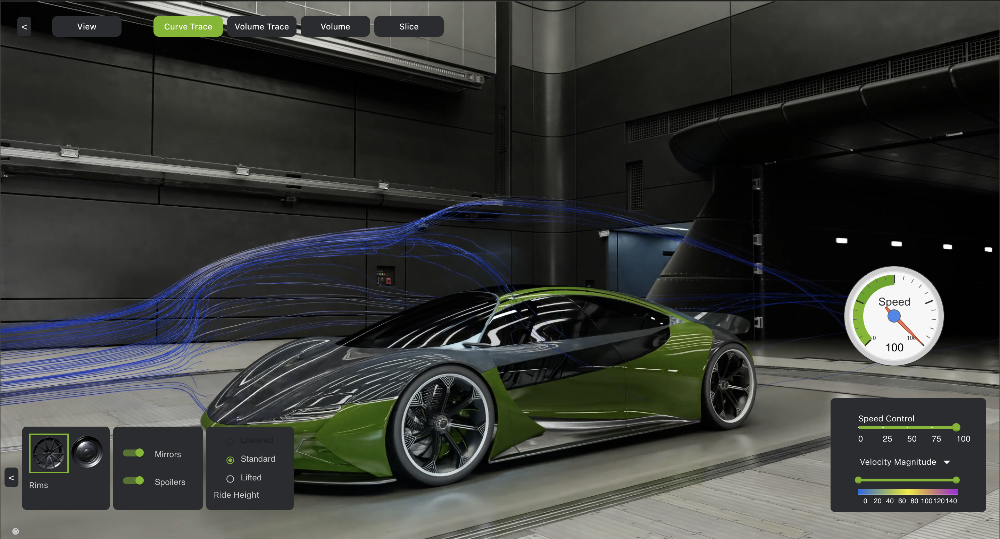

# Building NVIDIA blueprint on OCI: Digital twins for fluid simulation

This tutorial explains how to run the NVIDIA Omniverse Digital Twins for Fluid Simulation blueprint on OCI. This example shows how to study the aerodynamics (drag, down force, etc.) of a car using a virtual wind tunnel.


## Prerequisites

To run this blueprint, you will need:
- an OCI tenancy with limits to use a BM.GPU.L40S-NC.4 shape
- an NVIDIA account for the NGC Catalog
- an NGC API key to download images from the NGC catalog


## Instance configuration

In the OCI Console, create an instance using the BM.GPU.L40S-NC.4 shape (bare metal server with 4 x NVIDIA L40S GPU) and a native Canonical Ubuntu 22.04 image. NVIDIA drivers will be installed afterwards.


### Installing NVIDIA drivers

When the instance is up, a specific version NVIDIA drivers can be installed. but beforehands, we must install additional packages toi build them:
```
sudo apt install -y build-essential
```
Then we can download the NVIDIA driver version 535.161.07 available [here](https://www.nvidia.com/fr-fr/drivers/details/220428/) and install it.
```
wget https://fr.download.nvidia.com/XFree86/Linux-x86_64/535.161.07/NVIDIA-Linux-x86_64-535.161.07.run
chmod +x NVIDIA-Linux-x86_64-535.161.07.run
sudo ./NVIDIA-Linux-x86_64-535.161.07.run
```
The instance must be rebooted for the changes to be taken into account.
```
sudo reboot
```


### Installing additional packages

As this is a native Ubuntu version, a few additional packages must be installed to clone the repo and add and configure docker.
```
sudo apt install -y git-lfs
sudo apt install -y docker.io
sudo apt install -y docker-compose-v2
sudo apt install -y docker-buildx
```

### Installing and configuring NVIDIA Container Toolkit

First of all, we must add the NVIDIA Container Toolkit repository to the repository list:
```
curl -fsSL https://nvidia.github.io/libnvidia-container/gpgkey | sudo gpg --dearmor -o /usr/share/keyrings/nvidia-container-toolkit-keyring.gpg \
  && curl -s -L https://nvidia.github.io/libnvidia-container/stable/deb/nvidia-container-toolkit.list | \
    sed 's#deb https://#deb [signed-by=/usr/share/keyrings/nvidia-container-toolkit-keyring.gpg] https://#g' | \
    sudo tee /etc/apt/sources.list.d/nvidia-container-toolkit.list
```
Then, we can update the list of packages from all repositories, install the `nvidia-container-toolkit` package and configure docker.
```
sudo apt update
sudo apt install -y nvidia-container-toolkit
sudo nvidia-ctk runtime configure --runtime=docker
sudo systemctl restart docker
```

## Downloading and building the project

At this stage it is necessary to set you NGC API key as an environment variable to be able to download the right content from the NGC Catalog.
```
echo "export NGC_API_KEY=nvapi-xxx" >> ~/.bashrc
source ~/.bashrc
```
where `nvapi-xxx` is your own NGC API key.

Once done, we can clone the repository and build the images:
```
git clone ssh://github.com/NVIDIA-Omniverse-Blueprints/digital-twins-for-fluid-simulation $HOME/digital_twins_for_fluid_simulation
cd $HOME/digital_twins_for_fluid_simulation
./build-docker.sh
```
Now 2 files have to be modified, namely `.env` and `compose.yml`.

First, create a copy of the environment file template:
```
cp .env_template .env
```
and set the `ZMQ_IP` with the instance private IP address.
```
ZMQ_IP=XXX.XXX.XXX.XXX
```

Then, modify `compose.yml` file.
1. In the `kit` section, replace the `network_mode: host` line by the following block:
```
networks:
  outside:
    ipv4_address: XXX.XXX.XXX.XXX
```
and set the `ipv4_address` variable with the instance public IP address.

2. In the `aeronim` section, comment the `network_mode: host` line.

3. At the bottom of the file, add the following block:
```
networks:
  outside:
    driver: bridge
    ipam:
      driver: default
      config:
        - subnet: XXX.XXX.XXX.0/24
```
where the subnet mask is your public IP address with the last number replaced by 0.

## Running the blueprint

To start the digital twin, simply run the following command:
```
sudo docker compose up -d
```
The blueprint will take some time to initialize. Expect a minimum of 10 minutes before accessing the GUI in a web browser at `http://XXX.XXX.XXX.XXX:5273` where `XXX.XXX.XXX.XXX` is the public IP address of the instance. You should something like the image below.



Run `sudo docker compose down` to stop the project.


## External links

* [Original NVIDIA GitHub repo](https://github.com/NVIDIA-Omniverse-blueprints/digital-twins-for-fluid-simulation)

## License

Copyright (c) 2025 Oracle and/or its affiliates.

Licensed under the Universal Permissive License (UPL), Version 1.0.

See [LICENSE](https://github.com/oracle-devrel/technology-engineering/blob/main/LICENSE) for more details.