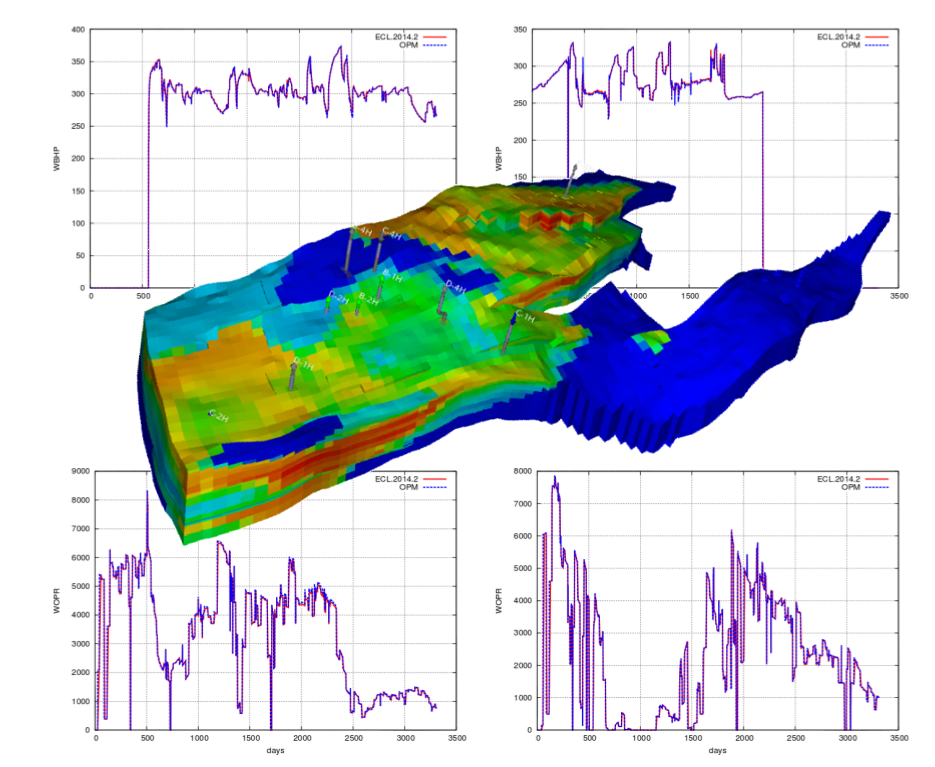

# Building and Running OPM Flow on OCI GPU infrastructure

## The OPM initiative

The [Open Porous Media (OPM)](https://opm-project.org/) initiative is an innovative open source project for modeling and simulating porous media processes.



OPM Flow is a fully-implicit, black-oil simulator capable of running industry-standard simulation models. The simulator is implemented using automatic differentiation to enable rapid development of new fluid models.

## Configuring a GPU instance on OCI

Oracle Cloud Infrastructure offers GPU shapes for all kinds of workloads, including:
- NVIDIA A10 24GB (available on-demand)
    - VM with 1 or 2 GPUs
    - BM with 4 GPUs
- NVIDIA A100 40GB (available on-demand)
    - VM with 1 GPU
    - BM with 8 GPUs, NVLink and RDMA cluster networking
- NVIDIA L40S 48GB
    - BM with 4 GPUs and RDMA cluster networking
- NVIDIA A100 80GB
    - VM with 1 GPU
    - BM with 8 GPUs, NVLink and RDMA cluster networking
- NVIDIA H100 80GB
    - BM with 8 GPUs, NVLink and RDMA cluster networking
- AMD MI300X 192GB
    - BM with 8 GPUs, HIP and RDMA cluster networking

This tutorial covers both NVIDIA and AMD GPU shapes. More specifically, we use here:
- A 1 x A100 80 GB virtual machine (VM.GPU.A100.80GB.1)
- A 8 x MI300X 192 GB bare metal (BM.GPU.MI300X.8)

Both shapes are configured with a Cannonical Ubuntu 22.04 image with respectively CUDA and ROCm preinstalled. 

On the NVIDIA GPU shapes, it is necessary to install the NVIDIA CUDA Compiler (NVCC) to build Flow:
```
sudo apt-get install -y nvidia-cuda-toolkit
```

## Installing OPM Flow on OCI GPU infrastructure

The project can be installed from packages or built from sources. For GPU support, building from sources is mandatory.

### Installing binaries

When GPU are not required or not available, OPM Flow can run on CPU only. In this case, installing the toolset from packages is the easiest way (see tutorial [here](https://opm-project.org/?page_id=245)).

### Building from sources

Running OPM Flow on GPU requires to build the toolset from sources in order to setup the GPU support. Common Building from Source guidelines are available [here](https://opm-project.org/?page_id=231). In the sequel, one can get more hands-on commands and advices for a complete configuration.

#### Installing prerequisites

A collection of libraries, framework and tools are necessary to build Flow. A complete description is available [here](https://opm-project.org/?page_id=239). They can be installed using the `install_prerequisites.sh` script.
```
sudo ./assets/scripts/install_prerequisites.sh
```

#### Building the modules

4 modules must be built in a specific order:
1. `opm-common`
2. `opm-grid`
3. `opm-simulators`
4. `opm-upscaling`

For `opm-common`and `opm-grid`, no specific actions is required. Simply follow the build instructions:
```
git clone https://github.com/OPM/[modulename].git
mkdir [modulename]/build && cd [modulename]/build
cmake ..
make
```
However, for `opm-simulators` it is necessary to turn off the `USE_GPU_BRIDGE` option at the `cmake` stage:
```
git clone https://github.com/OPM/opm-simulators.git
mkdir opm-simulators/build && cd opm-simulators/build
cmake .. -DUSE_GPU_BRIDGE=OFF # add the -DCONVERT_CUDA_TO_HIP=ON option for AMD GPUs
make
```
The following error might occur at the `make` stage:
```
/usr/include/c++/11/bits/std_function.h:435:145: error: parameter packs not expanded with ‘...’:
  435 |         function(_Functor&& __f)
      |                                                                                                                                                 ^
/usr/include/c++/11/bits/std_function.h:435:145: note:         ‘_ArgTypes’
/usr/include/c++/11/bits/std_function.h:530:146: error: parameter packs not expanded with ‘...’:
  530 |         operator=(_Functor&& __f)
      |                                                                                                                                                  ^
/usr/include/c++/11/bits/std_function.h:530:146: note:         ‘_ArgTypes’
make[2]: *** [CMakeFiles/opmsimulators.dir/build.make:2680: CMakeFiles/opmsimulators.dir/opm/simulators/linalg/gpuistl/detail/vector_operations.cu.o] Error 1
make[2]: *** Waiting for unfinished jobs....
make[1]: *** [CMakeFiles/Makefile2:530: CMakeFiles/opmsimulators.dir/all] Error 2
make: *** [Makefile:146: all] Error 2
```
If it does, two lines (beginning by the `noexcept` keyword) must be commented in the `std_function.h` file, i.e.:
- approximately line 430:
```
  template<typename _Functor,
           typename _Constraints = _Requires<_Callable<_Functor>>>
    function(_Functor&& __f)
    //noexcept(_Handler<_Functor>::template _S_nothrow_init<_Functor>()) // CUDA does not support this line
    : _Function_base()

```
- approximately line 450:
```
  template<typename _Functor,
           typename _Constraints = _Requires<_Callable<_Functor>>>
    function(_Functor&& __f)
    //noexcept(_Handler<_Functor>::template _S_nothrow_init<_Functor>()) // CUDA does not support this line
    : _Function_base()

```
Finally, build `opm-upscaling`:
```
git clone https://github.com/OPM/opm-upscaling.git
mkdir opm-upscaling/build && cd opm-upscaling/build
cmake ..
make
```

## Running OPM Flow on GPU

Running the Flow simulator on one or more GPUs requires to use GPU-specific solver and preconditionners. They can be defined in a linear solver [file](/assets/scripts/gpu-solver.json) in the JSON format, for example:
```
{
    "tol": "0.01",
    "maxiter": "200",
    "verbosity": "0",
    "solver": "gpubicgstab",
    "preconditioner": {
        "type": "GPUDILU",
        "verbosity" : 0,
        "split_matrix": "true",
        "tune_gpu_kernels": "true",
        "mixed_precision_scheme": 1
    }
}
```
To run the simulation, open datasets are available [here](https://github.com/OPM/opm-data.git). For example, to run the Norne use case, simply execute:
```
/home/ubuntu/opm-simulators/build/bin/flow NORNE_ATW2013.DATA --output-dir=out_gpu --matrix-add-well-contributions=true --linear-solver=/home/ubuntu/gpu-solver.json
```
for 1 GPU and:
```
mpirun -np N /home/ubuntu/opm-simulators/build/bin/flow NORNE_ATW2013.DATA --output-dir=out_gpu --matrix-add-well-contributions=true --threads-per-process=1 --linear-solver=/home/ubuntu/gpu-solver.json
```
for N GPUs.

## Notes:

Here are a few comments to take into account when considering running Flow on GPUs:
* The options `--matrix-add-well-contributions=true` and `--threads-per-process=1` are recommended by OPM.
* Because of the import CPU/GPU traffic, running Flow on GPU is only relevant for models above a certain size (few hundreds of thousands of cells).
* Using a CUDA-aware or ROCm-aware version of Open MPI may improve the overall performance of the simulation.

## External Links

* [The Open Porous Media Initiative](https://opm-project.org/)
* [The Best Public Cloud for Oil and Gas Reservoir Simulation](https://blogs.oracle.com/cloud-infrastructure/post/the-best-public-cloud-for-oil-and-gas-reservoir-simulation)
* [Building CUDA-aware Open MPI](https://www.open-mpi.org/faq/?category=buildcuda)

## License

Copyright (c) 2025 Oracle and/or its affiliates.

Licensed under the Universal Permissive License (UPL), Version 1.0.

See [LICENSE](https://github.com/oracle-devrel/technology-engineering/blob/main/LICENSE) for more details.