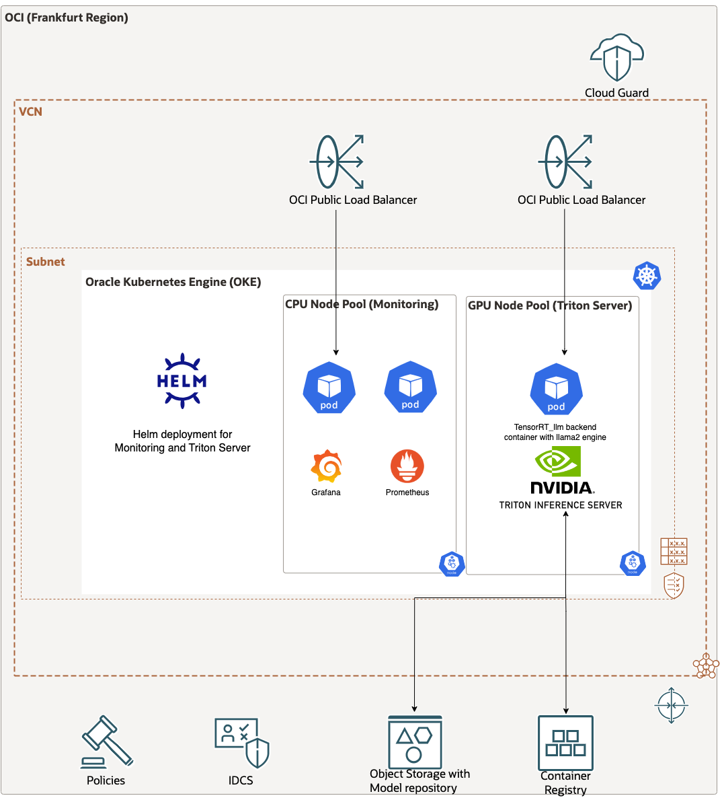

# Triton GPU OKE

This repository intends to demonstrate how to deploy NVIDIA Triton Inference Server on Oracle Kubernetes Engine (OKE) with TensorRT-LLM Backend in order to server Large Language Models (LLMs) in a Kubernetes architecture.

Reviewed 23.05.2024

# When to use this asset?

To run the RAG tutorial with a local deployment of Mistral 7B Instruct v0.2 using a vLLM inference server powered by an NVIDIA A10 GPU.

# How to use this asset?

## Pre-requisites

* You have access to an Oracle Cloud Tenancy.
* You have access to shapes with NVIDIA GPU such as A10 GPUs (i.e. VM.GPU.A10.1).
* You have a [container registry](https://docs.oracle.com/en-us/iaas/Content/Registry/home.htm).
* You have an [Auth Token](https://docs.oracle.com/en-us/iaas/Content/Registry/Tasks/registrypushingimagesusingthedockercli.htm#Pushing_Images_Using_the_Docker_CLI) to push/pull images to/from the registry.
* You are familiar with Kubernetes and Helm basic terminology.

## Walkthrough

This walkthrough is highly inspired by the [TensorRT-LLM](https://github.com/triton-inference-server/tensorrtllm_backend) Backend on Triton official repo](https://github.com/triton-inference-server/tensorrtllm_backend) with slight modifications to use Oracle Cloud services and llama2-7B model.

### Build a container with support for the TensorRT-LLM Backend

Start a VM.GPU.A10.1 with the [NGC image](https://docs.oracle.com/en-us/iaas/Content/Compute/References/ngcimage.htm) and a boot volume of 250GB and clone the tensorrt_backend repo:

```bash
git clone https://github.com/triton-inference-server/tensorrtllm_backend.git
```

Install git lfs:

```bash
curl -s https://packagecloud.io/install/repositories/github/git-lfs/script.deb.sh | sudo bash
sudo apt-get install git-lfs
git lfs install && git lfs pull
```

Go to the directory and update the submodule TensorRT-LLM repository:

```bash
git submodule update --init --recursive
git lfs install
git lfs pull
```

### Update to the required NVIDIA Drivers (Optional)

At the time of redaction and to use the provided dockerfile in tensorrtllm_backend/dockerfile/Dockerfile.trt_llm_backend with BASE_TAG=23.12-py3, CUDA 12.3 is required. See [here](https://developer.nvidia.com/cuda-downloads?target_os=Linux&target_arch=x86_64&Distribution=Ubuntu&target_version=20.04&target_type=deb_network) for more information

```bash
sudo apt purge nvidia* libnvidia*
sudo apt-get install -y cuda-drivers-545
sudo apt-get install -y nvidia-kernel-open-545
sudo apt-get -y install cuda-toolkit-12-3
sudo reboot
```

Make sure you have nvidia-container-toolkit:

```bash
sudo apt-get install -y nvidia-container-toolkit
sudo nvidia-ctk runtime configure --runtime=docker
sudo systemctl restart docker
```

Check the new version:

```bash
nvidia-smi
/usr/local/cuda/bin/nvcc --version
```

### Build the container

> WARNING
> Building the container takes 1h15 on a VM.GPU.A10.1 and the final container is 70GB. This is why it is highly recommended to increase the Boot Volume. Because of the long building time, feel free to detach the process or use a tool like _tmux_ .

This operation takes the Dockerfile from  tensorrtllm_backend/dockerfile/Dockerfile.trt_llm_backend with BASE_TAG=23.12-py3 and builds *triton_trt_llm*:

```bash
tmux new -s triton
cd /home/ubuntu/tensorrtllm_backend
DOCKER_BUILDKIT=1 docker build --network host -t triton_trt_llm -f dockerfile/Dockerfile.trt_llm_backend .
```

Once the container is built, it is recommended to save it to your private registry (i.e *triton_llm*). Please note this example is using a federated tenancy with Oracle Identity Cloud Service:

```bash
sudo docker login -u '<tenancy-namespace>/oracleidentitycloudservice/<username>' <region-key>.ocir.io
sudo docker tag triton_trt_llm:latest <region-key>.ocir.io/<tenancy-namespace>/triton_llm:triton_trt_llm_23.12_manual_build
sudo docker push <region-key>.ocir.io/<tenancy-namespace>/triton_llm:triton_trt_llm_23.12_manual_build
```

### Get LLaMA-2-7B and [build the engine](https://github.com/NVIDIA/TensorRT-LLM/tree/e06f537e08f792fd52e6fef7bbc7b54774492503/examples/llama)

To be able to download LLaMA2, request access from [this page from Meta](https://llama.meta.com/llama-downloads) and follow the instructions. Once you have been granted access, you can continue with the walkthrough.

#### Get LLaMA-2-7B

First, make sure you have `md5sum` installed:

```bash
sudo apt install -y ucommon-utils
```

Check that it has been installed with this command:

```bash
md5sum --version
```

Go to the LLaMA directory, download the LLaMA repo and download the 7B model:

To download the model weights and tokenizer, please visit the [Meta website](https://ai.meta.com/resources/models-and-libraries/llama-downloads/) and accept their license.

Once your request is approved, you will receive a signed URL over email. Then run the `download.sh` script, passing the URL provided when prompted to start the download:

```bash
cd /home/ubuntu/tensorrtllm_backend/tensorrt_llm/examples/llama
git clone https://github.com/facebookresearch/llama.git
cd llama
./download.sh
cd ..
```

Copy `tokenizer.model` to the downloaded model:

```bash
cp llama/tokenizer.model llama/llama-2-7b/
```

#### Convert Weights to HF format

Download the conversion script from [HuggingFace](https://huggingface.co/docs/transformers/main/en/model_doc/llama) and start the Triton Server container (i.e24.01-trtllm-python-py3) :

```bash
wget https://raw.githubusercontent.com/huggingface/transformers/main/src/transformers/models/llama/convert_llama_weights_to_hf.py
```

Start the container and share the root directory of *tensorrtllm_backend*:

```bash
docker run --rm -it --net host --shm-size=2g --ulimit memlock=-1 --ulimit stack=67108864 --gpus all -v /home/ubuntu/tensorrtllm_backend:/tensorrtllm_backend <region-key>.ocir.io/<tenancy-namespace>/triton_llm:triton_trt_llm_23.12_manual_build bash

python /tensorrtllm_backend/tensorrt_llm/examples/llama/convert_llama_weights_to_hf.py \
    --input_dir /tensorrtllm_backend/tensorrt_llm/examples/llama/llama/llama-2-7b --model_size 7B --output_dir /tensorrtllm_backend/tensorrt_llm/examples/llama/llama-2-7B_hf
```

#### Build the engine

In this example, the engine is built for 1 GPU with precision FP16.

```bash
python /tensorrtllm_backend/tensorrt_llm/examples/llama/convert_checkpoint.py --model_dir /tensorrtllm_backend/tensorrt_llm/examples/llama/llama-2-7B_hf/ \
                              --output_dir /tensorrtllm_backend/tensorrt_llm/examples/llama/tllm_checkpoint_1gpu_fp16 \
                              --dtype float16

trtllm-build --checkpoint_dir /tensorrtllm_backend/tensorrt_llm/examples/llama/tllm_checkpoint_1gpu_fp16 \
            --output_dir /tensorrtllm_backend/tensorrt_llm/examples/llama/trt_engines/fp16/1-gpu \
            --gpt_attention_plugin float16 \
            --gemm_plugin float16

exit
```

At this stage, the engine output is located in /home/ubuntu/tensorrtllm_backend/tensorrt_llm/examples/llama/trt_engines/fp16/1-gpu

### Prepare the model repository

Note that the process is explained in ["Create the model repository"](https://github.com/triton-inference-server/tensorrtllm_backend/tree/main)

```bash
# Create the model repository that will be used by the Triton server
cd /home/ubuntu/tensorrtllm_backend
mkdir triton_model_repo

# Copy the example models to the model repository
cp -r all_models/inflight_batcher_llm/* triton_model_repo/

# Copy the TRT engine to triton_model_repo/tensorrt_llm/1/
cp tensorrt_llm/examples/llama/trt_engines/fp16/1-gpu/* triton_model_repo/tensorrt_llm/1
```

### Host on Oracle Cloud Object Storage

Create a bucket on Oracle Cloud Object Storage to host your models.

```bash
oci os bucket create --compartment-id <COMPARTMENT_OCID> --name triton-inference-server-repository
```

You can adapt the content of the files _config.pbtxt_ to your needs. An example is provided in `llama2-7b`. Note that _tokenizer_dir_ in _postprocessing/config.pbtxt_ and _gpt_model_path_ in _tensorrt_llm/config.pbtxt_ point to fix path within the container. This configuration is intended to work on GPU without changes if you follow the next part __*Build the Container for OKE*__.

```bash
cp <path_to_llama2-7b>/* /home/ubuntu/tensorrtllm_backend/triton_model_repo 
oci os object bulk-upload -bn triton-inference-server-repository --src-dir /home/ubuntu/tensorrtllm_backend/triton_model_repo 
```

### Build the Container for OKE

Due to some limitations, it is currently required to add the model directory together with the engine directly to the container to be able to run with OKE. You can monitor [this opened issue for any updates](https://github.com/triton-inference-server/tensorrtllm_backend/issues/181)

Create a new directory to build your container:

```bash
mkdir build_container
cd build_container

mkdir output_llama_hf
mkdir model_repo
cp -R /home/ubuntu/tensorrtllm_backend/tensorrt_llm/examples/llama/llama-2-7B_hf/* output_llama_hf/
cp -R /home/ubuntu/tensorrtllm_backend/triton_model_repo/tensorrt_llm model_repo/
```

This container is based on the previous one built in __*Convert Weights to HF format*__

Review the dockerfile in this repository to adapt the tag to your container line 1 and run the following:

```bash
docker build -t triton_trt_llm_llama .
```

Tag your new container and push it to your repo:

```bash
sudo docker tag triton_trt_llm_llama:latest <region-key>.ocir.io/<tenancy-namespace>/triton_llm:triton_trt_llm_llama
sudo docker push <region-key>.ocir.io/<tenancy-namespace>/triton_llm:triton_trt_llm_llama
```

### Deploy on OKE

Here is the target architecture at the end of the deployment:



At this stage, your container is ready and uploaded to your Oracle Registry. It is now time to bring everything together in Oracle Kubernetes Engines (OKE)

#### Deploy an OKE Cluster

Start by creating an OKE Cluster following [this tutorial](https://docs.oracle.com/en-us/iaas/Content/ContEng/Tasks/contengcreatingclusterusingoke_topic-Using_the_Console_to_create_a_Quick_Cluster_with_Default_Settings.htm) with slight adaptations:

* Start by creating 1 CPU node pool that will be used for monitoring with 1 node only (i.e. VM.Standard.E4.Flex with 5 OCPU and 80GB RAM) with the default image.
* Once your cluster is up, create another node pool with 1 GPU node (i.e. VM.GPU.A10.1) with the default image coming with the GPU drivers. __*Important note*__: Make sure to increase the boot volume (350 GB) and add the following cloud-init script for the changes to be taken into account](https://blogs.oracle.com/ateam/post/oke-node-sizing-for-very-large-container-images):

```bash
#!/bin/bash
curl --fail -H "Authorization: Bearer Oracle" -L0 http://169.254.169.254/opc/v2/instance/metadata/oke_init_script | base64 --decode >/var/run/oke-init.sh
bash /var/run/oke-init.sh
sudo /usr/libexec/oci-growfs -y
```

#### Deploy using Helm in Cloud Shell

See [this documentation](https://docs.oracle.com/en-us/iaas/Content/API/Concepts/cloudshellgettingstarted.htm#:~:text=Login%20to%20the%20Console.,the%20Cloud%20Shell%20was%20started.) to access Cloud Shell.

##### Adapting the variables

You can find the Helm configuration in */oci* where you need to adapt the *values.yaml*:

```bash
echo -n 'REGION' | base64
```

```bash
echo -n 'SECRECT_KEY_ID' | base64
```

```bash
echo -n 'SECRET_ACCESS_KEY' | base64
```

Review your credentials for the [secret to pull the image](https://helm.sh/docs/howto/charts_tips_and_tricks/#creating-image-pull-secrets) in `values.yaml`:

```bash
registry: <region-key>.ocir.io/<tenancy-namespace>/triton_llm
username: <tenancy-namespace>/oracleidentitycloudservice/<username>
password: <auth_token>
email: example@example.com
```

Finally, make sure to adapt the value of _image.imageName_ to _<region-key>.ocir.io/<tenancy-namespace>/triton_llm:triton_trt_llm_llama_ and _image.modelRepositoryPath_ with the correct namespace, region identifier and bucket name.

##### Deploying the monitoring

The monitoring consists of Grafana and Prometheus pods. The configuration comes from [kube-prometheus-stack](https://github.com/prometheus-community/helm-charts/tree/main/charts/kube-prometheus-stack)

Here we add a public Load Balancer to reach the Grafana dashboard from the Internet. Use username=admin and password=prom-operator to login. The _serviceMonitorSelectorNilUsesHelmValues_ flag is needed so that Prometheus can find the inference server metrics in the example release deployed below.

```bash
helm install example-metrics --set prometheus.prometheusSpec.serviceMonitorSelectorNilUsesHelmValues=false --set grafana.service.type=LoadBalancer prometheus-community/kube-prometheus-stack --debug
```

The default load balancer created comes with a fixed shape and a bandwidth of 100Mbps. You can switch to a [flexible](https://docs.oracle.com/en-us/iaas/Content/ContEng/Tasks/contengcreatingloadbalancers-subtopic.htm#contengcreatingloadbalancers_subtopic) shape and adapt the bandwidth according to your OCI limits in case the bandwidth is a bottleneck.

An example Grafana dashboard is available in `dashboard-review.json`. Use the import function in Grafana to import and view this dashboard.

You can then see the Public IP of your Grafana dashboard by running:

```bash
$ kubectl get svc
NAME                                       TYPE           CLUSTER-IP     EXTERNAL-IP       PORT(S)                      AGE
alertmanager-operated                      ClusterIP      None           <none>            9093/TCP,9094/TCP,9094/UDP   2m33s
example-metrics-grafana                    LoadBalancer   10.96.82.33    xxx.xxx.xxx.xxx   80:31005/TCP                 2m38s
```

##### Deploying the inference server

Deploy the inference server using the default configuration with the following commands.

```bash
cd <directory containing Chart.yaml>
helm install example . -f values.yaml --debug
```

Use kubectl to see the status and wait until the inference server pods are running. The container is big so the first pull will take time. Once the container is created, loading the model will also take some time. You can monitor the pod with:

```bash
kubectl describe pods <POD_NAME>
kubectl logs <POD_NAME>
```

Once the setup is complete, your container should be running:

```bash
$ kubectl get pods
NAME                                               READY   STATUS    RESTARTS   AGE
example-triton-inference-server-5f74b55885-n6lt7   1/1     Running   0          2m21s
```

#### Using Triton Inference Server

Now that the inference server is running you can send HTTP or GRPC requests to it to perform inferencing. By default, the inferencing service is exposed with a LoadBalancer service type. Use the following to find the external IP for the inference server. In this case it is 34.83.9.133.

```bash
$ kubectl get services
NAME                             TYPE           CLUSTER-IP     EXTERNAL-IP   PORT(S)                                        AGE
...
example-triton-inference-server  LoadBalancer   10.18.13.28    xxx.xxx.xxx.xxx   8000:30249/TCP,8001:30068/TCP,8002:32723/TCP   47m
```

The inference server exposes an HTTP endpoint on port 8000, and GRPC endpoint on port 8001 and a Prometheus metrics endpoint on port 8002. You can use curl to get the meta-data of the inference server from the HTTP endpoint.

Please replace the 'xxx.xxx.xxx.xxx' with your external IP in the following command.

```bash
$ curl xxx.xxx.xxx.xxx:8000/v2
```

From your client machine, you can now send a request to the public IP on port 8000:

Please replace the 'xxx.xxx.xxx.xxx' with your external IP in the following command.

```bash
curl -X POST xxx.xxx.xxx.xxx:8000/v2/models/tensorrt_llm_bls/generate -d '{"text_input": "Oracle Cloud is", "max_tokens": 53, "bad_words": "", "stop_words": ""}'
```

The output should be as follows:

```bash
{"context_logits":0.0,"cum_log_probs":0.0,"generation_logits":0.0,"model_name":"tensorrt_llm_bls","model_version":"1","output_log_probs":[0.0,0.0,0.0,0.0,0.0,0.0,0.0,0.0,0.0,0.0,0.0,0.0,0.0,0.0,0.0,0.0,0.0,0.0,0.0,0.0,0.0,0.0,0.0,0.0,0.0,0.0,0.0,0.0,0.0,0.0,0.0,0.0,0.0,0.0,0.0,0.0,0.0,0.0,0.0,0.0,0.0,0.0,0.0,0.0,0.0,0.0,0.0,0.0,0.0,0.0,0.0,0.0,0.0],"text_output":"Oracle Cloud is a cloud computing platform that provides a wide range of services, including compute, storage, networking, database, analytics, and more. It is designed to help organizations build and deploy applications quickly and easily, while also providing a secure and scalable infrastructure.\n"}
```

### Cleaning up

Once you've finished using the inference server you should use helm to delete the deployment.

```bash
$ helm list
NAME            REVISION  UPDATED                   STATUS    CHART                          APP VERSION   NAMESPACE
example         1         Wed Feb 27 22:16:55 2019  DEPLOYED  triton-inference-server-1.0.0  1.0           default
example-metrics	1       	Tue Jan 21 12:24:07 2020	DEPLOYED	prometheus-operator-6.18.0   	 0.32.0     	 default

$ helm uninstall example
$ helm uninstall example-metrics

```

For the Prometheus and Grafana services, you should [explicitly delete CRDs](https://github.com/prometheus-community/helm-charts/tree/main/charts/kube-prometheus-stack#uninstall-helm-chart):

```bash
kubectl delete crd alertmanagerconfigs.monitoring.coreos.com alertmanagers.monitoring.coreos.com podmonitors.monitoring.coreos.com probes.monitoring.coreos.com prometheuses.monitoring.coreos.com prometheusrules.monitoring.coreos.com servicemonitors.monitoring.coreos.com thanosrulers.monitoring.coreos.com
```

You may also want to delete the OCI bucket you created to hold the model repository.

```bash
oci os bucket delete --bucket-name triton-inference-server-repository --empty
```

# Resources

* [TensorRT-LLM Backend on Triton official repo](https://github.com/triton-inference-server/tensorrtllm_backend)
* [NCG page with all versions of NVIDIA Triton Inference Server](https://catalog.ngc.nvidia.com/orgs/nvidia/containers/tritonserver/tags)
* [LLaMA Example](https://github.com/NVIDIA/TensorRT-LLM/tree/e06f537e08f792fd52e6fef7bbc7b54774492503/examples/llama)
* [Triton deployment on Cloud Provider](https://github.com/triton-inference-server/server/tree/main/deploy)

# License
 
Copyright (c) 2024 Oracle and/or its affiliates.
 
Licensed under the Universal Permissive License (UPL), Version 1.0.
 
See [LICENSE](https://github.com/oracle-devrel/technology-engineering/blob/main/LICENSE) for more details.