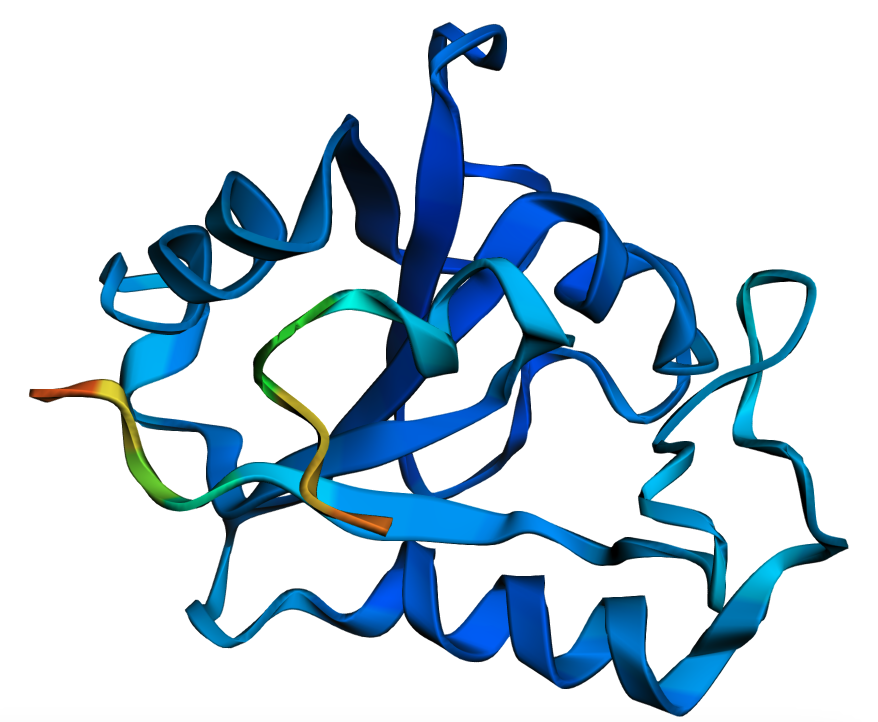

# Protein Structure Prediction for DHFR Inhibitor Discovery using NVIDIA NIM for Alphafold2 


Reviewed: 16.10.2025

## Introduction
This tutorial demonstrates how to deploy [NVIDIA NIM for Alphafold2](https://docs.nvidia.com/nim/bionemo/alphafold2/latest/index.html) on Oracle Cloud Infrastructure Container Engine for Kubernetes (OKE) in order to do protein structure prediction. 

### Objectives
- Achieve a scalable deployment of NVIDIA NIM for Alphafold2
- Get protein structure prediction from their amino acid sequences
- Visualise the protein structure with Pymol

### Prerequisites
- Access to an Oracle Cloud Infrastructure (OCI) tenancy.

- Access to shapes with NVIDIA GPU such as A10 GPUs (i.e., `VM.GPU.A10.1`). For more information on requests to increase the limit, see [Service Limits](https://docs.oracle.com/en-us/iaas/Content/General/Concepts/servicelimits.htm).

- Access to NVIDIA NGC with valid personnal keys. This is required to use the container. For more information, see [Creating a NGC account and generating an API key](https://docs.nvidia.com/nim/bionemo/alphafold2/latest/prerequisites.html#ngc-nvidia-gpu-cloud-account).

- Knowledge of basic terminology of Kubernetes and Helm.

## Task 1: Deploy an OKE cluster
Create an OKE cluster from the "quick create" tab with node type `managed`. For more information, see [Using the Console to create a Cluster with Default Settings in the 'Quick Create' workflow](https://docs.oracle.com/en-us/iaas/Content/ContEng/Tasks/contengcreatingclusterusingoke_topic-Using_the_Console_to_create_a_Quick_Cluster_with_Default_Settings.htm).

- Start by creating 1 node pool called `management` that will be used for default pods deployment (i.e., `VM.Standard.E4.Flex` with 5 OCPU and 80GB RAM) with the default image.

- Once your cluster is up, create another node pool with 1 GPU node (i.e., `VM.GPU.A10.1`) called `NIM` with the default image with the GPU drivers (i.e., `Oracle-Linux-8.X-Gen2-GPU-XXXX.XX.XX`).

> [!IMPORTANT] 
> Make sure to increase the boot volume to 2.5TB and add the following [cloud-init](./cloud-init) script in **Show advanced options** and **Initialization script**. On the first deployment, Alphafold2 will download the models and database which take a lot of disk space. One can also upload their ssh public key in case access to the node is required. Note that in this case, a [bastion session](https://docs.oracle.com/en-us/iaas/Content/Bastion/Concepts/bastionoverview.htm) will be required to access the machine in a private subnet.

## Task 2: Deploy the application using Helm in OCI Cloud Shell
To access OCI Cloud Shell, see [To access Cloud Shell via the Console](https://docs.oracle.com/en-us/iaas/Content/API/Concepts/cloudshellgettingstarted.htm#:~:text=Login%20to%20the%20Console.,the%20Cloud%20Shell%20was%20started.).

1. You can find the Helm configuration in the folder [`helm`](./helm), where you can update `values.yaml`. There is 1 replica by default (can be more if the number of `VM.GPU.A10.1` increases) and `service.type` is set to `LoadBalancer` to create a flexible load balancer with a public IP in order to access the API endpoint of the container. 
Upload the folder to your OCI Cloud Shell environment. For more information, see [To upload a file to Cloud Shell using the menu](https://docs.oracle.com/en-us/iaas/Content/API/Concepts/devcloudshellgettingstarted.htm#:~:text=To%20upload%20a%20file%20to%20Cloud%20Shell%20using%20the%20menu,click%20select%20from%20your%20computer.). 

2. Set your NGC key as Kubernetes secret
```
kubectl create secret generic ngc-registry-secret --from-literal=NGC_REGISTRY_KEY=<YOUR_NGC_REGISTRY_KEY>
```

3. Set an environment varible with your desired chart name
```
export CHART_NAME=<your-chart-name>
```

4. Install Helm Chart:
> [!IMPORTANT] 
> The first deployment will take a lot of time because the models need to be downloaded. Once they are cached, the download will no longer be necessary on thothese machine as long as `persistence.hostPath`remains the same. This also means that the values of `livenessProbe` and `readinessProbe` can be adjusted accordingly. Once the models are downloaded, the materialisation of the workspace can take up to 2h on a `VM.GPU.A10.1`, therefore the values might be set to `7200` after the initial deployment.
```
cd helm
helm install "${CHART_NAME}" . --debug
```

5. Follow the container initialisation and get the logs if needed
````
kubectl get pods
NAME                                                           READY   STATUS    RESTARTS       AGE
alphafoldnim-protein-design-chart-alphafold2-xxxx-xxxx   1/1     Running   1 (121m ago)   165m

# describe pod
kubectl describe pods alphafoldnim-protein-design-chart-alphafold2-xxxx-xxxx

#get log 
kubectl logs alphafoldnim-protein-design-chart-alphafold2-xxxx-xxxx --follow
````

6. Get the external IP of the load balancer: 
```
kubectl get svc
NAME                                           TYPE           CLUSTER-IP     EXTERNAL-IP       PORT(S)             AGE
alphafoldnim-protein-design-chart-alphafold2   LoadBalancer   10.96.69.193   <EXTERNAL_IP>   8081:30449/TCP      75m
```

## Task 3 (optional): Adapt the load balancer listener timeout
Because the requests can take a lot of time to be prcessed, it is possible one needs to increase the default [timeout set for the load balancer listeners](https://docs.oracle.com/en-us/iaas/Content/Balance/Reference/connectionreuse.htm). The default is 300s, to avoid issues it can be increased to 3600s (1 hour).

## Task 4: Perform protein structure predictions
The protein structure predictions code can be found in [alphafold2.ipynb](./alphafold2.ipynb). One simple way to run this notebook is to spin up a small VM (i.e `VM.Standard.E4.Flex` with 2 OCPU and 16GB of RAM) in any public subnet, setup a python virtual environment, install the requirements and start the jupyter server there. A local alternative is also possible. The following describe the jupyter notebook setup:

1. [Create](https://docs.oracle.com/en-us/iaas/Content/Compute/Tasks/launchinginstance.htm) a `VM.Standard.E4.Flex` with 2 OCPU and 16GB of RAM in any public subnet. Use the default OL8 image and provide a public key in order to ssh to it. 

2. Once ssh is up, ssh to it and install a python virtual environment. Use the following [requirements.txt](./requirements.txt)
```
ssh opc@<PUBLIC_IP>

# install miniconda
mkdir -p ~/miniconda3
wget https://repo.anaconda.com/miniconda/Miniconda3-latest-Linux-x86_64.sh -O ~/miniconda3/miniconda.sh
bash ~/miniconda3/miniconda.sh -b -u -p ~/miniconda3
rm ~/miniconda3/miniconda.sh

# activate the new venv 
source ~/miniconda3/bin/activate
conda create -n "nim" python=3.12 
conda activate nim

# install the requirements
pip install -r requirements.txt
```

3. Open port 8000 on the machine
```
# Open port 8000 on the machine for jupyter
sudo firewall-cmd --permanent --add-port=8000/tcp
sudo firewall-cmd --reload
```

4. Install Tmux and start the jupyter server 
```
# install tmux:
sudo yum install tmux -y

# in a tmux shell:
source ~/miniconda3/bin/activate
conda activate nim
jupyter lab --port=8000
```

5. Keep the output from the last command, it will be needed to connect to the notebook i.e `http://localhost:8000/lab?token=xxxxxxxxxxxxxxxxxxxxxxxxxxxxxxxxxxxx`

6. In another terminal window, create a local port forwarding:
```
ssh -L 8000:localhost:8000 opc@<PUBLIC_IP>
``` 

7. In your web browser, connect to `http://localhost:8000/lab?token=xxxxxxxxxxxxxxxxxxxxxxxxxxxxxxxxxxxx`

8. Run [alphafold2.ipynb](./alphafold2.ipynb)

## Task 5: Clean up the Deployment

1. Once you have finished using NVIDIA NIM for Alphafold2, you should use helm to delete the deployment.
```
$ helm list
NAME            NAMESPACE       REVISION        UPDATED                                 STATUS          CHART                           APP VERSION
alphafoldnim    default         1               2025-02-21 07:46:03.84342028 +0000 UTC  deployed        protein-design-chart-0.1.0      1.0.0  

$ helm uninstall "${CHART_NAME}"  --wait
```

# Acknowledgments

- **Authors** - Bruno Garbaccio (GPU Specialist), Wajahat Aziz (GPU Specialist leader)

# License

Copyright (c) 2024 Oracle and/or its affiliates.

Licensed under the Universal Permissive License (UPL), Version 1.0.

See [LICENSE](https://github.com/oracle-devrel/technology-engineering/blob/main/LICENSE) for more details.
