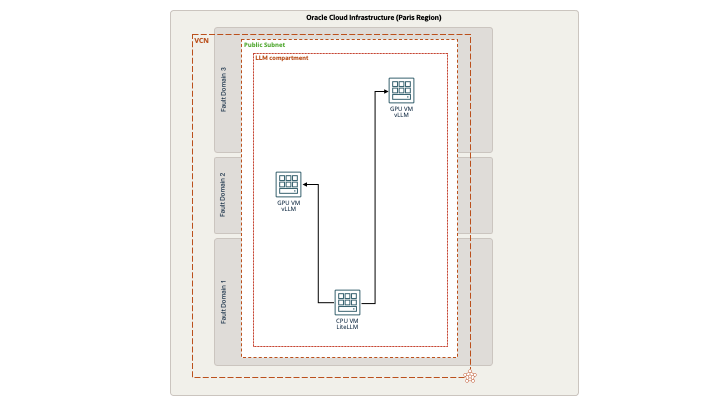

# Calling multiple vLLM inference servers using LiteLLM

In this tutorial we explain how to use a LiteLLM Proxy Server to call multiple LLM inference endpoints from a single interface. LiteLLM interacts will 100+ LLMs such as OpenAI, Cohere, NVIDIA Triton and NIM, etc. Here we will use two vLLM inference servers.

<!--  -->

# When to use this asset?

To run the inference tutorial with local deployments of Mistral 7B Instruct v0.3 using a vLLM inference server powered by an NVIDIA A10 GPU and a LiteLLM Proxy Server on top. 

# How to use this asset?

These are the prerequisites to run this tutorial:
* An OCI tenancy with A10 quota
* A Huggingface account with a valid Auth Token
* A valid OpenAI API Key

## Introduction

LiteLLM provides a proxy server to manage auth, loadbalancing, and spend tracking across 100+ LLMs. All in the OpenAI format.
vLLM is a fast and easy-to-use library for LLM inference and serving.
The first step will be to deploy two vLLM inference servers on NVIDIA A10 powered virtual machine instances. In the second step, we will create a LiteLLM Proxy Server on a third no-GPU instance and explain how we can use this interface to call the two LLM from a single location. For the sake of simplicity, all 3 instances will reside in the same public subnet here.



## vLLM inference servers deployment

For each of the inference nodes a VM.GPU.A10.2 instance (2 x NVIDIA A10 GPU 24GB) is used in combination with the NVIDIA GPU-Optimized VMI image from the OCI marketplace. This Ubuntu-based image comes with all the necessary libraries (Docker, NVIDIA Container Toolkit) preinstalled. It is a good practice to deploy two instances in two different fault domains to ensure a higher availability.

The vLLM inference server is deployed using the vLLM official container image.
```
docker run --gpus all \
    -e HF_TOKEN=$HF_TOKEN -p 8000:8000 \
    --ipc=host \
    vllm/vllm-openai:latest \
    --host 0.0.0.0 \
    --port 8000 \
    --model mistralai/Mistral-7B-Instruct-v0.3 \
    --tensor-parallel-size 2 \
    --load-format safetensors \
    --trust-remote-code \
    --enforce-eager
```
where `$HF_TOKEN` is a valid HuggingFace token. In this case we use the 7B Instruct version of Mistral LLM. The vLLM endpoint can be directly called for verification with:
```
curl http://localhost:8000/v1/chat/completions \
    -H "Content-Type: application/json" \
    -d '{
        "model": "mistralai/Mistral-7B-Instruct-v0.3",
        "messages": [
            {"role": "user", "content": "Who won the world series in 2020?"}
        ]
    }' | jq
```

## LiteLLM server deployment

No GPU are required for LiteLLM. Therefore, a CPU based VM.Standard.E4.Flex instance (4 OCPUs, 64 GB Memory) with a standard Ubuntu 22.04 image is used. Here LiteLLM is used as a proxy server calling a vLLM endpoint. Install LiteLLM using `pip`:
```
pip install 'litellm[proxy]'
```
Edit the `config.yaml` file (OpenAI-Compatible Endpoint):
```
model_list:
  - model_name: Mistral-7B-Instruct
    litellm_params:
      model: openai/mistralai/Mistral-7B-Instruct-v0.3
      api_base: http://xxx.xxx.xxx.xxx:8000/v1
      api_key: sk-0123456789
  - model_name: Mistral-7B-Instruct
    litellm_params:
      model: openai/mistralai/Mistral-7B-Instruct-v0.3
      api_base: http://xxx.xxx.xxx.xxx:8000/v1
      api_key: sk-0123456789
```
where `sk-0123456789` is a valid OpenAI API key and `xxx.xxx.xxx.xxx` are the two GPU instances public IP addresses.

Start the LiteLLM Proxy Server with the following command:
```
litellm --config /path/to/config.yaml
```
Once the the Proxy Server is ready call the vLLM endpoint through LiteLLM with:
```
curl http://localhost:4000/chat/completions \
    -H 'Authorization: Bearer sk-0123456789' \
    -H "Content-Type: application/json" \
    -d '{
        "model": "Mistral-7B-Instruct",
        "messages": [
            {"role": "user", "content": "Who won the world series in 2020?"}
        ]
    }' | jq
```

## Documentation

* [LiteLLM documentation](https://litellm.vercel.app/docs/providers/openai_compatible)
* [vLLM documentation](https://docs.vllm.ai/en/latest/serving/deploying_with_docker.html)
* [MistralAI](https://mistral.ai/)