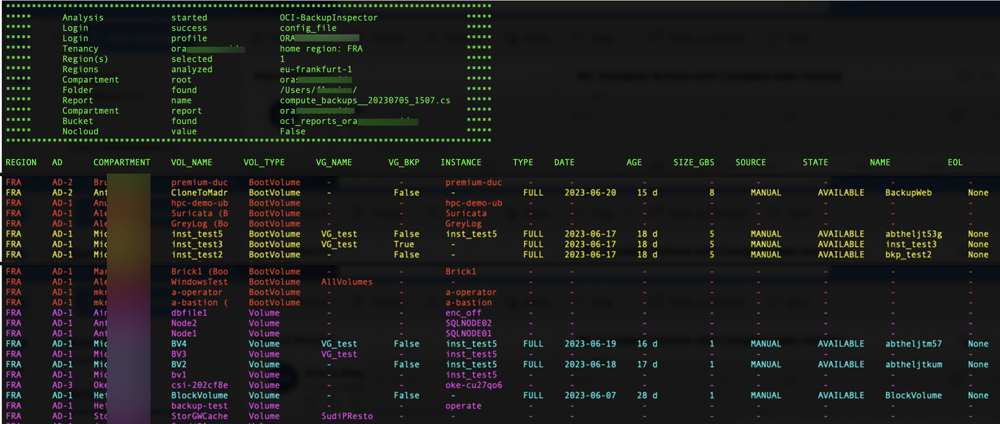

# OCI-BackupInspector

## When to use this asset?
**BackupInspector** generates comprehensive CSV reports that assess compute backups status for boot and block volumes.
 
## How to use this asset?

### Features 

1. searches for compute instances
2. retrieves all attached volumes
3. retrieves details about last available backup
4. analyzes unattached volumes
5. retrieves volume groups information
6. generates csv report
7. stores csv report locally or in an OCI bucket 

### Parameters for execution

Default authentication uses [Instance Principals](https://docs.public.oneportal.content.oci.oraclecloud.com/en-us/iaas/Content/Identity/Tasks/callingservicesfrominstances.htm), meaning you can run this script from an OCI virtual machine without having to provide any details or credentials

| Argument      | Parameter         | Description                                                          |
| -----------   | ----------------- | -------------------------------------------------------------------- |
| -cs           |                   | authenticate through CloudShell Delegation Token                     | 
| -cf           |                   | authenticate through local OCI config_file                           | 
| -cfp          | config_file       | change OCI config_file path, default: ~/.oci/config                  | 
| -cp           | config_profile    | indicate config file section to use, default: DEFAULT                | 
| -c            | compartment_ocid  | compartment to store the bucket report, default: root                | 
| -b            | bucket_name       | bucket name to store the report, default: reports_YOUR_TENANT_NAME   | 
| -rf           | report_folder     | local folder path to store the report, default: ~                    | 
| -rn           | report_name       | name of the csv report, default: compute_backups_CURRENT_DATE_TIME   | 
| -nocloud      |                   | if used: do not store csv report on OCI, default: False              | 
| -tlc          | compartment_ocid  | scan only a specific compartment, default: scan from root compartment| 
| -rg           | region_name       | scan only a specific region, default: scan all subscribed regions    | 
| -h            | --help            | show this help message and exit                                      | 

#### Default - No argument:
	
	python3 ./OCI-BackupInspector.py

without arguments **OCI-BackupInspector** tries to authenticate using Instance Principals

#### Authenticate with local_config_file:
	
	python3 ./OCI-BackupInspector.py -cf

#### Authenticate with custom local_config_file & profile:
	
	python3 ./OCI-BackupInspector.py -cf -cfp /home/opc/myconfig -cp MyDomain

#### Authenticate in cloud_shell:
	
	python3 ./OCI-BackupInspector.py -cs

#### Custom parameters examples:
	
	python3 ./OCI-BackupInspector.py -cf -rg eu-paris-1 -tlc ocid1.compartment.oc1..aaaaaaaaurxxxx -b data_bucket -rn backups_of_my_instances

	python3 ./OCI-BackupInspector.py rg eu-frankfurt-1 -nocloud -rf /home/opc/data/ -rn backups_of_my_instances
	
**Terminal output**

**CSV report**

# From

[https://github.com/Olygo/OCI-BackupInspector](https://github.com/Olygo/OCI-BackupInspector)

# License

Copyright (c) 2023 Oracle and/or its affiliates.

Licensed under the Universal Permissive License (UPL), Version 1.0.

See [LICENSE](https://github.com/oracle-devrel/technology-engineering/blob/folder-structure/LICENSE) for more details.
