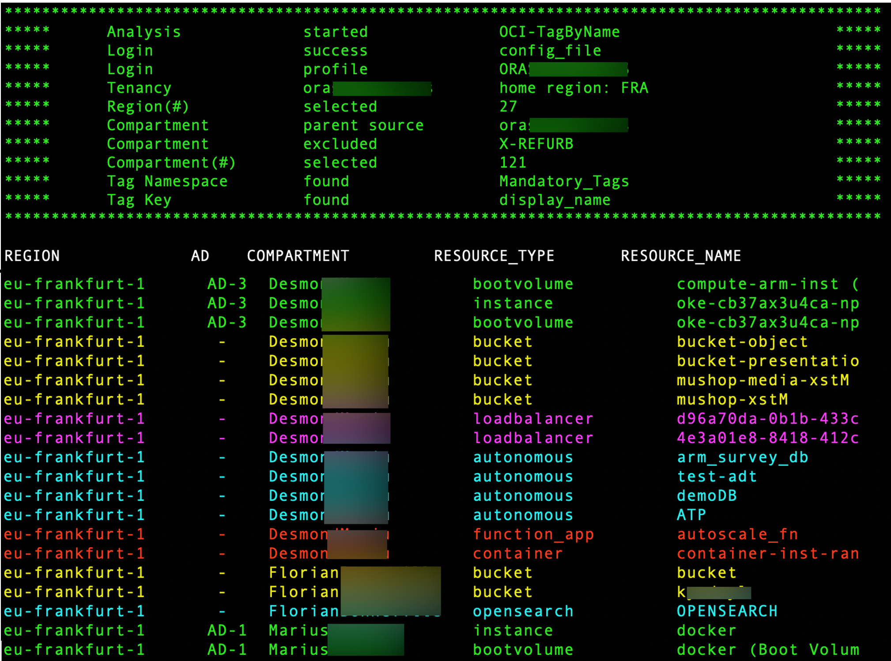
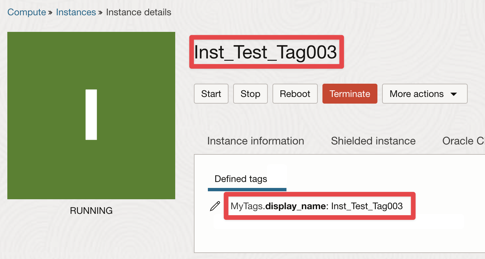
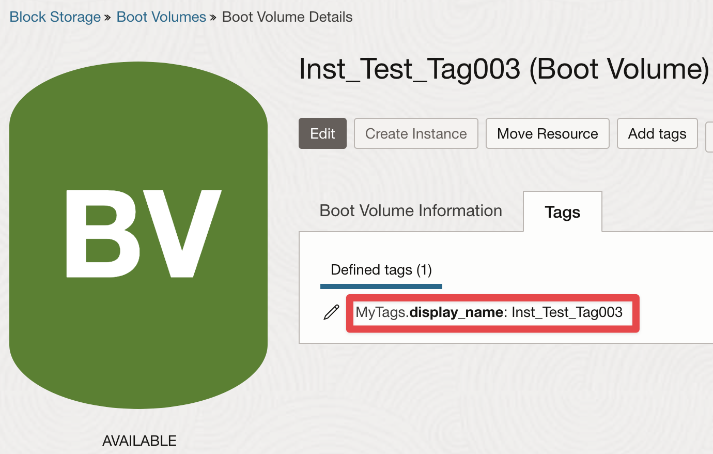
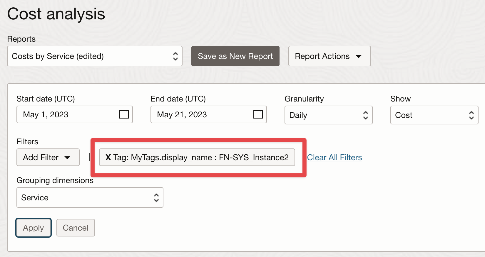
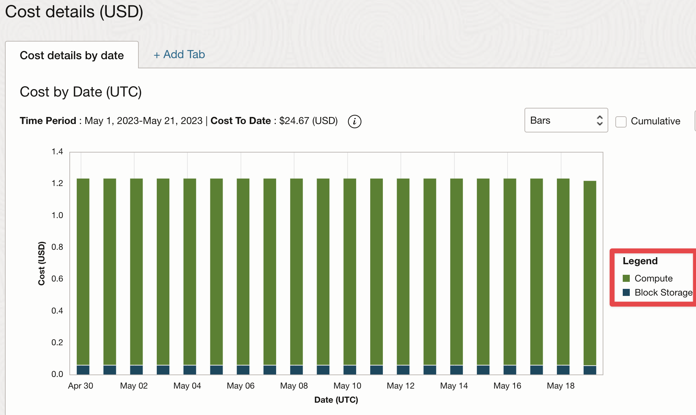
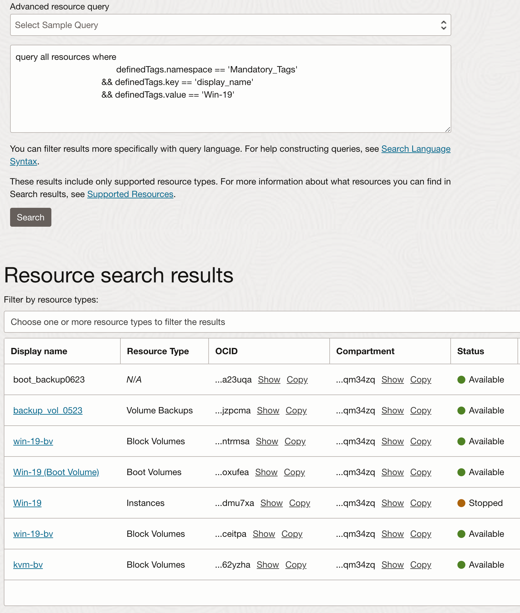

# OCI-TagByName

## When to use this asset?
**TagByName** retrieves the "display_name" of supported services and subsequently applies a "defined_tag" to the resource and its associated sub-resources, using the "display_name" as a reference for the tag key.
As a result, you can easily obtain the cost per resource name in OCI Cost Analysis.
 
## How to use this asset?

### Features 

1. searches for supported resources
2. retrieves display name
3. apply desired defined tag such as key/value:
	-  namespace: MyTags
	-  key: display_name
	-  value: *name-of-the-resource*

### Supported services
- compute instances
	- attached boot volume
		- boot volume backups
	- attached block volumes
		- block volume backups
- object storage
- file storage
- load balancers
- network load balancers
- network firewalls
- database systems
	- databases
- autonomous databases
- cloud exadata infrastructures
	- cloud_autonomous_vm_clusters
	- cloud_vm_clusters
- MySQL databases
- NoSQL databases
- OpenSearch clusters
- analytics instances
- big data instances
- data catalogs 
- data integration catalogs
- function applications
	- function instances
- container instances
- artifact repositories
- mesh instances
- visual builder instances

### Parameters for execution

Default authentication uses [Instance Principals](https://docs.public.oneportal.content.oci.oraclecloud.com/en-us/iaas/Content/Identity/Tasks/callingservicesfrominstances.htm), meaning you can run this script from an OCI virtual machine without having to provide any details or credentials

| Argument -| Parameter          | Description                                                            |
| --------- | ------------------ | ---------------------------------------------------------------------- |
| -cs       |                    | authenticate through CloudShell Delegation Token                       |
| -cf       |                    | authenticate through local OCI config_file                             |
| -cfp      | config_file_path   | change OCI config_file path, default: ~/.oci/config                    |
| -cp       | config_profile     | indicate config file section to use, default: DEFAULT                  |
| -tn       | tag_namespace      | tag_namespace hosting your tag_key, no default                         |
| -tk       | tag_key            | tag key to apply, no default                                           |
| -tlc      | compartment_ocid   | scan only a specific compartment, default: scan from root compartment  |
| -exc      | compartment_ocid   | exclude compartment ocid from analysis, default is none                |
| -rg       | region_name        | scan only a specific region, default: scan all regions                 |
| -c        |                    | tag compute resources                                                  |
| -s        |                    | tag storage resources                                                  |
| -n        |                    | tag network resources                                                  |
| -d        |                    | tag database resources                                                 |
| -a        |                    | tag analytics resources                                                |
| -dev      |                    | tag development resources                                              |
| -all      |                    | tag all supported resources                                            |
| -h        | --help             | show this help message and exit                                        |

#### Default arguments:

	python3 OCI-TagByName.py -all -tn MyTags -tk display_name

By default **OCI-TagByName** tries to authenticate using Instance Principals

#### Authenticate with local_config_file:
	
	python3 ./OCI-TagByName.py -all -cf -tn MyTags -tk display_name

#### Authenticate with custom local_config_file & profile:
	
	python3 ./OCI-TagByName.py -all -cf -cfp /home/opc/myconfig -cp MyDomain -tn MyTags -tk display_name

#### Authenticate in cloud_shell:
	
	python3 ./OCI-TagByName.py -all -cs -tn MyTags -tk display_name

#### custom parameters example:
	
	python3 ./OCI-TagByName.py -all -cf -rg eu-paris-1 -tlc ocid1.compartment.oc1..aaaaaaaaurxxxx -tn MyTags -tk display_name

	python3 ./OCI-TagByName.py -all -cf -rg eu-paris-1 -exc ocid1.compartment.oc1..aaaaaaaaurwwww -tn MyTags -tk display_name
	
**Terminal output**

**Instance tagt**

**Related resources are also tagged (here storage & backups)**

**Filter cost analysis using defined tag: display_name:XXXXX**

**See costs associated to all the resources attached to my instance (compute, storage, backup):**

**Search all resources using display_name tags**

# From

[https://github.com/Olygo/OCI-TagByName](https://github.com/Olygo/OCI-TagByName)

# License

Copyright (c) 2023 Oracle and/or its affiliates.

Licensed under the Universal Permissive License (UPL), Version 1.0.

See [LICENSE](https://github.com/oracle-devrel/technology-engineering/blob/folder-structure/LICENSE) for more details.
