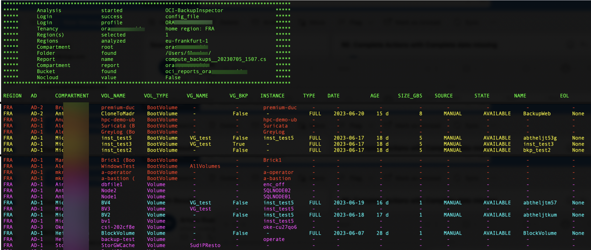
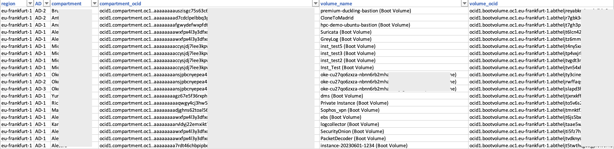
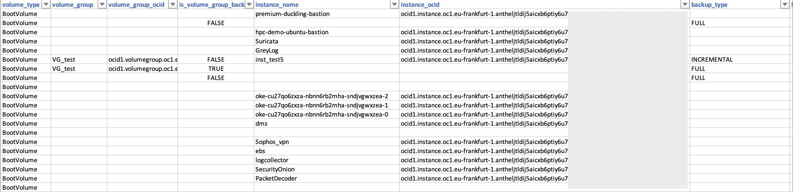
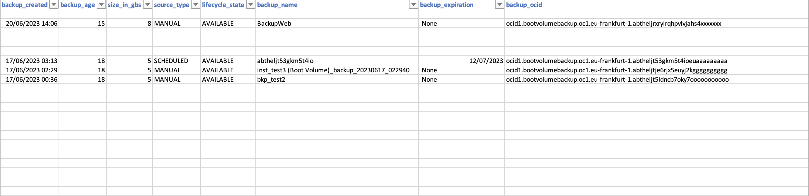

# OCI-BackupInspector

**BackupInspector** generates a comprehensive CSV reports that assess compute backups status for boot and block volumes.

# Features 
- **BackupInspector** :
	- searches for compute instances
	- retrieves all attached volumes
	- retrieves last backup details
	- analyzes unattached volumes
	- retrieves volume groups information
	- generates csv report
	- stores csv report locally or in an oci bucket 

- **Parameters for execution:**

Default authentication uses [Instance Principals](https://docs.public.oneportal.content.oci.oraclecloud.com/en-us/iaas/Content/Identity/Tasks/callingservicesfrominstances.htm), meaning you can run this script from an OCI virtual machine without having to provide any details or credentials

| Argument      | Parameter         | Description                                                          |
| -----------   | ----------------- | -------------------------------------------------------------------- |
| -cs           |                   | authenticate through CloudShell Delegation Token                     | 
| -cf           |                   | authenticate through local OCI config_file                           | 
| -cfp          | config_file       | change OCI config_file path, default: ~/.oci/config                  | 
| -cp           | config_profile    | indicate config file section to use, default: DEFAULT                | 
| -c            | compartment_ocid  | compartment to store the bucket report, default: root                | 
| -b            | bucket_name       | bucket name to store the report, default: reports_YOUR_TENANT_NAME   | 
| -rf           | report_folder     | local folder path to store the report, default: ~                    | 
| -rn           | report_name       | name of the csv report, default: compute_backups_CURRENT_DATE_TIME   | 
| -nocloud      |                   | if used: do not store csv report on OCI, default: False              | 
| -tlc          | compartment_ocid  | scan only a specific compartment, default: scan from root compartment| 
| -rg           | region_name       | scan only a specific region, default: scan all subscribed regions    | 
| -h            | --help            | show this help message and exit                                      | 

# How to use
##### Default - No argument:
	
	python3 ./OCI-BackupInspector.py

without arguments **OCI-BackupInspector** tries to authenticate using Instance Principals

##### Authenticate with local_config_file:
	
	python3 ./OCI-BackupInspector.py -cf

##### Authenticate with custom local_config_file & profile:
	
	python3 ./OCI-BackupInspector.py -cf -cfp /home/opc/myconfig -cp MyDomain

##### Authenticate in cloud_shell:
	
	python3 ./OCI-BackupInspector.py -cs

##### custom parameters examples:
	
	python3 ./OCI-BackupInspector.py -cf -rg eu-paris-1 -tlc ocid1.compartment.oc1..aaaaaaaaurxxxx -b data_bucket -rn backups_of_my_instances

	python3 ./OCI-BackupInspector.py rg eu-frankfurt-1 -nocloud -rf /home/opc/data/ -rn backups_of_my_instances
	
Terminal output

CSV report

## From

[https://github.com/Olygo/OCI-BackupInspector](https://github.com/Olygo/OCI-BackupInspector)

# License

Copyright (c) 2023 Oracle and/or its affiliates.

Licensed under the Universal Permissive License (UPL), Version 1.0.

See [LICENSE](https://github.com/oracle-devrel/technology-engineering/blob/folder-structure/LICENSE) for more details.

