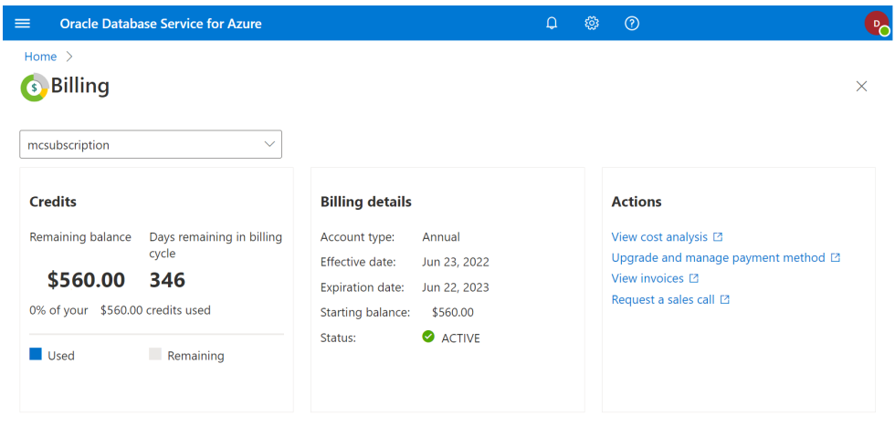
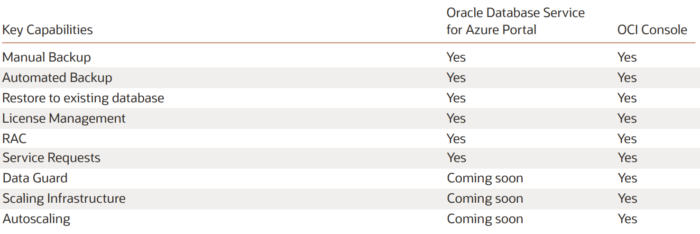
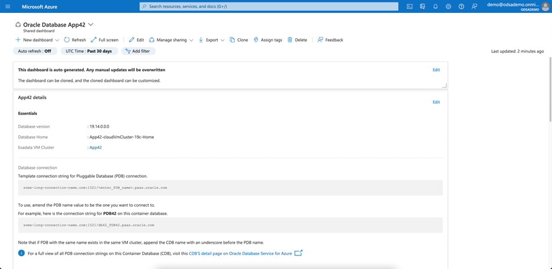
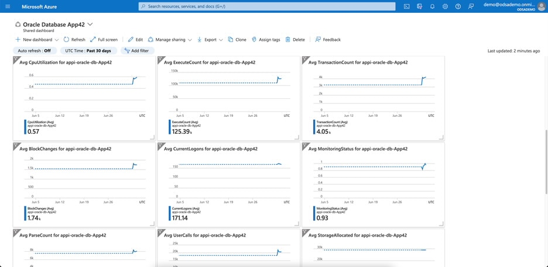
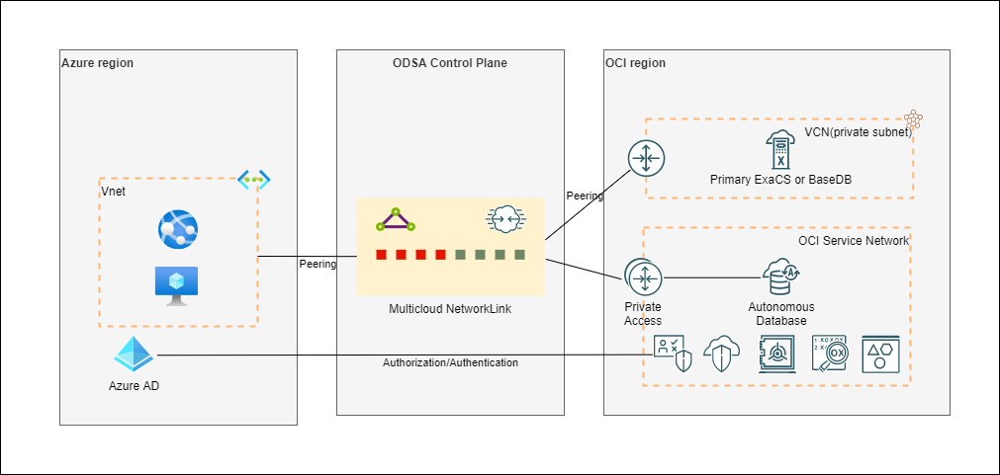
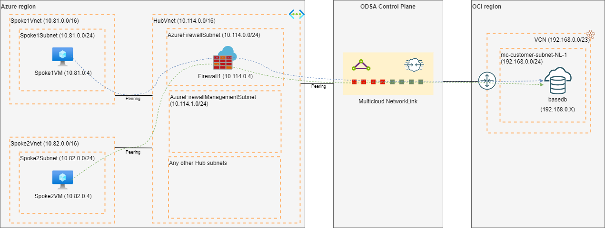
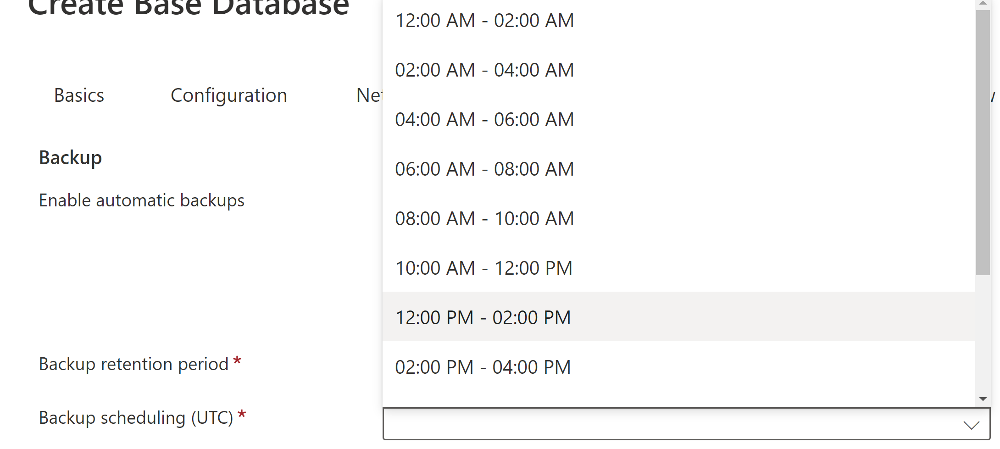

---
doc:
  author: Name Surname                  #Mandatory
  version: 1.1                          #Mandatory
  cover:                                #Mandatory
    title:                              #Mandatory
      - ${doc.customer.name}            #Mandatory
      - Database Migration to OCI       #Mandatory
    subtitle:                           #Mandatory
      - Solution Definition             #Mandatory
  customer:                             #Mandatory
    name: ACME                          #Mandatory
    alias: ACME                         #Mandatory
  config:
    impl:
      type: \<Service Provider\>            #Mandatory: Can be 'Oracle Lift', 'Oracle Fast Start', 'Partner' etc. Use with ${doc.config.impl.type}     
      handover: ${doc.customer.name}    #Mandatory: Please specify to whom to hand over the project after implementation. eg.: The Customer, a 3rd party implementation or operations partner, etc.           
  draft: false
  history:
    - version: 1.0
      date: 20 July 2023
      authors: 
        - ${doc.author}
        - ${doc.team.2.name}
      comments:
        - Updated architecture to use multiple public LBs
        - Added some LBs configuration
    - version: 0.1
      date: 16 June 2023
      authors: ${doc.author}
      comments:
        - Update policy attachments
        - Updated FortiGate role
  team:
    - name: ${doc.author}
      email: name.name@oracle.com
      role: Tech Solution Specialist
      company: Oracle
    - name: Ada Lovelace
      email: ada@lovelace.com
      role: Account Cloud Engineer
      company: Oracle
  acronyms:
    Dev: Development
---

<!--
    Last Change: 23rd July 2023
    Review Status: Reviewed
-->

*Guide:*

*Author Responsibility*

- *Chapter 1-3: Sales Consultant*

# Document Control
<!--
Role  | RACI
------|-----
ACE   | R/A
Impl. | None
PPM   | None
-->

*Guide:*

*The first chapter of the document describes the metadata for the document. Such as versioning and team members.*

## Version Control
<!--
Role  | RACI
------|-----
ACE   | R/A
Impl. | None
PPM   | None
-->

*Guide:* 

*A section describing the versions of this document and its changes.*

*Example:*

```{#history}
This is the document history. Please use doc.history metadata for compiling the table
```

## Team
<!--
Role  | RACI
------|-----
ACE   | R/A
Impl. | None
PPM   | None
-->

*Guide:*

*A section describing the Oracle team.*

*Example:*

```{#team}
This is the team that is delivering the solution defination document. Please use doc.team metadata for compiling the table
```

## Document Purpose
<!--
Role  | RACI
------|-----
ACE   | R/A
Impl. | None
PPM   | None
-->

*Guide:*

*Describe the purpose of this document and the Oracle-specific terminology, specifically around 'Workload'.*

*Example:*

This document provides a high-level solution definition for the Oracle solution and aims at describing the current state, and to-be state as well as a potential <Service Provider> high-level project scope and timeline.
The document may refer to a ‘Workload’, which summarizes the full technical solution for a customer (You) during a single engagement. The Workload is described in the chapter [Workload Requirements and Architecture](#workload-requirements-and-architecture).
This is a living document, additional sections will be added as the engagement progresses resulting in a final Document to be handed over to the <Service Provider>.


<!--                            -->
<!-- End of 1) Document Control -->
<!--                            -->

# Business Context
<!--
Role  | RACI
------|-----
ACE   | R/A
Impl. | None
PPM   | None
-->

*Guide:*

*Describe the customer's business and background. What is the context of the customer's industry and LoB? What are the business needs and goals which this Workload is an enabler for? How does this technical solution impact and support the customer's business goals? Does this solution support a specific customer strategy, or maybe certain customer values? How does this solution help our customers to either generate more revenue or save costs?*

## Executive Summary
<!--
Role  | RACI
------|-----
ACE   | R/A
Impl. | None
PPM   | None
-->

*Guide:*

*A section describing the Oracle differentiator and key values of the solution of our solution for the customer, allowing the customer to make decisions quickly.*

## Workload Business Value
<!--
Role  | RACI
------|-----
ACE   | R/A
Impl. | None
PPM   | None
-->

*Guide:*

*A clear statement of specific business value as part of the full workload scope. Try to keep it SMART: Specific, Measurable, Assignable, Realistic, and Time-Related - Agree on the business value with the customer. Keep it business-focused, and speak the language of the LoB which benefits from this Workload: "Increase Customer Retention by 3% in the next year" or "Grow Customer Base with Executive Decision-Making from our Sales and Support Data". Avoid technical success criteria such as "Migrate App X to Oracle Cloud" or "Provision 5 Compute Instances". Avoid Oracle success criteria and language "Get Workload Consuming on OCI".*

<!--                            -->
<!-- End of 2) Business Context -->
<!--                            -->

# Workload Requirements and Architecture

## Overview
<!--
Role  | RACI
------|-----
ACE   | R/A
Impl. | None
PPM   | None
-->

*Guide:*

*Describe the Workload: What applications and environments are part of this Workload, and what are their names? The implementation will be scoped later and is typically a subset of the Workload. For example, a Workload could exist of two applications, but the implementer would only include one environment of one application. The workload chapter is about the whole Workload and the implementation scope will be described in respected document.*

## Non-Functional Requirements
<!--
Role  | RACI
------|-----
ACE   | R/A
Impl. | None
PPM   | None
-->

*Guide:*

*Describe the high-level technical requirements for the Workload. Consider all sub-chapters, but decide and choose which Non-Functional Requirements are necessary for your engagement. You might not need to capture all requirements for all sub-chapters.*

*This chapter is for describing customer-specific requirements (needs), not to explain Oracle solutions or capabilities.*

### Regulations and Compliances Requirements

*Guide:*

*This section captures specific regulatory or compliance requirements for the Workload. These may limit the types of technologies that can be used and may drive some architectural decisions.*

*The Oracle Cloud Infrastructure Compliance Documents service lets you view and download compliance documents:
https://docs.oracle.com/en-us/iaas/Content/ComplianceDocuments/Concepts/compliancedocsoverview.htm*

*If there are none, then please state it. Leave the second sentance as a default in the document.*

*Example:*

At the time of this document creation, no Regulatory and Compliance requirements have been specified.

In addition to these requirements, the [CIS Oracle Cloud Infrastructure Foundation Benchmark, v1.2](https://www.cisecurity.org/benchmark/Oracle_Cloud) will be applied to the Customer tenancy.

### Environments

*Guide:*

*A diagram or list detailing all the required environments (e.g. development, text, live, production, etc).*

*If you like to describe a current state, you can use or add the chapter 'Current Sate Architecture' before the 'Future State Architecture'.*


Example:

Name	        | Size of Prod  | Location	  | DR    | Scope
:---		    |:---		   	|:---		  |:---   |:---
Production      | 100%        	| Malaga	  | Yes   | Not in Scope / On-prem
DR              | 50%           | Sevilla     | No    | Workload
Dev & Test      | 25%           | Sevilla     | No    | Workload - ${doc.config.impl.type}


### High Availability and Disaster Recovery Requirements

*Guide:*

*This section captures the resilience and recovery requirements for the Workload. Note that these may be different from the current system.*

*The Recovery Point Objective (RPO) and Recovery Time Objective (RTO) requirement of each environment should be captured in the environments section above, and wherever possible.*

- *What are the RTO and RPO requirements of the Application?*
- *What are the SLAs of the application?*
- *What are the backup requirements*

*Note that if needed, this section may also include an overview of the proposed backup and disaster recovery proposed architectures.*

*This chapter is mandatory, while there could be no requirements on HA/DR, please mention that in a short single sentence.*

*Example:*

At the time of this document creation, no Resilience or Recovery requirements have been specified.

### Security Requirements

*Guide:*

*Capture the Non-Functional Requirements for security-related topics. Security is a mandatory subsection that is to be reviewed by the x-workload security team. The requirements can be separated into:*
- *Identity and Access Management*
- *Data Security*

*Other security topics, such as network security, application security, or others can be added if needed.*

*Example:*

At the time of this document creation, no Security requirements have been specified.

## Future State Architecture
<!--
Role  | RACI
------|-----
ACE   | R/A
Impl. | None
PPM   | None
-->

*Guide:*

*The Workload Future State Architecture can be described in various forms. In the easiest case, we describe a Logical Architecture, possibly with a System Context Diagram. A high-level physical architecture is mandatory as a description of your solution.*

*This should be the final architecture as part of the pre-sales solution, not an intermediate or draft version*

*Additional architectures, in the subsections, can be used to describe needs for specific workloads.*


### Oracle Cloud Infrastructure Components

#### Oracle Database Service for Azure
Database Service for Microsoft Azure (OracleDB for Azure) is an Oracle-managed service for Azure customers to easily provision, access, and operate enterprise-grade Oracle Database services in Oracle Cloud Infrastructure (OCI) with a familiar Azure-like experience. Users can seamlessly build Azure applications with the high performance, high availability, and automated management of Oracle Database services running on OCI.


OracleDB for Azure reduces the complexity of connecting your clouds, networks, identities, and data by
- Automatically creating the network plumbing between the cloud environments (over Oracle Interconnect for Azure)
- Managing Domain Name System (DNS) settings so Oracle Database Service for Azure provisioned resources are available to Azure applications using standard Azure connection strings
- Delivering an administration portal that looks and feels like the Azure portal, removing the need for Azure administrators and developers to learn another tool/platform
- Streaming database metrics and events to Azure so administrators and developers can view them alongside information from other applications
- Delivering a single support path for customers

#### Networking & Communication
Oracle Database Service for Azure uses Oracle Interconnect for Microsoft Azure, a high performance, low-latency, low jitter private tunnel connection for network traffic between OCI and Azure. Oracle has partnered with Azure to offer this connection in a designated set of OCI regions located around the world. When you sign up for OracleDB for Azure, the service configures the private connection to your database resources as part of the account linking process.
Oracle Database Service for Azure supports the use of the interconnect for traffic to and from OCI Oracle Databases only.

#### Azure Account
During the service deployment, OracleDB for Azure creates an enterprise application in Azure that does the necessary OracleDB for Azure configuration in Azure and allows you to connect your Azure subscriptions to the service. OracleDB for Azure automatically creates user
groups and custom OracleDB for Azure user roles for you in Azure Active Directory. These groups allow you to easily enable user access to OracleDB for Azure databases, infrastructure, administrative resources, and Oracle Support.

#### Billing
Your OracleDB for Azure database resources are billed by OCI. See [Billing and Cost Management](https://docs.oracle.com/en-us/iaas/Content/Billing/home.htm#top) for information about viewing your subscription details, invoices, payment history, manage your payment method, and more. Database resources include databases, Exadata infrastructure. See [Oracle Bring Your Own License (BYOL)](https://www.oracle.com/cloud/bring-your-own-license/faq/) for information on using Oracle Database licenses you currently own with databases provisioned in the Oracle Cloud (including OracleDB for Azure databases). See [Pricing](https://www.oracle.com/cloud/pricing/) for information on OCI pricing models and a cost estimator.
There is no charge for the following:
- Oracle Interconnect for Microsoft Azure. Oracle manages this connection, and does not charge for the use of it with OracleDB for Azure, or for OracleDB for Azure network traffic across the connection.
- OCI Virtual Cloud Networks used by OracleDB for Azure database systems.
Azure bills for the virtual network peering required by OracleDB for Azure, and for resources provisioned in Azure. The Oracle Database Service for Azure portal provides you with billing information and a credit balance, if applicable, for your account. To see billing information, log in to the OracleDB for Azure portal and click Billing. A sample view is shown below


  
#### Portal and Database Management
The Oracle Database Service for Azure management console matches the look and feel of the Azure portal. Oracle Database Service for Azure automatically creates an Azure dashboard for each database we provision in Oracle Database
Service for Azure. This allows developers and administrators to view and monitor Oracle Database Service for Azure database components right inside the Azure portal. For simplicity, Oracle Database Service for Azure exposes only the most-frequently used capabilities through the Oracle Database Service for Azure portal. If you need a capability that’s not exposed through the portal, you can access the database resource in OCI (we provide the link) and use the needed capability there. Most database usage will occur entirely in Azure. The table below shows the current features available in the OracleDB for Azure Portal:

 
 
#### Onboarding
When you sign up for Oracle Database Service for Azure, you have two onboarding options;

**Fully-automated configuration:** This option links the Azure subscriptions that you specify to OracleDB for Azure, and configures OracleDB for Azure users and permissions for you. Identity federation for your OCI account is created for you, with Azure Active Directory as the identity provider. If you do not have an existing OCI account, a new account is created for you during the sign up. If you do have an OCI account, it is linked to your Azure account during the sign up. The fully-automated configuration option simplifies account linking and OracleDB for Azure configuration, and takes just a few minutes to complete. Because the automation is configuring networking, security and user role assignments, and identity federation on your behalf, this option requires that you grant more permissions to Oracle's account linking program than the guided account linking option. You will be able to see the permissions required by Oracle to complete fully automated configuration, and you must approve granting these permissions to Oracle before the account linking configuration takes place. Just as with the guided account linking option described below, you specify which Azure subscriptions will have access to Oracle Database Service for Azure.

**Guided account linking:** This option is partially-automated, and allows you to configure user roles and permissions yourself. The process starts on an Oracle sign up page, where you either create an new OCI tenancy, or you link an existing OCI tenancy to your Azure account.The guided account linking option requires that you grant the minimum number of permissions to Oracle's account linking software to complete your OracleDB for Azure deployment. Guided account linking will take longer, as you must do the user role and user group administration, and other OracleDB for Azure configuration in your Azure account. Creating user federation for your OCI account with Azure Active Directory (AAD) as the identity provider is optional, and must be performed manually. Federating OCI IAM with AAD allows you to log into the regular OCI Console using your Azure credentials. Federation is not required to access the OracleDB for Azure portal with your Azure credentials.

If you do not have an existing OCI account, a new account is created for you during the sign up. If you do have an OCI account, it is linked to your Azure account during the sign up.
 
#### Tagging
Oracle Cloud Infrastructure Tagging allows you to add metadata to resources, which enables you to define keys and values and associate them with resources. You can use the tags to organize and list resources based on your business needs and perform cost tracking and analysis. From OracleDB for Azure Portal, you can create user defined tags. These tags can be assigned to Database Service (Base Database) provisioned through OracleDB for Azure. The cost tracking and analysis features are available from the OCI Console.

#### Pre-Requisites
To use Oracle Database Service for Azure, you need an existing Azure account. To complete the sign up process, you will need the following:
- An Azure user account with administration privileges and ownership of the Azure subscriptions you want to link to OCI. The following Azure roles have sufficient privileges to sign up:
    - Global Administrator
    - Application Administrator
    - Cloud Application Administrator
	- Privileged Role Administrator
	
	When logging in to the Azure portal during the initial OracleDB for Azure setup, Oracle recommends using an email address that uses Azure AD for identity verification. If you use an email address that relies on an external identity provider (for example, Google, Yahoo, or GitHub), your Azure account must be configured for identity federation the external identity provider. See Azure's External Identities documentation for more information, or contact your Azure account administrator.
- At least one Azure Virtual Network (VNet), which will be paired with a corresponding OCI virtual cloud network (VCN) during the OracleDB for Azure onboarding.
- To sign up with an existing OCI tenancy, your tenancy must support identity domains. See [Do You Have Access to Identity Domains?](https://docs.oracle.com/en-us/iaas/Content/Identity/getstarted/identity-domains.htm#identity_documentation__updated-identity-domains) for instructions on confirming if your tenancy has access to identity domains. See [Azure and Oracle Cloud Account Linking Fails (OCI Tenancies Without Identity Domains)](https://docs.oracle.com/en-us/iaas/Content/multicloud/odsa_troubleshooting_tenancy_domain.htm) for information on how to resolve a sign up failure caused by an OCI tenancy that doesn't have access to identity domains.
- To sign up online without an existing OCI account, you will need a valid credit card or debit card. You cannot use prepaid or virtual cards to sign up for OCI services. You do not need to provide a credit or debit card number if:
    - You have placed an order with Oracle Sales for Oracle Database Service for Azure
    - You have an existing OCI account
- To sign up for OracleDB for Azure with an existing OCI account, the home region of the OCI account must be a region with the Oracle Interconnect for Microsoft Azure.

### Azure / OCI Identity Federation
To create identity federation for OracleDB for Azure using Azure Active Directory please refer to [OracleDB for Azure Identity Federation](https://docs.oracle.com/en-us/iaas/Content/multicloud/signup_guided_federation.htm).
Please note that this final onboarding step is optional. If Azure administrators believe one or more OracleDB for Azure users will need to use the OCI Console to perform tasks, then they should enable identity federation between Azure and OCI to enable users to use a single set of credentials to login to both cloud environments.
For the guided onboarding path, there is no automated process for configuring identity federation. Instead, the OracleDB for Azure portal provides a link to instructions for the steps an authorized Azure user must perform to configure identity federation between the two cloud environments.

### Mandatory Security Best Practices
Oracle Cloud Infrastructure (OCI) is designed to protect customer workloads with a security-first approach across compute, network, and storage – down to the hardware. It’s complemented by essential security services to provide the required levels of security for your most business-critical workloads.
- [Security Strategy](https://docs.oracle.com/en-us/iaas/Content/cloud-adoption-framework/security-strategy.htm) – To create a successful security strategy and architecture for your deployments on OCI, it's helpful to understand Oracle's security principles and the OCI security services landscape.
- The [security pillar capabilities](https://docs.oracle.com/en-us/iaas/Content/cloud-adoption-framework/security.htm#capabilities) reflect fundamental security principles for architecture, deployment, and maintenance. The best practices in the security pillar help your organization to define a secure cloud architecture, identify and implement the right security controls, and monitor and prevent issues such as configuration drift.

#### References
- The Best Practices Framework for OCI provides architectural guidance about how to build OCI services in a secure fashion, based on recommendations in the [Best practices framework for Oracle Cloud Infrastructure](https://docs.oracle.com/en/solutions/oci-best-practices).
- Learn more about [Oracle Cloud Security Practices](https://www.oracle.com/corporate/security-practices/cloud/).
- For detailed information about security responsibilities in Oracle Cloud Infrastructure, see the [Oracle Cloud Infrastructure Security Guide](https://docs.oracle.com/iaas/Content/Security/Concepts/security_guide.htm).

### Compliance and Regulations
Cloud computing is fundamentally different from traditionally on-premises computing. In the traditional model, organizations are typically in full control of their technology infrastructure located on-premises (e.g., physical control of the hardware, and full control over the technology stack in production). In the cloud, organizations leverage resources and practices that are under the control of the cloud service provider, while still retaining some control and responsibility over other components of their IT solution. As a result, managing security and privacy in the cloud is often a shared responsibility between the cloud customer and the cloud service provider. The distribution of responsibilities between the cloud service provider and customer also varies based on the nature of the cloud service (IaaS, PaaS, SaaS).

### OracleDB for Azure Security Controls 
OracleDB for Azure is designed to follow customer’s security posture already designed in Azure. Existing security controls are used when managing the OracleDB for Azure by Azure users / groups. Following sections provides details from initial OracleDB for Azure setup and how they can be used for specific customer design:

#### OracleDB for Azure Identity and Access Management Roles
The following three sections explain how and detail which roles are overall available to manage users and groups for Oracle DB for Azure.
OracleDB for Azure creates user groups in Azure Active Directory (AAD) during the initial account linking stage of your OracleDB for Azure sign up. You must assign Azure users to the appropriate OracleDB for Azure user groups in AAD to enable access to database and infrastructure resources. You must also assign users to the OracleDB for Azure enterprise application and to the related ARM role for the application.

#### OracleDB for Azure Users in Azure After Completing Your Sign Up
This topic describes roles defined in Oracle Database Service enterprise application and required ARM roles to the users to enable access to the OracleDB for Azure portal and other resources.
Users will need at minimum the Multicloud Link user role. (This role may be called the "Cloud Link User" role in some accounts.) The following roles are available and can be assigned to users or groups:

Oracle Database Service for Azure ARM Roles

| Display Name                                     | Application Role                                                                                                   | Description                                                                                                                                                                                                                                                             |
| ------------------------------------------------ | ------------------------------------------------------------------------------------------------------------------ | ----------------------------------------------------------------------------------------------------------------------------------------------------------------------------------------------------------------------------------------------------------------------- |
| OracleDB for Azure Multicloud Link Administrator | use whichever is available in your account:<br>odsa-multicloud-link-administrator<br>or<br>cloudlink-administrator | Can manage all aspects of the OracleDB for Azure multicloud link resource. This resource manages links between your azure account your OCI account. It also manages the linking of your Azure subscriptions to OracleDB for Azure, and other cross-cloud configuration. |
| OracleDB for Azure reader                        | odsa-reader                                                                                                        | Read-only access for all OracleDB for Azure resources. Used for auditing the service.                                                                                                                                                                                   |
| ODSA Family Administrator                        | odsa-db-family-administrator                                                                                       | Can manage all aspects of all database products in OracleDB for Azure, including Exadata, Base Database, and Autonomous Database.                                                                                                                                       |
| ODSA Database Family Reader                      | odsa-db-family-reader                                                                                              | Read-only permission for all database products in OracleDB for Azure, including Exadata, Base Database, and Autonomous Database.                                                                                                                                        |
| ODSA Exa Infrastructure Administrator            | odsa-exa-infra-administrator                                                                                       | Can manage all aspects of Exadata Dedicated Infrastructure, including:<br>- cloud-exadata-infrastructures<br>- cloud-vmclusters<br>- db-nodes                                                                                                                                 |
| ODSA Exa Database Administrator                  | odsa-exa-cdb-administrator                                                                                         | Can manage the following Exadata database resources at the container database (CDB) level:<br>- db-homes<br>- databases<br>- db-backups                                                                                                                                       |
| ODSA Exa PDB Administrator                       | odsa-exa-pdb-administrator                                                                                         | Can manage Exadata pluggable databases (PDBs).                                                                                                                                                                                                                          |
| ODSA BaseDB Infrastructure Administrator         | odsa-basedb-infra-administrator                                                                                    | Can manage the following Base Database infrastructure resources:<br>- db-systems<br>- db-homes                                                                                                                                                                              |
| ODSA BaseDB Database Administrator               | odsa-basedb-cdb-administrator                                                                                      | Can manage the following Base Database resources at the container database (CDB) level:<br>- db-homes<br>- databases<br>- db-backups                                                                                                                                          |
| ODSA BaseDB PDB Administrator                    | odsa-basedb-pdb-administrator                                                                                      | Can manage Base Database pluggable databases (PDBs).                                                                                                                                                                                                                    |
| ODSA ADB-S DB Administrator                      | odsa-adbs-db-administrator                                                                                         | Can manage Autonomous Databases and backups.                                                                                                                                                                                                                            |
| ODSA Network Link Administrator                  | odsa-network-administrator                                                                                         | Can manage all aspects of OracleDB for Azure network resources, with permission to create, read, update, and delete resources.                                                                                                                                          |
| ODSA Network Link User                           | networklink-user                                                                                                   | Can list, read and update OracleDB for Azure network resources.                                                                                                                                                                                                         |
| ODSA Cost Management Administrator               | odsa-costmgmt-administrator                                                                                        | Can manage cost management usage reports.                                                                                                                                                                                                                               |
| ODSA Cost Management Reader                      | odsa-costmgmt-read                                                                                                 | Can read cost management usage reports.                                                                                                                                                                                                                                 |
| ODSA Support Administrator                       | odsa-support-administrator                                                                                         | Can manage Oracle Support requests (SRs).                                                                                                                                                                                                                               |
| ODSA Support Reader                              | odsa-support-reader                                                                                                | Can read Oracle Support requests (SRs).                                                                                                                                                      

#### Azure User Groups for OracleDB for Azure Database Resources
The Azure user groups discussed in this topic allow you to control user access to specific Oracle Database products in OracleDB for Azure. The Operations Covered information in the table details the level of access the Azure user group has for the specified resources.

The OracleDB for Azure Database Family groups are for users who need to either manage or view all OracleDB for Azure resource types. Users in this group can manage all resources in the following OracleDB for Azure products:

- Oracle Exadata Database
- Oracle Database on virtual machine DB systems
- Autonomous Database
- MySQL Database with HeatWave

We will list the user groups here for the Oracle Base Database; details concerning other Database services can be found in the [documentation](https://docs.oracle.com/en-us/iaas/Content/multicloud/odsa_db_user_groups.htm).
These groups are for users who need to manage Oracle Base Database databases and DB system infrastructure in OracleDB for Azure. Base Database systems can be provisioned on virtual machines in OracleDB for Azure.

OracleDB for Azure Base Database Groups

| Group Description                     | Azure User Group Name            | Resource Types                      | Operations Covered                |
| ------------------------------------- | -------------------------------- | ----------------------------------- | --------------------------------- |
| Database infrastructure administrator | odsa-basedb-infra-administrators | - db-systems<br>- db-nodes              | create, list, get, update, delete |
| Database administrator                | odsa-basedb-cdb-administrators   | - db-homes<br>- databases<br>- db-backups | create, list, get, update, delete |
| Database developer                    | odsa-basedb-pdb-administrators   | pluggable-databases                 | create, list, get, update, delete |

#### Azure User Groups for OracleDB for Azure Networking, Cost Management, and Support Requests

The following [Azure user groups](https://docs.oracle.com/en-us/iaas/Content/multicloud/multicloud_azure_user_groups.htm#multicloud_azure_user_groups) allow you to control user access to Oracle Support Requests (SRs), cost management reports, and OracleDB for Azure networking resources:
Network and Multicloud Link Resources
The network administrator group allows assigned users to control who can manage Oracle Database Service for Azure networking resources. Networking resources are required when creating dedicated Exadata infrastructure and when creating virtual machine DB systems.
The Multicloudlink Administrator group allows assigned users to manage all aspects of the OracleDB for Azure multicloud link resource. This resource manages links between your azure account your OCI account. It also manages the linking of your Azure subscriptions to OracleDB for Azure, and other cross-cloud configuration.

OracleDB for Azure Network Groups

| Group Description                        | Azure User Group Name          | Resource                                              | Operations Covered        |
| ---------------------------------------- | ------------------------------ | ----------------------------------------------------- | ------------------------- |
| OracleDB for Azure Network Administrator | odsa-network-administrators    | All OracleDB for Azure networking resources           | create, list, get, update |
| Multicloud Link Administrator            | odsa-multicloud-administrators | OracleDB for Azure multicloud link resource in Azure. |                           |


OracleDB for Azure Cost Management Groups

| Group Description             | Azure User Group Name        | Resource      | Operations Covered        |
| ----------------------------- | ---------------------------- | ------------- | ------------------------- |
| Cost management administrator | odsa-costmgmt-administrators | Usage reports | create, list, get, update |
| Cost management reader        | odsa-costmgmt-readers        | Usage reports | list, get                 |

OracleDB for Azure Service Requests Groups

| Group Description              | Azure User Group Name       | Service Requests (SRs)                 | Operations Covered        |
| ------------------------------ | --------------------------- | -------------------------------------- | ------------------------- |
| Support requests administrator | odsa-support-administrators | - Technical<br>- Limit Increase<br>- Billing | create, list, get, update |
| Support requests reader        | odsa-support-readers        | - Technical<br>- Limit Increase<br>- Billing | list, get                 |

### OracleDB for Azure Auditing
Auditors have read-only access to all OracleDB for Azure resources, but they cannot update or manage resources. Read-only access allows auditors to perform list and get operations in the control plane to view metadata about OracleDB for Azure resources.
OracleDB for Azure Reader Group

| Group Description         | Azure User Group Name | Resource                         | Operations Covered |
| ------------------------- | --------------------- | -------------------------------- | ------------------ |
| OracleDB for Azure reader | odsa-readers          | All OracleDB for Azure resources | list, get          |

### Monitoring, Auditing, and Logging - Azure tools integration
For each database provisioned using OracleDB for Azure, the service delivers OCI database metrics, events, and logs to tools such as Azure Application Insights, Azure Event Grid, and Azure Log Analytics. This enables Azure users to view OCI databases alongside the rest of your Azure data, for unified telemetry and monitoring. Additionally, OracleDB for Azure also creates a custom dashboard that provides Azure developers with all the details they need about the Oracle database such as resource details, and connection strings for their applications.



The custom dashboard also displays graphs for each of the standard Oracle database metrics for the resource, giving developers and administrators a quick view of all metrics in one place.




#### Data Encryption
All data will be encrypted at rest and in transit. Encryption keys can be managed by Oracle or the customer and will be implemented for identified resources.

#### Key Management
All keys for **OCI Block Volume** and **OCI Database** used in OracleDB for Azure are managed by Oracle. Oracle Managed means data will be encrypted at rest with an encryption key whose lifecycle management is controlled by Oracle.

#### Object Storage Security
For Object Storage security the following guidelines are considered.
- **Access to Buckets** -- Assign least privileged access for IAM users and groups to resource types in the object-family (Object Storage Buckets & Object)
- **Encryption at rest** -- All data in the Object Storage is encrypted at rest using AES-256 and is on by default. This cannot be turned off and objects are encrypted with a master encryption key.

#### Data Residency
At the time of this document creation no specific data residency have been formulated. It is expected that data will be held in the respective region and additional steps will be taken when exporting the data to other regions to comply with the applicable laws and regulations. This should be reviewed for every project onboard into the tenancy.

#### Regulations and Compliance
The customer is responsible for setting the access rules to services and environments that require stakeholders’ integration into the tenancy to comply with all applicable regulations. Oracle will support in accomplishing this task.

### Physical Architecture
OracleDB for Azure can be integrated with any existing Azure topology. The diagrams below is merely a preliminary example of how OracleDB for Azure could be deployed either directly connected to a application VNet, or to a Hub VNet in a hub-and-spoke network:







## Solution Considerations
Guide:
Describe certain aspects of your solution in detail. What are the security, resilience, networking, and operations decisions you have taken that are important for your customer?

### High Availability and Disaster Recovery
OracleDB for Azure provisioned Base Database service will have backups configured as per current on-premises backup frequency and retention. This task will be completed during the Base Database deployment. 

The **Backup retention** period selection is set to **30 days**, by default. You can select another option from the list of available options which are **7 days**, **15 days**, **30 days**, **45 days**, and **60 days**.


 

The **Backup scheduling (UTC)** selection is a two-hour window during which the backup will be performed. There are 12 selectable time windows.



 

OracleDB for Azure Base Database service provides option to provision Real Application Cluster (RAC) for HA and also provides options for the DR configurations. 
See more details on selecting the required option for future [DR Reference for OracleDB for Azure](https://blogs.oracle.com/cloud-infrastructure/post/odsa-dr-best-practices-exadata-base)

### Security
Overall security posture will be discussed and finalised as part of detailed design exercise. Section [Security Controls](#OracleDB-for-Azure-Security-Controls) covers all options available in OracleDB for Azure.

### Networking
This section is very important, as it has key dependency on existing Azure network topology. Based on full understanding of existing Azure networking design and application requirements. OracleDB for Azure deployment options will be selected for database system provisioning.
See this Reference architecture as an example: [OracleDB for Azure Azure Hub & Spoke Topology](https://docs.oracle.com/en/solutions/odsa-azure-hub-spoke/index.html)


## Sizing and Bill of Materials
<!--
Price Lists and SKUs / Part Numbers
-->

*Guide:*

*Estimate and size the physically needed resources of the Workload. The information can be collected and is based upon previously gathered capacities, business user numbers, integration points, or translated existing on-premises resources. The sizing is possibly done with or even without a Physical Architecture. It is ok to make assumptions and to clearly state them!*

*Clarify with sales your assumptions and your sizing. Get your sales to finalize the BoM with discounts or other sales calculations. Review the final BoM and ensure the sales are using the correct product SKUs / Part Number.*

*Even if the BoM and sizing were done with the help of Excel between the different teams, ensure that this chapter includes or links to the final BoM as well.*

*WIP*
- *Revision of existing discovery templates*
- *Consolidated data gathering sheet (sizing focused)*
- *Workload-specific sizing process/methodology*

<!--                                                 -->
<!-- End of 3) Workload Requirements and Architecture -->
<!--                                                 -->

# Annex

## Security Guidelines

### Oracle Security, Identity, and Compliance

Oracle Cloud Infrastructure (OCI) is designed to protect customer workloads with a security-first approach across compute, network, and storage – down to the hardware. It’s complemented by essential security services to provide the required levels of security for your most business-critical workloads.

- [Security Strategy](https://docs.oracle.com/en-us/iaas/Content/cloud-adoption-framework/security-strategy.htm) – To create a successful security strategy and architecture for your deployments on OCI, it's helpful to understand Oracle's security principles and the OCI security services landscape.
- The [security pillar capabilities](https://docs.oracle.com/en-us/iaas/Content/cloud-adoption-framework/security.htm#capabilities) pillar capabilities reflect fundamental security principles for architecture, deployment, and maintenance. The best practices in the security pillar help your organization to define a secure cloud architecture, identify and implement the right security controls, and monitor and prevent issues such as configuration drift.

#### References

- The Best Practices Framework for OCI provides architectural guidance about how to build OCI services in a secure fashion, based on recommendations in the [Best practices framework for Oracle Cloud Infrastructure](https://docs.oracle.com/en/solutions/oci-best-practices).
- Learn more about [Oracle Cloud Security Practices](https://www.oracle.com/corporate/security-practices/cloud/).
- For detailed information about security responsibilities in Oracle Cloud Infrastructure, see the [Oracle Cloud Infrastructure Security Guide](https://docs.oracle.com/iaas/Content/Security/Concepts/security_guide.htm).

### Compliance and Regulations

Cloud computing is fundamentally different from traditionally on-premises computing. In the traditional model, organizations are typically in full control of their technology infrastructure located on-premises (e.g., physical control of the hardware, and full control over the technology stack in production). In the cloud, organizations leverage resources and practices that are under the control of the cloud service provider, while still retaining some control and responsibility over other components of their IT solution. As a result, managing security and privacy in the cloud is often a shared responsibility between the cloud customer and the cloud service provider. The distribution of responsibilities between the cloud service provider and customer also varies based on the nature of the cloud service (IaaS, PaaS, SaaS).

## Additional Resources

- [Oracle Cloud Compliance](https://www.oracle.com/corporate/cloud-compliance/) – Oracle is committed to helping customers operate globally in a fast-changing business environment and address the challenges of an ever more complex regulatory environment. This site is a primary reference for customers on Shared Management Model with Attestations and Advisories.
- [Oracle Security Practices](https://www.oracle.com/corporate/security-practices/) – Oracle’s security practices are multidimensional, encompassing how the company develops and manages enterprise systems, and cloud and on-premises products and services.
- [Oracle Cloud Security Practices](https://www.oracle.com/corporate/security-practices/cloud/) documents.
- [Contract Documents](https://www.oracle.com/contracts/cloud-services/#online) for Oracle Cloud Services.
- [OCI Shared Security Model](https://docs.oracle.com/en-us/iaas/Content/cloud-adoption-framework/security.htm#shared-security-model)
- [OCI Cloud Adoption Framework Security Strategy](https://docs.oracle.com/en-us/iaas/Content/cloud-adoption-framework/security-strategy.htm)
- [OCI Security Guide](https://docs.oracle.com/en-us/iaas/Content/Security/Concepts/security_guide.htm)
- [OCI Cloud Adoption Framework Security chapter](https://docs.oracle.com/en-us/iaas/Content/cloud-adoption-framework/security.htm)
