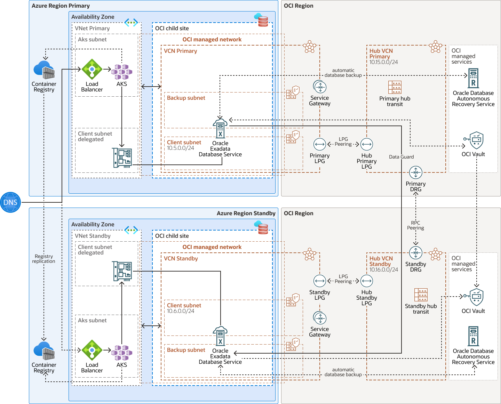

# Implement Multicloud cross-region disaster recovery for Oracle Database@X (Azure, GCP, AWS)

This repository allows you to deploy all the needed networking for implementing cross-region disaster recovery in oracle database@X (AWS, Azure, Google Cloud). 
It configures all the networking detailed in the following reference architectures:

- [Implement cross-region disaster recovery for Exadata Database on Oracle Database@Azure](https://docs.oracle.com/en/solutions/exadb-dr-on-db-azure/index.html#GUID-A43C87C3-C331-415A-9951-86C454C8E9C3)
- [Implement cross-region disaster recovery for Exadata Database Service on Google Cloud](https://docs.oracle.com/en/solutions/exadb-dr-on-db-google-cloud/index.html#GUID-041B1ED9-43B8-41C3-90A6-1695668F7DB6)
- [Oracle Database@AWS Achieves Gold MAA Certification for Maximum Availability Architecture](https://blogs.oracle.com/maa/post/oracle-databaseaws-achieves-gold-maa-certification)

## Architecture diagram



## Requirements

- An active Oracle Cloud Infrastructure Account.
- An Oracle Exadata Database@X deployment in primary region and Standby region
- API Key Authentication for OCI Terraform provider -> https://docs.oracle.com/en-us/iaas/Content/API/SDKDocs/terraformproviderconfiguration.htm
- Terraform
- Permission to manage virtual-network-family resources to a specific group within a compartment in your Oracle Cloud Infrastructure tenancy
- VCN primary and VCN Standby OCIDs
- Non-overlapping IP Addresses for Hub VCN Primary and Standby

## Steps

- Duplicate the "terraform.tfvars.template" file and rename it to "terraform.tfvars"
- In the new "terraform.tfvars" file complete the "OCI Tenancy Credentials" and "Oracle Cloud Infrastructure Variables"

## Deployment

Create the Resources using the following commands:

```bash
terraform init
terraform import oci_core_vcn.vcn_primary ocid1.vcn.primary-xxxxxxxxxxxxx
terraform import oci_core_vcn.vcn_standby ocid1.vcn.standby-xxxxxxxxxxxxx
terraform plan
terraform apply
```

After successfully running terraform apply, the administrator should update the security lists and NSGs with the required ports, then complete the Data Guard association.

Use the following command to destroy the deployment:

```bash
terraform destroy
```
## Acknowledgements

* **Author** - Ricardo Anda, Oracle
* **Contributor** Ejaz Akram, Julien Silverston, Oracle
* **Last update** - August 12, 2025