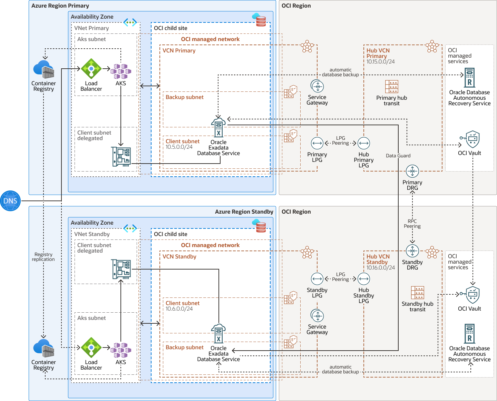

# Implement Multicloud cross-region disaster recovery for Oracle Database@X (Azure, Google Cloud, AWS)

This repository contains terraform code that allows you to deploy all the needed networking for implementing cross-region disaster recovery for Oracle Database@X (Azure, Google Cloud, AWS). 
It configures all the networking detailed in the following reference architectures in Oracle Cloud Infrastaructure:

- [Implement cross-region disaster recovery for Exadata Database on Oracle Database@Azure](https://docs.oracle.com/en/solutions/exadb-dr-on-db-azure/index.html)
- [Implement cross-region disaster recovery for Exadata Database Service on Google Cloud](https://docs.oracle.com/en/solutions/exadb-dr-on-db-google-cloud/index.html)
- [Oracle Database@AWS Achieves Gold MAA Certification for Maximum Availability Architecture](https://blogs.oracle.com/maa/post/oracle-databaseaws-achieves-gold-maa-certification)

Reviewed: 10.11.2025

## Architecture diagram



## Requirements

- An active Oracle Cloud Infrastructure Account
- An Oracle Exadata Database@X deployment in primary region and standby region
- API Key Authentication for OCI Terraform provider -> https://docs.oracle.com/en-us/iaas/Content/API/SDKDocs/terraformproviderconfiguration.htm
- Compartment for deploying the infrastructure managed by this Terraform code
- Terraform
- Permission to manage virtual-network-family resources to a specific group within a compartment in your Oracle Cloud Infrastructure tenancy
- Exadata Database@X VCN primary and VCN Standby OCIDs
- Non-overlapping IP Addresses for Hub VCN Primary and Standby

## Steps

- Duplicate the "terraform.tfvars.template" file and rename it to "terraform.tfvars"
- In the new "terraform.tfvars" file complete the "OCI Tenancy Credentials" and "Oracle Cloud Infrastructure Variables"

## Deployment

Create the Resources using the following commands:

```bash
terraform init
terraform plan
terraform apply
```

## Note: After successfully running terraform apply, the administrator should configure the following

- Route rule in the VCN Primary default route table with destination VCN Standby CIDR and target LPG
- Route rule in the VCN Standby default route table with destination VCN Primary CIDR and target LPG
- Update VCN Primary security lists and NSG
- Update VCN Standby security lists and NSG
- Complete the Data Guard association.

Use the following command to destroy the deployment:

```bash
terraform destroy
```
## Acknowledgements
### Author 
- Ricardo Anda, Oracle
### Contributors
 - Emiel Ramakers, Oracle 
 - Ejaz Akram, Oracle 
 - Julien Silverston, Oracle
