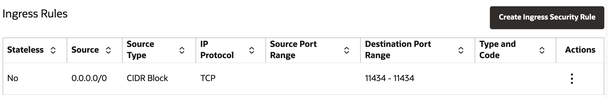
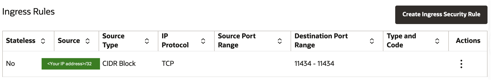
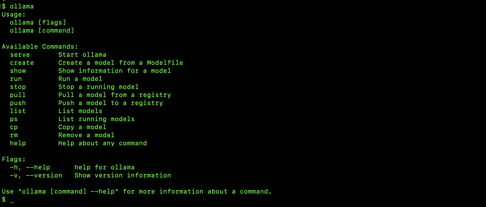
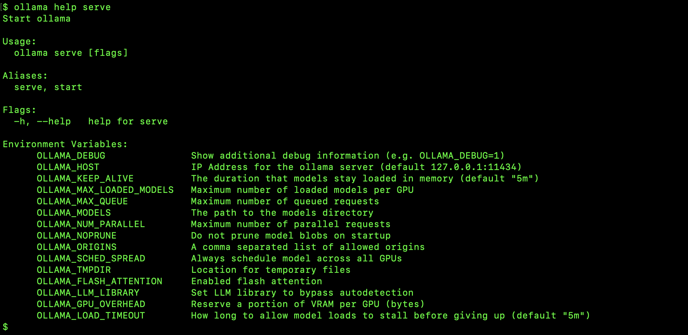

*Last Update: 15.08.2025*

<br><h1 align="center">GPU-Assisted Local LLM Serving<br>Using the Ollama Open Source Tool and Compute Cloud@Customer</h1>

<a id="toc"></a>
## Table of Contents
1. [Introduction](#intro)
2. [VM Creation and Configuration](#create)
3. [Proxy and Security Settings](#proxysec)
4. [Ollama Installation](#ollama)
5. [Testing](#test)
6. [Comparative Results](#results)
6. [Useful References](#ref)

<a id="intro"></a>
## Introduction

This article builds on the [Ollama Local LLM](cloud-infrastructure/private-cloud-and-edge/compute-cloud-at-customer/local-llm) article that can be used as a reference for implementation and resources. It also serves to demonstrate the differences when building an Ollama installation using the Compute Cloud@Customer (C3) GPU expansion option. This platform is suited to AI, computational and multimedia workloads. It supports inferencing, Retrieval Augmented Generation (RAG), training and fine-tuning for small to medium LLMs (approx 70b parameters) in a 4-GPU VM configuration.

Please consult the [Compute Cloud@Customer Compute Expansion Options datasheet](https://www.oracle.com/uk/a/ocom/docs/oracle-compute-cloud@customer-gpu-expansions-datasheet.pdf) for a full description and specifications of the GPU nodes.

The high level differences between a general-purpose VM and a GPU-enabled VM are:
* For a GPU-enabled VM, High Performance storage is normally used for boot volumes, LLM- & RAG stores and vector databases. Balanced Performance storage may however be used where appropriate, e.g. object- and file storage.
* An extended boot volume is required to accommodate required GPU drivers, SDKs, bulky system libraries, applications and development space.
* GPU-specific platform images must be used to incorporate GPUs into VMs.

VM shapes are available in:
| Shape | Resources |
|-------|-----------|
| C3.VM.GPU.L40S.1 | 1 GPU<br>27 OCPUs<br>200 GB memory |
| C3.VM.GPU.L40S.2 | 2 GPUs<br>54 OCPUs<br>400 GB memory |
| C3.VM.GPU.L40S.3 | 3 GPUs<br>81 OCPUs<br>600 GB memory |
| C3.VM.GPU.L40S.4 | 4 GPUs<br>108 OCPUs<br>800 GB memory |
<br>

Considerations:
* A firm grasp of C3 and OCI concepts and administration is assumed.
* Familiarity with Linux, in particular Oracle Linux 9 for the server configuration is assumed.
* The creation and integration of a development environment is outside of the scope of this document.
* Oracle Linux 9 and macOS Sequoia 15.6 clients were used for testing but Windows is however widely supported.

[Back to top](#toc)<br>
<br>

<a id="create"></a>

## VM Creation and Configuration
### *References:*
* *[Creating an Instance in the Oracle Cloud Infrastructure Documentation](https://docs.oracle.com/en-us/iaas/compute-cloud-at-customer/topics/compute/creating-an-instance.htm#creating-an-instance)*
* *[Creating and Attaching Block Volumes in the Oracle Cloud Infrastructure Documentation](https://docs.oracle.com/en-us/iaas/compute-cloud-at-customer/topics/block/creating-and-attaching-block-volumes.htm)*
* *[Compute Shapes (GPU Shapes) in the Oracle Cloud Infrastructure Documentation](https://docs.oracle.com/en-us/iaas/compute-cloud-at-customer/topics/compute/compute-shapes.htm#compute-shapes__compute-shape-gpu)* 
<br><br>

| Requirement | Specification | Remarks |
|----------|----------|----------|
| Shape | C3.VM.GPU.L40S.[1234] | Select either 1, 2, 3 or 4 GPUs |
| Image | Oracle Linux 8/9 | Note the difference in the NVIDIA driver installation instructions |
| Boot Volume | >= 150 GB on Performance Storage<br>(VPU = 20) | * Upwards of 150 GB is recommended to accommodate a large software footprint<br>* 250 GB was used for this article |
| Data Volume | >= 250 GB on Performance Storage<br>(VPU = 20) | * Depends on the size of LLMs that will be used<br>* 250 GB was used for this article |
| NVIDIA Drivers | Latest | Install as per NVIDIA CUDA Toolkit instructions in the above GPU Shape documentation |
| Hostname | ol9-gpu ||
| Public IP | Yes ||
<br>

### *Boot Volume Creation Specification:*
<p></p>

### *Next Steps:*
[1] Connect to the VM<br> 
[2] Extend the root filesystem:<br>
```sudo /usr/libexec/oci-growfs -y```
<p></p>
<p></p>
[3] Attach and configure the data volume for automatic mounting at startup:
<p></p>
[4] Install the NVIDIA CUDA Toolkit as directed and verify that it is functioning:
<p></p>

[Back to top](#toc)<br>
<br>

<a id="proxysec"></a>
## Proxy and Security Settings
### *Proxy* 

In the event of a proxy'd network add the following to the `/etc/profile.d/proxy.sh` file to set the proxy environment variables system-wide:

```
http_proxy=http://<proxy_server>:80
https_proxy=http://<proxy_server>:80
no_proxy="127.0.0.1, localhost"
export http_proxy
export https_proxy
export no_proxy
```

>[!TIP]
>The `no_proxy` environment variable can be expanded to include your internal domains. It is not required to list IP addresses in internal subnets of the C3.

Edit the `/etc/yum.conf` file to include the following line:
```
proxy=http://<proxy_server>:80
```

### *Security*

>[!NOTE]
>Refer to the article [Why You Should Trust Meta AI's Ollama for Data Security](https://myscale.com/blog/trust-meta-ai-ollama-data-security) for further information on the benefits of running LLMs locally. 

#### Open the Firewall for the Ollama Listening Port

```
sudo firewall-cmd –-set-default-zone=public
```
```
sudo firewall-cmd –-add-port=11434/tcp --add-service=http –-zone=public
```
```
sudo firewall-cmd --runtime-to-permanent
```
```
sudo firewall-cmd –reload
```
```
sudo firewall-cmd –-info-zone=public
```

<p></p>

#### Grant VCN Access through Security List

Edit your VCN's default security list to reflect the following:

<p></p>

Should you want to limit the access to a specific IP address the source should be:

<p></p>

>[!TIP]
>To avoid continuous changes to the security list obtain a reserved IP address for your client machine from the network administrator.

[Back to top](#toc)<br>
<br>

<a id="ollama"></a>
## Ollama Installation

### *General*

The installation comprises the following components:

|  Server  |  Client<sup><sub>1</sup></sub>  |
|----------|----------|
| Ollama | GUI Tools<sup><sub>2</sup></sub><br>Character based tools<br>API Development kits<sup><sub>3</sup></sub> |

<sup><sub>1</sup></sub>*Optional*<br>
<sup><sub>2</sup></sub> Examples of GUIs: [Msty](https://msty.app/), [OpenWebUI](https://openwebui.com/), [ollama-chats](https://github.com/drazdra/ollama-chats)<br>
<sup><sub>3</sup></sub> See [Ollama documentation](https://github.com/ollama/ollama/tree/main/docs)

### *Server Installation*

```
cd /tmp
curl -L https://ollama.com/download/ollama-linux-amd64.tgz -o ollama-linux-amd64.tgz
sudo tar -C /usr -xzf ollama-linux-amd64.tgz
sudo chmod +x /usr/bin/ollama
sudo useradd -r -s /bin/false -m -d /usr/share/ollama ollama
```
```
sudo tee /usr/lib/systemd/system/ollama.service > /dev/null <<EOF
[Unit]
Description=Ollama Service
After=network-online.target

[Service]
ExecStart=/usr/bin/ollama serve
User=ollama
Group=ollama
Restart=always
RestartSec=3
Environment="HTTPS_PROXY=http:<IP_address>:<port>"
Environment="OLLAMA_MODELS=/mnt/llm-repo"
Environment="OLLAMA_HOST=0.0.0.0" 
Environment="OLLAMA_ORIGINS=*"

[Install]
WantedBy=default.target
EOF
```

The `Environment="HTTPS_PROXY=http:<IP_address>:<port>"` line should be omitted if a proxy is not applicable.<br>

Enable and start Ollama:
```
sudo systemctl daemon-reload
sudo systemctl enable ollama
sudo systemctl start ollama
```

Ollama will be accessible at http://127.0.0.1:11434 or http://<you_server_IP>:11434.

Execute:
```
sudo chown ollama:ollama /mnt/llm-repo
sudo chmod 755 /mnt/llm-repo
```

[Back to top](#toc)<br>
<br>

<a id="test"></a>
## Testing

From the local host, test the accessibility of the port and the availability of the Ollama server:

```
nc -zv ol9-gpu 11434
curl http://ol9-gpu:11434
curl -I http://ol9-gpu:11434
```
<p></p>

Login to `ol9-gpu` and note the command line options that are available:

```
ollama
```

<p></p>

Also note the environment variable options that are available (can be set in `/usr/lib/systemd/system/ollama.service`):

```
ollama help serve
```

<p></p>

Download and test your first LLM (and you will notice the population of `/mnt/ll-models` with data by running `ls -lR /mnt/ll-models`):

<p></p>
<p></p>

Ensure that the GPU is enabled:

```
nvidia-smi
sudo journalctl -u ollama
ollama show gemma3
```
Look for the Ollama process `/usr/bin/ollama`:
<p></p>
Look for the `L40S` entry:
<p></p>
Look for the 100% GPU enablement under the PROCESSOR column
<p></p>

Run some more tests from your client to test the APIs:

```
curl http://ol9-gpu:11434/api/tags

curl -X POST http://ol9-gpu:11434/api/generate -d '{
  "model": "gemma3",
  "prompt":"Hello Gemma3!",
  "stream": false
 }'

curl http://ol9-gpu:11434/api/ps
```

<p></p>

1. `curl http://ol9-gpu:11434/api/tags` returns a list of installed LLMs
2. `curl http://ol9-gpu:11434/api/ps` returns a list of LLMs already loaded into memory

>[!TIP]
>The duration that the LLM can stay loaded into memory can be adjusted by changing the `OLLAMA_KEEP_ALIVE` environment parameter (default = 5 minutes).

[Back to top](#toc)<br>
<br>

<a id="results"></a>
## Results
Since benchmarking is out of scope for this article a cost:benefit comparison between a GPU-enabled VM and a "normal" OPCU-operated VM was made. An OCPU VM was configured to the same cost of a 1-GPU VM run over a period of one month.<br><br>
The following script was used:<br>

```
curl http://localhost:11434/api/generate -d '{
  "model": "gemma3",
  "prompt": "What is a cyanobacterial bloom?",
  "stream":false
}'
```
<br>
The comparison is summarised in the following table:
<br><br>

| Metric | OCPU<br>Duration (s) | GPU<br>Duration (s) | Difference<br>Factor |
|----|----|----|----|
| total_duration	| 23.46	| 6.14	| 3.8x |
| load_duration	|	0.07	|	0.06	|	1.2x	|
| prompt_eval_count	|	16	|	16	|	|
| prompt_eval_duration	|	0.03	|	0.02	|	1.8x	|
| eval_count	|	799	|	819	|	|	
| eval_duration	|	23.35	|	6.06	|	3.8x	|

Where:<br><br>
```total_duration```: time spent generating the response<br>
```load_duration```: time spent loading the model<br>
```prompt_eval_count```: number of tokens in the prompt<br>
```prompt_eval_duration```: time spent evaluating the prompt<br>
```eval_count```: number of tokens in the response<br>
```eval_duration```: time spent generating the response<br>

[Back to top](#toc)<br>
<br>

<a id="ref"></a>
## Useful References

* *[Ollama documentation](https://github.com/ollama/ollama/tree/main/docs)*
* *[Pre-trained Ollama models](https://ollama.com/library)*
* *[Msty GUI client](https://msty.app/)*
* *[OpenWebUI](https://github.com/open-webui/open-webui)*
* *[Ollama-chats](https://github.com/drazdra/ollama-chats)*
* *[Ollama Python library](https://github.com/ollama/ollama-python)*
* *[Getting started with Ollama for Python](https://github.com/RamiKrispin/ollama-poc)*
* *[Ollama and Oracle Database 23ai vector search](https://docs.oracle.com/en/database/oracle/oracle-database/23/vecse/generate-summary-using-ollama.html)*
* *[Ollama API Usage Examples](https://www.gpu-mart.com/blog/ollama-api-usage-examples)*
* *[Ollama API](https://github.com/ollama/ollama/blob/main/docs/api.md)*
* *[Ollama Structured Outputs](https://ollama.com/blog/structured-outputs)*
* *[Ollama RAG: Reading Assistant Using OLLama for Text Chatting](https://github.com/mtayyab2/RAG)*
* *[RAG with LLaMA Using Ollama: A Deep Dive into Retrieval-Augmented Generation](https://medium.com/@danushidk507/rag-with-llama-using-ollama-a-deep-dive-into-retrieval-augmented-generation-c58b9a1cfcd3)*
* *[Ollama: Embedding Models](https://ollama.com/blog/embedding-models)*
* *[Ollama LLM RAG](https://github.com/digithree/ollama-rag)*
* *[Ollama's new engine for multimodal models](https://ollama.com/blog/multimodal-models)*

[Back to top](#toc)<br>
<br>

## License
Copyright (c) 2025 Oracle and/or its affiliates.

Licensed under the Universal Permissive License (UPL), Version 1.0.

See [LICENSE](LICENSE) for more details.


