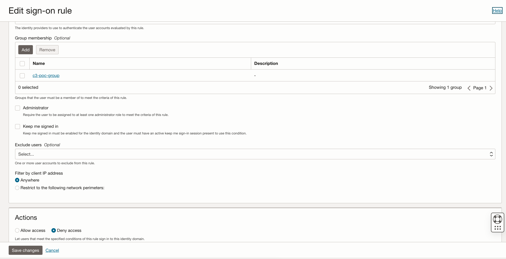
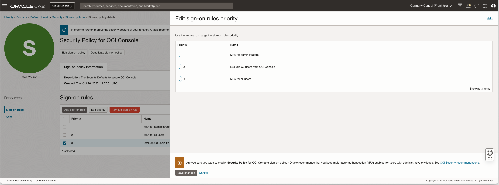

# C3 HSP - Restricting Access to the OCI Console

In the HSP scenario where end users are not employees of the rack
operator it's probably not appropriate for them to be able to access the
OCI console and to, possibly, create resources in the public cloud.

In an OCI tenancy using Identity Domains, i.e. all new tenancies, then
there is an option to use [IAM Sign-On
Policies](https://docs.oracle.com/en-us/iaas/Content/Identity/signonpolicies/managingsignonpolicies.htm#understand-sign-policies)
to prevent access to the OCI Console. There is a [specific Sign-On
Policy that controls access to the OCI
Console](https://docs.oracle.com/en-us/iaas/Content/Identity/signonpolicies/managingsignonpolicies.htm#understand-sign-policies__securitypolicy-console-signonpolicy)
and adding a new Sign-On Rule will disable access. Note that all users
of a C3 must be created in the **default identity domain**. The Security
Policy for OCI Console sign-on policy is activated by default and
preconfigured with Oracle security best practices. Once located a new
Sign-On rule as below will deny access to a specifed group:  

Once the new Sign-On rule is created then it should be added to the
Policy as shown, in this case before the MFA rule: 

Note!

Even with OCI console access disabled there are still "live" OCI users
who will have access to create/delete/modify resources via teh API in the OCI tenancy
as well as the C3 as the policies and compartments are common across
both. It would be wise to further restrict the capability of these users
as per
<https://docs.oracle.com/en-us/iaas/Content/Identity/users/edit-users-capabilities.htm>.   
  
Ideally a policy should be implemented that restricts permissions **only** to the C3, see [this](../iam-policies-for-isolation/README.md) note.
