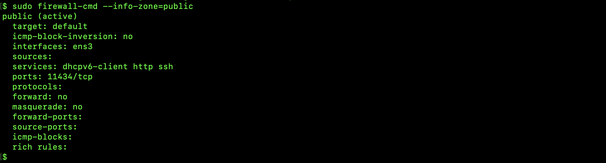
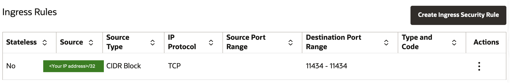
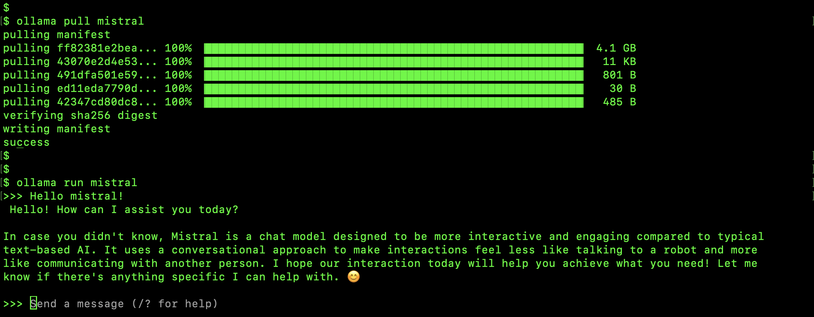
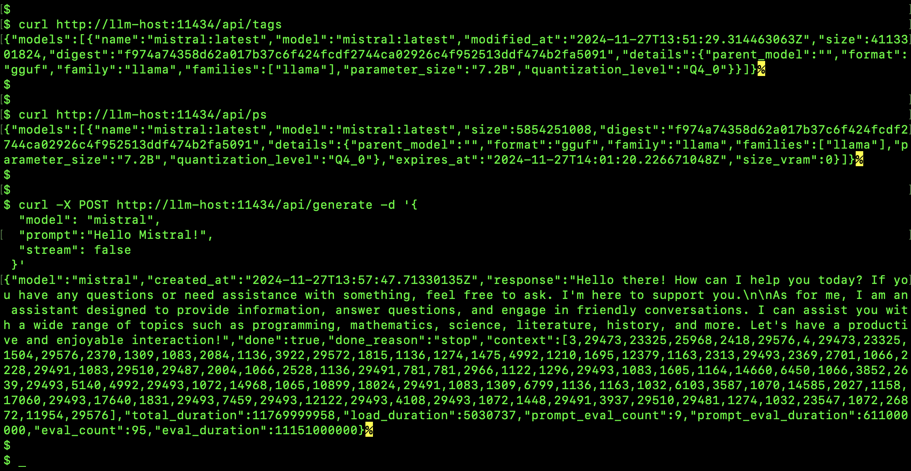
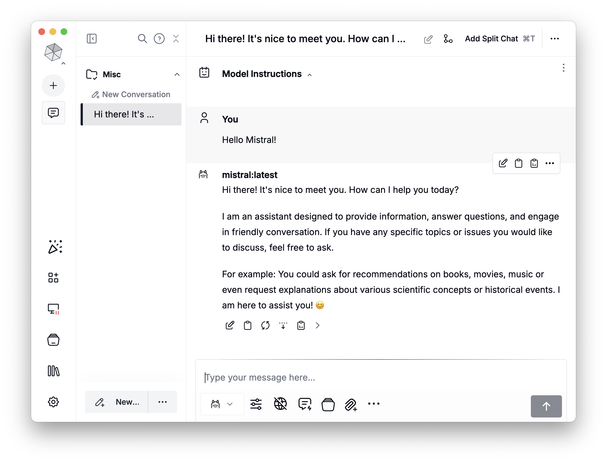

*Last Update: 27 November 2024*

<br><h1 align="center">Local LLM Inferencing and Interaction<br>Using the Ollama Open Source Tool</h1>
<p align="center"></p>


<a id="toc"></a>
## Table of Content
1. [Introduction](#intro)
2. [Preparation](#prep)
3. [Security](#security)
4. [Ollama Installation](#install)
5. [Testing](#test)
6. [Useful References](#ref)

<a id="intro"></a>
## Introduction

[Ollama](https://github.com/ollama/ollama) is an open-source tool that runs large language models (LLMs) directly on a local machine. This makes it particularly appealing to AI developers, researchers, and businesses concerned with data control and privacy. It enables the loading and deployment of selected LLMs and provides access to them through APIs and freely obtainable chatbots. Ollama also contains a text-based server-side chatbot.

By running models locally, you maintain full data ownership and avoid the potential security risks associated with cloud storage. Offline AI tools like Ollama also help reduce latency and reliance on external facilities, making them faster and more reliable.

This article is intended to demonstrate and provide directions to install and create an Ollama LLM processing facility. Despite the fact that Ollama can be run on both personal servers and laptops, this installation is aimed at the Oracle Compute Cloud@Customer (C3) and Private Cloud Appliance (PCA) to capitalize on more readily available resources to increase performance and processing efficiency, especially if large models are used.

Considerations:
* A firm grasp of C3/PCA/OCI concepts and administration is assumed.
* The creation and integration of a development environment is outside of the scope of this document.
* Oracle Linux 8 and macOS Sonoma 14.7.1 clients were used for testing but Windows is however widely supported.

[Back to top](#toc)<br>
<br>

<a id="prep"></a>
## Preparation

### System Requirements

|  Requirement  |  Specification  |
|----------|----------|
| Operating system | Oracle Linux 8 or later<br>Ubuntu 22.04 or later<br>Windows<br> |
| RAM | 16 GB for running models up to 7B. "The rule of thumb" is to have at least 2x memory for the size of the LLM, also allowing for LLMs that will be loaded in memory simultaneously. |
| Disk space | 12 GB for installing Ollama and basic models. Additional space is required for storing model data depending on the used models. The LLM sizes can be obtained from the "trained models" link in the References section. For example the Llama 3.1 LLM with 405Bn parameters occupy 229GB of disk space |
| Processor | Recommended to use a modern CPU with at least 4 cores. For running models of approximately 15B, 8 cores (OCPUs) is recommended. Allocate accordingly |
| Graphics Processing Unit<br>(optional) | A GPU is not required for running Ollama, but can improve performance, especially when working with large models. If you have a GPU, you can use it to accelerate training of custom models. |

>[!NOTE]
>The GPU options in the Compute Cloud@Customer will be available soon.

### Create a Virtual Machine Instance

[C3: Creating an Instance](https://docs.oracle.com/en-us/iaas/compute-cloud-at-customer/topics/compute/creating-an-instance.htm#creating-an-instance)<br>
[PCA 3.0: Working with Instances](https://docs.oracle.com/en/engineered-systems/private-cloud-appliance/3.0-latest/user/user-usr-instance-lifecycle.html)

Create a VM in a public subnet following these guidelines:

1. Hostname `llm-host`
2. Select the Oracle Linux 8 image
3. Start with 6x OCPUs and 96GB of RAM using an available "Flex" shape (resources can be adjusted later depending on workload)
5. Select the default boot volume size
6. Select a public subnet and allow a public IP address to be assigned
7. Configure the public key information
8. Select "Restore instance lifecycle state after infrastructure maintenance"
9. Apply appropriate tagging if required
10. Ensure that the VM is accessible via `ssh`
11. Configure the proxy setup if required (described below)
12. Update your local host's `/etc/hosts` file to reflect your public IP address for `llm-host`
13. Perform an OS update in `llm-host` before proceeding:

```
sudo dnf update
```

### Create a Block Storage Device for LLMs

[C3: Creating and Attaching Block Volumes](https://docs.oracle.com/en-us/iaas/compute-cloud-at-customer/topics/block/creating-and-attaching-block-volumes.htm)<br>
[PCA 3.0: Creating and Attaching Block Volumes](https://docs.oracle.com/en/engineered-systems/private-cloud-appliance/3.0-latest/user/user-usr-blk-volume-create-attach.html)

1.  Create and attach a block volume to the VM
2.  Volume name `llm-repo`
3. A block volume of at least 150GB (research the model sizes!) in size is recommended and should multiple standard LLMs be hosted or larger if advanced workloads are foreseen, e.g. copies of LLMs for development, collection and loading of RAG material, etc the recommendation is 1TB.
4. Select High Performance if available
5. Select your appropriate backup policy
6. Apply appropriate tagging if required
7. It is recommended to use the `xfs` filesystem for formatting the block volume
8. Configure a persistent mount point (to survive reboots). The entry in the `/etc/fstab` file will typically resemble the following:
`/dev/disk/by-id/scsi-3600144f096933b92000061b1129e0037 /mnt/llm-repo xfs _netdev,nofail 0 0`
9. To set initial unlimited access to the mounted filesystem perform the command on the mount point:
```
sudo chmod 777 /mnt/llm-repo
```
>[!IMPORTANT]
>Note the mount options in the `/etc/fstab` file

### Proxy Settings

In the event of a proxy'd network add the following to the `/etc/profile.d/proxy.sh` file to set the proxy environment variables system-wide:

```
http_proxy=http://<proxy_server>:80
https_proxy=http://<proxy_server>:80
no_proxy="127.0.0.1, localhost"
export http_proxy
export https_proxy
export no_proxy
```

>[!TIP]
>The `no_proxy` environment variable can be expanded to include your internal domains. It is not required to list IP addresses in internal subnets of the C3/PCA.

Edit the `/etc/yum.conf` file to include the following line:
```
proxy=http://<proxy_server>:80
```

[Back to top](#toc)<br>
<br>

<a id="security"></a>
## Security

### General

Resource constraints are often experienced on personal computers and more compute, memory and disk resources are required to run LLM operations more efficiently. Hence the increasing deployment of Ollama in cloud- or corporate hardware environments in a 2-tier client-server architecture. The security architecture of Ollama for this deployment architecture exposes the installation and data to a number of vulnerabilities. 

Several API endpoint vulnerabilities have been identified in the client-server deployment model of Ollama and some have been addressed successfully by means of security patching. Collectively, the vulnerabilities could allow an attacker to carry out a wide-range of malicious actions with a single HTTP request, including denial-of-service (DoS) attacks, model poisoning, model theft, and more.

*A future article will describe a secure (using reverse proxying and TLS) client-server deployment architecture that can be made available for secure corporate use that also ensures data usage privacy.*

>[!NOTE]
>Refer to the article [Why You Should Trust Meta AI's Ollama for Data Security](https://myscale.com/blog/trust-meta-ai-ollama-data-security) for further information on the benefits of running LLMs locally. 

### Open the Firewall for the Ollama Listening Port

```
sudo firewall-cmd –-set-default-zone=public
```
```
sudo firewall-cmd –-add-port=11434/tcp --add-service=http –-zone=public
```
```
sudo firewall-cmd --runtime-to-permanent
```
```
sudo firewall-cmd –reload
```
```
sudo firewall-cmd –-info-zone=public
```

<p></p>

### Grant VCN Access through Security List

Edit the VCN default security list to reflect the following:

<p></p>

Should you want to limit the access to a specific IP address the source should be:

<p></p>

>[!TIP]
>To avoid continuous changes to the security list obtain a reserved IP address for your client machine from the network administrator.

[Back to top](#toc)<br>
<br>

<a id="install"></a>
## Ollama Installation

### General

The installation comprises the following components:

|  Server  |  Client  |
|----------|----------|
| Ollama | GUI Tools<sup><sub>1</sup></sub><br>Character based tools<br>API Development kits<sup><sub>2</sup></sub> |

<sup><sub>1</sup></sub> Examples of GUIs: [Msty](https://msty.app/), [OpenWebUI](https://openwebui.com/), [ollama-chats](https://github.com/drazdra/ollama-chats)<br>
<sup><sub>2</sup></sub> See [Ollama documentation](https://github.com/ollama/ollama/tree/main/docs)

>[!IMPORTANT]
>When GPU's become available the NVIDIA and CUDA drivers should be installed. This configuration will also be tested on the Roving Edge Device GPU model.

### Installation

```
cd /tmp
curl -L https://ollama.com/download/ollama-linux-amd64.tgz -o ollama-linux-amd64.tgz
sudo tar -C /usr -xzf ollama-linux-amd64.tgz
sudo chmod +x /usr/bin/ollama
sudo useradd -r -s /bin/false -m -d /usr/share/ollama ollama
```
```
sudo tee /usr/lib/systemd/system/ollama.service > /dev/null <<EOF
[Unit]
Description=Ollama Service
After=network-online.target

[Service]
ExecStart=/usr/bin/ollama serve
User=ollama
Group=ollama
Restart=always
RestartSec=3
Environment="HTTPS_PROXY=http:<IP_address>:<port>"
Environment="OLLAMA_MODELS=/mnt/llm-repo"
Environment="OLLAMA_HOST=0.0.0.0" 
Environment="OLLAMA_ORIGINS=*"

[Install]
WantedBy=default.target
EOF
```

The `Environment="HTTPS_PROXY=http:<IP_address>:<port>"` line should be omitted if a proxy is not applicable.<br>
For Nvidia GPUs, add `Environment="OLLAMA_FLASH_ATTENTION=1"` to improve token generation speed.

Enable and start Ollama:
```
sudo systemctl daemon-reload
sudo systemctl enable ollama
sudo systemctl start ollama
```

Ollama will be accessible at http://127.0.0.1:11434 or http://<you_server_IP>:11434.

Execute:
```
sudo chown ollama:ollama /mnt/llm-repo
sudo chmod 755 /mnt/llm-repo
```

[Back to top](#toc)<br>
<br>


<a id="test"></a>
## Testing

From the local host, test the accessibility of the port and the availability of the Ollama server:

```
nc -zv llm-host 11434
curl http://llm-host:11434
curl -I http://llm-host:11434
```
<p></p>

Login to `llm-host` and note the command line options that are available:

```
ollama
```

<p></p>

Also note the environment variable options that are available:

```
ollama help serve
```

<p></p>

Download and test your first LLM (and you will notice the population of `/mnt/llm-repo` with data by running `ls -lR /mnt/llm-repo`):

<p></p>

Run some more tests from your client to test the APIs:

```
$ curl http://llm-host:11434/api/tags
$ curl http://llm-host:11434/api/ps
$ curl -X POST http://llm-host:11434/api/generate -d '{
  "model": "mistral",
  "prompt":"Hello Mistral!",
  "stream": false
 }'
```

<p></p>

1. `curl http://llm-host:11434/api/tags` returns a list of installed LLMs
2. `curl http://llm-host:11434/api/ps` returns a list of LLMs already loaded into memory

>[!TIP]
>The duration that the LLM can stay loaded into memory can be adjusted by changing the `OLLAMA_KEEP_ALIVE` environment parameter (default = 5 mins).

Install any of the GUI clients mentioned previously and test the connectivity and accessibility. For using [the Msty app](https://msty.app/) you need to:

1. Create a Remote Models Provider
2. Name it appropriately
3. The Service Endpoint is `http://llm-host:11434`
4. "Fetch Models" (that are already installed, in this case `mistral`)
5. This step can be repeated as new models are added from the Ollama model repository

Example output as follows:

<p></p>

[Back to top](#toc)<br>
<br>

<a id="ref"></a>
## Useful References

* [Ollama documentation](https://github.com/ollama/ollama/tree/main/docs)
* [Pre-trained Ollama models](https://ollama.com/library)
* [Msty GUI client](https://msty.app/)
* [OpenWebUI](https://github.com/open-webui/open-webui)
* [Ollama-chats](https://github.com/drazdra/ollama-chats)
* [Ollama Python library](https://github.com/ollama/ollama-python)
* [Getting started with Ollama for Python](https://github.com/RamiKrispin/ollama-poc)
* [Ollama and Oracle Database 23ai vector search](https://docs.oracle.com/en/database/oracle/oracle-database/23/vecse/generate-summary-using-ollama.html)

[Back to top](#toc)<br>
<br>

## License
Copyright (c) 2025 Oracle and/or its affiliates.

Licensed under the Universal Permissive License (UPL), Version 1.0.

See [LICENSE](LICENSE) for more details.
