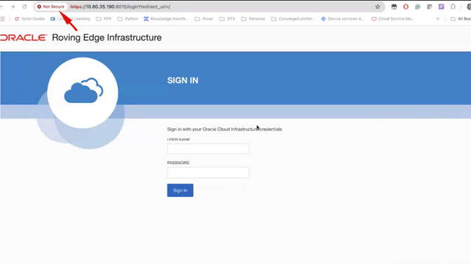
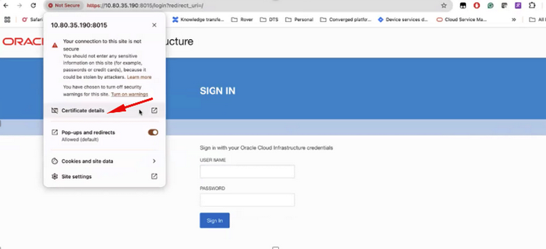
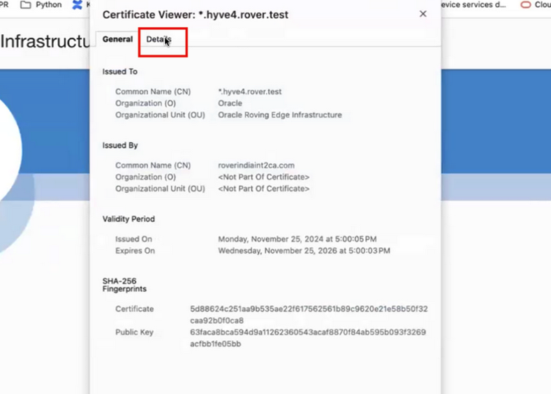
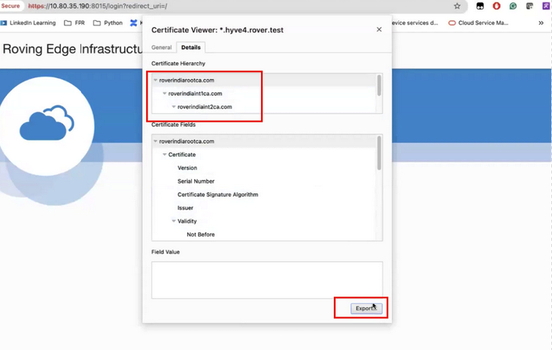

# Roving Edge Infrastructure

Added: 09.03.2026

 <h1 align="center">Roving Edge Installation Best Practices </h1>

## Table of Contents

- [Overview](#overview)
- [Driver Issue Troubleshooting⚠️](#driver-)
  - [Microsoft Windows](#windows)
  - [Apple MAC](#mac)
- [Importing the Root CA Certificate 📥](#import-)

## Overview

To ensure a smooth and complete installation, please make sure to follow the User Guide step by step. The instructions provided there cover the full setup process and should be your primary reference.
Based on recent user experience, the following clarifications may help avoid common issues:

<a href="#toc">Back to top</a>
  

## Driver Issue Troubleshooting ⚠️

If you encounter issues during the **Set Up Terminal Emulation** stage, where initial communication with the Roving Edge Device is made through the serial console, ensure that the controlling host has the necessary **USB-to-serial port driver and terminal emulation software** configured as described in this section of the user guide.

<a href="#toc">Back to top</a>
 
 

### Microsoft Windows

For **Windows users**, if you experience any issues (for example, the drivers appear to be installed but are not functioning correctly), it may be necessary to manually install or update the drivers.
To do so, try installing the following VCP drivers [here](https://https://ftdichip.com/drivers)

<a href="#toc">Back to top</a>
 
 

### Apple MAC

If your Mac is unable to connect to **RED2.56.GPU** via the serial-to-USB interface:
Running `ls /dev/tty.*` does not list the expected device (e.g., `/dev/tty.usbserial-xxxxx`).
Purge and reinstall the USB-to-Serial driver using the following package:  
👉[PL2303HXD&G_Mac Driver_v2.1.0_20210311.pkg](https://confluence.oraclecorp.com/confluence/download/attachments/15713569729/PL2303HXD%26G_Mac%20Driver_v2.1.0_20210311.pkg?version=1&modificationDate=1748951674000&api=v2)

<a href="#toc">Back to top</a>
  

## Importing the Root CA Certificate 📥

As described in **Task 2** of **Ensure the Host Has OpenSSL Installed** in the User Guide, the Root Certificate must be downloaded and imported into your browser after configuring the host file.
If your computer is running **Microsoft Windows** with **Google Chrome version 135.0.7049.42**, follow these steps:
1. In the Chrome address bar, enter the device address and port number: `https://<device_hostname>:8015`
2. Click the **Not secure** icon next to the URL field.
   

4. Click Certificate details.
   

6. Click the Details tab.
   

8. Under Certificate Hierarchy, click the top certificate.
   

10. Click **Export** for each certificate in the hierarchy **one by one**, starting from the top. This ensures that **all related certificates are saved correctly** into the **Trusted Root Certificate Authorities** folder on **Windows**, or into **Keychain Access** on **macOS**.
11. Click Save.

 

**Clear your browser’s cache and restart the session.**

<a href="#toc">Back to top</a>
 
 

## License

Copyright (c) 2026 Oracle and/or its affiliates.

Licensed under the Universal Permissive License (UPL), Version 1.0.

See [LICENSE](https://github.com/oracle-devrel/technology-engineering/blob/main/LICENSE.txt) for more details.
