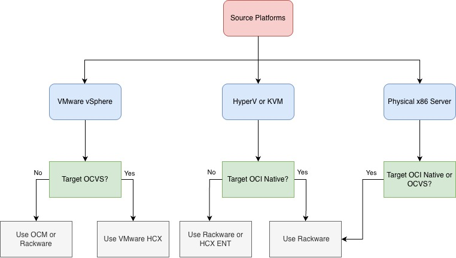
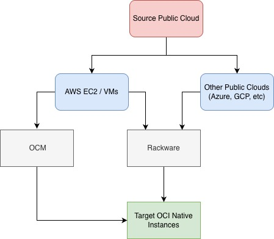
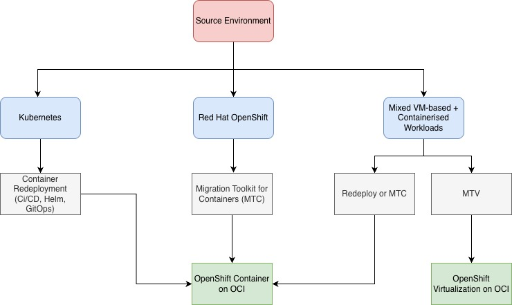

# Infrastructure Migration to OCI: Scenarios & Strategic Guidelines

This guide provides a comprehensive technical framework for migrating enterprise infrastructure to Oracle Cloud Infrastructure (OCI). It covers VMware and non-VMware virtualization, physical x86 servers, cross-cloud replatforming, OpenShift-based platform standardization, and mixed VM–container convergence paths. It also details the tooling and architectural patterns required to execute large-scale enterprise migrations with minimal operational disruption.

## Migration Scenarios

This guide defines the primary strategic pathways for transitioning an enterprise infrastructure estate from on-premises and multi-cloud environments to Oracle Cloud Infrastructure (OCI). It provides a comprehensive framework for migrating virtual machines, physical compute, and containerized ecosystems, ensuring a seamless move for every layer of the modern data center:

**Virtual Machine & Physical Workloads**

- VMware vSphere → Oracle Cloud VMware Solution (OCVS): A lift-and-shift migration preserving the full VMware SDDC stack (ESXi, vCenter, vSAN, NSX). This approach minimizes operational disruption and enables Layer-2 extension, IP retention, and live mobility using VMware HCX.

- VMware vSphere → OCI Native Compute Instances: VMware VMs are replatformed onto OCI Compute through VM format conversion and infrastructure adaptation. Tooling such as Oracle Cloud Migrations (OCM) and RackWare supports discovery, replication, and deployment into OCI-native environments.

- Microsoft Hyper-V / KVM → OCI Native Compute Instances: Cross-hypervisor migration requiring VM format conversion and redeployment into OCI Compute. This path supports modernization and platform consolidation using tools such as RackWare.

- Microsoft Hyper-V / KVM → Oracle Cloud VMware Solution (OCVS): Consolidates non-VMware workloads into a VMware SDDC on OCI. Cross-platform migration tooling such as HCX OSAM or Rackware preserves VM configurations while enabling VMware-based operational standardization.

- Physical x86 Servers → OCI Native Compute or OCVS
Bare-metal workloads are migrated directly to OCI, either into OCI Compute or virtualized within OCVS. OS-level replication tools such as RackWare enable smooth transition for legacy and modernization-driven workloads.

This diagram assists architects in choosing a migration strategy based on the Source Platform and the desired Target Environment (OCI Native vs. VMware Solution).
Decision Logic by Source Platform.

| Source Environment          | Target Platform                                  | Migration Tooling                             | Migration Guide                                  |
|-----------------------------|--------------------------------------------------|-----------------------------------------------|--------------------------------------------------|
| VMware vSphere              | Oracle Cloud VMware Solution (OCVS)              | VMware HCX                                    | [VMware vSphere to OCVS using HCX](./files/vmware-vsphere-to-ocvs-hcx.md)                 |
| VMware vSphere              | OCI Native Compute Instances                     | Oracle Cloud Migrations (OCM) / RackWare      | [VMware vSphere to OCI Native](./files/vmware-vsphere-to-oci-native.md)                   |
| Microsoft Hyper-V / KVM     | OCI Native Compute Instances                     | RackWare             | [Hyper-V/KVM to OCI Native](./files/hyper-v-kvm-to-oci-native.md)                        |
| Microsoft Hyper-V / KVM     | Oracle Cloud VMware Solution (OCVS)              | HCX Enterprise (OSAM) / RackWare              | [Hyper-V/KVM to OCVS](./files/hyper-v-kvm-to-ocvs.md)                              |
| Physical x86 Servers        | OCI Native Compute Instances / OCVS              | RackWare                                      | [Physical x86 to OCI](./files/physical-to-oci.md)|

**Public Cloud to OCI**

- AWS EC2 / VMs → OCI Native Compute Instances: Replatforming of AWS-based virtual machines into OCI Compute. Migration tooling such as Oracle Cloud Migrations (OCM) or RackWare enables replication, format conversion, and staged cutover to OCI-native infrastructure.

- Other Public Clouds (Azure, GCP, etc.) → OCI Native Compute Instances: Cross-cloud workload migration into OCI Compute. RackWare provides automated discovery, replication, and deployment capabilities to support consolidation or cost optimization strategies.

This diagram outlines the migration path for instances currently hosted on other major public cloud providers. The goal is to transition these workloads into Target OCI Native Instances.

| Source Environment                     | Target Platform              | Migration Tooling                         | Migration Guide            |
|----------------------------------------|------------------------------|-------------------------------------------|----------------------------|
| AWS EC2 / VMs                          | OCI Native Compute Instances | Oracle Cloud Migrations (OCM) / RackWare  | [AWS to OCI Native](./files/aws-to-oci-native.md)         |
| Other Public Clouds (Azure, GCP, etc.) | OCI Native Compute Instances | RackWare                                  | [Other Clouds to OCI Native](./files/other-clouds-to-oci-native.md)|

**OpenShift-Based Platform Migration**

- Kubernetes → OpenShift Container Platform on OCI: Intended for organizations in the process of standardizing on OpenShift. Applications are redeployed onto OpenShift on OCI under a Bring-Your-Own-Subscription (BYOS) model, enabling enterprise governance and Red Hat ecosystem alignment.

- OpenShift → OpenShift on OCI (MTC): High-fidelity OpenShift-to-OpenShift migration using Migration Toolkit for Containers (MTC). Preserves namespaces, OpenShift constructs, and supported persistent workloads while relocating the platform to OCI.

- Mixed VM-based + Containerized Workloads → OpenShift Virtualization on OCI: A platform consolidation strategy unifying VMs and containers under OpenShift. Containers are redeployed (or migrated via MTC if already OpenShift), while VMs are migrated using Migration Toolkit for Virtualization (MTV), enabling operational convergence.
  
This diagram focuses on the transition of containerized and hybrid workloads specifically into a Red Hat OpenShift on OCI environment.

| Source Environment                          | Target Platform                          | Migration Tooling                                 | Migration Guide                                           |
|---------------------------------------------|------------------------------------------|---------------------------------------------------|-----------------------------------------------------------|
| Kubernetes        | OpenShift Container Platform on OCI      | Container Redeployment (CI/CD, Helm, GitOps)      | [Kubernetes to OpenShift on OCI (Redeploy)](./files/k8s-openshift-on-oci-redeploy.md)                 |
| Red Hat OpenShift  | OpenShift Container Platform on OCI      | Migration Toolkit for Containers (MTC)            | [OpenShift to OpenShift on OCI using MTC](./files/openshift-openshift-on-oci-using-mtc.md)                   |
| Mixed VM-based + Containerized Workloads    | OpenShift Virtualization on OCI          | Containers: Redeploy or MTC VMs: MTV           | [Mixed VM + Container to OpenShift Virtualization](./files/mixed-workloads-openshift-virtualization-on-oci-using-mtv.md)

# When to use this asset?

Use this document when planning or executing migrations from on-premises or public cloud environments to Oracle Cloud Infrastructure (OCI), including OCI Native services, Oracle Cloud VMware Solution (OCVS), and OpenShift-based platform deployments. It covers virtualized, bare-metal, cross-cloud, containerized, and mixed VM–container scenarios.

# Instructions for Utilising This Asset

Use this guide as a reference and planning framework for OCI, OCVS, and OpenShift-based migration projects. It includes scenario-based guidance, tooling considerations, and architectural best practices. Each migration path is supported by a dedicated detailed guide referenced in the tables above.

# Conclusion

The transition of enterprise infrastructure to OCI demands a structured assessment of existing assets, precise alignment with target cloud architectures, and a disciplined execution strategy. Whether migrating virtualized estates, physical compute, or containerized platforms, the methodologies outlined in this guide enable organizations to execute secure, low-risk migrations. By following these validated pathways, teams can ensure operational continuity while accelerating the long-term transformation of their global infrastructure

# License

Copyright (c) 2025 Oracle and/or its affiliates.

Licensed under the Universal Permissive License (UPL), Version 1.0.

See [LICENSE](https://github.com/oracle-devrel/technology-engineering/blob/main/LICENSE.txt) for more details.
