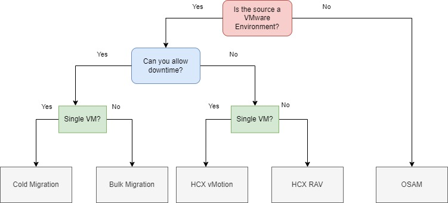

# VMware vSphere to Oracle Cloud VMware Solution (OCVS) using VMware HCX

## Overview

This guide covers migrating workloads from on-premises VMware vSphere environments to Oracle Cloud VMware Solution (OCVS) using VMware HCX. This is a seamless lift-and-shift approach that preserves the full vSphere stack (ESXi, vCenter, vSAN, and NSX), minimizing operational disruption by avoiding re-platforming.

## Introduction

Oracle Cloud Infrastructure (OCI) is a global cloud services platform offering a comprehensive portfolio of IaaS, PaaS, SaaS, and DaaS capabilities across distributed datacenters. Oracle Cloud VMware Solution (OCVS) is purpose-built for lift-and-shift migrations of existing VMware environments, preserving the full VMware software-defined datacenter (vSphere, vSAN, NSX, vCenter), enabling organizations to maintain existing tools, processes, and operational models with minimal disruption.

Migrating VMware workloads to OCVS using HCX enables advanced capabilities such as Layer 2 network extension, IP address retention, and live workload mobility.

## Target Platform: Oracle Cloud VMware Solution (OCVS)

**Key Characteristics:**
- **Hypervisor:** VMware ESXi
- **Management Tools:** vCenter, HCX, NSX, vSAN
- **Best Use Case:** Lift-and-shift of VMware estates
- **Compute Shapes:** Dedicated Bare Metal DenseIO, Standard and GPU shapes
- **Networking:** VMware NSX-T
- **Primary Storage:** vSAN or OCI Block Storage
- **Supported OS:** All OS supported by vSphere

## VMware HCX: Seamless VMware-to-VMware Mobility

**VMware HCX** is the preferred enterprise-grade mobility solution for vSphere-to-vSphere migrations. Integrated natively with OCVS, HCX enables live and bulk migrations, network extension, and non-disruptive workload transitions.

**Licensing:** HCX is bundled with OCVS deployments. Depending on the chosen Bare Metal shape, customers receive HCX Advanced or HCX Enterprise licenses.

### Key Capabilities

- **Bulk Migration:** Parallel batch migration of VMs with scheduled cutovers. (Advanced Licensing)
- **vMotion:** Live migration of a single powered-on workload with zero downtime (Advanced Licensing)
- **Cold Migration:** Migration of a powered off VM (Advanced Licensing)
- **Replicated Assisted vMotion:** Live migration of multiple powered-on workloads with zero downtime. (Enterprise Licensing)
- **OS-Assisted Migration (OSAM):** Enables guest-based migration of Hyper-V or KVM VMs to OCVS. (Enterprise licensing)
- **L2 Network Extension:** Seamless IP preservation and extended subnets across OCI and on-premises.
- **Mobility Optimized Networking:** Allowing VMs using a layer 2 extension to route more efficiently.

## Migration Methods

### Bulk Migration

Bulk Migration allows the parallel migration of multiple virtual machines in batches from a source environment to a target environment, such as from on-premises VMware vSphere to Oracle Cloud VMware Solution (OCVS).

Administrators can group VMs into migration waves and schedule cutover times to minimize business disruption.

The migration process involves an initial full synchronisation of the majority of a VM's data in advance, with only the delta changes being synchronized during the cutover window. During the pre copy phase, HCX will maintain an RPO of 2 hours by default.

This approach is ideal for planned migrations where downtime can be scheduled in advance and large numbers of VMs must be moved efficiently. To the app user it will be seen as a guest OS reboot, as the source VM is powered down and the moved copy is powered on at the destination.

This is the preferred option for migrating VMs, as it allows you to do it at scale. A copy of the VM is left behind on prem, its name is amended to include a POSIX timestamp (this helps with auditing) and it is powered off with its vNIC disconnected from the network (to ensure if it is ever powered on again by accident there is no chance of a conflict on the network).

**Key Considerations:**
- VMs with RDMs in Physical Compatibility mode are not supported
- VMs with ISOs attached can't be migrated (HCX can force unmount if needed)
- Snapshots are not migrated
- VMs Multi-Writer/Shared VMDKs can not be migrated
- VMs must be running at least Hardware Level 7 to be migrated

### vMotion Migration

Enables the live migration of powered-on workloads from the source vSphere environment to OCVS without downtime. This is achieved by transferring memory, CPU state, and active network connections over the HCX Interconnect. This method is typically used for smaller numbers of VMs that require zero-downtime relocation.

**Key Considerations:**
- Requires 150Mbps or higher throughput
- VMs with any kind of RDM are not supported for migration
- VMs must be at a hardware level of 9 or above to be migrated
- VMs Multi-Writer/Shared VMDKs can not be migrated
- vMotion migration only supports serial migrations (until the first vMotion migration has finished another one can not start)
- HCX Deactivates Change Block Tracking (CBT) before migration
- VM Encryption is not supported

### Cold Migration

Cold migration uses the same network path as HCX vMotion to transfer a powered-off virtual machine. During a cold migration, the Virtual Machine IP address and the MAC address are preserved. Cold migrations must satisfy the vMotion requirements.

This feature is seldom used, as it has the same limitations as vMotion. In our experience, disconnecting the vNIC of the VM and powering it on and then using Bulk Migration has been the way to work around the cold migration limitations and constraints.

**Key Considerations:** Same as vMotion above.

### Replicated Assisted vMotion (RAV)

Combines replication and vMotion to support the migration of larger workloads with zero downtime. The majority of the VM's disk data is replicated in advance, followed by a short vMotion event to transfer the remaining changes (CPU/memory). RAV is particularly useful for migrating large, busy VMs that would otherwise require long vMotion windows or exceed vMotion thresholds.

Just like Bulk Migration there is the initial sync and after that an RPO of 2 hours is maintained.

With RAV, multiple VMs are replicated simultaneously. When the replication phase reaches the switchover window, a delta vMotion cycle is initiated to do a quick, live switchover. **Live switchover happens serially.**

**Key Considerations:**
- Replication Assisted vMotion creates two folders at the destination site. One folder contains the virtual machine infrastructure definition, and the other contains the virtual machine disk information. This is normal behavior for RAV migrations and has no impact on the functionality of the virtual machine at the destination site. The only way to fix this is to do a Storage vMotion at the destination after the migration has completed
- Requires 150Mbps or higher throughput
- VMs with Physical Compatibility mode RDMs are not supported for migration
- VMs must be at a hardware level of 9 or above to be migrated
- HCX Deactivates Change Block Tracking (CBT) before migration

## Layer 2 Network Extension

L2 Network Extension enables seamless extension of Layer 2 broadcast domains from an on-premises datacenter to OCVS. This allows virtual machines to retain their existing IP addresses, avoiding the need for re-IPing during migration.

By bridging networks across the HCX Interconnect, workloads can move between sites without changes to IP configuration or gateway addresses, which is critical for application compatibility and minimizing disruption during phased migrations.

L2E supports operational models where applications are split across sites, enabling hybrid cloud architectures with consistent networking.

Traditionally extending a layer 2 network (VLAN) was considered to be very risky, but HCX has made it simple and reliable with its Network Extension High Availability configuration.

### HCX L2E High Availability (HA)

**Overview**

In a standard HCX L2E setup, an **HCX Network Extension appliance** is deployed at both the source and destination sites to bridge Layer 2 networks across locations.  
High Availability (HA) mode ensures that network extension services remain operational even if the active appliance fails.

This feature requires HCX Enterprise licensing.

**How It Works**

- **Dual Appliances:** HCX deploys two Network Extension appliances in an HA pair per extended network — an **Active** and a **Standby**.
- **Heartbeat Monitoring:** The appliances communicate via a heartbeat channel to detect failures.
- **Automatic Failover:** If the active appliance becomes unavailable (e.g., VM crash, host failure, appliance upgrade), the standby appliance automatically takes over Layer 2 extension duties.
- **Seamless Transition:** The switchover happens without requiring IP changes, preserving workload connectivity during migration or hybrid operations.

**Key Considerations:**
- **Resource Usage:** HA mode requires **twice the appliance resources** (CPU, RAM, storage).
- **Bandwidth:** Ensure sufficient bandwidth for both appliances to handle failover scenarios.
- **Licensing:** HCX Advanced includes L2E, and HA functionality is part of the Enterprise feature set.
- **Appliance Placement:** Place HA pairs on separate hosts or clusters to avoid a single point of failure.
- **Limitations:** Not supported for every network type (e.g., management networks), and some failover events may briefly drop a few packets before recovery.
- Each Active and Standby pair is managed as an HA group, which includes upgrading and redeploying appliances. The process for redeploying and updating HA groups is the same as with standalone appliances, except that the operation is applied to both Active and Standby appliances at both the source or remote site.

### HCX Mobility Optimized Networking (MON)

**Mobility Optimized Networking** (MON) is an HCX feature that ensures virtual machines migrated with **Layer 2 Network Extension (L2E)** can still route traffic efficiently after migration — without being forced to hairpin back to the source site for external network access.

When you extend a network with HCX L2E, VMs retain their original IP addresses. This is great for avoiding re-IPing, but it also means that, by default, routing for that subnet remains tied to the **gateway** in the source site.  
Without MON, a VM migrated to OCVS might send all north-south traffic back to the on-premises gateway, causing:
- **Suboptimal routing / higher latency**
- **Increased bandwidth usage** on the interconnect
- **Potential bottlenecks** if WAN bandwidth is limited

MON solves this by enabling a **local default gateway** at the destination site for the extended network.

**How It Works:**
- MON is enabled **per-extended network** in HCX and then on a per VM basis.
- When a VM is migrated to the destination site, MON updates the VM's **default gateway** to point to the **local gateway** at the target site instead of the source site.
- Local routing tables are adjusted so the VM's traffic to external networks uses the closest available egress point.
- If the VM moves back to the source site, HCX automatically reverts it to the original gateway configuration.

**Key Considerations:**
- MON requires **HCX Enterprise** license.
- Must be explicitly enabled per extended network.
- Works only with HCX L2 Network Extensions.
- Requires NSX-T Tier 1 gateway at the destination to host the local default gateway.
- May require updates to firewall rules or routing policies to account for the change in egress point.
- It has key scaling limits which may change with every release of HCX
- Can make troubleshooting networking issues harder, so should only be enabled on networks and VMs that really need it

With its powerful suite of capabilities, HCX is a cornerstone of any successful VMware migration strategy.

## Assessment and Discovery Mapping

A structured assessment, planning, and testing phase is essential for validating the migration design, minimizing risk, and ensuring a smooth transition to Oracle Cloud VMware Solution (OCVS). This phase should include:

- **Workload Discovery & Classification** – Use inventory tools (e.g., RVTools, vSphere inventory, or HCX discovery) to map out virtual machines, applications, and dependencies. Classify workloads by criticality (mission-critical, business-critical, dev/test) and migration complexity.
- **Dependency Mapping** – Identify application interdependencies, DNS records, firewall rules, and IP address requirements. Pay special attention to workloads requiring strict IP preservation or low-latency communication.
- **Right-Sizing & Capacity Planning** – Assess CPU, memory, and storage utilization to define the required OCVS node count and storage architecture (OCI Block Volumes, or vSAN). Consider current utilization and growth factors.
- **Network & Security Planning** – Validate OCVS networking design, including NSX-T configuration, security policies, and FastConnect/IPSec VPN. Plan for Layer 2 extension where IP preservation is required.
- **Testing & Validation** – Conduct pilot migrations for representative workloads before executing large-scale cutovers. Validate performance, failover, and recovery procedures.

## Special Considerations for Enterprise and Mission Critical Databases

While VM-level migration tools like HCX can handle the majority of workloads, they may not be sufficient for enterprise-scale, mission-critical applications where downtime is unacceptable. For large and transaction-heavy databases, a pure VM-level migration introduces significant challenges due to:
- Database size (terabytes or petabytes).
- Continuous write activity (transaction-heavy workloads).
- The requirement for zero or near-zero downtime.

To migrate such mission critical workloads and DB's you might consider dedicated solutions and architectures:

- **Oracle Databases** – Use Oracle Data Guard or GoldenGate for robust replication, synchronization, and failover capabilities.
- **PostgreSQL/MySQL** – Use native replication or database-specific migration tools.
- **Microsoft Active Directory** – Use native AD replication between domain controllers to maintain consistency.
- **Microsoft Exchange Server** – Leverage Exchange Hybrid configurations or Database Availability Groups (DAGs) for continuity during migration.

By combining VM-level mobility with application-aware replication, enterprises can achieve data consistency, reduced downtime, and a resilient cutover strategy for their most business-critical workloads.

## Best Practices & Guidance

To ensure a smooth and resilient transition to OCI Native Compute Instances, the following best practices should be incorporated into any migration strategy:

- **Adopt a phased migration approach** – Start with lower-priority or non-production workloads to validate tooling, processes, and network designs. Use early phases as learning cycles before addressing mission-critical systems.

- **Plan for IP remapping** – Document all IP addresses, DNS records, and firewall rules that will need updating. Create a comprehensive IP mapping table and security group mapping before migration begins.

- **Leverage OCI-native services** – Take advantage of OCI's managed services such as Autonomous Database, Object Storage, and monitoring services to modernize applications post-migration.
