# **Add a New Worker Node to an Existing OpenShift Cluster Using the Assisted Installer**

&nbsp;

<h1>Overview</h1>

In an earlier [tutorial](https://github.com/oracle-devrel/technology-engineering/blob/main/cloud-infrastructure/virtualization-solutions/openshift-on-oci/deploy-new-cluster-assisted-method/files/index.md), we discussed how to deploy OpenShift on OCI using the Assisted Installer method. In this tutorial, we’ll cover how to add a new or additional worker node to an existing OpenShift cluster.

When adding a new node, you can choose between a virtual machine–based node or a bare metal node. The list of supported shapes that can be added to the cluster is available in the [Oracle Documentation](https://docs.oracle.com/en-us/iaas/Content/openshift-on-oci/overview.htm#supported-shapes)

&nbsp;

<h1>Architecture</h1>

Here is a sample architecture

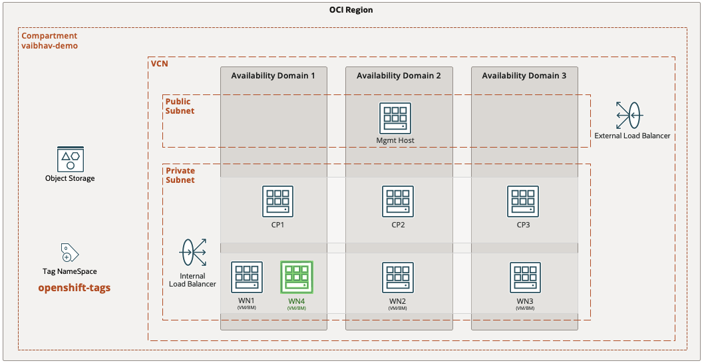

&nbsp;

<h1>Before we begin</h1>

- RedHat account details that was used for cluster deployment
- Access to OCI Console with appropriate privileges. Please refer to Oracle [documentation](https://docs.oracle.com/en-us/iaas/Content/openshift-on-oci/install-prereq.htm#install-prereq-account)
- SSH key pair

&nbsp;

<h1>High Level Steps</h1>

1. Generate the ISO from the RedHat console
2. Upload the ISO to OCI Object Storage
3. Download the add node TF stack from OCI GitHub page
4. Run the OCI stack 
5. Finish the node installation from RedHat console
6. Approve/Add the node on the cluster

&nbsp;

<h1>Step #1 – Generate the installation ISO</h1>

1. Login to RedHat console on console.redhat.com 
2. Click on the navigation console and click on RedHat OpenShift. 
3. Click on Cluster List followed by the cluster name. Click on the add host tab
4. Click on Add host tab

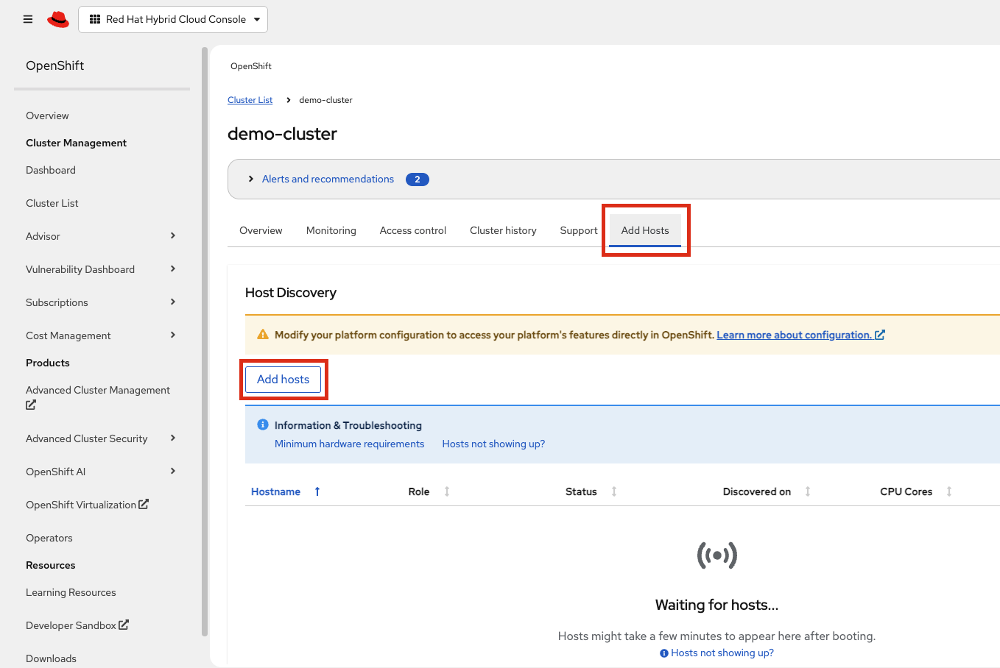

5. Click next on the cluster details page

6. On the generate ISO tab, paste the public key and click on Generate Discovery ISO button.

7. Click on the Download Discovery ISO button and it will start the downloading the ISO  

8. Keep the window open as we will come back to it later.

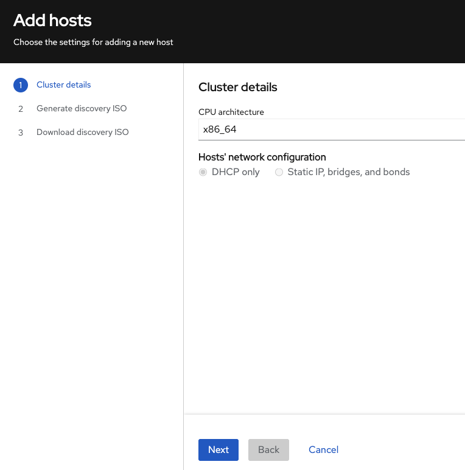 

 

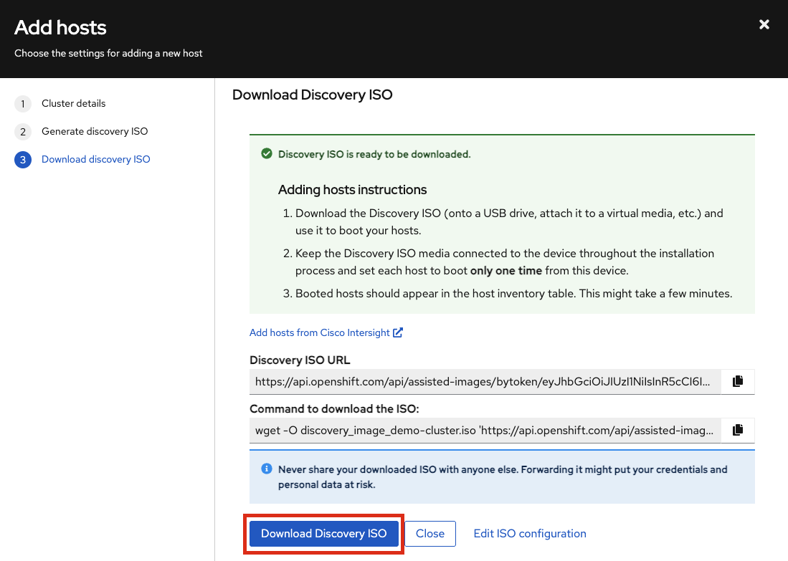

&nbsp;

<h1>Step #2 – Upload the ISO to Object Storage</h1>

1. Login to the OCI Tenancy. From the navigation menu, click on storage followed by buckets
2. Select the compartment (vaibhav-demo in my exmaple). Create a bucket if you don't have one or select the bucket where you wish to upload the ISO
3. Under the objects tab click on upload objects and upload the ISO downloaded earlier

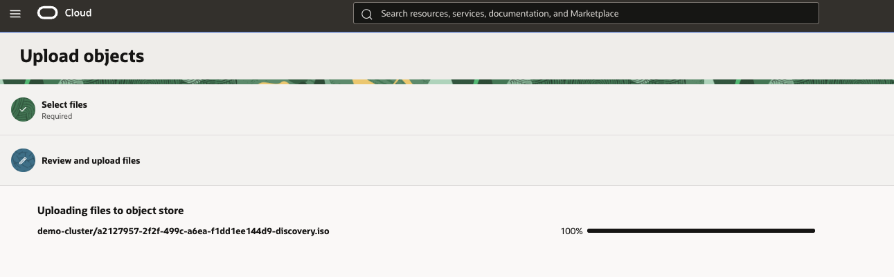

4. Click on the three dots on the right of the uploaded image and click on create pre-authenticated request

5. Keep the default values and click on create pre-authenticated request button.

6. Have the link handy as it will be needed later 

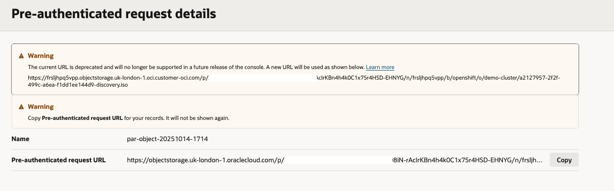

&nbsp;

<h1>Step #3 – Download the Terraform Stack for node addition</h1>

1. Download the latest Terraform file for node addition from URL https://github.com/oracle-quickstart/oci-openshift/releases
2. At the time of writing the tutorial 1.4.2 is the latest. Click on the file name and it should start the download.

&nbsp;

<h1>Step #4 – Run the OCI Stack</h1>

1. Login to the OCI Tenancy. Click on the navigation menu followed by Developer Services.
2. Under Resource Manager click on Stack. 
3. Select the compartment (vaibhav-demo in my exmaple). Click on create stack button.
4. Map the zip file downloaded in the above step with My Configuration and click next

5. Enter below details

    a. Choose the compartment where the existing OpenShift cluster is deployed.

    b. Enter the cluster name

    c. Enter the PAR link for the add node ISO created earlier

    d. During OpenShift Cluster creation, we created tag namespace "openshift-tags". Map the compartment where it resides.
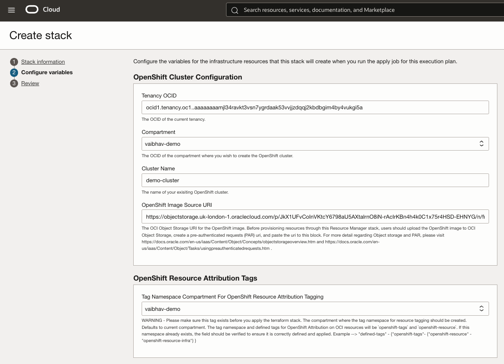    

    e. During the cluster creation as part of the deployment process VCN and three subnets are created. Map the VCN and the subnets.

    f. Here we are adding a new Worker / Compute Node and not Master / Control Plane. Keep the "Control Plan Node Count" as 0
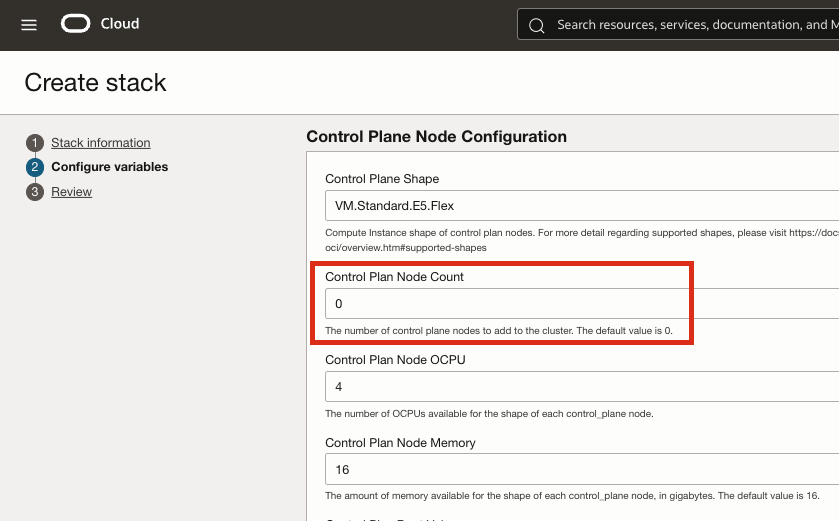

    g. Under the "Compute Node Configuration" enter the shape name for the new worker node. Here I am adding one bare metal server. Keep the default values for other parameters. Click Next.

    If you are adding a Virtual Machine based worker node then you need to specify the OCPU and RAM. For Bare Metal shape entire RAM and OCPU (the physical server has) are considered by default.
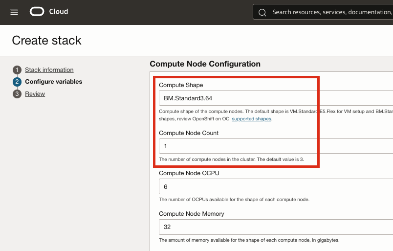

    h. Review the configuration. Check the option for "run apply". Click on the button apply. The stack should complete successfully. New node will be seen on the OCI portal
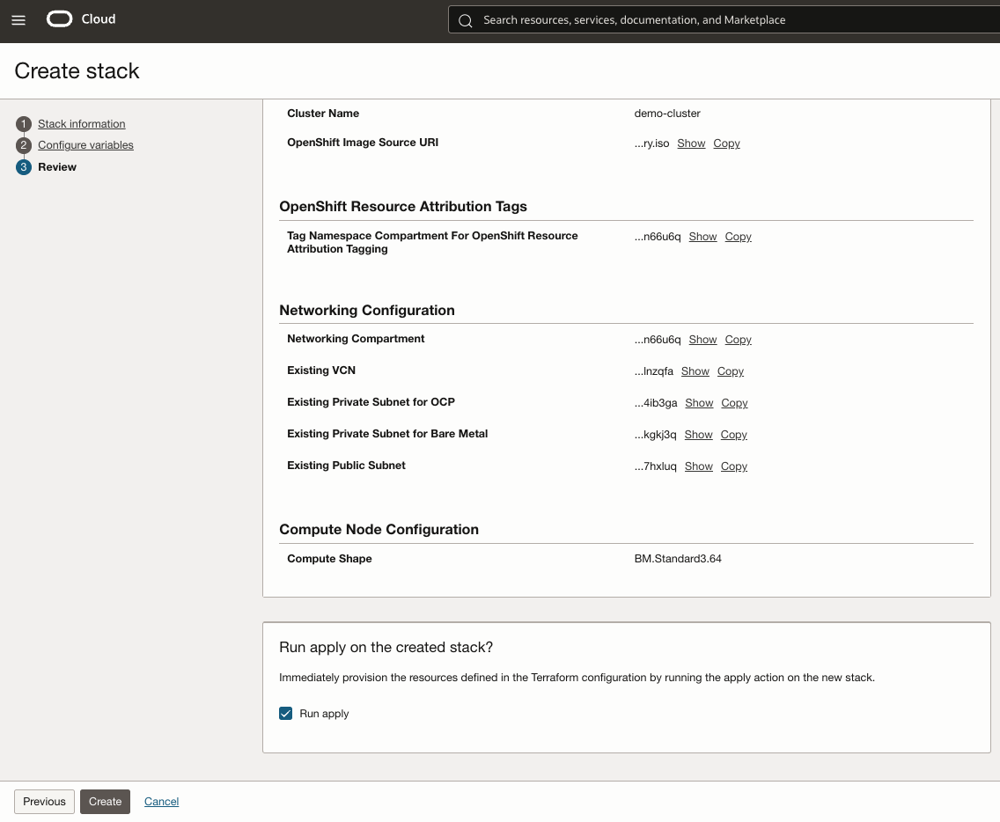 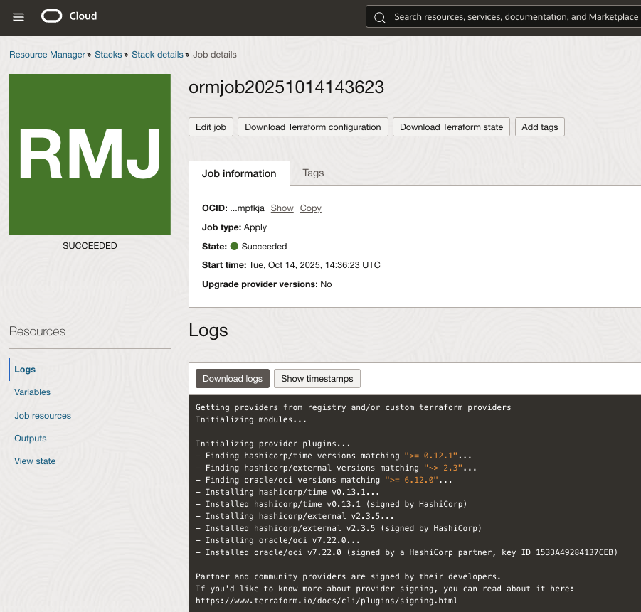 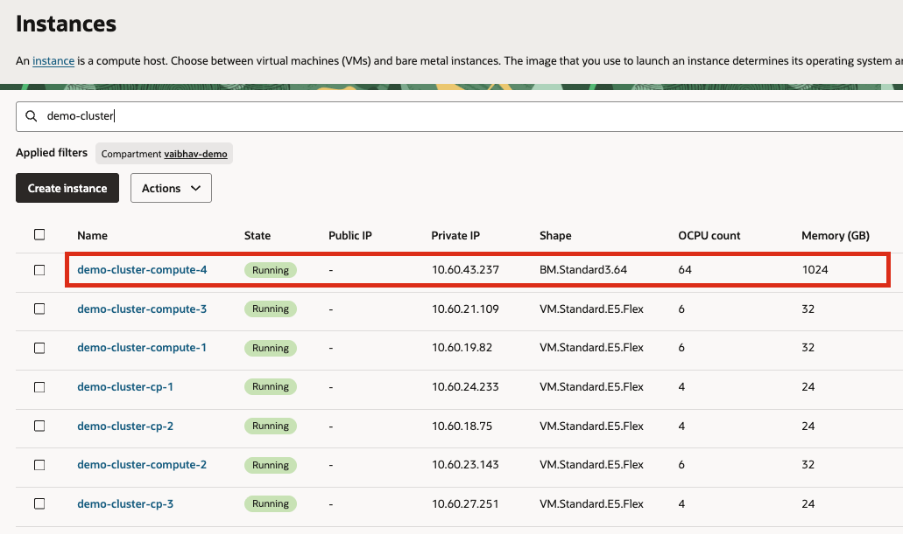

&nbsp;

<h1>Step #5 – Finish the node installation on RedHat portal</h1>

1. Post completing step 4, in few minutes we should see the node on the RedHat portal
2. Click on the button "Install Ready Hosts"

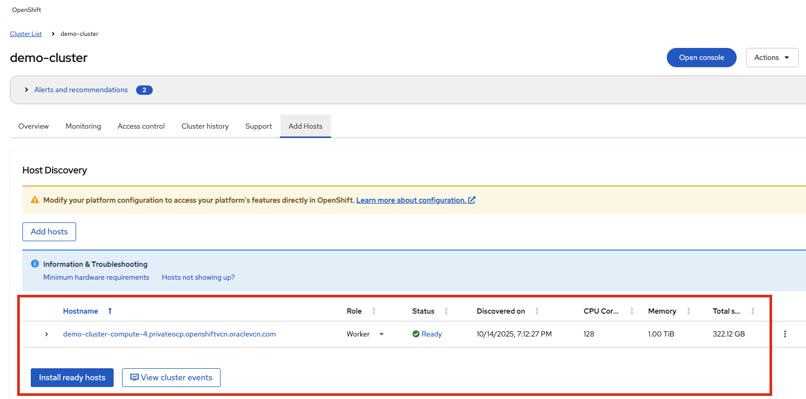

3. It will start the installation process and should finish in few minutes.

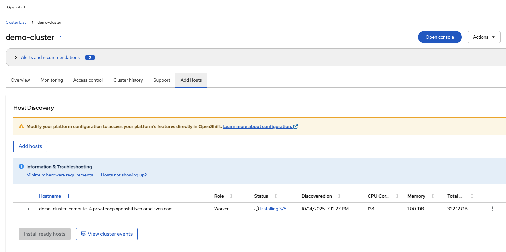 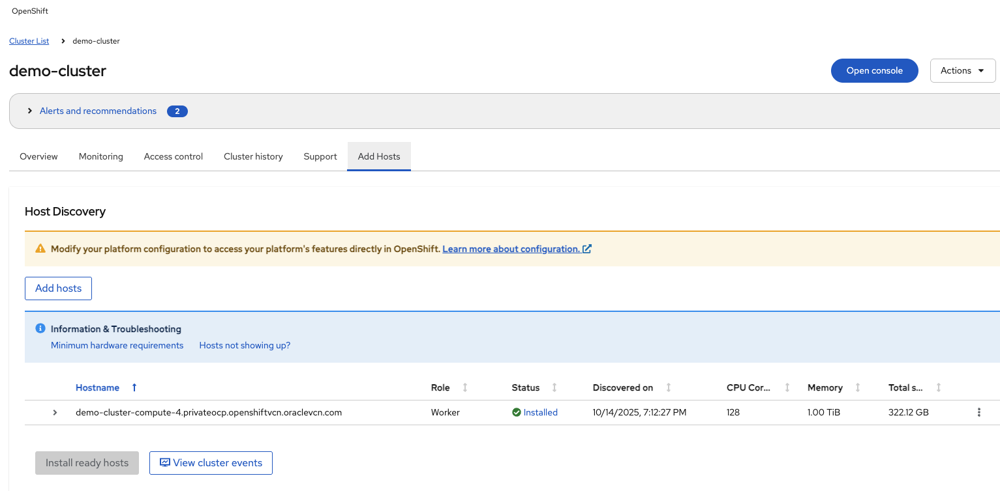

&nbsp;

<h1>Step #6 – Approve/Add the node from the OpenShift Cluster console</h1>

1. Post completing step 5, after few minutes we should see the node in pending state on the OpenShift Cluster
2. We need to approve the discovered node followed by certificate signing request.
3. The node in few minutes should change to ready state.

  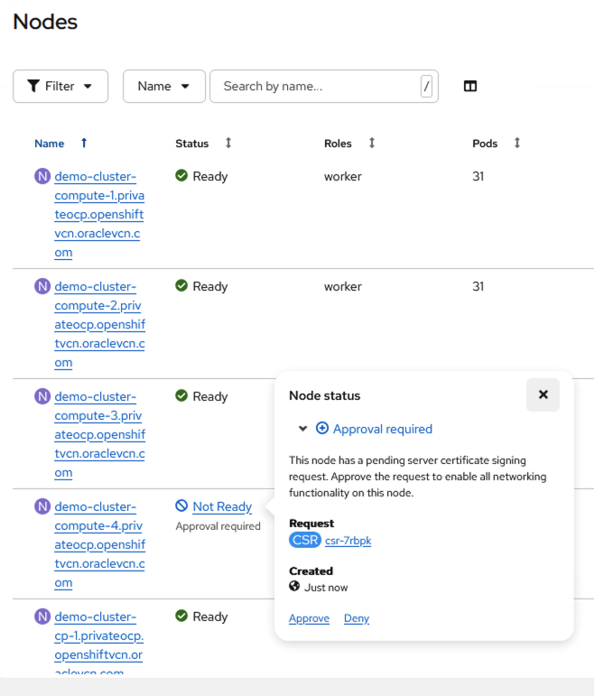 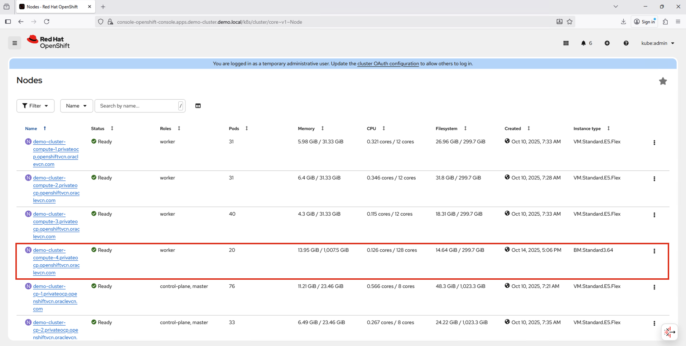 

# Acknowledgments

- **Author** - Vaibhav Tiwari (Oracle Virtualization BlackBelt)
