# **Deploying Red Hat OpenShift on OCI using Assisted Installer Method**

&nbsp;

<h1>Overview</h1>

Red Hat OpenShift is an enterprise-grade Kubernetes platform that enables organizations to build, deploy, and manage both containerized applications and virtual machines on a unified platform. 

Now officially certified on Oracle Cloud Infrastructure (OCI), OpenShift offers a fully supported and optimized environment on OCI’s high-performance virtual machine and bare metal shapes. Customers benefit from native OCI integrations such as Block Storage, Load Balancer, Object Storage, and Identity services, along with enterprise-level security, scalability, and automation.

Deploying OpenShift on OCI delivers a consistent hybrid and multi-cloud experience, enabling businesses to modernize applications, integrate legacy VMs, and accelerate innovation.

This tutorial provides a step-by-step guide to deploy OpenShift on OCI, covering architecture, networking, storage, installation, and essential configurations—helping you quickly build a production-ready OpenShift cluster that supports both containers and VMs on Oracle Cloud.

&nbsp;

<h1>Architecture</h1>

As part of the deployment framework, we deploy Control Plane (Master) and Compute (Worker) Nodes.

Storage is backed by OCI Block Volume.

We recommend carefully planning the deployment — including the compartment structure, VCN range, and the placement of all components.

&nbsp;

<h1>Before we begin</h1>

- Active RedHat account
- Access to OCI Console with appropriate privileges. Please refer to Oracle [documentation](https://docs.oracle.com/en-us/iaas/Content/openshift-on-oci/install-prereq.htm#install-prereq-account)
- SSH key pair
- Decide the compartment where we need to deploy the solution
   - I have created/deployed the solution in a single compartment vaibhav-demo
   - However, we can have different/multiple compartments too
   - Domain Name

&nbsp;

<h1>High Level Steps</h1>

1. Create the OpenShift Cluster & generate the ISO image on the RedHat console
2. Upload the ISO on the OCI Object Storage
3. Create the tag namespace on the OCI compartment
4. Run the OCI OpenShift stack from the OCI console
5. Finish installing the cluster from the RedHat console

&nbsp;

<h1>Step #1 – Generate the installation ISO</h1>

1. Login to RedHat console on console.redhat.com 
2. Click on the navigation console and click on RedHat OpenShift. Click on Cluster List followed by Create Cluster

 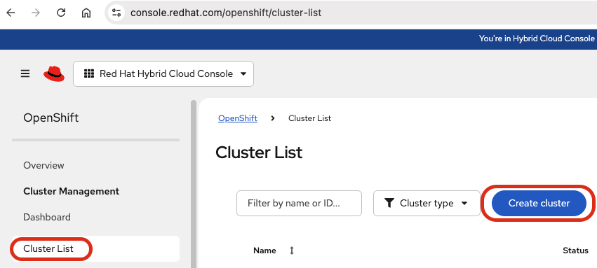

3. Under Cloud tab scroll down and click on Oracle Cloud Infrastructure 

4. Click on Interactive 

5. Enter the Cluster name followed by base domain. Choose stable version. We would recommend to choose the latest one.

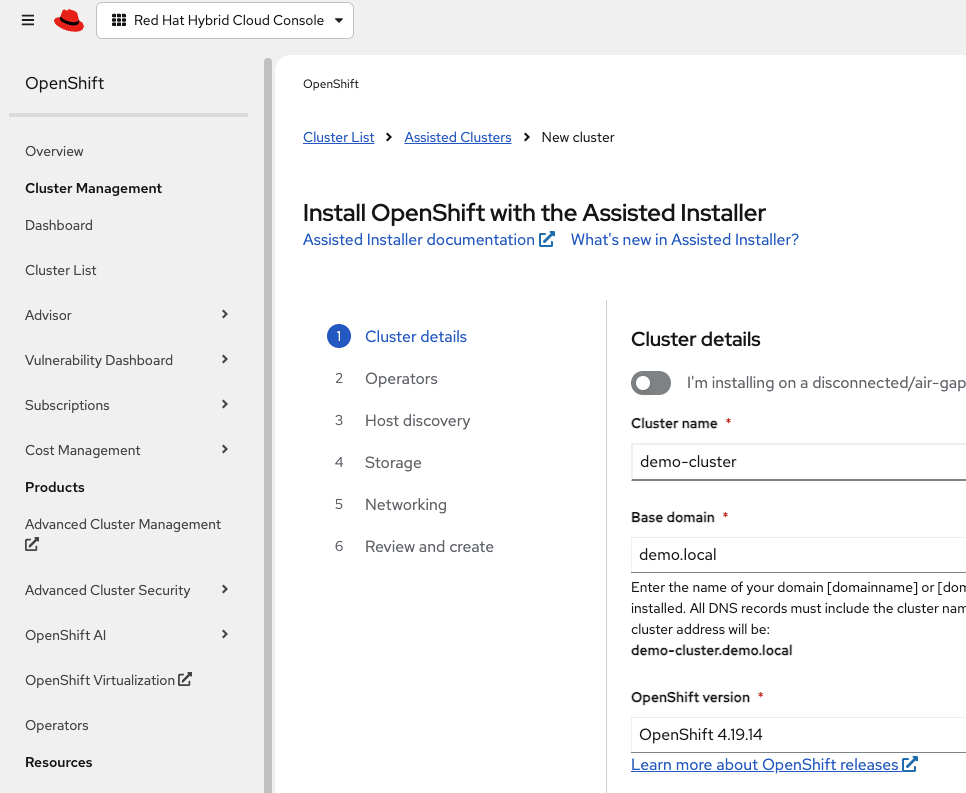

6. Click on the drop down for Integrate with external partner platforms and choose Oracle Cloud Infrastructure and click Next

7. Hit Next on the Operators screen. On the Host Discovery tab click on add hosts, paste the public SSH key and click on Generate Discovery ISO.

    a. Post downloading the ISO, we can click on the cancel button.

    b. Do not close this page as we will come back to it post the installation.

&nbsp;

<h1>Step #2 – Upload the ISO to Object Storage</h1>

1. Login to the OCI Tenancy. From the navigation menu, click on storage followed by buckets
2. Select the compartment (vaibhav-demo in my exmaple). Create a bucket if you don't have one or select the bucket where you wish to upload the ISO
3. Under the objects tab click on upload objects and upload the ISO downloaded earlier

4. Click on the three dots on the right of the uploaded image and click on create pre-authenticated request

5. Keep the default values and click on create pre-authenticated request button.

6. Have the link handy as it will be needed later 

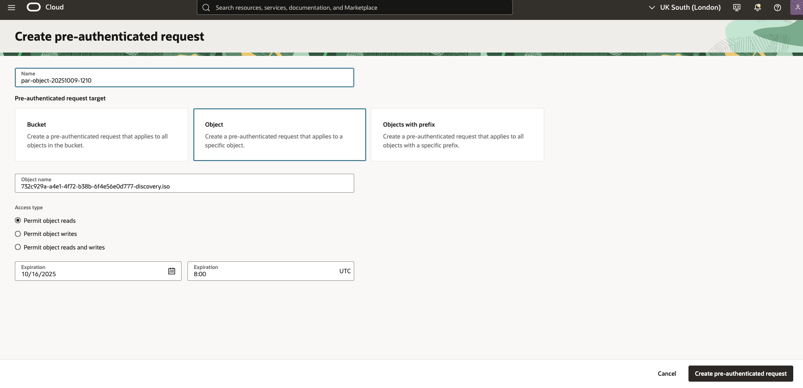 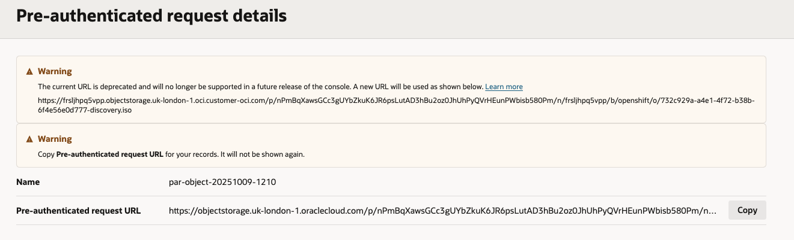

<h1>Step #3 – Create Tag Namespace</h1>

1. Browse to the URL https://github.com/oracle-quickstart/oci-openshift/releases and download the latest resource attribution tag. 
2. At the time of document the tutorial create-resource-attribution-tags-v1.4.2.zip is the latest.
3. Click on the file name and it will download it

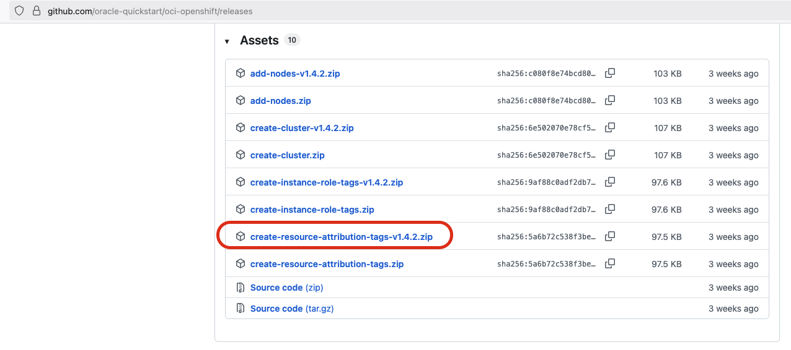

4. Login to the OCI tenancy, from the navigation menu click on Developer Services.

5. Click on Stack under Resource Manager. 

6. Click on create stack button and select the zip file downloaded above. Click next.

7.  Select the right compartment (vaibhav-demo in my exmaple) and click next. Select run apply and click on the create button.

8. Once the stack finishes successfully. From the navigation menu, click on Governance & Administration.

9. Click on Tag Namespaces under Tenancy Management. 

10. Choose the right compartment (vaibhav-demo in my exmaple) and you should see the openshift-tags

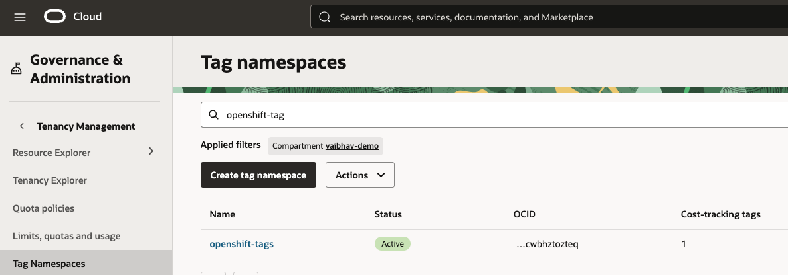

&nbsp;

<h1>Step #4 – Create the OpenShift cluster</h1>

**Create repository for Oracle Cloud Agent (Optional)**

1. Login to the OCI tenancy. From the navigation menu, click on the Marketplace followed by All Applications
2. Type Cloud Agent and click on the terraform stack
3. Click on the export button on the far right

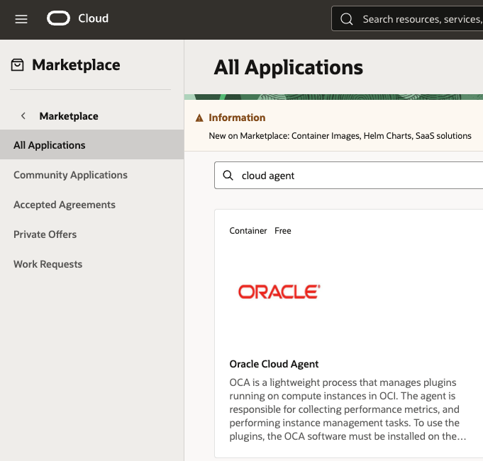 

4. Choose the right compartment (vaibhav-demo in my exmaple), create a new public repository. Accept the terms and click on export package button on top right.

5. Verify the work request completes successfully.

 

&nbsp;

**Run the Cluster Wizard**

1. From the navigation menu, click on the Developer Services followed by RedHat OpenShift

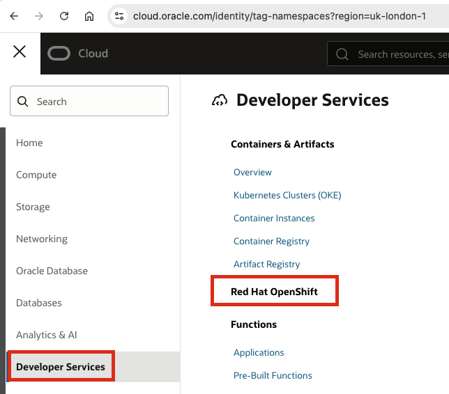

2. The process will redirect you and we now need to run Terraform stack to initiate the cluster deployment process. Click Next.

3.  Enter the details

    a. Make sure we are in the right compartment (vaibhav-demo in my exmaple).

    b. Enter the same cluster name what we specified in step 1

    c. Enter the ISO PAR link generated from step 2.

    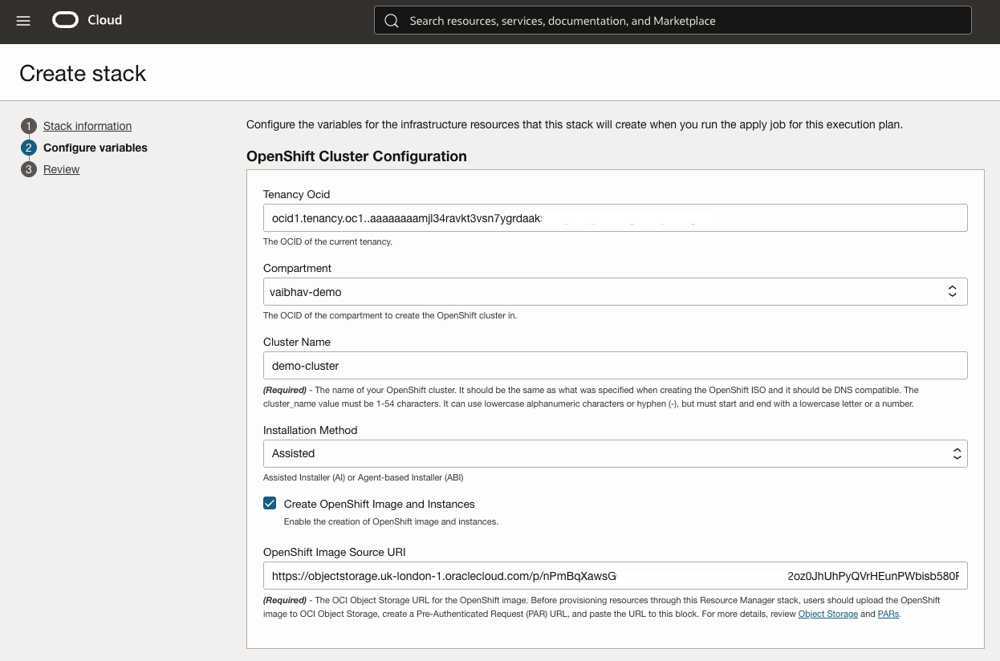

    d. Choose the compartment (vaibhav-demo in my exmaple) where we created the tag namespace in step 3

    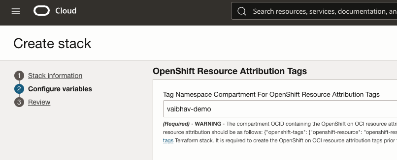 

    e. We can keep the defaults for the Control Plane and Compute nodes or change them as per the requirement.

    f. In the demo, I do not want to create a public DNS zone nor public OCI LB. It is all private.

    g. Enter the same domain name as mentioned on step 1. I will let the wizard create the VCN for us. Enter the VCN details

    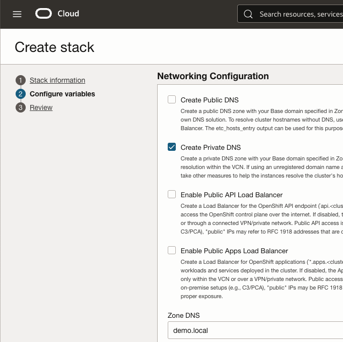 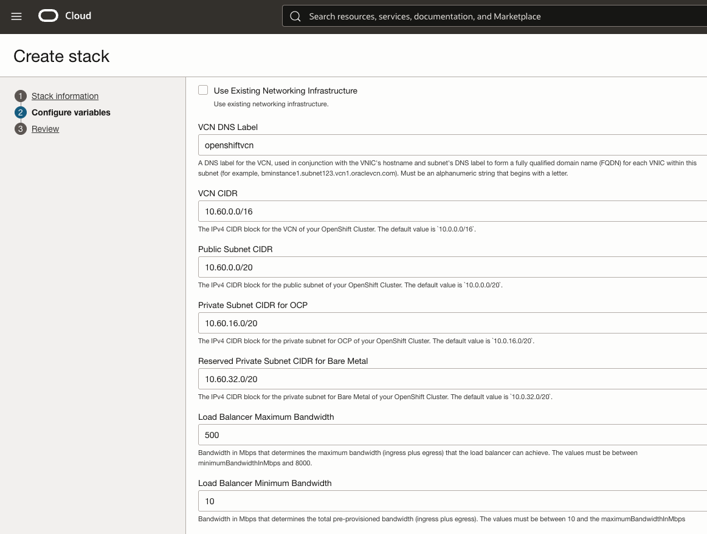

    h. Choose the latest CSI driver followed by Cloud agent details. Verify the information, apply and run the stack.

    At the time of writing the tutorial v1.32.0-UHP is the latest. Here is the [link](https://github.com/oracle-quickstart/oci-openshift/tree/main/custom_manifests/oci-ccm-csi-drivers) for future references

    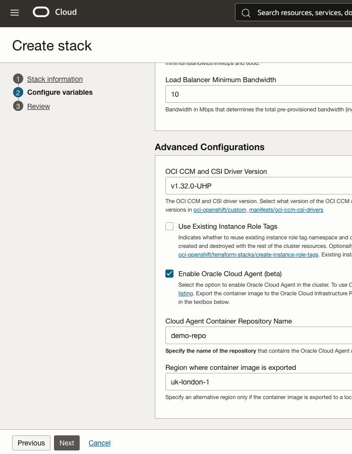 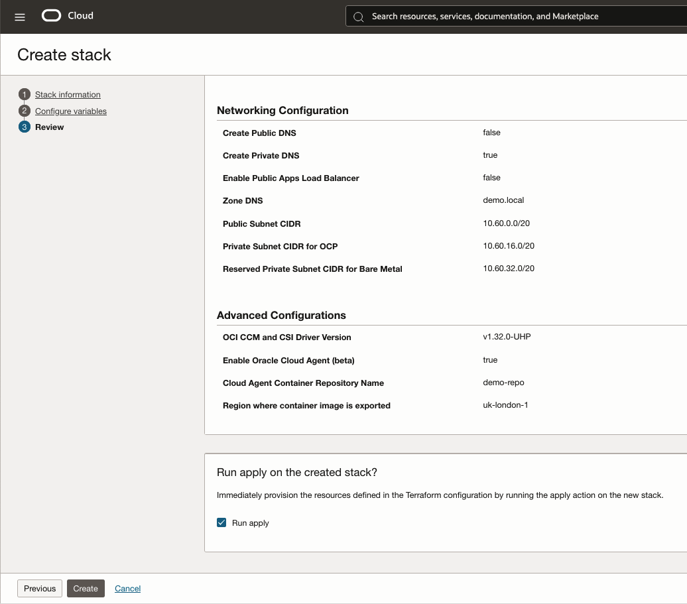

    i. Monitor and verify the stack completes successfully. Click on the outputs tab and copy dynamic_custom_manifest. Save the content in a notepad file with extension .yml (for example demo-cluster.yml). This will be used later

    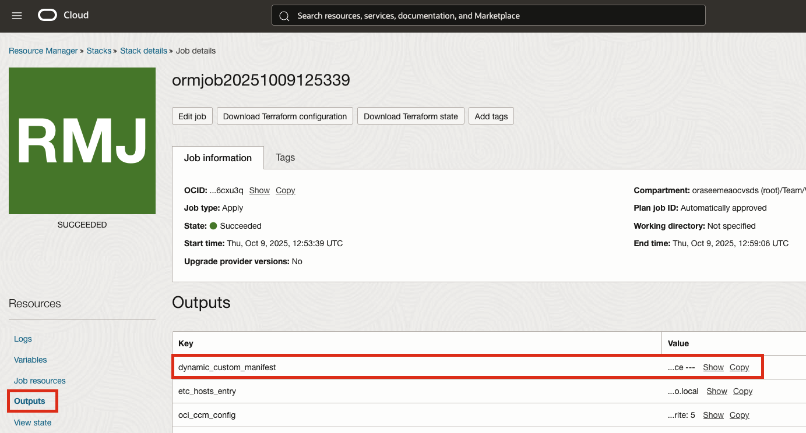

    j. On the OCI console, you should see Instances, VCN and the Load Balancers.

     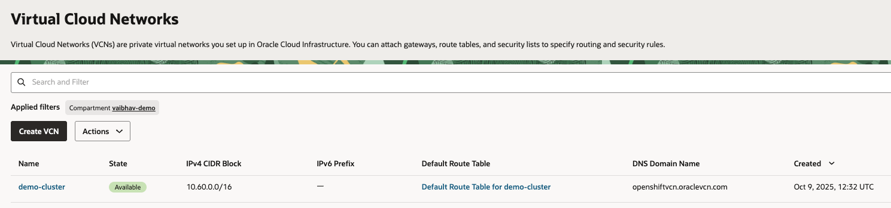 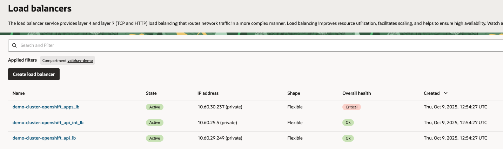

&nbsp;

<h1>Step #5 – Complete the Cluster Installation</h1>

1. Navigate to the RedHat console and you should see the Control Plane and Compute Nodes on the portal.

2. Mark the Compute Nodes as Worker and Control Plane as Control Plane Nodes, click next. 

3. Click next on the storage & networking tab with the default values. It is not recommended to make any changes. 

4. On the Custom Manifest tab, enter the file name as saved above in the notepad file. Drag and drop the yml file in the content box. Click next

5. Validate the summary and click on the Install Cluster button. Post successful installation we will see the cluster details on the RedHat portal.

6. Download the Kubeconfig file. Copy the kubeadmin password and the URL. These will be needed to access the cluster.

 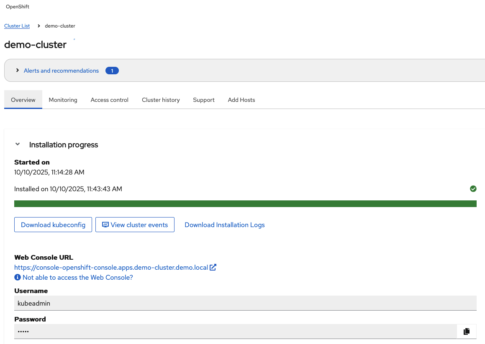

&nbsp;

# Acknowledgments

- **Author** - Vaibhav Tiwari (Oracle Virtualization BlackBelt)
