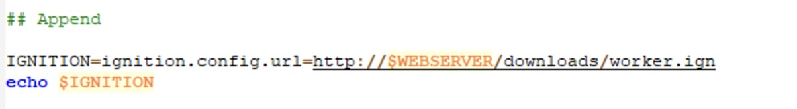
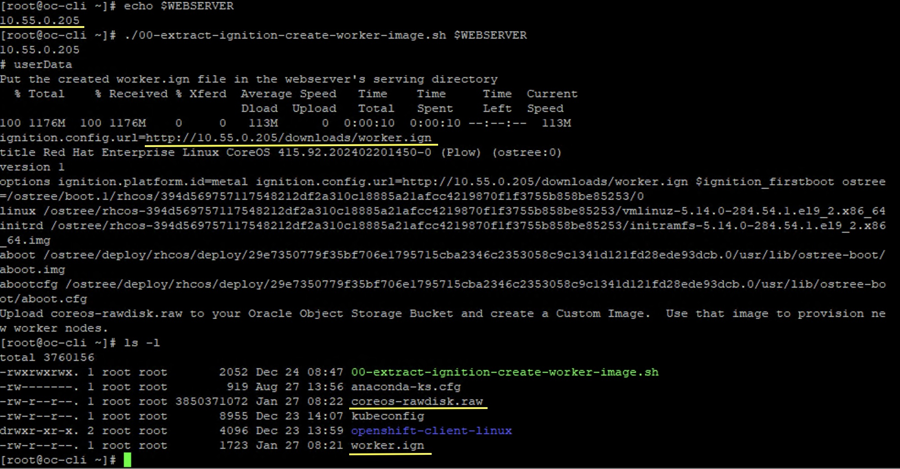
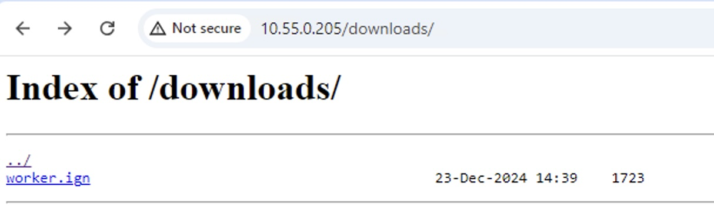
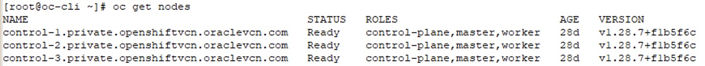
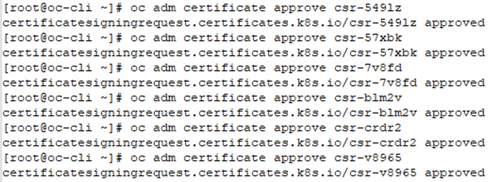
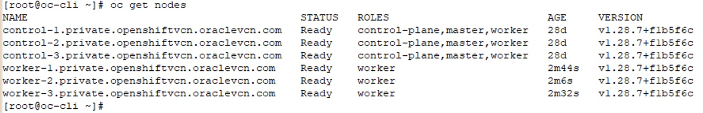
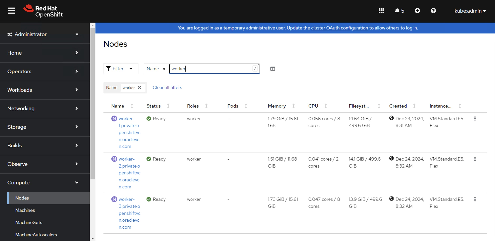

# Install OpenShift Cluster in OCI Using Agent-Based Installation method (2/2)

This guide provides detailed instructions on installing a OpenShift cluster in OCI using agent-based instalation method. This is in continuation of the Part 1 where the control plane nodes are provisioned and the OpenShift cluster is up and running. 

In this section, the worker nodes will be provisioned and joined to the existing cluster. 

Reviewed: 27.01.2025 

## Prerequisites

1. Part (1/2) of this installation guide is completed and you have agent based cluster running
2. Webserver to host the Worker ignition files to support the boot process 
3. An additional helper VM with the following requirements 
   1. Access to the internet
   2. Access to the webserver 
   3. OC command line utility
   4. Can access Openshift cluster created in (1/2) 
4. Shell script to create worker ignition image [Ignition Create Worker Image Script](https://github.com/davidc-dev/oci-ocp-disconnected-tweaks/blob/main/00-extract-ignition-create-worker-image.sh)


## High Level Steps

1. Prepare Web Server to host the worker ignition file
2. Generate CoreOS RawDisk and Worker ignition file 
3. Upload the worker ignition file to the web server
4. Upload the CoreOS RawDisk to the OCI Object Storage and create worker instances
5. Update the API load balancer with the new worker nodes
6. Approve CSRs for the new Worker nodes 
7. Validate


## Steps
### 1. Prepare Web Server to host the Worker Ignition

1. You can prepare a web server Apache/Ngix of your choice to host the static contents. Refer to the link for the instructions 
- [NGINX Installation](https://docs.oracle.com/en/learn/ol-nginx/) 
- [Web Server Static Contents](https://docs.nginx.com/nginx/admin-guide/web-server/serving-static-content/)  

### 2. Generate CoreOS-RawDisk and Worker Ignition file 

1. Download the script from this GitHUb URL and copy it to the helper VM. The link to download the shell script is [Ignition Create Worker Image Script](https://github.com/davidc-dev/oci-ocp-disconnected-tweaks/blob/main/00-extract-ignition-create-worker-image.sh) 
2. Modify the script's **Append** section if the static contents are hosted in sub folder. For example, in this example, my static contents are hosted under **downloads** folder from where the worker.ign file will be fetched. If your web server does not have sub folders for the static contents ignore this step. 

  

3. Set the WEBSERVER IP as your web server from the Step 1 and run the script. Once the script is executed successfully, it will generate two files **coreos-rawdisk.raw** and **wroker.ign**

```
WEBSERVER=<server IP or hostname>
./00-extract-ignition-create-worker.sh $WEBSERVER

```
Refer to the sample screenshot below where the script has generated two files **coreos-rawdisk.raw** and **wroker.ign** files

 

4. Now, upload the **worker.ign** generated from the previus stage to the webserver hosting static contents. Make sure to test if the **worker.ign** is hosted via web server. Refer to the sample screenshot below.

 

### 3. Create custom image using Coreos-rawdisk

In this section, you will create a custom image to provsiion worker instances. to create custom image, follow the steps below:

1. Login to OCI console and navigate to the Hamburger Menu -> Storage -> Object Storage -> Bucket and upload the **coreos-rawdisk.raw** obtained from the previous step to the bucket. 
2. Navigate to the Compute -> Custom Images and click on Import image
3. Provide name of the image, choose the option to **Import from an Object Storage bucket** and select the **coreos-rawdisk.raw** file. 
4. Select the image type as **QCOW2** and leave the default settings as-is. 
5. Once the image is successfully imported, click on **Edit image capabilities**, and unselect **BIOS** firmware option to save changes. 

### 4. Create worker nodes using custom image and add them to the API Load Balancer

In this section, you will create worker nodes using the custom image created in Step 3 and add them to the API load balancer. 

1. Create instance using the custom image. Select the compute shape for the CPU and Memory resources required for these worker nodes. 
   1. Under networking, select the same VCN and a private subnet where the control plane nodes are deployed. 
   2. Leave the default selection of automatic assignments of the IP addresses. 
   3. Under Advanced options, select Network Security Group as **cluster-compute-nsg** 
   4. Do not Add SSH keys 
   5. Add storage as per your requirements. 
   6. Review the settings and create worker node.
2. Repeat steps from 4.1 for each additional worker nodes. 
3. Once the worker nodes are created, add them to the API Load balancer. Follow the steps below 
   1. Navigate to the Hamburger Menu -> networking -> Load balancers -> Open **API Apps** Load balancer. 
   2. Open **api_backend** and add all the worker nodes created in step 4.1 & 4.2 with port 6443. 
   3. Open **ingress_http** and add all the workder nodes created in step 4.1 & 4.2 with port 80 similarly, update the backend set **ingress_https** with port 443. 

### 5. Approve CSRs for New Worker Nodes and join them to the cluster

In this section, you need to approve Certificate Signing Requests (CSR) generated by new worker nodes. Once they are approved, the nodes can then join to the cluster successfully. 

1. First check the status of the current active nodes by running the following command. You are expected to see the control plane nodes as a result of a Part 1. Refer to the sample screenshot below

```
oc get nodes
```
 

2. Now run the following command to identify the CSRs which are in pending state. You will see list of the nodes which are pending state. refer to the sample screenshot below

```
oc get csr | Pending
```


3. Approve the CSRs for the worker nodes by running the following command against each pending node. Refer to the sample screenshot below

```
oc adm certificate approve <name>
```


Alternatively, approve all pending CSRs at once by running the below command: 

```
oc get csr -o go-template='{{range .items}}{{if not .status}}{{.metadata.name}}{{"\n"}}{{end}}{{end}}' | xargs --no-run-if-empty oc adm certificate approve
```

### 6. Validation

1. Verify the status of the cluster nodes by running the following command, You are expected to see the worker nodes joined to the cluster with Ready Status. 

```
oc get nodes
```


2. Login to the openshift console and verify the Status panel shows everything Green. 
3. Navigate to the **Compute** -> **Nodes** and verify the worker node status. Refer to the sample screenshot below 

