# Install OpenShift Cluster in OCI Using Agent-Based Installation method (1/2)

This guide walks you through the detailed steps for installing an OpenShift cluster on Oracle Cloud Infrastructure (OCI) using the agent-based installation method. This installation approach is referred to as a connected installation, meaning that both the OpenShift worker and control plane nodes require outbound internet access during the installation process.

This section is a Part 1 of the "how-to" guide. 

Reviewed: 27.01.2025

## High Level Steps

The following outlines the key steps required to perform the OpenShift agent-based connected installation in Oracle Cloud Infrastructure (OCI):


## Prerequisites

Before starting, ensure the following:

- You have access to OCI tenancy with required previliges to provision necessary OCI Infrastructure resources.
- OpenShift Installer 


## Steps
### 1. Download the OpenShift Client, Installer and Pull Secret

1. Log in to the **RedHat OpenShift Console** [Red Hat OpenShift Console](https://console.redhat.com/openshift/), go to your cluster list and **Create cluster**
2. Under the Cloud option -> select **Oracle Cloud Infrastructure(virtual machines)** option
3. Select **Local Agent-based** installation method.

   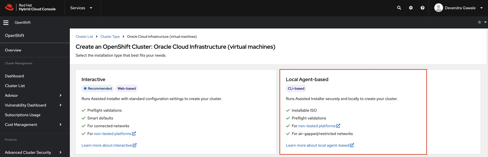

4. Download the OpenShift Installer, Pull Secret and Command line interface according to your client operating system. In this example, the MacOS is selected for Installer and the CLI.

   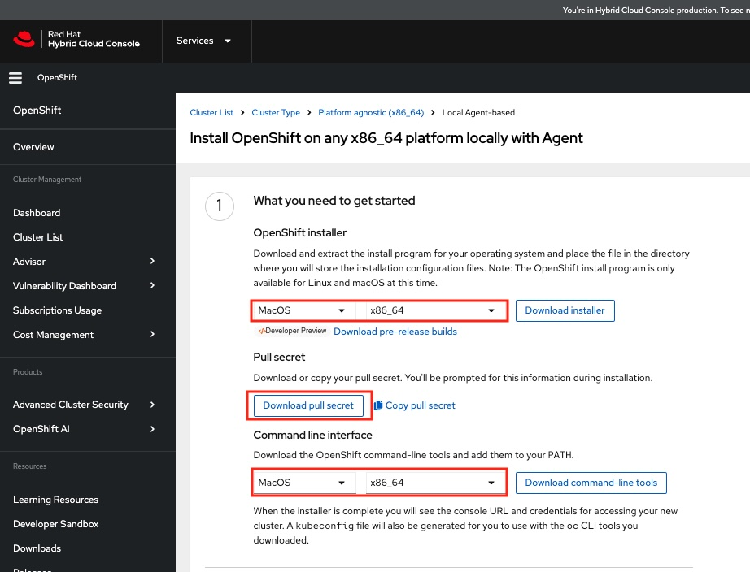  


### 2. Extract the binaries to the client machine

Extract the OpenShift Installer, CLI and move them to the executable path.

1. Extract the Openshift Client and move the **kubectl** and **oc** files to **/usr/local/bin** or executable path of your machine.

2. Extract the OpenShift Installer and move **openshift-install** to your executable path, in this example, it is **/us/local/bin**

   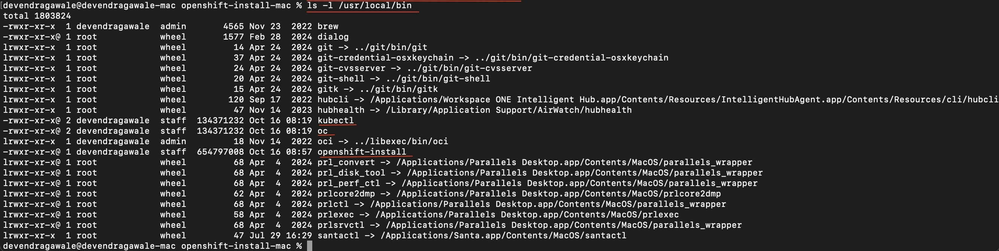  


3. Validate the version of OpenShift installer by running the following command.
   ```
   openshift-install version
   ```
   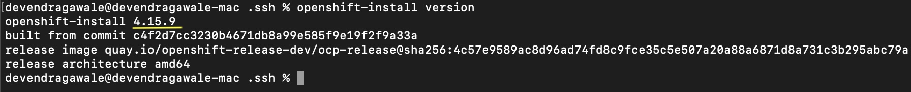

You are all set to start the installation.

### 3. Create OCI Resources for OpenShift Installation

1. Create the necessary OCI resources by following the instructions from the documentation below: 

- [OpenShift Installation Pre-Requisites](https://docs.oracle.com/en-us/iaas/Content/openshift-on-oci/install-prereq.htm)

- [OpenShift Agent Pre-requisites](https://docs.oracle.com/en-us/iaas/Content/openshift-on-oci/agent-prereq.htm)

1. (**OR**) You can also use the below terraform script to create this resources using OCI Resource Manager stack. The script can be downloaded from the same GitHUb link here

   **oci-openshift-agent-provision-resources.zip** 
   
   1. Login to the OCI console, select your region and a compartment where you would like to have the resources created. 
   2. Navigate to the Hamburger Menu -> Developer Services -> Resource Manager -> Stacks
   3. Click on **Create Stack** -> and upload the zip file **oci-openshift-agent-provision-resources.zip**
   4. Fill in the details to create OCI resources required for the agent-based installation as follows:
      1. cluster_name - name of the OCP cluster 
      2. compartment_ocid - this will be automatically populated
      3. enable_private_dns -> Enable 
      4. load_balancer_shape_details_maximum_bandwidth_in_mbps - Use default or specify the size
      5. load_balancer_shape_details_minimum_bandwidth_in_mbps - Use default or specify the size
      6. private_cidr - private subnet for the OCP cluster nodes
      7. public_subnet - public subnet for the OCP cluster nodes
      8. region - should auto populate, specify otherwise
      9. tenancy_ocid - should auto populate 
      10. vcn_cidr - IPV4 CIDR blocks for the VCN for your OCP cluster 
      11. vcn_dns_label - DNS label for VCN (optional) 
      12. zone_dns - name of the cluster's DNS zone. The zone_dsn value must be a valid hostname. 
   5. click **Run Apply** to create resources
   6. Once after the job is successful, obtain the output by navigating Stacks -> jobs -> output 

Refer to the screenshot below

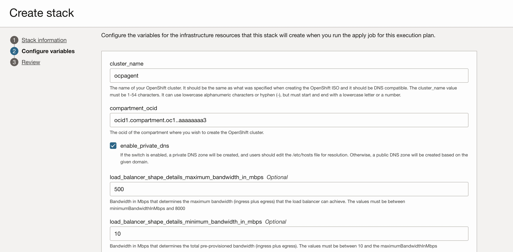
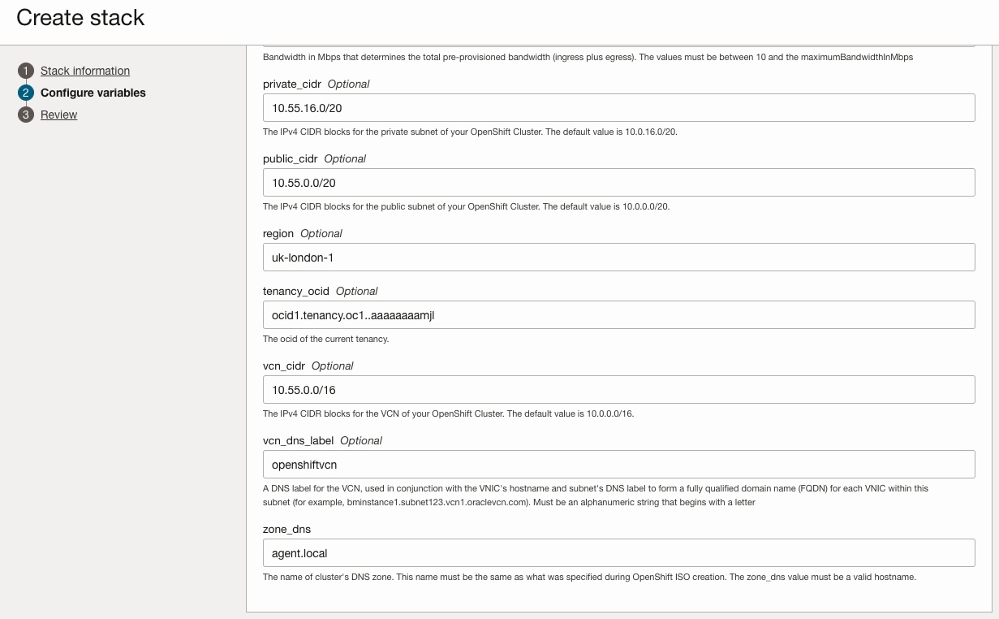

**oci_ccm_config** output

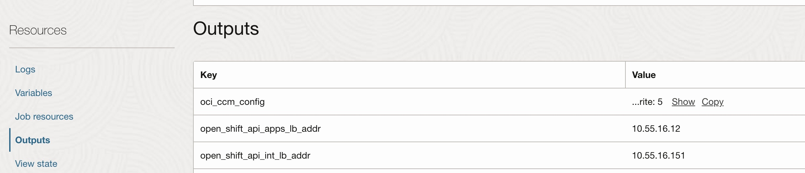

### 4. Prepare agent-config.yaml and install-config.yaml  files

Before you begin, make sure to create a directory/folder and maintain the folder structure as shown in the image below. Make sure to create a folder and machine config files where you have extracted openshift installer, client and kubectl.

   In the example below, a folder with name "**demo**" created which contains all the necessary config files.  

   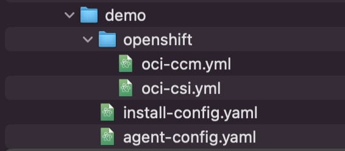

Now, we will create and update the install-config and agent-config files.

1. Create and Update the **install-config.yaml**. Copy the contents below and update the details according to your environment. You can also use the sample **config-files.zip** from the GitHub repo.    

```
apiVersion: v1
metadata:
  name: ocpdemo <-- Replace this with the name of the OCP Cluster
baseDomain: ocpdemo.local <-- Domain name
networking:
  clusterNetwork:
    - cidr: 10.128.0.0/14 
      hostPrefix: 23
  networkType: OVNKubernetes
  machineNetwork:
    - cidr: 10.50.0.0/16 <-- OCI VCN CIDR
  serviceNetwork:
    - 172.30.0.0/16
compute:
  - architecture: amd64
    hyperthreading: Enabled
    name: worker
    replicas: 0
controlPlane:
  architecture: amd64
  hyperthreading: Enabled
  name: master
  replicas: 3 <-- no. of control plane nodes
platform:
  external:
    platformName: oci <-- Platform name
    cloudControllerManager: External
sshKey: 'ssh-rsa AAAAB3NzaC1yc.......' <-- SSH public key
pullSecret: '{"authsbmNfpreGdyYUp3ZElWYU1FZjAzZjhmTENKUW52MHpDWUJrSDRpUHBQY19aUGtTNWNYQTNmSE9sSnJ0cHRad2xvWHp' <-- Insert pull secret obtained from Step 1.4

```

2. Update the **agent-config.yaml**

```
apiVersion: v1alpha1
metadata:
  name: ocpdemo
  namespace: ocpdemo
rendezvousIP: 10.55.16.20 <-- Select free IP from the VCN CIDR. This will be assigned to the first control plane node.
```

3. Update the **oci-ccm.yml**

- You need to update the **oci-ccm-04-cloud-controller-manager-config.yaml**  section in the file. Refer to the example screenshot below.

   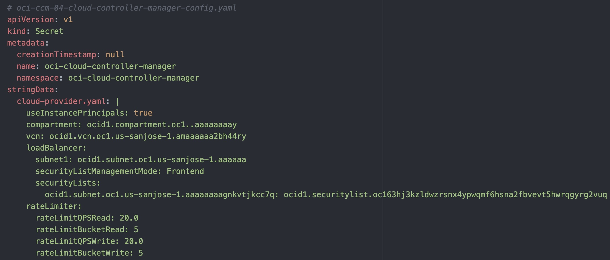

- Obtain the OCID values of a Compartment, VCN, Load Balancer Subnet and Security lists for the resources created in Step 3, if the resources are created manually.
- If you have used the resource manager and a Terraform script to create resources, then you must navigate in OCI console to obtain the value for Hamburger Menu -> Developer Services -> Resource Manager -> Stack -> Open Stack -> Outputs -> copy the values of  **oci_ccm-config** Key.

4. Update the **oci-csi.yml**

- You need to update the **# oci-csi-01-config.yaml** section in the file. Refer to the example screenshot below.

   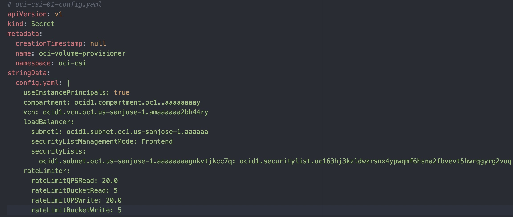


- Obtain the OCID values of a Compartment, VCN, Load Balancer Subnet and Security lists for the resources created in Step 3, if the resources are created manually.
- If you have used the terraform script to create resources using resource manager, then you must navigate in OCI console to obtain the value for Hamburger Menu -> Developer Services -> Resource Manager -> Stack -> Open Stack -> Outputs -> copy the values of  **oci_ccm-config** Key.

### 5. Generate Minimum Installation ISO

To generate the agent ISO file for the OpenShift installation, follow these steps:

- Navigate to the directory where all the configuration and manifest files are stored. For example, if the files are saved in the "demo" folder, navigate to that folder.

Run the following command to generate the minimal agent ISO file:

```
openshift-install agent create image --log-level debug

```
- Replace ./demo with the actual path where your configuration files are stored. This command will create the agent ISO file using the provided configurations.
Once the command completes successfully, the agent ISO file will be generated in the specified directory.

Refer to the openshift-install agent command line output from the sample screenshot below.

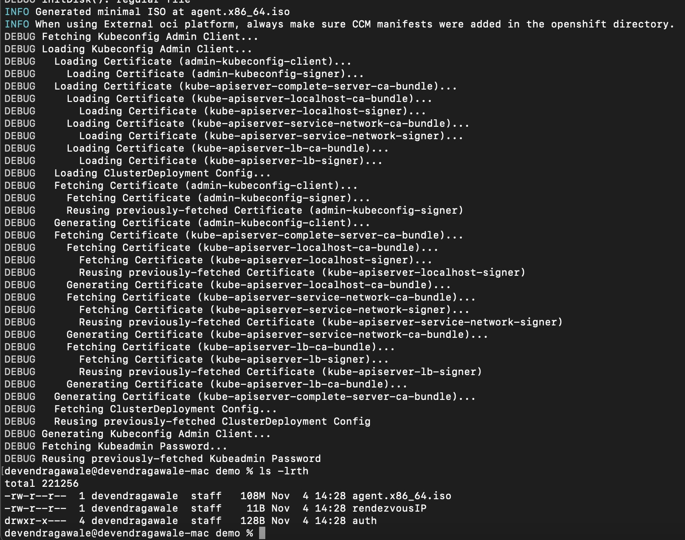

The command will generate the agent ISO along with an **auth** directory. This directory will contain the following important files: 


- **kubeconfig** – This file is used to authenticate and configure access to the OpenShift cluster.
- **kubeadmin-password** – This file contains the initial password for the kubeadmin user to access the cluster.
- **rendezvousIP** – This file contains the IP address specified in the agent-config.yaml file, which is used for agent communication.

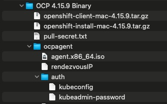

   

### 5. Create Custom Image in OCI

1. Login to OCI console and upload the ISO file to OCI Object Storage bucket.
2. Once the upload is successful, create a custom image using **Import image** option. Select **RHEL** Operating system and **QCOW2** image type while importing the ISO. Levae the default selection for Launch mode as **Paravirtualized mode**.  Refer to the screenshot below.

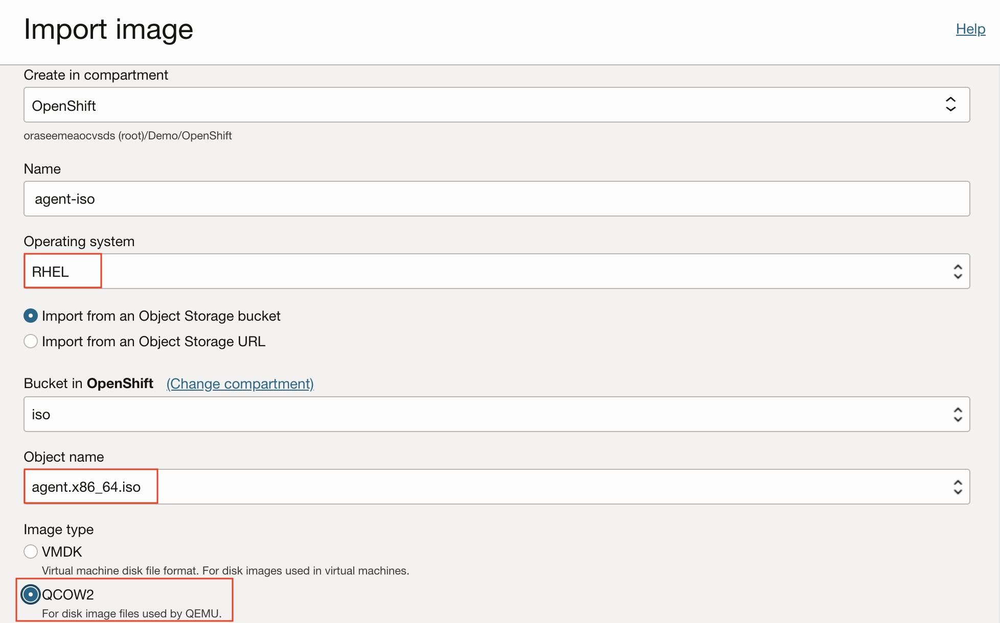

3. Once the image is successfully imported, click on **Edit Image Capabilities** and unselect **BIOS** option. Leave the remaining options as default.

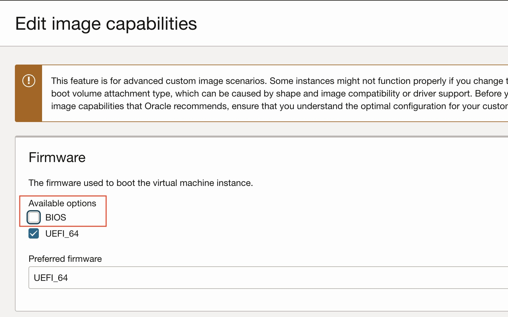

### 6. Provision Control Plane Nodes in OCI

1. Create first OCI instance using custom image created in Step 5. Make sure to use the following setting for the control plane VM.
   - Select the flex shape and assign the recommended resources for OCPU and Memory.
   - Select the VCN and Private subnet created in Step 3.
   - Under Primary VNIC IP addresses - Select **Manually assign private IPv4 address** option and provide the IPv4 address of a **rendezvousIP** supplied in **agent-config.yaml** file. Refer to the sample screenshot below.

   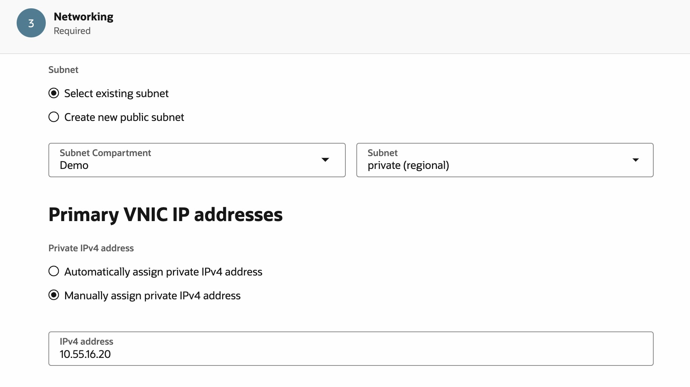

   - Click on **Use network security groups to control traffic** under Advanced options and select the controlplane NSG. Refer to the sample screenshot below.

   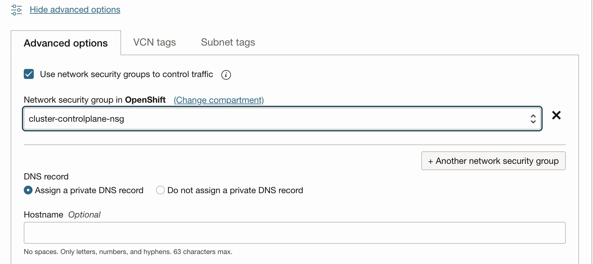

   - Do not add SSH key as it is already embedded in the ISO supplied in **install-config.yaml** file.
   - Modify the boot volume size and VPU based on the Red Hat recommended guidelines. Refer to the example screenshot below
  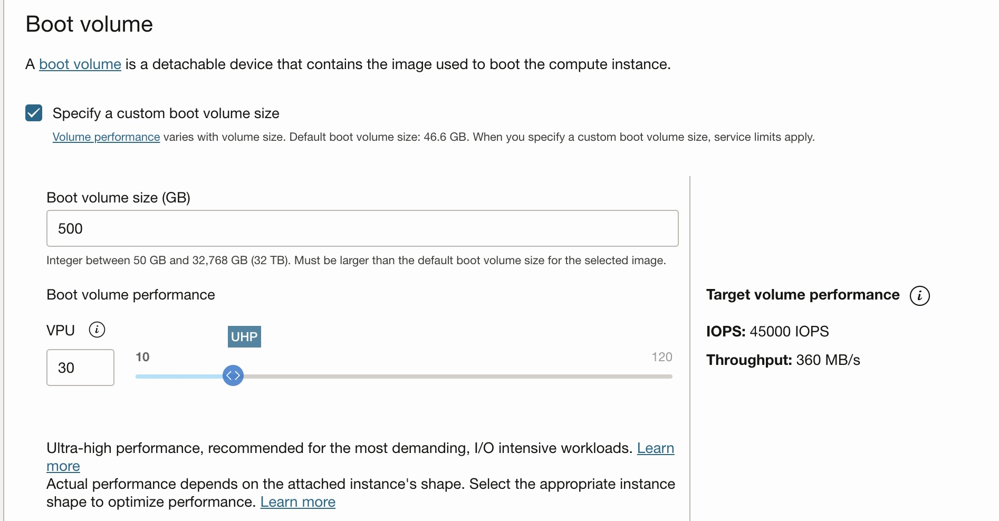
   - Modify the tag namespace in Management tab under advanced option. Use controlplane specific tag namespace, key and a value. Refer to the sample screenshot below.

   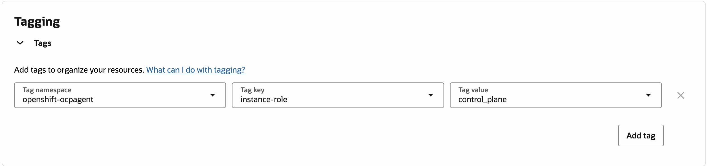

### 7. Add Control Plane node to the API Apps and Int Load Balancer 

1. In this step, you will be updating the OCI Apps load balancer with new control plane to ensure successful communication with the API listener load balancer. To do that, perform the below tasks:
- Navigate to Hamburger Menu -> Networking -> Virtual Cloud Network(VCN)-> Load Balancer and select **####-openshift_api_apps_lb** load balancer. 
- Select the API backend sets -> Backends and Click on **Add backends** to the and add the first control plane node provisioned in Step 6. Refer to the sample screenshot below

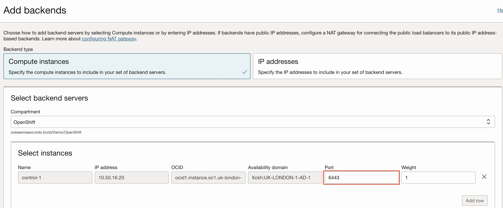

- Repeat the steps for HTTP and HTTPS backend sets. 

2. In this step, you will be updating the OCI API Internal load balancer with new control plane node. follow the same procedure as described in step 7.1 and update the **####-openshift_api_int_lb**
3. Create and Update **api_backend**,  **infra-mcs** and **infra-mcs_2** with ports **6443**, **26623** & **22624** respectively. 


### 8. Install OpenShift Cluster 

In this step, you will install the OpenShift from the client machine where you have extracted the **openshift-install** binaries along with **pull secret** and **kubectl** (Step 2).

1. Run the following command to install the OpenShift cluster

```
openshift-install agent wait-for install-complete --log-level debug

```
Find below the sample screenshot of the command output. 

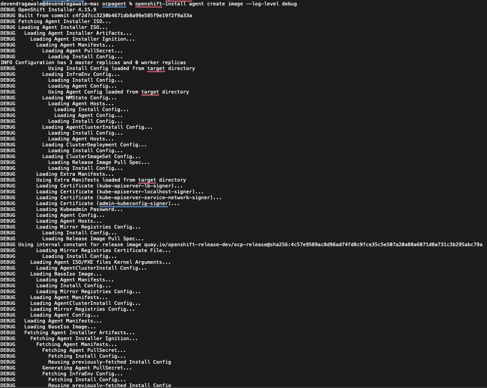 

2. Now, login to the control plane node with the **rendezvous IP** and run the following command to check the logs. 

```
journalctl -u assisted-service.service 
```


**OR** 

```
journalctl -l 

```

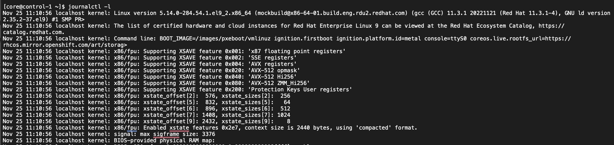 

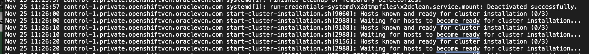 

3. Create two additional control plane VMs by following the same procedure you did for Control Plane VM1. 

**Note**: You can use DHCP IP address for the additional Control Plane VMs 

4. Once all the control plane VMs are up, add them to the API Apps and API Int Load balancer. 
5. Monitor the progress of **journalctl** command output and logs from openshift-install command. 
6. Once the installation is successful, you will see the **Installation Completed** message as an output of the journalctl command. Refer to the screenshot below.

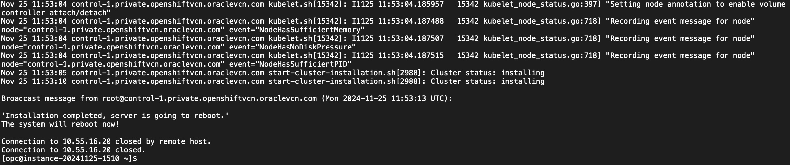 

### 9. Validate OpenShift Installation

1. Navigate to your working directory to identify **auth** directory which contains the two files **kubeadmin-password** and **kubeconfig** 
2. Open a browser and access the the openshift console using load balancer DNS name. Refer to the sampel screenshot below. The username is **kubeadmin** and password can be obtained from **kubeadmin-password** file.

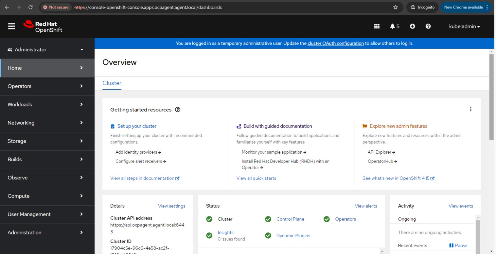

3. Validate the status panel. The status should look green and there should not be any alerts. 
4. Navigate to the **Compute**-> **Nodes**. The three control plane nodes should appear in **Ready** state without any error messages. Refer to the screeshot below. 

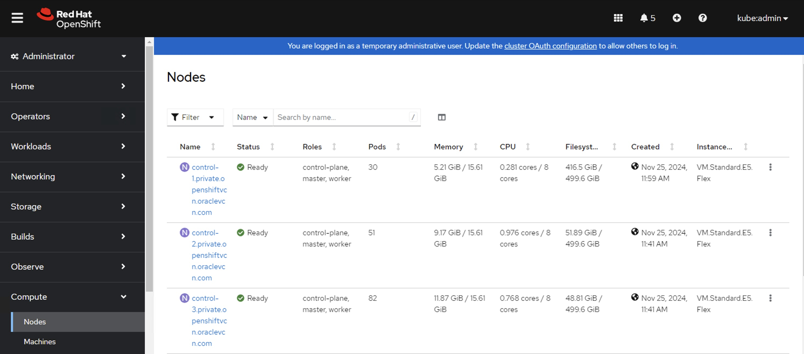


**Note:** Follow the Part 2 of this Tutorial series to complete the OpenShift installation. 
