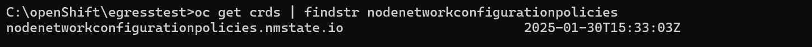
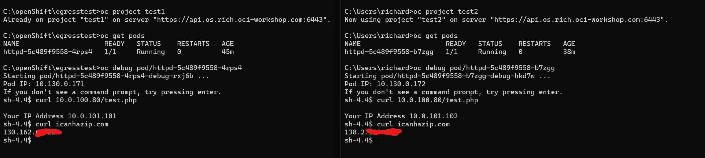

# OCI-OpenShift-Floating-EgressIP

If you want to use a fixed egress IP address in openshift for your pods, you need to make sure that the egress IP is "floatable" across your worker nodes. 
In case the host fails that was assigned to the EgressIP. 

Traditionally this is difficult to do in a public cloud using Layer 3 networking, as the cloud control plane controls
the assigned IP Addresses and another instance can not just reclaim an IP address in case of failure. 

The Oracle Cloud (OCI) does not just support Layer 3 network subnets, but also has the capability to support Layer 2 VLANs.
In these VLANs any instance can claim IP addresses using normal ARP. Initially this VLAN concept was designed for use with 
the Oracle Cloud VMware Solution, but it can also be used for normal OCI Compute Instances (VMs and Bare metal servers).
https://docs.oracle.com/en-us/iaas/Content/VMware/Tasks/ocvsmanagingl2net.htm

We can use these VLANs for our OpenShift worker nodes as secondary NIC interfaces and route the EgressIP traffic over.


## Create VLAN and assign addition vNIC(s) to worker nodes attached to the VLAN in OCI

1. Create a VLAN and assign it a CIDR range. The first available address in this CIDR range will be used by OCI for the gateway service.
All other addresses are free to be used. There is no DHCP service in the VLAN.

In this example, we have created a VLAN with the CIDR: 10.0.101.0/24. Hence the default gateway of this segment will be 10.0.101.1

2. On each worker node VM add a vNIC attached to the created VLAN

**TIP: Automate Step 1 and Step 2**: Use the provided [vlan.tf](tf_Create_and_Add_VLAN/vlan.tf) file to automate the creation of the VLAN and the assignment of vNICs to worker nodes. This Terraform script will handle the setup for you, ensuring that the VLAN is created with the specified CIDR range and that each worker node VM has a vNIC attached to the created VLAN.


3. Login to one of the worker nodes and confirm a 2nd NIC is visible and note down the device name (In this example it is ens5)

```
oc debug node/[your node name]
chroot /host
ifconfig
```


## Setup IP configuration for worker nodes for the new VLAN vNICs

1. Install openshift-nmstate operator via the operator hub. After installation, click on 'create instance' on the operator and click 'create'

Check if the NodeNetworkConfigurationPolicy CRD exists

linux: 

```oc get crds | grep nodenetworkconfigurationpolicies```

windows: 

```oc get crds | findstr nodenetworkconfigurationpolicies```



2. Create node_config.yaml file:

You can create 1 file per worker node or just add multiple worker nodes into one file. The example below show the configuration of 2 workers nodes.

**IMPORTANT:** Ensure you use the correct device name, in my example it is 'ens5', but check in your environment. Set the correct IP address and prefix. 

**IMPORTANT:** All nodes that can run worload pods must have VLAN attached to them and have an individual IP setup in this VLAN

Reminder: OCI does not provide DHCP on a VLAN, so you need to maintain assigned IP addresses yourself. You need 1 IP address per worker node and you need 1 IP address per egress IP you want to use.

The next-hop-address needs to be set to the VLANs gateway, which is the first available address in the assigned CIDR block of the VLAN. In this example this is 10.0.101.1

```
apiVersion: nmstate.io/v1
kind: NodeNetworkConfigurationPolicy
metadata:
  name: node1-ens5-vlan-static-ip
spec:
  nodeSelector:
    kubernetes.io/hostname: os-compute-1.private.openshiftvcn.oraclevcn.com
  desiredState:
    interfaces:
      - name: ens5
        type: ethernet
        state: up
        ipv4:
          enabled: true
          address:
            - ip: 10.0.101.11
              prefix-length: 24
          dhcp: false
        mtu: 9000
    routes:
      config:
        - destination: 0.0.0.0/0
          next-hop-address: 10.0.101.1
          next-hop-interface: ens5
          metric: 500
---
apiVersion: nmstate.io/v1
kind: NodeNetworkConfigurationPolicy
metadata:
  name: node2-ens5-vlan-static-ip
spec:
  nodeSelector:
    kubernetes.io/hostname: os-compute-2.private.openshiftvcn.oraclevcn.com
  desiredState:
    interfaces:
      - name: ens5
        type: ethernet
        state: up
        ipv4:
          enabled: true
          address:
            - ip: 10.0.101.12
              prefix-length: 24
          dhcp: false
        mtu: 9000
    routes:
      config:
        - destination: 0.0.0.0/0
          next-hop-address: 10.0.101.1
          next-hop-interface: ens5
          metric: 500
---

```

3. Apply the configuration:
```
oc apply -f node_config.yaml
```

4. enable ipForwarding to the network.operator

run
```
oc edit network.operator
```

add the line: "ipForwarding: Global"  directly after the gatewayConfig line

```
			  defaultNetwork:
			    ovnKubernetesConfig:
			      egressIPConfig: {}
			      gatewayConfig:
			        ipForwarding: Global
```

The Opsnshift environment and its worker nodes are now setup correctly to use the VLANs and have the egressIP(s) float on it.

## Setup EgressIP(s) and assign them to namespaces

## Egress Labels 
We first need to allow the hosts you want to use as egress controllers. We can do this by assigning them
the correct k8s label:

```
oc get nodes --show-labels | grep egress
oc label node <node-name> k8s.ovn.org/egress-assignable=true
```

Ensure you have set the egress-assignable=true label to all the hosts you have connected to the VLAN(s)

## Namespaces
Lets create 2 example namespaces, each with it's own deployement in it and a label called egress.

```
oc new-project test1
oc label namespace test1 egress=egress_ip1
oc new-app httpd

oc new-project test2
oc label namespace test2 egress=egress_ip2
oc new-app httpd
```

We can not create an egressip config file and apply it to the OpenShift cluster.
Example egressip.yaml

```
apiVersion: k8s.ovn.org/v1
kind: EgressIP
metadata:
  name: egressips-oci-vlan-01
spec:
  egressIPs:
  - 10.0.101.101
  namespaceSelector:
    matchLabels:
      egress: egress_ip1
---
apiVersion: k8s.ovn.org/v1
kind: EgressIP
metadata:
  name: egressips-oci-vlan-02
spec:
  egressIPs:
  - 10.0.101.102
  namespaceSelector:
    matchLabels:
      egress: egress_ip2
```

Create the above egressip.yaml and apply to your cluster
```
oc apply -f egressip.yaml
```

You can not check if the EgressIPs are running and from what node the out going traffic goes.
```
oc get egressip
```


Having completed this setup, the 2 projects will both now have a unique fixed EgressIP. The workernode routing the Egress traffic can now fail over to any other worker node fully automatically.

## Having Public IP addresses for the EgressIP

Using the external access feature on the VLAN in OCI, you can assign each private IP Address to a Public IP Address. Do make sure that the VLAN has a Internet Gateway service (not NAT Gateway)


Now when you pods communicate with resources on the internet, per namespace you will have different source public IP Addresses as well.



## Known limitation

The amount of VNICs attached to a compute instance (worker node) is tied to the size of the Compute instance: https://docs.oracle.com/en-us/iaas/Content/Compute/References/computeshapes.htm#vm-standard

If you want to connect to multiple VLANs, keep this limit in mind. There is no restriction to how many EgressIPs you can use within a VLAN. 


