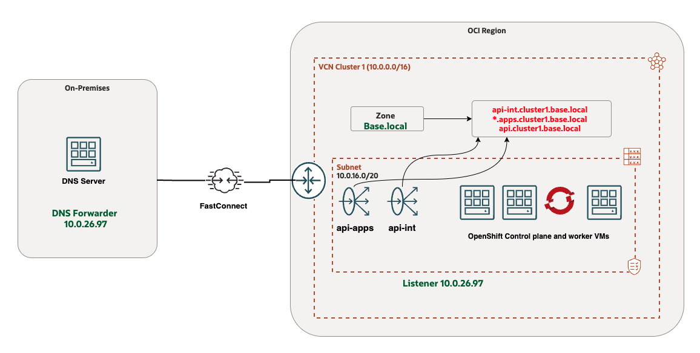
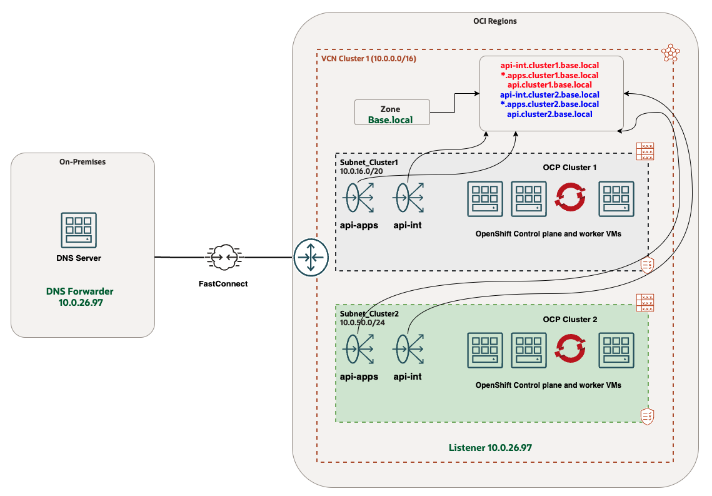
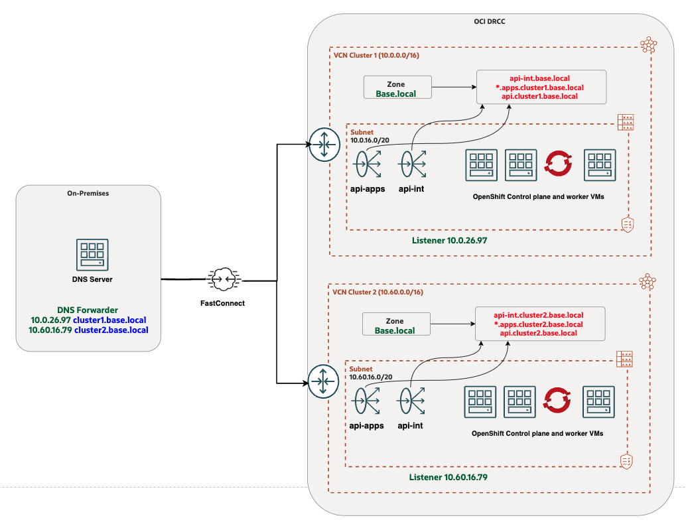
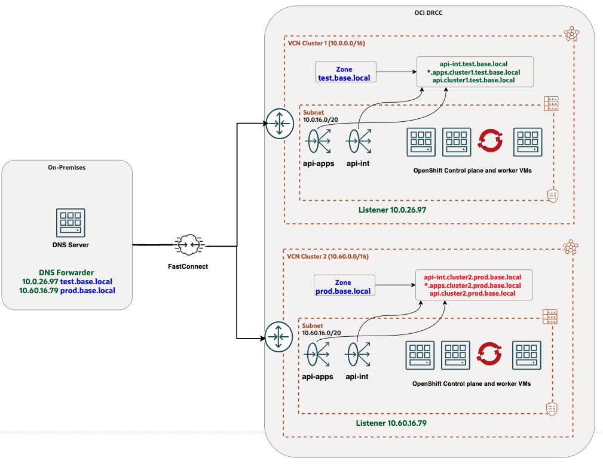

# Introduction

A customer is deploying multiple OpenShift Container Platform (OCP) clusters across Oracle Cloud Infrastructure (OCI) regions, requiring a common base domain architecture instead of unique domains per cluster. This article evaluates design options, focusing on DNS integration, VCN isolation, and on-premises accessibility.

Reviewed: 10.04.2025

## Key Requirements

- Deploy multiple OCP clusters across OCI regions with a common base domain.
- Ensure accessibility from on-premises datacenters with DNS forwarding.
- Integrate with existing Landing Zone (LZ) design.
- Evaluate single VCN vs. dedicated VCN per cluster approaches.

# Core DNS Architecture in Default OpenShift Deployment in OCI

## Key DNS Components

**1. Base Domain Zone**
- The Terraform script automatically provisions a DNS zone in the VCN using the supplied base domain (e.g., base.local in the example architecture below).
- This zone contains critical records for cluster operations:
  - api.<base.domain> → Points to the API load balancer
  - *.apps.<base.domain> → Points to the Ingress/console load balancer
  - api-int.<base.domain> → Points to the Internal API endpoints

**2. On-Premises Integration**
- Access from corporate networks is enabled via conditional DNS forwarding to a VCN-based listener. The listener IP address in this example is 10.0.26.97.

## Problem Statement

A single domain name cannot resolve to multiple listener IP addresses in standard DNS configurations. The core challenge is implementing a common base domain across multiple clusters while resolving these technical constraints through either:

- A single VCN architecture (with its inherent limitations), or
- A dedicated VCN approach (with its additional complexity)

# Architecture Options and Proposed Solution

To meet the customer's requirements, we have assessed two distinct architectural approaches:
1. Consolidated VCN Model: A single shared VCN hosting all OCP clusters
2. Isolated VCN Model: Dedicated VCNs for each individual OCP cluster

This evaluation compares the trade-offs between these deployment strategies in terms of DNS management, network isolation, and operational complexity and also provides the recommended options.

## Single VCN for all OCP clusters (*Not Recommended*)

### DNS Conditional Forwarding With the Common Base Domain

**Implementation**:

- Single VCN with a base domain zone.
- Dedicated subnets for each OCP cluster.
- All cluster records stored in the same zone file.
- Shared conditional forwarder IP.

The diagram below illustrates the architecture where a single VCN contains multiple subnets, each dedicated to an OpenShift cluster.

**Challenges:**
- Zone conflicts during new cluster deployment, requiring manual intervention.
- Manual record updates are needed for subsequent clusters in the existing zone. 
- Does not meet isolation requirements for most environments.

**Benefits:**
- Single base domain for all OCP clusters
- All cluster FQDNs are recorded in a single zone file. Less overhead in maintaining multiple zone files. 
- Uses a single IP address for DNS conditional forwarding.

**Use Case -** Only for non-production, low-scale environments. 

## Dedicated VCN for each OCP clusters (*Recommended*)

### Recommended Option 1: DNS Conditional Forwarding with Unique Subdomains

**Implementation**:

1. Create dedicated VCN with common base domain zone for each OCP cluster
2. Create listener in each VCN for the base domain
3. Configure DNS conditional forwarding using unique subdomains (e.g., cluster1.base.local, cluster2.base.local from the example architecture below)

The diagram below shows the architecture where each OCP cluster has a dedicated VCN with a common base domain, but DNS conditional forwarding is managed using unique subdomains.

**Benefits:**
- Maintains a common base domain for all OCP clusters.
- Enables conditional forwarding per domain with unique listener IPs.

### Recommended Option 2 - DNS Conditional Forwarding With Unique Base Domain

**Implementation**

1. Dedicated VCN per cluster with unique base domains (e.g., test.base.local, prod.base.local are the example shown in the diagram below)
2. Maintain unique zone files for each environment
3. Configure DNS conditional forwarding using these unique base domains

The diagram below illustrates the architecture where each cluster has a dedicated VCN and a unique base domain.

# Conclusion

Implementing a common base domain for multiple OpenShift clusters across OCI regions requires careful DNS and network architecture planning. The recommended approach combines:
1. Dedicated VCN per OCP cluster
2. DNS conditional forwarding using either:
  - Unique subdomains (**cluster.base domain**)
  - Unique base domains (**environment.base domain**)

This solution provides:

- Clear segregation between clusters
- Consistent naming strategy
- Simplified DNS management
- Future-proofing for application publishing requirements.
