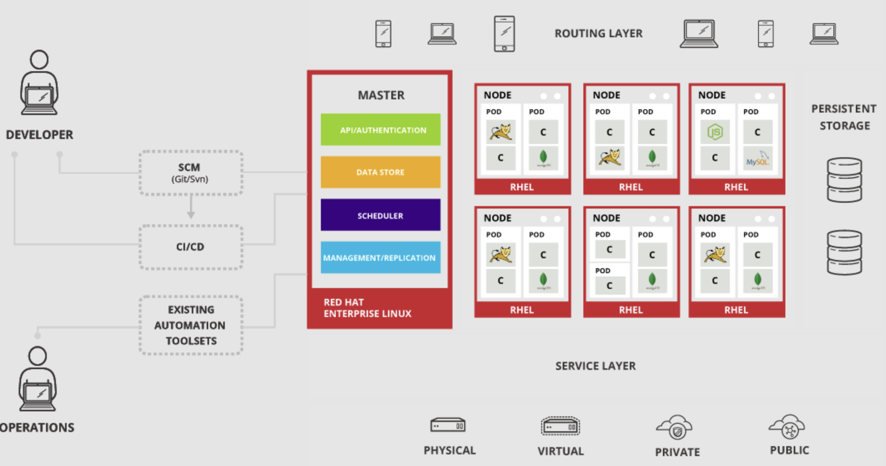
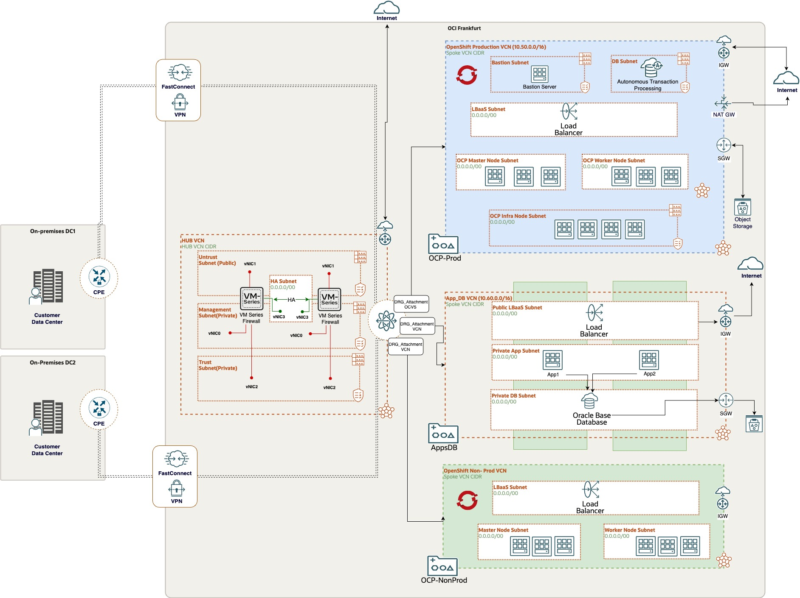
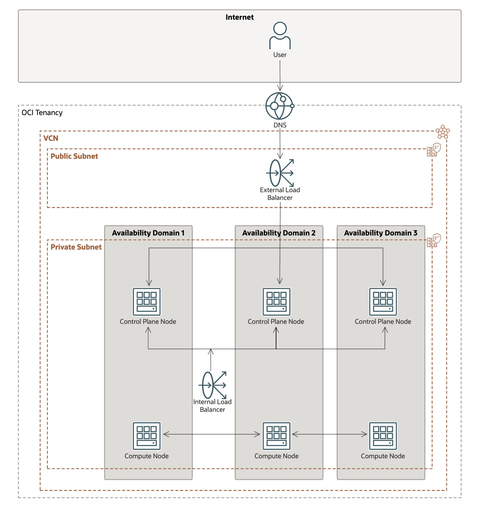
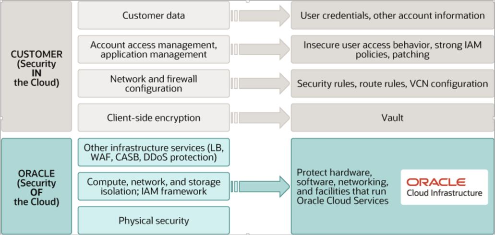
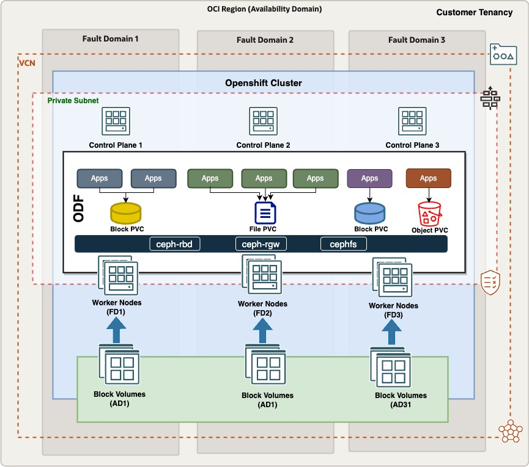

# Document Control

## Version Control

| Version | Author       | Date             | Comment         |
|:--------|:-------------|:-----------------|:----------------|
| 1.0     | Name Surname | January 01, 2025 | Initial version |

## Team

| Name         | E-Mail              | Role                                      | Company |
|:-------------|:--------------------|:------------------------------------------|:-|
| Name Surname | example@example.com | Cloud Virtualization Solutions Specialist | Oracle |
| Name Surname | example@example.com | Accound Cloud Engineer                    | Oracle |

## Abbreviations and Acronyms

| Term | Meaning                                 |
|:-----|:----------------------------------------|
| OCI  | Oracle Cloud Infrastructure             |
| VCN  | Virtual Cloud Network                   |
| SL   | Security List                           |
| NSG  | Network Security Group                  |
| RT   | Route Table                             |
| CMP  | Compartment                             |
| IGW  | Internet Gateway                        |
| NGW  | NAT Gateway                             |
| SGW  | Service Gateway                         |
| VM   | Virtual Machine                         |
| BM   | Bare Metal                              |
| OCP  | OpenShift Container Platform            |
| ODF  | OpenShift Data Foundation               |
| RH   | Red Hat                                 |
| DRCC | Dedicated Region Cloud at Customer      |
| C3   | Compute Cloud @ Customer                |

## Document Purpose

This document outlines a high-level solution definition for deploying the Red Hat OpenShift Container Platform on Oracle Cloud. It provides an overview of the current state, the desired future state, and a potential high-level project scope and timeline for the Lift initiative.

Throughout this document, the term "Workload" refers to the complete technical solution designed for a customer (you) within the scope of a single engagement. Details about the workloads are covered in the section [Workload Requirements and Architecture](#workload-requirements-and-architecture).

As a living document, this content will evolve over the course of the engagement, with additional sections added as needed. The final version will serve as a comprehensive handover to the Lift team.

# Business Context

*Example:*

A Company Making Everything, headquartered in Frankfurt, Germany, is the largest e-commerce company, employing 2000 individuals at this location and generating millions in annual sales. The organization operates a network of subsidiaries that contribute to its overall revenue.

An existing Oracle Cloud Infrastructure (OCI) customer, the company currently utilizes various OCI services, including network, compute, storage, and databases, within the OCI Frankfurt Region. Their on-premises infrastructure hosts containerized workloads on the Red Hat OpenShift Container Platform. As part of their data center (DC) exit strategy, they are seeking Red Hat OpenShift support on OCI to facilitate the migration of these workloads and potentially expand their existing OpenShift environment during the transition.

The company’s mission-critical production and test/development workloads are hosted on a containerized platform, necessitating a like-for-like solution in OCI that meets their stringent availability and performance requirements. To ensure minimal service disruption, they aim for a quick and seamless migration of their containerized workloads to OCI before their current data center contract expires. OpenShift on OCI provides a customer-managed, flexible, highly scalable, and cost-effective platform to host these critical workloads.

Additionally, the company is exploring OCI’s advanced capabilities to modernize their workloads with Artificial Intelligence (AI) by leveraging OCI’s core GPU infrastructure integrated with Red Hat OpenShift.

## Executive Summary

## Workload Business Value

*Example:*

A Company Making Everything has launched a strategic program for FY25 called EXAMPLE, focusing on application modernization and leveraging AI to drive innovation. A key objective of this initiative is to reduce IT estate spending by 15% during the fiscal year while investing in new technologies. Oracle can support this transformation by providing cost-effective solutions through OCI's next-generation platform integrated with Red Hat's container platform, enabling the company to optimize IT costs while fostering innovation.

The IT department at A Company Making Everything aims to empower other lines of business (LoBs) by leveraging technology as a core pillar. This approach enables faster time-to-market for applications and business solutions, helping the company maintain its competitive edge.

OpenShift on OCI is a customer-managed containerized platform that combines the strengths of both OCI and Red Hat, offering a flexible, high-performance infrastructure for hosting mission-critical containerized workloads. Key benefits include:

- **Seamless Migration:** Customers can easily migrate microservices and containerized workloads from their existing OpenShift platform to OpenShift on OCI.
- **Business Continuity and Disaster Recovery:** The platform enables the creation of business continuity plans and disaster recovery environments for containerized workloads in OCI.
- **Support for AI Modernization:** OpenShift on OCI provides a robust foundation for developing AI models and embracing modern application development.
- **Global Deployment Options:** OCI offers diverse deployment choices, including Dedicated Region Cloud at Customer (DRCC), C3, and commercial OCI regions worldwide.

Since OpenShift remains consistent across environments, no additional effort is required to migrate mission-critical applications, build disaster recovery setups, or implement new Greenfield projects. OpenShift on OCI empowers customers to modernize, optimize, and innovate, all within a unified and cost-effective platform.

# Workload Requirements and Architecture

## Overview

Oracle provides comprehensive support in planning, architecting, prototyping, and managing OpenShift implementations on Oracle Cloud for various use cases. These include greenfield implementations to modernize workloads, migration of containers from existing OpenShift platforms, and establishing disaster recovery environments.

For A Company Making Everything, Oracle will assist in designing and deploying the target OpenShift architecture in OCI, tailored to the company’s specific business and technical requirements. Oracle’s expertise will ensure the successful setup of the environment and the necessary ecosystem around OpenShift on OCI. The implementation will take place in Oracle Cloud Infrastructure in the [INSERT REGION] region.

**Thus, the objectives of this document are to:**

1.  **Assess the Existing Architecture:** Collaboratively review the current architecture, align it with relevant Oracle OCI services focused on Red Hat OpenShift, and propose a high-level, tailored OpenShift architecture design within OCI.
2.  **Define Oracle Cloud Lift Services Scope:** Outline the scope of Oracle Cloud Lift Services to assist A Company Making Everything in setting up the required infrastructure and deploying OpenShift based on the agreed-upon target cloud architecture in OCI.

The primary purpose of this document [Document Purpose]{#document-purpose} is to outline the high-level objectives for successfully implementing Red Hat OpenShift on Oracle Cloud Infrastructure (OCI). These objectives include:

- **Architecture Guidelines:** Provide architectural guidance tailored to A Company Making Everything’s requirements for the target OCI cloud architecture.
Solution Integration: Ensure the solution aligns seamlessly with A Company Making Everything’s existing OCI ecosystem.
- **Comprehensive OpenShift Aspects:** Address all OpenShift-related considerations, including security, networking, compute, and storage, required to implement the target cloud architecture.
- **High Availability and Resilience:** Define OpenShift-related aspects for ensuring high availability, workload uptime, and storage replication to meet operational requirements.
- **Implementation:** Implement OpenShift on OCI based on the agreed installation methodology, supported by a robust design and architecture.
LIFT/Consulting Services Scope: Define the scope of Oracle LIFT or consulting services required to support A Company Making Everything’s workload migration and deployment in OCI.

## Non-Functional Requirements

### Regulations and Compliance

At the time of this document's creation, no specific regulatory or compliance requirements have been identified. However, any data sovereignty needs can be addressed through Oracle Cloud's Dedicated Region Cloud at Customer (DRCC) or the EU Sovereign Cloud, depending on A Company Making Everything's location and business requirements.  

### Environments

| Environment | Target Size of the OCP Cluster | Location | Scope           |
|:------------|:-------------------|:---------|:----------------|
| ENV NAME    | 100%               | LOCATION | Workload - Lift |
| ENV NAME    | 100%                | LOCATION | Workload - Lift |

### High Availability and Disaster Recovery Requirements

Below high availability and disaster recovery requirements have been identified

**Control Plane High Availability:**
  - At least three master nodes to ensure redundancy and fault tolerance for the control plane.
  - Use an external load balancer to distribute API traffic across the master nodes.

**Application Node High Availability:**
  - Multiple worker nodes to distribute workloads and prevent single points of failure.

**Storage Redundancy:**
  - Highly available storage solutions, such as OpenShift Data Foundation or OCI Block Storage or Third party like Portworx.
  - Dynamic storage provisioning to handle storage needs seamlessly.

**Network Availability:**
  - Redundant networking paths and use of a Load Balancer to manage ingress traffic.

**Disaster Recovery::**
  - Backup and DR for etcd, application data, and configuration.

**Scaling::**
  - Pod autoscaling to manage workload demands dynamically.
  - OCP cluster autoscaling for worker nodes to handle peak loads efficiently.

### Clusrter monitoring and scaling requirements

**Cluster Monitoring and Self-Healing::**
  - Monitoring and alerting for OpenShift in OCI.
  - Automated failover and self-healing mechanisms.

### Security Requirements

At the time of this document creation, no security requirements have been specified.

## Current State Architecture

The current state architecture covers the current OpenShift architecture.

### Current State Red Hat OpenShift Architecture

A Company Making Everything currently operates its environment in a data center located in [DC LOCATION], utilizing [HARDWARE MODELS] infrastructure. The environment is powered by VMware vSphere Hypervisor (ESXi) to host Red Hat OpenShift cluster nodes as virtual machines (VMs).

**The Current OpenShift Clusters consists of:**

-   RH OpenShift cluster running with 4.XX version
    -  3 dedicated master nodes for control Plane
    -  3 worker nodes for the pods and containers
-   Storage architecture
    - OpenShift Data foundation
    - Persistent Volumes in RWO, RWX access modes
-   Image registry
-   Monitoring using Prometheus and Grafana.

Below is the current high-level architecture of the customer's on-premises OpenShift environment.

**Resource allocation for the OpenShift Clusters:**

| Environment | # Master Nodes | # Worker Nodes | CPU Per Node | Memory GB Per Node | Storage GB Per Node | Shared Storage in GB | Scope |
|:------------|:---------------|:---------------|:-------------|:-------------------|:--------------------|:---------------------|:-|
| ENV NAME    | 3              | 4              | 8            | 32                 | 300                 | 1024                 | Migrate |
| ENV NAME    | 3              | 3              | 4            | 24                 | 200                 | 500                  | GreenField |

**Operating Systems:**

- RH Enterprise Linux
- RH Core OS

**Database Systems:**

- Oracle Databases for containers
- PosgreSQL DB  

**Red Hat Licenses**

- Red Hat OpenShift Platform Plus

## Future State Architecture

### Mandatory Security Best Practices

The safety of the A Company Making Everything's Oracle Cloud Infrastructure (OCI) environment and data is the A Company Making Everything’s priority.

The following table of OCI Security Best Practices lists the recommended topics to provide a secure foundation for every OCI implementation. It applies to new and existing tenancies and should be implemented before the Workload defined in this document will be implemented.

Workload-related security requirements and settings like tenancy structure, groups, and permissions are defined in the respective chapters.

Any deviations from these recommendations needed for the scope of this document will be documented in the chapters below. They must be approved by A Company Making Everything.

A Company Making Everything is responsible for implementing, managing, and maintaining all listed topics.

<table style="width:25%;">
<colgroup>
<col style="width: 2%" />
<col style="width: 2%" />
<col style="width: 19%" />
</colgroup>
<thead>
<tr class="header">
<th>CATEGORY</th>
<th>TOPIC</th>
<th>DETAILS</th>
</tr>
</thead>
<tbody>
<tr class="odd">
<td>User Management</td>
<td>IAM Default Domain</td>
<td>
Multi-factor Authentication (MFA) should be enabled and enforced for every non-federated OCI user account.

<ul>
<li>For configuration details see <a href="https://docs.oracle.com/en-us/iaas/Content/Identity/mfa/understand-multi-factor-authentication.htm">Managing Multi-Factor Authentication</a>.</li>
</ul>

In addition to enforcing MFA for local users, Adaptive Security will be enabled to track the Risk Score of each user of the Default Domain.

<ul>
<li>For configuration details see <a href="https://docs.oracle.com/en-us/iaas/Content/Identity/adaptivesecurity/overview.htm">Managing Adaptive Security and Risk Providers</a>.</li>
</ul></td>
</tr>
<tr class="even">
<td></td>
<td>OCI Emergency Users</td>
<td>
A maximum of <strong>three</strong> non-federated OCI user accounts should be present with the following requirements:

<ul>
<li>Username does not match any username in the Customer’s Enterprise Identity Management System</li>
<li>Are real humans.</li>
<li>Have a recovery email address that differs from the primary email address.</li>
<li>User capabilities have Local Password enabled only.</li>
<li>Has MFA enabled and enforced (see IAM Default Domain).</li>
</ul></td>
</tr>
<tr class="odd">
<td></td>
<td>OCI Administrators</td>
<td>
Daily business OCI Administrators are managed by the Customer’s Enterprise Identity Management System. This system is federated with the IAM Default Domain following these configuration steps:

<ul>
<li>Federation Setup</li>
<li>User Provisioning</li>
<li>For configuration guidance for major Identity Providers see the OCI IAM Identity Domain tutorials.</li>
</ul></td>
</tr>
<tr class="even">
<td></td>
<td>Application Users</td>
<td>Application users like OS users, Database users, or PaaS users are not managed in the IAM Default Domain but either directly or in dedicated identity domains. These identity domains and users are covered in the Workload design. For additional information see <a href="https://docs.oracle.com/en-us/iaas/Content/cloud-adoption-framework/iam-security-structure.htm">Design Guidance for IAM Security Structure</a>.</td>
</tr>
<tr class="odd">
<td>Cloud Posture Management</td>
<td>OCI Cloud Guard</td>
<td>
OCI Cloud Guard will be enabled at the root compartment of the tenancy home region. This way it covers all future extensions, like new regions or new compartments, of your tenancy automatically. It will use the Oracle Managed Detector and Responder recipes at the beginning and can be customized by the Customer to fulfill the Customer’s security requirements.

<ul>
<li>For configuration details see <a href="https://docs.oracle.com/en-us/iaas/cloud-guard/using/part-start.htm">Getting Started with Cloud Guard</a>. Customization of the Cloud Guard Detector and Responder recipes to fit the Customer’s requirements is highly recommended. This step requires thorough planning and decisions to make.</li>
<li>For configuration details see <a href="https://docs.oracle.com/en-us/iaas/cloud-guard/using/part-customize.htm">Customizing Cloud Guard Configuration</a></li>
</ul></td>
</tr>
<tr class="even">
<td></td>
<td>OCI Vulnerability Scanning Service</td>
<td>
In addition to OCI Cloud Guard, the OCI Vulnerability Scanning Service will be enabled at the root compartment in the home region. This service provides vulnerability scanning of all Compute instances once they are created.

<ul>
<li>For configuration details see <a href="https://docs.oracle.com/en-us/iaas/scanning/home.htm">Vulnerability Scanning</a>.</li>
</ul></td>
</tr>
<tr class="odd">
<td>Monitoring</td>
<td>SIEM Integration</td>
<td>Continuous monitoring of OCI resources is key for maintaining the required security level (see <a href="#regulations-and-compliances-requirements">Regulations and Compliance</a> for specific requirements). See <a href="https://docs.oracle.com/en-us/iaas/Content/cloud-adoption-framework/siem-integration.htm">Design Guidance for SIEM Integration</a> to implement integration with the existing SIEM system.</td>
</tr>
<tr class="even">
<td>Additional Services</td>
<td>Budget Control</td>
<td>
OCI Budget Control provides an easy-to-use and quick notification on changes in the tenancy’s budget consumption. It will be configured to quickly identify unexpected usage of the tenancy.

<ul>
<li>For configuration details see <a href="https://docs.oracle.com/en-us/iaas/Content/Billing/Tasks/managingbudgets.htm">Managing Budgets</a></li>
</ul></td>
</tr>
</tbody>
</table>

### OCI Secure Landing Zone Architecture for OpenShift

The OpenShift architecture heavily relies on core OCI infrastructure services, including compute, storage, and networking, and adheres to the recommended guidelines for implementing the Oracle Enterprise Landing Zone v2 architecture.

To ensure best practices for integrating the OCI landing zone with the OpenShift architecture, refer to the guidelines provided in the [Oracle Enterprise Landing Zone v2 Architecture](https://docs.oracle.com/en-us/iaas/Content/cloud-adoption-framework/landing-zone-v2.htm)

The sample Landing Zone architecture for OpenShift, as depicted in the diagram below, demonstrates the application of security guidelines at the compartment level. This includes configuring users, groups, and the necessary IAM policies to ensure proper segregation between various OpenShift Container Platform (OCP) clusters and other OCI resources. 

OCI provides complete automation for deploying OpenShift clusters using the Assisted Installation method. With this approach, Terraform scripts automatically provision the OpenShift infrastructure resources within a dedicated VCN and compartment, ensuring alignment with OCI security best practices and Landing Zone guidelines. The link to the TF resource manager stack can be found here [OCI OpenShift Quickstart](https://github.com/oracle-quickstart/oci-openshift) 

### OpenShift Architecture in OCI

Red Hat OpenShift Container Platform is a cloud-based Kubernetes container platform. Red Hat, in partnership with OCI, supports running cluster workloads on the OCI platform. Cluster infrastructure consists of several compute instances running Red Hat Enterprise Linux CoreOS (RHCOS), along with the networking, load balancing and routing required to move network traffic in and out of the cluster.
Red Hat OpenShift 4.13 onwards is supported to run in OCI. 

High Availability architecture for OpenShift running in OCI.

The architecture has the following components:

- **Virtual Cloud Network :** Virtual cloud network (VCN) dedicated for OpenShift infra VMs/BMs. Traffic is routed to the VCN assigned to the cluster compute nodes.Within the VCN's public subnet, an external Load Balancer routes traffic to the control plane (master) nodes of the cluster, which sit within a private subnet.
- **Private Subnet :** For control plane and compute nodes.  
- **Control Plane Nodes :** OpenShift control plane VMs/BMs in a private subnet. 
- **Compute Nodes :** OpenShift Worker Nodes in private subnet
- **OCI Load Balancers :** Internal and External for Apps and Ingress traffic load balancing.
- **DNS Resolution :** Network traffic is resolved with OCI DNS. The DNS name resolution for OpenShift infrastructure components including the FQDN for Apps and Internal load balancer, load balancers, and compute nodes as follows:
- **Block Storgae :** OCI Block storgae used for boot volumes of the control plane and compute nodes. 
- **CSI Operator for Block Storgae :** Container Storage Interface (CSI) operator developed to support native integration of the OpenShift with OCI block storage to offer flexibility to create PersistentVolumes and PersistentVolumeClaims. 
- **Cloud Control Manager :** Cloud control manager (CCM) offers OCI platform integration with OpenShift. 

### OpenShift Installation Options

Oracle offers an automated path for provisioning the cluster infrastructure that uses the Red Hat Assisted Installer. We recommend this method for most users.Oracle also supports the use of Red Hat's Agent-based Installer for users who want to set up the cluster manually or using other automation tools, or for those working in a disconnected environment.

Oracle recommends the Red Hat Assisted Installer for most users, as it provides an automated and streamlined solution for provisioning cluster infrastructure.
For users who prefer a manual setup, need to use custom automation tools, or operate in disconnected environments, Oracle also supports the Agent-based Installer, offering greater flexibility to meet diverse deployment requirements. The following image provides the details on the installation options for OpenShift on OCI. 

**Assisted Installation:**
Red Hat's Assisted Installer simplifies cluster installation with an intuitive web interface available in the Red Hat Hybrid Cloud Console. This installation method requires an active internet connection, so DRCC customers opting for this approach must ensure connectivity.

The installation workflow follows these high-level steps:

- Create a Discovery ISO: Begin in the Red Hat Hybrid Cloud Console by generating the discovery ISO image.
- Provision Infrastructure on OCI: Transition to the OCI Console to provision infrastructure. This involves creating a custom Red Hat ISO image for the compute nodes and using the OCI Resource Manager service to execute a Terraform script, which sets up the necessary infrastructure resources for the cluster.
- Finalize Installation: Complete the cluster configuration and installation in the Red Hat Hybrid Cloud Console.

**Agent-Based Installation:**
Red Hat's Agent-based Installer is ideal for advanced users seeking maximum flexibility. This method requires users to manually create OCI resources via the OCI Console or leverage their own automation tools, making it more time-intensive than the Assisted Installer.

The Agent-based installation supports two approaches:
- Connected Installation: Requires an active internet connection. DRCC customers choosing this option must ensure connectivity.
- Disconnected (Air-Gapped) Installation: Designed for fully isolated environments without internet access, adhering to strict air-gap requirements.

For a detailed overview of the workflow, refer to the image provided above.

Deploying an OpenShift Container Platform cluster on OCI combines actions performed in the Red Hat Hybrid Cloud Console and actions performed in the OCI Console. This documentation details the tasks that you perform in the OCI Console, and provides an overview of the complete installation work flow involving both consoles.

The following links provides intended documentation to be used together with the Red Hat documentation in the following locations:

[OpenShift Assisted Installation](https://docs.redhat.com/documentation/openshift_container_platform/4.17/html/installing_on_oci/installing-oci-assisted-installer) 
[OpenShift Agent-based Installation](https://docs.redhat.com/documentation/openshift_container_platform/4.17/html/installing_on_oci/installing-oci-agent-based-installer) 

### OpenShift Sotrage Options 

OCI storage can be seamlessly integrated with OpenShift clusters in two primary ways:

1.	OpenShift Data Foundation (ODF): Leverage OpenShift's software-defined storage solution to manage and provision storage within the cluster.
2.	OCI Block Volumes: Utilize OCI block volumes directly through the OCI Container Storage Interface (CSI) driver, enabling efficient storage provisioning and management.

To meet the solutioning requirements of the company everything, we will use the OpenShift Data Foundation either with local mode or external mode. 

## Solution Considerations

### High Availability and Disaster Recovery

#### OCI Resilience and Recovery

OpenShift leverages OCI's core high-availability constructs, such as Availability Domains (ADs) and Fault Domains (FDs), to ensure maximum resiliency. In multi-AD regions, the OpenShift cluster control plane and compute nodes are distributed across multiple Availability Domains, while in single-AD regions, they are spread across multiple Fault Domains within the AD. This design ensures a fault-tolerant and highly resilient environment.

Each Availability Domain consists of multiple Fault Domains, further enhancing infrastructure reliability. For more information about OCI Availability Domains and Fault Domains, refer to the [OCI documentation](https://docs.oracle.com/en-us/iaas/Content/General/Concepts/regions.htm).

The details of the Oracle Cloud Infrastructure SLAs are also found in the link below. [OCI Service SLA](https://www.oracle.com/ae/cloud/sla/).

##### OpenShift High Availability

This section outlines the solution considerations for running OpenShift on OCI, with a focus on addressing key high availability (HA) requirements.

**Control Plane High Availability:** 

- Three control plane and compute nodes are deployed to ensure redundancy and fault tolerance for the control plane and worker nodes.
- Use of an external OCI load balancer to distribute API traffic across the control plane nodes.

**Application Node High Availability:**

- Minimum 3 and more compute nodes are to be deployed to distribute workloads and prevent single points of failure.
- Recommended to use OpenShift’s built-in scheduler to balance workloads across nodes.

**Storage Redundancy:**

- The Solution will leverage OCI block storage as a primary storage solution for OpenShift cluster which offers completely redundant storage in Oracle Cloud. 
- Use of an OpenShift Data Foundation or OCI Block Storage with replication, to ensure data persistence.
- The Solution will configure dynamic storage provisioning to handle storage needs seamlessly.

**Network Availability:**

- The Solution will leverage OCI's core software defined networking solution to offer resilient network infrastructure in Cloud. 
- The solution will ensure network policies are in place to support application-level isolation and redundancy.

**Scaling:**

- The solution will offer ability to horizontal pod autoscaling to manage workload demands dynamically.
- The solution will also implement cluster autoscaling for worker nodes to handle peak loads efficiently.

**Disaster Recovery:**

- The Solution will configured to set up backup and recovery mechanisms for etcd, application data, and configuration.
- The DR requirements can also be considered by deploying a disaster recovery (DR) setup using OCI regions for geographic redundancy.

#### OpenShift Monitoring requirement

**Cluster Monitoring and Self-Healing:**

- The customers can use monitoring and alerting using OpenShift’s Prometheus and Grafana stack or rely on any other third-party solution for OpenShift Monitoring. 
- The solution can be configured with automated failover and self-healing mechanisms for nodes and pods.

### Security

#### OCI - Oracle and Customer Shared Security Model

Oracle employs best-in-class, enterprise-grade security technology, and operational processes to secure cloud services. To deploy and operate your workloads securely in Oracle Cloud, you must be aware of your security and compliance responsibilities.

Oracle ensures the security of cloud infrastructure and operations, such as cloud operator access controls and infrastructure security patching. You’re responsible for configuring your cloud resources securely. The following graphic illustrates the shared security responsibility model.

#### Security Posture of Running OpenShift in OCI

**OCI Security Architecture Integration:**

- OpenShift clusters in OCI benefit from OCI’s secure-by-design architecture, including compartmentalized access and policy-based governance.
- Integration with OCI Identity and Access Management (IAM) ensures granular control over user access, groups, and roles.

**Network Security:**

- OpenShift clusters are deployed within Virtual Cloud Networks (VCNs) with custom subnet configurations to isolate workloads.
- Leverage OCI Network Security Groups (NSGs) and Security Lists to enforce strict traffic control at the subnet and instance level.
- Deploy clusters using private subnets and integrate with OCI Load Balancers for secure external access.

**Data Security:**

- Data at rest is encrypted using OCI Block Volumes or Object Storage with built-in encryption.
- End-to-end encryption for data in transit is ensured through OCI’s private connectivity options and TLS/SSL.

**OpenShift-Specific Security Features:**

- Leverage built-in OpenShift security tools, such as OpenShift Compliance Operator, to meet compliance standards like CIS and NIST.
- Use Role-Based Access Control (RBAC) within OpenShift to define and restrict access to cluster resources.
- Enable pod security policies, namespaces, and Network Policies to control workload interactions and restrict resource access.

**Integrated Threat Detection:**

- OCI’s monitoring and logging services provide visibility into OpenShift cluster activity, helping to identify and mitigate potential security threats.
- Integrate with OCI Cloud Guard for proactive risk detection and resolution across the environment.

**Image and Code Security:**

- OpenShift’s Image Registry supports scanning container images for vulnerabilities before deployment.
- Use signed images to ensure secure and trusted workloads.

**Compliance and Governance:**

OpenShift on OCI aligns with OCI’s compliance certifications (e.g., ISO, SOC, GDPR) to meet regulatory and industry standards.
Automate audit logging with OCI Logging to ensure traceability and accountability for all actions.

### Networking

The architecture has the following components:

- **Region** - An Oracle Cloud Infrastructure region is a localized geographic area that contains one or more data centers, called availability domains. Regions are independent of other regions, and vast distances can separate them (across countries or even continents). The OCI regions are interconnected using high-speed low latency network to offer Disaster Recovery capabilities to the OpenShift clusters across two regions for business continuity point of view. 

- **Virtual Cloud Network (VCN)** - A Virtual Cloud Network (VCN) is a customizable private network that you configure within an Oracle Cloud Infrastructure (OCI) region. Similar to traditional data center networks, VCNs provide full control over your network environment. You can segment a VCN into subnets, which can be configured as either regional (spanning the entire region) or availability domain-specific. Both types of subnets can coexist within the same VCN, offering flexibility for different deployment needs. Additionally, subnets can be designated as public or private, depending on the access and security requirements.

- **Security List** - For each subnet, you can define security rules to control traffic flow by specifying the source, destination, and type of traffic that is allowed in and out of the subnet. OpenShift clusters leverage Security Lists to manage subnet-level traffic for compute nodes, control plane nodes, and Load Balancers. These security rules ensure that the necessary communication channels are open while maintaining a secure and controlled environment for the cluster.

- **Network Security Group (NSG)** - Network Security Groups (NSGs) function as virtual firewalls for your cloud resources. In Oracle Cloud Infrastructure's zero-trust security model, all traffic is denied by default, and NSGs allow you to define and control network traffic within a VCN. Each NSG contains a set of ingress and egress security rules that apply only to a specified group of VNICs within a single VCN. OpenShift clusters utilize NSGs to enforce traffic control for each group of control plane and compute nodes, ensuring a secure and segmented network environment.

- **Route Table** - Route tables contain rules to route traffic from subnets to destinations outside a VCN, typically through gateways.

- **Dynamic Routing Gateway (DRG)** - The DRG is a virtual router that provides a path for private network traffic between a VCN and a network outside the region, such as a VCN in another Oracle Cloud Infrastructure region, an on-premises network, or a network in another cloud provider. 

- **VPN Connect** - VPN Connect provides site-to-site IPSec VPN connectivity between your on-premises network and VCNs in Oracle Cloud Infrastructure. The IPSec protocol suite encrypts IP traffic before the packets are transferred from the source to the destination and decrypts the traffic when it arrives.

- **FastConnect** - Oracle Cloud Infrastructure FastConnect provides an easy way to create a dedicated, private connection between your data center and Oracle Cloud Infrastructure. FastConnect provides higher-bandwidth options and a more reliable networking experience when compared with internet-based connections.

- **OCI Load Balancers** - OCI Load Balancers manage traffic for OpenShift API servers and other control plane components. They distribute incoming API requests across the control plane nodes, ensuring high availability and failover support.OCI Load Balancers manage traffic for OpenShift API servers and other control plane components. They distribute incoming API requests across the control plane nodes, ensuring high availability and failover support.

  - Public Load Balancers: Used for exposing services to the internet, allowing external users to access OpenShift applications securely.
  - Private Load Balancers: Used for internal traffic within the OCI environment, enabling secure communication between applications or internal services.

#### Network connectivity options (on-premises to OCI) - Optional 

##### IPSec VPN

The following diagram of a reference architecture shows how to set up a Virtual Private Network (VPN) to connect to a customer's on-premises network and VCN.

IPSec VPN architecture has the following components:

-   **VPN Connect** - Function that manages IPSec VPN connections to your tenancy.

-   **Customer-Premises Equipment (CPE)** - An object that represents the network asset that lives in the on-premises network and establishes the VPN connection. Most border firewalls act as the CPE, but a separate device (like an appliance or a server) can be a CPE.

-   **Internet Protocol Security (IPSec)** - A protocol suite that encrypts IP traffic before packets are transferred from the source to the destination.

-   **Tunnel** - Each connection between the CPE and Oracle Cloud Infrastructure.

-   **Border Gateway Protocol (BGP) routing** - Allows routes to be learned dynamically. The DRG dynamically learns the routes from your on-premises network. On the Oracle side, the DRG advertises the VCN's subnets.

-   **Static Routing** - When you create the VPN connection, you inform the existing networks on each side. Changes are not learned dynamically.

IPSec VPN will be used to provide for the connection between A Company Making Everything" data center and Oracle OCI Public cloud region for standard day-to-day operational purposes. Based on the current information IPSec connection is already established.

##### Fast Connect

The following reference architecture diagram shows how to set up a FastConnect connection between your on-premises network and Virtual Cloud Network (VCN).

-   **Border Gateway Protocol (BGP) routing** - Allows routes to be learned dynamically. The DRG dynamically learns the routes from your on-premises network. On the Oracle side, the DRG advertises the VCN's subnets.

-   **Private Peering** - Extends existing infrastructure by using private IP addresses.

-   **Public Peering** - Allows public Oracle Cloud Infrastructure services to be accessed using a private connection instead of the internet.

-   **Virtual Circuit** - The private path used to connect on-premises and Oracle Cloud Infrastructure. It can include multiple lines, physical or logical, depending on the requirements and capabilities of the line provider.

Fast Connect will be used to provide for the connection between A Company Making Everything" data center and Oracle OCI Frankfurt cloud region for the period migrations of VMs from on-premise to Oracle cloud. It is a requirement to use Fast Connect at least for the period of workload migration.

### Storage Architecture

**1. OCI Block Volumes**

Persistent storage for OpenShift control plane and compute nodes, including stateful workloads.

Features:
- High durability and low latency.
- Available in different performance tiers (Balanced, High-Performance).
- Supports resizing without downtime.

Usage in OpenShift:
- Attach Block Volumes to worker nodes for persistent volumes (PVs) required by stateful pods.
- Store application data, databases, or logs.
- Container Storage Interface(CSI) with RWO, RWX access modes
- Raw block volume type

**2. OCI File Storage**
Shared file systems for workloads requiring multi-read/write capabilities.

Features:
- NFS v3 support for shared access.
- High scalability for large datasets.

Usage in OpenShift:
- Ideal for applications like content management systems or analytics platforms.
- Use as PVs for workloads needing shared storage.

**3. OCI Object Storage**
Storing unstructured data like backups, logs, and artifacts.

Features:
- Highly durable and scalable object storage.
- Supports Standard and Archive storage tiers.

Usage in OpenShift:
- Store logs, container images, or backup OpenShift cluster data.
- Integrate with OpenShift via S3-compatible APIs.
- Image registry for the OpenShift images

**4. OpenShift Data Foundation** 
Red Hat OpenShift Data Foundation (ODF) is an integrated suite of cloud storage and data services for the Red Hat OpenShift Container Platform. It provides a highly available, software-defined storage solution that delivers persistent storage for containerized applications running on OpenShift in Oracle Cloud Infrastructure (OCI). 

The following architecture provides an overview of the ODF usage in OCI single AD region deployment. 

**Key Usage:**
ODF provides storage services to applications via storage classes, representing the following components:
- Block Storage(ceph-rbd): Ideal for database workloads such as PostgreSQL.
- Shared File Storage(cephfs): Suitable for software development, data aggregation workloads, and services like the Red Hat Container Platform Registry or WordPress.
- Object Storage(ceph-rgw): Provides an S3 API Endpoint that supports data abstraction and retrieval from multiple object stores.

**Recommended Storage Architecture**

1. Storage for Control Plane Nodes
   - Use OCI Block Volumes for persistent storage for the control plane (etcd database and Kubernetes components).
   - Spread control plane nodes across Fault Domains in a single Availability Domain or across Availability Domains in multi-AD regions.
2. Storage for Compute Nodes
   - Attach OCI Block Volumes to each compute node for storing PVs required by applications.
   - Use performance-tiered block volumes based on workload requirements (e.g., High-Performance for databases).
3. Persistent Volume Storage for Stateful Applications
   - Use a Dynamic Volume Provisioner (e.g., CSI driver for OCI Block Volumes) to automatically create and attach PVs to pods.
   - For shared storage needs, deploy OCI File Storage and mount NFS volumes.

Example Storage Workflow in OpenShift
   - Dynamic Provisioning: Configure the CSI driver for OCI Block Volumes for automatic PV provisioning.
   Example: Applications requesting PVs will dynamically bind to OCI Block Volumes.
   - Shared File Storage: Use OCI File Storage to create NFS shares and attach them to workloads requiring shared access.
   - Backup Management: Schedule automated backups of the control plane (etcd snapshots) and application data to OCI Object Storage.

### Operating Model, Monitoring, and Management

OpenShift in OCI is a customer-managed OpenShift deployment, providing customers with complete control over the container platform and its management. This capability empowers organizations to maintain and operate their infrastructure while leveraging existing tools and integrations for seamless management.

Oracle Cloud Infrastructure (OCI) delivers the foundational infrastructure services and certification necessary for running OpenShift with validated and certified versions. Oracle and Red Hat have collaborated extensively to offer deeper integration capabilities, ensuring a robust and optimized experience for deploying and managing OpenShift in OCI.

**Important note:** Customers will need to bring their own Red Hat OpenShift subscription to use with OCI.

#### OpenShift Support

- **Red Hat Support:** As a certified Red Hat partner, Oracle provides support for Red Hat OpenShift. This means that customers can reach out to Red Hat support for any issues related to OpenShift itself.

- **Oracle Support:** Oracle's support for OpenShift on OCI includes OCI-specific aspects, such as networking, storage, and compute issues. You can access Oracle's world-class support for OCI-related infrastructure issues, integrations, and optimizations.

- **Managed Support:** Oracle Cloud also offers managed services to assist in setting up, operating, and optimizing your OpenShift clusters. This includes architectural guidance, monitoring, troubleshooting, and performance tuning for both the platform and application layers.

### Migrating Workloads between OpenShift Clusters

This section describes the Migration options and tools used for migrating OpenShift containers from the existing platform to OpenShift running in OCI. 

**1. Backup and Export Existing Resources**

- Backup OpenShift Resources: Backup your OpenShift configuration, including application manifests, Secrets, ConfigMaps, and Persistent Volume (PV) data if applicable. You can use oc export or OpenShift's oc get commands to export your configurations.

- Persistent Volumes (PV) Migration: If your applications use persistent volumes, ensure you back up the data in these volumes. You might need to manually migrate data between your on-premise storage and OCI Block Volumes (or other storage solutions).

**Prepare Container Images for Migration**

- Push Container Images to Oracle Cloud Registry: Push your container images from your local or on-prem OpenShift registry to Oracle Cloud’s Container Registry (OCIR). This step is essential if you’re migrating to OpenShift in OCI, as it allows OpenShift on OCI to access the container images.

- Ensure Registry Authentication: Set up OCI authentication to ensure OpenShift on OCI can access the registry. You can use OCI Vault for secure secrets management.

**Deploy Applications to OpenShift on OCI**

- Create Projects and Deployments: Use the exported YAML files (from step 3) or Helm charts to recreate the OpenShift applications on the new cluster in OCI.
Configure Services and Networking: Set up necessary services, routes, and ingress controllers for exposing your applications. Ensure networking is configured to allow proper access from external users or services.
- Persistent Storage Configuration: Map any persistent volumes to the OCI Block Volumes (or other storage options) you’ve set up. You may need to modify storage classes to align with OCI's storage options.

#### OpenShift Native MIgration Tools 

**1. OpenShift Migration Toolkit (formerly OpenShift Cluster Migration)**
Purpose: This is a collection of tools for migrating applications, configurations, and persistent data from one OpenShift cluster to another. It is primarily used for cluster-to-cluster migrations and supports both on-premises and cloud environments.

Components:
- Application Migration Operator: Helps migrate workloads (like deployments, services, routes, etc.) from one OpenShift cluster to another.
- Data Migration Operator: Facilitates the migration of persistent storage, such as moving Persistent Volumes (PVs) and Persistent Volume Claims (PVCs), along with application data.

  -  The toolkit uses Kubernetes resources like Custom Resource Definitions (CRDs) to manage migration processes. It allows users to specify migration policies and handle the automated transfer of application and storage data.

  - Ideal for large-scale migrations involving multiple applications and persistent storage across OpenShift clusters.

**2. OpenShift Cluster Version (OCV)**

- OpenShift Cluster Version (OCV) tool is used for version upgrades and migrations. It can also assist in migrating the control plane and certain configurations during cluster upgrades or moves between environments.

- This tool ensures that cluster upgrades and migrations happen in a controlled manner, preserving your OpenShift configurations and resources.

Use Case: Useful when upgrading or migrating from one version of OpenShift to another, especially in the case of infrastructure migrations (such as moving from on-prem to cloud).

**3. Red Hat OpenShift Migration Toolkit for Cloud**

This toolkit is specifically designed to assist in migrating workloads from on-premises OpenShift clusters to cloud-based environments like OpenShift on AWS, OpenShift on Azure, or OpenShift on Oracle Cloud (OCI).

- The toolkit helps in creating hybrid cloud solutions for OpenShift by migrating not just applications but entire cluster resources. It includes tools for migrating Kubernetes resources, storage, and configurations.

- Best suited for organizations migrating OpenShift clusters to public clouds, facilitating seamless transitions with minimal disruption.

**4. Container Storage Migration (CSM)**
The Container Storage Migration (CSM) operator is a tool for migrating persistent storage volumes (PVs) between OpenShift clusters. It facilitates the migration of data while ensuring the persistent storage associated with applications is also transferred correctly.
- CSM helps move persistent data and storage volumes between OpenShift clusters, whether they are on-premises or in the cloud. It can also handle storage class conversion and storage re-provisioning across environments.
- Essential when migrating applications that use persistent storage and need to retain their data across clusters.

**5. OpenShift Migration Agent**
The OpenShift Migration Agent is designed for transferring workloads between OpenShift 4.x clusters. It enables efficient migration of resources like deployments, pods, and services.
- It simplifies the migration process by copying Kubernetes resources between clusters while ensuring that application-specific configurations (secrets, config maps, etc.) are handled properly.
- Useful when migrating smaller, less complex workloads between OpenShift clusters.

**6. oc adm migrate**
The oc adm migrate command is used for certain kinds of cluster-to-cluster migrations, specifically for backing up and restoring configurations and application resources in OpenShift.
- This tool allows administrators to migrate specific aspects of an OpenShift cluster, including configurations, between clusters.
- Useful for managing migration processes in OpenShift environments, particularly when migrating less complex resources (such as configurations or application data).
  
**7. Red Hat OpenShift Virtualization**
OpenShift Virtualization can also be used to migrate virtualized workloads from one OpenShift cluster to another.
- You can use OpenShift Virtualization's capabilities to create and manage virtual machines (VMs) alongside container workloads in OpenShift. This enables migration of virtualized applications in addition to containers.
- Ideal when migrating applications that run on VMs (for example, legacy applications) to OpenShift on OCI or other OpenShift clusters.

## Sizing and Bill of Materials

### Target OpenShift Architecture in OCI  Sizing

Sample sizing of the OpenShift environment in OCI is depicted in the table below.

| Environment | # Master Nodes | # Worker Nodes | OCPU Per Node | Memory GB Per Node | Storage GB Per Node | Shared Storage in GB | Scope |
|:------------|:---------------|:---------------|:-------------|:-------------------|:--------------------|:---------------------|:-|
| PROD     | 3              | 4              | 4            | 32                 | 300                 | 1024                 | Migrate |
| NON-PROD    | 3              | 3              | 4            | 24                 | 200                 | 500                  | GreenField |

**BoQ Notes:**

1. Bring Your Own Subscription (BYOS) with an active Red Hat subscription is required, as it is not included in the OCI bill of materials.
2. OpenShift Data Foundation (ODF) requires an additional license, which customers must purchase directly from Red Hat. 

| Part \# | Product Name                                          | Unit Price    | Quantity  | Monthly Cost  | 
|:--------|:------------------------------------------------------|:-----------   |:----------|:------------- |
| B91961  | Storage - Block Volume - Storage                      | 0.0255        | 1         | 255         |
| B91962  | Storage - Block Volume - Performance Units            | 0.00017       | 1         | 170        |
| B93113  | Compute - Standard - E4 - OCPU (OCPU Per Hour)        | 0.025         | 3         | 446.4             |
| B93114  | Compute - Standard - E4  - Memory (Gigabyte Per Hour) | 0.0015        | 3         | 107.136              |
| B91961  | Storage - Block Volume - Storage                      | 0.0255        | 3         | 38.25           |
| B91962  | Storage - Block Volume - Performance Units            | 0.0017        | 3         | 25.5          |
| B93113  | Compute - Standard - E4 - OCPU (OCPU Per Hour)        | 0.025         | 1         | 74.4             |
| B93114  | Compute - Standard - E4  - Memory (Gigabyte Per Hour) | 0.0015        | 1         | 17.856            |  
| B91961  | Storage - Block Volume - Storage                      | 0.0255        | 1         | 12.75           |
| B91962  | Storage - Block Volume - Performance Units            | 0.0017        | 1         | 8.5          |  

# Project Implementation (Only for Oracle Implementations!)

## Solution Scope

### Disclaimer

As part of the Oracle Lift Project, any scope needs to be agreed upon by both the customer and Oracle. A scope can change but must be confirmed again by both parties. Oracle can reject scope changes for any reason and may only design and implement a previously agreed scope. A change of scope can change any previously agreed milestone and needs to be technically feasible.

All items not explicitly stated to be within the scope of the Lift project will be considered out of scope. Oracle recommends the use of professional services to implement extensions or customizations beyond the original scope, as well as to operate the solution, with an Oracle-certified partner.

### Overview

Below is a suggested outline for the Workload Architecture and Oracle Cloud Lift engagement in the context of A Company Making Everything OpenShift deployment in OCI.

-   **Workload Architecture**

This team is involved in the production of specific implementation deliverables, as well as with the respective tasks for information gathering, document production, review, etc. The deliverables of this team are used as input for the implementation tasks, architecture governance, and any respective business case evaluation.

-   **Cloud Lift Services**

This team is responsible for setting up the target OpenShift environment and performing the technical tasks required for the specified use case for A Company Making Everything. The work will involve implementing the agreed scope of the target workload and will be delivered through a combination of on-shore and off-shore Oracle resources.

### Business Value

The Oracle Lift service brings several benefits to this project. All the activities mentioned within the scope will ensure the deployment of workload as per Oracle's best practices. As a tried and tested methodology by many customers, Oracle Lift brings the speed of deployment resulting in successful projects without any setbacks. Oracle Lift services will bring value to the overall project provisioning OCI environments for the application workload.

Oracle Cloud Lift services provide guidance from cloud engineers and project managers on planning, project management, architecting, deploying, and managing cloud implementations.

### Success Criteria

The project success criteria are based on the agreed use case for the OpenShift depoployment in the Customer's Oracle Cloud Infrastructure tenancy. A Company Making Everything containerized applications and database servers will either be migrated to OpenShift environment in OCI or they will be deployed as a greenfield setup. A Company Making Everything will be provided with the knowledge needed to be able to independently operate the environment.

## Workplan

### Deliverables

The following are the project deliverables:

-   Solution Definition Document.
-   Knowledge sharing session.

### Included Activities

The following high-level lift/consulting scope is defined based on the OpenShift use case:

- Deploy the OpenShift environment in OCI based on the agreed installation option.
- Assist in setting up the necessary networking and additional resources in OCI.
- Perform the agreed scope of migrating containerized applications.
- Build the agreed ecosystem around the OpenShift implementation in OCI, such as enabling monitoring and backups for the OpenShift deployment.

The following high-level activities will be carried out by the Lift/consulting team:

- Set up the OCI foundation required for OpenShift deployment in either the OCI commercial region or dedicated region.
- Set up landing zone architecture in OCI for OpenShift. 
- Configure FastConnect or IPSec network connectivity between on-premises and OCI if the scope and use case require such connectivity.
- If an agent-based installation is selected, customize the installation script to support the implementation.
- If the assisted-installer method is selected, access the Red Hat console to provision the cluster and customize the OpenShift installation in OCI.
- Migrate containers or assist the customer in setting up the environment for migration, based on the agreed scope and use case.
- Set up monitoring for OpenShift in OCI using the preferred tools.
- Configure backups for OpenShift workloads.
- Establish disaster recovery and high-availability constructs for workloads running in OpenShift.
- Implement the agreed storage architecture, such as setting up OpenShift Data Foundation (ODF).

### Timeline

### Implementation RACI

The table below provides a responsibility matrix between Oracle and Customer, with regards to various tasks and roles required for the completion of the project.

| SN | Activity Details                                                                       | ORACLE | Customer |
|:---|:---------------------------------------------------------------------------------------|:-------|:-|
| 1  | Project kick-off                                                                       | R A    | C |
| 2  | Project Management                                                                     | R      | A |
| 3  | OCI Access                                                                             | I      | R A |
| 4  | OCI Foundation required setup for OpenShift                                            | R A    | C A |
| 5  | Network connectivity between on-premises and OCI                                       | R A    | C A |
| 6  | Implementation of OpenShift on OCI                                                     | R C    | R A |
| 7  | Migrate containerized application from on-premises cluster to OpenShift in OCI         | C      | R A |
| 8  | Establish Disaster Recovery for the OpenShift in OCI                                   | C      | R A |
| 9  | Implement necessary storage architecture for OpenShift in OCI                          | C R A  | R A C |
| 10 | Build supporting ecosystem around OpenShift inlcuding backups and Monitoring.          | C A    | A R   | 

R- Responsible, I- Informed, A- Accountable, C- Consulted

The participation of the following Customer stakeholders is required for the Service to be performed:

-   Enterprise Architect
-   Infrastructure Architect
-   Backup/Recovery team leads
-   OpenShift Architects
-   Network Operations team leads

### Assumptions

- OCI Admin access will be provided to enable access to the tenancy.
- A FastConnect link with a minimum bandwidth of 1 Gbps will be available beforehand for implementation, connecting to customer locations (if required by the use case).
- Sufficient connection bandwidth for containerized application migration will be available and will not depend on specific time window constraints.
- The provided Lift effort assumes migration execution over a FastConnect link with a minimum of 1 Gbps bandwidth.
- The VCN CIDR used for OpenShift deployment will not overlap with current on-premises network ranges.
- The Lift migration project will have no dependencies on other projects, including timing or contextual elements.
- OpenShift will be deployed within the same tenancy in a dedicated compartment.
- The customer will have all necessary Red Hat licenses to leverage required OpenShift features in OCI.
- Any downtime window required during migration and cut-over phases will be arranged by the customer.
- There will be no licensing constraints from other software vendors.
- The customer will handle the integration work required for various services with OpenShift in OCI.
- The customer will maintain an active Oracle Support (MoS) contract for all products used during this project.
- The customer will manage third-party vendors or suppliers involved in the project.
- The customer will ensure they have adequate licenses for all products utilized in this project.
- Sufficient service limits for VM/BM shapes will be available in the customer tenancy for provisioning.
- All work will be performed remotely during standard office working hours, either Central European Time or Indian Standard Time.
- Any issues, errors, or anomalies will be addressed through MOS Service Requests (SRs) and will remain under the customer’s ownership. Issues specific to OpenShift will be raised with Red Hat support by the customer.
- Detailed naming conventions and resource details for OCI will be provided.
- Any additional effort beyond the scope of this proposal will be managed through change control and mutually agreed upon by Oracle and the customer.

### Obligations

- The Oracle Lift team will have appropriate access to A Company Making Everything’s OCI tenancy and on-premises IT environment for implementation.
- A Company Making Everything will have purchased the necessary Universal Credits for the services required for the project.
- A Company Making Everything will have active Oracle Support and Cloud services contracts for all products and services used during the project.
- A Company Making Everything will maintain the required Red Hat Support contracts for all products and services involved in the project.
- A Company Making Everything will ensure its team has obtained the necessary product training to support the implementation. The Oracle Lift team will provide post-implementation knowledge transfer, but it will not replace foundational training on cloud products or services.
- A Company Making Everything is responsible for certifying the compatibility of its applications and database components with the target platform and database versions.
- Application testing will be the responsibility of A Company Making Everything and must be completed within the agreed testing window. Post-migration/implementation issues will also be managed by A Company Making Everything. The Oracle Lift team will perform basic testing of OCI infrastructure services for the OpenShift implementation.
- A Company Making Everything will manage all third-party suppliers or vendors involved in the project.
- A Company Making Everything will maintain a dedicated support channel with Red Hat to address any issues related to OpenShift and other relevant services.

### Risks

| Risk ID | Risk                                                                                                                   | Mitigation                                                                                     |
|:--------|:-----------------------------------------------------------------------------------------------------------------------|:------------------------------------------------------                                         |
| RI01    | The customer may not have the required Red Hat OpenShift or Oracle Cloud licenses and subscriptions, causing delays or additional costs.| Verify that all required licenses (OpenShift, ODF, Oracle Cloud, etc.) are purchased and active before the project begins.|
| RI02    | Network latency, bandwidth limitations, or misconfigurations could impact the migration of containerized applications or the performance of OpenShift clusters. | Test and validate FastConnect or IPSec connectivity before the project starts.|
| RI03    | Inadequate service limits in the OCI tenancy may prevent provisioning of required resources (VM shapes, storage, etc.).| Conduct a pre-check to ensure that OCI resource limits are sufficient.|
| RI04    | Applications or database components may not be compatible with the OpenShift or OCI environment, causing functional or performance problems.| Perform a detailed compatibility assessment before migration and run a POC to test the applications in the OpenShift and OCI environment |
| RI05    | Customer teams may lack the necessary knowledge to manage and operate OpenShift environments post-implementation.                 | Ensure customer teams complete foundational training for OpenShift and OCI before the project starts. |
| RI06    | Migration of containerized applications could result in data loss or extended downtime if not properly planned.  | Create a detailed migration plan, including backup and restore procedures. |
| RI07    | Applications may underperform in the new OpenShift environment due to misconfigurations or resource limitations. | Conduct thorough testing of applications and workloads post-migration and Monitor resource utilization and adjust OCI resource allocations as necessary |
| RI08    | Integration with third-party tools or services (e.g., monitoring, backups) may not function as expected. | Test integrations in a staging environment before going live and Work closely with third-party vendors to resolve issues during implementation.  |
| RI09 | Delays in prerequisites such as FastConnect setup, customer readiness, or vendor dependencies could impact project timelines.|Define clear prerequisites and responsibilities in the project plan and Establish a communication plan to track dependencies and address delays promptly.|
| RI10 | Without proper DR and HA setups, the OpenShift environment may be vulnerable to outages or data loss.| Implement disaster recovery and high availability setups as part of the project scope.|
| RI11 | Misalignment between customer expectations and project deliverables could lead to dissatisfaction. | Clearly define the scope of work, deliverables, and success criteria in the project plan.|

### Transition Plan

#### Introduction

Following the deployment of the solution to Oracle Cloud Infrastructure by the Lift team, it is important to ensure a smooth handover to a technical team, or a partner. Lift values the continuation of the cloud journey and we focus our efforts to ensure you start with the best possible foundation, to set you up for success in OCI.

When Lift completes the deliverables as described in the [Workplan](#workplan) section of this document, Lift will hand over the controls of the new OCI environment.

A Company Making Everything, or a partner of your choice, will assume the ownership of the OCI tenancy and responsibility for further development of the OCI environment. From that moment forward, having completed the [Solution Scope](#solution-scope), Lift will disengage. For post-implementation support, Oracle provides you with three distinct resources:

1.  Oracle Account Cloud Engineer (ACE) – This is your first point of contact and will provide technical leadership and support for Oracle cloud technologies and your cloud transformation.
2.  Cloud Adoption Manager (CAM) - Introduces and plans operation monitoring and optimization advisory activities, and continues working with you on the next milestones. Please contact your ACE for further information.
3.  [My Oracle Support](https://support.oracle.com/portal/)

#### Transition Acceptance

When Lift completes the deliverables as specified in the [Workplan](#workplan) section of this document, a closure session will be scheduled within 1-2 weeks to recap the project and to hand it over to the accepting party. In the case of this project, the accepting party is A Company Making Everything. A Company Making Everything is now responsible for the OCI tenancy.

From this moment forward, the Oracle Lift team will fully remove their access from your OCI tenancy and provide the access credentials to the accepting party. This marks the completion of the Lift project. There is no sign-off signature required.

# Annex

## Oracle Security, Identity, and Compliance

Oracle Cloud Infrastructure (OCI) is designed to protect customer workloads with a security-first approach across compute, network, and storage – down to the hardware. It’s complemented by essential security services to provide the required levels of security for your most business-critical workloads.

-   [Security Strategy](https://docs.oracle.com/en-us/iaas/Content/cloud-adoption-framework/security-strategy.htm) – To create a successful security strategy and architecture for your deployments on OCI, it's helpful to understand Oracle's security principles and the OCI security services landscape.
-   The [security pillar capabilities](https://docs.oracle.com/en-us/iaas/Content/cloud-adoption-framework/security.htm#capabilities) reflect fundamental security principles for architecture, deployment, and maintenance. The best practices in the security pillar, help your organization to define a secure cloud architecture, identify and implement the right security controls, and monitor and prevent issues such as configuration drift.

## References

-   The Best Practices Framework for OCI provides architectural guidance about how to build OCI services in a secure fashion, based on recommendations in the [Best practices framework for Oracle Cloud Infrastructure](https://docs.oracle.com/en/solutions/oci-best-practices).
-   Learn more about [Oracle Cloud Security Practices](https://www.oracle.com/corporate/security-practices/cloud/).
-   For detailed information about security responsibilities in Oracle Cloud Infrastructure, see the [Oracle Cloud Infrastructure Security Guide](https://docs.oracle.com/iaas/Content/Security/Concepts/security_guide.htm).

## Compliance and Regulations

Cloud computing is fundamentally different from traditional on-premises computing. In the traditional model, organizations are typically in full control of their technology infrastructure located on-premises (e.g., physical control of the hardware, and full control over the technology stack in production). In the cloud, organizations leverage resources and practices that are under the control of the cloud service provider, while still retaining some control and responsibility over other components of their IT solution. As a result, managing security and privacy in the cloud is often a shared responsibility between the cloud customer and the cloud service provider. The distribution of responsibilities between the cloud service provider and the customer also varies based on the nature of the cloud service (IaaS, PaaS, SaaS).

## Additional Resources

-   [Oracle Cloud Compliance](https://www.oracle.com/corporate/cloud-compliance/) – Oracle is committed to helping customers operate globally in a fast-changing business environment and address the challenges of an evermore complex regulatory environment. This site is a primary reference for customers on the Shared Management Model with Attestations and Advisories.
-   [Oracle Security Practices](https://www.oracle.com/corporate/security-practices/) – Oracle’s security practices are multidimensional, encompassing how the company develops and manages enterprise systems, and cloud and on-premises products and services.
-   [Oracle Cloud Security Practices](https://www.oracle.com/corporate/security-practices/cloud/) documents.
-   [Contract Documents](https://www.oracle.com/contracts/cloud-services/#online) for Oracle Cloud Services.
-   [OCI Shared Security Model](https://docs.oracle.com/en-us/iaas/Content/cloud-adoption-framework/security.htm#shared-security-model)
-   [OCI Cloud Adoption Framework Security Strategy](https://docs.oracle.com/en-us/iaas/Content/cloud-adoption-framework/security-strategy.htm)
-   [OCI Security Guide](https://docs.oracle.com/en-us/iaas/Content/Security/Concepts/security_guide.htm)
-   [OCI Cloud Adoption Framework Security chapter](https://docs.oracle.com/en-us/iaas/Content/cloud-adoption-framework/security.htm)
