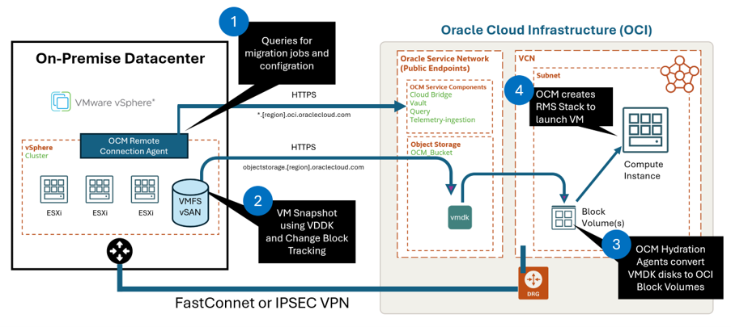

# Using the Oracle Cloud Migrations service over FastConnect or VPN

## OCI Object Storage Public End point support

While OCI object storage now supports private end points, today this is not yet supported by OCM. Routing the traffic via FastConnect will require the customer to update their own routing rules to ensure traffic is directed via FastConnect

## OCM Network flow

The Oracle Cloud Migrations service (OCM) allows you to migrate Virtual Machines from other platforms like VMware vSphere environments. It does this by using OCI public services to query information and to replicate the virtual disks (using OCI Object Storage).

For customers that have a FastConnect or IPSEC VPN tunnel in place between their own environment and OCI, this connection will not be used by default for OCM, as these are public internet endpoints.

Default Traffic Flow of OCM Service

## OCM Public End Points

OCM used the following services. To ensure that all traffic flows over your FastConnect or VPN, check the Public IP Addresses for the Oracle Service Network: https://docs.oracle.com/iaas/tools/public_ip_ranges.json

- cloudmigration.[region].oci.oraclecloud.com
- cloudbridge.[region].oci.oraclecloud.com
- auth.[region].oraclecloud.com
- overlay.[region].oci.oraclecloud.com
- telemetry-ingestion.[region].oci.oraclecloud.com
- secrets.vaults.[region].oci.oraclecloud.com
- vaults.[region].oci.oraclecloud.com
- query.[region].oci.oraclecloud.com
- objectstorage.[region].oraclecloud.com

If you only want to redirect the actual replication data, you just need to re-route all objectstorage traffic via your FastConnect/VPN. IP addresses for your region used by Object Storage are specifically mentioned in the JSON file.
Here an example for the eu-frankfurt-1 region in the public_ip_ranges.json:

# License

Copyright (c) 2026 Oracle and/or its affiliates.

Licensed under the Universal Permissive License (UPL), Version 1.0.

See [LICENSE](https://github.com/oracle-devrel/technology-engineering/blob/main/LICENSE) for more details.
