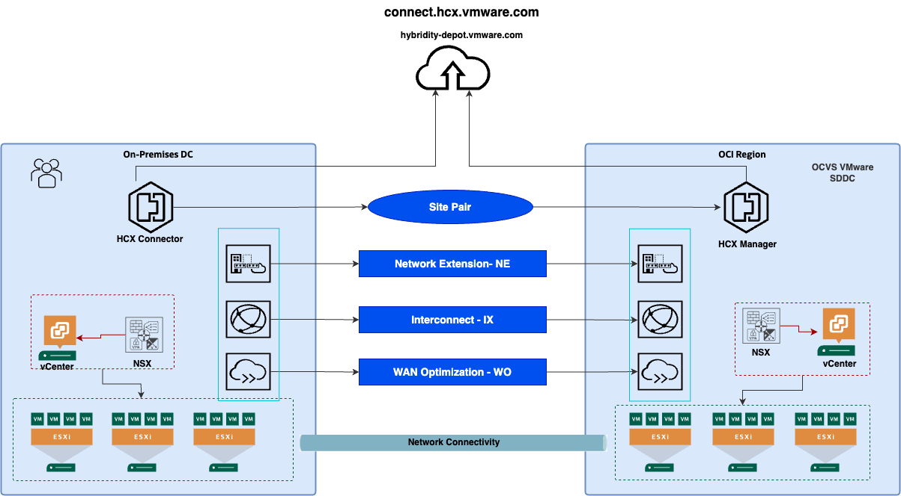
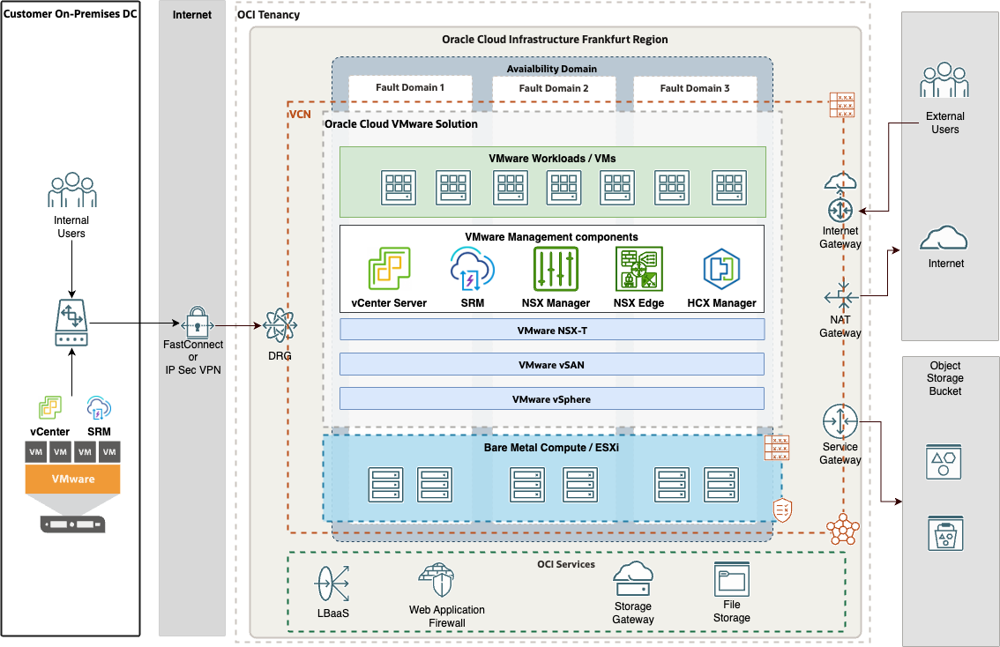
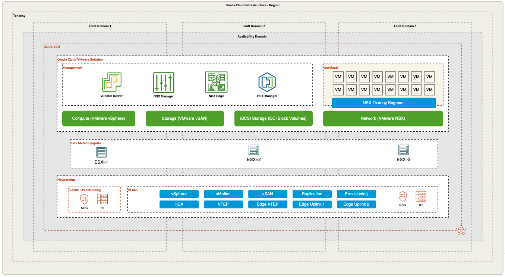
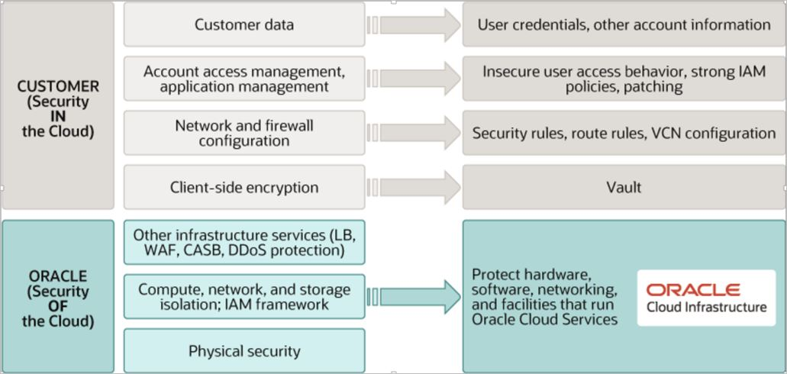
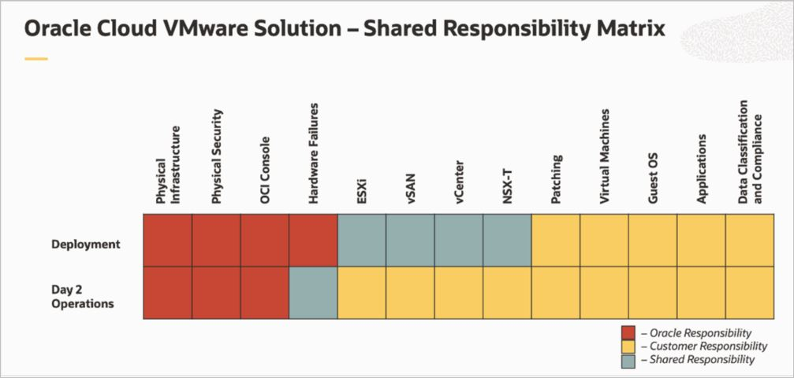
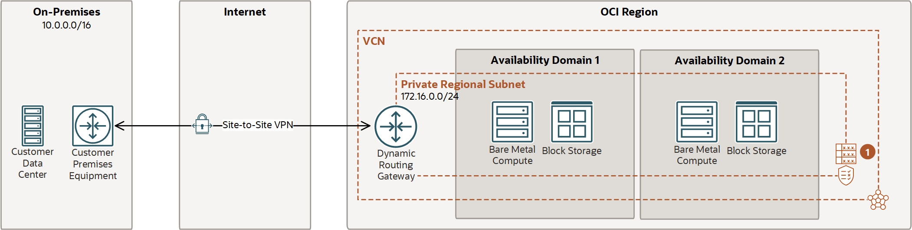

---
doc:
  author: Name Surname                  #Mandatory
  version: 2.5                          #Mandatory
  cover:                                #Mandatory
    title:                              #Mandatory
      -  Customer name                  #Mandatory
      -  Workload to OCI                #Mandatory
    subtitle:                           #Mandatory
      - Solution Definition             #Mandatory
  customer:                             #Mandatory
    name: \<Customer Name\>                           #Mandatory
    alias: \<Customer Alias\>                          #Mandatory
  config:
    impl:
      type: \<Service Provider\>            #Mandatory: Can be 'Oracle Lift', 'Oracle Fast Start', 'Partner' etc.   
      handover:     #Mandatory: Please specify to whom to hand over the project after implementation. eg.: The Customer, a 3rd party implementation or operations partner, etc.           
  draft: false
  history:
    - version: 1.0
      date: 1st June 2023
      authors: 
        - Base Template
      comments:
        - Created a new Solution Definition document for iterative review and improvement.
    - version: 1.1
      date: 1st July 2023
      authors: Base Template
      comments:
        - Updated the template based on feedback. Added security template text and annex content.
    - version: 1.2
      date: 1st August 2023
      authors: Base Template
      comments:
        - Updated the template based on Confluence feedback.
    - version: 2
      date: 1st September 2023
      authors: Base Template
      comments:
        - Added Networking Annex.
    - version: 2.1
      date: 1st September 2023
      authors: Base Template
      comments:
        - Updated LZ Snippet
        - Added 'Base Template' to the version table instead of 'Name Surname'
    - version: 2.2
      date: 16th October 2023
      authors: Base Template
      comments:
        - Upgraded the Logical Architecture as mandatory. It is now included in the 'Mandatory' template.
    - version: 2.3
      date: 16th January 2024
      authors: Base Template
      comments:
        - Added comment for workload snippets
        - Updated acronyms.
    - version: 2.4
      date: 26th February 2024
      authors: Base Template
      comments:
        - Added network firewall guidance to the requirements, solution considerations, and annex.
    - version: 2.5
      date: 8th April 2024
      authors: Base Template
      comments:
        - Added manageability guidance to the requirements, solution considerations, and annex.
  team:
    - name: ${doc.author}
      email: example@example.com
      role: Tech Solution Specialist
      company: Oracle
    - name: Ada Lovelace
      email: example@example.com
      role: Account Cloud Engineer
      company: Oracle
  acronyms:
    Dev: Development
---

<!--
  Author: 
    Last Change: 25th March 2024
    Review Status: Development
    Review Notes: see https://confluence.oraclecorp.com/confluence/x/9Vyyvw
    How to use this template: https://confluence.oraclecorp.com/confluence/x/LBRBvg
-->

<!--
If you need to control the hyphenation of words. Use the example below and remove the comment. Example of the default hyphenation De-vOps or in-fras-truc-ture. You can change it by defining a new hyphenation as in the example below 'in-fra-struc-ture'. Or define words without any hyphenation, for example for names such as ArgoCD.
-->
<!--
\hyphenation{Dev-Ops ArgoCD in-fra-struc-ture re-li-a-bil-i-ty}
-->

*Guide:*

*Author Responsibility*

- *Chapter 1-3: Sales Consultant*
- *Chapter 4: Implementer*

# Document Control
<!--
Role  | RACI
------|-----
ACE   | R/A
Impl. | None
PPM   | None
-->

*Guide:*

*The first chapter describes document metadata, including version history and team members.*

## Version Control
<!--
Role  | RACI
------|-----
ACE   | R/A
Impl. | None
PPM   | None
-->

*Guide:*

*Use this section to describe document versions and the changes introduced in each version.*

*Example:*

```{#history}
This is the document history. Use the doc.history metadata to compile the table.
```

## Team
<!--
Role  | RACI
------|-----
ACE   | R/A
Impl. | None
PPM   | None
-->

*Guide:*

*Use this section to describe the delivery team.*

*Example:*

```{#team}
This is the team delivering the workload architecture document. Use the doc.team metadata to compile the table.
```

## Document Purpose
<!--
Role  | RACI
------|-----
ACE   | R/A
Impl. | None
PPM   | None
-->

*Guide:*

*Describe the purpose of this document and define any Oracle-specific terminology, especially the term 'Workload'.*

<!--                            -->
<!-- End of 1) Document Control -->
<!--                            -->

# Business Context
<!--
Role  | RACI
------|-----
ACE   | R/A
Impl. | None
PPM   | None
-->

*Guide:*

*Describe the customer's business context and background. Include the customer's industry, line of business, business needs, and goals enabled by this workload. Explain how the technical solution supports those goals, whether it aligns with a specific customer strategy or customer values, and how it helps the customer generate revenue, reduce cost, or reduce risk.*


## Executive Summary
<!--
Role  | RACI
------|-----
ACE   | R/A
Impl. | None
PPM   | None
-->

*Guide:*

*Describe the Oracle differentiators and key customer value of the proposed solution so decision makers can understand the recommendation quickly.*

## Workload Business Value
<!--
Role  | RACI
------|-----
ACE   | R/A
Impl. | None
PPM   | None
-->


<!--                            -->
<!-- End of 2) Business Context -->
<!--                            -->

Oracle Cloud VMware Solution is a customer-managed software-defined data center (SDDC) service that provides flexible infrastructure for mission-critical VMware workloads. Customers can migrate or protect workloads from an on-premises VMware environment to Oracle Cloud VMware Solution by using native migration and disaster recovery tooling available with the service. Because the VMware platform remains consistent, customers can reduce or avoid application refactoring and focus on their broader cloud transformation journey.

# Workload Requirements and Architecture

## Overview
<!--
Role  | RACI
------|-----
ACE   | R/A
Impl. | None
PPM   | None
-->

*Guide:*

*Describe the workload. Identify the applications and environments included in this migration, disaster recovery, or new implementation project. The implementation scope is defined later and can be a subset of the overall Solution Definition. For example, a workload might include two applications, while the implementation covers only one environment for one application. This chapter describes the complete workload; the implementation scope is described in [Solution Scope](#solution-scope).*

Oracle provides guidance for planning, architecting, prototyping, and managing cloud migration and disaster recovery solutions. Customers can move or protect critical workloads in weeks, or even days, instead of months by using these services.

Oracle will support the design of the target Oracle Cloud VMware Solution architecture based on customer business and technical requirements.

Oracle will help move or protect selected virtual machines from the on-premises VMware environment to Oracle Cloud Infrastructure.

__The objectives of this document are to:__


The high-level goals for this document are:

1.	Review the existing on-premises architecture, map it to relevant Oracle Cloud Infrastructure services, and propose a tailored high-level cloud architecture.

2.	Provide Oracle Cloud Infrastructure architecture guidance.

3.	Address Oracle Cloud VMware Solution design considerations across security, networking, compute, storage, operations, and related areas.

4.	Define the Oracle Cloud VMware Solution cloud environment according to the agreed design and architecture.

5.	Define the potential scope of Oracle Lift or related implementation services.

## Non-Functional Requirements
<!--
Role  | RACI
------|-----
ACE   | R/A
Impl. | None
PPM   | None
-->

*Guide:*

*Describe the high-level technical requirements for the workload. Review all sub-chapters and keep only the non-functional requirement sections that are relevant to the engagement. Not every project needs requirements in every sub-chapter.*

*Use this chapter to describe customer-specific requirements and needs. Do not use it to explain Oracle solutions or capabilities.*

The client wants to build a disaster recovery solution for business-critical VMware workloads so that, in the event of an on-premises data center failure, IT services can be recovered quickly on Oracle Cloud Infrastructure and Oracle Cloud VMware Solution.

### Regulatory and Compliance Requirements

*Guide:*

*This section captures specific regulatory or compliance requirements for the Workload. These may limit the types of technologies that can be used and may drive some architectural decisions.*

*The Oracle Cloud Infrastructure Compliance Documents service lets you view and download compliance documents:
https://docs.oracle.com/en-us/iaas/Content/ComplianceDocuments/Concepts/compliancedocsoverview.htm*

*If there are no regulatory or compliance requirements, state that clearly. Leave the second sentence as default text in the document.*

*Example:*

At the time this document was created, no regulatory or compliance requirements were specified.

In addition to these requirements, the [CIS Oracle Cloud Infrastructure Foundation Benchmark, v1.2](https://www.cisecurity.org/benchmark/Oracle_Cloud) will be applied to the Customer tenancy.

### Environments

*Guide:*

*Provide a diagram or list of all required environments, such as development, test, staging, and production.*

*To describe the current state, add a 'Current State Architecture' chapter before 'Future State Architecture'.*


Example:

Name	        | Number of VMs  | Location	  | DR    | Scope
:---		    |:---		   	|:---		  |:---   |:---
Environment 1     |          	| Malaga	  | Yes   | in Scope
Environment 2         |             | Sevilla     | Yes    | in Scope
Environment 3      |             | Sevilla     | Yes    | in Scope


### High Availability and Disaster Recovery Requirements

*Guide:*

*This section captures the resilience and recovery requirements for the Workload. Note that these may be different from the current system.*

*Capture the Recovery Point Objective (RPO) and Recovery Time Objective (RTO) for each environment in the environments section above wherever possible.*

- *What are the application's RTO and RPO requirements?*
- *What are the SLAs of the application?*
- *What are the backup requirements?*

*If needed, this section may also include an overview of the proposed backup and disaster recovery architectures.*

*This chapter is mandatory. If there are no HA or DR requirements, state that in one short sentence.*

*Example:*

At the time this document was created, no resilience or recovery requirements were specified.


### Disaster Recovery to OCVS

This section describes the disaster recovery options and tools that can be used to protect selected workloads to Oracle Cloud VMware Solution. The examples below describe two disaster recovery approaches for protecting on-premises VMware workloads to Oracle Cloud VMware Solution. VMware HCX Disaster Recovery is included with the Oracle Cloud VMware Solution service and provides basic disaster recovery capabilities. VMware Site Recovery Manager provides more advanced disaster recovery orchestration and is licensed separately; it is not included with Oracle Cloud VMware Solution. Third-party solutions such as Veeam, RackWare, Zerto, and others are also available in the market, but are not described in this document.


#### Disaster recovery architecture with VMware HCX

VMware HCX is an application mobility platform that enables migration and protection of virtual machines from an on-premises VMware environment to an Oracle Cloud VMware Solution SDDC. HCX Disaster Recovery protects virtual workloads managed by VMware vSphere, whether those workloads are deployed in a private cloud or public cloud environment.

The VMware HCX implementation includes activities at both the on-premises site and the cloud site. The HCX Manager implementation and configuration in Oracle Cloud is handled as part of the Oracle Cloud VMware Solution SDDC provisioning process. As a result, only minimal Oracle Cloud-side configuration is required after provisioning; most remaining tasks are related to pairing, connectivity, service mesh configuration, and workload protection.

The following image illustrates the solution overview for VMware HCX implementation with Oracle Cloud VMware Solution.



HCX Disaster Recovery uses VMware vSphere Replication technology to transfer virtual machine disk data. When protection is enabled for a virtual machine, the replication engine first performs a full synchronization of the virtual machine data to the target datastore. After the baseline synchronization completes, the system performs delta synchronizations, replicating only changed data blocks.

Delta synchronization occurs according to the recovery point objective (RPO) configured for the virtual machine and creates a replication instance. The selectable RPO ranges from 5 minutes to 24 hours. For example, an RPO of 2 hours means the maximum tolerated data loss for that virtual machine is 2 hours.

##### Licensing

HCX is available with two license levels: HCX Advanced, which is included with Oracle Cloud VMware Solution, and HCX Enterprise, which is available as an additional SKU and can be enabled from the OCI Console on a monthly subscription basis.

Evaluate the HCX license level against the required features before selecting the disaster recovery approach. For more information about HCX license differences, see the following documentation:

[HCX License types](https://docs.oracle.com/en-us/iaas/Content/VMware/Concepts/ocvsoverview.htm#aboutsoftware__hcx-license-types)

__Please note:__ According to [Broadcom’s official release notes for VMware HCX 4.11](https://techdocs.broadcom.com/us/en/vmware-cis/hcx/vmware-hcx/4-11/hcx-4-11-release-notes/vmware-hcx-411-release-notes.html),
the **HCX Disaster Recovery (HCX DR)** feature has been **deprecated** and is planned for removal in a future release.

__Please note:__ If you are using Oracle Cloud VMware Solution with Standard Shapes, HCX Enterprise is included in the subscription and no additional cost is required.

__Please note:__ Check the VMware interoperability matrix to confirm VMware HCX compatibility with the source vSphere environment.


#### Disaster recovery architecture with VMware Site Recovery Manager

VMware Site Recovery Manager is an extension to VMware vCenter that provides disaster recovery, site migration, and non-disruptive recovery testing capabilities. It provides more advanced orchestration than VMware HCX Disaster Recovery.

Site Recovery Manager works with VMware vSphere Replication to automate migration, recovery, testing, reprotection, and failback for virtual machine workloads.

The migration or recovery of protected inventory and services from one site to another is controlled by a recovery plan. The recovery plan defines the order in which virtual machines are shut down and started, the resource pools to which they are assigned, and the networks they can access.

Site Recovery Manager enables non-disruptive recovery plan testing by using a temporary copy of replicated data and isolated networks. This allows recovery procedures to be validated without disrupting ongoing operations at either site.

Multiple recovery plans can be configured for individual applications or entire sites, providing granular control over which virtual machines are failed over and failed back.

Site Recovery Manager extends the VMware virtual infrastructure platform to support business continuity during partial or complete site failures.

The following diagram shows a high-level architecture for disaster recovery to Oracle Cloud VMware Solution with Site Recovery Manager.




### Security Requirements

*Guide:*

*Capture the Non-Functional Requirements for security-related topics. The requirements can be (but don't have to be) separated into:*
- *Identity and Access Management*
- *Data Security*

*Other security topics, such as network security, application security, key management, or others can be added if needed.*

*Example:*

At the time this document was created, no security requirements were specified.

### Networking Requirements

*Guide*

*Capture the non-functional requirements for networking-related topics. You can use the networking questions in the [Annex](#networking-requirement-considerations).*


*Example:*

At the time this document was created, no networking requirements were specified.

### Management and Monitoring

## Future State Architecture
<!--
Role  | RACI
------|-----
ACE   | R/A
Impl. | None
PPM   | None
-->

*Guide:*

*The workload future state architecture can be described in several forms. At minimum, describe the logical architecture, optionally with a system context diagram. A high-level physical architecture is mandatory.*

*This should represent the final pre-sales solution architecture, not an intermediate or draft version.*

*Additional architectures, in the subsections, can be used to describe needs for specific workloads.*

### Mandatory Security Best Practices

*Guide:*

*Use this text for every engagement. Do not change it. This guidance is aligned with the Cloud Adoption Framework.*


### Naming Conventions

*Guide:*

*This chapter describes naming convention best practices and usually does not require changes. If changes are required, refer to [Landing Zone GitHub](https://github.com/oracle-devrel/technology-engineering/tree/main/landing-zones). The service provider must describe naming conventions in the Solution Design.*

*Use this template ONLY for new cloud deployments and remove it for brownfield deployments.*


### OCI Landing Zone Solution Definition

*Guide:*

*This chapter describes landing zone best practices and usually does not require changes. If changes are required, refer to [Landing Zone GitHub](https://github.com/oracle-devrel/technology-engineering/tree/main/landing-zones). The service provider must describe the full landing zone in the Solution Design.*

*Use this template ONLY for new cloud deployments and remove it for brownfield deployments.*

```{.snippet}
ar-landingzone
```
The Oracle Cloud Infrastructure and Oracle Cloud VMware Solution networking and security services described above are implemented through a landing zone. The following diagram illustrates the landing zone reference architecture for Oracle Cloud VMware Solution.


This architecture is designed specifically for Oracle Cloud VMware Solution, which runs on Oracle Cloud Infrastructure core services such as Bare Metal Compute and Virtual Cloud Network resources. The architecture starts with tenancy compartment design, groups, and policies to support segregation of duties.

In the landing zone, the tenancy should have a dedicated compartment for the VMware SDDC deployment. An existing tenancy can be used, but the VMware SDDC environment should be separated from other Oracle Cloud Infrastructure resources. The VMware SDDC compartment is assigned to a group with the permissions required to manage resources in that compartment and access required resources in other compartments. As a best practice, create a dedicated compartment for the VCN used by Oracle Cloud VMware Solution so networking resources are isolated in their own compartment.

The VMware SDDC compartment is used to deploy the SDDC service. The SDDC network compartment hosts the dedicated VCN resources required to isolate VMware and network resources, and IAM policies control network resource access and management. The Oracle Cloud VMware Solution deployment workflow is automated and provisions the required compute and networking resources while maintaining the expected security posture.

The Oracle Cloud VMware Solution landing zone includes preconfigured networking resources such as subnets, VLANs, network security groups, security lists, and route tables to support the security posture required for enterprise VMware workloads. It also includes the Bare Metal Compute resources required for VMware hypervisor operation. VMware NSX is configured as the software-defined networking layer and is isolated in an overlay network zone.

Additional Oracle Cloud Infrastructure services such as Cloud Guard, Events, Notifications, and Web Application Firewall can be used to operate and monitor Oracle Cloud VMware Solution resources, including OCI Compute and OCI Networking resources. Notifications can be configured with topics and events to alert administrators about changes in deployed resources.

__Please note:__ VMware workloads can integrate with selected Oracle Cloud Infrastructure services, subject to the design and connectivity model used for the VMware SDDC.
The low-level landing zone design, including technical details specific to ${doc.customer.name}, will be provided during the architecture design discovery process.
The SDDC network must not overlap with existing networks in the ${doc.customer.name} tenancy. With a /21 SDDC CIDR range, the SDDC can scale up to a maximum of 64 hosts.

__Note:__ The following table shows a sample network layout for a /22 network. The actual VLAN network ranges are created automatically by the SDDC provisioning workflow and depend on the selected SDDC CIDR range.
The SDDC workload CIDR will be identified as part of the low-level design during implementation.


| VLAN Name                   | CIDR Range    |
|:----------------------------|:--------------|
| Provisioning Subnet         | 10.0.0.0/26   |
| VLAN-SDDC-NSX Edge Uplink 1 | 10.0.0.64/26  |
| VLAN-SDDC-NSX Edge Uplink 2 | 10.0.0.128/26 |
| VLAN-SDDC-NSX Edge VTEP     | 10.0.0.192/26 |
| VLAN-SDDC-NSX VTEP          | 10.0.1.0/26   |
| VLAN-SDDC-vMotion           | 10.0.1.64/26  |
| VLAN-SDDC-vSAN              | 10.0.1.128/26 |
| VLAN-SDDC-vSphere           | 10.0.1.192/26 |
| VLAN-SDDC-HCX               | 10.0.2.0/26   |
| VLAN-SDDC-Replication Net   | 10.0.2.64/26  |
| VLAN-SDDC-Provisioning Net  | 10.0.2.128/26 |


### Logical Architecture
<!--
Role  | RACI
------|-----
ACE   | R/A
Impl. | None
PPM   | None
-->

*Guide:*

*Provide a high-level logical Oracle solution for the complete workload. Represent Oracle products as abstract groups rather than detailed physical instances. Create an architecture diagram using the latest notation and describe the solution.*

*To implement the solution, provide the physical architecture in the next chapter. The physical architecture can show individual components with physical attributes such as IP addresses, hostnames, and sizes.*

*[The Oracle Cloud Notation, OCI Architecture Diagram Toolkits](https://docs.oracle.com/en-us/iaas/Content/General/Reference/graphicsfordiagrams.htm)*

### Physical Architecture
<!--
Role  | RACI
------|-----
ACE   | R/A
Impl. | None
PPM   | None
-->

*Guide:*

*The workload architecture is typically described in physical form and should include all solution components. You do not need to provide detailed build or deployment information such as IP addresses.*

*Describe the solution with an architecture diagram and supporting text. If specific design decisions require more detail, describe them in the Solution Considerations chapter.*

*[The Oracle Cloud Notation, OCI Architecture Diagram Toolkits](https://docs.oracle.com/en-us/iaas/Content/General/Reference/graphicsfordiagrams.htm)*

*Reference:*

[StarterPacks (use the search)](https://github.com/oracle-devrel/technology-engineering/)

*Example:*


The future state architecture covers the current on-premises workloads that will be hosted on Oracle Cloud VMware Solution. Oracle Cloud VMware Solution is deployed in an availability domain within the selected Oracle Cloud Infrastructure region and spans three fault domains in that region.
The OCI Bare Metal instances used by the service are distributed across fault domains in a round-robin pattern to provide redundancy for Oracle Cloud VMware Solution workloads.
Oracle Cloud VMware Solution supports two primary architecture options:
- Oracle Cloud VMware Solution with DenseIO shapes: This architecture primarily uses VMware vSAN storage backed by NVMe drives from the local Bare Metal servers.
- Oracle Cloud VMware Solution with Standard Shapes: This architecture uses OCI Block Storage as the primary storage option for virtual machine workloads.



Oracle Cloud VMware Solution is the central component of this deployment. It provides an automated implementation of a VMware software-defined data center (SDDC) within the customer's Oracle Cloud Infrastructure tenancy. The solution runs on Oracle Cloud Infrastructure Bare Metal Compute and includes the following VMware components:

* VMware vSphere Hypervisor (ESXi)
* VMware vCenter Server
* VMware vSAN
* OCI Block Storage
* VMware NSX-T
* VMware HCX Advanced


The architecture includes the following components:

__OCVS__

The __VMware SDDC__ consists of vSphere (ESXi and vCenter), NSX-T, vSAN, and HCX. The SDDC can be deployed on OCI DenseIO shapes that provide vSAN storage, or on OCI Standard Shapes with OCI Block Storage as the primary storage option.

* __VMware HCX__ - An application mobility platform designed to simplify application migration, workload rebalancing, and business continuity across data centers and clouds. HCX enables migration of VMware workloads to Oracle Cloud VMware Solution.

* __HCX Manager__ - An appliance deployed in Oracle Cloud VMware Solution. HCX Manager is paired with the on-premises vCenter through HCX Connector.

* __HCX Connector__ - An appliance deployed with the on-premises vCenter Server and paired with HCX Manager in the cloud to provide the base configuration required for workload migration.

* __VMware NSX-T__ - The NSX-T Data Center implementation that provides software-defined networking for the SDDC stack. Migrated workloads can use NSX network segments. NSX-T provides networking and security services for Oracle Cloud VMware Solution environments, including load balancing, routing, switching, firewalling, and micro-segmentation.

* __VMware vSAN__ - A software-defined storage solution included with the Oracle Cloud VMware Solution SDDC. vSAN uses locally attached NVMe all-flash disks from each OCI Bare Metal server to provide shared storage for workloads.

* __OCI Block Storage__ - OCI Block Storage can be used as additional storage with a DenseIO SDDC alongside vSAN. In a Standard Shape Oracle Cloud VMware Solution environment, OCI Block Storage is the primary storage option.

* __VMware vSphere__ - Includes ESXi hosts and vCenter Server.

* __FastConnect__ - Oracle Cloud Infrastructure FastConnect is a dedicated, private, high-speed network connection between the ${doc.customer.name} data center and the selected Oracle Cloud Infrastructure region. FastConnect can be used to migrate workloads over the network.


## Solution Considerations


<!--
Role  | RACI
------|-----
ACE   | R/A
Impl. | None
PPM   | None
-->

*Guide:*

*Describe important solution decisions in detail, including security, resilience, networking, and operations decisions that are relevant to the customer.*

### High Availability and Disaster Recovery

*Reference:*

- [Resilience on OCI](https://docs.public.oneportal.content.oci.oraclecloud.com/en-us/iaas/Content/cloud-adoption-framework/era-resiliency.htm)
- [Workload Related Content](https://github.com/oracle-devrel/technology-engineering/)
#### OCVS Resilience and Recovery

Oracle Cloud VMware Solution is deployed in an availability domain within the selected Oracle Cloud Infrastructure region. Each availability domain contains fault domains that support fault-tolerant and resilient designs. For more information about OCI availability domains and fault domains, see the [OCI documentation](https://docs.oracle.com/en-us/iaas/Content/General/Concepts/regions.htm).

Details of the Oracle Cloud Infrastructure SLAs are available at the following link:
[OCI Service SLA](https://www.oracle.com/ae/cloud/sla/).

##### OCVS High Availability
This section describes VMware SDDC high availability.

__OCI Bare Metal Compute (ESXi):__ OCI native services such as Bare Metal Compute and VCN resources are resilient cloud services. An OCI Bare Metal host failure can be addressed by replacing the faulty node with a new ESXi host in the cluster.

__OCI Bare Metal NVMe (vSAN):__ The Oracle Cloud VMware Solution SDDC uses vSAN for the software-defined storage layer. vSAN failure to tolerate (FTT) policies help manage host failures and reduce the risk of data loss. Customers can use vSAN Storage Policy Based Management, including different RAID levels, to protect data.

__OCVS Networking (NSX-T):__ The Oracle Cloud VMware Solution SDDC uses NSX-T to manage software-defined networking. NSX Edge nodes and NSX Managers are deployed redundantly to maintain high availability.

__OCI Block Storage:__ OCI Block Storage provides backend data resiliency within the availability domain. When OCI Block Storage is used as the primary storage option with Oracle Cloud VMware Solution, RAID configuration is not required at the VMware layer; the design relies on the resiliency provided by Oracle Cloud Infrastructure.


### Security

*Guide:*

*Describe the solution from a security point of view. Generic security guidelines are provided in the Annex chapter.*

*Example:*

See the security guidelines in the [Annex](#security-guidelines).
Oracle employs best-in-class, enterprise-grade security technology, and operational processes to secure cloud services. To deploy and operate your workloads securely in Oracle Cloud, you must be aware of your security and compliance responsibilities.

Oracle ensures the security of cloud infrastructure and operations, such as cloud operator access controls and infrastructure security patching. You’re responsible for configuring your cloud resources securely. The following graphic illustrates the shared security responsibility model.  




__OCVS specific Responsibility Matrix__



Oracle is solely responsible for all aspects of the physical security of the Availability Domains and Fault Domains in each region. Both Oracle and you are responsible for the infrastructure security of hardware, software, and the associated logical configurations and controls.

As a customer, your security responsibilities encompass the following:

* The platform you create on top of Oracle Cloud.
* The applications that you deploy.
* The data that you store and use.
* The overall governance, risk, and security of your workloads.

The shared responsibility extends across different domains including identity management, access control, workload security, data classification and compliance, infrastructure security, and network security.

#### OCVS Security Posture

The section below describes the security posture for Oracle Cloud VMware Solution and Oracle Cloud Infrastructure.

* Access to the customer's OCI tenancy is restricted and controlled using IAM and identity federation. Network sources can optionally restrict access to known IP addresses from a VCN or on-premises network.

* Subnet security can be controlled by security lists and network security groups. OCI follows a zero-trust model by default, so traffic must be explicitly allowed for known communication patterns. OCI Web Application Firewall can provide additional protection for customer-facing applications.

* VLANs reside in the VCN and are provisioned for the Oracle Cloud VMware Solution service. Each VLAN is attached to a network security group to control traffic. Traffic within a VLAN is blocked by default until required rules are configured.

* An NSX segment is an overlay network that runs on top of the VMware virtualization stack. This network is independent of the VCN network. Communication from an NSX overlay segment to OCI resources must be explicitly allowed through uplink interfaces, routing, and security rules.

* Security within an NSX segment is managed by the NSX-T control plane. By default, traffic inside a segment is allowed. NSX micro-segmentation can improve network agility and operational efficiency while maintaining a strong security posture.

* Users from an on-premises environment can securely connect to Oracle Cloud VMware Solution resources through IPSec VPN or FastConnect.

* A bastion host can be deployed in a public subnet in the customer's tenancy. Secure Remote Desktop Protocol (RDP) access is allowed through an internet gateway and controlled by security rules.

* Access to the Oracle Cloud VMware Solution SDDC environment should be allowed only from approved administrative entry points, such as the bastion host.

#### OCVS Data Security

This section describes data security for virtual machines in the Oracle Cloud VMware Solution environment. It explains how encryption works with vSAN and outlines options for data at rest and data in transit. If no customer-specific data security requirements have been received, this section describes the default data security capabilities available with Oracle Cloud VMware Solution.

__vSAN Data-At-Rest__

Oracle Cloud VMware Solution uses VMware vSAN technology for virtual machine storage management. vSAN provides data-at-rest encryption for data stored in the vSAN datastore. vSAN data-at-rest encryption requires an external Key Management Server (KMS) or a vSphere Native Key Provider.
vSAN data-at-rest encryption is out of scope for this project. However, customers can enable data-at-rest encryption at the cluster level later, provided the required prerequisites are met.

__vSAN Data-in-Transit__

Oracle Cloud VMware Solution uses VMware vSAN technology for virtual machine storage management. vSAN can encrypt data in transit as it moves between hosts in the vSAN cluster. When data-in-transit encryption is enabled, vSAN encrypts all data and metadata traffic between hosts. Traffic between data hosts and witness hosts is also encrypted.
vSAN data-in-transit encryption is out of scope for this project. However, the customer can enable this capability at the vSAN cluster level in the Oracle Cloud VMware Solution SDDC.

__Block Storage Encryption__

OCI Block Storage can be used to scale storage for DenseIO Oracle Cloud VMware Solution deployments and as primary storage for Standard Shape Oracle Cloud VMware Solution deployments. OCI Block Volumes are presented to VMware ESXi hosts as iSCSI targets for storing virtual machine files. OCI security features such as Key Management, encryption, and Vault apply to virtual machine data stored on OCI Block Volumes. OCI Block Volumes are mounted as external datastores for the VMware SDDC and can use Oracle-managed or customer-managed keys for virtual machine data encryption.

### Networking

*Guide:*

```{.snippet}
network-solution-considerations-guide
```

*Reference:*

*A list of possible Oracle solutions is available in the [Annex](#networking-solutions).*

*Example:*

```{.snippet}
network-solution-firewall
```
The architecture includes the following components:

* __On-premises Network__ - The local network used by the organization. It is one of the spokes in the topology.

* __Region__ - An Oracle Cloud Infrastructure region is a localized geographic area that contains one or more data centers, called availability domains. Regions are independent from one another and can be separated by large geographic distances.

* __Virtual Cloud Network (VCN)__ - A customizable private network in an Oracle Cloud Infrastructure region. Like traditional data center networks, VCNs provide control over the network environment. VCNs can be segmented into subnets that are regional or availability domain-specific. Both subnet types can coexist in the same VCN, and each subnet can be public or private.

* __Security List__ - A set of subnet-level security rules that specify the source, destination, and type of traffic allowed into and out of the subnet.

* __Network Security Group (NSG)__ - NSGs act as virtual firewalls for your cloud resources. With the zero-trust security model of Oracle Cloud Infrastructure, all traffic is denied, and you can control the network traffic inside a VCN. An NSG consists of a set of ingress and egress security rules that apply to only a specified set of VNICs in a single VCN.

* __Route Table__ - A set of rules that routes traffic from subnets to destinations outside a VCN, typically through gateways.

* __Dynamic Routing Gateway (DRG)__ - A virtual router that provides a private network path between a VCN and networks outside the region, such as another OCI region, an on-premises network, or another cloud provider.

* __Bastion Host__ - A compute instance that provides a secure, controlled administrative entry point from outside the cloud. The bastion host is typically provisioned in a demilitarized zone (DMZ). It helps protect sensitive resources by keeping them in private networks that cannot be accessed directly from outside the cloud. This gives the topology a known entry point that can be monitored and audited.

* __VPN Connect__ - VPN Connect provides site-to-site IPSec VPN connectivity between your on-premises network and VCNs in Oracle Cloud Infrastructure. The IPSec protocol suite encrypts IP traffic before the packets are transferred from the source to the destination and decrypts the traffic when it arrives.

* __FastConnect__ - Oracle Cloud Infrastructure FastConnect provides an easy way to create a dedicated, private connection between your data center and Oracle Cloud Infrastructure. FastConnect provides higher-bandwidth options and a more reliable networking experience when compared with internet-based connections.

#### Network connectivity options (on-premises to OCI)

##### IPSec VPN

The following diagram of a reference architecture shows how to set up a Virtual Private Network (VPN) to connect to a customer's on-premises network and VCN.



The IPSec VPN architecture includes the following components:

* __VPN Connect__ - The OCI service function that manages IPSec VPN connections to the tenancy.

* __Customer-Premises Equipment (CPE)__ - An object that represents the network asset in the on-premises network that establishes the VPN connection. Most border firewalls can act as the CPE, but a separate appliance or server can also be used.

* __Internet Protocol Security (IPSec)__ - A protocol suite that encrypts IP traffic before packets are transferred from the source to the destination.

* __Tunnel__ - A connection between the CPE and Oracle Cloud Infrastructure.

* __Border Gateway Protocol (BGP) routing__ - Enables dynamic route learning. The DRG dynamically learns routes from the on-premises network and advertises the VCN subnets from the Oracle side.

* __Static Routing__ - Requires the networks on each side of the VPN connection to be defined manually. Route changes are not learned dynamically.

IPSec VPN will provide connectivity between the ${doc.customer.name} data center and the Oracle Cloud Infrastructure region for standard day-to-day operational purposes. Based on the current information, the IPSec connection is already established.

##### FastConnect

The following reference architecture diagram shows how to set up a FastConnect connection between your on-premises network and Virtual Cloud Network (VCN).


* __Border Gateway Protocol (BGP) routing__ - Enables dynamic route learning. The DRG dynamically learns routes from the on-premises network and advertises the VCN subnets from the Oracle side.

* __Private Peering__ - Extends existing infrastructure by using private IP addresses.

* __Public Peering__ - Allows public Oracle Cloud Infrastructure services to be accessed using a private connection instead of the internet.

* __Virtual Circuit__ - The private path used to connect on-premises environments and Oracle Cloud Infrastructure. It can include multiple physical or logical lines, depending on the requirements and the provider's capabilities.

FastConnect will provide connectivity between the ${doc.customer.name} data center and the selected Oracle Cloud Infrastructure region during virtual machine migration from on-premises VMware to Oracle Cloud. FastConnect is required at least for the duration of workload migration.

##### OCVS Specific Networking Configuration Within OCI

Oracle Cloud VMware Solution networking is organized into virtual cloud networks, subnets, and VLANs. Each VLAN within the VCN is attached to a network security group for traffic control and a route table for routing. Similarly, the subnet created during the SDDC provisioning workflow is attached to a security list and route table.


##### OCI Virtual Cloud Network (VCN) for OCVS

All Oracle Cloud VMware Solution SDDC resources are deployed in a single VCN.
A VMware SDDC requires at least a /24 network CIDR. A dedicated /16 VCN CIDR block is recommended to support future network growth.

| VCN                      | CIDR Range              |
|:-------------------------|:------------------------|
| VCN Name                 | 10.0.0.0/16             |
| SDDC CIDR                | 10.0.0.0/21             |
| Workload CIDR (Optional) | 192.168.10.0/24 (NSX-T) |

Oracle Cloud VMware Solution networking resources, including subnets, VLANs, network security groups, route tables, and gateways, are created as part of the SDDC provisioning workflow. The CIDR ranges for management VLANs depend on the size of the SDDC CIDR. Network design considerations should be assessed carefully before provisioning the Oracle Cloud VMware Solution environment.

### Manageability and Observability

*Example:*

```{.snippet}
manageability-sol-con
```


## Sizing and Bill of Materials
<!--
Price Lists and SKUs / Part Numbers: https://esource.oraclecorp.com/sites/eSource/ESRCHome
-->

*Guide:*

*Estimate and size the physical resources required for the workload. This information can be based on existing capacity data, business user volumes, integration points, or translated on-premises resource usage. Sizing can be completed with or without a finalized physical architecture. Clearly state all assumptions.*

*Review sizing assumptions with Sales. Ask Sales to finalize the BoM with discounts or other commercial calculations. Review the final BoM and confirm that the correct product SKUs and part numbers are used.*

*Even if the BoM and sizing were prepared in Excel by different teams, ensure that this chapter includes or links to the final BoM.*

<!--                                                 -->
<!-- End of 3) Workload Requirements and Architecture -->
<!--                                                 -->

<!-- Use the below chapter only for Oracle implementations such as Lift and FastStart. Do not describe the work plan for third-party implementation partners. -->


# Project Implementation (Only for Oracle Implementations!)

## Solution Scope

### Disclaimer
<!--
Role  | RACI
------|-----
ACE   | R/A
Impl. | None
PPM   | None
-->

*Guide:*

*A scope disclaimer should limit scope changes and make clear that any scope change must be agreed by both parties.*

*Example:*

```{.snippet}
uc-disclaimer
```

### Overview
<!--
Role  | RACI
------|-----
ACE   | R/A
Impl. | R
PPM   | C
-->

*Guide:*

*Describe the implementation scope as a subset of the workload scope. For example, the implementation might include one environment for one application.*

*Example:*

- Design and configure “least privilege” access controls and enable user access using OCI IAM compartments, groups, and policies.
- Design and provide a secure, scalable OCI network architecture.


### Business Value
<!--
Role  | RACI
------|-----
ACE   | R/A
Impl. | C
PPM   | C
-->

*Guide:*

*Describe the customer value of an Oracle-led implementation, such as deployment speed, reduced time to market, or access to eligible free services. Do not describe Oracle's internal value or consumption goals.*

*Example:*

```{.snippet}
uc-business-value
```

### Success Criteria
<!--
Role  | RACI
------|-----
ACE   | R/A
Impl. | R
PPM   | C
-->

*Guide:*

*Define technical success criteria for the implementation. Success criteria should be SMART: specific, measurable, achievable, relevant, and time-bound. Example: 'Deploy all OCI resources for the scoped environments within 3 months'.*

*Example:*

The success criteria listed below apply only to the ${doc.config.impl.type} implementation. Partner activities and partner success criteria are not included in this document.

- Complete provisioning of all in-scope OCI resources.
- Establish all required network connectivity.
- Successfully pass all agreed test cases.
- Complete handover with supporting documentation.
- Complete the Implementation Security Checklist.

## Workplan

### Deliverables
<!--
Role  | RACI
------|-----
ACE   | A
Impl. | R
PPM   | None
-->

*Guide:*

*Describe deliverables within the implementation scope, including this Solution Definition and the later Solution Design. This should be reusable text provided by the implementers.*

### Included Activities
<!--
Role  | RACI
------|-----
ACE   | A
Impl. | R
PPM   | None
-->

*Guide:*

*Describe implementation activities in detail. This section does not need to list every cloud service or OCI capability. Instead, describe activities such as 'Provisioning of Infrastructure Components'. Include scope boundaries such as number of environments, resources to be provisioned, and data volume to be migrated.*

*Example:*
The implementation scope of work includes the following activities:

**OCI Foundation & Network**
- OCI Foundation Setup - 1 Region (REGION NAME)
- OCI Networking configuration
  * Creation of VCN for up to 3 environments (up to 12 VCNs total)
  * DRG and inter-VCN routing
  * Deployment of standard Security lists and NSG in VCN
  * Deployment of Route Tables in VCNs
- Configure one site-to-site IPSec VPN between OCI and on-premises.
- Configure Web Application Firewall to route the incoming internet traffic to Load Balancers and configure recommended rules
- Configure bastion service to allow admin users to connect to the tenancy through the internet access

**Security**
- Enable Cloud Guard
- Enable Data Safe and register the databases in scope
- Enable VSS
- Configure OCI IAM Domains

**Database**
- Migrate one non-prod database with one iteration
- Migrate one prod database with two iterations

### Recommended Activities
<!--
Role  | RACI
------|-----
ACE   | A
Impl. | R
PPM   | None
-->

*Guide:*

*All activities not stated in [Included Activities](#included-activities) are out of scope, as described in the [Disclaimer](#disclaimer). This section recommends additional activities that are not included in the implementation scope. It is not intended to be a complete list of excluded activities.*

*Example:*

All items not explicitly stated as in scope for the implementation project are considered out of scope. Oracle recommends using professional services or Oracle certified partners to implement extensions, customizations, or ongoing operations beyond the original scope. As part of this engagement, the following activities are considered out of implementation scope.

- Activities in the customer's on-premises or existing data center, such as patching and backups required for migration.
- Integration with products not included in scope.
- Backup and recovery strategy implementation, including third-party backup tooling.
- Application upgrades for Oracle, third-party vendor, or open source software.
- SSL certificate management and configuration.
- Testing and validation, including performance testing, load testing, HA testing, DR testing, and tuning of any solution component.
- Vulnerability assessment, penetration testing, server hardening, or audit certification implementation.
- Functional testing conducted by the customer or an involved third party.
- Third-party firewall, security tool, or monitoring tool implementation.
- Troubleshooting existing open issues, including application performance issues.
- Training on deployed products and OCI services.
- Ongoing run, maintain, support, and end-user training activities.


### Timeline
<!--
Role  | RACI
------|-----
ACE   | A
Impl. | R
PPM   | C/I
-->

*Guide:*

*Provide a high-level implementation plan. Use phases to communicate an iterative implementation if needed. Include prerequisites in the plan.*

#### Phase 1: <Name>

#### Phase n: <name>

### Implementation RACI
*Guide:*

*Describe the RACI matrix for all activities. RACI means Responsible, Accountable, Consulted, and Informed.*

*Example:*

Num      | Activity                                      | Oracle | Customer
---    | ------                                           | ---        | ---
1  | Conduct Project Kickoff  | AR  |  C
2  | Provide access to the source environment, including all required open ports   | I  |AR
3  | Provide VPN credentials for Oracle team, OCI console access details |  I | AR
4  | Prepare source systems, apply required patches on source environments for migration, and back up the source environment to OCI  | I  | AR
5  | Backup of source Database   |  C | AR
6  | Provision the landing zone with related network resources and policies in scope  |  AR |  C
7  | Configure site-to-site VPN between on-premises and the OCI tenancy  | AR  | C
8  | Migrate the non-production database in scope  | AR  |  C
9  | Perform pre-migration and post-migration functional tasks  | I   | AR
10  | Perform functional, customization, integration testing, and application validation within the project timeline  | I  |  AR
11  | Provide OCI technical support during validation  | AR  |  C
12  | Prepare production runbook and perform Production Cutover  | C   | AR
13  | Provide timely support for hardware, operating system, and network-related issues at source  | I  |  AR
14  | Procure SSL certificates  | C  |  AR
15  | Provide access to My Oracle Support required for product support along with CSI number  | I  |  AR

**R- Responsible, A- Accountable, C- Consulted, I- Informed **


### Assumptions
<!--
Role  | RACI
------|-----
ACE   | R/A
Impl. | R
PPM   | None
-->

*Guide:*

*List assumptions that could affect the solution architecture or implementation.*

*Example:*

**Generic assumptions**
- It is assumed that all required contractual agreements between Oracle and the Customer are in place to ensure uninterrupted execution of the project.
- It is assumed that all work will be performed remotely during standard office hours in either Central European Time or India Standard Time.
- It is assumed that upgrades are excluded from the scope of work and that production systems or production cutover activities are not part of the Oracle service scope.
- It is assumed that all required Oracle Cloud technical resources are available during the project and that involved engineers have been granted appropriate access to those resources by the customer before the project starts.
- It is assumed that all required customer resources, and any applicable third-party resources, are available during the project and will collaborate openly to achieve the project goals without interruption.
- It is assumed that all required customer resources, and any applicable third-party resources, understand the technical and non-technical details of the as-is and to-be components. All resources are committed to the technical work required to execute the project.
- It is assumed that all required documentation, system details, and access needed for project execution can be provided to the involved parties when required for project success.
- It is assumed that the customer has adequate licenses for all products used during the project and that appropriate support contracts are in place. The customer is responsible for managing service requests with the relevant support organizations.
- It is assumed that the customer will provide information and guidance on rules and regulations that can directly or indirectly influence the project or deliverables. This includes customer-specific naming conventions, security requirements, internal SLA requirements, and legal or regulatory compliance requirements. The customer is responsible for ensuring that the solution adheres to these requirements.
- It is assumed that the customer will ensure and validate, as part of post-project activities, that the solution is placed under appropriate controls for business continuity, availability, recoverability, security, monitoring, and management.
- It is assumed that the customer is responsible for testing all functional and non-functional parts of the solution within the agreed timeline and will share a test report with the full team, including Oracle and any applicable third party.
- It is assumed that any requirement, deliverable, or expectation not clearly defined as in scope will not be handled as part of the project and remains the customer's responsibility outside the project.

**Project-specific assumptions**
- It is assumed that sufficient network bandwidth is available between OCI and the customer's on-premises environment for the required data transfer.
- It is assumed that the customer, or a partner chosen by the customer, will own control, access, management, and further development of the OCI environment after the solution is deployed.

### Obligations
<!--
Role  | RACI
------|-----
ACE   | R/A
Impl. | R
PPM   | None
-->

*Guide:*

*List customer obligations that could affect the architecture or implementation. Always include this chapter to capture the requirement for administrator access to the customer's tenancy.*

*Example:*

- You will have purchased the appropriate Universal Credits for the services required for the project.
- The implementation team will have admin access to the customer's tenancy for implementation.
- You will ensure that appropriate product training has been obtained to maintain and support the implementation.
- Your business team will be available for the Testing phase, which will be completed within the agreed testing window.
- You will provide project management for the project and will manage any third-party suppliers or vendors.
- You will provide the implementation team with appropriate access to your tenancy and relevant on-premises applications or databases to perform implementation activities. We recommend using the least-privilege access principle.
- You will revoke implementer access at production go-live or after project completion.
- You will take consistent and restorable backups of your existing data and application before implementation.
