# **Disaster Recovery with OCVS**

## DR Models in OCVS

### **Intra-Region DR**

- Deploy separate OCVS SDDCs in different **availability domains (ADs)**  but within the same region.

- Provides resilience against hardware failure or AD-level outages.

### **Inter-Region DR**

- Protect workloads across OCI regions (e.g., **London ↔ Newport**, **Dubai ↔ Abu Dhabi**).

- Replication and recovery occur between two OCVS SDDCs in different OCI regions.

### **Hybrid / On-Prem ↔ OCVS DR**

- Extend an on-premises VMware environment to OCVS.

- Use OCVS as a **failover target** or secondary site without building/maintaining a physical DR datacenter.

VMware have their own built in tools to help with this, the first of which is vSphere Replcation

# OCVS - vSphere Replication 9.x Overview and Deployment Guide

## What is vSphere Replication?

**vSphere Replication** is a hypervisor-based replication and recovery solution, delivered as an extension to **vCenter Server**. It provides **cost-efficient, per-VM protection** without requiring array-based replication.

Unlike traditional storage replication, which depends on identical hardware at both ends, vSphere Replication works at the VMware layer and offers full flexibility in choosing different storage vendors or types across sites.

vSphere Replication can protect virtual machines across several topologies:

- **Site-to-Site Replication**  - Replicate VMs from a primary site to a secondary site for disaster recovery.

- **Intra-Site Replication** - Replicate VMs between clusters within the same site for local resiliency.

- **Multi-Site Replication**  - Replicate VMs from multiple source sites into a shared target site.

---

## Key Benefits

- **Lower Cost per VM** – No need for dedicated array replication licensing.

- **Storage Flexibility** – Protect workloads regardless of the storage vendor at source or target.

- **Simplified Management** – Integrated directly into the vSphere Client and vCenter workflows.

- **Disaster Recovery Ready** – Supports orchestration and non-disruptive DR testing when paired with **Site Recovery Manager (SRM)** or **Live Recovery in VCF 9**.

## Key Features

- **Per-VM Replication** – Protect individual VMs, not entire datastores.

- **Flexible RPO (Recovery Point Objective)** - 5 minutes to 24 hours.

- **Multiple Points in Time (MPIT)** - Option to keep several recovery snapshots.

- **Integrated with vCenter & SRM** - Can be used standalone or with **Site Recovery Manager** for orchestration.

- **Network-efficient** - Uses compression and changed block tracking (CBT) to reduce bandwidth.

- **Encryption of Replication Traffic** - Replication traffic is encrypted before being transmitted.

As of vSphere Replication v9.x there are now 2 modes of replication:

**Enhanced Replication** - New default choice

**Standard Replication** - Legacy choice

| Feature        | Enhanced Replication                                  | Standard Replication                    |
| -------------- | ----------------------------------------------------- | --------------------------------------- |
| Data Path      | Direct to target ESXi host                            | Through a vSphere Replication Appliance |
| Load Balancing | Automated                                             | Manual                                  |
| Minimum RPO    | As low as 1 minute (When used with SRM/Live Recovery) | 5 minutes                               |
| Architecture   | Simplified and optimized                              | Uses a centralized appliance            |
| Status         | Default for new deployments                           | Traditional, being deprecated           |

Most deployments of vSphere Replication are for cross vCenter deployments, across 2 distinct sites.

### Using vSphere Replication Within a Single Site

vSphere Replication does allow for the use of replication within the same vCenter, so you can replicate VMs between clusters as a limited BC/DR solution.

In OCVS this could be done with Cluster 1 being in AD1 and Cluster 2 being in AD2, you would then use vSphere Replication to replicate the VMs in Cluster 1 to Cluster 2 or vice versa.

Cluster 2 would have different storage to Cluster 1. Cluster 1 could be VSAN or OCI Block Storage  and Cluster 2 could also be VSAN or OCI Block Storage. By doing this the replicated VM data is stored on different storage to the original workloads providing resiliency against a cluster/AD outage.

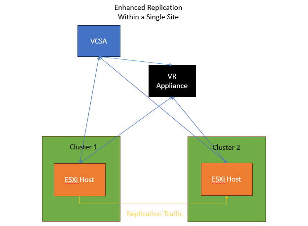

The downsides of using vSphere Replication in this way is that it requires vCenter to do the recovery of VMs, and if the outage impacts the vCenter server, then recovery becomes harder to do and could possibly require the assistance of VMware support.

### Installing vSphere Replication within OCVS

Contact Oracle Support for access to the vSphere Replication ISO.

Within the ISO there is an ovf and vmdk files that can be used for the deployment. So mount the ISO to gain access to the files

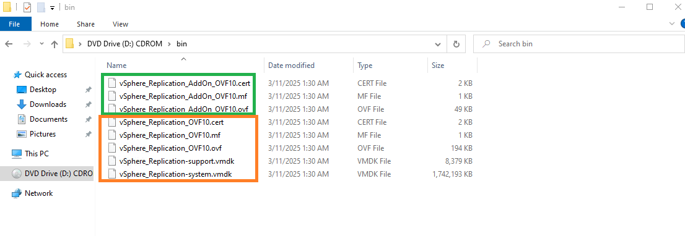

The files marked in Orange are used for the deployment of the first vSphere Replication Appliance (Manager), the Green files are used to deploy addon vSphere Replication Servers, to help with scaling the number of active replications. When you would need to do this would depend on the number of VMs you were replicating and the version of vSphere Replication you were running, as the scaling limits are likely to change with each major release.

Right lick on the host/cluster/resource pool within vCenter and select "Deploy OVF Template"

You will then be prompted to select the required files as shown below

You then follow the prompts, and you will eventually be asked to pick the network for the OVF deployment

You can put it in any network you like, as long as the required networking ports are allowed. The easiest option as per the screenshot below is to put it into the same network and the vSphere Management components.

You will then be required to fill in the deployment details such as admin/root passwords and networking IP details.

Once it has been deployed and powered on, you can then access the management interface on port 5480 as shown here using the admin/root login and password that was configured during the appliance deployment.

You will then have to configure vSphere Replication and connect it to the local vCenter/PSC.

You will accept the security certificate.

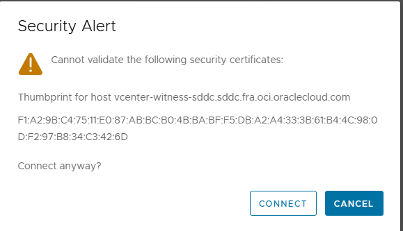

and configure the site name.

After it has been configured you will see the following

When you login vCenter you will see the Site Recovery Plugin has been deployed

**If at this point you see errors in vCenter regarding the plugin failed to download, this is most likely a DNS issue of some kind. If in OCI/OCVS please ensure the correct A records are present for the VR appliances in OCVS and on prem in the OCVS VCN. This way it ensures the vCenter can reach them correctly**

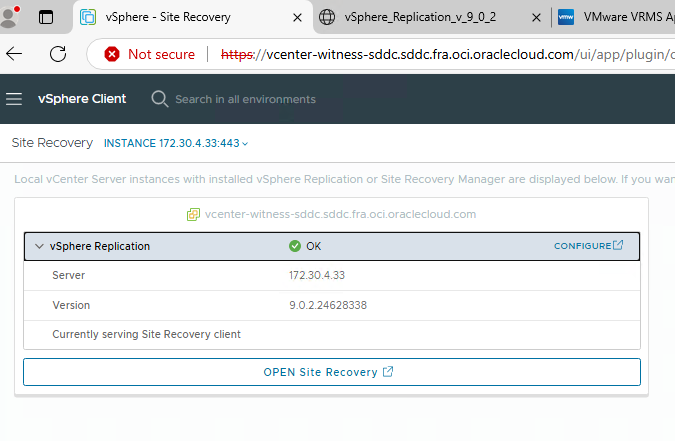

By default, you will have the option to configure replications within the same vCenter. 

**If you wish to do cross site replication for DR, you will follow these exact same steps at the remote site and then you would configure a pairing between sites.**

Once this has been completed you are able to configure a new site pairing between the 2 vCenters

You have the option to peer with a vCenter in the same or different SSO domain, with OCVS it is most likely that your vCenter servers/SDDCs will be in different vSphere SSO domains.

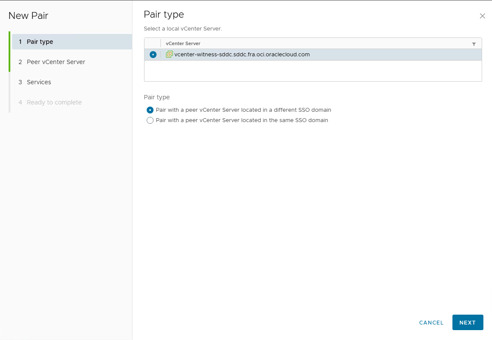

It will then check the remote vCenter and confirm that vSphere Replication has been installed and configured with that remote vCenter.

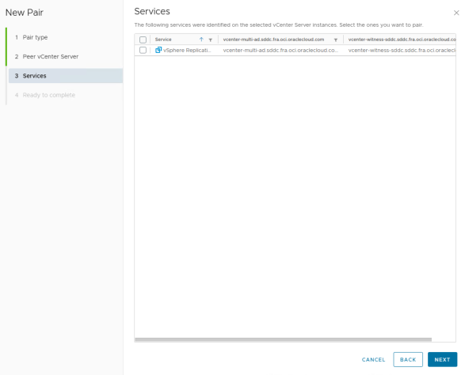

Once the pairing has completed successfully you will then be presented with the following screen, and you can login to start configuring replications

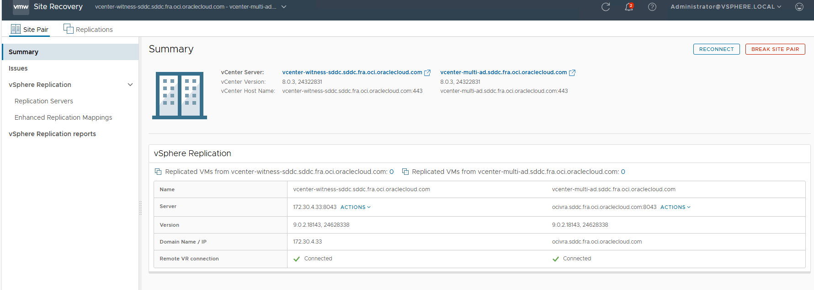

When configuring replications for VMs, you will be offered the choice between Standard and Enhanced Replication, the default should always be Enhanced for new replications.

You will select the VMs you wish to replicate and protect.

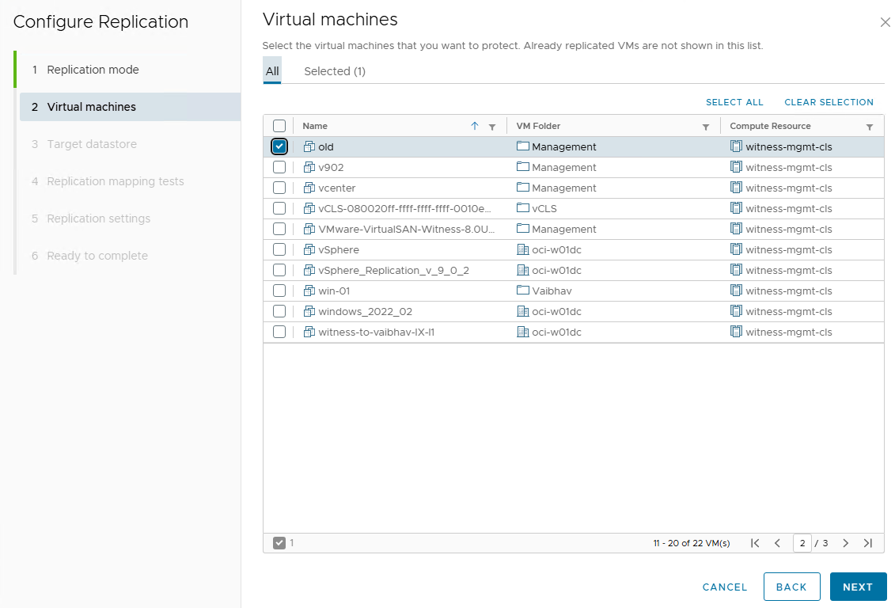

Select the destination datastore for the replicated VMDK and VM files

Test mappings to confirm there are no errors.

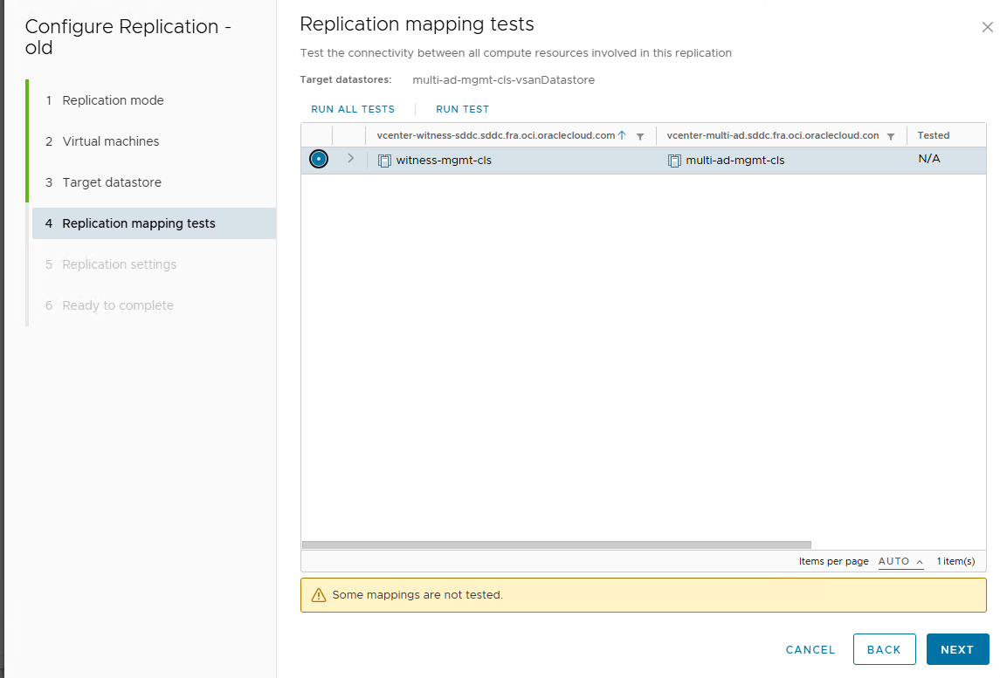

Configure replication settings such as RPO/Snapshots, compression and encryption.

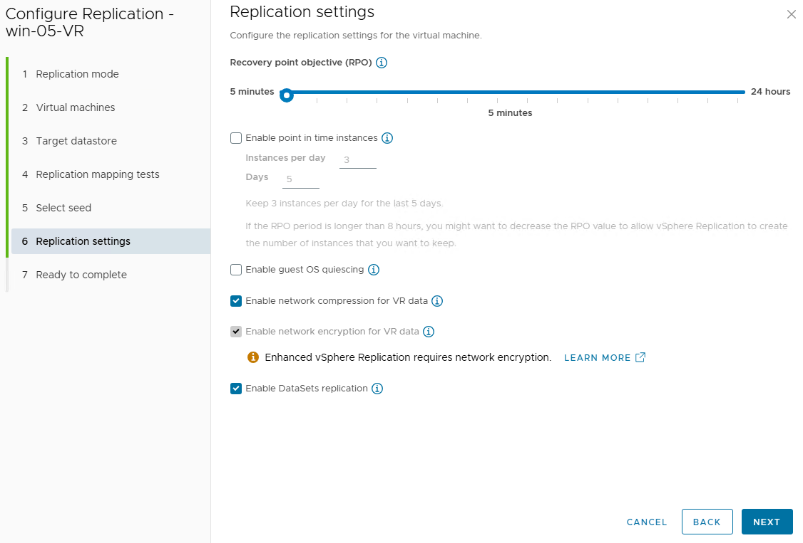

Once this has been completed you will see this screen

and in vCenter you will see the following

**If at this point the progress bar stays at 0%, or you get an error which states "No connection to VR Server" this is a routing/firewall issue.**

Troubleshooting steps are shown in this [kb](https://knowledge.broadcom.com/external/article/384776/no-connection-to-vr-server-for-virtual-m.html#:~:text=This%20issue%20typically%20has%20widespread,the%20network%2C%20firewall%2C%20etc.).

For within OCVS it is most likely because vmk3 is configured for replication but it is not routable, this works fine with the legacy replication option with VR but does not work for Enhanced Replication.

You have 3 options:

- Disable vSphere Replication on vmk3 and enable it on vmk0 which is also for management. This is the preferred option, as this will allow it to be routable. as long as the route table and NSG in the OCVS VCN allow it to be. Enhanced Replication is encrypted by default between the host at the source and the host at the destination so there is no need to worry about the data in transit, there should also be no bandwidth worries either as OCVS hosts have either 25/50/100Gb network adaptors.
- Create a new TCP/IP stack on every host for Replication. This would allow the VR traffic to be routable as well. Follow this [article](https://techdocs.broadcom.com/us/en/vmware-cis/vsphere/vsphere/8-0/vsphere-networking-8-0/setting-up-vmkernel-networking/create-a-custom-tcp-ip-stack.html)
- Use static routes on each ESXi host - This will force VR traffic to follow a specific route. Follow this [kb](https://knowledge.broadcom.com/external/article/308786/configuring-static-routes-for-vmkernel-p.html)

**Also Enhanced replications require TCP network connectivity on ports 31031 and 32032 from the ESXi hosts on which the replicated VMs are running to the ESXi hosts of the cluster containing the target datastore. Make sure your route tables and NSGs in the OCVS VCN are configured accordingly and the same is done for on prem (if required).**

**For further port connectivity info please visit [vSphere Replication - VMware Ports and Protocols](https://ports.broadcom.com/home/vSphere-Replication)**

### Failover

To failover a VM or multiple VMs, you must log into Site Recovery at the destination.

Then select the **Incoming Replications**, right click on the VM you want to recover and select **Recover.**

You will now be presented with 2 options:

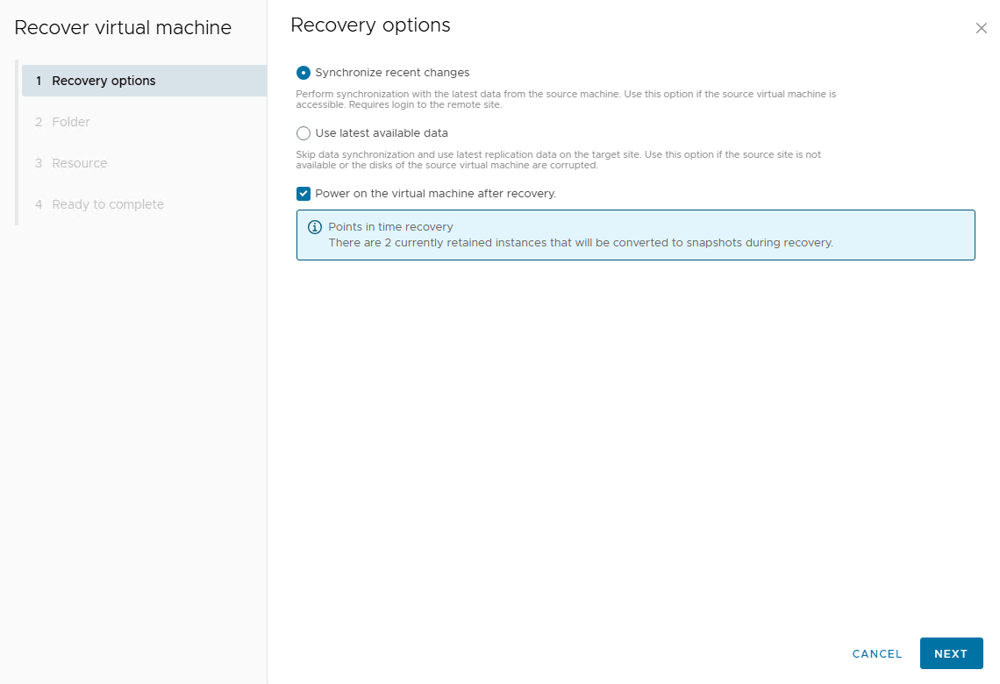

* Syncronise recent changes - This is if the source site is still active and the source VM is powered off. If both these requirements are met, it will do an offline sync and copy the changes from the last RPO sync, making sure you have the latest data available.

You have the option to have the VM power on after recovery, this is enabled by default but it is optional. As you will need to ensure there is no chance of MAC Address/IP conflicts.

If you do not meet the criteria as mentioned, you will be given an error message as follows:

You will then have to use option 2, which will use whatever data has already been replicated and recover using only this.

You can now decide on which folder the recovered VM will sit in under the destination vCenter

Now you can pick which cluster/host/resource pool the VM will sit in

As mentioned in the yellow box, the recovered VM will not be connected to any network, this is done to avoid all possible chances of conflict across the network. So as part of your recovery process you will have to connect the VMs vnic to the required network after the recover has completed.

The VM will now be added to the inventory in the vCenter and powered on if that option was selected. 

The vSphere Replication interface will now show it as a **Recovered VM**

In vCenter you will see the following tasks/events on the recovered VM

### Failback

Is a very similar process to failover.

At the destination side, where the VM was recovered to, you would select outgoing replications and configure a new replication.

If the original source VM is still in the inventory of the vCenter, you can remove it from the inventory *but do not delete from disk**. The vmdks can now be used as seeds, so only replicated changes need to be transferred minimizing the amount of time and b/w needed to get the replication running.

If this has been done correctly you will see the following information and be given the option to **select seeds**

vSphere Replication will automatically map the seed disks, but if for some reason it maps them incorrectly you can modify the selection. **please be careful as if you map them incorrectly it could cause unrecoverable data loss.**

Select the RPO schedule just as before.

Confirm everything and select **Finish.**

As the replication is being redone, you can monitor its progress and see how much data it is transferring along with its verification of the seed data

Thank you for joining me on this journey into vSphere Replication v9.x
