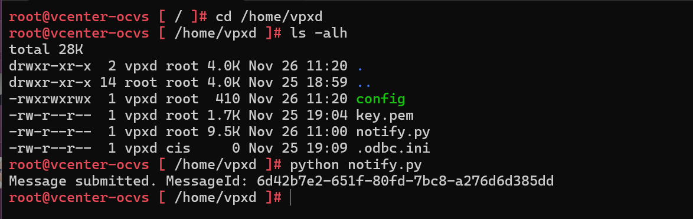
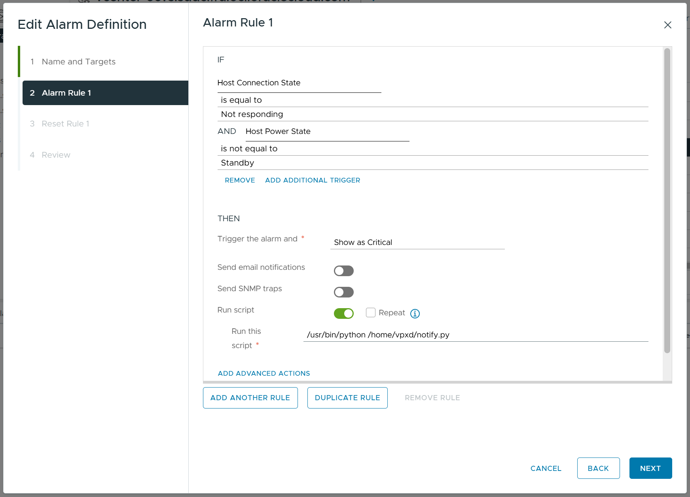
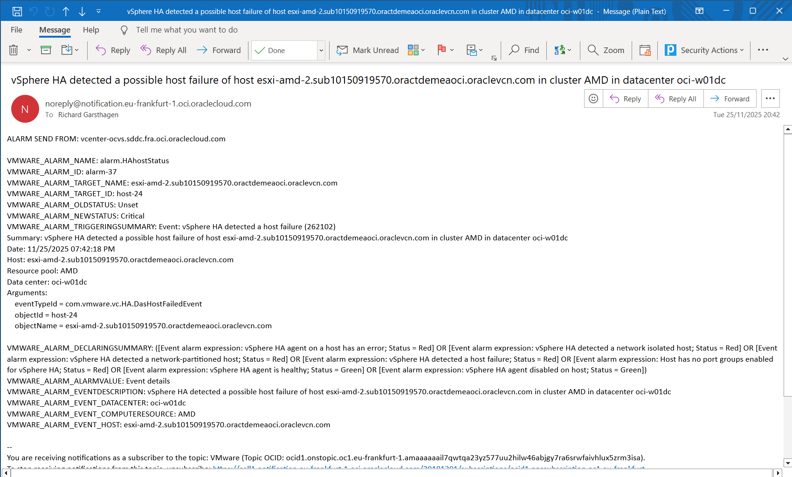

# OCI-OCVS-Notifications

This script enables integration between vCenter alarms and the OCI Notifications service. By forwarding vCenter alarms to OCI Notifications, you can more easily manage who receives notifications and choose from multiple notification protocols (such as email, Slack, custom webhooks, or PagerDuty) supported by OCI. This simplifies recipient management and extends the reach of your alerts beyond the vCenter infrastructure.

## Prerequisites
Before using this integration, ensure the following prerequisites are in place:

1. **OCI User with API Key**
   - You must have an OCI (Oracle Cloud Infrastructure) user with sufficient permissions to publish messages to Notifications topics.
   - Generate an API key for your user and add the public key to your OCI user in the OCI Console.
   - Download and securely store the corresponding private key. This key will be referenced in your config file (`key_file`).

2. **OCI Notification Topic**
   - Create an OCI Notifications topic in the desired compartment and region via the OCI Console.
   - Note the OCID of this topic; you will use it in the configuration (see example config).
   - Make sure to add subscribers to this topic, so that they will get informed about the notifications

You will also need to set up a config file (`/home/vpxd/config` by default) and supply a private key file. See this repository's example files for details on formatting.

## Install script on your vCenter Server
Login to your vCenter server using and SSH session.
### 1. Create the `/home/vpxd` directory

```bash
sudo mkdir /home/vpxd
sudo chown vpxd /home/vpxd
```

### 2. Copy the required files

Copy over the notify.py, config and your private key file to your vCenter server. You can do this using scp or just create a new file using vim and paste the code into that file.

Make sure the config, key.pem and notify.py have the right permissions
```bash
sudo chown vpxd /home/vpxd/*
sudo chmod 600 /home/vpxd/key.pem     # (recommended for private key security)
sudo chmod +x notify.py
```

- Ensure `/home/vpxd/config` contains the correct user, tenancy and topic OCIDs, have to correct fingerprint, region and keyfile reference
- The `key.pem` file should be your private key associated with your OCI user.

### 3. Test workings of the notify script

run the notify scrypt, if properly configured it will send out a dummy test notifcation



### 4. Configure the alarms in vCenter to use the script

In vcenter go to your alarm definitions and edit the alarms for which you want to send out an OCI notification. 

Some key example critical alarms:
- vSphere HA Host status
- Host connection and power state
- vSAN capacity utilization alarm 'Storage space'

Edit the alarm and on each alarm rule page, toggle the [run script] option and specify the script: /usr/bin/python /home/vpxd/notify.py




### 5. Example notifaction

If you have setup the Notification topic and for instance have an user subscribe to it using their email, they will receive an email notification for instance when a host goes down:




Script created by: richard.garsthagen@oracle.com, feedback is welcome! Please see the 'Issue' feature in GitHub.

Reviewed: 26.11.2025

# License

Copyright (c) 2025 Oracle and/or its affiliates.

Licensed under the Universal Permissive License (UPL), Version 1.0.

See [LICENSE](https://github.com/oracle-devrel/technology-engineering/blob/main/LICENSE.txt) for more details.


