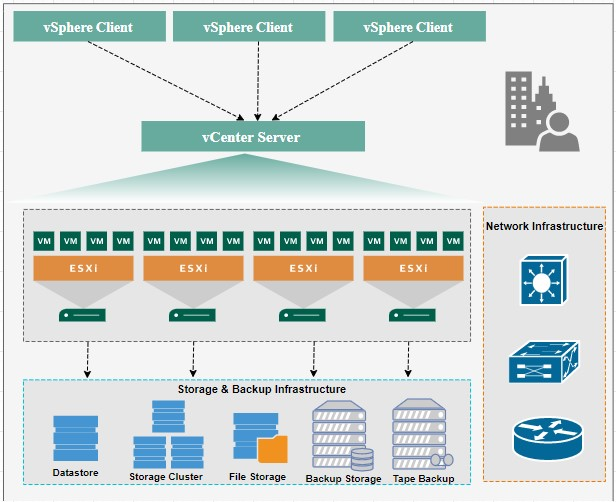
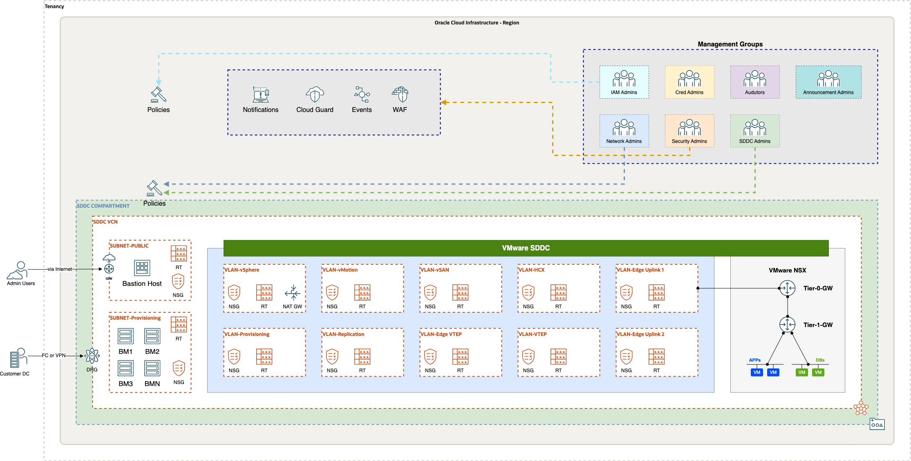
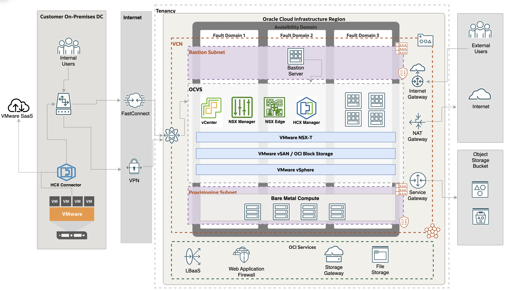
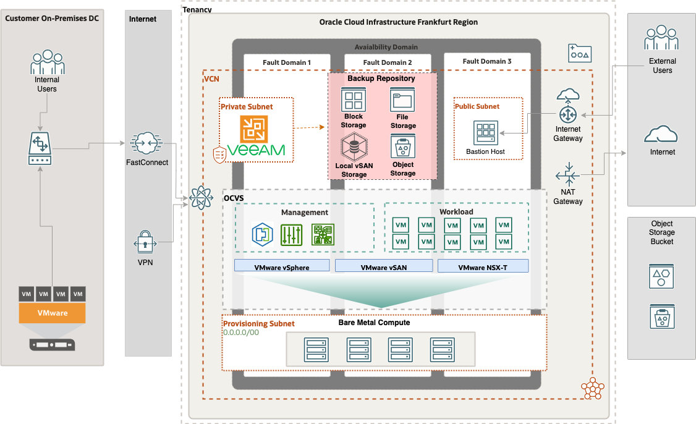
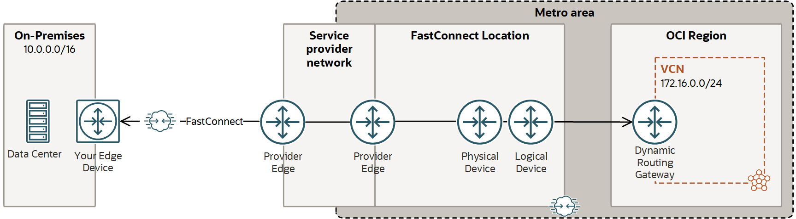
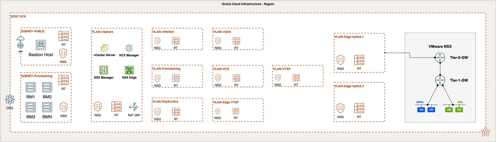
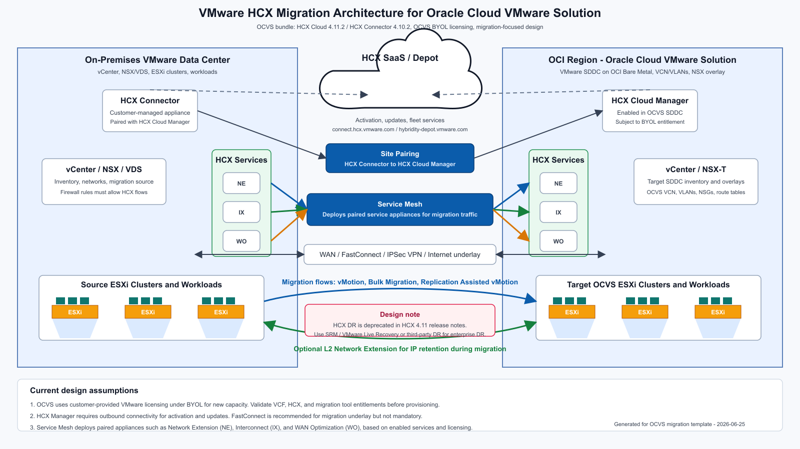

# Document Control

## Version Control

| Version | Author       | Date                 | Comment         |
|:--------|:-------------|:---------------------|:----------------|
| 1.0     | Name Surname | September 01st, 2022 | Initial version |

## Team

| Name         | E-Mail              | Role                              | Company |
|:-------------|:--------------------|:----------------------------------|:--------|
| Name Surname | example@example.com | Cloud VMware Solutions Specialist | Oracle  |
| Name Surname | example@example.com | Cloud VMware Solutions Specialist | Oracle  |

## Abbreviations and Acronyms

| Term  | Meaning                               |
|:------|:--------------------------------------|
| OCVS  | Oracle Cloud VMware Solution          |
| OCI   | Oracle Cloud Infrastructure           |
| VCN   | Virtual Cloud Network                 |
| DRG   | Dynamic Routing Gateway               |
| CPE   | Customer Premises Equipment           |
| FC    | OCI FastConnect Connection            |
| IPSec | OCI IPSec VPN Connection              |
| SL    | Security List                         |
| NSG   | Network Security Group                |
| RT    | Route Table                           |
| CMP   | Compartment                           |
| IGW   | Internet Gateway                      |
| NGW   | NAT Gateway                           |
| SGW   | Service Gateway                       |
| VM    | Virtual Machine                       |
| BM    | Bare Metal                            |
| VSS   | VMware vSphere Standard Switch        |
| VDS   | VMware vSphere Distributed Switch     |
| ESXi  | VMware vSphere Hypervisor (ESXi)      |
| VC    | VMware vCenter Server                 |
| vSAN  | VMware Virtual SAN (vSAN)             |
| NSX-T | VMware Network Virtualization (NSX-T) |
| HCX   | VMware Hybrid Cloud Extension (HCX)   |

## Document Purpose

This document provides a high-level solution definition for the Oracle solution. It describes the current state, the target state, and a potential high-level project scope and timeline for Oracle Cloud Lift.

The document may refer to a ‘Workload’, which summarizes the full technical solution for a customer (You) during a single engagement. The Workload is described in the chapter [Workload Requirements and Architecture](#workload-requirements-and-architecture).

This is a living document. Additional sections will be added as the engagement progresses, resulting in a final document to be handed over at the end of the Lift engagement.

# Business Context

*Example:*

A Company Making Everything is located in Frankfurt, Germany, and is the largest consumer electronics company. A Company Making Everything has 2500 employees at this location, generating millions of dollars in sales. There are subsidiaries under A Company Making Everything corporate family which contribute to overall sales for the parent organization.

A Company Making Everything is an existing Oracle Cloud customer and currently consumes various OCI services, such as networking, compute, storage, and databases, in the OCI Frankfurt region. The current production, test, development, and DMZ environments are hosted in on-premises infrastructure with physical and VMware servers. The customer has a cloud and digital transformation strategy and would like to exit the data center by moving on-premises workloads to the cloud.

The mission-critical application workloads are hosted primarily in VMware. The customer is looking for quick and seamless migration to the cloud with minimal interruption to the services. They have decided to use the Oracle Cloud VMware Solution for quick migration of the VMware workloads before their current data center contract expires. The Oracle Cloud VMware Solution offers flexible, highly scalable, and cost-effective solutions to host A Company Making Everything’s critical workloads without disrupting their core business.

## Executive Summary

## Workload Business Value

*Example:*

A Company Making Everything is running a strategic program in FY23 called EXAMPLE. As part of their initiative, one pillar is dedicated to their IT cost saving. A Company Making Everything is planning to reduce their IT estate spending by 15% in the current FY. Oracle can help A Company Making Everything by reducing the VMware deployment complexity and operations while optimizing IT costs. A Company Making Everything IT department wants to innovate other LoBs and enable quick-time-to-market for various applications and business needs. This allows A Company Making Everything to stay ahead in a competitive market.

Oracle Cloud VMware Solution is a customer-managed software-defined data center (SDDC) service that provides flexible infrastructure for mission-critical VMware workloads. Customers can move workloads from an on-premises VMware environment to Oracle Cloud VMware Solution by using VMware migration tooling such as HCX, subject to licensing, entitlement, compatibility, and lifecycle considerations. Because the VMware platform remains consistent, customers can reduce or avoid application refactoring and focus on their broader digital transformation journey.

# Workload Requirements and Architecture

## Overview

Oracle provides guidance for planning, architecting, prototyping, and managing cloud migrations. Customers can move critical workloads in weeks, or even days, instead of months by using these services.

Oracle will support A Company Making Everything in designing the target Oracle Cloud VMware Solution architecture based on customer business and technical requirements. Oracle will help move selected virtual machines from the on-premises VMware workload to Oracle Cloud Infrastructure in the INSERT REGION region.

**Thus, the objectives of this document are to:**

1.  Review the existing on-premises architecture, map it to relevant Oracle Cloud Infrastructure services, and propose a tailored high-level cloud architecture.
2.  Define the Oracle Cloud Lift Services scope to help A Company Making Everything to physically migrate the agreed workload to the target cloud platform.

**The goals of this document are to:**

The high-level goals for this document are:

1.  Provide architecture guidance aligned with A Company Making Everything's needs for the target OCI architecture.
2.  Fit the solution into the A Company Making Everything OCI ecosystem.
3.  Address Oracle Cloud VMware Solution design considerations across security, networking, compute, storage, operations, and related areas.
4.  Define the Oracle Cloud VMware Solution environment according to the agreed design and architecture.
5.  Define the potential Oracle Cloud Lift migration scope for the A Company Making Everything workload.

## Non-Functional Requirements

### Regulations and Compliance

At the time this document was created, no regulatory or compliance requirements were specified.

### Environments

| Environment | Target Size of VMs | Location | Scope           |
|:------------|:-------------------|:---------|:----------------|
| ENV NAME    | 100%               | LOCATION | Workload - Lift |
| ENV NAME    | 80%                | LOCATION | Workload - Lift |

### High Availability and Disaster Recovery Requirements

At the time this document was created, no high availability or disaster recovery requirements were specified.

### Security Requirements

At the time this document was created, no security requirements were specified.

## Current State Architecture

The current state architecture covers the current on-premises workloads.

### Current State IT Architecture (VMware)

A Company Making Everything's current environment runs in a data center (DC LOCATION) on hardware (HARDWARE MODELS) infrastructure and VMware vSphere Hypervisor (ESXi).

**The Current VMware footprint consists of:**

-   VMware vSphere with 7.0 release
-   VMware vSAN Storage (Optional)
-   VMware NSX or NSX-T as a networking solution (Optional)
-   Backup Solution

Below is the current high-level architecture of the customer's on-premises VMware environment.

### Current VMware Inventory On-premises

**VM resource allocations per location:**

| Location      | Type             | Total vCPU Cores | Total Memory (GB) | Used Storage (GB) | Total Storage (GB) |
|:--------------|:-----------------|:-----------------|:------------------|:------------------|:-------------------|
| Location Name | Virtual Machines | 550              | 1800              | 23580             | 30000              |
| Location Name | Virtual Machines | 550              | 1800              | 23580             | 30000              |

**Operating Systems:**

-   Windows Server 2019
-   Oracle Linux 8
-   Red Hat Linux
-   Windows Server 2008 R2

**Database Systems:**

-   Microsoft SQL AlwaysON
-   Microsoft SQL Cluster
-   Oracle 12c Database

### Total VMware Resources For All Locations

| Type             | Total vCPU Cores | Total Memory (GB) | Used Storage (GB) | Total Storage (GB) |
|:-----------------|:-----------------|:------------------|:------------------|:-------------------|
| Virtual Machines | 1100             | 3600              | 47160             | 60000              |

### Resource Utilization

| Core to vCPU Ratio | \% Avg. CPU Utilization | \% Avg. Memory Utilization |
|:-------------------|:------------------------|:---------------------------|
| 1:4                | 40 %                    | 70 %                       |

## Future State Architecture

### Mandatory Security Best Practices

The safety of the A Company Making Everything's Oracle Cloud Infrastructure (OCI) environment and data is the A Company Making Everything’s priority.

The following table of OCI Security Best Practices lists the recommended topics to provide a secure foundation for every OCI implementation. It applies to new and existing tenancies and should be implemented before the Workload defined in this document will be implemented.

Workload-related security requirements and settings like tenancy structure, groups, and permissions are defined in the respective chapters.

Any deviations from these recommendations needed for the scope of this document will be documented in the chapters below. They must be approved by A Company Making Everything.

A Company Making Everything is responsible for implementing, managing, and maintaining all listed topics.

<table style="width:25%;">
<colgroup>
<col style="width: 2%" />
<col style="width: 2%" />
<col style="width: 19%" />
</colgroup>
<thead>
<tr class="header">
<th>CATEGORY</th>
<th>TOPIC</th>
<th>DETAILS</th>
</tr>
</thead>
<tbody>
<tr class="odd">
<td>User Management</td>
<td>IAM Default Domain</td>
<td>
Multi-factor Authentication (MFA) should be enabled and enforced for every non-federated OCI user account.

<ul>
<li>For configuration details see <a href="https://docs.oracle.com/en-us/iaas/Content/Identity/mfa/understand-multi-factor-authentication.htm">Managing Multi-Factor Authentication</a>.</li>
</ul>

In addition to enforcing MFA for local users, Adaptive Security will be enabled to track the Risk Score of each user of the Default Domain.

<ul>
<li>For configuration details see <a href="https://docs.oracle.com/en-us/iaas/Content/Identity/adaptivesecurity/overview.htm">Managing Adaptive Security and Risk Providers</a>.</li>
</ul></td>
</tr>
<tr class="even">
<td></td>
<td>OCI Emergency Users</td>
<td>
A maximum of <strong>three</strong> non-federated OCI user accounts should be present with the following requirements:

<ul>
<li>Username does not match any username in the Customer’s Enterprise Identity Management System</li>
<li>Are real humans.</li>
<li>Have a recovery email address that differs from the primary email address.</li>
<li>User capabilities have Local Password enabled only.</li>
<li>Has MFA enabled and enforced (see IAM Default Domain).</li>
</ul></td>
</tr>
<tr class="odd">
<td></td>
<td>OCI Administrators</td>
<td>
Daily business OCI Administrators are managed by the Customer’s Enterprise Identity Management System. This system is federated with the IAM Default Domain following these configuration steps:

<ul>
<li>Federation Setup</li>
<li>User Provisioning</li>
<li>For configuration guidance for major Identity Providers see the OCI IAM Identity Domain tutorials.</li>
</ul></td>
</tr>
<tr class="even">
<td></td>
<td>Application Users</td>
<td>Application users like OS users, Database users, or PaaS users are not managed in the IAM Default Domain but either directly or in dedicated identity domains. These identity domains and users are covered in the Workload design. For additional information see <a href="https://docs.oracle.com/en-us/iaas/Content/cloud-adoption-framework/iam-security-structure.htm">Design Guidance for IAM Security Structure</a>.</td>
</tr>
<tr class="odd">
<td>Cloud Posture Management</td>
<td>OCI Cloud Guard</td>
<td>
OCI Cloud Guard will be enabled at the root compartment of the tenancy home region. This way it covers all future extensions, like new regions or new compartments, of your tenancy automatically. It will use the Oracle Managed Detector and Responder recipes at the beginning and can be customized by the Customer to fulfill the Customer’s security requirements.

<ul>
<li>For configuration details see <a href="https://docs.oracle.com/en-us/iaas/cloud-guard/using/part-start.htm">Getting Started with Cloud Guard</a>. Customization of the Cloud Guard Detector and Responder recipes to fit the Customer’s requirements is highly recommended. This step requires thorough planning and decisions to make.</li>
<li>For configuration details see <a href="https://docs.oracle.com/en-us/iaas/cloud-guard/using/part-customize.htm">Customizing Cloud Guard Configuration</a></li>
</ul></td>
</tr>
<tr class="even">
<td></td>
<td>OCI Vulnerability Scanning Service</td>
<td>
In addition to OCI Cloud Guard, the OCI Vulnerability Scanning Service will be enabled at the root compartment in the home region. This service provides vulnerability scanning of all Compute instances once they are created.

<ul>
<li>For configuration details see <a href="https://docs.oracle.com/en-us/iaas/scanning/home.htm">Vulnerability Scanning</a>.</li>
</ul></td>
</tr>
<tr class="odd">
<td>Monitoring</td>
<td>SIEM Integration</td>
<td>Continuous monitoring of OCI resources is key for maintaining the required security level (see <a href="#regulations-and-compliances-requirements">Regulations and Compliance</a> for specific requirements). See <a href="https://docs.oracle.com/en-us/iaas/Content/cloud-adoption-framework/siem-integration.htm">Design Guidance for SIEM Integration</a> to implement integration with the existing SIEM system.</td>
</tr>
<tr class="even">
<td>Additional Services</td>
<td>Budget Control</td>
<td>
OCI Budget Control provides an easy-to-use and quick notification on changes in the tenancy’s budget consumption. It will be configured to quickly identify unexpected usage of the tenancy.

<ul>
<li>For configuration details see <a href="https://docs.oracle.com/en-us/iaas/Content/Billing/Tasks/managingbudgets.htm">Managing Budgets</a></li>
</ul></td>
</tr>
</tbody>
</table>

### OCI Secure Landing Zone Architecture (OCVS)

The Oracle Cloud Infrastructure and Oracle Cloud VMware Solution networking and security services described above are implemented through a landing zone. The following diagram illustrates the landing zone reference architecture for Oracle Cloud VMware Solution.

This architecture is designed specifically for Oracle Cloud VMware Solution, which runs on Oracle Cloud Infrastructure core services such as Bare Metal Compute and Virtual Cloud Network resources. The architecture starts with tenancy compartment design, groups, and policies to support segregation of duties.

In the landing zone, the tenancy should have a dedicated compartment for the VMware SDDC deployment. An existing tenancy can be used, but the VMware SDDC environment should be separated from other Oracle Cloud Infrastructure resources. The VMware SDDC compartment is assigned to a group with the permissions required to manage resources in that compartment and access required resources in other compartments. As a best practice, create a dedicated compartment for the VCN used by Oracle Cloud VMware Solution so networking resources are isolated in their own compartment.

The VMware SDDC compartment is used to deploy the SDDC service. The SDDC network compartment hosts the dedicated VCN resources required to isolate VMware and network resources, and IAM policies control network resource access and management. The Oracle Cloud VMware Solution deployment workflow is automated and provisions the required compute and networking resources while maintaining the expected security posture.

The Oracle Cloud VMware Solution landing zone includes preconfigured networking resources such as subnets, VLANs, network security groups, security lists, and route tables to support the security posture required for enterprise VMware workloads. It also includes the Bare Metal Compute resources required for VMware hypervisor operation. VMware NSX is configured as the software-defined networking layer and is isolated in an overlay network zone.

Additional Oracle Cloud Infrastructure services such as Cloud Guard, Events, Notifications, and Web Application Firewall can be used to operate and monitor Oracle Cloud VMware Solution resources, including OCI Compute and OCI Networking resources. Notifications can be configured with topics and events to alert administrators about changes in deployed resources.

**Please note:** VMware workloads can integrate with selected Oracle Cloud Infrastructure services, subject to the design and connectivity model used for the VMware SDDC. The low-level landing zone design, including technical details specific to A Company Making Everything, will be provided during the architecture design discovery process. The SDDC network must not overlap with existing networks in the A Company Making Everything tenancy. With a /21 SDDC CIDR range, the SDDC can scale up to a maximum of 64 hosts.

**Note:** The following table shows a sample network layout for a /22 network. The actual VLAN network ranges are created automatically by the SDDC provisioning workflow and depend on the selected SDDC CIDR range. The SDDC workload CIDR will be identified as part of the low-level design during implementation.

| VLAN Name                   | CIDR Range    |
|:----------------------------|:--------------|
| Provisioning Subnet         | 10.0.0.0/26   |
| VLAN-SDDC-NSX Edge Uplink 1 | 10.0.0.64/26  |
| VLAN-SDDC-NSX Edge Uplink 2 | 10.0.0.128/26 |
| VLAN-SDDC-NSX Edge VTEP     | 10.0.0.192/26 |
| VLAN-SDDC-NSX VTEP          | 10.0.1.0/26   |
| VLAN-SDDC-vMotion           | 10.0.1.64/26  |
| VLAN-SDDC-vSAN              | 10.0.1.128/26 |
| VLAN-SDDC-vSphere           | 10.0.1.192/26 |
| VLAN-SDDC-HCX               | 10.0.2.0/26   |
| VLAN-SDDC-Replication Net   | 10.0.2.64/26  |
| VLAN-SDDC-Provisioning Net  | 10.0.2.128/26 |

### Physical Architecture

The future state architecture covers the current on-premises workloads that will be hosted on Oracle Cloud VMware Solution. Oracle Cloud VMware Solution is deployed in an availability domain within the selected Oracle Cloud Infrastructure region and spans three fault domains in that region. The OCI Bare Metal instances used by the service are distributed across fault domains in a round-robin pattern to provide redundancy for Oracle Cloud VMware Solution workloads. Oracle Cloud VMware Solution supports two primary architecture options:

-   Oracle Cloud VMware Solution with DenseIO shapes: This architecture primarily uses VMware vSAN storage backed by NVMe drives from the local Bare Metal servers.
-   Oracle Cloud VMware Solution with Standard Shapes: This architecture uses OCI Block Storage as the primary storage option for virtual machine workloads.

Bring Your Own License (BYOL) for Oracle Cloud VMware Solution is generally available and aligns Oracle Cloud VMware Solution with Broadcom's VMware Cloud Foundation (VCF) license portability model. Oracle discontinued new long-term license-included Oracle Cloud VMware Solution SKUs, including monthly, 1-year, and 3-year license-included options, effective March 22, 2026. New SDDCs could be deployed using the license-included model until March 21, 2026, and existing SDDCs could continue scaling out with hourly license-included hosts until May 20, 2026. After these dates, all new Oracle Cloud VMware Solution capacity must be provisioned using BYOL. Customers must bring, procure, register, allocate, and maintain the VMware licenses required for the selected SDDC architecture, including any migration, disaster recovery, backup, or operations tooling. Eligible VMware VCF subscription entitlements are registered in Oracle Cloud VMware Solution License Management, allocated to the target OCI region, and selected during SDDC provisioning, workload cluster creation, or ESXi host scale-out.

Oracle Cloud VMware Solution is the central component of this deployment. It provides an automated implementation of a VMware software-defined data center (SDDC) within the customer's Oracle Cloud Infrastructure tenancy. The solution runs on Oracle Cloud Infrastructure Bare Metal Compute and includes the following VMware components, subject to customer licensing and entitlement:

-   VMware vSphere Hypervisor (ESXi)
-   VMware vCenter Server
-   VMware vSAN
-   OCI Block Storage
-   VMware NSX-T
-   VMware HCX

The high-level Oracle Cloud VMware Solution-based cloud architecture for the A Company Making Everything target cloud deployment is shown below.

The architecture includes the following components:

**OCVS**

The **VMware SDDC** consists of vSphere (ESXi and vCenter), NSX-T, vSAN, and HCX. The SDDC can be deployed on OCI DenseIO shapes that provide vSAN storage, or on OCI Standard Shapes with OCI Block Storage as the primary storage option. The solution design must confirm the VMware Cloud Foundation, vSphere, vSAN, NSX, HCX, VMware Live Recovery, Site Recovery Manager, or other VMware entitlements required for the selected architecture and migration approach.

-   **VMware licensing** - New Oracle Cloud VMware Solution capacity is consumed with customer-provided VMware licenses under the BYOL model. The required VCF license allocations must be registered in Oracle Cloud VMware Solution License Management and available in the target OCI region before provisioning or scale-out.
-   **VMware HCX** - An application mobility platform designed to simplify application migration and workload rebalancing across data centers and clouds. HCX can support selected mobility use cases for VMware workloads to Oracle Cloud VMware Solution, subject to licensing, entitlement, compatibility, and lifecycle considerations.
-   **HCX Manager** - An appliance deployed in Oracle Cloud VMware Solution. HCX Manager is paired with the on-premises vCenter through HCX Connector.
-   **HCX Connector** - An appliance deployed with the on-premises vCenter Server and paired with HCX Manager in the cloud to provide the base configuration required for workload migration.
-   **VMware NSX-T** - The NSX-T Data Center implementation that provides software-defined networking for the SDDC stack. Migrated workloads can use NSX network segments. NSX-T provides networking and security services for Oracle Cloud VMware Solution environments, including load balancing, routing, switching, firewalling, and micro-segmentation.
-   **VMware vSAN** - A software-defined storage solution included with the Oracle Cloud VMware Solution SDDC. vSAN uses locally attached NVMe all-flash disks from each OCI Bare Metal server to provide shared storage for workloads.
-   **OCI Block Storage** - OCI Block Storage can be used as additional storage with a DenseIO SDDC alongside vSAN. In a Standard Shape Oracle Cloud VMware Solution environment, OCI Block Storage is the primary storage option.
-   **VMware vSphere** - Includes ESXi hosts and vCenter Server.
-   **FastConnect** - Oracle Cloud Infrastructure FastConnect is a dedicated, private, high-speed network connection between the A Company Making Everything data center and the selected Oracle Cloud Infrastructure region. FastConnect can be used to migrate workloads over the network.

## Solution Considerations

### High Availability and Disaster Recovery

#### OCVS Resilience and Recovery

Oracle Cloud VMware Solution is deployed in an availability domain within the selected OCI region. Each availability domain contains fault domains that support fault-tolerant and resilient designs. For more information about OCI availability domains and fault domains, see the [OCI documentation](https://docs.oracle.com/en-us/iaas/Content/General/Concepts/regions.htm).

Details of the Oracle Cloud Infrastructure SLAs are available at [OCI Service SLA](https://www.oracle.com/ae/cloud/sla/).

##### OCVS High Availability

This section describes VMware SDDC high availability.

**OCI Bare Metal Compute (ESXi):** OCI native services such as Bare Metal Compute and VCN resources are resilient cloud services. An OCI Bare Metal host failure can be addressed by replacing the faulty node with a new ESXi host in the cluster.

**OCI Bare Metal NVMe (vSAN):** The Oracle Cloud VMware Solution SDDC uses vSAN for the software-defined storage layer. vSAN failure to tolerate (FTT) policies help manage host failures and reduce the risk of data loss. Customers can use vSAN Storage Policy Based Management, including different RAID levels, to protect data.

**OCVS Networking (NSX-T):** The Oracle Cloud VMware Solution SDDC uses NSX-T to manage software-defined networking. NSX Edge nodes and NSX Managers are deployed redundantly to maintain high availability.

**OCI Block Storage:** OCI Block Storage provides backend data resiliency within the availability domain. When OCI Block Storage is used as the primary storage option with Oracle Cloud VMware Solution, RAID configuration is not required at the VMware layer; the design relies on the resiliency provided by Oracle Cloud Infrastructure.

#### OCVS Backup

This section describes a proposed backup architecture for A Company Making Everything workloads after migration to Oracle Cloud VMware Solution. Veeam Backup & Replication is shown as an example because it is commonly used with VMware environments. Other backup solutions, such as Commvault, can also be used where they meet the customer's recovery, retention, licensing, and support requirements.

The following diagram illustrates the proposed Veeam backup architecture for the A Company Making Everything application backup and restore requirements.

##### Architecture Components Overview

Veeam Backup & Replication integrates with VMware vCenter Server and provides backup and restore capabilities for virtual machines deployed in the SDDC, as well as selected instances deployed in OCI. The following list summarizes the backup components in the architecture.

-   **Veeam Backup Server** - Veeam Backup Server is a software suite installed on a Microsoft Windows operating system. It is recommended to deploy Veeam outside the SDDC cluster. The Veeam Backup Server will be installed on an OCI Compute instance running Microsoft Windows Server 2016 or later.

-   **MS SQL Cluster** - The Microsoft SQL cluster is required for the Veeam Backup Server database. The SQL nodes will be deployed in the same management subnet as the Veeam Backup Server and will use OCI native compute instances. Microsoft SQL Server will be deployed in high availability mode using Always On availability groups. This provides a redundant database layer for Veeam. The SQL nodes will be spread across fault domains.

**Note:** Depending on licensing requirements, an Oracle Cloud Marketplace image for Microsoft SQL Server can be used where appropriate. This must be discussed with the customer during implementation.

-   **Veeam Proxy** - The Veeam proxy is a core component of Veeam Backup & Replication. It sits between the data source and target, processes backup jobs, and moves backup traffic. It offloads work from the Veeam Backup Server and can improve performance, resulting in shorter backup windows. A default proxy can be used if no dedicated proxy is deployed, but a dedicated Veeam proxy is recommended for better backup performance. The proxy can be a Windows or Linux virtual machine inside the Oracle Cloud VMware Solution SDDC.

-   **Backup Repositories** - A backup repository is a storage location where Veeam stores backup files, virtual machine copies, and metadata for replicated virtual machines. The following storage types can be used:

1.  **Direct Attached Storage (DAS):** Virtual and physical servers can be added as backup repositories. An OCI Compute instance running Microsoft Windows Server 2016 or later with attached OCI Block Volumes can be used as direct attached storage. This is considered a performance tier and is recommended for better backup and restore performance. A virtual machine with vSAN local storage disks can also be used as DAS, but this is not recommended because it can introduce a single point of failure.

2.  **Network Attached Storage (Optional):** OCI File storage service NFS v3 service can be used as a Network Attached Storage.

3.  **Object Storage:** Cloud storage services can be used as backup repositories. OCI Object Storage is S3 compatible and can be used as a scale-out repository capacity tier or as a direct backup repository. The Object Storage scale-out repository can be configured to keep an immediate copy of the backup or copy data on a defined schedule. OCI Block Storage attached to a compute instance is recommended as the primary storage option for virtual machine backups when higher backup and restore performance is required. Object Storage should be considered for capacity tier, long-term retention, and archival use cases.

**Important Notes:**

-   Sizing requirements and design considerations should follow official Veeam documentation.
-   A Company Making Everything will bring its own Veeam license. A Company Making Everything can discuss available Veeam license options directly with Veeam and choose the option that meets its requirements.
-   A Company Making Everything can choose its preferred backup tool, and Oracle can assist in architecting the required backup solution.

### Security

#### OCI - Oracle and Customer Shared Security Model

Oracle employs best-in-class, enterprise-grade security technology, and operational processes to secure cloud services. To deploy and operate your workloads securely in Oracle Cloud, you must be aware of your security and compliance responsibilities.

Oracle ensures the security of cloud infrastructure and operations, such as cloud operator access controls and infrastructure security patching. You’re responsible for configuring your cloud resources securely. The following graphic illustrates the shared security responsibility model.

**OCVS specific Responsibility Matrix**

Oracle is solely responsible for all aspects of the physical security of the Availability Domains and Fault Domains in each region. Both Oracle and you are responsible for the infrastructure security of hardware, software, and the associated logical configurations and controls.

As a customer, your security responsibilities encompass the following:

-   The platform you create on top of Oracle Cloud.
-   The applications that you deploy.
-   The data that you store and use.
-   The overall governance, risk, and security of your workloads.

The shared responsibility extends across different domains including identity management, access control, workload security, data classification and compliance, infrastructure security, and network security.

#### OCVS Security Posture

The section below describes the security posture of Oracle Cloud VMware Solution and Oracle Cloud Infrastructure.

-   Access to the customer's OCI tenancy is restricted and controlled using IAM and identity federation. Network sources can optionally restrict access to known IP addresses from a VCN or on-premises network.

-   Subnet security can be controlled by security lists and network security groups. OCI follows a zero-trust model by default, so traffic must be explicitly allowed for known communication patterns. OCI Web Application Firewall can provide additional protection for customer-facing applications.

-   VLANs reside in the VCN and are provisioned for the Oracle Cloud VMware Solution service. Each VLAN is attached to a network security group to control traffic. Traffic within a VLAN is blocked by default until required rules are configured.

-   An NSX segment is an overlay network that runs on top of the VMware virtualization stack. This network is independent of the VCN network. Communication from an NSX overlay segment to OCI resources must be explicitly allowed through uplink interfaces, routing, and security rules.

-   Security within an NSX segment is managed by the NSX-T control plane. By default, traffic inside a segment is allowed. NSX micro-segmentation can improve network agility and operational efficiency while maintaining a strong security posture.

-   Users from an on-premises environment can securely connect to Oracle Cloud VMware Solution resources through IPSec VPN or FastConnect.

-   A bastion host can be deployed in a public subnet in the customer's tenancy. Secure Remote Desktop Protocol (RDP) access is allowed through an internet gateway and controlled by security rules.

-   Access to the Oracle Cloud VMware Solution SDDC environment should be allowed only from approved administrative entry points, such as the bastion host.

#### OCVS Data Security

This section describes data security for virtual machines in the Oracle Cloud VMware Solution environment. It explains how encryption works with vSAN and outlines options for data at rest and data in transit. If no customer-specific data security requirements have been received, this section describes the default data security capabilities available with Oracle Cloud VMware Solution.

**vSAN Data-At-Rest**

Oracle Cloud VMware Solution uses VMware vSAN technology for virtual machine storage management. vSAN provides data-at-rest encryption for data stored in the vSAN datastore. vSAN data-at-rest encryption requires an external Key Management Server (KMS) or a vSphere Native Key Provider. vSAN data-at-rest encryption is out of scope for this project. However, customers can enable data-at-rest encryption at the cluster level later, provided the required prerequisites are met.

**vSAN Data-in-Transit**

Oracle Cloud VMware Solution uses VMware vSAN technology for virtual machine storage management. vSAN can encrypt data in transit as it moves between hosts in the vSAN cluster. When data-in-transit encryption is enabled, vSAN encrypts all data and metadata traffic between hosts. Traffic between data hosts and witness hosts is also encrypted. vSAN data-in-transit encryption is out of scope for this project. However, the customer can enable this capability at the vSAN cluster level in the Oracle Cloud VMware Solution SDDC.

**Block Storage Encryption**

OCI Block Storage can be used to scale storage for DenseIO Oracle Cloud VMware Solution deployments and as primary storage for Standard Shape Oracle Cloud VMware Solution deployments. OCI Block Volumes are presented to VMware ESXi hosts as iSCSI targets for storing virtual machine files. OCI security features such as Key Management, encryption, and Vault apply to virtual machine data stored on OCI Block Volumes. OCI Block Volumes are mounted as external datastores for the VMware SDDC and can use Oracle-managed or customer-managed keys for virtual machine data encryption.

### Networking

The architecture includes the following components:

-   **On-premises Network** - The local network used by the organization. It is one of the spokes in the topology.

-   **Region** - An Oracle Cloud Infrastructure region is a localized geographic area that contains one or more data centers, called availability domains. Regions are independent from one another and can be separated by large geographic distances.

-   **Virtual Cloud Network (VCN)** - A customizable private network in an Oracle Cloud Infrastructure region. Like traditional data center networks, VCNs provide control over the network environment. VCNs can be segmented into subnets that are regional or availability domain-specific. Both subnet types can coexist in the same VCN, and each subnet can be public or private.

-   **Security List** - A set of subnet-level security rules that specify the source, destination, and type of traffic allowed into and out of the subnet.

-   **Network Security Group (NSG)** - NSGs act as virtual firewalls for your cloud resources. With the zero-trust security model of Oracle Cloud Infrastructure, all traffic is denied, and you can control the network traffic inside a VCN. An NSG consists of a set of ingress and egress security rules that apply to only a specified set of VNICs in a single VCN.

-   **Route Table** - A set of rules that routes traffic from subnets to destinations outside a VCN, typically through gateways.

-   **Dynamic Routing Gateway (DRG)** - A virtual router that provides a private network path between a VCN and networks outside the region, such as another OCI region, an on-premises network, or another cloud provider.

-   **Bastion Host** - A compute instance that provides a secure, controlled administrative entry point from outside the cloud. The bastion host is typically provisioned in a demilitarized zone (DMZ). It helps protect sensitive resources by keeping them in private networks that cannot be accessed directly from outside the cloud. This gives the topology a known entry point that can be monitored and audited.

-   **VPN Connect** - VPN Connect provides site-to-site IPSec VPN connectivity between your on-premises network and VCNs in Oracle Cloud Infrastructure. The IPSec protocol suite encrypts IP traffic before the packets are transferred from the source to the destination and decrypts the traffic when it arrives.

-   **FastConnect** - Oracle Cloud Infrastructure FastConnect provides an easy way to create a dedicated, private connection between your data center and Oracle Cloud Infrastructure. FastConnect provides higher-bandwidth options and a more reliable networking experience when compared with internet-based connections.

#### Network connectivity options (on-premises to OCI)

##### IPSec VPN

The following diagram of a reference architecture shows how to set up a Virtual Private Network (VPN) to connect to a customer's on-premises network and VCN.

The IPSec VPN architecture includes the following components:

-   **VPN Connect** - The OCI service function that manages IPSec VPN connections to the tenancy.

-   **Customer-Premises Equipment (CPE)** - An object that represents the network asset in the on-premises network that establishes the VPN connection. Most border firewalls can act as the CPE, but a separate appliance or server can also be used.

-   **Internet Protocol Security (IPSec)** - A protocol suite that encrypts IP traffic before packets are transferred from the source to the destination.

-   **Tunnel** - A connection between the CPE and Oracle Cloud Infrastructure.

-   **Border Gateway Protocol (BGP) routing** - Enables dynamic route learning. The DRG dynamically learns routes from the on-premises network and advertises the VCN subnets from the Oracle side.

-   **Static Routing** - Requires the networks on each side of the VPN connection to be defined manually. Route changes are not learned dynamically.

IPSec VPN will provide connectivity between the A Company Making Everything data center and the Oracle Cloud Infrastructure region for standard day-to-day operational purposes. Based on the current information, the IPSec connection is already established.

##### FastConnect

The following reference architecture diagram shows how to set up a FastConnect connection between your on-premises network and Virtual Cloud Network (VCN).

-   **Border Gateway Protocol (BGP) routing** - Enables dynamic route learning. The DRG dynamically learns routes from the on-premises network and advertises the VCN subnets from the Oracle side.

-   **Private Peering** - Extends existing infrastructure by using private IP addresses.

-   **Public Peering** - Allows public Oracle Cloud Infrastructure services to be accessed using a private connection instead of the internet.

-   **Virtual Circuit** - The private path used to connect on-premises environments and Oracle Cloud Infrastructure. It can include multiple physical or logical lines, depending on the requirements and the provider's capabilities.

FastConnect will provide connectivity between the A Company Making Everything data center and the selected Oracle Cloud Infrastructure region during virtual machine migration from on-premises VMware to Oracle Cloud. FastConnect is required at least for the duration of workload migration.

##### OCVS Specific Networking Configuration Within OCI

Oracle Cloud VMware Solution networking is organized into virtual cloud networks, subnets, and VLANs. Each VLAN within the VCN is attached to a network security group for traffic control and a route table for routing. Similarly, the subnet created during the SDDC provisioning workflow is attached to a security list and route table.

##### OCI Virtual Cloud Network (VCN) for OCVS

All Oracle Cloud VMware Solution SDDC resources are deployed in a single VCN. A VMware SDDC requires at least a /24 network CIDR. A dedicated /16 VCN CIDR block is recommended to support future network growth.

| VCN                      | CIDR Range              |
|:-------------------------|:------------------------|
| VCN Name                 | 10.0.0.0/16             |
| SDDC CIDR                | 10.0.0.0/21             |
| Workload CIDR (Optional) | 192.168.10.0/24 (NSX-T) |

Oracle Cloud VMware Solution networking resources, including subnets, VLANs, network security groups, route tables, and gateways, are created as part of the SDDC provisioning workflow. The CIDR ranges for management VLANs depend on the size of the SDDC CIDR. Network design considerations should be assessed carefully before provisioning the Oracle Cloud VMware Solution environment.

### Operating Model, Monitoring, and Management

This section describes management and monitoring capabilities for Oracle Cloud VMware Solution. Customers can use VMware Aria Operations, formerly vRealize Operations, or other compatible operations tooling to monitor the Oracle Cloud VMware Solution environment, subject to licensing and entitlement. Operations tooling can provide dashboards and metrics for availability, performance, and capacity to support day-to-day operations. The following are examples of common benefits.

-   Application-aware monitoring across SDDC and multiple clouds.
-   Cloud Planning, capacity optimization, and compliance.
-   Automated and proactive workloads management.

Customers can also extend existing on-premises operations tooling to Oracle Cloud VMware Solution where supported. Existing automation and logging tools can also be used with the Oracle Cloud VMware Solution SDDC, such as VMware Aria Operations for Logs, formerly vRealize Log Insight, and VMware Aria Automation, formerly vRealize Automation.

**Important note:** Customers must bring or procure the required licenses for VMware operations tooling. Licensing, entitlement, support, and SaaS availability must be validated with Broadcom or an authorized VMware partner.

#### OCVS Support

-   Oracle will provide tier one and tier two support for Oracle provided versions of VMware components (vSphere, vCenter, vSAN, NSX) on Oracle Cloud Infrastructure. Tier three support cases will be routed to VMware via a warm hand-off from Oracle.
-   Support does not extend to other VMware products, nor does it extend to on-premises instances of VMware or configurations that are not listed in the VMware SCL as being supported by combinations of operating systems, VMware hypervisor versions, and VMware agent configurations.

### OCVS Migration

This section describes the migration options and tools used to migrate mission-critical workloads to Oracle Cloud VMware Solution.

VMware HCX is an application mobility platform that enables migration and workload rebalancing between an on-premises VMware environment and an Oracle Cloud VMware Solution SDDC. HCX licensing must be reviewed as part of the customer's VMware BYOL position. The licensing and entitlement model can vary by VMware software bundle, Oracle Cloud VMware Solution shape, and commercial agreement. Do not assume that HCX or other VMware components are license-included with Oracle Cloud VMware Solution.

Evaluate the HCX license level against the required migration and mobility features before selecting the migration approach. For more information about HCX license differences, see the following documentation:

[VMware HCX Licensing](https://www.vmware.com/content/dam/digitalmarketing/vmware/en/pdf/products/hcx/vmw-hcx-licensing-and-packaging-solution-overview.pdf)

**Please note:** Check the VMware interoperability matrix to confirm VMware HCX compatibility with the source vSphere environment.

VMware HCX is a common approach for migrating VMware workloads to Oracle Cloud VMware Solution. However, third-party tools such as Zerto, RackWare, and Veeam can also be evaluated where they better align with customer migration, replication, recovery, licensing, or operational requirements.

HCX offers different key features and migration options, subject to licensing and entitlement.

#### Migration Architecture with OCVS

The architecture diagram shows the overall HCX migration architecture.

#### HCX Features and Migration Options

The following features are commonly associated with HCX migration designs. Confirm availability against the customer's VMware license entitlements and the supported HCX version before implementation.

-   Migration
-   Disaster Recovery, subject to lifecycle and support considerations
-   Network Extension

##### Migration Options with VMware HCX

**vMotion** - Allows live migration of a virtual machine from the source environment to Oracle Cloud VMware Solution. Depending on HCX license entitlement and version, this may be a serial migration and may not allow parallel live migration of multiple virtual machines. Confirm HCX capabilities and licensing before selecting this method.

**Bulk Migration** - Enables parallel migration of multiple virtual machines. The virtual machines incur downtime equivalent to the restart of the virtual machine on Oracle Cloud VMware Solution. The source virtual machine is preserved and powered off at the source. When there are no changes at the source, HCX powers on the target virtual machine and shuts down the source. The failover operation is orchestrated by HCX.

**Disaster Recovery** - Uses similar replication technology to bulk migration and supports replication with configurable RPOs, controlled failover, reprotection, and failback operations. According to Broadcom HCX release notes, HCX Disaster Recovery has been deprecated and is planned for removal in a future release. It should not be selected as the strategic disaster recovery platform for new enterprise designs unless the customer has explicitly accepted the lifecycle and support implications. For enterprise disaster recovery and business continuity, evaluate VMware Site Recovery Manager as part of the [VMware Live Recovery](https://www.vmware.com/products/cloud-infrastructure/advanced-services/live-recovery) portfolio, or third-party solutions such as Zerto, RackWare, and Veeam.

##### Network Extension

Network Extension enables L2 network extension from on-premises environments to Oracle Cloud VMware Solution. It is commonly used to preserve the same IP addresses for migrated virtual machines. The requirement for network extension should be carefully evaluated because it can affect migration sequencing, routing, security controls, latency, operations, and rollback planning.

## Sizing and Bill of Materials

### Target OCVS Architecture Sizing

Sample sizing of the OCVS environment is depicted in the table below.

| OCVS Hosts | Shape       | Physical Cores | Logical Cores | CPU to vCPU Ratio | OCVS Utilization | vCPU | vMEM (GB) | vSAN (TB)          |
|:-----------|:------------|:---------------|:--------------|:------------------|:-----------------|:-----|:----------|:-------------------|
| 3+1        | DenseIO2.52 | 208            | 416           | 1:2               | 80%              | 665  | 2457      | 122 (FTT1 - RAID1) |

**OR**

| OCVS Hosts | Shape           | Physical Cores | Logical Cores | CPU to vCPU Ratio | OCVS Utilization | vCPU | vMEM (GB) | OCI Block Storage (TB)                    |
|:-----------|:----------------|:---------------|:--------------|:------------------|:-----------------|:-----|:----------|:------------------------------------------|
| 3+1        | BM.Standard3.48 | 192            | 384           | 1:2               | 80%              | 665  | 2457      | 8 TB Management(default) + 50 TB Workload |

### Summary Of Target Architecture Sizing

-   The calculation is based on the current compute and storage resources. The 4-node cluster can satisfy the required resources.
-   1 host failure will allow the customer a rebuild capacity in case of failure.
-   This is a mixed environment between physical nodes and VMware virtual machines; oversubscription details are not relevant to the proposed sizing.
-   We have considered a 1:2 core-to-vCPU ratio, which provides strong performance for converted physical workloads and VMware workloads.
-   Oracle Cloud VMware Solution compute offers flexible DenseIO and Standard Shapes for sizing current capacity requirements.
-   It is recommended to start with a 4-node cluster and add servers on demand as needed.
-   Block Storage with Oracle Cloud VMware Solution DenseIO allows storage to scale without adding server capacity.
-   Oracle Cloud VMware Solution deployments with Standard Shapes use Block Storage as the primary storage option.

**BoQ Notes:**

1.  New Oracle Cloud VMware Solution capacity must use the BYOL model. Existing eligible VMware VCF subscription entitlements must be validated with Broadcom or an authorized VMware partner, registered in Oracle Cloud VMware Solution License Management, allocated to the target OCI region, and selected during SDDC provisioning, workload cluster creation, or ESXi host scale-out.
2.  Long-term license-included Oracle Cloud VMware Solution SKUs, including monthly, 1-year, and 3-year license-included options, were discontinued effective March 22, 2026. New SDDCs could be deployed using the license-included model until March 21, 2026, and existing SDDCs could continue scaling out with hourly license-included hosts until May 20, 2026. After these dates, all new Oracle Cloud VMware Solution capacity must be provisioned using BYOL.
3.  HCX, VMware Live Recovery, Site Recovery Manager, Veeam, Zerto, RackWare, and any other migration, disaster recovery, backup, or operations tooling must be licensed according to the customer's entitlement and vendor agreement. Do not assume any VMware component is included with Oracle Cloud VMware Solution unless validated during commercial and technical discovery.

| Part \# | Product Name                                     | Metric                                  | Quantity |
|:--------|:-------------------------------------------------|:----------------------------------------|:---------|
| XXXXXX  | Oracle Cloud VMware Solution BYOL capacity       | OCPU per Hour                           | 208      |
| XXXXXX  | Windows Bastion Host VM.Standard.2.2             | OCPU Per Hour                           | 1        |
| B91628  | OCI Object Storage                               | Gb per month                            | 52000    |
| B91627  | OCI Object Storage Requests                      | 10K requests per month (first 50k free) | 1        |
| B91961  | OCI Block Volume Storage                         | Gb per month                            | 20000    |
| B91962  | OCI Block Volume Performance Units               | Gb per month                            | 200000   |
| XXXXX   | OCI FastConnect 1 x 10 Gbps                      | Port per hour                           | 1        |

# Project Implementation (Only for Oracle Implementations!)

## Solution Scope

### Disclaimer

As part of the Oracle Lift Project, any scope needs to be agreed upon by both the customer and Oracle. A scope can change but must be confirmed again by both parties. Oracle can reject scope changes for any reason and may only design and implement a previously agreed scope. A change of scope can change any previously agreed milestone and needs to be technically feasible.

All items not explicitly stated to be within the scope of the Lift project will be considered out of scope. Oracle recommends the use of professional services to implement extensions or customizations beyond the original scope, as well as to operate the solution, with an Oracle-certified partner.

### Overview

Below is a suggested outline for the Workload Architecture and Oracle Cloud Lift engagement in the context of A Company Making Everything VMs migration to OCI.

-   **Workload Architecture**

This team is involved in the production of specific implementation deliverables, as well as with the respective tasks for information gathering, document production, review, etc. The deliverables of this team are used as input for the implementation tasks, architecture governance, and any respective business case evaluation.

-   **Cloud Lift Services**

This team is responsible for setting up a target SDDC environment and the technical work performed during the migration that in case of A Company Making Everything will consist of the deployment of the agreed scope of the target workload. These services will be delivered by a combination of on-shore and off-shore Oracle resources.

### Business Value

The Oracle Lift service brings several benefits to this project. All the activities mentioned within the scope will ensure the deployment of workload as per Oracle's best practices. As a tried and tested methodology by many customers, Oracle Lift brings the speed of deployment resulting in successful projects without any setbacks. Oracle Lift services will bring value to the overall project provisioning OCI environments for the application workload.

Oracle Cloud Lift services provide guidance from cloud engineers and project managers on planning, project management, architecting, deploying, and managing cloud migrations.

### Success Criteria

The project success criteria are based on the deployment and configuration of the Oracle Cloud VMware Solution in the Customer's Oracle Cloud Infrastructure tenancy. A Company Making Everything applications and database servers will be migrated to Oracle Cloud VMware Solution within the agreed scope and migration window and prepared to execute in this new technical environment. A Company Making Everything will be provided with the knowledge needed to be able to independently operate the environment.

## Workplan

### Deliverables

The following are the project deliverables:

-   Workload architecture document.
-   Knowledge sharing session.

### Included Activities

The high-level Lift scope includes:

-   Deploy VMware SDDC as per design.
-   Assist in setting up the FastConnect connection.
-   Agreed scope of workload migration.

The following high-level Activities will be carried out by Lift:

-   OCI Foundation Setup required for OCVS deployment in the decided Region with Bastion Service
-   One FastConnect setup between on-premises and OCI before migration.
-   Provision one Compute Windows Bastion Host to manage OCVS environment
-   Single Oracle Cloud VMware Solution setup on OCI with the agreed number of ESXi hosts.
-   Configuration of on-premises connectivity for VMware migration to the Oracle Cloud VMware Solution environment.
-   Configure and implement VMware HCX required for migration and network extension, subject to customer licensing and entitlement.
-   Configure and implement the agreed backup solution as part of the design.
-   Validate migration with a test source virtual machine migration to Oracle Cloud VMware Solution using VMware HCX.
-   Any additional tooling to support overall migration as agreed in the design.

### Recommended Activities

-   HCX setup between on-premises and Oracle Cloud VMware Solution, subject to customer licensing and entitlement.
-   DR/HA setup
-   IPSec VPN setup between on-premises and OCI.
-   Installation and configuration of custom or third-party applications and operating systems on deployed virtual machines.
-   Rewiring/Integration of application and database is the customer's responsibility
-   Creation of image templates on Oracle Cloud VMware Solution.
-   Migration of Windows Server 2003 Enterprise physical servers to Oracle Cloud VMware Solution.
-   Source server IP retention for migrated virtual machines at the OCI or Oracle Cloud VMware Solution target.
-   Active Directory and DNS Server Setup in OCI
-   Operating system administration including the operating system itself or any operating system features or components. Management of any required changes to virtual machines, operating systems, custom or third-party applications, databases, and administration of general network changes within Customer control.
-   Remediation work associated with any problems resulting from the content, completeness, accuracy, and consistency of any data, materials, or information supplied by the Customer
-   Any new or existing customizations, features modifications, and/or integration with other products
-   Troubleshooting of existing open issues, including the performance of applications
-   Installation and configuration of third-party software or other technical services that do not apply to Oracle Cloud VMware Solution.
-   Configuration of VMware products used for the service other than those implemented for the mutually agreed use cases.
-   Customer solution training other than the defined knowledge transfer session, Training on deployed products and Cloud Services
-   Backup configuration of third-party tools with Oracle Cloud VMware Solution.
-   Physical servers from the customer's on-premises IT infrastructure.
-   IDCS integration with Active Directory for Customer's OCI tenancy.
-   24/7 Support coverage and Post Migration support
-   Load testing, performance benchmarking, testing, and tuning of any component in the solution.
-   Architecture and design changes, after the agreed design.
-   Operational monitoring and management design.
-   Third Party Security and Monitoring tools implementation or integration
-   Server Hardening, Audit certification, Vulnerability Assessment, and Penetration Testing
-   Program management (outside of Lift scope), Business readiness, cut-over planning.

### Timeline

### Implementation RACI

The table below provides a responsibility matrix between Oracle and Customer, with regards to various tasks and roles required for the completion of the project.

| SN  | Activity Details                                                          | ORACLE | Customer |
|:----|:--------------------------------------------------------------------------|:-------|:---------|
| 1   | Project kick-off                                                          | R A    | C        |
| 2   | Project Management                                                        | R      | A        |
| 3   | OCI Access                                                                | I      | R A      |
| 4   | OCI foundation setup required for Oracle Cloud VMware Solution and bastion host provisioning | R A    | C        |
| 5   | FastConnect setup between on-premises and OCI                             | R A    | CA       |
| 6   | Deployment of Oracle Cloud VMware Solution SDDC                           | R      | C        |
| 7   | Migration of supported source servers from customer sites to Oracle Cloud VMware Solution | R A    | C        |
| 8   | Installation and configuration of the backup tools as agreed in the scope | R A    | C        |
| 9   | Perform functional testing and validation of migrated VMs                 | I      | RA       |

R- Responsible, I- Informed, A- Accountable, C- Consulted

The participation of the following Customer stakeholders is required for the Service to be performed:

-   Enterprise Architect
-   Infrastructure Architect
-   Backup/Recovery team leads
-   VMware operations team leads
-   Network Operations team leads

### Assumptions

-   OCI Admin Access is provided to access the tenancy.
-   The FastConnect link with a minimum of 1 Gbps bandwidth is available before implementation to connect to customer locations. OCI FastConnect will be set up during the migration to handle the size of the workload to be migrated.
-   Connection bandwidth available for data transfer during the migration will be available and will not depend (be limited) on a specific time window.
-   The provided Lift effort is based on migration execution over a FastConnect link of at least 1 Gbps.
-   Post migration, Customer branches will connect to the environment using IPSec VPN.
-   The CIDR used for Oracle Cloud VMware Solution provisioning does not overlap with current on-premises network ranges, and it is assumed that there is no requirement to extend networks between on-premises and cloud environments unless explicitly included in scope.
-   There will be no dependency of the Lift migration project on a larger project context, i.e. timing and/or other project context.
-   Oracle Cloud VMware Solution will be deployed in the same tenancy in a dedicated compartment.
-   Source Application/Database Source VMs are non-clustered.
-   Inter-dependency of Application/database to be shared.
-   Any downtime window required during migration and cut-over phases will be arranged by the Customer.
-   There are no Microsoft clusters with RDM attachments.
-   There are no licensing constraints from Microsoft, Broadcom, VMware, or any other software vendors that would prevent migration to Oracle Cloud VMware Solution.
-   The supplied sizing details of the cores are vCPUs and not actual physical cores.
-   Customer will take care of the integration work required for different services after VMware workload migration.
-   Customer will have the necessary Oracle Support (MoS) contract for all the products that may/will be used during this project.
-   Customer will be managing any other 3rd party vendors or suppliers.
-   Customer will have adequate licenses for all products used during this project, including VMware, migration, backup, monitoring, operating system, and application software.
-   Sufficient service limits for virtual machines and Oracle Cloud VMware Solution shapes are available in the customer tenancy for provisioning.
-   Required integration of Active Directory and DNS infrastructure will be configured by the customer for the migrated workload to Oracle Cloud VMware Solution.
-   The virtual machine migration sequence will be shared for each phase and agreed before the delivery phase to meet the delivery schedule.
-   It is assumed that all work will be done remotely and within either central European time or Indian standard time normal office working hours.
-   Any problems, issues, errors, and anomalies will be addressed through My Oracle Support service requests and will continue to be owned by the customer.
-   Details and naming conventions will be provided for OCI resources.
-   Any additional effort outside of the scope of this proposal will be managed by change control and mutually agreed upon by both Oracle and Customer.

### Obligations

-   The Oracle Lift team will have appropriate access to A Company Making Everything OCI tenancy and on-premises IT environment for implementation.
-   A Company Making Everything will have purchased the appropriate Universal Credits for the services required for the project.
-   A Company Making Everything will have the necessary Oracle Support and Cloud services contracts for all the products and services that will be used during this project.
-   A Company Making Everything will ensure the appropriate product training has been obtained to support the implementation. Lift provides post-migration knowledge transfer; however, it does not replace basic cloud product or service training.
-   A Company Making Everything is responsible for certifying the compatibility of its application and database components on the target platform and database versions.
-   A Company Making Everything will be responsible for application testing, which should be completed within the agreed testing window. Post-migration application issues will be handled by A Company Making Everything. The Oracle Cloud Lift team will perform basic database tests where included in scope.
-   A Company Making Everything will manage any third-party suppliers or vendors.

### Risks

| Risk ID | Risk                                                                                                                   | Mitigation                                                                                                        |
|:--------|:-----------------------------------------------------------------------------------------------------------------------|:------------------------------------------------------------------------------------------------------------------|
| RI01    | Delay in FastConnect Provisioning will impact overall project timeline                                                 | Pre-plan Fastconnect provisioning requirements.                                                                   |
| RI02    | Incompatible or unsupported workload versions in the current environment can prevent migration                         | Identify version incompatibilities and follow appropriate tooling and migration methodologies                     |
| RI03    | VMware workloads with physical RDM attached disks cannot be migrated using HCX                                         | Identify such workloads and use different migration methodology                                                   |
| RI04    | No NSX environment in the current setup can limit migration to a one-way movement from on-premises to Oracle Cloud VMware Solution | Do not plan a hybrid strategy where workloads need to be migrated back to the on-premises SDDC                    |
| RI05    | Licensing constraints from software vendors can produce compliance issues preventing migration to OCVS                 | Identify any such licensing requirement beforehand and discuss with respective vendors to address the requirement |
| RI06    | Oracle Apps and DBs running in a VMware environment can produce compliance and technical issues moving to OCVS         | Identify Oracle workloads and migrate them to OCI native instead of OCVS                                          |
| RI07    | Current backup data cannot be migrated to OCVS                                                                         | Post migration a customer can choose a new backup strategy and have new copies of backup data in Oracle Cloud     |
| RI08    | FastConnect port speed being lower than 1Gbps can delay migration or the solution may not work as per the expectation. | Migrate workloads without VMware HCX if the prerequisites are not met.                                            |

### Transition Plan

#### Introduction

Following the deployment of the solution to Oracle Cloud Infrastructure by the Lift team, it is important to ensure a smooth handover to a technical team, or a partner. Lift values the continuation of the cloud journey and we focus our efforts to ensure you start with the best possible foundation, to set you up for success in OCI.

When Lift completes the deliverables as described in the [Workplan](#workplan) section of this document, Lift will hand over the controls of the new OCI environment.

A Company Making Everything, or a partner of your choice, will assume the ownership of the OCI tenancy and responsibility for further development of the OCI environment. From that moment forward, having completed the [Solution Scope](#solution-scope), Lift will disengage. For post-implementation support, Oracle provides you with three distinct resources:

1.  Oracle Account Cloud Engineer (ACE) – This is your first point of contact and will provide technical leadership and support for Oracle cloud technologies and your cloud transformation.
2.  Cloud Adoption Manager (CAM) - Introduces and plans operation monitoring and optimization advisory activities, and continues working with you on the next milestones. Please contact your ACE for further information.
3.  [My Oracle Support](https://support.oracle.com/portal/)

#### Transition Acceptance

When Lift completes the deliverables as specified in the [Workplan](#workplan) section of this document, a closure session will be scheduled within 1-2 weeks to recap the project and to hand it over to the accepting party. In the case of this project, the accepting party is A Company Making Everything. A Company Making Everything is now responsible for the OCI tenancy.

From this moment forward, the Oracle Lift team will fully remove their access from your OCI tenancy and provide the access credentials to the accepting party. This marks the completion of the Lift project. There is no sign-off signature required.

# Annex

## Oracle Security, Identity, and Compliance

Oracle Cloud Infrastructure (OCI) is designed to protect customer workloads with a security-first approach across compute, network, and storage – down to the hardware. It’s complemented by essential security services to provide the required levels of security for your most business-critical workloads.

-   [Security Strategy](https://docs.oracle.com/en-us/iaas/Content/cloud-adoption-framework/security-strategy.htm) – To create a successful security strategy and architecture for your deployments on OCI, it's helpful to understand Oracle's security principles and the OCI security services landscape.
-   The [security pillar capabilities](https://docs.oracle.com/en-us/iaas/Content/cloud-adoption-framework/security.htm#capabilities) reflect fundamental security principles for architecture, deployment, and maintenance. The best practices in the security pillar, help your organization to define a secure cloud architecture, identify and implement the right security controls, and monitor and prevent issues such as configuration drift.

## References

-   The Best Practices Framework for OCI provides architectural guidance about how to build OCI services in a secure fashion, based on recommendations in the [Best practices framework for Oracle Cloud Infrastructure](https://docs.oracle.com/en/solutions/oci-best-practices).
-   Learn more about [Oracle Cloud Security Practices](https://www.oracle.com/corporate/security-practices/cloud/).
-   For detailed information about security responsibilities in Oracle Cloud Infrastructure, see the [Oracle Cloud Infrastructure Security Guide](https://docs.oracle.com/iaas/Content/Security/Concepts/security_guide.htm).

## Compliance and Regulations

Cloud computing is fundamentally different from traditional on-premises computing. In the traditional model, organizations are typically in full control of their technology infrastructure located on-premises (e.g., physical control of the hardware, and full control over the technology stack in production). In the cloud, organizations leverage resources and practices that are under the control of the cloud service provider, while still retaining some control and responsibility over other components of their IT solution. As a result, managing security and privacy in the cloud is often a shared responsibility between the cloud customer and the cloud service provider. The distribution of responsibilities between the cloud service provider and the customer also varies based on the nature of the cloud service (IaaS, PaaS, SaaS).

## Additional Resources

-   [Oracle Cloud Compliance](https://www.oracle.com/corporate/cloud-compliance/) – Oracle is committed to helping customers operate globally in a fast-changing business environment and address the challenges of an evermore complex regulatory environment. This site is a primary reference for customers on the Shared Management Model with Attestations and Advisories.
-   [Oracle Security Practices](https://www.oracle.com/corporate/security-practices/) – Oracle’s security practices are multidimensional, encompassing how the company develops and manages enterprise systems, and cloud and on-premises products and services.
-   [Oracle Cloud Security Practices](https://www.oracle.com/corporate/security-practices/cloud/) documents.
-   [Contract Documents](https://www.oracle.com/contracts/cloud-services/#online) for Oracle Cloud Services.
-   [OCI Shared Security Model](https://docs.oracle.com/en-us/iaas/Content/cloud-adoption-framework/security.htm#shared-security-model)
-   [OCI Cloud Adoption Framework Security Strategy](https://docs.oracle.com/en-us/iaas/Content/cloud-adoption-framework/security-strategy.htm)
-   [OCI Security Guide](https://docs.oracle.com/en-us/iaas/Content/Security/Concepts/security_guide.htm)
-   [OCI Cloud Adoption Framework Security chapter](https://docs.oracle.com/en-us/iaas/Content/cloud-adoption-framework/security.htm)
