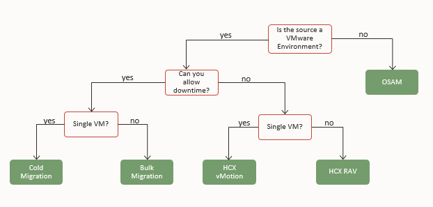
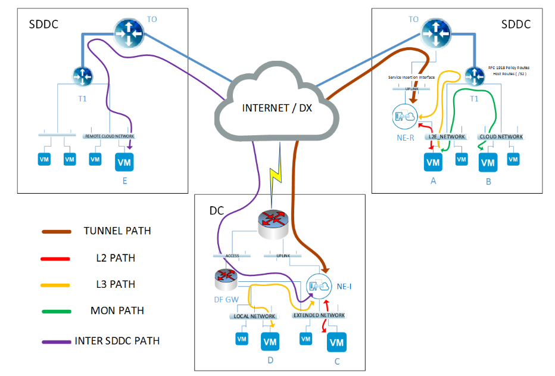
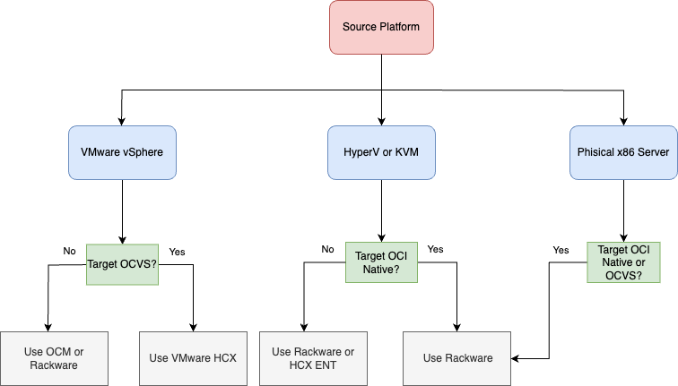

# **Workload Migration to OCI – Comprehensive Guide**

## **1. Introduction.**

Oracle Cloud Infrastructure (OCI) is a global cloud services platform offering a comprehensive portfolio of IaaS, PaaS, SaaS, and DaaS capabilities across distributed datacenters. It enables enterprises to run virtual machines, containers, databases, AI/ML workloads, storage, networking, and VMware environments at scale in the cloud.

Migrating VMware and non-VMware workloads to OCI is a strategic initiative that requires a thorough assessment of the source environment, detailed planning, target architecture alignment, and technical validation.

This document provides a technical overview of migration methodologies and tooling, including VMware HCX, RackWare, and Oracle Cloud Migrations (OCM), which are used to transition workloads from VMware and non-VMware platforms into OCI. It outlines key requirements, tool capabilities, architectural approaches, and decision criteria to support enterprise-scale migrations with minimal disruption.

## **2. Source and Target Platforms.**

This guide addresses the most common on-premises environments — VMware vSphere, Microsoft Hyper-V, KVM, and physical x86 servers and maps them to the appropriate Oracle Cloud Infrastructure (OCI) landing zones.

Enterprises can choose between two primary target platforms in OCI, based on workload characteristics, technical requirements, operational preferences, and budget considerations:
- Oracle Cloud VMware Solution (OCVS): Purpose-built for lift-and-shift migrations of existing VMware environments. OCVS preserves the full VMware software-defined datacenter (vSphere, vSAN, NSX, vCenter), enabling organizations to maintain existing tools, processes, and operational models with minimal disruption.
- OCI Native Compute Instances: Designed for replatformed or cloud-native workloads, OCI Compute offers secure, elastic, and high-performance virtual machines provisioned directly within OCI. This option is ideal for modernizing applications, integrating with OCI-native services, or optimizing costs and scalability.

Both platforms integrate seamlessly with the broader OCI ecosystem of managed services—including databases, networking, observability, identity, and security. This ensures that organizations cannot only migrate but also modernize, optimize, and scale their IT environments while preserving business continuity and operational resilience.

**Target platfrom comparison.**

| Category        | OCI Native Instances                                           | Oracle Cloud VMware Solution                          |
| --------------- | -------------------------------------------------------------- | ----------------------------------------------------- |
| Hypervisor      | OCI KVM                                                        | VMware ESXi                                           |
| Managment Tools | OCI Console                                                    | vCenter, HCX, NSX, vSAN                               |
| Best Use Case   | Cloud-native apps, replatformed VMs, containers                | Lift-and-shift of VMware estates                      |
| Compute Shapes  | Flexibly defined OCPU/RAM; Standard, DenseIO, GPU, HPC, Ampere | Dedicated Bare Metal DenseIO, Standard and GPU shapes |
| Networking      | OCI Virtual Cloud Network (VCN)                                | VMware NSX-T                                          |
| Primary Storage | OCI Block Volumes                                              | vSAN or OCI Block Storage                             |
| Supported OS    | Latest Linux/Windows distributions                             | All OS supprted by vSphere                            |
| Migration Tools | Oracle Cloud Migrations (OCM), Rackware                        | VMware HCX (Advanced/Enterprise), Rackware            |

## **3. Migration scenarios.**

This document outlines the principal migration paths for transitioning workloads from on-premises environments to Oracle Cloud Infrastructure (OCI), covering both virtualized and bare-metal sources. The following scenarios are considered:

- **VMware vSphere → Oracle Cloud VMware Solution (OCVS):** A seamless lift-and-shift approach that moves VMware workloads to OCVS while preserving the full vSphere stack (ESXi, vCenter, vSAN, and NSX). This method minimizes operational disruption by avoiding re-platforming and enables advanced capabilities such as Layer 2 network extension, IP address retention, and live workload mobility using tools like VMware HCX.

- **VMware vSphere → OCI Native Compute Instances:** In this scenario, VMware VMs are replatformed into OCI Native Compute. The process involves converting VM formats, adapting networking and storage, and integrating with OCI services. Migration tooling includes Oracle Cloud Migrations (OCM), RackWare, or custom image imports to perform discovery, replication, and deployment.

- **Microsoft Hyper-V / KVM → OCI Native Compute Instances:** Migration from Hyper-V or KVM requires VM format conversion and deployment into OCI’s compute environment. This path suits organizations aiming to modernize workloads or consolidate platforms. Tools such as RackWare or HCX Enterprise with OSAM support automated discovery, dependency mapping, and migration wave planning.

- **Microsoft Hyper-V / KVM → Oracle Cloud VMware Solution (OCVS):** Although less common, this option consolidates workloads under a single VMware SDDC on OCI for standardization. It requires cross-hypervisor conversion tools to preserve VM configuration attributes and migrate workloads reliably.

- **Physical x86 Servers → OCI Native or OCVS:** Bare-metal workloads can be migrated directly to OCI, either as OCI Native Compute Instances or as VMs in OCVS. This path is often chosen for legacy applications or workloads running on physical infrastructure that require modernization or consolidation. Migration tools such as RackWare provide OS-level replication and transformation for smooth cutover.

## **4. Migration Tools Overview.**

This section provides a comparative overview of the core tools available for migrating workloads to Oracle Cloud Infrastructure (OCI). The choice of tooling depends on the source platform, target landing zone (OCI Native or Oracle Cloud VMware Solution), workload characteristics, and operational requirements.

### **4.1 VMware HCX: Seamless VMware-to-VMware Mobility.**

**VMware HCX** is the preferred enterprise-grade mobility solution for vSphere-to-vSphere migrations. Integrated natively with OCVS, HCX enables live and bulk migrations, network extension, and non-disruptive workload transitions.

**Licensing** : HCX is bundled with OCVS deployments. Depending on the chosen Bare Metal shape, customers receive HCX Advanced or HCX Enterprise licenses

**Key Capabilities**

- Bulk Migration: Parallel batch migration of VMs with scheduled cutovers. (Advanced Licensing)
- vMotion: Live migration of a single powered-on workload with zero downtime (Advanced Licensing)
- Cold Migration: Migration of a powered off VM (Advanced Licnesing)
- Replicatied Assisted vMotion: Live migration of multiple powered-on workloads with zero downtime. (Enterprise Licensing)
- OS-Assisted Migration (OSAM): Enables guest-based migration of Hyper-V or KVM VMs to OCVS. (Enterprise licensing)
- L2 Network Extension: Seamless IP preservation and extended subnets across OCI and on-premises.
- Mobility Optimized Networking: Allowing VMs using a layer 2 extension to route more efficiently.
  
**Bulk Migraiton**

Bulk Migration allows the parallel migration of multiple virtual machines in batches from a source environment to a target environment, such as from on-premises VMware vSphere to Oracle Cloud VMware Solution (OCVS). 

Administrators can group VMs into migration waves and schedule cutover times to minimize business disruption. 

The migration process involves an initial full syncronisation of the majority of a VM’s data in advance, with only the delta changes being synchronized during the cutover window. During the pre copy phase, HCX will maintain an RPO of 2 hours by default. 

This approach is ideal for planned migrations where downtime can be scheduled in advance and large numbers of VMs must be moved efficiently. To the app user it will be seen as a guest OS reboot, as the source VM is powered down and the moved copy is powered on at the destination.

This is the preferred option for migrating VMs, as it allows you to do it at scale. A copy of the VM is left behind on prem, its name is amended to inlcude a POSIX timestamp (this helps with auditing) and it is powered off with its vNIC is disconnected from the network (to ensure if it is ever powered on again by accident there is no chance of a conflict on the network)

**Key Considerations**

- VMs with RDMs in Physical Compatbility mode are not supported

- VMs with ISOs attached can't be migrated (HCX can force unmount if needed)

- Snapshots are not migrated

- VMs Multi -Writer/Shared VMDKs can not be migrated

- VMs must be running at least Hardware Level 7 to be migrated

**vMotion Migration**

Enables the live migration of powered-on workloads from the source vSphere environment to OCVS without downtime. This is achieved by transferring memory, CPU state, and active network connections over the HCX Interconnect. This method is typically used for smaller numbers of VMs that require zero-downtime relocation.

**Key Considerations**

- Requires 150Mbps or higher throughput

- VMs with any kind of RDM are not supported for migration

- VMs must be at a hardware level of 9 or above to be migrated

- VMs Multi -Writer/Shared VMDKs can not be migrated

- vMotion migration only supports serial migrations (until the first vMotion migration has finished another one can not start)

- HCX Deactivates Change Block Tracking (CBT) before migration 

- VM Encryption is not supported
  

**Cold Migration**

Cold migration uses the same network path as HCX vMotion to transfer a powered-off virtual machine. During a cold migration, the Virtual Machine IP address and the MAC address are preserved. Cold migrations must satisfy the vMotion requirements.

This feature is seldom used, as it has the same limitations as vMotion, in our experience disonnecting the vNIC of the VM and powering it on and then using Bulk Migration has been the way to work around the cold migration limitations and constraints.

**Key Considerations**

Same as vMotion above.

**Replicated Assisted vMotion (RAV)**

Combines replication and vMotion to support the migration of larger workloads with zero downtime. The majority of the VM’s disk data is replicated in advance, followed by a short vMotion event to transfer the remaining changes (CPU/memory). RAV is particularly useful for migrating large, busy VMs that would otherwise require long vMotion windows or exceed vMotion thresholds.

Just like Bulk Migration there is the initial sync and after that an RPO of 2 hours is maintained

With RAV, multiple VMs are replicated simultaneously. When the replication phase reaches the switchover window, a delta vMotion cycle is initiated to do a quick, live switchover. **Live switchover happens serially.**
 

**Key Considerations:**

- Replication Assisted vMotion creates two folders at the destination site. One folder contains the virtual machine infrastructure definition, and the other contains the virtual machine disk information. This is normal behavior for RAV migrations and has no impact on the functionality of the virtual machine at the destination site. The only way to fix this is to do a Storage vMotion at the destination after the migration has completed

- Requires 150Mbps or higher throughput

- VMs with Physical Compatbility mode RDMs are not supported for migration

- VMs must be at a hardware level of 9 or above to be migrated

- HCX Deactivates Change Block Tracking (CBT) before migration
  

**OS-Assisted Migration (OSAM)**

OS-Assisted Migration enables the migration of workloads from non-vSphere hypervisors, such as Microsoft Hyper-V or KVM, into OCVS. Unlike vMotion or Bulk Migration, OSAM performs a guest-level migration by installing an HCX migration agent within the operating system. The agent copies the VM’s disk and configuration data to the target vSphere environment, where the VM is then reconstructed. This method is particularly useful for consolidating heterogeneous environments into VMware-based infrastructure. 

OSAM requires an HCX Enterprise license and is typically used for one-time migrations of workloads that cannot be moved using standard vSphere-based replication methods.

**Key Considerations**

- Replication begins a full synchronization transfer to the destination site. The guest virtual machine remains online during replication until the final delta synchronization.
- After the full sync, the switch over can be immediate or at a specic shedule just like Bulk Migration
- Final delats ync starts when the switch phase starts, untill then it maintains a continous sync of changes
- HCX performs a hardware mapping of the replicated volumes to ensure proper operation, including updates of the software stack on the replica. This fix-up process includes adding drivers and modifying the OS configuration files at the destination. The migrated virtual machine reboots during this process.
- VMware Tools is installed on the migrated virtual machine and migration completes.
- OSAM does not support P2V
- If the source VM does not power off, HCX will attempt to power off the replica VM.
  - **If the replica powers off successfully:** It remains connected to its NICs. You can then manually power off the source VM and power on the replica.

  - **If the replica fails to power off:** Both the source and replica remain powered on, but the replica is disconnected from the network. In this case, manually enable the NICs for the replica in vCenter, power off the source VM (if it is still running), and then power on the migrated VM.
    

**Layer 2 Network Extension**

L2 Network Extension enables seamless extension of Layer 2 broadcast domains from an on-premises datacenter to OCVS. This allows virtual machines to retain their existing IP addresses, avoiding the need for re-IPing during migration.

By bridging networks across the HCX Interconnect, workloads can move between sites without changes to IP configuration or gateway addresses, which is critical for application compatibility and minimizing disruption during phased migrations. 

L2E supports operational models where applications are split across sites, enabling hybrid cloud architectures with consistent networking.

Traditonally extending a layer 2 network (VLAN) was considered to be very risky, but HCX has made it simple and reliable with its Network Extension High Avilability configuration.

**HCX L2E High Availability (HA)**

**Overview**

In a standard HCX L2E setup, an **HCX Network Extension appliance** is deployed at both the source and destination sites to bridge Layer 2 networks across locations.  
High Availability (HA) mode ensures that network extension services remain operational even if the active appliance fails.

This feature requires HCX Enterprise licensing

**How It Works**

**Dual Appliances:**HCX deploys two Network Extension appliances in an HA pair per extended network — an **Active** and a **Standby**.

**Heartbeat Monitoring:**The appliances communicate via a heartbeat channel to detect failures.

**Automatic Failover:**If the active appliance becomes unavailable (e.g., VM crash, host failure, appliance upgrade), the standby appliance automatically takes over Layer 2 extension duties.

**Seamless Transition:** The switchover happens without requiring IP changes, preserving workload connectivity during migration or hybrid operations.

**Key Considerations**

- **Resource Usage:** HA mode requires **twice the appliance resources** (CPU, RAM, storage).

- **Bandwidth:** Ensure sufficient bandwidth for both appliances to handle failover scenarios.

- **Licensing:** HCX Advanced includes L2E, and HA functionality is part of the Enterprise feature set.

- **Appliance Placement:** Place HA pairs on separate hosts or clusters to avoid a single point of failure.

- **Limitations:** Not supported for every network type (e.g., management networks), and some failover events may briefly drop a few packets before recovery.

- Each Active and Standby pair is managed as an HA group, which includes upgrading and redeploying appliances. The process for redeploying and updating HA groups is the same as with standalone appliances, except that the operation is applied to both Active and Standby appliances at both the source or remote site.

**HCX Mobility Optimized Networking (MON)**

**Mobility Optimized Networking** (MON) is an HCX feature that ensures virtual machines migrated with **Layer 2 Network Extension (L2E)** can still route traffic efficiently after migration — without being forced to hairpin back to the source site for external network access.

When you extend a network with HCX L2E, VMs retain their original IP addresses. This is great for avoiding re-IPing, but it also means that, by default, routing for that subnet remains tied to the **gateway** in the source site.  
Without MON, a VM migrated to OCVS might send all north-south traffic back to the on-premises gateway, causing:

- **Suboptimal routing / higher latency**

- **Increased bandwidth usage** on the interconnect

- **Potential bottlenecks** if WAN bandwidth is limited

MON solves this by enabling a **local default gateway** at the destination site for the extended network.

**How It Works**

- MON is enabled **per-extended network** in HCX and then on a per VM basis.

- When a VM is migrated to the destination site, MON updates the VM’s **default gateway** to point to the **local gateway** at the target site instead of the source site.

- Local routing tables are adjusted so the VM’s traffic to external networks uses the closest available egress point.

- If the VM moves back to the source site, HCX automatically reverts it to the original gateway configuration.
  

**Key Considerations:**

- MON requires **HCX Enterprise** license.

- Must be explicitly enabled per extended network.

- Works only with HCX L2 Network Extensions.

- Requires NSX-T  Tier 1 gateway at the destination to host the local default gateway.

- May require updates to firewall rules or routing policies to account for the change in egress point.

- It has key scaling limits which may change with every release of HCX

- Can make troubleshooting networking issues harder, so should only be enabled on networks and VMs that really need it

With its powerful suite of capabilities, HCX is a cornerstone of any successful VMware migration strategy.

### **4.2 RackWare Heterogeneous Workload Portability.**

RackWare is a cloud-agnostic workload mobility and resilience platform that simplifies migration, disaster recovery, and backup across physical, virtual, and cloud-native environments. Its core product, the RackWare Management Module (RMM), provides agentless, policy driven automation to move and protect workloads.

**Key Benefits**

- Broad Compatibility – Supports VMware, Hyper-V, KVM, physical servers, and containers (Kubernetes). Works with all major public clouds, including OCI, AWS, Azure, and GCP.
- Agentless & Lightweight – No permanent agents required; minimal impact on production systems.
- Multi-Use Platform – One solution for migration, DR, and backup—reducing tool sprawl and complexity.
- Efficient Replication – Delta-based sync ensures faster migrations and near-zero RPO/RTO for DR.
- Scalability – Handles migrations from a few to thousands of workloads in coordinated “waves.”
- Oracle Integration – Available on Oracle Cloud Marketplace; supports OCI and on-prem Oracle environments (C3, PCA).

**Key Capabilities**
- Migration – workload migrations with automated sizing and IP/DNS remapping.
- Disaster Recovery – Policy-based DR with automated failover/fallback and non-disruptive testing.
- Backup – Application-consistent snapshots, long-term retention, and granular restore.
- Heterogeneous Support – Windows, Linux, and container workloads.

RMM is available in OCI Marketplace with built-in support for Oracle Cloud VMware Solution (OCVS) and OCI Native migrations.

### **4.3 Oracle Cloud Migrations (OCM).**

Oracle Cloud Migrations is a managed service that automates the migration of workloads—specifically VMware virtual machines and AWS EC2 instances—to Oracle Cloud Infrastructure (OCI). It streamlines every step of the process—from discovery and planning to replication and deployment—using OCI Console, CLI, or API interface 

**Key Capabilities**

Automated Asset Discovery & Inventory:
- For VMware, a remote agent appliance is deployed to discover VMs and their metadata.
- For AWS, the service performs agentless discovery of EC2 instances and EBS volumes.
- Discovered assets are stored in an OCI-hosted Inventory, along with performance data available in the OCI Monitoring service.
 
Migration Planning & Execution
- Assets are grouped into Migration Projects, each containing one or more Migration Plans.
- The service recommends target OCI configurations—such as compute shape and placement—based on source attributes and performance metrics. Users can customize these plans and evaluate cost estimates.
- Supports incremental replication of VM data to OCI.

Secure, Compliant Access & Governance
- Integrates with OCI Identity and Access Management (IAM) and Vault to ensure secure authentication, authorization, and management of credentials.
- Administrators must configure compartments, dynamic groups, and IAM policies to enable migration components and access control.

Supports VMware and AWS Source Environments
- VMware vSphere versions 6.5 through 8.0 (vSphere 8.0 support requires VDDK 7.0U2).
- AWS EC2 (x86/EBS-backed).
- Supports a wide range of Linux and Windows guest OS versions.

Oracle Cloud Migrations provides a streamlined, end-to-end migration experience for VMware and AWS workloads moving into OCI. From discovery through validation and cutover, the service offers automation, governance integration, cost insights, and incremental replication. It’s ideal for organizations seeking a secure, self-service migration path that integrates directly with OCI infrastructure.

## **5. Assesment and discovery mapping.**

A structured assessment, planning, and testing phase is essential for validating the migration design, minimizing risk, and ensuring a smooth transition to Oracle Cloud Infrastructure (OCI). This phase should include:

- Workload Discovery & Classification – Use inventory tools (e.g., RVTools, OCM discovery, vSphere inventory, or RackWare) to map out virtual machines, applications, and dependencies. Classify workloads by criticality (mission-critical, business-critical, dev/test) and migration complexity.
- Dependency Mapping – Identify application interdependencies, DNS records, firewall rules, and IP address requirements. Pay special attention to workloads requiring strict IP preservation or low-latency communication.
- Right-Sizing & Capacity Planning – Assess CPU, memory, and storage utilization to define the required OCI shape, OCVS node count, and storage architecture (OCI Block Volumes, or vSAN). Consider current utilization and growth factors.
- Network & Security Planning – Validate OCI networking design, including subnets, security lists, and FastConnect/IPSec VPN. Plan for Layer 2 extension where IP preservation is required.
- Testing & Validation – Conduct pilot migrations for representative workloads before executing large-scale cutovers. Validate performance, failover, and recovery procedures.

## **6. Tooling - Decision Tree.**

Selecting the right migration tool depends on platform compatibility, workload complexity, and migration objectives. The decision tree below helps identify the most suitable migration tool based on the source and target environments.

**VMware HCX**
- Native VMware solution for VMware-to-VMware migrations.
- Supports vMotion, Bulk Migration, Replication-Assisted vMotion (RAV), and Layer 2 extension.
- Best choice for seamless workload mobility between on-premises VMware and Oracle Cloud VMware Solution (OCVS).
- Reduces downtime through live and replication-assisted migrations.
	
**RackWare**
- Cloud-agnostic and hypervisor-independent.
- Supports physical, virtual, and cloud-native platforms.
- Operates at the VM operations level, offering replication and failback options.
- Recommended for heterogeneous environments where non-VMware workloads or physical servers must be migrated alongside VMware workloads.

**Oracle Cloud Migrations (OCM)**
- Best suited for VMware to OCI Native Compute migrations.
- Ideal for low-complexity, non-mission-critical workloads.
- Automatically discover virtual machines and instances in the source environment.

## **7. Special considerations for enterprise and mission critical databases.** 

While VM-level migration tools (e.g., HCX, RackWare, OCM) can handle the majority of workloads, they may not be sufficient for enterprise-scale, mission-critical applications where downtime is unacceptable. For large and transaction-heavy databases, a pure VM-level migration introduces significant challenges due to:

- Database size (terabytes or petabytes).
- Continuous write activity (transaction-heavy workloads).
- The requirement for zero or near-zero downtime.

To migrate such mission critical workloads and DB's you might consider dedicated solutions and architectures:

- Oracle Databases – Use Oracle Data Guard or GoldenGate for robust replication, synchronization, and failover capabilities.
- Microsoft SQL Server – Implement Always On Availability Groups to ensure transactional consistency and minimize downtime.
- Microsoft Active Directory – Use native AD replication between domain controllers to maintain consistency.
- Microsoft Exchange Server – Leverage Exchange Hybrid configurations or Database Availability Groups (DAGs) for continuity during migration.

By combining VM-level mobility with application-aware replication, enterprises can achieve data consistency, reduced downtime, and a resilient cutover strategy for their most business-critical workloads.

## **8. Best practices & guidance.**

To ensure a smooth and resilient transition to Oracle Cloud Infrastructure (OCI), the following best practices should be incorporated into any migration strategy:

- Adopt a phased migration approach – Start with lower-priority or non-production workloads to validate tooling, processes, and network designs. Use early phases as learning cycles before addressing mission-critical systems.

- Leverage Layer 2 network extension – For workloads requiring strict IP preservation, deploy VMware HCX L2 extensions with sufficient bandwidth and redundancy. This reduces reconfiguration effort and ensures application continuity.

- Validate bandwidth and connectivity – Confirm that FastConnect or VPN capacity can handle large-scale data transfers without impacting production traffic. Monitor latency, throughput, and error rates throughout the migration.

- Establish rollback procedures – Define clear fallback and recovery scenarios in case of migration failure. Document rollback steps and ensure that teams are trained to execute them under time pressure.

- Implement robust testing – Conduct end-to-end validation of application behavior, security controls, and performance benchmarks in the target environment before go-live. Include functional, load, and failover testing.

- Engage stakeholders early – Involve application owners, database administrators, network and security teams during the planning stage. Align technical decisions with business objectives, compliance requirements, and service-level agreements (SLAs).

- Maintain comprehensive documentation – Capture migration plans, cutover runbooks, rollback steps, and lessons learned to ensure repeatability and knowledge transfer across teams.

- Use automation where possible – Leverage orchestration and migration tooling (e.g., HCX policies, RackWare workflows, OCM migration plans) to reduce manual effort and minimize human error.

- Plan for post-migration optimization – After workloads are stable in OCI, review performance, right-size compute shapes, and integrate with OCI’s managed services (e.g., monitoring, security, backup) to maximize efficiency and cost savings.

- Prioritize security and compliance – Ensure IAM policies, network security lists, encryption settings, and audit configurations are validated before workloads are exposed to production use.

