# **Integrating OCI Secure Desktops Instances with Active Directory**

&nbsp;

<h1>Overview</h1>

OCI Secure Desktops provides users with the flexibility to leverage an official Windows 11 image, pre-configured and fully compliant with OSD standards. Users can customize this image by installing required software and then join it to their organization’s Active Directory (AD) domain.

This customized image can be used to create a golden image, serving as a standardized baseline for deploying desktop pools. All subsequent instances created from this golden image will automatically be integrated with Active Directory, ensuring consistency, security, and streamlined management.

This tutorial walks through the complete process of importing the base Windows 11 image and preparing it as a golden image. It covers the steps required to achieve seamless AD integration, both for the golden image itself and for all instances deployed from it.

&nbsp;

<h1>Architecture </h1>

In this architecture, we have a dedicated setup within our Oracle Cloud Infrastructure (OCI) region to support OCI Secure Desktops and Active Directory (AD) integration.

1. Active Directory Setup

   - A dedicated compartment has been created exclusively for the AD environment.

   - The AD server is deployed within this compartment with a static IP address: 10.74.10.10.

   - This compartment has its own VCN, ensuring isolation and security for directory services.

2. OSD Environment Setup

   - For the OSD environment, we have created a separate compartment named OSD-Demo.

   - A dedicated VCN with the CIDR block 10.73.0.0/16 has been provisioned for OSD.

   - Within this VCN, a private subnet (10.73.10.0/24) has been created, and the DNS and domain settings are configured to point to the AD server.

3. OSD Provisioning

   - OSD is provisioned using the Oracle Resource Manager (ORM) stack available on the Oracle Marketplace.

   - The ORM stack create policies, dynamic groups, and user access for the Secure Desktops service

4. Active Directory Integration

   - To enable AD integration for OSD, we will create an OCI Vault to securely store domain credentials and other sensitive information.

   - These details will be referenced during the configuration process to seamlessly join OSD instances to the AD domain.

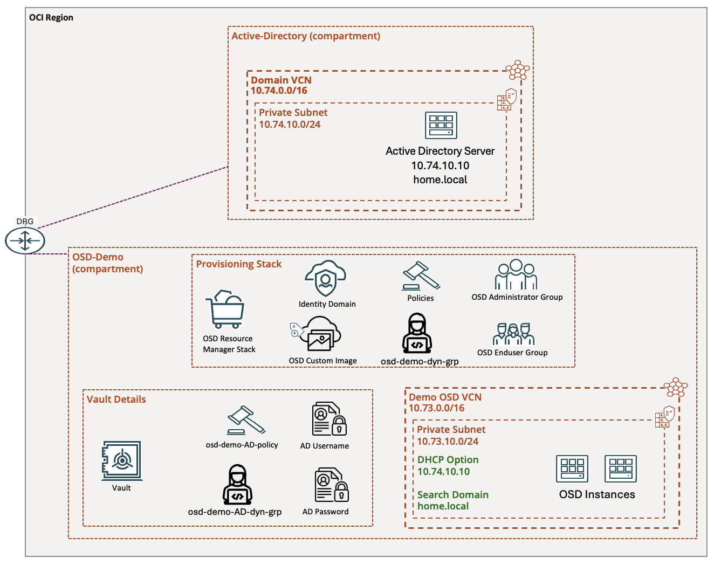

&nbsp;

<h1>Prerequisites</h1>

As per the above architecture diagram, we need to design the solution.

Before beginning the deployment and configuration of OCI Secure Desktops (OSD) with Active Directory (AD) integration, ensure that the following prerequisites are met:

1. Windows 11 PAR Link

   - A Windows 11 Pre-Authenticated Request (PAR) link has been requested and received from OCI Support for use with OSD.

2. Network Connectivity

   - Connectivity between the OSD VCN and the AD VCN is established and verified to allow seamless domain integration and communication.

3. Private Subnet for OSD Deployment

   - A dedicated private subnet is available and configured for deploying OSD instances securely.

4. Group Naming Conventions

   - Standardized naming conventions have been finalized for:

     - Dynamic group

5. Create Groups
   - Desktop Administrator Group (they will access to create OSD Desktop Pools)

   - Desktop User Group (they will request for the OSD instances)

6. OCI Identity Domain Readiness

   - The OCI identity domain intended for integration with OSD has been identified and reviewed.

7. Vault and Policy Configuration

   - Names for the Vault, Dynamic Group, and Policies required to securely store AD credentials (username and password) have been finalized.

   - These resources will be used to support the AD integration process.

8. Compartmets
   - We need to have compartment for Network, Compute Image & for Desktops. We can have single or multiple compartments as per the design.

&nbsp;

To setup instance console connection, refer to the below link

https://support.oracle.com/support/?anchorId=&kmContentId=2933121&page=sptemplate&sptemplate=km-article 

&nbsp;

<h1>Task #1 — Configure OCI Secure Desktops via Marketplace Stack</h1>

The first step in setting up OCI Secure Desktops (OSD) is to run the OCI OSD Marketplace stack. This automates the creation of required IAM resources such as policies, groups, and roles, ensuring a standardized and secure deployment.

**Step 1: Navigate to the ORM Stack on Marketplace**
- Open a web browser and log in to the OCI Console using your administrator credentials.
Go to Marketplace.

- Search for "Secure Desktop".

- Select the OCI Secure Desktops listing from the search results. 

- Click Launch Stack to start the deployment.

- Choose the compartment where the OSD resources (VCN, instances, etc.) will be provisioned.

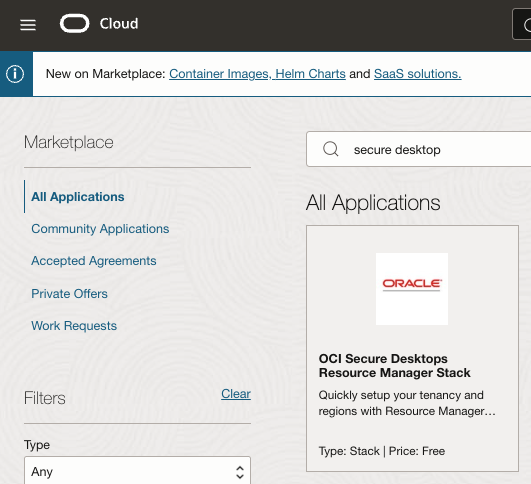 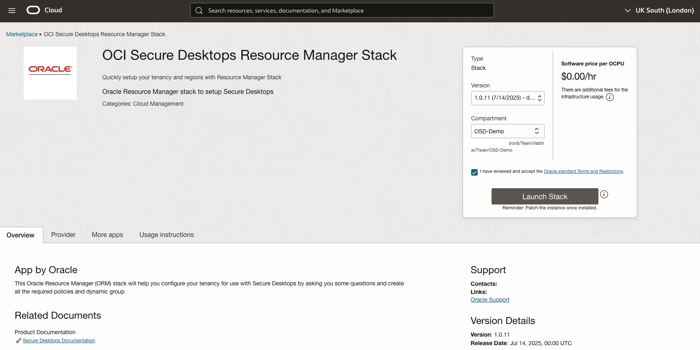

**Step 2: Provide Stack Information**

- Enter a display name for the stack (for easy identification).

- Click Next to proceed.

- Under Setup Type, choose:
   - Setup Tenancy (This configures OSD at the tenancy level with centralized IAM policies and groups)

- Select Identity Domain
   - The Default Identity Domain is selected by default.

   - To use a non-default identity domain, check the box and write the desired domain name

- Use the dropdowns to select:

   - OSD Administrator Group – users who will manage desktop pools.

   - OSD End User Group – users who will request and use virtual desktops

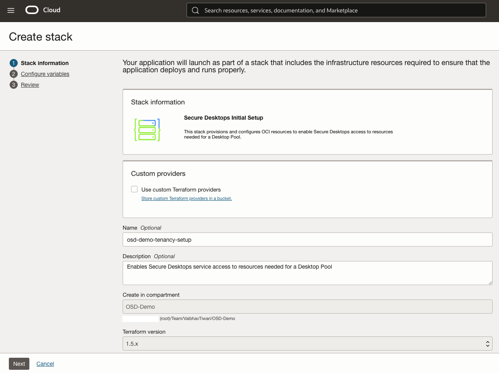 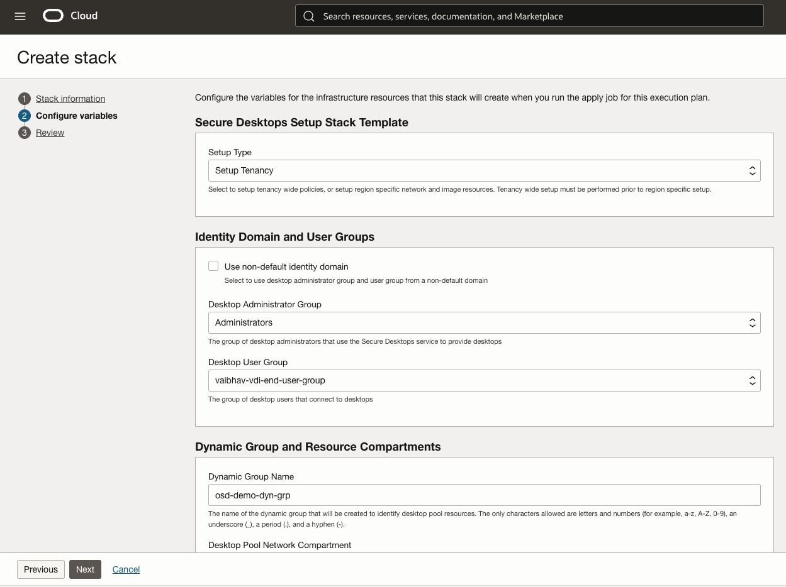

- Enter a name for the Dynamic Group.
   - This group will be automatically created and used to assign policies for OSD instance access

- Choose the compartment where the following will reside:

   - OSD VCN (must have DNS enabled) and subnets

   - OSD Windows image

   - Provisioned OSD instances

Finish the Wizard and deploy the ORM Stack.

&nbsp;

<h1>Task #2 — Import the Windows 11 Image</h1>

The next step is to import the official Windows 11 image into OCI so it can be used as the base image for OCI Secure Desktops. This image will later be customized to create a golden image for deployment.

Follow this link https://support.oracle.com/support/?anchorId=&kmContentId=10213132&page=sptemplate&sptemplate=km-article to import it

From the OCI Cloud Shell, we need to run below commands to import it

1. oci compute image import from-object-uri --uri https://objectstorage.eu-frankfurt-1.oraclecloud.com/p/xxxxxxxxxxxxxxxxxxxxxxxx-cymNKXbYylUko9QaGVdtAuHE/n/frsljhpq5vpp/b/vaibhav-bucket/o/OSD/Win11_24H2_Ent_English_98717_IMDSv2_rs1.vmdk --compartment-id ocid1.compartment.oc1..aaaaaaaaxxxxxxxxxxxxxxxxxxxxxn4se625chzvfgonsaqt7cpyaf5q --display-name OSD-Win11–latest

2. oci --region uk-london-1 compute image update --image-id ocid1.image.oc1.uk-london-1.aaaaaaaakyxxxxxxxxxxxxxxxxxxxxxxxxxvpjbapuetsyrn3kh5a --operating-system Windows --operating-system-version "Windows11"

&nbsp;

Add below tag to the image

oci:desktops:is_desktop_image              true

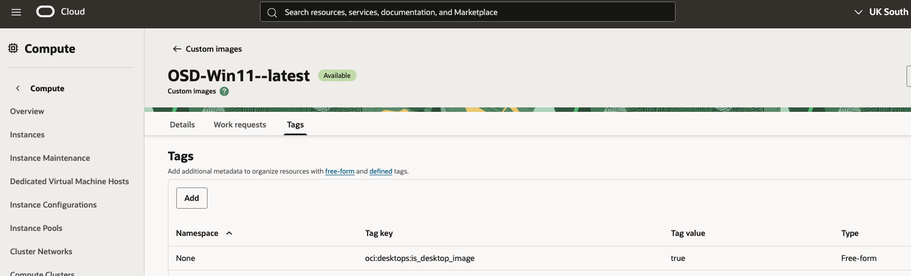

&nbsp;

<h1>Task #3 — Vault Configuration</h1>

In this task, you'll securely store the Active Directory (AD) username and password in OCI Vault. These secrets will later be referenced by OCI Secure Desktops (OSD) to automate AD integration during desktop provisioning.

**Step 1: Create a new OCI Vault**

- On the OCI Console, go to:
   - Identity & Security → Key Management & Secret Management → Vaults

- Click Create Vault.

- Provide a name such as: osd-vault.

- Select the appropriate compartment for the vault.

- Click Create Vault to proceed.

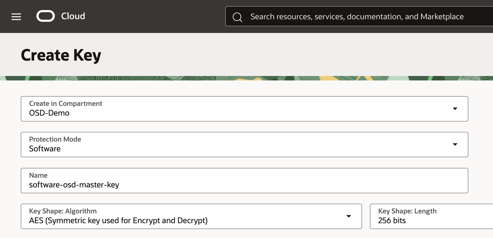

**Step 2: Create a Master Encryption Key**

- Once the vault is created, open it and navigate to the Keys tab.

- Click Create Key.

- Configure the following settings:

   - Protection Mode: Software

   - Key Name: osd-master-key (or any descriptive name)

- Click Create Key to finish.

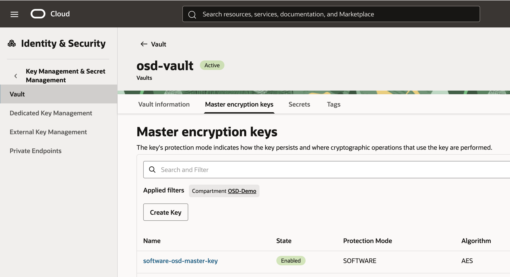

**Step 3: Create a Secret for the AD Username**

- Go to the Secrets tab inside the same vault.

- Click Create Secret.

- Enter a name: ad-username.

- Choose the encryption key created in Step 3.

- Under Secret Generation Method, select Manual.

- Enter the AD username (e.g., administrator@home.local) as the secret value.

- Click Create Secret.

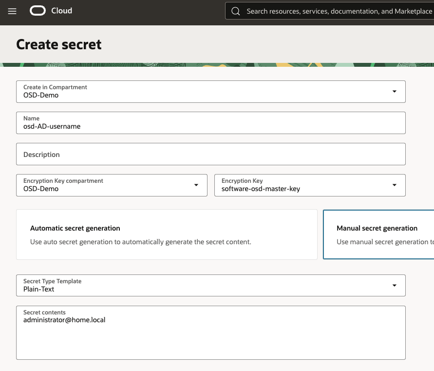

**Step 4: Create a Secret for the AD Password**

- Click Create Secret again.

- Enter a name: ad-password.

- Select the same encryption key.

- Choose Manual for the generation method.

- Enter the AD password as the secret value.

- Click Create Secret.

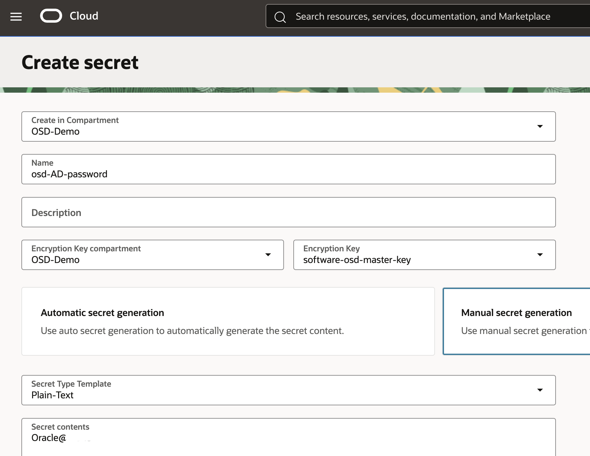

**Step 5: Copy and Store the Secret OCIDs**

- After each secret is created, click into it and copy its OCID:

   - One for the AD Username Secret

   - One for the AD Password Secret

- Store these OCIDs securely, as they will be used in the OSD configuration later (e.g., in Terraform scripts or desktop pool settings).

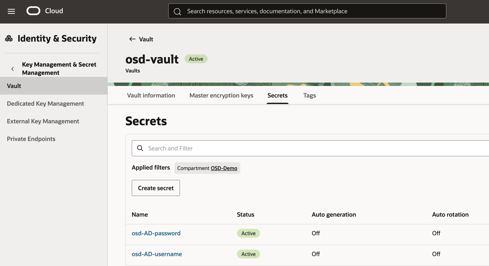

**Step 6: Create Dynamic Group to Allow Instance Access to AD Secrets**

To allow OSD instances to read the AD credentials stored in OCI Vault, create a dynamic group and attach the necessary IAM policy.

**Step 6.1: Create a Dynamic Group**

- On the OCI Console, go to:
   - Identity & Security → Dynamic Groups

- Click Create Dynamic Group.

- Provide the following:

   - Name: osd-demo-AD-dyn-grp

   - Matching Rule: 
    
Any {instance.compartment.id = 'ocid1.compartment.oc1..aaaaaaaabmyxxxxxxxxxxxxxxxxxxxxx25chzvfgonsaqt7cpyaf5q'}
    
Dynamic Group (osd-demo-AD-dyn-grp) and allowing permission to read from the compartment (OSD-Demo)

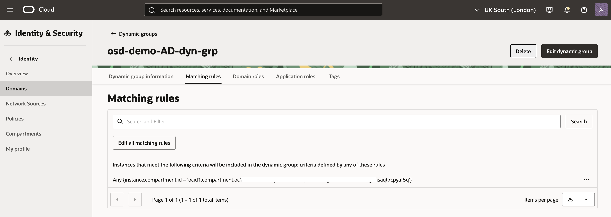

**Step 6.2: Create IAM Policy to Grant Secret Access to the Dynamic Group**

To allow the OSD instances in the dynamic group to read specific AD-related secrets from OCI Vault, create an IAM policy with precise resource-level access.

- On the OCI Console, go to:
   - Identity & Security → Identity & Domains → Policies

- Ensure you are in the correct compartment (e.g., OSD-Demo).

- Click Create Policy.

- Provide the following:

   - Name: osd-demo-AD-policy

   - Description: Allows OSD instances to read specific Vault secrets for AD integration

   - Policy Statements:

Allow dynamic-group 'osd-demo-AD-dyn-grp' to read secret-bundles in compartment OSD-Demo where any {target.secret.id = 'ocid1.vaultsecret.oc1.uk-london-1.amaaaaaaxxxxxxxxxxxxxxxxxxxxx7gyjrqn2dttym64346azq', target.secret.id = 'ocid1.vaultsecret.oc1.uk-london-1.amaaaaaaxxxxxxxxxxxxxxxxxxxxxfklaxcj5b2zxhcnc5emcvssijpq'}

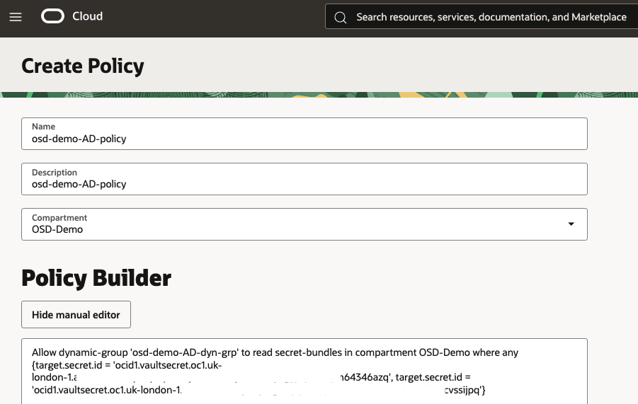 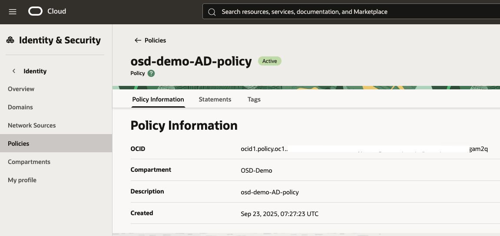 

Edit the policy and add below statement

Allow dynamic-group 'osd-demo-AD-dyn-grp' to use keys in compartment OSD-Demo

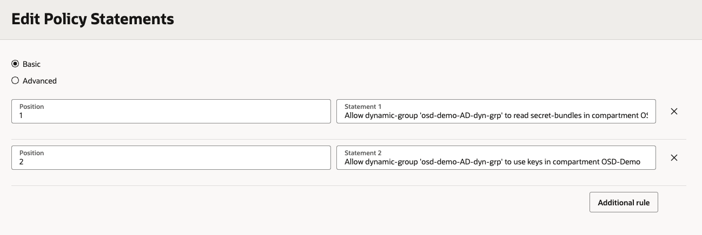 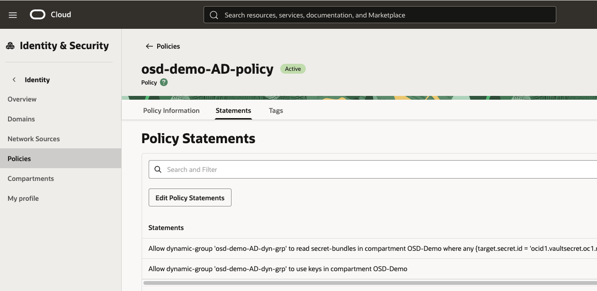

&nbsp;

<h1>Task #4 — Setting up Custom DHCP & DNS</h1>

Make sure all OCI Secure Desktops (OSD) instances in the OSD VCN (10.73.0.0/16) can resolve and join the Active Directory domain hosted in the AD VCN (10.74.0.0/16).

Allow the rules/communication between the VCN's

**Step 1: Create a Custom DHCP Option Set** 

- Go to the OCI Console.

- Navigate to Networking > DHCP Options.

- Click Create DHCP Options and enter:

   - Name: AD-custom-DHCP

   - DNS Type: Custom Resolver

   - Custom DNS Server IP: <Private IP of the AD DNS Server> (e.g., 10.74.0.10)

   - Search Domain: your AD domain name (e.g., home.local)

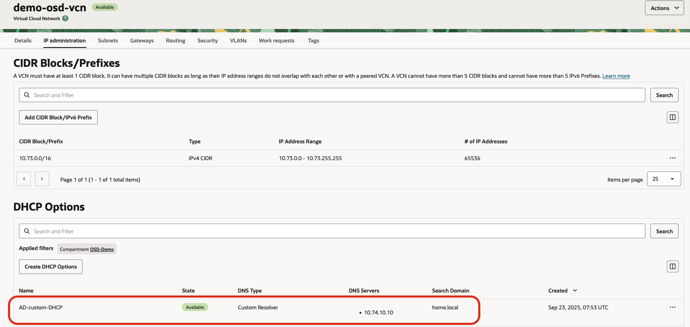

**Step 2: Attach DHCP Option Set to the OSD Subnet**

- Navigate to Networking > Virtual Cloud Networks (VCNs).

- Open the OSD VCN (10.73.0.0/16).

- Click on the private subnet used for launching OSD instances.

- Click Edit.

- Under DHCP Options, select AD-custom-DHCP.

- Save the changes.

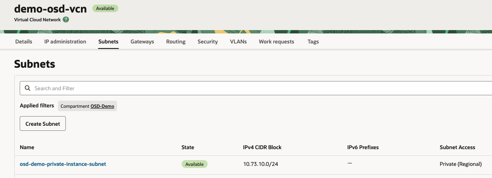 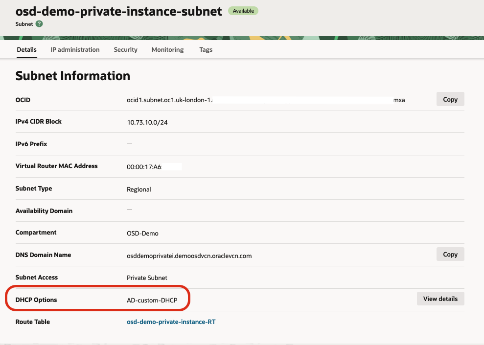

&nbsp;

<h1>Task #5 – Active Directory (AD) Integration with OCI Secure Desktops</h1>

**Step 1: Validate AD Connectivity**

- Launch a regular OCI compute instance in the same VCN/subnet where your AD server is reachable.

- Verify network connectivity (ping, DNS resolution, etc.) to the AD server.

**Step 2: Create OSD Pool within AD Subnet**

- Create a new OSD Desktop Pool.

- Ensure the pool is mapped to the subnet configured with the custom DHCP & DNS options pointing to your AD server.

- During the OSD Desktop Pool creation add the tag oci:desktops:is_auth as false

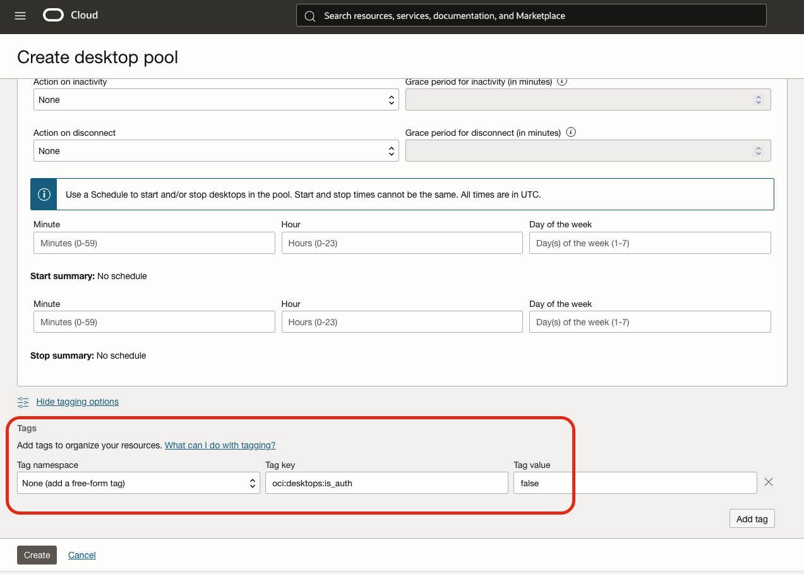

**Step 3: Request a Desktop**

- Access the OSD client portal:
https://published.desktops.xxregionxx.oci.oraclecloud.com/client

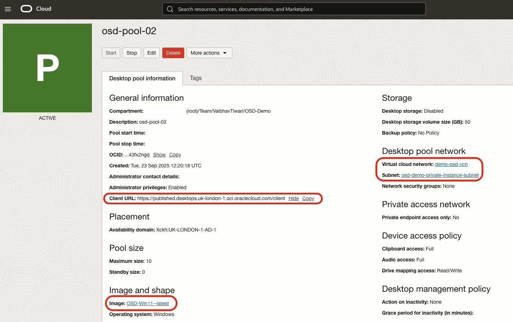

**Step 4: Prepare the Image**

1. On the OSD instance:

   - Enable the local administrator account and set a password.

   - Install the required software.

2. Create an OCI Console Connection to the instance.

   - This is required to monitor the shutdown process only. We do not have to login via the OCI Console connection.

3. Launch PowerShell V7 and navigate to C:\temp

   - Run the AD join preparation script: windadjoinprep.ps1.

   - Using the OSD copy/paste functionality, enter the details

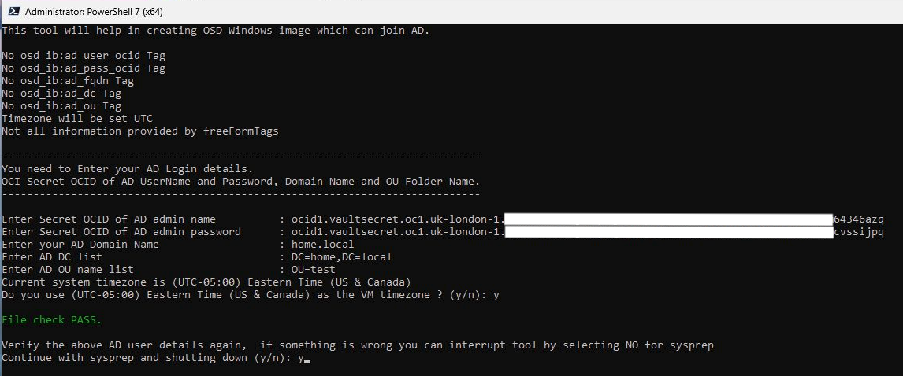

**Step 5: Finalize and Create Custom Image**

- Once the script runs and the OSD session will disconnect.

- Monitor the OS shutdown process using the OCI console connection

- Once the OS shutsdown, manually "force stop" the instance from the OCI Console.

- Create a custom image from this instance.

Add the following defined tag to the image: 

oci:desktops:is_desktop_image       true

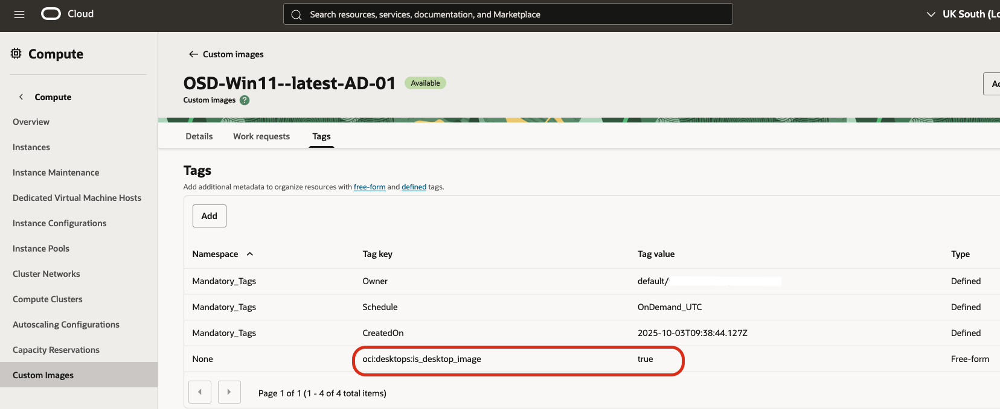

**Step 6: Create a New Desktop Pool**

- Create a new OSD desktop pool using the custom image created in Step 5.

- During the OSD Desktop Pool creation add the tag oci:desktops:is_auth as true

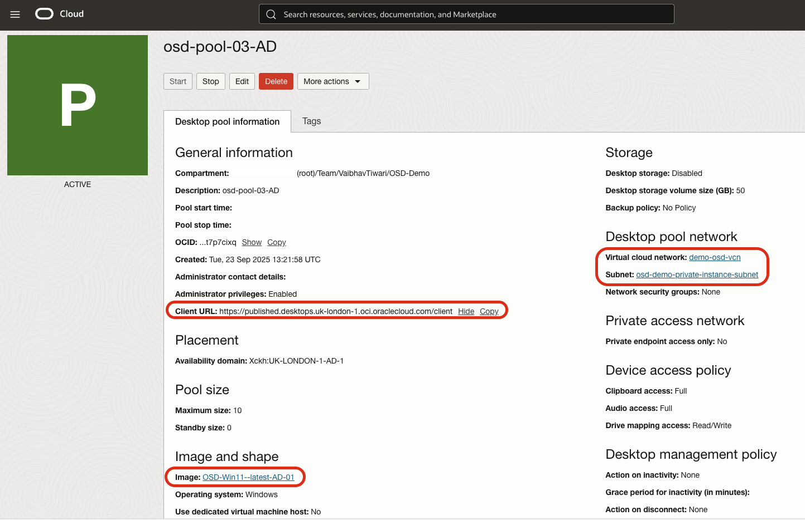 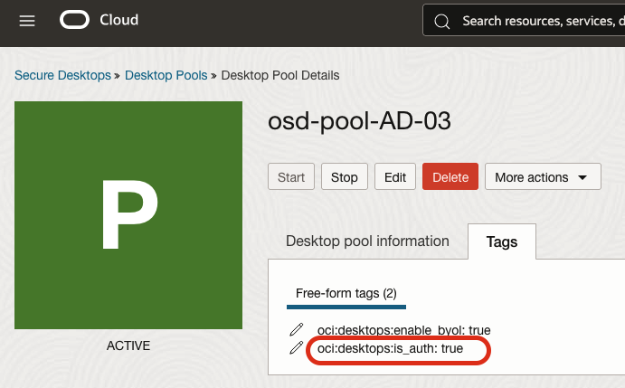

**Step 7: Login Using AD Credentials**

- Users will be prompted to enter their Active Directory credentials at login.

- Upon successful authentication, they will be able to log in to the Windows 11 desktop joined to the AD domain.

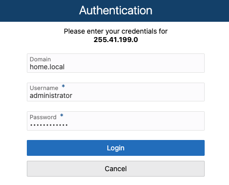 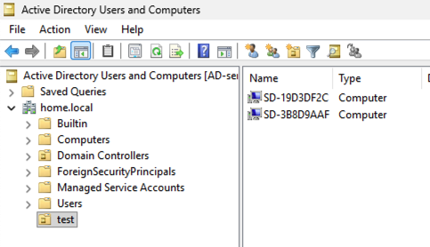

&nbsp;

<h1>Known Issues</h1>

**#1**

When running sysprep you might encounter the error mentioned below

Navigate to the location and open the file in notepad. Scroll at the bottom of the file and you will see the error.

Generally the error seen is because some application is not installed for all the users

We need to make sure that the application installed is available for all the users on the instance

Here is a sample command to remove Co-Pilot from the machine "Get-AppxPackage -AllUsers *Copilot* | Remove-AppxPackage -AllUsers"

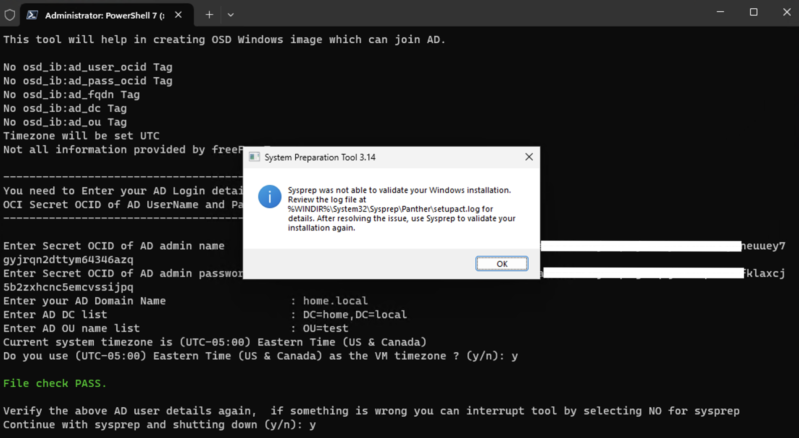 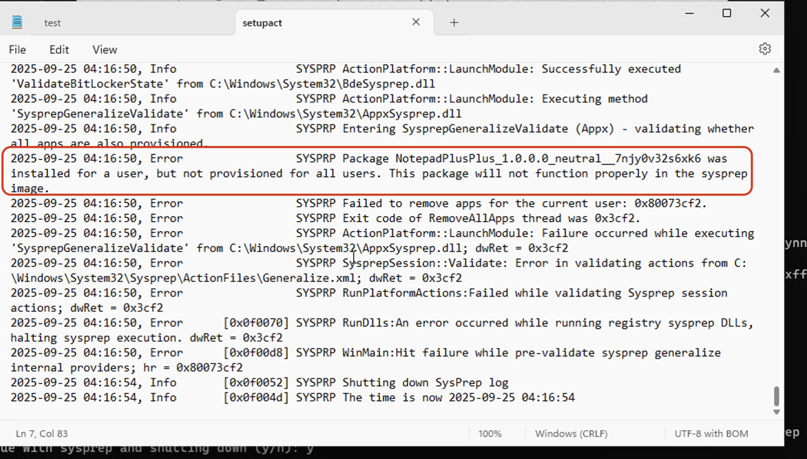

**#2**

Some OSD instances might not join AD. Delete the instance and let them create again.

&nbsp;

# Acknowledgments

- **Author** - Vaibhav Tiwari (Cloud VMware Solutions Specialist)
