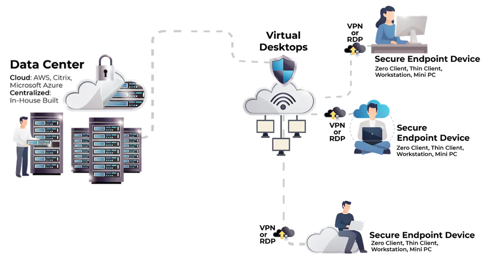
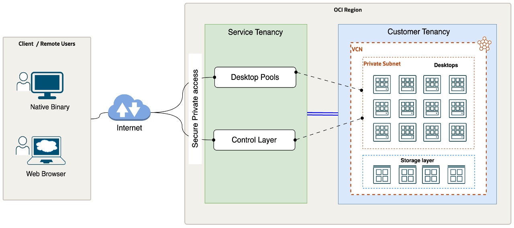
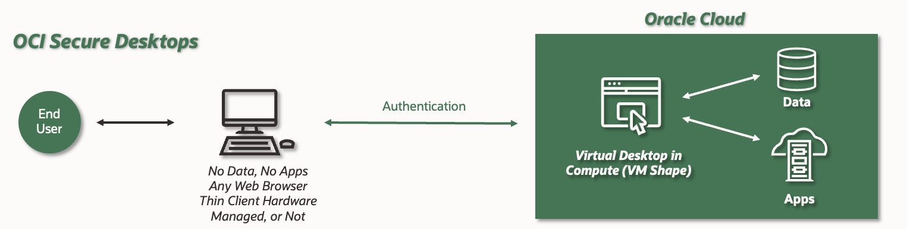
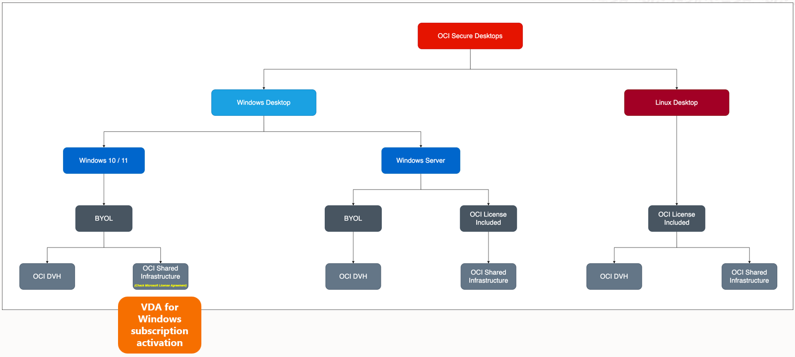

## Version Control
<!-- GUIDANCE -->
<!--
A section describing the versions of this document and its changes.
-->

| Version | Author       | Date                 | Comment         |
|:--------|:-------------|:---------------------|:----------------|
| 1.0     | Name Surname | March 14th, 2024 | Initial version |

## Team
<!-- GUIDANCE -->
<!--
A section describing the versions of these documents and their changes.
-->

| Name         | E-Mail              | Role                              | Company |
|:-------------|:--------------------|:----------------------------------|:--------|
| Name Surname | example@example.com | Designation | Oracle  |

## Abbreviations and Acronyms
<!-- Guidance -->
<!--
Abbreviation: a shortened form of a word or phrase.
Acronyms: an abbreviation formed from the initial letters of other words and pronounced as a word (e.g. ASCII, NASA ).
Maintain a list of terms, if needed. Use this internal page to find and translate abbreviations and acronyms: https://apex.oraclecorp.com/pls/apex/f?p=15295:1:8900541624336:::::
-->

| Term  | Meaning                               |
|:------|:--------------------------------------|
| SD   | Secure Desktop Service        |
| OCI   | Oracle Cloud Infrastructure           |
| VCN   | Virtual Cloud Network                 |
| IAM   | Identity and Access Management        |
| AD  | Availbility Domain   |       |
| FD   | Fault Domain     |
| IGW  | Internet Gateway      |
| RT    | Route Table                 |
| OSS   | Object Storage Service                |
| SL | Security List |
| BV   | Block Volume Service
| RMS   | Resource Manager Stack

## Document Purpose

This document does provide the highlevel overview of the Oracle Cloud Secure Desktop service.

Oracle Cloud Infrastructure Secure Desktops elevates virtual desktops in the cloud by offering centralized management of large, identically configured pools.  This saves administrators time and ensures consistency. Flexibility is key, with options to leverage pre-existing virtual machine shapes or craft custom desktop images equipped with your organization's specific software. Security is prioritized through strict access controls that safeguard both cloud resources and data. 

Users benefit from a simple experience, securely accessing desktops from various devices with downloadable clients or even web browsers.  And as your needs change, Secure Desktops easily scales by adding or removing desktops from the pool, keeping pace with your evolving workforce while optimizing costs.  Overall, it provides a secure, manageable, and adaptable solution for delivering virtual desktops to your organization.

# Business Context
<!-- GUIDANCE -->
<!--
Describe the customer's business and background. What is the context of the customer's industry and Line of Business (LOB)? What are the business needs and goals which this Workload is an enabler for? How does this technical solution impact and support the customer's business goals? Does this solution support a specific customer strategy, or maybe certain customer values? How does this solution help our customers to either generate more revenue or save costs?

Mandatory Chapter

| Role  | RACI |
|:------|:-----|
| ACE   | R/A  |
| Impl. | None |
| PPM   | None |
-->

*Example:*

${doc.customer.name} is located in Frankfurt, Germany, and is the largest consumer electronics company. ${doc.customer.name} has 2500 employees at this location, generating
millions of dollars in sales. There are subsidiaries under ${doc.customer.name} corporate family which contribute to overall sales for the parent organization.

${doc.customer.name} is an existing Oracle Cloud customer and currently consuming various OCI services such as network, compute, storage, and databases in OCI Frankfurt Region. The current Production, Test, Dev & DMZ environments are hosted in an on-premises infrastructure with physical servers. The customer has a cloud and digital transformation strategy and would like to exit the data center by moving the on-premises workloads to the cloud.

The mission-critical application workloads are hosted primarily in VMware.  The customer is looking for quick and seamless migration to the cloud with minimal interruption to the services. They have decided to use the Oracle Cloud Infrastructure using the Oracle cloud Migration for quick migration of the VMware workloads before their current data center contract expires. The Oracle Cloud Infrastructure offers flexible, highly scalable, and cost-effective solutions to host critical workloads without disrupting their core business.

## Executive Summary

## Workload Business Value

<!-- GUIDANCE -->
<!--
A clear statement of specific business value as part of the full workload scope. Try to keep it SMART: Specific, Measurable, Assignable, Realistic, and Time-Related - Agree on the SMART business value with the customer. Keep it business focused, and speak the language of the LOB which benefits from this Workload: "Increase Customer Retention by 3% in the next year" or "Grow Customer Base with Executive Decision-Making from our Sales and Support Data". Avoid technical success criteria such as "Migrate App X to Oracle Cloud" or "Provision 5 Compute Instances". Avoid Oracle success criteria and language "Get Workload Consuming on OCI".

Mandatory Chapter

| Role  | RACI |
|:------|:-----|
| ACE   | R/A  |
| Impl. | None |
| PPM   | None |
-->

*Example:*

${doc.customer.name} is running a strategic program in FY23 called EXAMPLE. As part of their initiative, one pillar is dedicated to their IT cost saving. ${doc.customer.name} is planning to reduce their IT estate spending by 15% in the current FY. Oracle can help ${doc.customer.name} by reducing the VMware deployment complexity and operations while optimizing IT costs. ${doc.customer.name} IT department wants to innovate other LoBs and enable quick-time-to-market for various applications and business needs. This allows ${doc.customer.name} to stay ahead in a competitive market.

Oracle Cloud Infrastructure (OCI) Secure Desktop Service provides a secure and managed virtual desktop solution in the cloud. It enables organizations to securely access their desktop environments from anywhere using a wide range of devices, enhancing mobility and flexibility for end-users. Secure Desktop Service offers features such as centralized management, data encryption, and secure access controls, ensuring the protection of sensitive information and compliance with regulatory requirements. With built-in scalability and high availability, organizations can easily deploy and scale their virtual desktop infrastructure to meet changing business needs while reducing operational overhead and infrastructure costs.

# Overview

Oracle Cloud Infrastructure (OCI) Secure Desktop Service offers secure and managed virtual desktop environments, enabling remote access from any device. It provides centralized management, robust security features, and scalability for uninterrupted productivity. With OCI Secure Desktop Service, organizations can embrace remote work seamlessly and securely. 

The Oracle Secure Desktop service enables you to perform the following tasks:

* Create a custom Image for Secure Desktop

* Prepare the tenancy for Secure Desktop 

* Publish Desktops for end users

- Endusers connect to the Instance

Oracle guides in planning, architecting, prototyping, and managing Secure Desktop. Customers can host and deploy Windows or Linux instances using custom images on Oracle Cloud Infrastructure (OCI). Instances can be launched within a few hours or even less than a day, providing rapid provisioning and deployment capabilities. Secure Desktop service has a minimal price of 20 USD per instance launched (monthly), followed by OCI resource charges.

# Customer's Environment

With Secure Desktop, customers may find themselves in one of three scenarios with their environment. 

The first scenario involves customers who are planning to deploy desktop instances and currently have no existing deployment in place.

In the second scenario, customers may have an On-Premises Datacenter where they host a VDI solution, which could be based on VMware or another hypervisor. Within this environment, applications like VMware Horizon or Citrix manage the desktop instances atop the hypervisor.

The third possibility is that customers are already running desktop instances in the cloud. They may utilize services such as AWS Workspaces or Azure Virtual Desktops for this purpose.

### Current State IT Architecture OnPrem Datacenter

For a customer with an On-Premises Datacenter, managing a hypervisor and running a VDI solution, the following expenses need to be considered:

* Datacenter Location: This refers to the physical location of the data center facility, including any associated costs such as rent or lease expenses.

* Hardware Costs: Expenses related to the purchase and maintenance of servers, storage devices, networking equipment, and other hardware components required for the data center infrastructure.

* Datacenter Charges: These are ongoing expenses associated with operating the data center facility, including electricity, cooling, and facility maintenance costs.

* Hypervisor Charges: Licensing fees for the hypervisor software being used, such as VMware vSphere or Microsoft Hyper-V, along with any associated support and maintenance costs.

* DR (Disaster Recovery) Charges: Costs related to implementing and maintaining a disaster recovery solution, including hardware, software, and off-site storage facilities.

* Maintenance Charges: Expenses for ongoing maintenance and support services, including hardware maintenance contracts, software updates, and infrastructure upgrades.

* Additional Software: Costs associated with other software components required for the data center environment, such as firewall software licenses, along with the specific versions of these software packages.

It's important to identify the specific versions of software being used in the data center environment to ensure compatibility and compliance with licensing agreements.

### Current State IT Architecture Cloud Service

When customers run desktop instances from cloud vendors like AWS WorkSpaces or Azure Virtual Desktop, it's crucial to examine the following pricing details:

* Pricing Model: Understanding the pricing model used by the cloud vendor for their desktop services, including any subscription-based or pay-as-you-go options.

* Infrastructure Charges (Compute, Storage, Networking): Evaluating the costs associated with compute resources (such as virtual machine instances), storage (for user profiles and data), and networking (data transfer and network usage).

* Other Services Used by Desktop Instances: Identifying any additional services utilized by the desktop instances, such as monitoring, security, or backup services offered by the cloud vendor.

* Support Charges: Reviewing the costs associated with technical support and assistance provided by the cloud vendor, including any premium support or managed services options.

By comparing these pricing details with Oracle Cloud Infrastructure (OCI) services, customers can determine the most cost-effective solution for their desktop requirements. It's essential to analyze which services are critical for their desktop infrastructure in the cloud and prioritize accordingly to optimize costs and meet business needs effectively.

Here is a generic diagram for OnPrem and Cloud VDI solutions

### Current Virtual Desktop Inventory 
========================================================================= 

__Resource allocations per location:__

| Location      | Type             | Operating System | Total vCPU Cores | Total Memory (GB) | Used Storage (GB) | Total Storage (GB) |
|:--------------|:-----------------|:-----------------|:-----------------|:------------------|:------------------|:-------------------|
| Location Name | Virtual Machines | Windows/Linux              | XXX              | XXX               | XXX               | XXX                |
| Location Name | Physical Machines | Windows/Linux              | XXX              | XXX               | XXX               | XXX                |

&nbsp;

# Oracle Secure Desktop

## Secure Desktop Pre-requisites & Steps

* Access to an active OCI Tenancy

- Compartment in the tenancy where the Secure Desktop Service will be made available

- VCN against against instances will be provisioned

- Tenancy administrator who will execute the tasks

- Valid region where the Secure Desktop Service is available

- Create a Valid Image that will be used by Secure Desktop Service

- Create Endusers group on OCI that will request instances

- Secure Desktop Administrator will run the ORM stack.

- Create a Desktop Pool with the required details

- End user will login on the specified OCI portal and will request instances.

- Oracle Secure Desktop service is being offered as SAAS and is deployed at tenancy level within the OCI region.  

&nbsp;

# Architectural Diagram of Secure Desktop Service

&nbsp;

### Mandatory Security Best Practices

### **Golden Image**

1. **Minimal Base Configuration:** Start with a minimal, clean operating system installation to reduce potential vulnerabilities.
2. **Security Hardening:** Apply OS-level hardening practices, such as disabling unnecessary services, applying security patches, and configuring firewalls.
3. **Software Inclusion:** Only include essential applications and ensure they are up-to-date.
4. **User Profiles:** Configure user profiles with least privilege and mandatory settings for security.
5. **Regular Updates:** Keep the golden image updated and versioned for easy rollback and compliance.

### **VCN (Virtual Cloud Network) - Private Subnet**
1. **Private Subnet:** Deploy Secure Desktops in a private subnet to minimize exposure to the internet.
2. **Security Lists & NSGs:** Use security lists and Network Security Groups (NSGs) to control inbound/outbound traffic, only allowing necessary ports and IPs.

### **Compartment**
1. **Segmentation:** Use compartments to segment resources, ensuring logical separation and easier management of permissions and billing.
2. **Access Controls:** Apply fine-grained access controls using IAM policies to ensure only authorized users can manage resources within the compartment.

### **Desktop User Group**
1. **Least Privilege Access:** Grant users the minimum privileges required for their role to reduce the risk of accidental or malicious changes.
2. **Group Policy:** Use group policies to enforce security configurations and restrict user actions based on their role.

### **Desktop Admin Group**
1. **Restricted Access:** Limit the number of users in the Desktop Admin group to minimize the risk of administrative errors or security breaches.
2. **Logging & Monitoring:** Enable auditing and monitoring for all actions performed by the admin group to ensure accountability and quickly detect any unauthorized activities.

&nbsp;

### OCI Landing Zone Solution Definition

*Guide:*

*This chapter describes landing zone best practices and usually does not require any changes. If changes are required please refer to [Landing Zone GitHub](https://github.com/oracle-devrel/technology-engineering/tree/main/landing-zones). The full landing zone needs to be described in the Solution Design by the service provider.*

*Use this template ONLY for new cloud deployments and remove it for brownfield deployments.*

The Oracle Secure Desktop Landing Zone is a well-architected, secure, and scalable environment where virtual desktop infrastructure (VDI) is deployed. It acts as the foundational layer, ensuring that all necessary components, such as networking, security, identity management, and monitoring, are in place to support the secure desktop environment.

#### Key Components:
* **Networking:**
   - **VPC/Subnets:** Virtual Private Cloud (VPC) with segmented subnets for different tiers (management, application, and user access).
   - **Internet Gateway:** Allows secure external access to the landing zone.
   - **NAT Gateway:** Enables secure outbound internet access for resources in private subnets.
   - **Load Balancer:** Distributes traffic across multiple instances of virtual desktops.

* **Security:**
   - **Security Groups:** Control inbound and outbound traffic at the instance level.
   - **Network ACLs:** Additional layer of subnet-level security.
   - **WAF (Web Application Firewall):** Protects against web exploits and attacks.
   - **IAM (Identity and Access Management):** Manages user permissions and access controls.

* **Compute:**
   - **Hypervisor Hosts:** Run the virtual desktops.
   - **Management Servers:** Manage VDI resources, users, and policies.

* **Storage:**
   - **Shared Storage:** Centralized storage for desktop images and user data.
   - **Backup and Recovery:** Regular backups to ensure data integrity and availability.

* **Monitoring and Logging:**
   - **Centralized Monitoring:** Tracks the performance and health of the landing zone.
   - **Audit Logs:** Maintains records of all access and configuration changes for compliance and security.

* **Identity and Access Management:**
   - **Single Sign-On (SSO):** Provides a seamless login experience for users.
   - **Multi-Factor Authentication (MFA):** Adds an extra layer of security for user access.

&nbsp;

### Logical Architecture
<!--
Role  | RACI
------|-----
ACE   | R/A
Impl. | None
PPM   | None
-->

*Guide:*

*Provide a high-level logical Oracle solution for the complete Workload. Indicate Oracle products as abstract groups, and not as physical detailed instances. Create an architecture diagram following the latest notation and describe the solution.*

*To implement a solution the Physical Architecture is needed in the next chapter. The physical notation can show individual components with physical attributes such as IP addresses, hostnames, or sizes.*

*[The Oracle Cloud Notation, OCI Architecture Diagram Toolkits](https://docs.oracle.com/en-us/iaas/Content/General/Reference/graphicsfordiagrams.htm)*

### Physical Architecture

The physical architecture of Oracle Secure Desktop includes:

* **Data Centers:** Geographically distributed for redundancy and disaster recovery, with strong physical security.
* **Hypervisor Hosts:** Clustered servers running virtual desktops, ensuring high availability.
* **Storage Systems:** Centralized, encrypted storage (SAN/NAS) with RAID for redundancy.
* **Networking:** Redundant network paths and VLAN segmentation for secure, reliable connectivity.
* **Management Servers:** High-availability servers for managing virtual desktops and user authentication.
* **User Access:** Thin/zero clients connect via secure remote access gateways with SSL/TLS encryption.
* **Backup and DR:** Regular backups and a secondary DR site with automated failover for resilience.

&nbsp;

This setup ensures a secure, scalable, and resilient virtual desktop environment.

*Guide:*

*The Workload Architecture is typically described in a physical form. This should include all solution components. You do not have to provide solution build or deployment details such as IP addresses.*

*Please describe the solution with an architecture image plus a written text. If you have certain specifics you like to explain, you can also use the Solution Consideration chapter to describe the details there.*

*[The Oracle Cloud Notation, OCI Architecture Diagram Toolkits](https://docs.oracle.com/en-us/iaas/Content/General/Reference/graphicsfordiagrams.htm)*

*Reference:*

[StarterPacks (use the search)](https://github.com/oracle-devrel/technology-engineering/)

### Future State of VDI on Oracle Secure Desktop Solution

The future setup of VDI on the Oracle Secure Desktop solution will offer a robust, secure, and highly scalable environment designed to meet the evolving needs of modern enterprises. It will leverage Oracle's advanced security features to ensure that data and applications remain protected against emerging threats. The solution will provide seamless integration with cloud services, enabling organizations to easily scale their desktop infrastructure up or down based on demand. Enhanced user experience will be a key focus, with faster access times, high availability, and improved performance through optimized resource allocation. 

Additionally, comprehensive management tools will enable administrators to efficiently oversee and maintain the VDI environment, ensuring maximum uptime and productivity. This future state will empower businesses to achieve greater flexibility, security, and efficiency in their desktop management processes.

### Licensing Model for Oracle Secure Desktop

Oracle Secure Desktop (OSD) supports Bring Your Own License (BYOL) for Windows virtual machines, it's likely that the support may vary depending on the specific version of Windows being migrated and the licensing agreements in place. OCI Windows Server Images can be used with OCI Secure Desktop as custom images however charges will be applicable. 

For certain versions of Windows, customers may be able to migrate to dedicated virtual machine hosts on Oracle Cloud Infrastructure (OCI) to enable BYOL. Dedicated VM hosts provide physical servers dedicated to a single customer's use, offering enhanced control and security.

Customers should review their licensing agreements and consult with Oracle support or their Oracle account representative to determine the specific options available for migrating Windows virtual machines to OCI with BYOL. Additionally, they should ensure compliance with licensing requirements to avoid any potential issues.

# Terminology for Setting up Secure Desktop Service.

- **Tenancy Compartment Design** 

Compartment design in Oracle Cloud Infrastructure (OCI) plays a critical role in enhancing security, governance, and resource isolation for OCI Secure Desktop. By logically segregating resources into compartments, organizations can enforce fine-grained access controls, implement governance policies, and optimize resource utilization. This compartmentalization ensures better security against unauthorized access, enables effective cost tracking and compliance monitoring, and minimizes interference between different workloads, ultimately leading to a robust and reliable virtual desktop infrastructure in the cloud.

- **Connection Broker**

The Oracle Cloud Infrastructure (OCI) Secure Desktop Connection Broker is a key component of OCI Secure Desktop, facilitating the management and connectivity of virtual desktop instances for users. Acting as an intermediary, it ensures secure access to virtual desktops from various devices, optimizes resource allocation, and enhances user experience. With features like load balancing and fault tolerance, the connection broker ensures high availability and performance of virtual desktop environments, enabling efficient deployment and management in the Oracle Cloud.

- **Desktop Clients**

OCI Secure Desktop desktop clients are software applications that users install on their local devices to access virtual desktop environments hosted on Oracle Cloud Infrastructure (OCI). These clients offer enhanced performance, smoother graphics rendering, and reduced latency compared to web-based access. They also provide integration with local devices such as printers and USB devices, support offline access, and offer customization options for tailoring the virtual desktop experience. Additionally, desktop clients include security features such as encryption and certificate-based authentication to ensure secure access to virtual desktop environments. Overall, OCI Secure Desktop desktop clients provide users with a more feature-rich and integrated experience for accessing virtual desktops on OCI, offering improved performance, local device integration, customization options, and enhanced security features compared to web-based access methods.

- **IAM Policies**

IAM (Identity and Access Management) policies in Oracle Cloud Infrastructure (OCI) regulate access to resources, including Secure Desktop Service components like virtual desktop instances and networking elements. These policies enable administrators to define permissions for users and groups, ensuring appropriate access levels based on roles and responsibilities. By enforcing least privilege access, IAM policies bolster security and governance, reducing the risk of unauthorized access and data breaches within the Secure Desktop environment. Overall, IAM policies in OCI are instrumental in maintaining tight control over resource access, aligning with organizational policies and enhancing overall security posture.

- **Custom Image**

In OCI Secure Desktop, a custom image is a pre-configured template of a virtual desktop environment tailored to organizational needs. These images streamline deployment by providing standardized configurations, saving time and ensuring consistency. By including security measures and software updates, custom images enhance security and mitigate risks. They offer flexibility to create specialized desktop environments and can be modified to adapt to changing requirements. Overall, custom images are essential for efficient, secure, and customizable virtual desktop deployments in OCI Secure Desktop.

Below images are suppoted by Oracle Secure Desktop Service

>  Oracle Linux 7

>  Oracle Linux 8

> Windows 10

> Windows 11

- **Dynamic Group**

Dynamic groups in Oracle Cloud Infrastructure (OCI) are a feature that allows administrators to define groups based on matching rules, rather than manually assigning users. In the context of OCI Secure Desktop, dynamic groups can be used to automatically assign users or devices to specific roles or permissions within the Secure Desktop environment. For example, administrators can create dynamic groups based on user attributes such as department, location, or job title, and then apply IAM policies to these groups to grant access to Secure Desktop resources accordingly. This simplifies management and ensures that users have the appropriate permissions based on their attributes, streamlining access control within the Secure Desktop environment.

- **Tenant Admin Group**

In Oracle Cloud Infrastructure (OCI), the tenant admin group refers to a user group that has administrative privileges and access to manage resources within a specific tenancy. With reference to OCI Secure Desktop, the tenant admin group would typically include users responsible for overseeing and administering the Secure Desktop environment, such as configuring virtual desktop instances, managing user access, and monitoring overall performance. Members of the tenant admin group have the authority to perform administrative tasks related to Secure Desktop, ensuring effective management and governance of the virtual desktop infrastructure within the OCI environment.

- **Desktop User Group**

In Oracle Cloud Infrastructure (OCI), the tenant user group refers to a group of users who have access to resources within a specific tenancy. With reference to OCI Secure Desktop, the tenant user group would include individuals authorized to access and use virtual desktop instances hosted in the OCI environment. These users typically comprise employees or stakeholders who require access to virtual desktops for their daily work activities. The tenant user group is granted appropriate permissions and access rights to securely utilize the Secure Desktop service, enabling them to access their virtual desktop environments from any compatible device and location.

### High Level steps

R- Responsible, I- Informed, A- Accountable, C- Consulted

| Task                                           | Responsible (R) | Accountable (A) | Consulted (C) | Informed (I) |
|------------------------------------------------|------------------|------------------|----------------|---------------|
| Define project scope and objectives            | Consultant       | Account Cloud Engineer  | Team Members   | Stakeholders |
|Identify Image requirements            | Consultant       | Account Cloud Engineer  | Team Members   | Stakeholders |
| Analyze current infrastructure and applications| Consultant       | Account Cloud Engineer  | Team Members   | Stakeholders |
| Select appropriate Oracle cloud services       | Consultant       | Account Cloud Engineer  | Team Members   | Stakeholders |
| Develop Desktop Pool plan            | Consultant       | Account Cloud Engineer  | Team Members   | Stakeholders |
| Allocate resources for Secure Desktop Administrator                | Account Cloud Engineer | Account Cloud Engineer | Consultant     | Stakeholders |
| Execute Desktop Pool plan                         | Team Members     | Account Cloud Engineer | Consultant     | Stakeholders |
| Monitor Image and Desktop Pool progress                     | Account Cloud Engineer | Account Cloud Engineer | Consultant     | Stakeholders |
| Resolve Image and Desktop Pool progress issues and escalations       | Team Members     | Account Cloud Engineer | Consultant     | Stakeholders |
| Validate successful connection for the enduser                  | Team Members     | Account Cloud Engineer | Consultant     | Stakeholders |
| Document  process and outcomes       | Team Members     | Account Cloud Engineer | Consultant     | Stakeholders |
| Conduct review post enduser login                 | Consultant       | Account Cloud Engineer | Team Members   | Stakeholders |

Responsible (R): Individuals or roles responsible for completing the task.
Accountable (A): Individuals ultimately answerable for the task's completion or outcome.
Consulted (C): Individuals or roles to be consulted for their input or expertise.
Informed (I): Individuals or roles to be kept informed about the task's progress or outcome.

R- Responsible, I- Informed, A- Accountable, C- Consulted

The participation of the following Customer stakeholders is required for the Service to be performed:

* Enterprise Architect
* Infrastructure Architect
* Backup/Recovery team leads
* Windows/Linux Administrator
* Network Operations team leads

&nbsp;

## Workplan

### Deliverables
<!--
Role  | RACI
------|-----
ACE   | A
Impl. | R
PPM   | None
-->

*Guide:*

*Describe deliverables within the implementation scope. Including this documentation as Solution Definition and the later following Solution Design. This should be a generic reusable text, provided by the implementers.*

### Included Activities

* Access to an active OCI Tenancy

- Compartment in the tenancy where the Secure Desktop Service will be made available

- VCN against against instances will be provisioned

- Tenancy administrator who will execute the tasks

- Valid region where the Secure Desktop Service is available

- Create a Valid Image that will be used by Secure Desktop Service

- Create Endusers group on OCI that will request instances

- Secure Desktop Administrator will run the ORM stack.

- Create a Desktop Pool with the required details

- End user will login on the specified OCI portal and will request instances.

- Oracle Secure Desktop service is being offered as SAAS and is deployed at tenancy level within the OCI region.  

The details of the Oracle Cloud Infrastructure SLAs are found in the link below.
[OCI Service SLA](https://www.oracle.com/ae/cloud/sla/).

**OCI Foundation & Network**

1. **Virtual Cloud Network (VCN):**
   - Creation of VCN with subnets dedicated to Oracle Secure Desktop.
   - Configured routing tables, internet gateways, and NAT gateways.

2. **Security List:**
   - Security rules defining allowed traffic to and from Oracle Secure Desktop instances.

3. **Public and Private Subnets:**
   - Separate subnets for public-facing components and internal components.
   - Proper routing and security configurations.

**Security**

- **Identity and Access Management (IAM):**
   - Configuration of OCI IAM policies for role-based access control (RBAC).
   - Integration with existing identity providers (e.g., Active Directory, LDAP).

- **Data Encryption:**
   - Encryption of data at rest using OCI Key Management.
   - Encryption of data in transit using SSL/TLS.

3. **Firewalls and Security Lists:**
   - Configuration of firewalls to restrict unauthorized access.
   - Security lists governing ingress and egress traffic to/from subnets.

4. **Audit Logging and Monitoring:**
   - Enablement of OCI audit logs to track administrative actions.
   - Integration with monitoring tools for real-time alerts.

5. **Compliance and Governance:**
   - Implementation of security controls to comply with industry standards (e.g., GDPR, HIPAA).
   - Regular security assessments and vulnerability scans.

### Recommended Activities

- **Kickoff Meeting:**
   - Introduction of project team members.
   - Review of project scope, objectives, and timelines.

- **Requirements Gathering:**
   - Workshops with stakeholders to gather business and technical requirements.
   - Documentation of requirements in a requirements specification document.

- **Design Phase:**
   - Creation of a detailed architectural design.
   - Review and approval of the design by the customer.

- **Infrastructure Setup:**
   - Provisioning of OCI resources, including compute instances, storage, and networking.
   - Configuration of VCN, subnets, and security lists.

- **Oracle Secure Desktop Installation:**
   - Deployment of Oracle Secure Desktop components.
   - Configuration of custom images if required (e.g., Windows Server).

- **Integration:**
   - Integration with identity providers for user authentication.
   - Configuration of network connections to on-premises systems.

- **Testing Phase:**
   - Execution of UAT to validate functionality against customer requirements.
   - Performance and load testing to ensure the system meets SLAs.
   - Security testing to identify and mitigate vulnerabilities.

- **Training and Documentation:**
   - Conducting training sessions for IT administrators and end-users.
   - Providing detailed documentation for future reference.

- **Go-Live:**
   - Transitioning the Oracle Secure Desktop solution to production.
   - Close monitoring of system performance and user experience.

- **Post-Go-Live Support:**
    - Providing support to address any issues during the initial go-live period.
    - Fine-tuning system configurations based on feedback.

- **Final Review and Handover:**
    - Review of project deliverables and customer satisfaction.
    - Handover of the system to the customer’s IT team.

### Timeline
When implementing Oracle Secure Desktop for a customer, the timeline can vary depending on the scope, complexity, and specific requirements of the deployment. Here's a general timeline broken down into common phases:

**Planning and Requirements Gathering (1-2 weeks)**
   - **Customer Needs Assessment:** Understand the customer’s business requirements, number of users, types of applications, and licensing needs.
   - **Technical Requirements:** Assess infrastructure, network, and security requirements.
   - **Design Document:** Create a detailed design document that includes architecture, network layout, and deployment plan.
   - **Approval:** Get customer approval on the design and timelines.

**Infrastructure Preparation (2-3 weeks)**
   - **Provisioning OCI Resources:** Set up the necessary OCI infrastructure, including virtual networks, compute instances, and storage.
   - **BYOL Considerations:** Ensure any necessary licenses are in place, especially if leveraging BYOL for Windows VMs.
   - **Security Configuration:** Implement security controls like firewalls, security lists, and identity access management.

**Installation and Configuration (2-4 weeks)**
   - **Deploy Oracle Secure Desktop Components:** Install and configure Oracle Secure Desktop on OCI.
   - **Custom Image Preparation:** If using custom images, prepare and upload the necessary Windows Server Images.
   - **Integrate with Existing Systems:** Set up any required integrations with on-premises systems, identity providers, or other cloud services.
   - **Networking Setup:** Ensure proper network configurations for secure access, including VPN or private connectivity.

**Testing and Validation (1-2 weeks)**
   - **User Acceptance Testing (UAT):** Conduct thorough testing with key stakeholders to validate that the solution meets the agreed requirements.
   - **Performance Testing:** Evaluate performance under load, ensuring it meets SLAs.
   - **Security Testing:** Verify that all security measures are functioning as intended.

**Training and Documentation (1 week)**
   - **Training Sessions:** Provide training for the customer’s IT team and end-users on how to manage and use Oracle Secure Desktop.
   - **Documentation:** Deliver comprehensive documentation, including user manuals, troubleshooting guides, and an operational handbook.

**Go-Live and Support (1-2 weeks)**
   - **Go-Live:** Transition the Oracle Secure Desktop into production.
   - **Monitoring:** Closely monitor the environment post-deployment for any issues.
   - **Support:** Provide post-implementation support to address any questions or problems.

**Handover and Final Review (1 week)**
   - **Handover:** Complete the handover process to the customer’s IT team.
   - **Final Review:** Conduct a review meeting with the customer to discuss the implementation, gather feedback, and ensure customer satisfaction.

**Total Estimated Timeline: 8-15 weeks**

This timeline can vary depending on factors such as the complexity of the environment, the number of users, the level of customization required, and the customer’s internal processes.

### Implementation RACI

Guide:

Describe for all activities the RACI (Responsible, Accountable, Consultant, Informed) matrix

Example:

| Task                                           | Responsible (R) | Accountable (A) | Consulted (C) | Informed (I) |
|------------------------------------------------|------------------|------------------|----------------|---------------|
| Define project scope and objectives            | Consultant       | Account Cloud Engineer  | Team Members   | Stakeholders |
|Identify Image requirements            | Consultant       | Account Cloud Engineer  | Team Members   | Stakeholders |
| Analyze current infrastructure and applications| Consultant       | Account Cloud Engineer  | Team Members   | Stakeholders |
| Select appropriate Oracle cloud services       | Consultant       | Account Cloud Engineer  | Team Members   | Stakeholders |
| Develop Desktop Pool plan            | Consultant       | Account Cloud Engineer  | Team Members   | Stakeholders |
| Allocate resources for Secure Desktop Administrator                | Account Cloud Engineer | Account Cloud Engineer | Consultant     | Stakeholders |
| Execute Desktop Pool plan                         | Team Members     | Account Cloud Engineer | Consultant     | Stakeholders |
| Monitor Image and Desktop Pool progress                     | Account Cloud Engineer | Account Cloud Engineer | Consultant     | Stakeholders |
| Resolve Image and Desktop Pool progress issues and escalations       | Team Members     | Account Cloud Engineer | Consultant     | Stakeholders |
| Validate successful connection for the enduser                  | Team Members     | Account Cloud Engineer | Consultant     | Stakeholders |
| Document  process and outcomes       | Team Members     | Account Cloud Engineer | Consultant     | Stakeholders |
| Conduct review post enduser login                 | Consultant       | Account Cloud Engineer | Team Members   | Stakeholders |

Responsible (R): Individuals or roles responsible for completing the task.
Accountable (A): Individuals ultimately answerable for the task's completion or outcome.
Consulted (C): Individuals or roles to be consulted for their input or expertise.
Informed (I): Individuals or roles to be kept informed about the task's progress or outcome.

R- Responsible, I- Informed, A- Accountable, C- Consulted

The participation of the following Customer stakeholders is required for the Service to be performed:

* Enterprise Architect
* Infrastructure Architect
* Backup/Recovery team leads
* Windows/Linux Administrator
* Network Operations team leads

### Assumptions

Guide:

List any assumptions, if any, which could impact the solution architecture or the implementation.

Example:

**Generic assumptions**
* Secure Desktop Administrators have relevant permissions.
* The Secure Desktop end-users have been created on the OCI tenancy
* Dedicated Compartment has been setup for the Secure Desktop Pools
* Appropriate Pool settings have been applied to make the solution cost-effective
* Selected region has OCI Secure Desktop Service
* Golden Image has the required softwares installed for the end-user.
* The CIDR which will be used for Secure Desktop does not overlap with the Customer's existing environment.
* Supported Images are used for Secure Desktop.
* Required traffic is allowed from the Secure Desktop Images.
* Required storage is mapped with the Secure Desktop instances.
* There are no licensing constraints from Microsoft or any other software vendors. 
* The Secure Desktop instances have sufficient CPU cores and RAM to address application requirement.
* Customer has flexibility to edit VPU for the Block Volume.
* Customer will have the necessary Oracle Support (MoS) contract for all the products that may/will be used during this project.
* Customer will be managing any other 3rd party vendors or suppliers.
* Customer will have adequate licenses for all the products that may/will be used during this project.
* It is assumed that all work will be done remotely and within either central European time or Indian standard time normal office working hours.
* Any problems, issues, errors, and anomalies to be addressed through MOS SRs & will continue to be owned by the Customer.
* Details and Naming convention will be provided for OCI resources.
* Any additional effort outside of the scope of this proposal will be managed by change control and mutually agreed upon by both Oracle and Customer.
* It is assumed that all required contractual agreements between Oracle and the Customer are in place to ensure uninterrupted execution of the project.
* It is assumed that all work will be done remotely and within either central European time or India Standard Time normal office working hours.
* It is assumed that upgrades are excluded from the scope of work and no production systems/production cutover is part of the scope of work undertaken by the Oracle Service
* It is assumed that all required Oracle cloud technical resources are available for use during the duration of the project and that engineers involved have been granted the appropriate access to those technical resources by the customer before the start of the project.
* It is assumed that all required customer resources, and if applicable third-party resources, are available during the duration of the project to work openly and collaboratively to realize the project goals uninterruptedly.
* It is assumed that all required customer resources, and if applicable third-party resources are aware of all technical and non-technical details of the as-is and to-be components. All resources are committed to technical work as far as is needed for the execution of the project.
* It is assumed that all required documentation, system details, and access needed for the execution of the project can be given/granted to parties involved when and where deemed needed for the success of the project.
* It is assumed that the customer will have adequate licenses for all the products that may/will be used during the project and that appropriate support contracts for those products are in place where the customer will take the responsibility of managing any potential service request towards a support organization to seek resolution of a problem.
* It is assumed the customer will provide the appropriate level of information and guidance on rules and regulations which can directly and/or indirectly influence the project or the resulting deliverables. This includes, however not limited to, customer-specific naming conventions, security implementation requirements, internal SLA requirements as well as details for legal and regulatory compliance. It will be the responsibility of the customer to ensure that the solution will adhere to this.
* It is assumed that under the customer's responsibility, the customer will ensure and validate that the solution will be placed under the proper controls for ensuring business continuity, system availability, recoverability, security control, and monitoring and management as part of a post-project task.
* It is assumed that the customer will take responsibility for testing all functional and non-functional parts of the solution within the provided timeline and ensure a proper test report will be shared with the full team (including customer, Oracle, and if applicable third party).
* It is assumed that any requirement, deliverable, or expectation that is not clearly defined as in-scope of the project will not be handled as part of the project and is placed under the responsibility of the customer to be handled outside of the project.

**Project-specific assumptions**

- Oracle Secure Desktop (OCM) supports Bring Your Own License (BYOL) for Windows virtual machines, but the support may vary depending on the specific version of Windows being migrated and the licensing agreements in place.

- OCI Windows Server Images can be used with OCI Secure Desktop as custom images, but charges will be applicable.

- For certain versions of Windows, customers may be able to migrate to dedicated virtual machine hosts on Oracle Cloud Infrastructure (OCI) to enable BYOL.

- Dedicated VM hosts provide physical servers dedicated to a single customer's use, offering enhanced control and security.

- Customers should review their licensing agreements and consult with Oracle support or their Oracle account representative to determine the specific options available for migrating Windows virtual machines to OCI with BYOL.

- Customers should ensure compliance with licensing requirements to avoid any potential issues.

### Obligations

- You will have purchased the appropriate Universal Credits for the services required for the project.
- The implementation team will have admin access to the customer's tenancy for implementation.
- You will ensure the appropriate product training has been obtained to maintain and support the implementation
- Your business team will be available for the Testing phase, which will be completed within the agreed testing window.
- You will provide project management for the project and will manage any third-party suppliers or vendors.
- You will provide the implementation team with appropriate access to your tenancy & relevant on-premises applications/database to perform implementation activities. We recommend the least-privilege access principle.
- You will revoke implementor access on production goLive or after project completion.
- You will take consistent and restorable backups of your existing data and application before implementation.

### Transition Plan
<!--
Role  | RACI
------|-----
ACE   | A
Impl. | R
PPM   | C/I
-->

*Guide:*

*The Transition Plan describes the handover of the project, after the implementation. Please ensure the accepting transition party is filled out.*

&nbsp;

**Additional Resources** 

Secure Desktop Service [official documentation](https://docs.oracle.com/en-us/iaas/secure-desktops/home.htm)

Getting Started with OCI Secure Desktops [video](https://www.youtube.com/watch?v=azvdGTG7PQg&t=2455s)

OCI Secure Desktop Administrative Workflow [video](https://www.youtube.com/watch?v=tvjRg6lhOK8)

OCI Secure Desktop Image Builder Tool [video](https://www.youtube.com/watch?v=QumOEIf0R3w)

OCI Secure Desktop new fatures [blog](https://blogs.oracle.com/cloud-infrastructure/post/oci-secure-desktops-new-features-cloudworld-2024)

Oracle Cloud Infrastructure SLA [document](https://www.oracle.com/ae/cloud/sla/).
