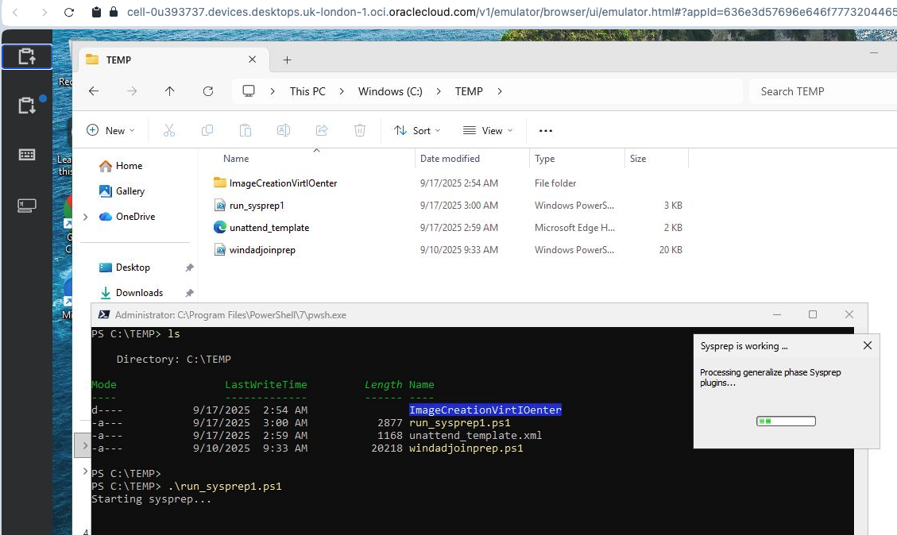

# **Customizing OCI Secure Desktops Image Using Local User Account**

&nbsp;

<h1>Overview</h1>

OCI Secure Desktops provide the flexibility to deploy independent, dedicated Windows and Linux instances for users. The service also supports advanced capabilities such as multi-monitor setups, hibernation, scalability, and more.

Oracle now offers pre-built Windows 10 and 11 images that are fully compliant with OCI Secure Desktop requirements. These images can be imported, customized with additional software, and then used to create a golden image. This golden image serves as the standardized template for all users requesting Secure Desktop instances.

While a separate document covers the integration of OCI Secure Desktops with Active Directory (AD), this guide focuses on scenarios where customers prefer not to join their OSD golden image to AD. Instead, they can install custom applications, enable local OS credentials, and manage access independently.

This tutorial provides a step-by-step walkthrough for setting up OCI Secure Desktop instances without Active Directory integration.

&nbsp;

<h1>Pre-Requisites</h1>

1. We need to design the setup. We need VCN, a private subnet and a compartment where we plan to run the service.
2. Raise OCI support SR requesting Windows 11 image. Follow this guide to import the image

From the OCI Cloud Shell, we need to run below commands to import it

1. oci compute image import from-object-uri --uri https://objectstorage.eu-frankfurt-1.oraclecloud.com/p/xxxxxxxxxxxxxxxxxxxxxxxx-cymNKXbYylUko9QaGVdtAuHE/n/frsljhpq5vpp/b/vaibhav-bucket/o/OSD/Win11_24H2_Ent_English_98717_IMDSv2_rs1.vmdk --compartment-id ocid1.compartment.oc1..aaaaaaaabmyxxxxxxxxxxxxxxxxxxxx25chzvfgonsaqt7cpyaf5q --display-name OSD-Win11–latest

2. oci --region uk-london-1 compute image update --image-id ocid1.image.oc1.uk-london-1.aaaaaaaakxxxxxxxxxxxxxxxxxxxjvpjbapuetsyrn3kh5a --operating-system Windows --operating-system-version "Windows11"

Add below tag to the image

oci:desktops:is_desktop_image              true

&nbsp;

<h1>High Level Steps</h1>

1. Run the OCI Secure Desktops Marketplace ORM stack
2. Create a Desktop Pool. Request an OSD instance and customize it.
3. Create custom image from the customized OSD instance. 
4. Create another Desktop Pool with customized image

&nbsp;

<h1>Task #1 — Configure OCI Secure Desktops via Marketplace Stack</h1>

The first step in setting up OCI Secure Desktops (OSD) is to run the OCI OSD Marketplace stack. This automates the creation of required IAM resources such as policies, groups, and roles, ensuring a standardized and secure deployment.

**Step 1: Navigate to the ORM Stack on Marketplace**

- Open a web browser and log in to the OCI Console using your administrator credentials.

- Go to Marketplace.

- Search for "Secure Desktop".

- Select the OCI Secure Desktops listing from the search results. 

- Click Launch Stack to start the deployment.

- Choose the compartment where the OSD resources (VCN, instances, etc.) will be provisioned.

 

**Step 2: Provide Stack Information**

- Enter a display name for the stack (for easy identification).

- Click Next to proceed.

- Under Setup Type, choose:
  - Setup Tenancy (This configures OSD at the tenancy level with centralized IAM policies and groups)

- Select Identity Domain
  - The Default Identity Domain is selected by default.

  - To use a non-default identity domain, check the box and write the desired domain name

- Use the dropdowns to select:

  - OSD Administrator Group – users who will manage desktop pools.

  - OSD End User Group – users who will request and use virtual desktops

 

- Enter a name for the Dynamic Group.
  - This group will be automatically created and used to assign policies for OSD instance access

- Choose the compartment where the following will reside:

  - OSD VCN (must have DNS enabled) and subnets

  - OSD Windows image

  - Provisioned OSD instances

Finish the Wizard and deploy the ORM Stack.

 

 

&nbsp;

<h1>Task #2 — Customizing OSD Image</h1>

1. Create a Desktop pool with tag "oci:desktops:is_auth" as false. Here is documentation about [tags](https://docs.oracle.com/en-us/iaas/secure-desktops/tags.htm).

2. Copy the client URL from the Desktop pool and request an instance

3. On the OSD instance install the required custom/third-party softwares as needed.

4. Create an OCI Console Connection to the instance.

    - This is required to monitor the shutdown process only. We do not have to login via the OCI Console connection.

    - To setup instance console connection, refer to the link https://support.oracle.com/support/?anchorId=&kmContentId=2933121&page=sptemplate&sptemplate=km-article 

5. Create a local account on the OS (for example opc) and add it to the administrators group

6. If you do not wish to provide administrator access to the opc user, then it is mandatory to add them to the 'Remote Desktop Users' group.

7. On the OSD instance navigate to C:\TEMP and you should see run_sysprep1 powershell script. On the OSD instance launch PowerShell v7 as Administrator and execute run_sysprep1 powershell script. It will start the sysprep process.

&nbsp;

<h1>Task #3 — Create custom image</h1>

1. Once the script runs and the OSD session will disconnect.

2. Monitor the OS shutdown process using the OCI console connection

3. Once the OS shutsdown, manually "force stop" the instance from the OCI Console.

4. Create a custom image from this instance.

5. Add the following defined tag to the image:

    - oci:desktops:is_desktop_image       true

&nbsp;

<h1>Task #4 — Create Desktop Pool for EndUsers</h1>

With the new customized image, we will create a Desktop pool and endusers will request for their respective VM's

1. Create a Desktop pool with tag "oci:desktops:is_auth" as true. The end users need to the enter the OPC user credentials created above.

2. Copy the client URL from the Desktop pool and request an instance

3. The user needs to enter the OPC credentials and should be able to get the OS home window

 

 

&nbsp;

# Acknowledgments

- **Author** - Vaibhav Tiwari (Oracle Virtualization BlackBelt)
