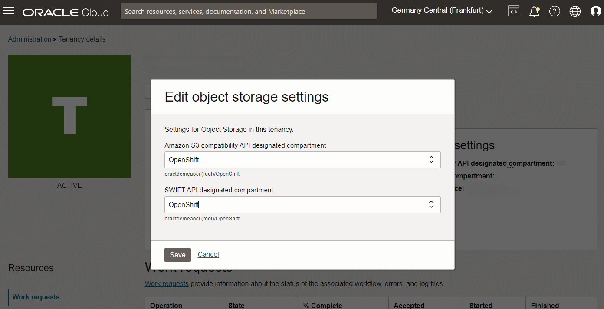
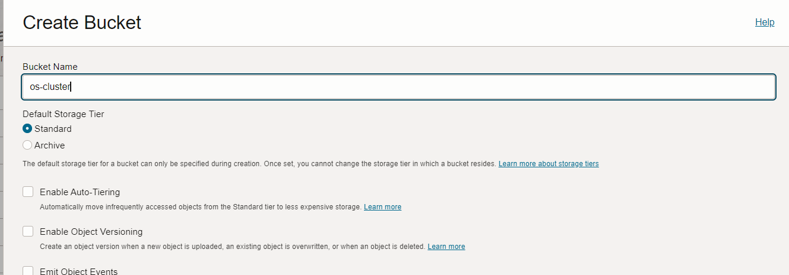
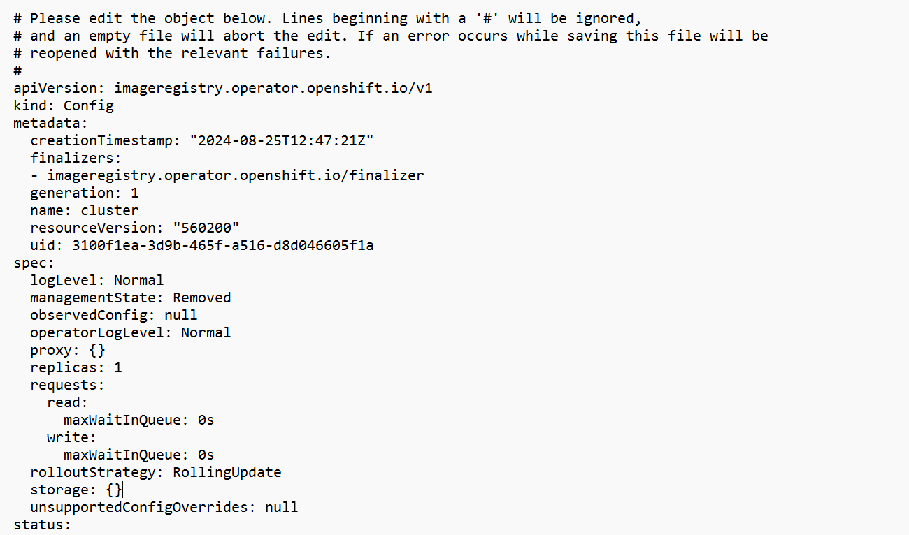
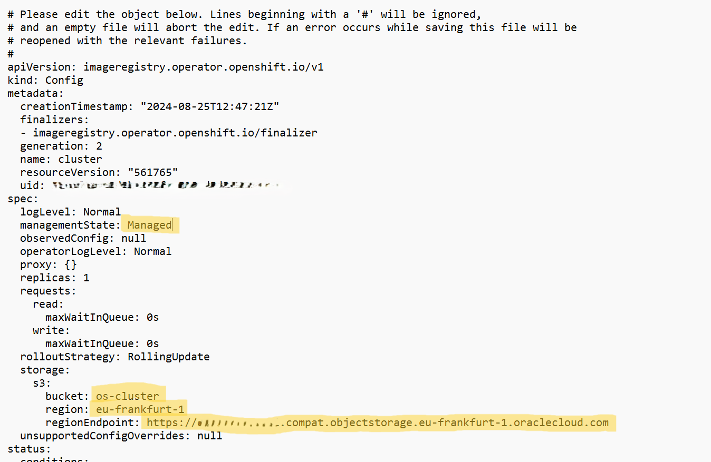
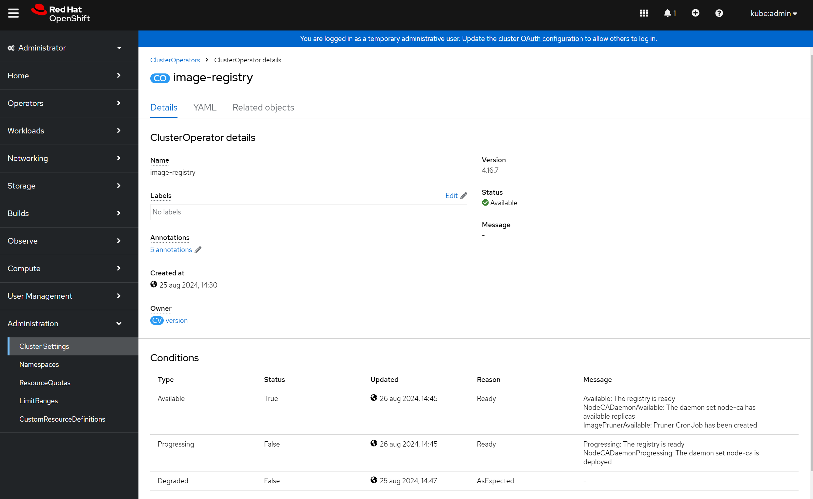

# Setting up OpenShift Image Registry to use OCI Object Storage Bucket

## Prerequisites
You need to have the OpenShift CLI tool installed and properly configured.

https://docs.openshift.com/container-platform/4.16/cli_reference/openshift_cli/getting-started-cli.html

## 1. What is the OpenShift Image Registry?
The OpenShift Image Registry is a built-in, containerized, enterprise-grade registry that stores Docker-formatted container images in a Red Hat OpenShift Container Platform cluster. It is a critical component for managing container images within the OpenShift environment, providing secure storage and efficient retrieval of container images required for deployments.

After you have created an OpenShift Cluster on OCI, the image registry is not yet configured with the right storage settings. This will result in errors when you are trying to deploy your projects. You will see error messages like ```Error starting build: an image stream cannot be used as build output because the integrated image registry is not configured```


## 2. Configure OCI Object Storage for S3 Compatibility
Oracle Cloud Infrastructure (OCI) Object Storage can be configured to work as an S3-compatible storage backend for the OpenShift Image Registry. This compatibility allows OpenShift to store container images directly in an OCI Object Storage bucket

### a. Setup the correct compartment you want to use for Object Storage S3 compatability
OCI Object Storage is S3-compatible by default, so no additional configuration is needed for basic S3 API operations. However, you may need to set the right compartment you want to use for S3 compatible buckets. 

Go to your Tenancy Details in the Governance & Administration menu and click on <b>Edit Object Storage settings</b>



Create a bucket in the selected compartment. 



### b. Create a S3 Access and Secret key
In the OCI console navigate to your profile (top right corner) and go to the <B>Customer Secret Keys</b> section.

Create a new secret and make sure you note the Secret shown, as this is only one time displayed! After the sectet is created you will also see the access key.

## 3. Create a secret for the Image Registry
Now that you have you S3 Compatible Access and Secret key, you can create this secret for image registry. This secret needs to have the name of <b>image-registry-private-configuration-user</b>

You can create the secret by running the following command, using the OpenShift CLI

```oc create secret generic image-registry-private-configuration-user --from-literal=REGISTRY_STORAGE_S3_ACCESSKEY=[your_access_key] --from-literal=REGISTRY_STORAGE_S3_SECRETKEY=[your_secret_key] --namespace openshift-image-registry```

## 4. Configure the Image Registry to use the S3 Object Storage
Last you need to configure the OpenShift internal image registry to use the OCI S3 Compatible object storage. 

You can do this by running:

```oc edit configs.imageregistry.operator.openshift.io/cluster```

You should see that currently your storage is not configured.



Remove the {} behind the storage item and create the fields for S3 object storage
```
  storage:
    s3:
      bucket: os-cluster
      region: [your-oci-region]
      regionEndpoint: https://[yournamespace].compat.objectstorage.[your-oci-region].oraclecloud.com
```

Replace the [yournamespace] with your own object storage name space. You can find this namespace on the OCI Tenancy Details page.

Replace the 2x [your-oci-region] with the OCI region you are using, for example: eu-frankfurt-1

Finally, change the <b>managementState</b> from <b>Removed</b> to <Managed>



Save and close the file and OpenShift will automatically update the image registry.

## 5. Check the Image Registry operator
You can now check if the image registry is properly configured. You can rerun the ```oc edit configs.imageregistry.operator.openshift.io/cluster``` and scroll down to the status section. You should see there a reference to the S3 opbject storage.

Alternatively you can navigate to the cluster settings page under administration on your OpenShift console. Click on <b>ClusterOperators</b> and select the <b>image-registry</b>.

Under the conditions you should see that the registry is ready.



## 6. Ready for deployment of your applications
Your image registry should now be able to store images and you are now ready to start deploying applications and templates.


# License
Copyright (c) 2024 Oracle and/or its affiliates.
Licensed under the Universal Permissive License (UPL), Version 1.0.
See [LICENSE](https://github.com/oracle-devrel/technology-engineering/blob/main/LICENSE) for more details.
