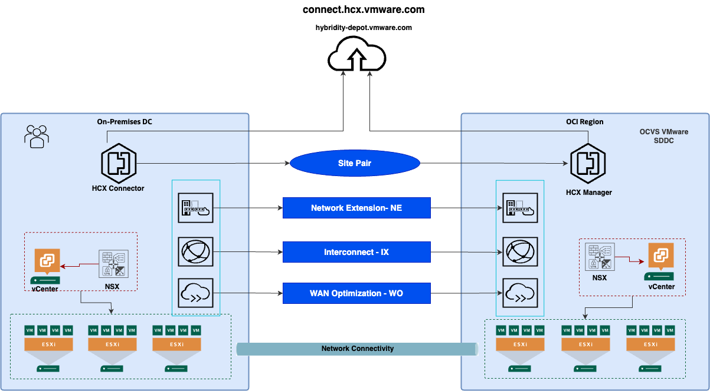
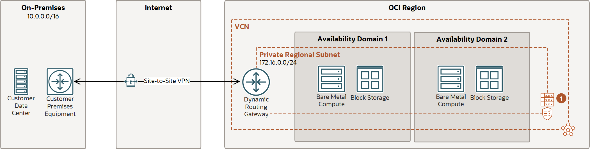

doc:
  author: Name Surname                  #Mandatory
  version: 2.5                          #Mandatory
  cover:                                #Mandatory
    title:                              #Mandatory
      -  Customer name                  #Mandatory
      -  Workload to OCI                #Mandatory
    subtitle:                           #Mandatory
      - Solution Definition             #Mandatory
  customer:                             #Mandatory
    name: \<Customer Name\>                           #Mandatory
    alias: \<Customer Alias\>                          #Mandatory
  config:
    impl:
      type: \<Service Provider\>            #Mandatory: Can be 'Oracle Lift', 'Oracle Fast Start', 'Partner' etc.   
      handover:     #Mandatory: Please specify to whom to hand over the project after implementation. eg.: The Customer, a 3rd party implementation or operations partner, etc.           
  draft: false
  history:
    - version: 1.0
      date: 1st June 2023
      authors: 
        - Base Template
      comments:
        - Created a new Solution Definition document. To be used for iterative review and improvement.
    - version: 1.1
      date: 1st July 2023
      authors: Base Template
      comments:
        - Update Template per feedback. Added security-templated texts and annex.
    - version: 1.2
      date: 1st August 2023
      authors: Base Template
      comments:
        - Update Template per feedback. As per Confluence.
    - version: 2
      date: 1st September 2023
      authors: Base Template
      comments:
        - Added Networking Annex
    - version: 2.1
      date: 1st September 2023
      authors: Base Template
      comments:
        - Updated LZ Snippet
        - Added 'Base Template' to the version table instead of 'Name Surname'
    - version: 2.2
      date: 16th October 2023
      authors: Base Template
      comments:
        - Upgraded the Logical Architecture as mandatory. It is now included in the 'Mandatory' template.
    - version: 2.3
      date: 16th January 2024
      authors: Base Template
      comments:
        - Added comment for workload snippets
        - Updates Acronyms
    - version: 2.4
      date: 26th February 2024
      authors: Base Template
      comments:
        - Added the network firewall in the requirement, the solution considerations, and in the Annex.
    - version: 2.5
      date: 8th April 2024
      authors: Base Template
      comments:
        - Added 'manageability' in the requirement, the solution considerations, and in the Annex.
  team:
    - name: ${doc.author}
      email: example@example.com
      role: Tech Solution Specialist
      company: Oracle
    - name: Ada Lovelace
      email: example@example.com
      role: Account Cloud Engineer
      company: Oracle
  acronyms:
    Dev: Development


<!--
  Author: 
    Last Change: 25th March 2024
    Review Status: Development
    Review Notes: see https://confluence.oraclecorp.com/confluence/x/9Vyyvw
    How to use this template: https://confluence.oraclecorp.com/confluence/x/LBRBvg
-->

<!--
If you need to control the hyphenation of words. Use the example below and remove the comment. Example of the default hyphenation De-vOps or in-fras-truc-ture. You can change it by defining a new hyphenation as in the example below 'in-fra-struc-ture'. Or define words without any hyphenation, for example for names such as ArgoCD.
-->
<!--
\hyphenation{Dev-Ops ArgoCD in-fra-struc-ture re-li-a-bil-i-ty}
-->

*Guide:*

*Author Responsibility*

- *Chapter 1-3: Sales Consultant*
- *Chapter 4: Implementer*

# Document Control
<!--
Role  | RACI
------|-----
ACE   | R/A
Impl. | None
PPM   | None
-->

*Guide:*

*The first chapter of the document describes the metadata for the document. Such as versioning and team members.*

## Version Control
<!--
Role  | RACI
------|-----
ACE   | R/A
Impl. | None
PPM   | None
-->

*Guide:*

*A section describing the versions of this document and its changes.*

*Example:*

```{#history}
This is the document history. Please use doc.history metadata for compiling the table
```

## Team
<!--
Role  | RACI
------|-----
ACE   | R/A
Impl. | None
PPM   | None
-->

*Guide:*

*A section describing the team.*

*Example:*

```{#team}
This is the team that is delivering the WAD. Please use doc.team metadata for compiling the table
```

## Document Purpose
<!--
Role  | RACI
------|-----
ACE   | R/A
Impl. | None
PPM   | None
-->

*Guide:*

*Describe the purpose of this document and the Oracle-specific terminology, specifically around 'Workload'.*

<!--                            -->
<!-- End of 1) Document Control -->
<!--                            -->

# Business Context
<!--
Role  | RACI
------|-----
ACE   | R/A
Impl. | None
PPM   | None
-->

*Guide:*

*Describe the customer's business and background. What is the context of the customer's industry and LoB? What are the business needs and goals that this Workload is an enabler for? How does this technical solution impact and support the customer's business goals? Does this solution support a specific customer strategy, or maybe certain customer values? How does this solution help our customers to either generate more revenue or save costs?*


## Executive Summary
<!--
Role  | RACI
------|-----
ACE   | R/A
Impl. | None
PPM   | None
-->

*Guide:*

*A section describing the Oracle differentiator and key values of the solution of our solution for the customer, allowing the customer to make decisions quickly.*

## Workload Business Value
<!--
Role  | RACI
------|-----
ACE   | R/A
Impl. | None
PPM   | None
-->


<!--                            -->
<!-- End of 2) Business Context -->
<!--                            -->

The Oracle Cloud VMware Solution is a customer-managed Software-defined Data Center solution offering customers a choice to run flexible infrastructure to host mission-critical workloads. The customer can seamlessly migrate or protect workloads from the on-premises VMware environment to Oracle Cloud VMware Solution promptly with the help of the native migration and disaster recovery tool offered with the solution. Since the platform remains the same there are no efforts required to re-factor the applications rather customer can focus on the cloud transformation journey.

# Workload Requirements and Architecture

## Overview
<!--
Role  | RACI
------|-----
ACE   | R/A
Impl. | None
PPM   | None
-->

*Guide:*

*Describe the Workload: What applications and environments are part of this Workload migration or new implementation project, and what are their names? The implementation will be scoped later and can be a subset of the Solution Definition and proposed overall solution. For example, a Workload could exist of two applications, but the implementer would only include one environment of one application. The workload chapter is about the whole Workload and the implementation scope will be described later in the chapter [Solution Scope](#solution-scope).*

Oracle guides in planning, architecting, prototyping, and managing cloud migrations and disaster recovery solutions. Customers can move or protect critical workloads in weeks, or even days, instead of months by leveraging these included services.  

Oracle will support in setting up the target OCVS architecture based on customer business and technical requirements.

Oracle will move or protect selected VMs of the on-premise VMware to Oracle Cloud Infrastructure.

__The objectives of this document are to:__


Additionally, the these are the high-level goals for this document:

1.	Review together the existing on-premise architecture, map it to relevant Oracle OCI services, and propose a high-level tailored cloud architecture design.

2.	Provide the OCI architecture guidelines

3.	Address all OCVS-related aspects at security, network, compute, storage, and other levels for implementing the target cloud architecture.

4.	Set up the OCVS cloud environment according to the agreed design & architecture.

5.	Define the scope of the potential LIFT services.

## Non-Functional Requirements
<!--
Role  | RACI
------|-----
ACE   | R/A
Impl. | None
PPM   | None
-->

*Guide:*

*Describe the high-level technical requirements for the Workload. Consider all sub-chapters, but decide and choose which Non-Functional Requirements are necessary for your engagement. You might not need to capture all requirements for all sub-chapters.*

*This chapter is for describing customer-specific requirements (needs), not to explain Oracle solutions or capabilities.*

The client wants to build a disaster recovery solution that will secure business-critical VMware workloads so that in the event of an on-premise data center failure, they can quickly recover IT services on OCI and OCVS.

### Regulations and Compliances Requirements

*Guide:*

*This section captures specific regulatory or compliance requirements for the Workload. These may limit the types of technologies that can be used and may drive some architectural decisions.*

*The Oracle Cloud Infrastructure Compliance Documents service lets you view and download compliance documents:
https://docs.oracle.com/en-us/iaas/Content/ComplianceDocuments/Concepts/compliancedocsoverview.htm*

*If there are none, then please state it. Leave the second sentence as a default in the document.*

*Example:*

At the time of this document creation, no Regulatory and Compliance requirements have been specified.

In addition to these requirements, the [CIS Oracle Cloud Infrastructure Foundation Benchmark, v1.2](https://www.cisecurity.org/benchmark/Oracle_Cloud) will be applied to the Customer tenancy.

### Environments

*Guide:*

*A diagram or list detailing all the required environments (e.g. development, text, live, production, etc.).*

*If you like to describe a current state, you can use or add the chapter 'Current Sate Architecture' before the 'Future State Architecture'.*


Example:

Name	        | Number of VMs  | Location	  | DR    | Scope
:---		    |:---		   	|:---		  |:---   |:---
Environment 1     |          	| Malaga	  | Yes   | in Scope
Environment 2         |             | Sevilla     | Yes    | in Scope
Environment 3      |             | Sevilla     | Yes    | in Scope


### High Availability and Disaster Recovery Requirements

*Guide:*

*This section captures the resilience and recovery requirements for the Workload. Note that these may be different from the current system.*

*The Recovery Point Objective (RPO) and Recovery Time Objective (RTO) requirement of each environment should be captured in the environments section above, and wherever possible.*

- *What are the RTO and RPO requirements of the Application?*
- *What are the SLAs of the application?*
- *What are the backup requirements*

*Note that if needed, this section may also include an overview of the proposed backup and disaster recovery proposed architectures.*

*This chapter is mandatory, while there could be no requirements on HA/DR, please mention that in a short single sentence.*

*Example:*

At the time of this document creation, no Resilience or Recovery requirements have been specified.


### Disaster recovery to OCVS

This section describes the disaster recovery options and tools that will be used to protect selected workloads to OCVS. Below there are two examples of DR solutions that could be used to protect onpremises workloads to OCVS. HCX DR is included in   OCVS service and it provides basic DR capabilities. Another solution is VMware SRM that is more advanced solution licensed separately, not included in OCVS service. There are on the market also 3rd party solutions like Veeam, Rackware, Zerto and others which are not described in this document.


#### Disaster recovery architecture with VMware HCX

HCX is an application mobility platform that allows you to migrate and protect VMs from an on-premises VMware environment to the OCVS SDDC. HCX Disaster recovery is a feature intended to protect virtual workloads managed by VMware vSphere that are either deployed in a private or a public cloud.

The technical implementation of VMware HCX consists of the steps that are required to be performed at on-premises site and at the cloud site. The VMware HCX implementation and configuration at Oracle Cloud is taken care as part of the SDDC provisioning operation. Therefore, only minimum steps are required to be performed at Oracle Cloud side for successful implementation of VMware HCX.

The following image illustrates the solution overview for VMware HCX implementation with Oracle Cloud VMware Solution.



HCX Disaster Recovery use the vSphere Replication technologies to transfer virtual machine disk data. When a virtual machine protection operation is first run, the replication engine performs a full synchronization of all the data that makes up the virtual machine to the target location datastore. Following that baseline synchronization, the system performs a delta synchronization, meaning that only changed data blocks are replicated.

Delta synchronisation occurs based on the recovery point objective (RPO) interval configured for the virtual machine, creating a replication instance. The selectable RPO ranges from 5 minutes to 24 hours. For example, setting the Recovery Point Objective (RPO) to 2 hours means that the maximum data loss that your organization can tolerate is 2 hours.

##### Licensing

The HCX comes with two different types of license, HCX Advanced included in OCVS service and the HCX Enterprise as an additional SKU which can be enabled from the OCI console on a monthly subscription basis.

According to the feature requirements, the HCX license type should be carefully evaluated. For more details about the HCX licensing comparison, refer to the document link below.

[HCX License types](https://docs.oracle.com/en-us/iaas/Content/VMware/Concepts/ocvsoverview.htm#aboutsoftware__hcx-license-types)

__Please note:__ If you are using OCVS with Standard Shapes, then the HCX enterprise is included in the subscription and no additional cost is required.

__Please Note:__ Please check the VMware interoperability matrix for version compatibility of VMware HCX with the source vSphere environment.


#### Disaster recovery architecture with VMware Site Recovery Manager

VMware Site Recovery Manager is an extension to VMware vCenter that provides disaster recovery, site migration, and non-disruptive testing capabilities. It is more advanced solution in comparison to VMware HCX DR.

Site Recovery Manager works in conjunction with VMware vSphere Replication to automate the process of migrating, recovering, testing, re-protecting, and failing-back virtual machine workloads.

Migration of protected inventory and services from one site to the other is controlled by a recovery plan that specifies the order in which virtual machines are shut down and started up, the resource pools to which they are allocated, and the networks they can access.

Site Recovery Manager enables the testing of recovery plans, using a temporary copy of the replicated data, and isolated networks in a way that does not disrupt ongoing operations at either site.

 Multiple recovery plans can be configured to migrate individual applications and entire sites providing finer control over what virtual machines are failed over and failed back.

Site Recovery Manager extends the feature set of the virtual infrastructure platform to provide for rapid business continuity through partial or complete site failures.

High-level architecture of disaster recovery to OCVS with SRM.


### Security Requirements

*Guide:*

*Capture the Non-Functional Requirements for security-related topics. The requirements can be (but don't have to be) separated into:*
- *Identity and Access Management*
- *Data Security*

*Other security topics, such as network security, application security, key management, or others can be added if needed.*

*Example:*

At the time of this document creation, no Security requirements have been specified.

### Networking Requirements

*Guide*

*Capture the Non-Functional Requirements for networking-related topics. You can use the networking questions in the [Annex](#networking-requirement-considerations)*


*Example:*

At the time of this document creation, no Networking requirements have been specified.

### Management and Monitoring

## Future State Architecture
<!--
Role  | RACI
------|-----
ACE   | R/A
Impl. | None
PPM   | None
-->

*Guide:*

*The Workload Future State Architecture can be described in various forms. In the easiest case, we describe a Logical Architecture, possibly with a System Context Diagram. A high-level physical architecture is mandatory as a description of your solution.*

*This should be the final architecture as part of the pre-sales solution, not an intermediate or draft version*

*Additional architectures, in the subsections, can be used to describe needs for specific workloads.*

### Mandatory Security Best Practices

*Guide:*

*Use this text for every engagement. Do not change. Aligned with the Cloud Adoption Framework*


### Naming Conventions

*Guide:*

*This chapter describes naming convention best practices and usually does not require any changes. If changes are required please refer to [Landing Zone GitHub](https://github.com/oracle-devrel/technology-engineering/tree/main/landing-zones). The naming convention zone needs to be described in the Solution Design by the service provider.*

*Use this template ONLY for new cloud deployments and remove it for brownfield deployments.*


### OCI Landing Zone Solution Definition

*Guide:*

*This chapter describes landing zone best practices and usually does not require any changes. If changes are required please refer to [Landing Zone GitHub](https://github.com/oracle-devrel/technology-engineering/tree/main/landing-zones). The full landing zone needs to be described in the Solution Design by the service provider.*

*Use this template ONLY for new cloud deployments and remove it for brownfield deployments.*

```{.snippet}
ar-landingzone
```
All the above OCI and OCVS networking and security services and principles are implemented through the concept of a Landing Zone. The following diagram illustrates the Landing Zone reference architecture specific to the deployment of OCVS.


This architecture is designed specifically for Oracle Cloud VMware Solution which sits on top of the OCI core services such as Bare Metal Compute, and VCN networking. The architecture starts with the compartment design for the tenancy along with groups and policies for the segregation of duties.

In Landing Zone, tenancy should have a dedicated compartment for VMware SDDC deployment. The existing tenancy can also be used but it is recommended to segregate the VMware SDDC environment from other OCI resources. The VMware SDDC Compartment is assigned a group with appropriate permissions for managing resources in the compartment and for accessing required resources in other compartments. As a best practice, it is recommended to create a dedicated compartment for VCN leveraged by the OCVS deployment to keep the networking resources completely separated in a dedicated compartment.

The VMware SDDC compartment will be utilised to deploy the SDDC service. The SDDC network compartment will host dedicated VCN resources to maintain the isolation of the VMware and network resources and thus use the IAM policies for network resource and access management. Oracle Cloud VMware Solution deployment workflow is a fully automated process and takes care of provisioning of required to compute & networking resources maintaining the security standard.

The Landing Zone for OCVS includes pre-configured networking resources such as subnet, VLANs, Network Security Group, Security List, and Route Tables maintaining the security posture needed for enterprise VMware workloads. Also, it includes pre-configured Compute Bare Metal services required for VMware hypervisor operation. Additionally, VMware NSX as a Software Defined Networking is pre-configured but isolated in an overlay network zone.

Additional OCI services such as Cloud Guard, Events, Notifications, and WAF can be used to operate and monitor OCI resources for Oracle Cloud VMware Solutions such as OCI Compute, and OCI Network. The Notifications are set using Topics and Events for alerting administrators about changes in the deployed resources for this environment.

__Please Note__ The VMware workloads can use limited OCI services when it comes to integration of VMware SDDC workloads to OCI.
Low-level design of Landing zone with ${doc.customer.name}" relevant specific technical details will be provided during the architecture Design discovery process.
The network for the SDDC network should not overlap with the existing networks in ${doc.customer.name}" tenancy. The SDDC can be scaled up to a maximum of 64 hosts with /21 SDDC CIDR range.

__Note:__ The table is a representation of the sample network layout for the /22 network however based on the SDDC CIDR range selected we can expect an automated network layout created by the SDDC provisioning operation with different network range for VLANS.
SDDC workload CIDR will be identified as a part of the low-level design during the implementation.


| VLAN Name                   | CIDR Range    |
|:----------------------------|:--------------|
| Provisioning Subnet         | 10.0.0.0/26   |
| VLAN-SDDC-NSX Edge Uplink 1 | 10.0.0.64/26  |
| VLAN-SDDC-NSX Edge Uplink 2 | 10.0.0.128/26 |
| VLAN-SDDC-NSX Edge VTEP     | 10.0.0.192/26 |
| VLAN-SDDC-NSX VTEP          | 10.0.1.0/26   |
| VLAN-SDDC-vMotion           | 10.0.1.64/26  |
| VLAN-SDDC-vSAN              | 10.0.1.128/26 |
| VLAN-SDDC-vSphere           | 10.0.1.192/26 |
| VLAN-SDDC-HCX               | 10.0.2.0/26   |
| VLAN-SDDC-Replication Net   | 10.0.2.64/26  |
| VLAN-SDDC-Provisioning Net  | 10.0.2.128/26 |


### Logical Architecture
<!--
Role  | RACI
------|-----
ACE   | R/A
Impl. | None
PPM   | None
-->

*Guide:*

*Provide a high-level logical Oracle solution for the complete Workload. Indicate Oracle products as abstract groups, and not as physical detailed instances. Create an architecture diagram following the latest notation and describe the solution.*

*To implement a solution the Physical Architecture is needed in the next chapter. The physical notation can show individual components with physical attributes such as IP addresses, hostnames, or sizes.*

*[The Oracle Cloud Notation, OCI Architecture Diagram Toolkits](https://docs.oracle.com/en-us/iaas/Content/General/Reference/graphicsfordiagrams.htm)*

### Physical Architecture
<!--
Role  | RACI
------|-----
ACE   | R/A
Impl. | None
PPM   | None
-->

*Guide:*

*The Workload Architecture is typically described in a physical form. This should include all solution components. You do not have to provide solution build or deployment details such as IP addresses.*

*Please describe the solution with an architecture image plus a written text. If you have certain specifics you like to explain, you can also use the Solution Consideration chapter to describe the details there.*

*[The Oracle Cloud Notation, OCI Architecture Diagram Toolkits](https://docs.oracle.com/en-us/iaas/Content/General/Reference/graphicsfordiagrams.htm)*

*Reference:*

[StarterPacks (use the search)](https://github.com/oracle-devrel/technology-engineering/)

*Example:*


The future state architecture covers the current on-premises workloads to be hosted on Oracle Cloud VMware Solution(OCVS). The OCVS is deployed at the Availability Domain (AD) in the OCI region and spans across 3 Fault Domains (FD) in the region.
The OCI Bare Metal (BM) instances utilized by the service are spread across the Fault Domain (FD) in a round-robin fashion offering complete redundancy to the OCVS workloads.
The OCVS comes with two distinct architectures as represented below.
- OCVS with DenseIO server - This architecture primarily uses vSAN Storage leveraging NVMe drives from the local Bare Metal (BM) servers.
- OCVS with Standard Shapes - This architecture is completely based on the OCI Block Storage as a primary storage option for the VM workloads.


Oracle Cloud VMware Solution is the central part of this deployment and provides a fully automated implementation of a VMware software-defined data center (SDDC) within your Oracle Cloud Infrastructure tenancy. The solution runs on Oracle Cloud Infrastructure Bare Metal Compute and contains the following VMware components:

* VMware vSphere Hypervisor (ESXi)
* VMware vCenter Server
* VMware vSAN
* OCI Block Storage
* VMware NSX-T
* VMware HCX Advanced


The architecture has the following components:

__OCVS__

The __VMware SDDC__ - consists of vSphere (ESXi + vCenter), NSX-T, vSAN & HCX. The SDDC deployment can be on OCI DenseIO shapes that offer vSAN Storage or it can be on OCI Standard Shape with OCI Block Storage as a primary storage option.  

* __VMware HCX__ - Application mobility platform designed for simplifying application migration, workload re-balancing, and business continuity across data centers and clouds. This will allow the seamless migration of VMware workloads to OCVS.

* __HCX Manager__ – HCX manager is an appliance deployed in Oracle Cloud VMware Solution. HCX manager will be paired with an on-premises vCenter through HCX Connector.  

* __HCX Connector__ – HCX connector is an appliance deployed at an on-premises vCenter server which will be then paired with the HCX manager in the cloud for the base configuration necessary for workload migration.  

* __VMware NSX-T__ - This is NSX-T Data Center implementation as part of the SDDC stack used for Software Defined Networking. The migrated workloads can use NSX network segments for networking usage. NSX-T offers full perimeter services configuration in OCVS environments such as Load Balancer, Routing, Switching, firewall, and micro-segmentation.

* __VMware vSAN__ - VMware vSAN is a software-defined storage solution offered as part of the OCVS SDDC solution. The vSAN has been configured by leveraging locally attached NVMe all-flash disks from each OCI Bare Metal server to offer common storage for workloads.

* __OCI Block Storage__ - The OCI Block storage can be leveraged as an additional storage option with DenseIO compute SDDC along with vSAN. The Standard Shape OCVS environment consists of OCI block storage as the only primary storage option.

* __VMware vSphere__ - Includes ESXi and vCenter servers

* __FastConnect__ - OCI FastConnect is a dedicated private high-speed network link connected to ${doc.customer.name} Data Center and OCI region. The FastConnect will be leveraged for migrating the workloads over the network.


## Solution Considerations


<!--
Role  | RACI
------|-----
ACE   | R/A
Impl. | None
PPM   | None
-->

*Guide:*

*Describe certain aspects of your solution in detail. What are the security, resilience, networking, and operations decisions you have taken that are important for your customer?*

### High Availability and Disaster Recovery

*Reference:*

- [Resilliance on OCI](https://docs.public.oneportal.content.oci.oraclecloud.com/en-us/iaas/Content/cloud-adoption-framework/era-resiliency.htm)
- [Workload Related Content](https://github.com/oracle-devrel/technology-engineering/)
#### OCVS Resilience and Recovery

Oracle Cloud VMware Solution is deployed at Availability Domain (AD) within the OCI region. Each Availability domain consists of Fault Domains to maintain a fault-tolerant and highly resilient environment. For more details about OCI Availability domains and Fault Domains refer to the [OCI documentation](https://docs.oracle.com/en-us/iaas/Content/General/Concepts/regions.htm).

The details of the Oracle Cloud Infrastructure SLAs are found in the link below.
[OCI Service SLA](https://www.oracle.com/ae/cloud/sla/).

##### OCVS High Availability
This section describes the VMware SDDC High Availability.

__OCI BM Compute (ESXi):__ The OCI native services such as compute bare metal and VCN resources are highly resilient cloud service offerings from Oracle Cloud Infrastructure. OCI BM failure can be addressed by replacing the faulty node with a new ESXi host in the cluster.

__OCI BM NVMe (vSAN):__ The OCVS SDDC consist of vSAN for the software-defined storage layer. With vSAN's failure to tolerate (FTT) feature, host failures, and data loss can be effectively managed. Customers can utilize the vSAN SPBM (Storage Policy Based Management) which includes different RAID levels to protect the data.

__OCVS Networking (NSX-T):__ The OCVS SDDC consists of NSX-T implementation to manage software-defined networking. The NSX Edge, Managers/Controllers are deployed in a fully redundant manner to maintain high availability.

__OCI Block Storage:__ The OCI Block Storage offers the highest level of data resiliency by the backend system at the availability domain. The OCI Block storage being the primary storage option with OCVS does not require RAID configuration but rather relies on the resiliency offered by the Oracle Cloud Infrastructure.


### Security

*Guide:*

*Please describe your solution from a security point of view. Generic security guidelines are in the Annex chapter.*

*Example:*

Please see our security guidelines in the [Annex](#security-guidelines).
Oracle employs best-in-class, enterprise-grade security technology, and operational processes to secure cloud services. To deploy and operate your workloads securely in Oracle Cloud, you must be aware of your security and compliance responsibilities.

Oracle ensures the security of cloud infrastructure and operations, such as cloud operator access controls and infrastructure security patching. You’re responsible for configuring your cloud resources securely. The following graphic illustrates the shared security responsibility model.  


__OCVS specific Responsibility Matrix__


Oracle is solely responsible for all aspects of the physical security of the Availability Domains and Fault Domains in each region. Both Oracle and you are responsible for the infrastructure security of hardware, software, and the associated logical configurations and controls.

As a customer, your security responsibilities encompass the following:

* The platform you create on top of Oracle Cloud.
* The applications that you deploy.
* The data that you store and use.
* The overall governance, risk, and security of your workloads.

The shared responsibility extends across different domains including identity management, access control, workload security, data classification and compliance, infrastructure security, and network security.

#### OCVS Security Posture

The section below describes the security posture of Oracle Cloud VMware Solution and Oracle Cloud Infrastructure.

* Access to the Customer's OCI tenancy is restricted and controlled using IAM and IDCS federations. Network sources can be optionally used to restrict access from known IP addresses within VCN or on-premises.

* Security in a subnet can be controlled by Security Lists and/or Network Security Groups. OCI is a zero-trust environment by default, you must explicitly permit traffic for known communication patterns. Additional security can be offered to Customer's external facing applications using OCI Web Application Firewall.

* VLAN resides in VCN and is only provisioned for OCVS service. Each VLAN is attached to the Network Security Group to control traffic. All traffic inside a VLAN is blocked by default.

* An NSX Segment is an overlay network that runs on top of the VMware virtualization stack. This network is independent outside of the VCN network. Any communication from the NSX overlay segment to OCI resources needs to be explicitly allowed through uplink interfaces using routing and controlled using security lists.

* Security in an NSX Segment is managed by the NSX-T control plane, by default all traffic inside a segment is allowed. The NSX Micro-Segmentation enables you to increase the agility and efficiency of your network infrastructure while maintaining the highest level of security posture.

* Users from an on-premises environment can securely connect to Oracle Cloud VMware Solution resources through IPSec and or FastConnect.

* Bastion host is deployed in a public subnet in Customer's tenancy. Secured access is allowed for Remote Desktop Protocol (RDP) through Internet Gateway and controlled using a security list.

* The OCVS SDDC environment is allowed to access only from the Bastion host.

#### OCVS Data Security

This section details Data Security for the virtual machines in the OCVS environment. It also provides details about how encryption works in vSAN and possible options for Data at rest and Data at transit. We have not received any data security requirements from the Customer. Therefore, the below section details out-of-the-box data security standards for OCVS.

__vSAN Data-At-Rest__

Oracle Cloud VMware Solution uses VMware vSAN technology for virtual machine storage management. vSAN comes with its own data-at-rest encryption technique. vSAN can encrypt data at rest in the vSAN datastore. Data at rest encryption within vSAN requires an external Key Management Server (KMS) or a vSphere Native Key Provider.
vSAN data at rest encryption is out of the scope of this project. However, customers can enable the data-at-rest encryption anytime at cluster provided it meets the required pre-requisite.

__vSAN Data-in-Transit__

Oracle Cloud VMware Solution uses VMware vSAN technology for virtual machine storage management. vSAN can encrypt data in transit, as it moves across hosts in your vSAN cluster. vSAN can encrypt data in transit across hosts in the cluster. When you enable data-in-transit encryption, vSAN encrypts all data and metadata traffic between hosts. Traffic between data hosts and witness hosts is encrypted.
vSAN data encryption in transit is out of the scope of this project. However, the Customer can enable this functionality at the vSAN cluster in OCVS SDDC.

__Block Storage Encryption__

OCI Block Storage can be used to scale the storage for DenseIO OCVS deployment and be used as primary storage in the case of Standard Shapes OCVS. OCI Block Volume is presented to the VMware ESXi server as an iSCSI target to store virtual machine files. OCI security features such as KMS, encryption, and vaults apply to VM data stored in OCI Block Volume. OCI Block Volume is mounted as an external Datastore for VMware SDDC by leveraging OCI managed/Customer managed keys for VM data encryption.

### Networking

*Guide:*

```{.snippet}
network-solution-considerations-guide
```

*Reference:*

*A list of possible Oracle solutions can be found in the [Annex](#networking-solutions).*

*Example:*

```{.snippet}
network-solution-firewall
```
The architecture has the following components:

* __On-premises Network__ - This network is the local network used by your organization. It is one of the spokes of the topology.

* __Region__ - An Oracle Cloud Infrastructure region is a localized geographic area that contains one or more data centers, called availability domains. Regions are independent of other regions, and vast distances can separate them (across countries or even continents).

* __Virtual Cloud Network (VCN)__ - A VCN is a customizable, private network that you set up in an Oracle Cloud Infrastructure region. Like traditional data center networks, VCNs give you complete control over your network environment. You can segment VCNs into subnets, which can be scoped to a region or an availability domain. Both regional subnets and availability domain-specific subnets can coexist in the same VCN. A subnet can be public or private.

* __Security List__ - For each subnet, you can create security rules that specify the source, destination, and type of traffic that must be allowed in and out of the subnet.

* __Network Security Group (NSG)__ - NSGs act as virtual firewalls for your cloud resources. With the zero-trust security model of Oracle Cloud Infrastructure, all traffic is denied, and you can control the network traffic inside a VCN. An NSG consists of a set of ingress and egress security rules that apply to only a specified set of VNICs in a single VCN.

* __Route Table__ - Route tables contain rules to route traffic from subnets to destinations outside a VCN, typically through gateways.

* __Dynamic Routing Gateway (DRG)__ - The DRG is a virtual router that provides a path for private network traffic between a VCN and a network outside the region, such as a VCN in another Oracle Cloud Infrastructure region, an on-premises network, or a network in another cloud provider.

* __Bastion Host__ - The bastion host is a compute instance that serves as a secure, controlled entry point to the topology from outside the cloud. The bastion host is provisioned typically in a demilitarized zone (DMZ). It enables you to protect sensitive resources by placing them in private networks that can't be accessed directly from outside the cloud. The topology has a single, known entry point that you can monitor and audit regularly. So, you can avoid exposing the more sensitive components of the topology without compromising access to them.

* __VPN Connect__ - VPN Connect provides site-to-site IPSec VPN connectivity between your on-premises network and VCNs in Oracle Cloud Infrastructure. The IPSec protocol suite encrypts IP traffic before the packets are transferred from the source to the destination and decrypts the traffic when it arrives.

* __FastConnect__ - Oracle Cloud Infrastructure FastConnect provides an easy way to create a dedicated, private connection between your data center and Oracle Cloud Infrastructure. FastConnect provides higher-bandwidth options and a more reliable networking experience when compared with internet-based connections.

#### Network connectivity options (on-premises to OCI)

##### IPSec VPN

The following diagram of a reference architecture shows how to set up a Virtual Private Network (VPN) to connect to a customer's on-premises network and VCN.



IPSec VPN architecture has the following components:

* __VPN Connect__ - Function that manages IPSec VPN connections to your tenancy.

* __Customer-Premises Equipment (CPE)__ - An object that represents the network asset that lives in the on-premises network and establishes the VPN connection. Most border firewalls act as the CPE, but a separate device (like an appliance or a server) can be a CPE.

* __Internet Protocol Security (IPSec)__ - A protocol suite that encrypts IP traffic before packets are transferred from the source to the destination.

* __Tunnel__ - Each connection between the CPE and Oracle Cloud Infrastructure.

* __Border Gateway Protocol (BGP) routing__ - Allows routes to be learned dynamically. The DRG dynamically learns the routes from your on-premises network. On the Oracle side, the DRG advertises the VCN's subnets.

* __Static Routing__ - When you create the VPN connection, you inform the existing networks on each side. Changes are not learned dynamically.

IPSec VPN will be used to provide for the connection between ${doc.customer.name}" data center and Oracle OCI Public cloud region for standard day-to-day operational purposes. Based on the current information IPSec connection is already established.

##### Fast Connect

The following reference architecture diagram shows how to set up a FastConnect connection between your on-premises network and Virtual Cloud Network (VCN).


* __Border Gateway Protocol (BGP) routing__ - Allows routes to be learned dynamically. The DRG dynamically learns the routes from your on-premises network. On the Oracle side, the DRG advertises the VCN's subnets.

* __Private Peering__ - Extends existing infrastructure by using private IP addresses.

* __Public Peering__ - Allows public Oracle Cloud Infrastructure services to be accessed using a private connection instead of the internet.

* __Virtual Circuit__ - The private path used to connect on-premises and Oracle Cloud Infrastructure. It can include multiple lines, physical or logical, depending on the requirements and capabilities of the line provider.

Fast Connect will be used to provide for the connection between ${doc.customer.name}" data center and Oracle OCI Frankfurt cloud region for the period migrations of VMs from on-premise to Oracle cloud.  It is a requirement to use Fast Connect at least for the period of workload migration.

##### OCVS Specific Networking Configuration Within OCI

The Oracle Cloud VMware Solution networking categorises into Virtual Cloud Networks, Subnets, and VLANs. Each VLAN within VCN is attached to the Network Security Group for network communication and Route Table for routing functionality. Similarly, the subnet created as an outcome of the SDDC provisioning operation is attached to Security List and Route Table.


##### OCI Virtual Cloud Network (VCN) for OCVS

All the resources in OCVS/SDDC architecture are in a single VCN.
For VMware SDDC we need at least /24 network CIDR but recommended is to have a dedicated /16 VCN CIDR block that can accommodate future scaling of the networks.

| VCN                      | CIDR Range              |
|:-------------------------|:------------------------|
| VCN Name                 | 10.0.0.0/16             |
| SDDC CIDR                | 10.0.0.0/21             |
| Workload CIDR (Optional) | 192.168.10.0/24 (NSX-T) |

The OCVS networking resources such as Subnet, VLANs, Network Security Groups (NSG), Route Tables, and Gateways are the result of OCVS SDDC provisioning operation. The network CIDR ranges for the management VLANs are solely dependent on the size of the SDDC CIDR. The network design considerations should be carefully assessed before provisioning the OCVS environment.

### Manageability and Observability

*Example:*

```{.snippet}
manageability-sol-con
```


## Sizing and Bill of Materials
<!--
Price Lists and SKUs / Part Numbers: https://esource.oraclecorp.com/sites/eSource/ESRCHome
-->

*Guide:*

*Estimate and size the physically needed resources of the Workload. The information can be collected and is based upon previously gathered capacities, business user numbers, integration points, or translated existing on-premises resources. The sizing is possibly done with or even without a Physical Architecture. It is okay to make assumptions and to clearly state them!*

*Clarify with sales your assumptions and your sizing. Get your sales to finalize the BoM with discounts or other sales calculations. Review the final BoM and ensure the sales are using the correct product SKUs / Part Number.*

*Even if the BoM and sizing were done with the help of Excel between the different teams, ensure that this chapter includes or links to the final BoM as well.*

<!--                                                 -->
<!-- End of 3) Workload Requirements and Architecture -->
<!--                                                 -->

<!-- Use the below chapter only for Oracle Implementations such as Lift and FastStart. do not describe the work plan for 3rd Party implementation partners -->


# Project Implementation (Only for Oracle Implementations!)

## Solution Scope

### Disclaimer
<!--
Role  | RACI
------|-----
ACE   | R/A
Impl. | None
PPM   | None
-->

*Guide:*

*A scope disclaimer should limit scope changes and create awareness that a change of scope needs to be agreed upon by both parties.*

*Example:*

```{.snippet}
uc-disclaimer
```

### Overview
<!--
Role  | RACI
------|-----
ACE   | R/A
Impl. | R
PPM   | C
-->

*Guide:*

*Describe the scope of the implementation as a sub-set of the Workload scope. For example one environment from one application.*

*Example:*

- Design and configure “least privilege” access controls and enable user access using OCI IAM compartments, groups, and policies.
- Design and provide a secure, scalable OCI network architecture.


### Business Value
<!--
Role  | RACI
------|-----
ACE   | R/A
Impl. | C
PPM   | C
-->

*Guide:*

*What's the value for the customer to do an Oracle implementation? For example, speed of deployment and the resulting impact on time to market, and free service. Do not describe Oracle's value or consumption.*

*Example:*

```{.snippet}
uc-business-value
```

### Success Criteria
<!--
Role  | RACI
------|-----
ACE   | R/A
Impl. | R
PPM   | C
-->

*Guide:*

*Technical success criteria for the implementation. As always be S.M.A.R.T: Specific, Measurable, Achievable, Relevant, Timebound. Example: 'Deployment of all OCI resources for the scoped environments in 3 months'.*

*Example:*

The below-listed success criteria are for the ${doc.config.impl.type} implementation only. Partner activities and success criteria are not listed in this documentation.

- Finish provisioning of all OCI resources
- Establish all required network connectivity
- Successfully pass all test cases
- Finished handover with documentation
- Complete the Implementation Security Checklist

## Workplan

### Deliverables
<!--
Role  | RACI
------|-----
ACE   | A
Impl. | R
PPM   | None
-->

*Guide:*

*Describe deliverables within the implementation scope. Including this documentation as Solution Definition and the later following Solution Design. This should be a generic reusable text, provided by the implementers.*

### Included Activities
<!--
Role  | RACI
------|-----
ACE   | A
Impl. | R
PPM   | None
-->

*Guide:*

*Describe the implementation activities in detail. It does not need to include a list of cloud services or OCI capabilities, but rather includes activities such as 'Provisioning of Infrastructure Components'. Include scope boundaries in terms of the number of environments, resource count to be provisioned, data volume to be migrated, etc.*

*Example:*
The implementation scope of work includes the following activities:

**OCI Foundation & Network**
- OCI Foundation Setup - 1 Region (REGION NAME)
- OCI Networking configuration
  * Creation of VCN for up to 3 environments (up to 12 VCNs total)
  * DRG and inter-VCN routing
  * Deployment of standard Security lists and NSG in VCN
  * Deployment of Route Tables in VCNs
- Configure one site-to-site IPSec VPN between OCI & on-premises
- Configure Web Application Firewall to route the incoming internet traffic to Load Balancers and configure recommended rules
- Configure bastion service to allow admin users to connect to the tenancy through the internet access

**Security**
- Enable Cloud Guard
- Enable Datasafe and Register the Databases in scope
- Enable VSS
- Configure OCI IAM Domains

**Database**
- Migrate one non-prod database with one iteration
- Migrate one prod database with two iterations

### Recommended Activities
<!--
Role  | RACI
------|-----
ACE   | A
Impl. | R
PPM   | None
-->

*Guide:*

*All activities not stated in the [Included Activities](#included-activities) are out of scope, as described in the [Disclaimer](#disclaimer). We do not provide a list of excluded activities to not create expectations based on a grey area between included and excluded activities. Here we only recommend further activities that happen to not be included but are not a full list of excluded activities.*

*Example:*

All items not explicitly stated to be within the scope of the implementation project will be considered out of scope. Oracle recommends the use of professional services to implement extensions or customizations beyond the original scope, or to operate the solution with any of Oracle's certified partners. As a part of this engagement, the below activities are considered to be out of implementation scope.

- Any activities at customer on-premises or existing data center e.g. patching & backups required for migration
- Any integration with other products than in scope
- Any backup and recovery strategy implementation including third-party backup tool implementation
- Application upgrade of any Oracle or other vendor or open source software.
- SSL certificate management and configuration
- Any form of testing and validations, including but not limited to performance testing, load testing, HA testing, DR testing, and tuning of any component in the solution
- Any vulnerability assessment and penetration testing including server hardening, audit certification implementation
- Any functional testing is to be conducted by the customer and/or third party involved
- Any third-party firewall implementation, security tools, monitoring tools implementation
- Troubleshooting existing open issues, including the performance of the application
- Training on deployed products and OCI services
- Run and maintain the support of the environment and end-user training


### Timeline
<!--
Role  | RACI
------|-----
ACE   | A
Impl. | R
PPM   | C/I
-->

*Guide:*

*Provide a high-level implementation plan. Use phases to communicate an iterative implementation if needed. Include prerequisites in the plan.*

#### Phase 1: <Name>

#### Phase n: <name>

### Implementation RACI
*Guide:*

*Describe for all activities the RACI (Responsible, Accountable, Consultant, Informed) matrix*

*Example:*

Num      | Activity                                      | Oracle | Customer
---    | ------                                           | ---        | ---
1  | Conduct Project Kickoff  | AR  |  C
2  | Provide access to the source environment, including all the relevant ports opened   | I  |AR
3  | Provide VPN credentials for Oracle team, OCI console access details |  I | AR
4  | Prepare Source System, apply required patches on source environments for migration, and take source environment backup to OCI  | I  | AR
5  | Backup of source Database   |  C | AR
6  | Provision Landing Zone with  related Network and policies in scope  |  AR |  C
7  | Configure site-to-site VPN between onPrem and OCI tenancy  | AR  | C
8  | Migrate non-Prod database in scope  | AR  |  C
9  | Perform Pre and Post functional migration tasks  | I   | AR
10  | Perform functional/customization/integration testing and Validation of application within the project timeline  | I  |  AR
11  | Provide OCI technical support during validation  | AR  |  C
12  | Prepare production runbook and perform Production Cutover  | C   | AR
13  | Provide timely support for HW, OS, network related issues at source  | I  |  AR
14  | Procure of SSL Certificates  | C  |  AR
15  | Provide access to My Oracle Support required for product support along with CSI number  | I  |  AR

**R- Responsible, A- Accountable, C- Consulted, I- Informed **


### Assumptions
<!--
Role  | RACI
------|-----
ACE   | R/A
Impl. | R
PPM   | None
-->

*Guide:*

*List any assumptions, if any, which could impact the solution architecture or the implementation.*

*Example:*

**Generic assumptions**
- It is assumed that all required contractual agreements between Oracle and the Customer are in place to ensure uninterrupted execution of the project.
- It is assumed that all work will be done remotely and within either central European time or India Standard Time normal office working hours.
- It is assumed that upgrades are excluded from the scope of work and no production systems/production cutover is part of the scope of work undertaken by the Oracle Service
- It is assumed that all required Oracle cloud technical resources are available for use during the duration of the project and that engineers involved have been granted the appropriate access to those technical resources by the customer before the start of the project.
- It is assumed that all required customer resources, and if applicable third-party resources, are available during the duration of the project to work openly and collaboratively to realize the project goals uninterruptedly.
- It is assumed that all required customer resources, and if applicable third-party resources are aware of all technical and non-technical details of the as-is and to-be components. All resources are committed to technical work as far as is needed for the execution of the project.
- It is assumed that all required documentation, system details, and access needed for the execution of the project can be given/granted to parties involved when and where deemed needed for the success of the project.
- It is assumed that the customer will have adequate licenses for all the products that may/will be used during the project and that appropriate support contracts for those products are in place where the customer will take the responsibility of managing any potential service request towards a support organization to seek resolution of a problem.
- It is assumed the customer will provide the appropriate level of information and guidance on rules and regulations which can directly and/or indirectly influence the project or the resulting deliverables. This includes, however not limited to, customer-specific naming conventions, security implementation requirements, internal SLA requirements as well as details for legal and regulatory compliance. It will be the responsibility of the customer to ensure that the solution will adhere to this.
- It is assumed that under the customer's responsibility, the customer will ensure and validate that the solution will be placed under the proper controls for ensuring business continuity, system availability, recoverability, security control, and monitoring and management as part of a post-project task.
- It is assumed that the customer will take responsibility for testing all functional and non-functional parts of the solution within the provided timeline and ensure a proper test report will be shared with the full team (including customer, Oracle, and if applicable third party).
- It is assumed that any requirement, deliverable, or expectation that is not clearly defined as in-scope of the project will not be handled as part of the project and is placed under the responsibility of the customer to be handled outside of the project.

**Project-specific assumptions**
- It is assumed that sufficient network bandwidth (greater than 200 GB) is available between OCI and Customer onPremise for any data transfer.
- It is assumed that the customer, or a partner of your choice, will own the control, access, management, and further development of your OCI environment following the deployment of your solution.

### Obligations
<!--
Role  | RACI
------|-----
ACE   | R/A
Impl. | R
PPM   | None
-->

*Guide:*

*List any obligations required by the customer to perform or have available, if any, which could impact the architecture or the implementation. Please always include this chapter to capture the obligation that we have admin access to the customer's tenancy.*

*Example:*

- You will have purchased the appropriate Universal Credits for the services required for the project.
- The implementation team will have admin access to the customer's tenancy for implementation.
- You will ensure the appropriate product training has been obtained to maintain and support the implementation
- Your business team will be available for the Testing phase, which will be completed within the agreed testing window.
- You will provide project management for the project and will manage any third-party suppliers or vendors.
- You will provide the implementation team with appropriate access to your tenancy & relevant on-premises applications/database to perform implementation activities. We recommend the least-privilege access principle.
- You will revoke implementor access on production goLive or after project completion.
- You will take consistent and restorable backups of your existing data and application before implementation.

**Add for EBS migration**
- Your on-premise source non-prod environment would be a fresh clone from the production environment for easy simulation of issues.
- You would be responsible for applying and testing all migration-related patches on the on-premise source environment.
- You will ensure that the relevant pre-requisite patches have been applied on the on-premise source environment as per MOS DocID 2517025.1: Getting Started with Oracle E-Business Suite on Oracle Cloud Infrastructure:
   * Table 5 - Source Environment Requirements with Target Database Tier on Oracle Cloud Infrastructure Compute VM (Under 4.2.2 section) and
   * Section 4.5.5 Applying the Latest Critical Patch Updates (CPU) and Security Fixes


### Transition Plan
<!--
Role  | RACI
------|-----
ACE   | A
Impl. | R
PPM   | C/I
-->

*Guide:*

*The Transition Plan describes the handover of the project, after the implementation. Please ensure the accepting transition party is filled out.*

```{.snippet}
uc-transition-plan
```

# Annex


## Security Guidelines

```{.snippet}
annex-common-security
```

## Networking Requirement Considerations

```{.snippet}
annex-common-networking
```

## Networking Solutions

```{.snippet}
networking-products
```

## Manageability

```{.snippet}
manageability-annex
```

<!--
⠀⠀⠀⠀⠀⠀⠀⠀⠀⠀⠀⠀⠀⠀⠀⠀⠀⢀⡀⠀⠀⠀⠀⠀⠀⠀⠀⠀⠀⠀
⠀⠀⠀⠀⠀⠀⠀⢠⠀⠀⠀⠀⠀⠀⠀⠀⢰⣿⡀⠀⠀⠀⠀⠀⠀⠀⠀⠀⠀⠀
⠀⠀⠀⠀⠀⠀⠀⠸⣷⣦⣀⠀⠀⠀⠀⠀⣿⣿⡇⠀⠀⠀⠀⠀⠀⠀⠀⠀⠀⠀
⠀⠀⠀⠀⠀⠀⠀⠀⠙⣿⣿⣿⣦⠀⠠⠾⠿⣿⣷⠀⠀⠀⠀⠀⣠⣤⣄⠀⠀⠀
⠀⠀⠀⠀⠀⠀⠀⠀⠀⢸⠟⢉⣠⣤⣶⡆⠀⣠⣈⠀⢀⣠⣴⣿⣿⠋⠀⠀⠀⠀
⠀⢀⡀⢀⣀⣀⣠⣤⡄⢀⣀⡘⣿⣿⣿⣷⣼⣿⣿⣷⡄⠹⣿⡿⠁⠀⠀⠀⠀⠀
⠀⠀⠻⠿⢿⣿⣿⣿⠁⣼⣿⣿⣿⣿⣿⣿⣿⣿⣿⣟⣁⠀⠋⠀⠀⠀⠀⠀⠀⠀
⠀⠀⠀⠀⠀⠀⠈⠻⠀⣿⣿⣿⣿⣿⣿⣿⣿⣿⣿⣿⣿⡇⢰⣄⣀⠀⠀⠀⠀⠀
⠀⠀⠀⠀⠀⠀⠀⣠⡀⠀⣴⣿⣿⣿⣿⣿⣿⣿⡿⢿⡿⠀⣾⣿⣿⣿⣿⣶⡄⠀
⠀⠀⠀⠀⠀⢀⣾⣿⣷⡀⠻⣿⣿⡿⠻⣿⣿⣿⣿⠀⠀⠈⠉⠉⠉⠀⠀⠀⠀⠀
⠀⠀⠀⠀⣠⣾⡿⠟⠉⠉⠀⢀⡉⠁⠀⠛⠛⢉⣠⣴⣧⠀⠀⠀⠀⠀⠀⠀⠀⠀
⠀⠀⠀⠈⠉⠉⠀⠀⠀⠀⠀⢸⣿⣿⡿⠉⠀⠙⠿⣿⣿⣧⡀⠀⠀⠀⠀⠀⠀⠀
⠀⠀⠀⠀⠀⠀⠀⠀⠀⠀⠀⠘⣿⣿⠁⠀⠀⠀⠀⠀⠙⠿⣷⠀⠀⠀⠀⠀⠀⠀
⠀⠀⠀⠀⠀⠀⠀⠀⠀⠀⠀⠀⣿⠟⠀⠀⠀⠀⠀⠀⠀⠀⠃⠀⠀⠀⠀⠀⠀⠀

        Have a great summer 2023!⠀⠀⠀⠀⠀⠀⠀⠀⠀⠀⠀⠀⠀⠀⠀⠀⠀⠀⠀⠀⠀⠀⠀⠀⠀⠀⠀⠀⠀⠀
-->
