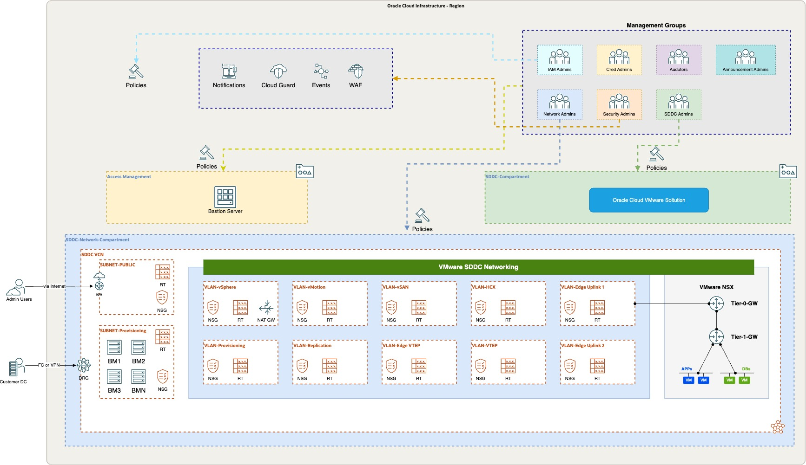
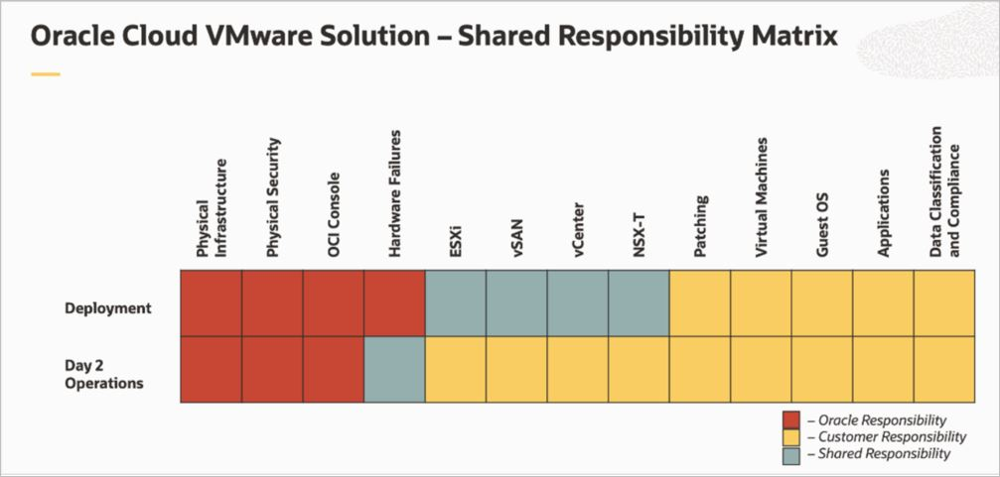

---
doc:
  author: Name Surname             #Mandatory
  version: 1.0                          #Mandatory
  cover:                                #Mandatory
    title:                              #Mandatory
      - ${doc.customer.name}            #Mandatory
      - Oracle Cloud VMware Solution                    #Mandatory
    subtitle:                           #Mandatory
      - Solution Definition             #Mandatory
  customer:                             #Mandatory
    name: A Company Making Everything   #Mandatory
    alias: ACME                         #Mandatory
  config:
    impl:
      type: Lift                        #Mandatory: Either 'Lift' or 'Fast Start'. Use with ${doc.config.impl.type}     
      handover: ${doc.customer.name}    #Mandatory: Please specify to whom to hand over the project after implementation. eg.: The Customer, a 3rd party implementation or operations partner, etc.           
  draft: false
  packvariables:
    region: INSERT REGION # Mandatory: Please add your customer's region here
---

<!--
    Author: Dev Gawale
    Last Review: 24th of May 2023
    Status: Live
    Reviewer: Alexander Hodicke
    Review Notes: -
    Based on SD Template Version: 1.1
-->

# Document Control
<!-- GUIDANCE -->
<!--
The first Chapter of the document, describes metadata for the document. Such as versioning and team members.
 -->

## Version Control
<!-- GUIDANCE -->
<!--
A section describing the versions of this document and its changes.
-->

| Version | Author       | Date                 | Comment         |
|:--------|:-------------|:---------------------|:----------------|
| 1.0     | Name Surname | September 01st, 2022 | Initial version |


## Team
<!-- GUIDANCE -->
<!--
A section describing the versions of these documents and their changes.
-->

| Name         | E-Mail              | Role                              | Company |
|:-------------|:--------------------|:----------------------------------|:--------|
| Name Surname | example@example.com | Cloud VMware Solutions Specialist | Oracle  |
| Name Surname | example@example.com | Cloud VMware Solutions Specialist | Oracle  |

## Abbreviations and Acronyms
<!-- Guidance -->
<!--
Abbreviation: a shortened form of a word or phrase.
Acronyms: an abbreviation formed from the initial letters of other words and pronounced as a word (e.g. ASCII, NASA ).
Maintain a list of terms, if needed. Use this internal page to find and translate abbreviations and acronyms: https://apex.oraclecorp.com/pls/apex/f?p=15295:1:8900541624336:::::
-->


| Term  | Meaning                               |
|:------|:--------------------------------------|
| OCVS  | Oracle Cloud VMware Solution          |
| OCI   | Oracle Cloud Infrastructure           |
| VCN   | Virtual Cloud Network                 |
| DRG   | Dynamic Routing Gateway               |
| CPE   | Customer Premises Equipment           |
| FC    | OCI Fast Connect Connection           |
| IPSec | OCI IPSec VPN Connection              |
| SL    | Security List                         |
| NSG   | Network Security Group                |
| RT    | Route Table                           |
| CMP   | Compartment                           |
| IGW   | Internet Gateway                      |
| NGW   | NAT Gateway                           |
| SGW   | Service Gateway                       |
| VM    | Virtual Machine                       |
| BM    | Bare Metal                            |
| VSS   | VMware vSphere Standard Switch        |
| VDS   | VMware vSphere Distributed Switch     |
| ESXi  | VMware vSphere Hypervisor (ESXi)      |
| VC    | VMware vCenter Server                 |
| vSAN  | VMware Virtual SAN (vSAN)             |
| NSX-T | VMware Network Virtualization (NSX-T) |
| HCX   | VMware Hybrid Cloud Extension (HCX)   |

## Document Purpose

```{.snippet}
uc-document-purpose
```

# Business Context
<!-- GUIDANCE -->
<!--
Describe the customer's business and background. What is the context of the customer's industry and Line of Business (LOB)? What are the business needs and goals which this Workload is an enabler for? How does this technical solution impact and support the customer's business goals? Does this solution support a specific customer strategy, or maybe certain customer values? How does this solution help our customers to either generate more revenue or save costs?

Mandatory Chapter

| Role  | RACI |
|:------|:-----|
| ACE   | R/A  |
| Impl. | None |
| PPM   | None |
-->

*Example:*

${doc.customer.name} is located in Frankfurt, Germany, and is the largest consumer electronics company. ${doc.customer.name} has 2500 employees at this location, generating
millions of dollars in sales. There are subsidiaries under ${doc.customer.name} corporate family which contribute to overall sales for the parent organization.

${doc.customer.name} is an existing Oracle Cloud customer and currently consuming various OCI services such as network, compute, storage, and databases in OCI Frankfurt Region. The current Production, Test, Dev & DMZ environments are hosted in an on-premises infrastructure with physical and VMware servers. The customer has a cloud and digital transformation strategy and would like to exit the data center by moving the on-premises workloads to the cloud.

The mission-critical application workloads are hosted primarily in VMware.  The customer is looking for quick and seamless migration to the cloud with minimal interruption to the services. They have decided to use the Oracle Cloud VMware Solution for quick migration of the VMware workloads before their current data center contract expires. The Oracle Cloud VMware Solution offers flexible, highly scalable, and cost-effective solutions to host ${doc.customer.name}’s critical workloads without disrupting their core business.

## Executive Summary

## Workload Business Value

<!-- GUIDANCE -->
<!--
A clear statement of specific business value as part of the full workload scope. Try to keep it SMART: Specific, Measurable, Assignable, Realistic, and Time-Related - Agree on the SMART business value with the customer. Keep it business focused, and speak the language of the LOB which benefits from this Workload: "Increase Customer Retention by 3% in the next year" or "Grow Customer Base with Executive Decision-Making from our Sales and Support Data". Avoid technical success criteria such as "Migrate App X to Oracle Cloud" or "Provision 5 Compute Instances". Avoid Oracle success criteria and language "Get Workload Consuming on OCI".

Mandatory Chapter

| Role  | RACI |
|:------|:-----|
| ACE   | R/A  |
| Impl. | None |
| PPM   | None |
-->

*Example:*

${doc.customer.name} is running a strategic program in FY23 called EXAMPLE. As part of their initiative, one pillar is dedicated to their IT cost saving. ${doc.customer.name} is planning to reduce their IT estate spending by 15% in the current FY. Oracle can help ${doc.customer.name} by reducing the VMware deployment complexity and operations while optimizing IT costs. ${doc.customer.name} IT department wants to innovate other LoBs and enable quick-time-to-market for various applications and business needs. This allows ${doc.customer.name} to stay ahead in a competitive market.

The Oracle Cloud VMware Solution is a customer-managed Software-defined Data Center solution offering customers a choice to run flexible infrastructure to host mission-critical workloads. The customer can seamlessly move their workloads from the on-premises VMware environment to Oracle Cloud VMware Solution promptly with the help of the native migration tool offered with the solution. Since the platform remains the same for migrated workloads there are no efforts required to re-factoring the application rather customer can focus on the digital transformation journey.

# Workload Requirements and Architecture

## Overview

Oracle guides in planning, architecting, prototyping, and managing cloud migrations. Customers can move critical workloads in weeks, or even days, instead of months by leveraging these included services for customers.  

Oracle will support ${doc.customer.name} in setting up the target OCVS architecture based on customer business and technical requirements. Oracle will move selected VMs of the on-premise VMware workload to Oracle Cloud Infrastructure in the ${doc.packvariables.region} region.

__Thus, the objectives of this document are to:__

1.	Review together the existing on-premise architecture, map it to relevant Oracle OCI services, and propose a high-level tailored cloud architecture design.
2.	Define the Oracle Cloud Lift Services scope to help ${doc.customer.name} to physically migrate the agreed workload to the target cloud platform.


__The goals of this document are to:__

Additionally, the [Document Purpose]{#document-purpose} these are the high-level goals for this document:

1.	Provide the architecture guidelines as per ${doc.customer.name} needs for the target cloud OCI architecture.
2.	Fitting the solution into ${doc.customer.name} the OCI ecosystem.
3.	Address all OCVS-related aspects at security, network, compute, storage, and other levels for implementing the target cloud architecture.
4.	Set up the OCVS cloud environment according to the agreed design & architecture.
5.	Define the scope of the potential LIFT services migration of the ${doc.customer.name} workload.

## Non-Functional Requirements

### Regulations and Compliance

At the time of this document creation, no Regulatory and Compliance requirements have been specified.

### Environments

| Environment | Target Size of VMs | Location | Scope           |
|:------------|:-------------------|:---------|:----------------|
| ENV NAME    | 100%               | LOCATION | Workload - Lift |
| ENV NAME    | 80%                | LOCATION | Workload - Lift |

### High Availability and Disaster Recovery Requirements

At the time of this document creation, no high availability and disaster recovery requirements have been specified.

### Security Requirements

At the time of this document creation, no security requirements have been specified.

## Current State Architecture

The current state architecture covers the current on-premises workloads.

### Current State IT Architecture (VMware)

${doc.customer.name} current environment is running in a data center (DC LOCATION) based on hardware (HARDWARE MODELS) infrastructure and VMware vSphere Hypervisor (ESXi).

__The Current VMware footprint consists of:__

-	VMware vSphere with 7.0 release
-	VMware vSAN Storage (Optional)
- VMware NSX or NSX-T as a networking solution (Optional)
-	Backup Solution

Below is the current high-level architecture of the customer's on-premises VMware environment.


### Current VMware Inventory On-premises

__VM resource allocations per location:__

| Location      | Type             | Total vCPU Cores | Total Memory (GB) | Used Storage (GB) | Total Storage (GB) |
|:--------------|:-----------------|:-----------------|:------------------|:------------------|:-|
| Location Name | Virtual Machines | 550              | 1800              | 23580             | 30000 |
| Location Name | Virtual Machines | 550              | 1800              | 23580             | 30000 |

__Operating Systems:__

- Windows Server 2019
- Oracle Linux 8
- Red Hat Linux
- Windows Server 2008 R2

__Database Systems:__

- Microsoft SQL AlwaysON
- Microsoft SQL Cluster
- Oracle 12c Database

### Total VMware Resources For All Locations

| Type             | Total vCPU Cores | Total Memory (GB) | Used Storage (GB) | Total Storage (GB) |
|:-----------------|:-----------------|:------------------|:------------------|:-|
| Virtual Machines | 1100             | 3600              | 47160             | 60000 |


### Resource Utilization

| Core to vCPU Ratio | % Avg. CPU Utilization | % Avg. Memory Utilization |
|:-------------------|:-----------------------|:--------------------------|
| 1:4                | 40 %                   | 70 %                      |


## Future State Architecture

### Mandatory Security Best Practices

```{.snippet}
sec-best-practices
```

### OCI Secure Landing Zone Architecture (OCVS)


All the above OCI and OCVS networking and security services and principles are implemented through the concept of a Landing Zone.
The following diagram illustrates the Landing Zone reference architecture specific to the deployment of OCVS.  



This architecture is designed specifically for Oracle Cloud VMware Solution which sits on top of the OCI core services such as Bare Metal Compute, and VCN networking. The architecture starts with the compartment design for the tenancy along with groups and policies for the segregation of duties.

In Landing Zone, tenancy should have a dedicated compartment for VMware SDDC deployment. The existing tenancy can also be used but it is recommended to segregate the VMware SDDC environment from other OCI resources. The VMware SDDC Compartment is assigned a group with appropriate permissions for managing resources in the compartment and for accessing required resources in other compartments. As a best practice, it is recommended to create a dedicated compartment for VCN leveraged by the OCVS deployment to keep the networking resources completely separated in a dedicated compartment.

The VMware SDDC compartment will be utilized to deploy the SDDC service. The SDDC network compartment will host dedicated VCN resources to maintain the isolation of the VMware and network resources and thus use the IAM policies for network resource and access management. Oracle Cloud VMware Solution deployment workflow is a fully automated process and takes care of provisioning of required to compute & networking resources maintaining the security standard.

The Landing Zone for OCVS includes pre-configured networking resources such as subnet, VLANs, Network Security Group, Security List, and Route Tables maintaining the security posture needed for enterprise VMware workloads. Also, it includes pre-configured Compute Bare Metal services required for VMware hypervisor operation. Additionally, VMware NSX as a Software Defined Networking is pre-configured but isolated in an overlay network zone.

Additional OCI services such as Cloud Guard, Events, Notifications, and WAF can be used to operate and monitor OCI resources for Oracle Cloud VMware Solutions such as OCI Compute, and OCI Network. The Notifications are set using Topics and Events for alerting administrators about changes in the deployed resources for this environment.

__Please Note__ The VMware workloads can use limited OCI services when it comes to integration of VMware SDDC workloads to OCI.
Low-level design of Landing zone with ${doc.customer.name}" relevant specific technical details will be provided during the architecture Design discovery process.
The network for the SDDC network should not overlap with the existing networks in ${doc.customer.name}" tenancy. The SDDC can be scaled up to a maximum of 64 hosts with /21 SDDC CIDR range.

__Note:__ The table is a representation of the sample network layout for the /22 network however based on the SDDC CIDR range selected we can expect an automated network layout created by the SDDC provisioning operation with different network range for VLANS.
SDDC workload CIDR will be identified as a part of the low-level design during the implementation.


| VLAN Name                   | CIDR Range    |
|:----------------------------|:--------------|
| Provisioning Subnet         | 10.0.0.0/26   |
| VLAN-SDDC-NSX Edge Uplink 1 | 10.0.0.64/26  |
| VLAN-SDDC-NSX Edge Uplink 2 | 10.0.0.128/26 |
| VLAN-SDDC-NSX Edge VTEP     | 10.0.0.192/26 |
| VLAN-SDDC-NSX VTEP          | 10.0.1.0/26   |
| VLAN-SDDC-vMotion           | 10.0.1.64/26  |
| VLAN-SDDC-vSAN              | 10.0.1.128/26 |
| VLAN-SDDC-vSphere           | 10.0.1.192/26 |
| VLAN-SDDC-HCX               | 10.0.2.0/26   |
| VLAN-SDDC-Replication Net   | 10.0.2.64/26  |
| VLAN-SDDC-Provisioning Net  | 10.0.2.128/26 |

### Physical Architecture

The future state architecture covers the current on-premises workloads to be hosted on Oracle Cloud VMware Solution(OCVS). The OCVS is deployed at the Availability Domain (AD) in the OCI region and spans across 3 Fault Domains (FD) in the region.
The OCI Bare Metal (BM) instances utilized by the service are spread across the Fault Domain (FD) in a round-robin fashion offering complete redundancy to the OCVS workloads.
The OCVS comes with two distinct architectures as represented below.
- OCVS with DenseIO server - This architecture primarily uses vSAN Storage leveraging NVMe drives from the local Bare Metal (BM) servers.
- OCVS with Standard Shapes - This architecture is completely based on the OCI Block Storage as a primary storage option for the VM workloads.


Oracle Cloud VMware Solution is the central part of this deployment and provides a fully automated implementation of a VMware software-defined data center (SDDC) within your Oracle Cloud Infrastructure tenancy. The solution runs on Oracle Cloud Infrastructure Bare Metal Compute and contains the following VMware components:

* VMware vSphere Hypervisor (ESXi)
* VMware vCenter Server
* VMware vSAN
* OCI Block Storage
* VMware NSX-T
* VMware HCX Advanced

High-level OCVS-based cloud architecture for ${doc.customer.name} target cloud deployment is outlined in the picture below.

  

The architecture has the following components:

__OCVS__

The __VMware SDDC__ comes in with vSphere 7.0 version. The OCVS SDDC consists of vSphere (ESXi + vCenter), NSX-T, vSAN & HCX. The SDDC deployment can be on OCI DenseIO shapes that offer vSAN Storage or it can be on OCI Standard Shape with OCI Block Storage as a primary storage option.  
* __VMware HCX__ - Application mobility platform designed for simplifying application migration, workload re-balancing, and business continuity across data centers and clouds. This will allow the seamless migration of VMware workloads to OCVS.
* __HCX Manager__ – HCX manager is an appliance deployed in Oracle Cloud VMware Solution. HCX manager will be paired with an on-premises vCenter through HCX Connector.  
* __HCX Connector__ – HCX connector is an appliance deployed at an on-premises vCenter server which will be then paired with the HCX manager in the cloud for the base configuration necessary for workload migration.  
* __VMware NSX-T__ - This is NSX-T Data Center implementation as part of the SDDC stack used for Software Defined Networking. The migrated workloads can use NSX network segments for networking usage. NSX-T offers full perimeter services configuration in OCVS environments such as Load Balancer, Routing, Switching, firewall, and micro-segmentation.
* __VMware vSAN__ - VMware vSAN is a software-defined storage solution offered as part of the OCVS SDDC solution. The vSAN has been configured by leveraging locally attached NVMe all-flash disks from each OCI Bare Metal server to offer common storage for workloads.
* __OCI Block Storage__ - The OCI Block storage can be leveraged as an additional storage option with DenseIO compute SDDC along with vSAN. The Standard Shape OCVS environment consists of OCI block storage as the only primary storage option.
* __VMware vSphere__ - Includes ESXi and vCenter servers
* __FastConnect__ - OCI FastConnect is a dedicated private high-speed network link connected to ${doc.customer.name} Data Center and OCI region. The FastConnect will be leveraged for migrating the workloads over the network.


## Solution Considerations

### High Availability and Disaster Recovery

#### OCVS Resilience and Recovery

Oracle Cloud VMware Solution is deployed at Availability Domain (AD) within the OCI region. Each Availability domain consists of Fault Domains to maintain a fault-tolerant and highly resilient environment. For more details about OCI Availability domains and Fault Domains refer to the [OCI documentation](https://docs.oracle.com/en-us/iaas/Content/General/Concepts/regions.htm).

The details of the Oracle Cloud Infrastructure SLAs are found in the link below.
[OCI Service SLA](https://www.oracle.com/ae/cloud/sla/).

##### OCVS High Availability
This section describes the VMware SDDC High Availability.

__OCI BM Compute (ESXi):__ The OCI native services such as compute bare metal and VCN resources are highly resilient cloud service offerings from Oracle Cloud Infrastructure. OCI BM failure can be addressed by replacing the faulty node with a new ESXi host in the cluster.

__OCI BM NVMe (vSAN):__ The OCVS SDDC consist of vSAN for the software-defined storage layer. With vSAN's failure to tolerate (FTT) feature, host failures, and data loss can be effectively managed. Customers can utilize the vSAN SPBM (Storage Policy Based Management) which includes different RAID levels to protect the data.

__OCVS Networking (NSX-T):__ The OCVS SDDC consists of NSX-T implementation to manage software-defined networking. The NSX Edge, Managers/Controllers are deployed in a fully redundant manner to maintain high availability.

__OCI Block Storage:__ The OCI Block Storage offers the highest level of data resiliency by the backend system at the availability domain. The OCI Block storage being the primary storage option with OCVS does not require RAID configuration but rather relies on the resiliency offered by the Oracle Cloud Infrastructure.


#### OCVS Backup

This section describes a proposed backup architecture for ${doc.customer.name} workloads post-migration to OCVS. We recommend using the VEEAM backup and replication suite which works best with the VMware platform. However, other backup solutions such as Commvault can also be used.  

The following diagram illustrates the proposed VEEAM backup architecture for ${doc.customer.name}"" application backup and restores requirement.


##### Architecture Components Overview

The VEEAM backup and restore integrates with the VMware vCenter server and offers backup and restore capabilities to the VMs deployed in SDDC as well as the instances deployed in OCI. Below summarizes the backup components as part of the architecture and a detailed description of each.

* __VEEAM Backup Server__ – VEEAM backup server is a software suite installed on the MS Windows operating system. It is recommended to deploy VEEAM outside of the SDDC Cluster. The VEEAM backup server will be installed on OCI Compute instance with MS Windows 2016 and above Operating System.

* __MS SQL Cluster__ – The Microsoft SQL cluster is required for VEEAM Backup Server Database. The SQL Nodes will be deployed in the same management subnet as that of the VEEAM backup Server and will use OCI native compute instances. The MS SQL will be deployed in High Availability mode using native AlwaysON clustering functionality. This will offer a fully redundant database for VEEAM. The SQL nodes will be spread across Fault Domains.

__Note:__ Depending upon the licensing requirement, we can use an MS SQL marketplace image where the license will be included. This needs to be discussed with the customer during the actual implementation.

* __VEEAM Proxy__ – VEEAM proxy is one of the main components of VEEAM Backup and replication. VEEAM proxy sits between the data source and target and is used to process jobs and deliver backup traffic. It allows to offload of the VEEAM Backup Server and has better performance resulting shorter backup window. There is a default proxy server that can be used if no proxy is deployed but it is recommended to deploy a VEEAM proxy for better backup performance. The proxy can be a Windows or Linux VM inside the OCVS SDDC.

* __Backup Repositories__ – A backup repository is a storage location where VEEAM keeps backup files, VM copies, and metadata for replicated VMs. To configure a backup repository, you can use the following storage types:

1.	__Direct Attached Storage (DAS):__ You can add virtual and physical servers as backup repositories. The compute Microsoft Windows 2016 and above Instance in OCI with a bunch of block storage can be used as a Direct attached storage. This will be considered as a performance tier and recommended to use for better backup and restore performance. The VM with vSAN local storage disks can also be used as DAS but is not recommended to avoid a single point of failure.

2.	__Network Attached Storage (Optional):__  OCI File storage service NFS v3 service can be used as a Network Attached Storage.

3.	__Object Storage:__ You can use cloud storage services as backup repositories. The OCI Object storage is S3 compatible and can be used as a “Scale-out Repository” for the capacity tier or a direct backup repository. The Object storage scale-out repository can be configured to have an immediate copy of the backup, or it can be copied over after a specific schedule. It is recommended to use the OCI Block Storage attached to an instance as a primary storage option for backing up the VMs for better performance and backup operations. Object storage should only be considered as a capacity tier for long-term retention and archival purpose.

__Important Notes:__
-	Sizing requirements & Design considerations should be followed from VEEAM official documentation.
-	${doc.customer.name} will bring their own license for VEEAM. ${doc.customer.name} can discuss different VEEAM license options available with VEEAM directly and choose according to the requirement.  
- ${doc.customer.name} can choose their choice of backup tool and Oracle will assist in architecting the necessary backup solution.


### Security

#### OCI - Oracle and Customer Shared Security Model


Oracle employs best-in-class, enterprise-grade security technology, and operational processes to secure cloud services. To deploy and operate your workloads securely in Oracle Cloud, you must be aware of your security and compliance responsibilities.

Oracle ensures the security of cloud infrastructure and operations, such as cloud operator access controls and infrastructure security patching. You’re responsible for configuring your cloud resources securely. The following graphic illustrates the shared security responsibility model.  


__OCVS specific Responsibility Matrix__



Oracle is solely responsible for all aspects of the physical security of the Availability Domains and Fault Domains in each region. Both Oracle and you are responsible for the infrastructure security of hardware, software, and the associated logical configurations and controls.

As a customer, your security responsibilities encompass the following:

* The platform you create on top of Oracle Cloud.
* The applications that you deploy.
* The data that you store and use.
* The overall governance, risk, and security of your workloads.

The shared responsibility extends across different domains including identity management, access control, workload security, data classification and compliance, infrastructure security, and network security.

#### OCVS Security Posture

The section below describes the security posture of Oracle Cloud VMware Solution and Oracle Cloud Infrastructure.

* Access to the Customer's OCI tenancy is restricted and controlled using IAM and IDCS federations. Network sources can be optionally used to restrict access from known IP addresses within VCN or on-premises.

* Security in a subnet can be controlled by Security Lists and/or Network Security Groups. OCI is a zero-trust environment by default, you must explicitly permit traffic for known communication patterns. Additional security can be offered to Customer's external facing applications using OCI Web Application Firewall.

* VLAN resides in VCN and is only provisioned for OCVS service. Each VLAN is attached to the Network Security Group to control traffic. All traffic inside a VLAN is blocked by default.

* An NSX Segment is an overlay network that runs on top of the VMware virtualization stack. This network is independent outside of the VCN network. Any communication from the NSX overlay segment to OCI resources needs to be explicitly allowed through uplink interfaces using routing and controlled using security lists.

* Security in an NSX Segment is managed by the NSX-T control plane, by default all traffic inside a segment is allowed. The NSX Micro-Segmentation enables you to increase the agility and efficiency of your network infrastructure while maintaining the highest level of security posture.

* Users from an on-premises environment can securely connect to Oracle Cloud VMware Solution resources through IPSec and or FastConnect (for more details see Chapter 6.3 OCI networking).

* Bastion host is deployed in a public subnet in Customer's tenancy. Secured access is allowed for Remote Desktop Protocol (RDP) through Internet Gateway and controlled using a security list.

* The OCVS SDDC environment is allowed to access only from the Bastion host.

#### OCVS Data Security

This section details Data Security for the virtual machines in the OCVS environment. It also provides details about how encryption works in vSAN and possible options for Data at rest and Data at transit. We have not received any data security requirements from the Customer. Therefore, the below section details out-of-the-box data security standards for OCVS.

__vSAN Data-At-Rest__

Oracle Cloud VMware Solution uses VMware vSAN technology for virtual machine storage management. vSAN comes with its own data-at-rest encryption technique. vSAN can encrypt data at rest in the vSAN datastore. Data at rest encryption within vSAN requires an external Key Management Server (KMS) or a vSphere Native Key Provider.
vSAN data at rest encryption is out of the scope of this project. However, customers can enable the data-at-rest encryption anytime at cluster provided it meets the required pre-requisite.

__vSAN Data-in-Transit__

Oracle Cloud VMware Solution uses VMware vSAN technology for virtual machine storage management. vSAN can encrypt data in transit, as it moves across hosts in your vSAN cluster. vSAN can encrypt data in transit across hosts in the cluster. When you enable data-in-transit encryption, vSAN encrypts all data and metadata traffic between hosts. Traffic between data hosts and witness hosts is encrypted.
vSAN data encryption in transit is out of the scope of this project. However, the Customer can enable this functionality at the vSAN cluster in OCVS SDDC.

__Block Storage Encryption__

OCI Block Storage can be used to scale the storage for DenseIO OCVS deployment and be used as primary storage in the case of Standard Shapes OCVS. OCI Block Volume is presented to the VMware ESXi server as an iSCSI target to store virtual machine files. OCI security features such as KMS, encryption, and vaults apply to VM data stored in OCI Block Volume. OCI Block Volume is mounted as an external Datastore for VMware SDDC by leveraging OCI managed/Customer managed keys for VM data encryption.

### Networking

The architecture has the following components:

* __On-premises Network__ - This network is the local network used by your organization. It is one of the spokes of the topology.

* __Region__ - An Oracle Cloud Infrastructure region is a localized geographic area that contains one or more data centers, called availability domains. Regions are independent of other regions, and vast distances can separate them (across countries or even continents).

* __Virtual Cloud Network (VCN)__ - A VCN is a customizable, private network that you set up in an Oracle Cloud Infrastructure region. Like traditional data center networks, VCNs give you complete control over your network environment. You can segment VCNs into subnets, which can be scoped to a region or an availability domain. Both regional subnets and availability domain-specific subnets can coexist in the same VCN. A subnet can be public or private.

* __Security List__ - For each subnet, you can create security rules that specify the source, destination, and type of traffic that must be allowed in and out of the subnet.

* __Network Security Group (NSG)__ - NSGs act as virtual firewalls for your cloud resources. With the zero-trust security model of Oracle Cloud Infrastructure, all traffic is denied, and you can control the network traffic inside a VCN. An NSG consists of a set of ingress and egress security rules that apply to only a specified set of VNICs in a single VCN.

* __Route Table__ - Route tables contain rules to route traffic from subnets to destinations outside a VCN, typically through gateways.

* __Dynamic Routing Gateway (DRG)__ - The DRG is a virtual router that provides a path for private network traffic between a VCN and a network outside the region, such as a VCN in another Oracle Cloud Infrastructure region, an on-premises network, or a network in another cloud provider.

* __Bastion Host__ - The bastion host is a compute instance that serves as a secure, controlled entry point to the topology from outside the cloud. The bastion host is provisioned typically in a demilitarized zone (DMZ). It enables you to protect sensitive resources by placing them in private networks that can't be accessed directly from outside the cloud. The topology has a single, known entry point that you can monitor and audit regularly. So, you can avoid exposing the more sensitive components of the topology without compromising access to them.

* __VPN Connect__ - VPN Connect provides site-to-site IPSec VPN connectivity between your on-premises network and VCNs in Oracle Cloud Infrastructure. The IPSec protocol suite encrypts IP traffic before the packets are transferred from the source to the destination and decrypts the traffic when it arrives.

* __FastConnect__ - Oracle Cloud Infrastructure FastConnect provides an easy way to create a dedicated, private connection between your data center and Oracle Cloud Infrastructure. FastConnect provides higher-bandwidth options and a more reliable networking experience when compared with internet-based connections.

#### Network connectivity options (on-premises to OCI)

##### IPSec VPN

The following diagram of a reference architecture shows how to set up a Virtual Private Network (VPN) to connect to a customer's on-premises network and VCN.


IPSec VPN architecture has the following components:

* __VPN Connect__ - Function that manages IPSec VPN connections to your tenancy.

* __Customer-Premises Equipment (CPE)__ - An object that represents the network asset that lives in the on-premises network and establishes the VPN connection. Most border firewalls act as the CPE, but a separate device (like an appliance or a server) can be a CPE.

* __Internet Protocol Security (IPSec)__ - A protocol suite that encrypts IP traffic before packets are transferred from the source to the destination.

* __Tunnel__ - Each connection between the CPE and Oracle Cloud Infrastructure.

* __Border Gateway Protocol (BGP) routing__ - Allows routes to be learned dynamically. The DRG dynamically learns the routes from your on-premises network. On the Oracle side, the DRG advertises the VCN's subnets.

* __Static Routing__ - When you create the VPN connection, you inform the existing networks on each side. Changes are not learned dynamically.

IPSec VPN will be used to provide for the connection between ${doc.customer.name}" data center and Oracle OCI Public cloud region for standard day-to-day operational purposes. Based on the current information IPSec connection is already established.

##### Fast Connect

The following reference architecture diagram shows how to set up a FastConnect connection between your on-premises network and Virtual Cloud Network (VCN).


* __Border Gateway Protocol (BGP) routing__ - Allows routes to be learned dynamically. The DRG dynamically learns the routes from your on-premises network. On the Oracle side, the DRG advertises the VCN's subnets.

* __Private Peering__ - Extends existing infrastructure by using private IP addresses.

* __Public Peering__ - Allows public Oracle Cloud Infrastructure services to be accessed using a private connection instead of the internet.

* __Virtual Circuit__ - The private path used to connect on-premises and Oracle Cloud Infrastructure. It can include multiple lines, physical or logical, depending on the requirements and capabilities of the line provider.

Fast Connect will be used to provide for the connection between ${doc.customer.name}" data center and Oracle OCI Frankfurt cloud region for the period migrations of VMs from on-premise to Oracle cloud.  It is a requirement to use Fast Connect at least for the period of workload migration.

##### OCVS Specific Networking Configuration Within OCI

The Oracle Cloud VMware Solution networking categorizes into Virtual Cloud Networks, Subnets, and VLANs. Each VLAN within VCN is attached to the Network Security Group for network communication and Route Table for routing functionality. Similarly, the subnet created as an outcome of the SDDC provisioning operation is attached to Security List and Route Table.


##### OCI Virtual Cloud Network (VCN) for OCVS

All the resources in OCVS/SDDC architecture are in a single VCN.
For VMware SDDC we need at least /24 network CIDR but recommended is to have a dedicated /16 VCN CIDR block that can accommodate future scaling of the networks.

| VCN                      | CIDR Range              |
|:-------------------------|:------------------------|
| VCN Name                 | 10.0.0.0/16             |
| SDDC CIDR                | 10.0.0.0/21             |
| Workload CIDR (Optional) | 192.168.10.0/24 (NSX-T) |

The OCVS networking resources such as Subnet, VLANs, Network Security Groups (NSG), Route Tables, and Gateways are the result of OCVS SDDC provisioning operation. The network CIDR ranges for the management VLANs are solely dependent on the size of the SDDC CIDR. The network design considerations should be carefully assessed before provisioning the OCVS environment.

### Operating Model, Monitoring, and Management

This section describes the details of management and monitoring capabilities available out of the box from Oracle Cloud VMware Solution. Oracle Cloud VMware Solution offers VMware vRealize Operations (vROPS) manager as a monitoring tool integrated with OCVS vCenter server.
VMware vROPS is pre-integrated with the vCenter server and offers a dashboard for monitoring the entire VMware SDDC farm. The vROPS has a predefined matrix for availability, performance, and capacity which will help customers for their day-to-day operations.
Below are some of the benefits of vROPS.

* Application-aware monitoring across SDDC and multiple clouds.
* Cloud Planning, capacity optimization, and compliance.
* Automated and proactive workloads management.

Customer can also leverage their existing on-premises vROPS implementation to extend the monitoring capabilities to OCVS. In addition, customers can also leverage their existing tooling and automation with OCVS SDDC. For example, products such as VMware vRealize Log Insight, VMware vRealize automation, and others.  


__Important note:__ Customers will need to bring their own license to use vRealize Operations Manager. The vROPS is also available as a SaaS subscription from VMware which can be used to monitor the OCVS environment in VMware Cloud.

#### OCVS Support

* Oracle will provide tier one and tier two support for Oracle provided versions of VMware components (vSphere, vCenter, vSAN, NSX) on Oracle Cloud Infrastructure. Tier three support cases will be routed to VMware via a warm hand-off from Oracle.
* Support does not extend to other VMware products, nor does it extend to on-premises instances of VMware or configurations that are not listed in the VMware SCL as being supported by combinations of operating systems, VMware hypervisor versions, and VMware agent configurations.

### OCVS Migration

This section describes the Migration options and tools used for the migration of mission-critical workloads to OCVS.

VMware HCX is an application mobility platform that allows you to migrate VMs from an on-premises VMware environment to the OCVS SDDC. The HCX comes with two different types of license, HCX Advanced offered for free and the HCX Enterprise as an additional SKU which can be enabled from the OCI console on a monthly subscription basis.

According to the feature requirements, the HCX license type should be carefully evaluated. For more details about the HCX licensing comparison, refer to the document link below.

[VMware HCX Licensing](https://www.vmware.com/content/dam/digitalmarketing/vmware/en/pdf/products/hcx/vmw-hcx-licensing-and-packaging-solution-overview.pdf)

__Please note:__ If you are using OCVS with Standard Shapes, then the HCX enterprise is included in the subscription and no additional cost is required.

VMware HCX is a preferred way of migrating VMWare Workloads to OCVS. However, in some cases, you should consider using other third-party tools.

The HCX offers different key features along with various migration options.

__Please Note:__ Please check the VMware interoperability matrix for version compatibility of VMware HCX with the source vSphere environment.

#### Migration Architecture with OCVS

The architecture diagram shows the overall HCX architecture.


#### HCX Features and Migration Options

The below list of features is included with the default HCX advanced license offered with an OCVS subscription without any additional cost.  

- Migration
- Disaster Recovery
- Network Extension

##### Migration Options with VMware HCX

__vMotion__ - Allow live migration of the VM from source to target (OCVS). It is a serial migration and does not allow parallel live migration of more than 1 VM with an HCX advanced license. Use HCX Enterprise, if you would like to migrate VMs live and in parallel.

__Bulk Migration__ - Parallel migration of multiple VMs. The VMs incur downtime equivalent to the restart of the VM at OCVS. The source VM will be preserved and powered off at the source. When there are no changes at the source, the HCX will power on the target VM and shut down the source. The failover operation is not controlled by the end user. The HCX bulk migration can be used with the HCX advanced license.

__Disaster Recovery__ - Works on the same technology as bulk migration but allows you to replicate on different RPO with controlled failover, re-protect, and fallback operations.

##### Network Extension

This is a feature that allows you to perform L2 VLAN extension from on-premises to OCVS. The network extension is used for preserving the same IP address for the migrated VMs. The requirement of network extension should be carefully evaluated.


## Sizing and Bill of Materials

### Target OCVS Architecture Sizing

Sample sizing of the OCVS environment is depicted in the table below.

| OCVS Hosts | Shape       | Physical Cores | Logical Cores | CPU to vCPU Ratio | OCVS Utilization | vCPU | vMEM (GB) | vSAN (TB) |
|:-----------|:------------|:---------------|:--------------|:------------------|:-----------------|:-----|:----------|:-|
| 3+1        | DenseIO2.52 | 208            | 416           | 1:2               | 80%              | 665  | 2457      | 122 (FTT1 - RAID1) |

__OR__

| OCVS Hosts | Shape           | Physical Cores | Logical Cores | CPU to vCPU Ratio | OCVS Utilization | vCPU | vMEM (GB) | OCI Block Storage (TB) |
|:-----------|:----------------|:---------------|:--------------|:------------------|:-----------------|:-----|:----------|:-|
| 3+1        | BM.Standard3.48 | 192            | 384           | 1:2               | 80%              | 665  | 2457      | 8 TB Management(default) + 50 TB Workload |

### Summary Of Target Architecture Sizing

* The calculation is based on the current compute and storage resources. The 4-node cluster can satisfy the required resources.
* 1 host failure will allow the customer a rebuild capacity in case of failure.
* This is a mixed environment between physical nodes and VMWare VMs, the oversubscription details are not relevant to the proposed sizing.
* We have considered the 1:2 core to vCPU ratio which offers the best optimum performance for converted physical workloads as well as VMWare workloads.
* The OCVS compute offers flexible DenseIO and Standard Shapes for sizing the current capacity requirements.
* It is recommended to start with 4 node cluster and add the servers on demand as needed.
* The Block storage with OCVS DenseIO allows you to scale the storage without adding additional server capacity.
* OCVS deployment with the standard shape uses Block Storage as a primary storage option.

__BoQ Notes:__

1. Bring Your Own License (BYOL) of existing On-Premises VMware licenses to OCVS is not supported.
2. VMware HCX Advanced is offered free with OCVS. However, the HCX enterprise license is a separate SKU and can be enabled/disabled from the OCI console based on the extended functionality requirements for migration.
3. If you are using OCVS with Standard Shape and then the HCX enterprise license is included in the subscription and no additional cost is required.

| Part # | Product Name                                     | Metric                                  | Quantity |
|:-------|:-------------------------------------------------|:----------------------------------------|:-|
| B92386 | Oracle Cloud VMware Solution 1 Year Subscription | OCPU per Hour                           | 208 |
| XXXXXX | Windows Bastion Host VM.Standard.2.2             | OCPU Per Hour                           | 1 |
| B91628 | OCI Object Storage                               | Gb per month                            | 52000 |
| B91627 | OCI Object Storage Requests                      | 10K requests per month (first 50k free) | 1 |
| B91961 | OCI Block Volume Storage                         | Gb per month                            | 20000 |
| B91962 | OCI Block Volume Performance Units               | Gb per month                            | 200000 |
| XXXXX  | OCI FastConnect 1 x 10 Gbps                      | Port per hour                           | 1 |

# Project Implementation (Only for Oracle Implementations!)

## Solution Scope
<!-- Describe the scope under Overview -->

### Disclaimer
<!-- GUIDANCE -->
<!--
A scope disclaimer should limit scope changes and create awareness that a change of scope needs to be agreed upon by both parties.
-->

<!-- EXAMPLE / TEMPLATE -->
```{.snippet}
uc-disclaimer
```

### Overview
<!-- GUIDANCE -->
<!--
Describe the scope of Lift/Fast start as a sub-set of the Workload scope. For example one environment from one application. Describe the sub-chapters

Mandatory Chapter

| Role  | RACI |
|:------|:-----|
| ACE   | R/A  |
| Impl. | R    |
| PPM   | C    |
-->

Below is a suggested outline for the Workload Architecture and Oracle Cloud Lift engagement in the context of ${doc.customer.name} VMs migration to OCI.

* __Workload Architecture__

This team is involved in the production of specific implementation deliverables, as well as with the respective tasks for information gathering, document production, review, etc. The deliverables of this team are used as input for the implementation tasks, architecture governance, and any respective business case evaluation.  

* __Cloud Lift Services__

This team is responsible for setting up a target SDDC environment and the technical work performed during the migration that in case of ${doc.customer.name} will consist of the deployment of the agreed scope of the target workload. These services will be delivered by a combination of on-shore and off-shore Oracle resources.  

### Business Value
<!-- GUIDANCE -->
<!--
What's the value for the customer to do Lift/Fast Start? Why Lift/Fast Start? For example, speed of deployment and resulting impact on time to market, and free service. Do not describe Oracle's' value or consumption.

Mandatory Chapter

| Role  | RACI |
|:------|:-----|
| ACE   | R/A  |
| Impl. | C    |
| PPM   | C    |
-->

```{.snippet}
uc-business-value
```

### Success Criteria

The project success criteria are based on the deployment and configuration of the Oracle Cloud VMware Solution in the Customer's Oracle Cloud Infrastructure tenancy.
${doc.customer.name} applications and database servers will be migrated to Oracle Cloud VMware Solution within the agreed scope and migration window and prepared to execute in this new technical environment.
${doc.customer.name} will be provided with the knowledge needed to be able to independently operate the environment.


## Workplan

### Deliverables

The following are the project deliverables:

* Workload architecture document.
* Knowledge sharing session.

### Included Activities

Following high-level scope lift scope:

* Deploy VMware SDDC as per design.
* Assist in setting up Fast Connect connection.
* Agreed scope of workload migration.

The following high-level Activities will be carried out by Lift:

* OCI Foundation Setup required for OCVS deployment in the decided Region with Bastion Service
* One Fast Connect setup between on-premises and OCI before migration
* Provision one Compute Windows Bastion Host to manage OCVS environment
* Single OCVS Setup on OCI with the latest Version with an agreed number of ESXi host  
* Configuration On-Prem Connectivity for VMware Migration to OCVS Environment
* Configure and Implement VMware HCX required for migration and network extension.
* Configure and implement the agreed backup solution as part of the design.
* Validate with test VM Migration of Source VM to OCVS using VMware HCX
* Any additional tooling to support overall migration as agreed in the design.


### Recommended Activities

* HCX Setup between on-premises and OCVS
* DR/HA setup
* IP Sec VPN setup between on-premises to OCI
* Installation and configuration of custom or third-party applications and operating systems on deployed virtual machines.
* Rewiring/Integration of application and database is the customer's responsibility
* Creation of Image template on OCVS setup.
* Migration of Windows Server 2003 Enterprise Physical servers to OCVS
* Source Server IPs retention of the migrated VMs at OCI/OCVS Target
* Active Directory and DNS Server Setup in OCI
* Operating system administration including the operating system itself or any operating system features or components. Management of any required changes to virtual machines, operating systems, custom or third-party applications, databases, and administration of general network changes within Customer control.
* Remediation work associated with any problems resulting from the content, completeness, accuracy, and consistency of any data, materials, or information supplied by the Customer
* Any new or existing customizations, features modifications, and/or integration with other products
* Troubleshooting of existing open issues, including the performance of applications
* Installation and configuration of third-party software or other technical services that do not apply to OCVS.
* Configuration of VMware products used for the service other than those implemented for the mutually agreed use cases.
* Customer solution training other than the defined knowledge transfer session, Training on deployed products and Cloud Services
* Backup configuration of the third-party tool with OCVS.
* Physical servers from Customer on-premises IT infrastructure.
* IDCS integration with Active Directory for Customer's OCI tenancy.
* 24/7 Support coverage and Post Migration support
* Load Testing, Performance benchmarking, testing & tuning of any component in the solution.
* Architecture and design changes, after the agreed design.
* Operational Monitoring & Management design
* Third Party Security and Monitoring tools implementation or integration
* Server Hardening, Audit certification, Vulnerability Assessment, and Penetration Testing
* Program management (outside of Lift scope), Business readiness, cut-over planning.


### Timeline
<!-- GUIDANCE -->
<!--
Provide a very high-level Lift/Fast Start implementation plan. Use Phases to communicate an iterative implementation (called Delivery Geared Design)

Mandatory Chapter

| Role  | RACI |
|:------|:-----|
| ACE   | A    |
| Impl. | R    |
| PPM   | C/I  |
-->

### Implementation RACI

The table below provides a responsibility matrix between Oracle and Customer, with regards to various tasks and roles required for the completion of the project.

| SN | Activity Details                                                          | ORACLE | Customer |
|:---|:--------------------------------------------------------------------------|:-------|:-|
| 1  | Project kick-off                                                          | R A    | C |
| 2  | Project Management                                                        | R      | A |
| 3  | OCI Access                                                                | I      | R A |
| 4  | OCI Foundation required setup for OCVS and Bastion Host provisioning      | R A    | C |
| 5  | Fast connect setup between on-premises and OCI                            | R A    | CA |
| 6  | Deployment of OCVS VMware SDDC                                            | R      | C |
| 7  | Migration of Supported Source Servers from customer sites to OCVS         | R A    | C |
| 8  | Installation and configuration of the backup tools as agreed in the scope | R A    | C |
| 9  | Perform Functional testing & Validation of migrated VMs                   | I      | RA |

R- Responsible, I- Informed, A- Accountable, C- Consulted

The participation of the following Customer stakeholders is required for the Service to be performed:

* Enterprise Architect
* Infrastructure Architect
* Backup/Recovery team leads
* VMware operations team leads
* Network Operations team leads

### Assumptions

* OCI Admin Access is provided to access the tenancy.
* The Fast Connect link with a minimum of 1 Gbps bandwidth is available beforehand for implementation to connect to Customer locations. OCI Fast Connect will be set up during the migration to handle the size of the workload to be migrated.
* Connection bandwidth available for data transfer during the migration will be available and will not depend (be limited) on a specific time window.
* Provided Lift effort is based on migration execution over Fast Connect link of min 1 Gbps.
* Post migration, Customer branches will connect to the environment using IPSec VPN.
* The CIDR which will be used for OCVS provisioning does not overlap with current on-premises network ranges and it is assumed that there is no requirement to extend networks between on-premises & cloud environments.
* There will be no dependency of the Lift migration project on a larger project context, i.e. timing and/or other project context.
* OCVS will be deployed in the same tenancy in a dedicated compartment.
* Source Application/Database Source VMs are non-clustered.
* Inter-dependency of Application/database to be shared.
* Any downtime window required during migration and cut-over phases will be arranged by the Customer.
* There are no Microsoft clusters with RDM attachments.
* There are no licensing constraints from Microsoft or any other software vendors. for example, Microsoft SQL Enterprise host-based unlimited license.
* The supplied sizing details of the cores are vCPUs and not actual physical cores.
* Customer will take care of the integration work required for different services post migrations of VMware workloads.
* Customer will have the necessary Oracle Support (MoS) contract for all the products that may/will be used during this project.
* Customer will be managing any other 3rd party vendors or suppliers.
* Customer will have adequate licenses for all the products that may/will be used during this project.
* Enough service limit for VM/OCVS shape in Customer tenancy is available for provisioning.
* Required integration of Active Directory and DNS infrastructure will be configured by the Customer for the migrated workload to OCVS.
* Sequence of VM migration to be shared for each phase and agreed upon before delivery phase to accomplish delivery Schedule.
* It is assumed that all work will be done remotely and within either central European time or Indian standard time normal office working hours.
* Any problems, issues, errors, and anomalies to be addressed through MOS SRs & will continue to be owned by the Customer.
* Details and Naming convention will be provided for OCI resources.
* Any additional effort outside of the scope of this proposal will be managed by change control and mutually agreed upon by both Oracle and Customer.


### Obligations

* The Oracle Lift team will have appropriate access to ${doc.customer.name} OCI tenancy and on-premises IT environment for implementation.
* ${doc.customer.name} will have purchased the appropriate Universal Credits for the services required for the project.
* ${doc.customer.name} will have the necessary Oracle Support and Cloud services contracts for all the products and services that will be used during this project.
* ${doc.customer.name} will ensure the appropriate product training has been obtained to support the implementation. The lift provides post-migration knowledge transfer; however, it does not replace basic cloud products/services training.
* ${doc.customer.name} is responsible to certify the compatibility of their applications/database components used on the target platform & DB versions.
* ${doc.customer.name} will be responsible for the Application testing, which should be completed within the agreed testing window. Post-migration application issues will be handled by ${doc.customer.name} Oracle Cloud Lift team will perform basic DB tests.
* ${doc.customer.name} will manage any third-party suppliers or vendors.


### Risks  

| Risk ID | Risk                                                                                                                   | Mitigation |
|:--------|:-----------------------------------------------------------------------------------------------------------------------|:-|
| RI01    | Delay in FastConnect Provisioning will impact overall project timeline                                                 | Pre-plan Fastconnect provisioning requirements. |
| RI02    | Incompatible or unsupported workload versions in the current environment can prevent migration                         | Identify version incompatibilities and follow appropriate tooling and migration methodologies |
| RI03    | VMware workloads with physical RDM attached disks cannot be migrated using HCX                                         | Identify such workloads and use different migration methodology |
| RI04    | No NSX environment in the current setup can only allow one-way migration from on-premises to OCVS                      | Do not plan a hybrid strategy where the workloads need to be migrated back to On-Premises SDDC |
| RI05    | Licensing constraints from software vendors can produce compliance issues preventing migration to OCVS                 | Identify any such licensing requirement beforehand and discuss with respective vendors to address the requirement |
| RI06    | Oracle Apps and DBs running in a VMware environment can produce compliance and technical issues moving to OCVS         | Identify Oracle workloads and migrate them to OCI native instead of OCVS |
| RI07    | Current backup data cannot be migrated to OCVS                                                                         | Post migration a customer can choose a new backup strategy and have new copies of backup data in Oracle Cloud |
| RI08    | FastConnect port speed being lower than 1Gbps can delay migration or the solution may not work as per the expectation. | Migrate workloads without VMware HCX if the prerequisites are not met. |


### Transition Plan

```{.snippet}
uc-transition-plan
```

# Annex

```{.snippet}
annex-common-security
```
