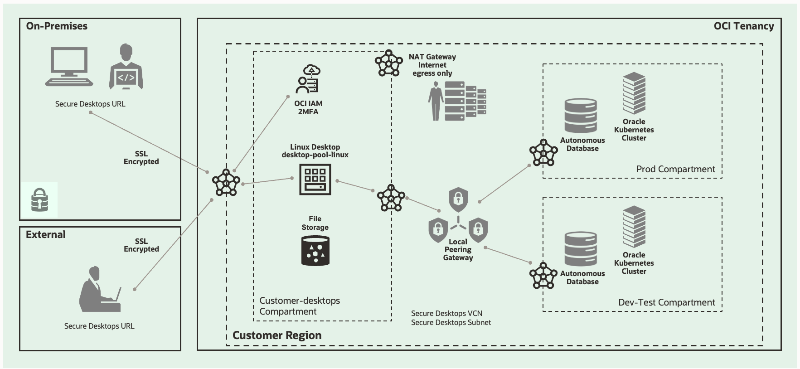

---
doc:
  author: Name Surname                  #Mandatory
  version: 2.5                            #Mandatory
  cover:                                #Mandatory
    title:                              #Mandatory
      - ${doc.customer.name}            #Mandatory
      - \<Workload\> to OCI       #Mandatory
    subtitle:                           #Mandatory
      - Solution Definition             #Mandatory
  customer:                             #Mandatory
    name: \<Customer Name\>                           #Mandatory
    alias: \<Customer Alias\>                          #Mandatory
  config:
    impl:
      type: \<Service Provider\>            #Mandatory: Can be 'Oracle Lift', 'Oracle Fast Start', 'Partner' etc. Use with ${doc.config.impl.type}     
      handover: ${doc.customer.name}    #Mandatory: Please specify to whom to hand over the project after implementation. eg.: The Customer, a 3rd party implementation or operations partner, etc.           
  draft: false
  history:
    - version: 1.0
      date: 1st June 2023
      authors: 
        - Base Template
      comments:
        - Created a new Solution Definition document. To be used for iterative review and improvement.
    - version: 1.1
      date: 1st July 2023
      authors: Base Template
      comments:
        - Update Template per feedback. Added security-templated texts and annex.
    - version: 1.2
      date: 1st August 2023
      authors: Base Template
      comments:
        - Update Template per feedback. As per Confluence.
    - version: 2
      date: 1st September 2023
      authors: Base Template
      comments:
        - Added Networking Annex
    - version: 2.1
      date: 1st September 2023
      authors: Base Template
      comments:
        - Updated LZ Snippet
        - Added 'Base Template' to the version table instead of 'Name Surname'
    - version: 2.2
      date: 16th October 2023
      authors: Base Template
      comments:
        - Upgraded the Logical Architecture as mandatory. It is now included in the 'Mandatory' template.
    - version: 2.3
      date: 16th January 2024
      authors: Base Template
      comments:
        - Added comment for workload snippets
        - Updates Acronyms
    - version: 2.4
      date: 26th February 2024
      authors: Base Template
      comments:
        - Added the network firewall in the requirement, the solution considerations, and in the Annex.
    - version: 2.5
      date: 8th April 2024
      authors: Base Template
      comments:
        - Added 'manageability' in the requirement, the solution considerations, and in the Annex.
  team:
    - name: ${doc.author}
      email: example@example.com
      role: Tech Solution Specialist
      company: Oracle
    - name: Ada Lovelace
      email: example@example.com
      role: Account Cloud Engineer
      company: Oracle
  acronyms:
    Dev: Development
---

<!--
    Last Change: 18th May 2022
    Review Status: Development
    Review Notes: see https://confluence.oraclecorp.com/confluence/x/9Vyyvw
    How to use this template: https://confluence.oraclecorp.com/confluence/x/LBRBvg
-->

<!--
If you need to control the hyphenation of words. Use the example below and remove the comment. Example of the default hyphenation De-vOps or in-fras-truc-ture. You can change it by defining a new hyphenation as in the example below 'in-fra-struc-ture'. Or define words without any hyphenation, for example for names such as ArgoCD.
-->
<!--
\hyphenation{Dev-Ops ArgoCD in-fra-struc-ture re-li-a-bil-i-ty}
-->

*Guide:*

*Author Responsibility*

- *Chapter 1-3: Sales Consultant*
- *Chapter 4: Implementer*

# Document Control
<!--
Role  | RACI
------|-----
ACE   | R/A
Impl. | None
PPM   | None
-->


## Version Control

| Version | Author       | Date                 | Comment         |
|:--------|:-------------|:---------------------|:----------------|
| 1.0     | Vaibhav Tiwari | March 14th, 2024 | Initial version |


## Team

| Name         | E-Mail              | Role                              | Company |
|:-------------|:--------------------|:----------------------------------|:--------|
| Vaibhav Tiwari | vaibhav.t.tiwari@oracle.com | Cloud VMware Solutions Specialist | Oracle  |


## Document Purpose

The purpose of this document is to provide a comprehensive guide for implementing Oracle Secure Desktop within a customer’s Oracle Cloud Infrastructure (OCI) environment. This solution guide outlines the technical architecture, deployment procedures, and best practices to ensure a secure, scalable, and efficient virtual desktop infrastructure. Designed for use by account teams, the guide can be tailored to meet specific customer requirements, ensuring that all stakeholders have a clear understanding of the solution's capabilities, benefits, and implementation strategy.        

# Business Context

In today’s increasingly digital workspace, organizations face challenges in providing secure, flexible, and efficient access to enterprise applications and data. Employees are often dispersed across multiple locations, requiring secure remote access to corporate resources. This business environment demands a virtual desktop infrastructure (VDI) solution that can support diverse user needs while maintaining stringent security standards. Oracle Secure Desktop, deployed on OCI, addresses these challenges by delivering a robust, scalable VDI solution that allows organizations to provide secure, remote access to their workforce, regardless of their location.

## Executive Summary

This document outlines the implementation of Oracle Secure Desktop on Oracle Cloud Infrastructure (OCI) for [Customer Name], a leading enterprise in [Industry]. The solution provides a secure, scalable, and cost-effective virtual desktop infrastructure, enabling the customer to support remote work and enhance data security. By leveraging OCI’s robust infrastructure and Oracle Secure Desktop’s advanced features, the customer will be able to reduce operational costs, improve employee productivity, and ensure compliance with industry regulations. The solution is designed to be adaptable to future business needs, providing the flexibility to scale as the organization grows.

## Workload Business Value

The implementation of Oracle Secure Desktop delivers significant business value by addressing key challenges faced by [Customer Name]. By enabling secure, remote access to business-critical applications and data, the solution helps reduce the risk of data breaches and ensures compliance with regulatory requirements. It also offers cost savings by centralizing desktop management and reducing the need for physical infrastructure. Furthermore, the flexibility to scale the solution based on demand allows [Customer Name] to efficiently manage resources, ensuring that the IT environment can adapt to changing business needs without compromising performance or security.

# Workload Requirements and Architecture

## Overview
<!--
Role  | RACI
------|-----
ACE   | R/A
Impl. | None
PPM   | None
-->

*Guide:*

*Describe the Workload: What applications and environments are part of this Workload migration or new implementation project, and what are their names? The implementation will be scoped later and can be a subset of the Solution Definition and proposed overall solution. For example, a Workload could exist of two applications, but the implementer would only include one environment of one application. The workload chapter is about the whole Workload and the implementation scope will be described later in the chapter [Solution Scope](#solution-scope).*

Oracle provides comprehensive guidance for planning, architecting, prototyping, and managing the deployment of Oracle Secure Desktop solutions. By leveraging Oracle's expertise and included services, customers can deploy secure desktop environments in a matter of weeks or even days, rather than months.

Oracle will assist in setting up the Oracle Secure Desktop environment based on the customer's specific business and technical requirements.

Oracle will deploy and manage virtual desktops on Oracle Cloud Infrastructure, ensuring a secure, scalable, and resilient desktop environment.

The objectives of this document are to:

- **Review the existing desktop infrastructure:** Assess the current on-premise desktop architecture, map it to relevant Oracle OCI services, and propose a tailored cloud architecture for Oracle Secure Desktop.
  
- **Provide OCI architecture guidelines:** Offer clear guidance on the OCI architecture necessary to support the Oracle Secure Desktop deployment.

- **Address all Oracle Secure Desktop-related aspects:** Cover security, networking, compute, storage, and other critical components required to implement the target cloud architecture for Oracle Secure Desktop.

- **Set up the Oracle Secure Desktop cloud environment:** Configure the environment according to the agreed-upon design and architecture, ensuring it meets the business and technical requirements.

- **Define the scope of potential LIFT services:** Identify and outline any additional services that may be required to enhance the deployment and management of Oracle Secure Desktop.


## Non-Functional Requirements
<!--
Role  | RACI
------|-----
ACE   | R/A
Impl. | None
PPM   | None
-->

*Guide:*

*Describe the high-level technical requirements for the Workload. Consider all sub-chapters, but decide and choose which Non-Functional Requirements are necessary for your engagement. You might not need to capture all requirements for all sub-chapters.*

*This chapter is for describing customer-specific requirements (needs), not to explain Oracle solutions or capabilities.*

The client aims to build a disaster recovery solution that will secure business-critical Oracle Secure Desktop workloads. In the event of an on-premise data center failure, this solution will enable the rapid recovery of desktop services on Oracle Cloud Infrastructure (OCI) and Oracle Cloud VMware Solution (OCVS).

### Regulations and Compliances Requirements

*Guide:*

*This section captures specific regulatory or compliance requirements for the Workload. These may limit the types of technologies that can be used and may drive some architectural decisions.*

*The Oracle Cloud Infrastructure Compliance Documents service lets you view and download compliance documents:
https://docs.oracle.com/en-us/iaas/Content/ComplianceDocuments/Concepts/compliancedocsoverview.htm*

*If there are none, then please state it. Leave the second sentence as a default in the document.*

*Example:*

At the time of this document creation, no Regulatory and Compliance requirements have been specified.

In addition to these requirements, the [CIS Oracle Cloud Infrastructure Foundation Benchmark, v1.2](https://www.cisecurity.org/benchmark/Oracle_Cloud) will be applied to the Customer tenancy.

### Environments

| Location      | Type             | Operating System Version | Total vCPU Cores | Total Memory (GB) | Used Storage (GB) | Total Storage (GB) |
|:--------------|:-----------------|:-----------------|:------------------|:------------------|:------------------|:-|
| Location Name | Virtual Machines | Windows or Linux    | 550              | 1800              | 23580             | 30000 |


### High Availability and Disaster Recovery Requirements

The Oracle Secure Desktop solution in this deployment does not require high availability (HA) because user desktops are not mission-critical. If a desktop is deleted or becomes unavailable, users can easily request a new one, and their additional storage will automatically reconnect to the new instance. This approach simplifies management, reduces costs, and provides a flexible, user-centric experience, allowing IT resources to focus on efficient desktop provisioning rather than maintaining complex HA configurations.


In the DR strategy for Oracle Secure Desktop, user data on external storage is regularly backed up according to predefined policies. If a desktop instance is lost, it can be quickly reprovisioned, and the backed-up external storage can be manually reattached to the new instance. This approach ensures data recovery and continuity while maintaining a simple and flexible process, without relying on complex real-time replication.

### Security Requirements

Oracle Secure Desktop on OCI ensures security through multiple layers. Data is encrypted both at rest and in transit to protect against unauthorized access. Identity and Access Management (IAM) enforces role-based access control and can require multi-factor authentication for added security. Network security is maintained through isolated Virtual Cloud Networks (VCNs) and strict security lists that control access to the desktop environment.


- **Data Encryption:** Encrypt data at rest and in transit to protect against unauthorized access.
- **Identity and Access Management (IAM):** Implement role-based access control and multi-factor authentication.
- **Network Security:** Use Virtual Cloud Networks (VCNs) and security lists to control and isolate network traffic.
- **Compliance:** Ensure adherence to relevant industry regulations and standards.
- **Backup and Recovery:** Regularly back up data and have recovery procedures in place to handle data loss or corruption.

### Deployment Requirements

* **Hardware:** Sufficient CPU, RAM, storage, and network connectivity on both server and client devices.
* **Software:** Oracle Secure Global Desktop, supported operating systems and web browsers on both server and client, and application servers for the accessed applications.
* **Network:** Adequate network infrastructure to handle increased traffic and bandwidth.
* **Security:** Robust security measures to protect data.
* **Licensing:** Necessary licenses for Oracle Secure Global Desktop and underlying components.


## Future State Architecture
<!--
Role  | RACI
------|-----
ACE   | R/A
Impl. | None
PPM   | None
-->

*Guide:*

*The Workload Future State Architecture can be described in various forms. In the easiest case, we describe a Logical Architecture, possibly with a System Context Diagram. A high-level physical architecture is mandatory as a description of your solution.*

*This should be the final architecture as part of the pre-sales solution, not an intermediate or draft version*

*Additional architectures, in the subsections, can be used to describe needs for specific workloads.*

### Mandatory Security Best Practices

### **Golden Image**

1. **Minimal Base Configuration:** Start with a minimal, clean operating system installation to reduce potential vulnerabilities.
2. **Security Hardening:** Apply OS-level hardening practices, such as disabling unnecessary services, applying security patches, and configuring firewalls.
3. **Software Inclusion:** Only include essential applications and ensure they are up-to-date.
4. **User Profiles:** Configure user profiles with least privilege and mandatory settings for security.
5. **Regular Updates:** Keep the golden image updated and versioned for easy rollback and compliance.


### **VCN (Virtual Cloud Network) - Private Subnet**
1. **Private Subnet:** Deploy Secure Desktops in a private subnet to minimize exposure to the internet.
2. **Security Lists & NSGs:** Use security lists and Network Security Groups (NSGs) to control inbound/outbound traffic, only allowing necessary ports and IPs.

### **Compartment**
1. **Segmentation:** Use compartments to segment resources, ensuring logical separation and easier management of permissions and billing.
2. **Access Controls:** Apply fine-grained access controls using IAM policies to ensure only authorized users can manage resources within the compartment.

### **Desktop User Group**
1. **Least Privilege Access:** Grant users the minimum privileges required for their role to reduce the risk of accidental or malicious changes.
2. **Group Policy:** Use group policies to enforce security configurations and restrict user actions based on their role.

### **Desktop Admin Group**
1. **Restricted Access:** Limit the number of users in the Desktop Admin group to minimize the risk of administrative errors or security breaches.
2. **Logging & Monitoring:** Enable auditing and monitoring for all actions performed by the admin group to ensure accountability and quickly detect any unauthorized activities.


### OCI Landing Zone Solution Definition

*Guide:*

*This chapter describes landing zone best practices and usually does not require any changes. If changes are required please refer to [Landing Zone GitHub](https://github.com/oracle-devrel/technology-engineering/tree/main/landing-zones). The full landing zone needs to be described in the Solution Design by the service provider.*

*Use this template ONLY for new cloud deployments and remove it for brownfield deployments.*


The Oracle Secure Desktop Landing Zone is a well-architected, secure, and scalable environment where virtual desktop infrastructure (VDI) is deployed. It acts as the foundational layer, ensuring that all necessary components, such as networking, security, identity management, and monitoring, are in place to support the secure desktop environment.

#### Key Components:
* **Networking:**
   - **VPC/Subnets:** Virtual Private Cloud (VPC) with segmented subnets for different tiers (management, application, and user access).
   - **Internet Gateway:** Allows secure external access to the landing zone.
   - **NAT Gateway:** Enables secure outbound internet access for resources in private subnets.
   - **Load Balancer:** Distributes traffic across multiple instances of virtual desktops.

* **Security:**
   - **Security Groups:** Control inbound and outbound traffic at the instance level.
   - **Network ACLs:** Additional layer of subnet-level security.
   - **WAF (Web Application Firewall):** Protects against web exploits and attacks.
   - **IAM (Identity and Access Management):** Manages user permissions and access controls.

* **Compute:**
   - **Hypervisor Hosts:** Run the virtual desktops.
   - **Management Servers:** Manage VDI resources, users, and policies.

* **Storage:**
   - **Shared Storage:** Centralized storage for desktop images and user data.
   - **Backup and Recovery:** Regular backups to ensure data integrity and availability.

* **Monitoring and Logging:**
   - **Centralized Monitoring:** Tracks the performance and health of the landing zone.
   - **Audit Logs:** Maintains records of all access and configuration changes for compliance and security.

* **Identity and Access Management:**
   - **Single Sign-On (SSO):** Provides a seamless login experience for users.
   - **Multi-Factor Authentication (MFA):** Adds an extra layer of security for user access.


### Logical Architecture
<!--
Role  | RACI
------|-----
ACE   | R/A
Impl. | None
PPM   | None
-->

*Guide:*

*Provide a high-level logical Oracle solution for the complete Workload. Indicate Oracle products as abstract groups, and not as physical detailed instances. Create an architecture diagram following the latest notation and describe the solution.*

*To implement a solution the Physical Architecture is needed in the next chapter. The physical notation can show individual components with physical attributes such as IP addresses, hostnames, or sizes.*

*[The Oracle Cloud Notation, OCI Architecture Diagram Toolkits](https://docs.oracle.com/en-us/iaas/Content/General/Reference/graphicsfordiagrams.htm)*


### Physical Architecture

The physical architecture of Oracle Secure Desktop includes:

* **Data Centers:** Geographically distributed for redundancy and disaster recovery, with strong physical security.
* **Hypervisor Hosts:** Clustered servers running virtual desktops, ensuring high availability.
* **Storage Systems:** Centralized, encrypted storage (SAN/NAS) with RAID for redundancy.
* **Networking:** Redundant network paths and VLAN segmentation for secure, reliable connectivity.
* **Management Servers:** High-availability servers for managing virtual desktops and user authentication.
* **User Access:** Thin/zero clients connect via secure remote access gateways with SSL/TLS encryption.
* **Backup and DR:** Regular backups and a secondary DR site with automated failover for resilience.

This setup ensures a secure, scalable, and resilient virtual desktop environment.


*Guide:*

*The Workload Architecture is typically described in a physical form. This should include all solution components. You do not have to provide solution build or deployment details such as IP addresses.*

*Please describe the solution with an architecture image plus a written text. If you have certain specifics you like to explain, you can also use the Solution Consideration chapter to describe the details there.*

*[The Oracle Cloud Notation, OCI Architecture Diagram Toolkits](https://docs.oracle.com/en-us/iaas/Content/General/Reference/graphicsfordiagrams.htm)*

*Reference:*

[StarterPacks (use the search)](https://github.com/oracle-devrel/technology-engineering/)


## Solution Considerations
<!--
Role  | RACI
------|-----
ACE   | R/A
Impl. | None
PPM   | None
-->

*Guide:*

*Describe certain aspects of your solution in detail. What are the security, resilience, networking, and operations decisions you have taken that are important for your customer?*

### High Availability and Disaster Recovery 

*Reference:*

- [Resilliance on OCI](https://docs.public.oneportal.content.oci.oraclecloud.com/en-us/iaas/Content/cloud-adoption-framework/era-resiliency.htm)
- [Workload Related Content](https://github.com/oracle-devrel/technology-engineering/)

Oracle Secure Desktop ensures High Availability (HA) and Disaster Recovery (DR) through the following mechanisms:

### High Availability (HA)
- **Redundant Architecture:** Multi-tiered design with load balancing and clustering ensures no single point of failure.
- **Automated Failover:** Quick failover to other servers or storage in case of failure.
- **Continuous Monitoring:** Health checks and self-healing mechanisms maintain service uptime.

### Disaster Recovery (DR)
- **Geographically Distributed Data Centers:** Deployments across multiple sites for regional disaster protection.
- **Data Replication:** Synchronous (real-time) or asynchronous replication ensures data availability at DR sites.
- **Automated DR Orchestration:** Automated failover processes and regular DR drills ensure readiness.
- **Backup and Archival:** Regular data backups and long-term archival for compliance and recovery.

These mechanisms work together to ensure that Oracle Secure Desktop remains resilient, with minimal downtime and data loss during failures or disasters.

### Security


*Guide:*

Oracle Secure Desktop ensures security through the following key mechanisms:

* **Centralized Management:** Policies, resource allocation, and updates are centrally controlled, ensuring consistent security across all virtual desktops.

* **Secure Access:** Supports multi-factor authentication (MFA) and encrypted connections (SSL/TLS), safeguarding against unauthorized access and data interception.

* **Data Security:** User data is stored on central servers, not local devices, reducing the risk of data loss or theft. Disk encryption further protects stored data.

* **Isolated Environments:** Each desktop session is sandboxed, preventing cross-contamination, with network segmentation to limit lateral movement in case of a breach.

* **Compliance and Auditing:** Detailed logging and role-based access control (RBAC) help in meeting regulatory requirements and monitoring for security incidents.

* **Intrusion Detection:** Integrated systems monitor for malicious activity, with automated responses to mitigate threats.

* **Disaster Recovery:** Automated backups and failover mechanisms ensure continuity and data recovery in case of failures.

* **Endpoint Security:** Thin and zero clients reduce attack surfaces, with compliance checks ensuring endpoints meet security standards before access.

In essence, Oracle Secure Desktop combines strong access controls, encryption, centralized management, and compliance with industry standards to provide a secure virtual desktop environment.


### Networking


The architecture has the following components:

* **On-premises Network** - This network is the local network used by your organization. It is one of the spokes of the topology.

* **Region** - An Oracle Cloud Infrastructure region is a localized geographic area that contains one or more data centers, called availability domains. Regions are independent of other regions, and vast distances can separate them (across countries or even continents).

* **Virtual Cloud Network (VCN)** - A VCN is a customizable, private network that you set up in an Oracle Cloud Infrastructure region. Like traditional data center networks, VCNs give you complete control over your network environment. You can segment VCNs into subnets, which can be scoped to a region or an availability domain. Both regional subnets and availability domain-specific subnets can coexist in the same VCN. A subnet can be public or private.

* **Security List** - For each subnet, you can create security rules that specify the source, destination, and type of traffic that must be allowed in and out of the subnet.

* **Network Security Group (NSG)** - NSGs act as virtual firewalls for your cloud resources. With the zero-trust security model of Oracle Cloud Infrastructure, all traffic is denied, and you can control the network traffic inside a VCN. An NSG consists of a set of ingress and egress security rules that apply to only a specified set of VNICs in a single VCN.

* **Route Table** - Route tables contain rules to route traffic from subnets to destinations outside a VCN, typically through gateways.

* **Dynamic Routing Gateway (DRG)** - The DRG is a virtual router that provides a path for private network traffic between a VCN and a network outside the region, such as a VCN in another Oracle Cloud Infrastructure region, an on-premises network, or a network in another cloud provider.

* **Bastion Host** - The bastion host is a compute instance that serves as a secure, controlled entry point to the topology from outside the cloud. The bastion host is provisioned typically in a demilitarized zone (DMZ). It enables you to protect sensitive resources by placing them in private networks that can't be accessed directly from outside the cloud. The topology has a single, known entry point that you can monitor and audit regularly. So, you can avoid exposing the more sensitive components of the topology without compromising access to them.

* **VPN Connect** - VPN Connect provides site-to-site IPSec VPN connectivity between your on-premises network and VCNs in Oracle Cloud Infrastructure. The IPSec protocol suite encrypts IP traffic before the packets are transferred from the source to the destination and decrypts the traffic when it arrives.

* **FastConnect** - Oracle Cloud Infrastructure FastConnect provides an easy way to create a dedicated, private connection between your data center and Oracle Cloud Infrastructure. FastConnect provides higher-bandwidth options and a more reliable networking experience when compared with internet-based connections.




## Sizing and Bill of Materials
<!--
Price Lists and SKUs / Part Numbers: https://esource.oraclecorp.com/sites/eSource/ESRCHome
-->

*Guide:*

*Estimate and size the physically needed resources of the Workload. The information can be collected and is based upon previously gathered capacities, business user numbers, integration points, or translated existing on-premises resources. The sizing is possibly done with or even without a Physical Architecture. It is okay to make assumptions and to clearly state them!*

*Clarify with sales your assumptions and your sizing. Get your sales to finalize the BoM with discounts or other sales calculations. Review the final BoM and ensure the sales are using the correct product SKUs / Part Number.*

*Even if the BoM and sizing were done with the help of Excel between the different teams, ensure that this chapter includes or links to the final BoM as well.*

<!--                                                 -->
<!-- End of 3) Workload Requirements and Architecture -->
<!--                                                 -->

<!-- Use the below chapter only for Oracle Implementations such as Lift and FastStart. do not describe the work plan for 3rd Party implementation partners --> 

# Project Implementation (Only for Oracle Implementations!)

## Solution Scope

### Disclaimer
<!--
Role  | RACI
------|-----
ACE   | R/A
Impl. | None
PPM   | None
-->

*Guide:*

*A scope disclaimer should limit scope changes and create awareness that a change of scope needs to be agreed upon by both parties.*

*Example:*

```{.snippet}
uc-disclaimer
```

### Overview
<!--
Role  | RACI
------|-----
ACE   | R/A
Impl. | R
PPM   | C
-->

*Guide:*

*Describe the scope of the implementation as a sub-set of the Workload scope. For example one environment from one application.*

*Example:*


1. **Set Up VCN:** Create a Virtual Cloud Network with private subnets.
2. **Prepare Golden Image:** Build and secure a base desktop image with necessary software.
3. **Deploy Desktops:** Provision desktops using the golden image.
4. **Configure Access:** Set up user and admin groups with appropriate IAM policies.
5. **Monitor and Maintain:** Implement logging, monitoring, and regular updates for ongoing security and performance management.


### Business Value
<!--
Role  | RACI
------|-----
ACE   | R/A
Impl. | C
PPM   | C
-->

*Guide:*

*What's the value for the customer to do an Oracle implementation? For example, speed of deployment and the resulting impact on time to market, and free service. Do not describe Oracle's value or consumption.*

*Example:*

```{.snippet}
uc-business-value
```

### Success Criteria
<!--
Role  | RACI
------|-----
ACE   | R/A
Impl. | R
PPM   | C
-->

*Guide:*

*Technical success criteria for the implementation. As always be S.M.A.R.T: Specific, Measurable, Achievable, Relevant, Timebound. Example: 'Deployment of all OCI resources for the scoped environments in 3 months'.*

*Example:*

The below-listed success criteria are for the ${doc.config.impl.type} implementation only. Partner activities and success criteria are not listed in this documentation.

- Finish provisioning of all OCI resources
- Establish all required network connectivity
- Successfully pass all test cases
- Finished handover with documentation
- Complete the Implementation Security Checklist

## Workplan

### Deliverables
<!--
Role  | RACI
------|-----
ACE   | A
Impl. | R
PPM   | None
-->

*Guide:*

*Describe deliverables within the implementation scope. Including this documentation as Solution Definition and the later following Solution Design. This should be a generic reusable text, provided by the implementers.*

### Included Activities

* Access to an active OCI Tenancy

- Compartment in the tenancy where the Secure Desktop Service will be made available

- VCN against against instances will be provisioned

- Tenancy administrator who will execute the tasks

- Valid region where the Secure Desktop Service is available

- Create a Valid Image that will be used by Secure Desktop Service

- Create Endusers group on OCI that will request instances

- Secure Desktop Administrator will run the ORM stack.

- Create a Desktop Pool with the required details

- End user will login on the specified OCI portal and will request instances.

- Oracle Secure Desktop service is being offered as SAAS and is deployed at tenancy level within the OCI region.  

The details of the Oracle Cloud Infrastructure SLAs are found in the link below.
[OCI Service SLA](https://www.oracle.com/ae/cloud/sla/).

**OCI Foundation & Network**

1. **Virtual Cloud Network (VCN):**
   - Creation of VCN with subnets dedicated to Oracle Secure Desktop.
   - Configured routing tables, internet gateways, and NAT gateways.

2. **Security List:**
   - Security rules defining allowed traffic to and from Oracle Secure Desktop instances.


3. **Public and Private Subnets:**
   - Separate subnets for public-facing components and internal components.
   - Proper routing and security configurations.


**Security**

- **Identity and Access Management (IAM):**
   - Configuration of OCI IAM policies for role-based access control (RBAC).
   - Integration with existing identity providers (e.g., Active Directory, LDAP).

- **Data Encryption:**
   - Encryption of data at rest using OCI Key Management.
   - Encryption of data in transit using SSL/TLS.

3. **Firewalls and Security Lists:**
   - Configuration of firewalls to restrict unauthorized access.
   - Security lists governing ingress and egress traffic to/from subnets.

4. **Audit Logging and Monitoring:**
   - Enablement of OCI audit logs to track administrative actions.
   - Integration with monitoring tools for real-time alerts.

5. **Compliance and Governance:**
   - Implementation of security controls to comply with industry standards (e.g., GDPR, HIPAA).
   - Regular security assessments and vulnerability scans.


### Recommended Activities

- **Kickoff Meeting:**
   - Introduction of project team members.
   - Review of project scope, objectives, and timelines.

- **Requirements Gathering:**
   - Workshops with stakeholders to gather business and technical requirements.
   - Documentation of requirements in a requirements specification document.

- **Design Phase:**
   - Creation of a detailed architectural design.
   - Review and approval of the design by the customer.

- **Infrastructure Setup:**
   - Provisioning of OCI resources, including compute instances, storage, and networking.
   - Configuration of VCN, subnets, and security lists.

- **Oracle Secure Desktop Installation:**
   - Deployment of Oracle Secure Desktop components.
   - Configuration of custom images if required (e.g., Windows Server).

- **Integration:**
   - Integration with identity providers for user authentication.
   - Configuration of network connections to on-premises systems.

- **Testing Phase:**
   - Execution of UAT to validate functionality against customer requirements.
   - Performance and load testing to ensure the system meets SLAs.
   - Security testing to identify and mitigate vulnerabilities.

- **Training and Documentation:**
   - Conducting training sessions for IT administrators and end-users.
   - Providing detailed documentation for future reference.

- **Go-Live:**
   - Transitioning the Oracle Secure Desktop solution to production.
   - Close monitoring of system performance and user experience.

- **Post-Go-Live Support:**
    - Providing support to address any issues during the initial go-live period.
    - Fine-tuning system configurations based on feedback.

- **Final Review and Handover:**
    - Review of project deliverables and customer satisfaction.
    - Handover of the system to the customer’s IT team.


### Timeline
When implementing Oracle Secure Desktop for a customer, the timeline can vary depending on the scope, complexity, and specific requirements of the deployment. Here's a general timeline broken down into common phases:

**Planning and Requirements Gathering (1-2 weeks)**
   - **Customer Needs Assessment:** Understand the customer’s business requirements, number of users, types of applications, and licensing needs.
   - **Technical Requirements:** Assess infrastructure, network, and security requirements.
   - **Design Document:** Create a detailed design document that includes architecture, network layout, and deployment plan.
   - **Approval:** Get customer approval on the design and timelines.

**Infrastructure Preparation (2-3 weeks)**
   - **Provisioning OCI Resources:** Set up the necessary OCI infrastructure, including virtual networks, compute instances, and storage.
   - **BYOL Considerations:** Ensure any necessary licenses are in place, especially if leveraging BYOL for Windows VMs.
   - **Security Configuration:** Implement security controls like firewalls, security lists, and identity access management.

**Installation and Configuration (2-4 weeks)**
   - **Deploy Oracle Secure Desktop Components:** Install and configure Oracle Secure Desktop on OCI.
   - **Custom Image Preparation:** If using custom images, prepare and upload the necessary Windows Server Images.
   - **Integrate with Existing Systems:** Set up any required integrations with on-premises systems, identity providers, or other cloud services.
   - **Networking Setup:** Ensure proper network configurations for secure access, including VPN or private connectivity.

**Testing and Validation (1-2 weeks)**
   - **User Acceptance Testing (UAT):** Conduct thorough testing with key stakeholders to validate that the solution meets the agreed requirements.
   - **Performance Testing:** Evaluate performance under load, ensuring it meets SLAs.
   - **Security Testing:** Verify that all security measures are functioning as intended.

**Training and Documentation (1 week)**
   - **Training Sessions:** Provide training for the customer’s IT team and end-users on how to manage and use Oracle Secure Desktop.
   - **Documentation:** Deliver comprehensive documentation, including user manuals, troubleshooting guides, and an operational handbook.

**Go-Live and Support (1-2 weeks)**
   - **Go-Live:** Transition the Oracle Secure Desktop into production.
   - **Monitoring:** Closely monitor the environment post-deployment for any issues.
   - **Support:** Provide post-implementation support to address any questions or problems.

**Handover and Final Review (1 week)**
   - **Handover:** Complete the handover process to the customer’s IT team.
   - **Final Review:** Conduct a review meeting with the customer to discuss the implementation, gather feedback, and ensure customer satisfaction.

**Total Estimated Timeline: 8-15 weeks**

This timeline can vary depending on factors such as the complexity of the environment, the number of users, the level of customization required, and the customer’s internal processes.


### Implementation RACI


Guide:

Describe for all activities the RACI (Responsible, Accountable, Consultant, Informed) matrix

Example:

| Task                                           | Responsible (R) | Accountable (A) | Consulted (C) | Informed (I) |
|------------------------------------------------|------------------|------------------|----------------|---------------|
| Define project scope and objectives            | Consultant       | Account Cloud Engineer  | Team Members   | Stakeholders |
|Identify Image requirements            | Consultant       | Account Cloud Engineer  | Team Members   | Stakeholders |
| Analyze current infrastructure and applications| Consultant       | Account Cloud Engineer  | Team Members   | Stakeholders |
| Select appropriate Oracle cloud services       | Consultant       | Account Cloud Engineer  | Team Members   | Stakeholders |
| Develop Desktop Pool plan            | Consultant       | Account Cloud Engineer  | Team Members   | Stakeholders |
| Allocate resources for Secure Desktop Administrator                | Account Cloud Engineer | Account Cloud Engineer | Consultant     | Stakeholders |
| Execute Desktop Pool plan                         | Team Members     | Account Cloud Engineer | Consultant     | Stakeholders |
| Monitor Image and Desktop Pool progress                     | Account Cloud Engineer | Account Cloud Engineer | Consultant     | Stakeholders |
| Resolve Image and Desktop Pool progress issues and escalations       | Team Members     | Account Cloud Engineer | Consultant     | Stakeholders |
| Validate successful connection for the enduser                  | Team Members     | Account Cloud Engineer | Consultant     | Stakeholders |
| Document  process and outcomes       | Team Members     | Account Cloud Engineer | Consultant     | Stakeholders |
| Conduct review post enduser login                 | Consultant       | Account Cloud Engineer | Team Members   | Stakeholders |


Responsible (R): Individuals or roles responsible for completing the task.
Accountable (A): Individuals ultimately answerable for the task's completion or outcome.
Consulted (C): Individuals or roles to be consulted for their input or expertise.
Informed (I): Individuals or roles to be kept informed about the task's progress or outcome.


R- Responsible, I- Informed, A- Accountable, C- Consulted

The participation of the following Customer stakeholders is required for the Service to be performed:

* Enterprise Architect
* Infrastructure Architect
* Backup/Recovery team leads
* Windows/Linux Administrator
* Network Operations team leads


### Assumptions

Guide:

List any assumptions, if any, which could impact the solution architecture or the implementation.

Example:

**Generic assumptions**
* Secure Desktop Administrators have relevant permissions.
* The Secure Desktop end-users have been created on the OCI tenancy
* Dedicated Compartment has been setup for the Secure Desktop Pools
* Appropriate Pool settings have been applied to make the solution cost-effective
* Selected region has OCI Secure Desktop Service
* Golden Image has the required softwares installed for the end-user.
* The CIDR which will be used for Secure Desktop does not overlap with the Customer's existing environment.
* Supported Images are used for Secure Desktop.
* Required traffic is allowed from the Secure Desktop Images.
* Required storage is mapped with the Secure Desktop instances.
* There are no licensing constraints from Microsoft or any other software vendors. 
* The Secure Desktop instances have sufficient CPU cores and RAM to address application requirement.
* Customer has flexibility to edit VPU for the Block Volume.
* Customer will have the necessary Oracle Support (MoS) contract for all the products that may/will be used during this project.
* Customer will be managing any other 3rd party vendors or suppliers.
* Customer will have adequate licenses for all the products that may/will be used during this project.
* It is assumed that all work will be done remotely and within either central European time or Indian standard time normal office working hours.
* Any problems, issues, errors, and anomalies to be addressed through MOS SRs & will continue to be owned by the Customer.
* Details and Naming convention will be provided for OCI resources.
* Any additional effort outside of the scope of this proposal will be managed by change control and mutually agreed upon by both Oracle and Customer.
* It is assumed that all required contractual agreements between Oracle and the Customer are in place to ensure uninterrupted execution of the project.
* It is assumed that all work will be done remotely and within either central European time or India Standard Time normal office working hours.
* It is assumed that upgrades are excluded from the scope of work and no production systems/production cutover is part of the scope of work undertaken by the Oracle Service
* It is assumed that all required Oracle cloud technical resources are available for use during the duration of the project and that engineers involved have been granted the appropriate access to those technical resources by the customer before the start of the project.
* It is assumed that all required customer resources, and if applicable third-party resources, are available during the duration of the project to work openly and collaboratively to realize the project goals uninterruptedly.
* It is assumed that all required customer resources, and if applicable third-party resources are aware of all technical and non-technical details of the as-is and to-be components. All resources are committed to technical work as far as is needed for the execution of the project.
* It is assumed that all required documentation, system details, and access needed for the execution of the project can be given/granted to parties involved when and where deemed needed for the success of the project.
* It is assumed that the customer will have adequate licenses for all the products that may/will be used during the project and that appropriate support contracts for those products are in place where the customer will take the responsibility of managing any potential service request towards a support organization to seek resolution of a problem.
* It is assumed the customer will provide the appropriate level of information and guidance on rules and regulations which can directly and/or indirectly influence the project or the resulting deliverables. This includes, however not limited to, customer-specific naming conventions, security implementation requirements, internal SLA requirements as well as details for legal and regulatory compliance. It will be the responsibility of the customer to ensure that the solution will adhere to this.
* It is assumed that under the customer's responsibility, the customer will ensure and validate that the solution will be placed under the proper controls for ensuring business continuity, system availability, recoverability, security control, and monitoring and management as part of a post-project task.
* It is assumed that the customer will take responsibility for testing all functional and non-functional parts of the solution within the provided timeline and ensure a proper test report will be shared with the full team (including customer, Oracle, and if applicable third party).
* It is assumed that any requirement, deliverable, or expectation that is not clearly defined as in-scope of the project will not be handled as part of the project and is placed under the responsibility of the customer to be handled outside of the project.

**Project-specific assumptions**


- Oracle Secure Desktop (OCM) supports Bring Your Own License (BYOL) for Windows virtual machines, but the support may vary depending on the specific version of Windows being migrated and the licensing agreements in place.

- OCI Windows Server Images can be used with OCI Secure Desktop as custom images, but charges will be applicable.

- For certain versions of Windows, customers may be able to migrate to dedicated virtual machine hosts on Oracle Cloud Infrastructure (OCI) to enable BYOL.

- Dedicated VM hosts provide physical servers dedicated to a single customer's use, offering enhanced control and security.

- Customers should review their licensing agreements and consult with Oracle support or their Oracle account representative to determine the specific options available for migrating Windows virtual machines to OCI with BYOL.

- Customers should ensure compliance with licensing requirements to avoid any potential issues.

### Obligations


- You will have purchased the appropriate Universal Credits for the services required for the project.
- The implementation team will have admin access to the customer's tenancy for implementation.
- You will ensure the appropriate product training has been obtained to maintain and support the implementation
- Your business team will be available for the Testing phase, which will be completed within the agreed testing window.
- You will provide project management for the project and will manage any third-party suppliers or vendors.
- You will provide the implementation team with appropriate access to your tenancy & relevant on-premises applications/database to perform implementation activities. We recommend the least-privilege access principle.
- You will revoke implementor access on production goLive or after project completion.
- You will take consistent and restorable backups of your existing data and application before implementation.


### Transition Plan
<!--
Role  | RACI
------|-----
ACE   | A
Impl. | R
PPM   | C/I
-->

*Guide:*

*The Transition Plan describes the handover of the project, after the implementation. Please ensure the accepting transition party is filled out.*

```{.snippet}
uc-transition-plan
```
