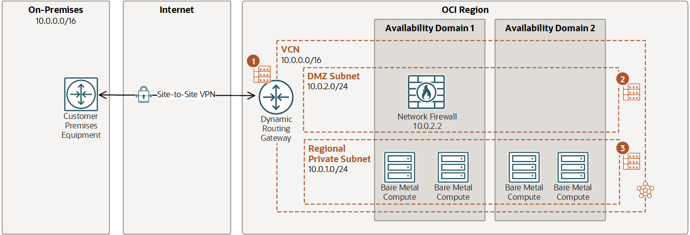
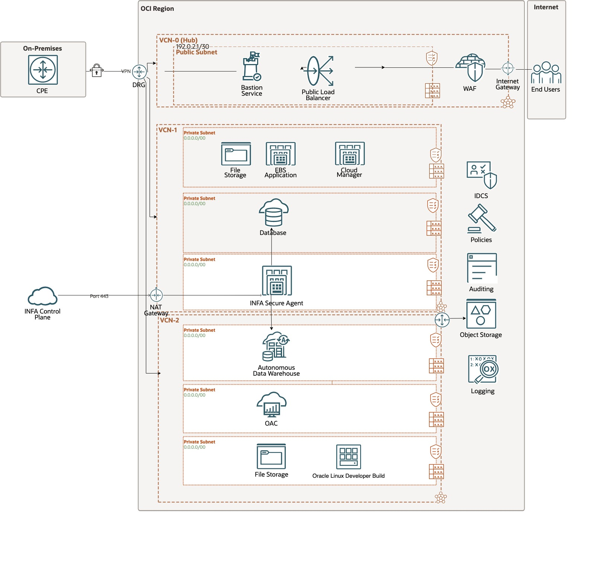

# Document Control

## Version Control

| Version | Authors       | Date            | Comments                         |
|:--------|:--------------|:----------------|:---------------------------------|
| 0.6     | Author Author | 20 June 2023    | This is the old WAD version      |
| 0.7     | Author Author | 01 January 2023 | New Solution Definition template |

## Team

| Name            | Email                      | Role              | Company |
|:----------------|:---------------------------|:------------------|:--------|
| Author Author   | example.example@oracle.com | Author role       | Oracle  |
| example example | example.example@oracle.com | Template reviewer | Oracle  |

## Abbreviations and Acronyms

| Term  | Meaning                                         |
|:------|:------------------------------------------------|
| ADW   | Autonomous Data Warehouse                       |
| CIDR  | Classless Inter-Domain Routing                  |
| DNS   | Domain Name System                              |
| DRG   | Dynamic Routing Gateway                         |
| ETL   | Extract Transform Load                          |
| IAM   | Identity and Access Management                  |
| IGW   | Internet Gateway                                |
| NSG   | Network Security Groups                         |
| OAC   | Oracle Analytics Cloud                          |
| OBIA  | Oracle Business Intelligence Applications       |
| OBIEE | Oracle Business Intelligence Enterprise Edition |
| OCPU  | Oracle Compute Unit                             |
| ODI   | Oracle Data Integrator                          |
| OSN   | Oracle Service Network                          |
| PVO   | Public View Object                              |
| SGW   | Service Gateway                                 |
| VCN   | Virtual Cloud Network                           |
| VNIC  | Virtual Network Interface Card                  |

## Document Purpose

This document provides a high-level solution definition for the Oracle solution and aims at describing the current state, and to-be state as well as a potential high-level project scope and timeline for \<Service Provider\>.

The document may refer to a ‘Workload’, which summarizes the full technical solution for a customer (You) during a single engagement. The Workload is described in the chapter [Workload Requirements and Architecture](#workload-requirements-and-architecture).

This is a living document, additional sections will be added as the engagement progresses resulting in a final Document to be handed over to the \<Service Provider\>.

# Business Context

CustomerA is using OBIA version 7.9.6.4 which is in sustaining support and modernisation of it is an important step to take. Customer is having Oracle eBS as source environment.

Success criteria:

| Description                                                                | Success criteria                                                                                                                                                                                 | Owner | Notes |
|----------------------------------------------------------------------------|--------------------------------------------------------------------------------------------------------------------------------------------------------------------------------------------------|-------|-------|
| Migration of Data Warehouse Database to Autonomous Data Warehouse Database | Successful migration of the database                                                                                                                                                             |       |       |
| Migration of OBIEE to OAC                                                  | Successful migration of the OBIEE content to OAC, connected to ADW and analytics tested to be working                                                                                            |       |       |
| Migration of Informatica Powercenter to Informatica IDMC                   | Successful migration of Powercenter content to IDMC and a execution of the data loads rseuling in data in the new ADW                                                                            |       |       |
| New Solution for DAC                                                       | A replacement solution for DAC will be able to run the Informatica mappings in the right sequence and load data in the Data warehouse tables and store the parameters required for the data load |       |       |

## Executive Summary

*Guide:*

*A section describing the Oracle differentiator and key values of the solution of our solution for the customer, allowing the customer to make decisions quickly.*

## Workload Business Value

*Guide:*

*A clear statement of specific business value as part of the full workload scope. Try to keep it SMART: Specific, Measurable, Assignable, Realistic, and Time-Related - Agree on the business value with the customer. Keep it business-focused, and speak the language of the LoB which benefits from this Workload: "Increase Customer Retention by 3% in the next year" or "Grow Customer Base with Executive Decision-Making from our Sales and Support Data". Avoid technical success criteria such as "Migrate App X to Oracle Cloud" or "Provision 5 Compute Instances". Avoid Oracle success criteria and language "Get Workload Consuming on OCI".*

CustomerA is running an outdated and unsupported installation of OBIA with support and security risks. Modernising this Data Warehouse and Analytics solution will help CustomerA to be ready for the future again. Migrating to OCI and using ADW, OAC and Informatica IDMC creates a cloud native solution and leverage existing OBIEE, Informatica and Database knowledge in a modern setting while preserving previously made investments in Data Warehouse, extractions and analytics.

After the migration the OBIA installation will continue as a custom data warehouse and analytics solution based on the cloud native successors of the migrated stack.

# Workload Requirements and Architecture

## Overview

*Guide:*

*Describe the Workload: What applications and environments are part of this Workload, and what are their names? The implementation will be scoped later and is typically a subset of the Workload. For example, a Workload could exist of two applications, but the implementer would only include one environment of one application. The workload chapter is about the whole Workload and the implementation scope will be described late in the chapter [Scope](#scope).*

Oracle Business Intelligence Applications version 7.9.6.4 with OBIEE + Database + Informatica Powercenter + DAC will be migrated to a new modern cloud based stack of OAC + ADW + Informatica IDMC + a solution for scheduling and parameter repository.

Main components will be migrated to OCI. The Source Database can stay in its current place and the Informatica control plane will be hosted by Informatica.

## Non-Functional Requirements

*Guide:*

*Describe the high-level technical requirements for the Workload. Consider all sub-chapters, but decide and choose which Non-Functional Requirements are necessary for your engagement. You might not need to capture all requirements for all sub-chapters.*

*This chapter is for describing customer-specific requirements (needs), not to explain Oracle solutions or capabilities.*

Run the OBIA installation in a supported stack of components

### Regulations and Compliances Requirements

*Guide:*

*This section captures specific regulatory or compliance requirements for the Workload. These may limit the types of technologies that can be used and may drive some architectural decisions.*

*The Oracle Cloud Infrastructure Compliance Documents service lets you view and download compliance documents: https://docs.oracle.com/en-us/iaas/Content/ComplianceDocuments/Concepts/compliancedocsoverview.htm*

*If there are none, then please state it. Leave the second sentance as a default in the document.*

*Example:*

At the time of this document creation, no Regulatory and Compliance requirements have been specified.

In addition to these requirements, the [CIS Oracle Cloud Infrastructure Foundation Benchmark, v1.2](https://www.cisecurity.org/benchmark/Oracle_Cloud) will be applied to the Customer tenancy.

### Environments

*Guide:*

*A diagram or list detailing all the required environments (e.g. development, text, live, production, etc).*

Example:

| Name | Size of Prod | Location | Scope |
|:-----|:-------------|:---------|:------|
| DEV  | 100%         | Xxxxxxxx | Yes   |
| TST  | 100%         | Xxxxxxxx | No    |
| PRD  | 100%         | Xxxxxxxx | No    |

### High Availability and Disaster Recovery Requirements

*Guide:*

*This section captures the resilience and recovery requirements for the Workload. Note that these may be different from the current system.*

*The Recovery Point Objective (RPO) and Recovery Time Objective (RTO) requirement of each environment should be captured in the environments section above, and wherever possible.*

-   *What are the RTO and RPO requirements of the Application?*
-   *What are the SLAs of the application?*
-   *What are the backup requirements*

*Note that if needed, this section may also include an overview of the proposed backup and disaster recovery proposed architectures.*

*This chapter is mandatory, while there could be no requirements on HA/DR, please mention that in a short single sentence.*

*Example:*

For the Development environment no additional measures are put in place for resilience and recovery. For OAC the regular functionality of creating snapshots can be used to backup the RPD and Presentation Catalog. For ADW the automatic Backup mechanism is sufficient for the Pilot.

Once the Development environment is concluded and decision is taken to move ahead with this solution, Availability and and Distaster/Recovery architecture can be put in place depending on CustomerAs requirements and needs

### Security Requirements

*Guide:*

*Capture the Non-Functional Requirements for security-related topics. Security is a mandatory subsection that is to be reviewed by the x-workload security team. The requirements can be separated into:*

-   *Identity and Access Management*
-   *Data Security*

*Other security topics, such as network security, application security, or others can be added if needed.*

*Example:*

At the time of this document creation, no Security requirements have been specified.

### Integration and Interfaces

*Guide:*

*A list of all the interfaces into and out of the defined Workload. The list should detail the type of integration, the type of connectivity required (e.g. VPN, VPC, etc) the volumes, and the frequency.*

-   *list of integrations*
-   *list of user interfaces*

*Example:*

| Name             | Source | Target | Protocol | Function         |
|:-----------------|:-------|:-------|:---------|:-----------------|
| Data Integration | EBS    | ADW    | Batch    | Batch extraction |

## Current State Architecture

*Guide:*

*Provide a high-level logical description of the Workload's current state. Stay in the Workload scope, and show potential integrations, but do not try to create a full customer landscape. Use architecture diagrams to visualize the current state. I recommend not putting lists of technical resources or dependencies here. Refer to the attachments instead.*

## Future State Architecture

*Guide:*

*The Workload Future State Architecture can be described in various forms. In the easiest case, we describe a Logical Architecture, possibly with a System Context Diagram. A high-level physical architecture is mandatory as a description of your solution.*

*Additional architectures, in the subsections, can be used to describe needs for specific workloads.*

The architecture focuses on the following logical divisions:

In general, the architecture includes the following logical divisions. This reference architecture focuses on the data refinery and data persistence architecture components:

-   Data refinery

    Ingests and refines the data for use in each of the data layers in the architecture. The shape is intended to illustrate the differences in processing costs for storing and refining data at each level and for moving data between them. The narrower the shape, the less refinery effort; as the shape gets wider, the refinery effort also increases.

-   Data persistence platform (curated information layer)

    Facilitates access and navigation of the data to show the current and historical business view. It contains both raw data as well as granular and aggregated curated data. For relational technologies, data may be logical or physically structured in simple relational, longitudinal, dimensional or OLAP forms. For non-relational data, this layer contains one or more pools of data, either output from an analytical process or data optimised for a specific analytical task.

    Oracle Autonomous Data Warehouse is a self-driving, self-securing, self-repairing database service that is optimised for data warehousing workloads. You do not need to configure or manage any hardware, or install any software. Oracle Cloud Infrastructure handles creating the database, as well as backing up, patching, upgrading, and tuning the database.

-   Access and interpretation

    Abstracts the logical business view of the data for the consumers. This abstraction facilitates agile approaches to development, migration to the target architecture, and the provision of a single reporting layer from multiple federated sources. The narrower the shape, the less access and interpretation effort; as the shape gets wider, the access and interpretation effort also increases.

### Security

The proposed solution consists of OAC in OCI which is fully managed by Oracle. The authentication and authorisation of users is done by Oracle IAM Identity Domains. Protecting the communication between the on-premises and cloud services over the Internet is achieved by leveraging a VPN IP-Sec connection.

OAC and ADW instances are placed into private subnets which can't be accessed over the Internet. The users can access OAC via the corporate network, the VPN IP-Sec connection will be leveraged for that.

The OCI Bastion Service will allow temporary access by the development team during the project. Only during the implementation phase the OCI Bastion Service will be used by the Oracle Implementation team to access the ADW and OAC instances. The Bastion Service allows the implementation team to access ADW and OAC via the internet with an SSH tunnel.

Once the Implementation team has finished their work the Bastion Service can be deactivated or removed.

### Identity and Access Management

To facilitate the identity and access management the solution will make use of the standard Oracle OCI Identity and Access Management (IAM) with the IDCS Foundation integration. IDCS will be used to create the users and to configure access and roles for OAC. When going forward Identity and Access management can be setup to use an Active Directory or Identity Provider.

OAC will require a separate Identity Domain

### Resilience & Recovery Requirements

**ADW Backups** By default the Automatic Backup feature for the Autonomous Data Warehouse is enabled. The service creates the following on an on-going basis: One weekly level 0 backup, generally created on a specified weekend day. A level 0 backup is the equivalent of a full backup. A daily level 1 backups, which are incremental backups created on each day for the six days following the level 0 backup day and an ongoing archived redo log backups (with a minimum frequency of every 60 minutes). The automatic backup process used to create level 0 and level 1 backups can run at any time within the daily backup window (between midnight and 6:00 AM). Automatic incremental backups (level 0 and level 1) are retained in Object Storage for 30 days by default. Level 0 and level 1 backups are stored in Object Storage and have an assigned OCID.

**Autonomous Dataguard** In addition to the automatic backup and manual backups that can be created from the Autonomous Data Warehouse database it is possible to enable Autonomous Data Guard. When you enable Autonomous Data Guard the system creates a standby database that is continuously updated with the changes from the primary database. You can enable Autonomous Data Guard with a standby in the current region, a local standby, or with a standby in a different region, a cross-region standby. You can also enable Autonomous Data Guard with both a local standby and a cross-region standby.

**OAC Snapshots** will be used to perform full and partial backups of the OAC content. The data can be either restored on the same or a different OAC instance. OAC automatically takes a snapshot when changes are made to the data model. Those automatically created snapshots will be used by Oracle for recovery. It keeps up to 5 most recent snapshots taken in 1-hour intervals at most, if you need to revert to an earlier model version. Up to 40 snapshots can be stored. For manual recovery, manual snapshots have to be created.

Please check this [link](https://docs.oracle.com/en/cloud/paas/analytics-cloud/acabi/snapshots.html#GUID-FAE709DE-3370-457C-9015-2E088ACA6181) for more details about OAC Snapshots.

### Mandatory Security Best Practices

*Guide:*

*Use this text for every engagament. Do not change. Aligned with the Cloud Adoption Framework*

The safety of the CustomerA's Oracle Cloud Infrastructure (OCI) environment and data is the CustomerA’s priority.

To following table of OCI Security Best Practices lists the recommended topics to provide a secure foundation for every OCI implementation. It applies to new and existing tenancies and should be implemented before the Workload defined in this document will be implemented.

Workload related security requirements and settings like tenancy structure, groups, and permissions are defined in the respective chapters.

Any deviations from these recommendations needed for the scope of this document will be documented in chapters below. They must be approved by CustomerA.

CustomerA is responsible for implementing, managing, and maintaining all listed topics.

<table style="width:25%;">
<colgroup>
<col style="width: 2%" />
<col style="width: 2%" />
<col style="width: 19%" />
</colgroup>
<thead>
<tr class="header">
<th>CATEGORY</th>
<th>TOPIC</th>
<th>DETAILS</th>
</tr>
</thead>
<tbody>
<tr class="odd">
<td>User Management</td>
<td>IAM Default Domain</td>
<td>
Multi-factor Authentication (MFA) should be enabled and enforced for every non-federated OCI user account.

<ul>
<li>For configuration details see <a href="https://docs.oracle.com/en-us/iaas/Content/Identity/mfa/understand-multi-factor-authentication.htm">Managing Multi-Factor Authentication</a>.</li>
</ul>

In addition to enforce MFA for local users, Adaptive Security will be enabled to track the Risk Score of each user of the Default Domain.

<ul>
<li>For configuration details see <a href="https://docs.oracle.com/en-us/iaas/Content/Identity/adaptivesecurity/overview.htm">Managing Adaptive Security and Risk Providers</a>.</li>
</ul></td>
</tr>
<tr class="even">
<td></td>
<td>OCI Emergency Users</td>
<td>
A maximum of <strong>three</strong> non-federated OCI user accounts should be present with the following requirements:

<ul>
<li>Username does not match any username in the Customer’s Enterprise Identity Management System</li>
<li>Are real humans.</li>
<li>Have a recovery email address that differs from the primary email address.</li>
<li>User capabilities has Local Password enabled only.</li>
<li>Has MFA enabled and enforced (see IAM Default Domain).</li>
</ul></td>
</tr>
<tr class="odd">
<td></td>
<td>OCI Administrators</td>
<td>
Daily business OCI Administrators are managed by the Customer’s Enterprise Identity Management System . This system is federated with the IAM Default Domain following these configuration steps:

<ul>
<li>Federation Setup</li>
<li>User Provisioning</li>
<li>For configuration guidance for major Identity Providers see the OCI IAM Identity Domain tutorials.</li>
</ul></td>
</tr>
<tr class="even">
<td></td>
<td>Application Users</td>
<td>Application users like OS users, Database users, or PaaS users are not managed in the IAM Default Domain but either directly or in dedicated identity domains. These identity domains and users are covered in the Workload design. For additional information see <a href="https://docs.oracle.com/en-us/iaas/Content/cloud-adoption-framework/iam-security-structure.htm">Design Guidance for IAM Security Structure</a>.</td>
</tr>
<tr class="odd">
<td>Cloud Posture Management</td>
<td>OCI Cloud Guard</td>
<td>
OCI Cloud Guard will be enabled at the root compartment of the tenancy home region. This way it covers all future extensions, like new regions or new compartments, of your tenancy automatically. It will use the Oracle Managed Detector and Responder recipes at the beginning and can be customized by the Customer to fulfil the Customer’s security requirements.

<ul>
<li>For configuration details see <a href="https://docs.oracle.com/en-us/iaas/cloud-guard/using/part-start.htm">Getting Started with Cloud Guard</a>. Customization of the Cloud Guard Detector and Responder recipes to fit with the Customer’s requirements is highly recommended. This step requires thorough planning and decisions to make.</li>
<li>For configuration details see <a href="https://docs.oracle.com/en-us/iaas/cloud-guard/using/part-customize.htm">Customizing Cloud Guard Configuration</a></li>
</ul></td>
</tr>
<tr class="even">
<td></td>
<td>OCI Vulnerability Scanning Service</td>
<td>
In addition to OCI Cloud Guard, the OCI Vulnerability Scanning Service will be enabled at the root compartment in the home region. This service provides vulnerability scanning of all Compute instances once they are created.

<ul>
<li>For configuration details see <a href="https://docs.oracle.com/en-us/iaas/scanning/home.htm">Vulnerability Scanning</a>.</li>
</ul></td>
</tr>
<tr class="odd">
<td>Monitoring</td>
<td>SIEM Integration</td>
<td>Continuous monitoring of OCI resources is key for maintaining the required security level (see <a href="#regulations-and-compliances-requirements">Regulations and Compliance</a> for specific requirements). See <a href="https://docs.oracle.com/en-us/iaas/Content/cloud-adoption-framework/siem-integration.htm">Design Guidance for SIEM Integration</a> to implement integration with the existing SIEM system.</td>
</tr>
<tr class="even">
<td>Additional Services</td>
<td>Budget Control</td>
<td>
OCI Budget Control provides an easy to use and quick notification on changes of the tenancy’s budget consumption. It will be configured to quickly identify unexpected usage of the tenancy.

<ul>
<li>For configuration details see <a href="https://docs.oracle.com/en-us/iaas/Content/Billing/Tasks/managingbudgets.htm">Managing Budgets</a></li>
</ul></td>
</tr>
</tbody>
</table>

### Hub and Spoke

For this deployment architecture a Hub and Spoke topology is designed. A hub-and-spoke network, often called a star network, has a central component that's connected to multiple networks around it.

The dynamic routing gateway (DRG) is a virtual router that provides a path for private network traffic between a virtual cloud networks (VCN) inside and outside the region, such as a VCN in another Oracle Cloud Infrastructure region, an on-premises network, or a network from another cloud provider.

The DRG connects to multiple VCNs, adding flexibility to how you design your cloud network.

The hub VCN has an internet gateway for network traffic to and from the public internet. It also has a dynamic routing gateway (DRG) to enable private connectivity with your on-premises network, which you can implement by using Oracle Cloud Infrastructure FastConnect, or Site-to-Site VPN, or both.

You can use a OCI Bastion service to provide secure access to your resources. This architecture uses Bastion Service.

### VCN and Subnets

For security reasons the the Data Warehouse and Analytics components are positioned in a separate VCN. Spoke VCNs are not accessible from the internet. All components are placed in private subnets. The subnets where OAC, ADW and the Linux developer instance are in can be configured to be accessible from customers network or accessed through the Bastion Service in the Hub VCN. VCN's require to have CIDR ranges that are not overlapping with other VCN's and are also not overlapping with IP ranges used in CustomerA network.

### Network Firewall

Optionally a managed Network Firewall can be leveraged to increase security posture of the workload.

OCI Network Firewall is a next-generation managed network firewall and intrusion detection and prevention service for VCNs, powered by Palo Alto Networks®. The Network Firewall service offers simple setup and deployment and gives visibility into traffic entering the cloud environment (North-south network traffic) as well traffic between subnets (East-west network traffic).

Use network firewall and its advanced features together with other Oracle Cloud Infrastructure security services to create a layered network security solution.

A network firewall is a highly available and scalable instance that you create in the subnet of your choice. The firewall applies business logic to traffic that is specified in an attached firewall policy. Routing in the VCN is used to direct network traffic to and from the firewall.

Above a simple example is presented where a Network Firewall is deployed in a DMZ subnet and for which all incoming traffic via the DRG as well as all the outgoing traffic from the private subnet is routed to the Network Firewall so that policies are enforced to secure traffic.

#### Bill of materials

| Environment | Description                 | Metric            | Size | Monthly Cost | Annual Cost | Hours p/m |
|-------------|-----------------------------|-------------------|------|--------------|-------------|-----------|
| Prod        | Network Firewall (optional) | Instance per Hour | 1    |              |             | 744       |

| Part Number | Component                                               | Unit of Measure   | Units |
|:------------|:--------------------------------------------------------|:------------------|------:|
| B95403      | Oracle Cloud Infrastructure - Network Firewall Instance | Instance per Hour |   744 |

Further details can be found [here](https://docs.oracle.com/en-us/iaas/Content/network-firewall/overview.htm)

### Informatica Secure Agent

The Informatica Secure Agent requires a connection with the Informatica Control plane. This connection is established with a Network address translation (NAT) gateway. A NAT gateway enables private resources in a VCN to access hosts on the internet, without exposing those resources to incoming internet connections.

### Architecture Decisions (Optional)

*Guide:*

*List the architecture decisions for the previous future state architecture(s). The decisions can be based upon the previously defined requirements or can be based on common architecture best practices or architecture design patterns.*

### Requirements Evaluation (Optional)

*Guide:*

*List architecture decisions and how they impact previous functional, non-function, or other requirements. Do a realist evaluation and also highlight lowlights where an architecture decision might not fully comply with a previous requirement. Discuss with your customer and get feedback from your colleagues if some requirements are not fully satisfied.*

## Solution Considerations

*Guide:*

*Describe certain aspects of your solution in detail. What are the security, resilience, networking, and operations decisions you have taken that are important for your customer?*

### High Availability and Disaster Recovery

*Reference:*

[HA Reference for EBS](https://confluence.oraclecorp.com/confluence/x/jy_9cgE) ``{=html}

### Security

*Guide:*

*Please describe your solution from a security point of view. Generic security guidelines are in the Annex chapter.*

*Example:*

Please see our security guidelines in the [Annex](#security-guidelines).

### Networking

*Reference:*

[Networking Confluence](https://confluence.oraclecorp.com/confluence/x/jDxJBQE) ``{=html}

### Operations (Optional)

*Guide:*

*In this chapter, we provide a high-level introduction to various operations-related topics around OCI. We do not design, plan or execute any detailed operations for our customers. We can provide some best practices and workload-specific recommendations.*

*Please visit our Operations Catalogue for more information, best practices, and examples: https://confluence.oraclecorp.com/confluence/pages/viewpage.action?pageId=3403322163* ``{=html}

*The below example text represents the first asset from this catalog PCO#01. Please consider including other assets as well. You can find MD text snippets within each asset.*

*Example:*

This chapter provides an introduction and collection of useful resources, on relevant topics to operate the solution on Oracle Infrastructure Cloud.

| Cloud Operations Topic                     | Short Summary                                                                                                                                                                                                                                                                                                                                                                                                | References                                                                                                                                                                                                  |
|:-------------------------------------------|:-------------------------------------------------------------------------------------------------------------------------------------------------------------------------------------------------------------------------------------------------------------------------------------------------------------------------------------------------------------------------------------------------------------|:------------------------------------------------------------------------------------------------------------------------------------------------------------------------------------------------------------|
| Cloud Shared Responsibility Model          | The shared responsibility model conveys how a cloud service provider is responsible for managing the security of the public cloud while the subscriber of the service is responsible for securing what is in the cloud.                                                                                                                                                                                      | [Shared Services Link](https://www.oracle.com/a/ocom/docs/cloud/oracle-ctr-2020-shared-responsibility.pdf)                                                                                                  |
| Oracle Support Portal                      | Search Oracle knowledge base and engage communities to learn about products, and services, and to find help resolving issues.                                                                                                                                                                                                                                                                                | [Oracle Support Link](https://support.oracle.com/portal/)                                                                                                                                                   |
| Support Management API                     | Use the Support Management API to manage support requests                                                                                                                                                                                                                                                                                                                                                    | [API Documentation Link](https://docs.oracle.com/en-us/iaas/api/#/en/incidentmanagement/20181231/) and [Other OCI Support Link](https://docs.oracle.com/en-us/iaas/Content/GSG/Tasks/contactingsupport.htm) |
| OCI Status                                 | Use this link to check the global status of all OCI Cloud Services in all Regions and Availability Domains.                                                                                                                                                                                                                                                                                                  | [OCI Status Link](https://ocistatus.oraclecloud.com/)                                                                                                                                                       |
| Oracle Incident Response                   | Reflecting the recommended practices in prevalent security standards issued by the International Organization for Standardization (ISO), the United States National Institute of Standards and Technology (NIST), and other industry sources, Oracle has implemented a wide variety of preventive, detective, and corrective security controls with the objective of protecting information assets.          | [Oracle Incident Response Link](https://ocistatus.oraclecloud.com/)                                                                                                                                         |
| Oracle Cloud Hosting and Delivery Policies | Describe the Oracle Cloud hosting and delivery policies in terms of security, continuity, SLAs, change management, support, and termination.                                                                                                                                                                                                                                                                 | [Oracle Cloud Hosting and Delivery Policies](https://www.oracle.com/us/corporate/contracts/ocloud-hosting-delivery-policies-3089853.pdf)                                                                    |
| OCI SLAs                                   | Mission-critical workloads require consistent performance, and the ability to manage, monitor, and modify resources running in the cloud at any time. Only Oracle offers end-to-end SLAs covering the performance, availability, and manageability of services. This document applies to Oracle PaaS and IaaS Public Cloud Services purchased and supplements the Oracle Cloud Hosting and Delivery Policies | [OCI SLAs](https://www.oracle.com/cloud/sla/) and [PDF Link](https://www.oracle.com/assets/paas-iaas-pub-cld-srvs-pillar-4021422.pdf)                                                                       |

## Sizing and Bill of Materials

*Guide:*

*Estimate and size the physically needed resources of the Workload. The information can be collected and is based upon previously gathered capacities, business user numbers, integration points, or translated existing on-premises resources. The sizing is possibly done with or even without a Physical Architecture. It is ok to make assumptions and to clearly state them!*

*Clarify with sales your assumptions and your sizing. Get your sales to finalize the BoM with discounts or other sales calculations. Review the final BoM and ensure the sales are using the correct product SKUs / Part Number.*

*Even if the BoM and sizing were done with the help of Excel between the different teams, ensure that this chapter includes or links to the final BoM as well.*

*WIP*

-   *Revision of existing discovery templates*
-   *Consolidated data gathering sheet (sizing focused)*
-   *Workload-specific sizing process/methodology*

Example for a small workload, but to be adjusted for CustomerAs situation

| Environment | Component                                       | Quantity | Metric    |
|-------------|-------------------------------------------------|----------|-----------|
| Pilot       | OAC Enterprise Edition                          | 2        | OCPU      |
| Pilot       | ADW-S                                           | 2        | OCPU      |
| Pilot       | Object Storage                                  | 5        | Terrabyte |
| Pilot       | Compute Cloud - Oracle Free Linux Cloud Develop | 1        | OCPU      |
| Pilot       | Compute Cloud for Informatica Secure Agent      | 8        | OCPU      |
| Pilot       | Exadata Storage                                 | 5        | Terrabyte |
| Pilot       | Block Volume                                    | 500      | Gb        |

Next section is included in this document as an example covering the activities required for such migration and needs to be agreed with the migration partner (Lift, Oracle Consulting, 3rd party partner) to reflect the activities and effort required.

## OCI Secure Landing Zone Architecture

*Guide:*

*This chapter describes landing zone best practices and usually does not require any changes. If changes are required please refer to [landing zone confluence](https://confluence.oraclecorp.com/confluence/x/GZ-VHQE). The full landing zone needs to be described in the Solution Design by the service provider.*

*Use this template ONLY for new cloud deployments and remove for brown field deployments.*

The design considerations for an OCI Cloud Landing Zone have to do with OCI and industry architecture best practices, along with CustomerA specific architecture requirements that reflect the Cloud Strategy (hybrid, multi-cloud, etc). An OCI Cloud Landing zone involves a variety of fundamental aspects that have a broad level of sophistication. A good summary of a Cloud Landing Zone has been published in the [OCI User Guide](https://docs.oracle.com/en-us/iaas/Content/cloud-adoption-framework/landing-zone.htm).

### Naming Convention

A naming convention is an important part of any deployment to ensure consistency as well as security within your tenancy. Hence we jointly agree on a naming convention, matching Oracle's best practices and CustomerA requirements.

Oracle recommends the following Resource Naming Convention:

-   The name segments are separated by “-“
-   Within a name segment avoid using `<space>`{=html} and “.”
-   Where possible intuitive/standard abbreviations should be considered (e.g. “shared“ compared to "shared.cloud.team”)
-   When referring to the compartment full path, use “:” as a separator, e.g. cmp-shared:cmp-security

Some examples of naming are given below:

-   cmp-shared
-   cmp-\<workload\>
-   cmp-networking

The patterns used are these:

-   \<resource-type\>-\<environment\>-\<location\>-\<purpose\>
-   \<resource-type\>-\<environment\>-\<source-location\>-\<destination-location\>-\<purpose\>
-   \<resource-type\>-\<entity/sub-entity\>-\<environment\>-\<function/department\>-\<project\>-\<custom\>
-   \<resource-type\>-\<environment\>-\<location\>-\<purpose\>

Abbreviations per resource type are listed below. This list may not be complete.

| Resource Type                      | Abbreviation       | Example                                                     |
|------------------------------------|--------------------|-------------------------------------------------------------|
| Bastion Service                    | bst                | bst-\<location\>-\<network\>                                |
| Block Volume                       | blk                | blk-\<location\>-\<project\>-\<purpose\>                    |
| Compartment                        | cmp                | cmp-shared, cmp-shared-security                             |
| Customer Premise Equipment         | cpe                | cpe-\<location\>-\<destination\>                            |
| DNS Endpoint Forwarder             | dnsepf             | dnsepf-\<location\>                                         |
| DNS Endpoint Listener              | dnsepl             | dnsepl-\<location\>                                         |
| Dynamic Group                      | dgp                | dpg-security-functions                                      |
| Dynamic Routing Gateway            | drg                | drg-prod-\<location\>                                       |
| Dynamic Routing Gateway Attachment | drgatt             | drgatt-prod-\<location\>-\<source_vcn\>-\<destination_vcn\> |
| Fast Connect                       | fc# \<# := 1...n\> | fc0-\<location\>-\<destination\>                            |
| File Storage                       | fss                | fss-prod-\<location\>-\<project\>                           |
| Internet Gateway                   | igw                | igw-dev-\<location\>-\<project\>                            |
| Jump Server                        | js                 | js-\<location\>-xxxxx                                       |
| Load Balancer                      | lb                 | lb-prod-\<location\>-\<project\>                            |
| Local Peering Gateway              | lpg                | lpg-prod-\<source_vcn\>-\<destination_vcn\>                 |
| NAT Gateway                        | nat                | nat-prod-\<location\>-\<project\>                           |
| Network Security Group             | nsg                | nsg-prod-\<location\>-waf                                   |
| Managed key                        | key                | key-prod-\<location\>-\<project\>-database01                |
| OCI Function Application           | fn                 | fn-security-logs                                            |
| Object Storage Bucket              | bkt                | bkt-audit-logs                                              |
| Policy                             | pcy                | pcy-services, pcy-tc-security-administration                |
| Region Code, Location              | xxx                | fra, ams, zch \# three letter region code                   |
| Routing Table                      | rt                 | rt-prod-\<location\>-network                                |
| Secret                             | sec                | sec-prod-wls-admin                                          |
| Security List                      | sl                 | sl-\<location\>                                             |
| Service Connector Hub              | sch                | sch-\<location\>                                            |
| Service Gateway                    | sgw                | sgw-\<location\>                                            |
| Subnet                             | sn                 | sn-\<location\>                                             |
| Tenancy                            | tc                 | tc                                                          |
| Vault                              | vlt                | vlt-\<location\>                                            |
| Virtual Cloud Network              | vcn                | vcn-\<location\>                                            |
| Virtual Machine                    | vm                 | vm-xxxx                                                     |

### Security and Identity Management

This chapter covers the Security and Identity Management definitions and resources which will be implemented for CustomerA.

#### Universal Security and Identity and Access Management Principles

-   Groups will be configured at the tenancy level and access will be governed by policies configured in OCI.
-   Any new project deployment in OCI will start with the creation of a new compartment. Compartments follow a hierarchy, and the compartment structure will be decided as per the application requirements.
-   It is also proposed to keep any shared resources, such as Object Storage, Networks, etc. in a shared services compartment. This will allow the various resources in different compartments to access and use the resources deployed in the shared services compartment and user access can be controlled by policies related to specific resource types and user roles.
-   Policies will be configured in OCI to maintain the level of access/control that should exist between resources in different compartments. These will also control user access to the various resources deployed in the tenancy.
-   The tenancy will include a pre-provisioned Identity Cloud Service (IDCS) instance (the primary IDCS instance) or, where applicable, the Default Identity Domain. Both provide access management across all Oracle cloud services for IaaS, PaaS, and SaaS cloud offerings.
-   The primary IDCS or the Default Identity Domain will be used as the access management system for all users administrating (OCI Administrators) the OCI tenant.

#### Authentication and Authorization for OCI

The provisioning of respective OCI administration users will be handled by CustomerA.

##### User Management

Only OCI Administrators are granted access to the OCI Infrastructure. As a good practice, these users are managed within the pre-provisioned and pre-integrated Oracle Identity Cloud Service (primary IDCS) or, where applicable, the OCI Default Identity Domain, of OCI tenancy. These users are members of groups. IDCS Groups can be mapped to OCI groups while Identity Domains groups do not require any mapping. Each mapped group membership will be considered during login.

**Local Users**

The usage of OCI Local Users is not recommended for the majority of users and is restricted to a few users only. These users include the initial OCI Administrator created during the tenancy setup and additional emergency administrators.

**Local Users are considered Emergency Administrators and should not be used for daily administration activities!**

**No additional users are to be, nor should be, configured as local users.**

**CustomerA is responsible to manage and maintain local users for emergency use cases.**

**Federated Users**

Unlike Local Users, Federated Users are managed in the Federated or Enterprise User Management system. In the OCI User list Federated Users may be distinguished by a prefix that consists of the name of the federated service in lower case, a '/' character followed by the user name of the federated user, for example:

`oracleidentityservicecloud/user@example.com`

Providing the same attributes (OCI API Keys, Auth Tokens, Customer Secret Keys, OAuth 2.0 Client Credentials, and SMTP Credentials) for Local and *Federated Users* federation with third-party Identity Providers should only be done in the pre-configured primary IDCS or the Default Identity Domain where applicable.

All users have the same OCI-specific attributes (OCI API Keys, Auth Tokens, Customer Secret Keys, OAuth 2.0 Client Credentials, and SMTP Credentials).

OCI Administration users should only be configured in the pre-configured primary IDCS or the Default Identity Domain where applicable.

**Note:** Any federated user can be a member of 100 groups only. The OCI Console limits the number of groups in a SAML assertion to 100 groups. User Management in the Enterprise Identity Management system will be handled by CustomerA.

**Authorization**

In general, policies hold permissions granted to groups. Policy and Group naming follows the Resource Naming Conventions.

**Tenant Level Authorization**

The policies and groups defined at the tenant level will provide access to administrators and authorized users, to manage or view resources across the entire tenancy. The tenant-level authorization will be granted to tenant administrators only.

These policies follow the recommendations of the [CIS Oracle Cloud Infrastructure Foundations Benchmark v1.2.0, recommendations 1.1, 1.2, 1.3](https://www.cisecurity.org/cis-benchmarks).

**Service Policy**

A Service Policy is used to enable services at the tenancy level. It is not assigned to any group.

**Shared Compartment Authorization**

Compartment-level authorization for the cmp-shared compartment structure uses the following specific policies and groups.

Apart from tenant-level authorization, authorization for the cmp-shared compartment provides specific policies and groups. In general, policies will be designed so that lower-level compartments are not able to modify the resources of higher-level compartments.

Policies for the cmp-shared compartment follow the recommendations of the [CIS Oracle Cloud Infrastructure Foundations Benchmark v1.2.0, recommendations 1.1, 1.2, 1.3](https://www.cisecurity.org/cis-benchmarks).

**Compartment Level Authorization**

Apart from tenant-level authorization, compartment-level authorization provides compartment structure-specific policies and groups. In general, policies will be designed so that lower-level compartments are not able to modify the resources of higher-level compartments.

**Authentication and Authorization for Applications and Databases**

Application (including Compute Instances) and Database User management are completely separate and done outside of the primary IDCS or Default Identity Domain. The management of these users is the sole responsibility of CustomerA using the application, compute instance, and database-specific authorization.

#### Security Posture Management

**Oracle Cloud Guard**

Oracle Cloud Guard Service will be enabled using the pcy-service policy and with the following default configuration. Customization of the Detector and Responder Recipes will result in clones of the default (Oracle Managed) recipes.

Cloud Guard default configuration provides a number of good settings. It is expected that these settings may not match CustomerA's requirements.

**Targets**

In accordance with the [CIS Oracle Cloud Infrastructure Foundations Benchmark, v1.2.0, Chapter 3.15](https://www.cisecurity.org/cis-benchmarks), Cloud Guard will be enabled in the root compartment.

**Detectors**

The Oracle Default Configuration Detector Recipes and Oracle Default Activity Detector Recipes are implemented. To better meet the requirements, the default detectors must be cloned and configured by CustomerA.

**Responder Rules**

The default Cloud Guard Responders will be implemented. To better meet the requirements, the default detectors must be cloned and configured by CustomerA.

**Vulnerability Scanning Service**

In accordance with the [CIS Oracle Cloud Infrastructure Foundations Benchmark, v1.2.0, OCI Vulnerability Scanning](https://www.cisecurity.org/cis-benchmarks) will be enabled using the pcy-service policy.

Compute instances that should be scanned *must* implement the *Oracle Cloud Agent* and enable the *Vulnerability Scanning plugin*.

**OCI OS Management Service**

Required policy statements for OCI OS Management Service are included in the pcy-service policy.

By default, the *OS Management Service Agent plugin* of the *Oracle Cloud Agent* is enabled and running on current Oracle Linux 6, 7, 8, and 9 platform images.

#### Monitoring, Auditing, and Logging

In accordance with the [CIS Oracle Cloud Infrastructure Foundations Benchmark, v1.2.0, Chapter 3 Logging and Monitoring](https://www.cisecurity.org/cis-benchmarks) the following configurations will be made:

-   OCI Audit log retention period set to 365 days.
-   At least one notification topic and subscription to receive monitoring alerts.
-   Notification for Identity Provider changes.
-   Notification for IdP group mapping changes.
-   Notification for IAM policy changes.
-   Notification for IAM group changes.
-   Notification for user changes.
-   Notification for VCN changes.
-   Notification for changes to route tables.
-   Notification for security list changes.
-   Notification for network security group changes.
-   Notification for changes to network gateways.
-   VCN flow logging for all subnets.
-   Write level logging for all Object Storage Buckets.
-   Notification for Cloud Guard detected problems.
-   Notification for Cloud Guard remedied problems.

For IDCS or OCI Identity Domain Auditing events, the respective Auditing API can be used to retrieve all required information.

#### Data Encryption

All data will be encrypted at rest and in transit. Encryption keys can be managed by Oracle or the customer and will be implemented for identified resources.

##### Key Management

All keys for **OCI Block Volume**, **OCI Container Engine for Kubernetes**, **OCI Database**, **OCI File Storage**, **OCI Object Storage**, and **OCI Streaming** are centrally managed in a shared or a private virtual vault will be implemented and placed in the compartment cmp-security.

**Object Storage Security**

For Object Storage security the following guidelines are considered.

-   **Access to Buckets** -- Assign least privileged access for IAM users and groups to resource types in the object-family (Object Storage Buckets & Object)
-   **Encryption at rest** -- All data in the Object Storage is encrypted at rest using AES-256 and is on by default. This cannot be turned off and objects are encrypted with a master encryption key.

**Data Residency**

It is expected that data will be held in the respective region and additional steps will be taken when exporting the data to other regions to comply with the applicable laws and regulations. This should be reviewed for every project onboard into the tenancy.

#### Operational Security

**Security Zones**

Whenever possible OCI Security Zones will be used to implement a security compartment for Compute instances or Database resources. For more information on Security Zones refer to the *Oracle Cloud Infrastructure User Guide* chapter on [Security Zones](https://docs.oracle.com/en-us/iaas/security-zone/using/security-zones.htm).

**Remote Access to Compute Instances or Private Database Endpoints**

To allow remote access to Compute Instances or Private Database Endpoints, the OCI Bastion will be implemented for defined compartments.

To be able to use OCI services for OS management, Vulnerability Scanning, Bastion Service, etc. it is highly recommended to implement the Oracle Cloud Agent as documented in the *Oracle Cloud Infrastructure User Guide* chapter [Managing Plugins with Oracle Cloud Agent](https://docs.oracle.com/en-us/iaas/Content/Compute/Tasks/manage-plugins.htm).

#### Network Time Protocol Configuration for Compute Instance

Synchronized clocks are a necessity for securely operating environments. OCI provides a Network Time Protocol (NTP) server using the OCI global IP number 169.254.169.254. All compute instances should be configured to use this NTP service.

#### Regulations and Compliance

CustomerA is responsible for setting the access rules to services and environments that require stakeholders’ integration into the tenancy to comply with all applicable regulations. Oracle will support in accomplishing this task.

## Physical Architecture

*Guide:*

*The Workload Architecture is typically described in a physical form. This should include all solution components. You do not have to provide solution build or deployment details such as IP addresses.*

*[The Oracle Cloud Notation, OCI Architecture Diagram Toolkits](https://docs.oracle.com/en-us/iaas/Content/General/Reference/graphicsfordiagrams.htm)*

*Reference:*

[StarterPacks](https://orahub.oci.oraclecorp.com/emea-workloadarchitecture/wad-snippets/-/tree/main/starter-packs) ``{=html}

The white subnets are in scope for this architecture

# Project Implementation (Only for Oracle Implementations!)

## Solution Scope

### Disclaimer

*Guide:*

*A scope disclaimer should limit scope changes and create awareness that a change of scope needs to be agreed upon by both parties.*

*Example:*

As part of the Oracle \<Service Provider\> Project, any scope needs to be agreed upon by both the customer and Oracle. A scope can change but must be confirmed again by both parties. Oracle can reject scope changes for any reason and may only design and implement a previously agreed scope. A change of scope can change any previously agreed milestone and needs to be technically feasible.

All items not explicitly stated to be within the scope of the \<Service Provider\> project will be considered out of scope. Oracle recommends the use of professional services to implement extensions or customizations beyond the original scope, as well as to operate the solution, with an Oracle-certified partner.

-   OBIEE 11.1.1.9 will be migrated to OAC (in a private subnet). All data will be migrated, but testing will be done on a limited number of reports.
-   Oracle Database will be migrated to ADW
-   informatica Powercenter will be migrated to Informatica IDMC (IDMC)
-   Solution for DAC to be defined and not in scope of this solution pack

### Overview

*Guide:*

*Describe the scope of the implementation as a sub-set of the Workload scope. For example one environment from one application.*

### Business Value

*Guide:*

*What's the value for the customer to do an Oracle implementation? For example, speed of deployment and the resulting impact on time to market, and free service. Do not describe Oracle's value or consumption.*

*Example:*

The Oracle \<Service Provider\> service brings several benefits to this project. All the activities mentioned within the scope will ensure the deployment of workload as per Oracle's best practices. As a tried and tested methodology by many customers, Oracle \<Service Provider\> brings the speed of deployment resulting in successful projects without any setbacks. Oracle \<Service Provider\> services will bring value to the overall project provisioning OCI environments for the application workload.

Oracle Cloud \<Service Provider\> services provide guidance from cloud engineers and project managers on planning, project management, architecting, deploying, and managing cloud migrations.

### Success Criteria

*Guide:*

*Technical success criteria for the implementation. As always be S.M.A.R.T: Specific, Measurable, Achievable, Relevant, Timebound. Example: 'Deployment of all OCI resources for the scoped environments in 3 months'.*

*Example:*

The below-listed success criteria are for the \<Service Provider\> implementation only. Partner activities and success criteria are not listed in this documentation.

-   Finish provisioning of all OCI resources
-   Establish all required network connectivity
-   Successfully pass all test cases
-   Finished handover with documentation
-   Complete the Implementation Security Checklist

### Specific Requirements and Constraints (Optional)

*Guide:*

*If the implementation scope has special or different requirements as otherwise explained in the Workload.*

## Workplan

### Deliverables

*Guide:*

*Describe deliverables within the implementation scope. Including this documentation as Solution Definition and the later following Solution Design. This should be a generic reusable text, provided by the implementers.*

A Solution Defintion Document which includes:

-   Solution Definition

### Included Activities and Implementation RACI

*Guide:*

*Describe the implementation activities. It does need to include a detailed list of cloud services or OCI capabilities, but rather includes activities such as 'Provisioning of Infrastructure Components'. This should be a generic reusable text, provided by the implementers.*

*Describe for all activities the RACI (Responsible, Accountable, Consultant, Informed) matrix*

*Example:*

#### Infrastructure and Landingzone

-   OCI Infrastructure and landingzone setup
    -   Compartments
    -   VCN
    -   Subnets
    -   IAM, users, groups, identity domains, SL, RT, NSG
    -   Connections with customer Network
        -   VPN or Fastconnect IP Sec connection
        -   Source system
    -   Connection with Informatica control plane
-   Provisioning of Services
    -   ADW
    -   Compute for IDMC agent migration tool
    -   OAC +PAC
    -   IAM and Users
    -   Compute for Bastion
    -   Compute for DB Migration (Developer cloud service)
    -   Object Store bucket

#### Migration of On-premise DB to Oracle Autonomous Database

-   Pre-migration tasks in source database:
    -   Collect and analysis previous information related to the source database (Review space used by schemas, registry state, invalid objects, execution and analysis CPAT tool).
    -   Support to export and copy Datapump files to OCI Object Storage which will be done by customer.
-   Configure Working Migration Development (Developer cloud service, oracle client, OCI CLI, etc.)
-   Database Migration using Oracle Datapump. Sample parameter might be used on certain tables if data volume is too big in size.
-   Postmigration tasks:
    -   Fix warning detected in the migration to ADW
    -   Fix privileges not imported with Datapump
    -   Support customer with validations after the database migration

#### OBIEE to Oracle Analytics Cloud

-   Establishing the connectivity between ADW and OAC (Private Access Channel will be used)
-   RPD is cleansed from Errors and Warnings during migration by customer with help from Oracle team
-   Configuration of IAM Roles to Application Roles in OAC (limit to 5 users and 10 groups to Application Role mapping)
-   Migration of the existing reports and dashboards
-   Testing for a limited number of reports (up to 10 reports)

#### Informatica Powercenter to IDMC (Wilbert reached out to Infa Team)

-   Deployment of IDMC agent on OCI (IDMC Market place)
-   Export of Informatica Powercenter Repository (customer activity)
-   Assessment step to check on possible issues to be covered
-   Installation of IDMC + its new Repository
-   Other preparation steps?????.........
-   Use Migration tool from Informatica to migrate repository.
-   Change or create connections to new ADW database
-   Unit test for a limited number of mappings

#### DAC to ?????? (Manual Activity - solution definition still to be made and checked with Infa Team)

-   Export of DAC repository content or access to running DAC environment at On-Premise
-   Creation of new parameter storage solution
-   Manually create schedule for migrated mappings \| Something \| Partner \| Customer \| Partner \| Oracle

### Recommended Activities

*Guide:*

*All activities not stated in the [Included Activities](#included-activities) are out of scope, as described in the [Disclaimer](#disclaimer). We do not provide a list of excluded activities to not create expectations based on a grey area between included and excluded activities. Here we only recommend further activities which happen to not be included but are not a full list of excluded activities.*

This workload is designed to assist Customer to rapidly start utilizing Oracle Cloud Infrastructure and allow them to explore the benefits of the solution to them for further rollout. Once the Lift team finishes the work, the customer can leverage the knowledge acquired from this project to create additional environments themselves or with the help of \<Service Provider\>.

### Timeline

*Guide:*

*Provide a high-level implementation plan. Use phases to communicate an iterative implementation if needed.*

#### Phase 1: Development Environment

This high-level project timeline shows a representative timeline and is intended for planning purposes only.

| Step                                        | Description | Effort |
|---------------------------------------------|-------------|--------|
| Initiation, INfrastructure and Connectivity |             | 6.5    |
| Migration of DB and OBIEE to ADW and OAC    |             | 25     |
| Migration of Powercenter to IDMC            |             | xx     |
| Documentation, Security, QA and handover    |             | 4      |
| TPM and PPM                                 |             | 7      |
| DAC replacement design                      |             | xx     |
| Total                                       |             | 42.5   |

#### Phase n: `<name>`{=html}

### Assumptions

*Guide:*

*List any assumptions, if any, which could impact the solution architecture or the implementation.*

*Example:*

#### Infrastructure and Landingzone

-   Predefined Reference Architecture can be used
-   No implementation of AD and SSO integration
-   VPN IP-Sec tunnel
-   Creation of maximum 5 users and 5 groups
-   creation of 2 identity domains

#### On premise DB to Oracle Autonomous Database

-   Oracle Database
-   Database minimum version of 10.2.0.5
-   Size of DB maximum 2 TB
-   CPAT tool outcome reveals no blocking errors
-   One time migration of database content. Later adjustments and new data will not be taken in account.

#### OBIEE to Oracle Analytics Cloud

-   OBIEE is on minimum version 11.1.1.9
-   RPD is in a consistent state
-   Usage tracking will not be re-configured
-   Customer will send us the RPD and the export of the migration tool from OBIEE
-   Agents and schedulers will not be tested
-   SMTP server will not be configured
-   BI Publisher reports will not be tested
-   No JS and/or CSS customisation of the reports
-   No special characters (including spaces) are used in the names of the reports and entities in the catalog
-   Unsupported functionality such as "Act As" is not used
-   Reporting performance will remain as found (no performance improvement activities will be carried out)
-   No setup/configuration of write-back functionality
-   No security integration setup based on ICX-Session cookies. Data level security will not be tested and validated.

#### Informatica Powercenter to IDMC

*Guidance* *This section probably will be part of a 3rd party/customer to provide input or create a plan for it.*

#### DAC to ??????

*Guidance* *No replacing technolgy for this is availble yet. Could be an IDMC solution or 3rd party, or custom solution*

### Generic Assumptions

All work will be done remotely and within either local time or India standard time within normal office working hours. The following assumptions have been made about the project, which will impact delivery:

-   Disaster Recovery is not in scope
-   Tenancy is provisioned as new with availability of Identity and Access Management Identity Domains
-   Customer will have the export datapump prepared and he will copy datapump files to the Oracle Object Storage
-   For the pilot customer accepts to pass warnings and errors when loading the data in the database.

### Out of scope

The following components and activities are out of scope:

-   Provisioning and configuration of a second instance (only a NONPROD instance will be provisioned).
-   Any third party or Customer on-premises integration.
-   Third Party products, Backup tools, Firewall implementation, Security tools, monitoring tools implementation.
-   Load Testing, Performance benchmarking testing, Functional/code change & tuning of any component in the solution.
-   Any Vulnerability Assessment and Penetration Testing.
-   Trainings on deployed products and cloud services.
-   Any other activity not listed under “In Scope” section.
-   Migration Apex workspaces in case of use.

### Obligations

*Guide:*

*List any obligations required by the customer to perform or have available, if any, which could impact the architecture or the implementation. Please always include this chapter to capture the obligation that we have admin access to the customer's tenancy.*

*Example:*

-   You will have purchased the appropriate Universal Credits for the services required for the project.
-   The implementation team will have admin access to the customer's tenancy for implementation.
-   You will ensure the appropriate product training has been obtained to maintain and support the implementation
-   Your business team will be available for the Testing phase, which will be completed within the agreed testing window.
-   You will provide project management for the project and will manage any third-party suppliers or vendors.
-   Complete the OCI Site-to-Site VPN Request Form as supplied by the Oracle Workload Architect
-   Complete the OCI Fast Connect Request Form as supplied by the Oracle Workload Architect
-   Test cases to be defined and provided by the customer

### Interdependencies (Optional)

*Guide:*

*Describe dependencies between implementation or service providers. These can be inbound or outbound dependencies.*

## Other

# Annex

## Security Guidelines

### Oracle Security, Identity, and Compliance

Oracle Cloud Infrastructure (OCI) is designed to protect customer workloads with a security-first approach across compute, network, and storage – down to the hardware. It’s complemented by essential security services to provide the required levels of security for your most business-critical workloads.

-   [Security Strategy](https://docs.oracle.com/en-us/iaas/Content/cloud-adoption-framework/security-strategy.htm) – To create a successful security strategy and architecture for your deployments on OCI, it's helpful to understand Oracle's security principles and the OCI security services landscape.
-   The [security pillar capabilities](https://docs.oracle.com/en-us/iaas/Content/cloud-adoption-framework/security.htm#capabilities) pillar capabilities reflect fundamental security principles for architecture, deployment, and maintenance. The best practices in the security pillar help your organization to define a secure cloud architecture, identify and implement the right security controls, and monitor and prevent issues such as configuration drift.

#### References

-   The Best Practices Framework for OCI provides architectural guidance about how to build OCI services in a secure fashion, based on recommendations in the [Best practices framework for Oracle Cloud Infrastructure](https://docs.oracle.com/en/solutions/oci-best-practices).
-   Learn more about [Oracle Cloud Security Practices](https://www.oracle.com/corporate/security-practices/cloud/).
-   For detailed information about security responsibilities in Oracle Cloud Infrastructure, see the [Oracle Cloud Infrastructure Security Guide](https://docs.oracle.com/iaas/Content/Security/Concepts/security_guide.htm).

### Compliance and Regulations

Cloud computing is fundamentally different from traditionally on-premises computing. In the traditional model, organizations are typically in full control of their technology infrastructure located on-premises (e.g., physical control of the hardware, and full control over the technology stack in production). In the cloud, organizations leverage resources and practices that are under the control of the cloud service provider, while still retaining some control and responsibility over other components of their IT solution. As a result, managing security and privacy in the cloud is often a shared responsibility between the cloud customer and the cloud service provider. The distribution of responsibilities between the cloud service provider and customer also varies based on the nature of the cloud service (IaaS, PaaS, SaaS).

## Additional Resources

-   [Oracle Cloud Compliance](https://www.oracle.com/corporate/cloud-compliance/) – Oracle is committed to helping customers operate globally in a fast-changing business environment and address the challenges of an ever more complex regulatory environment. This site is a primary reference for customers on Shared Management Model with Attestations and Advisories.
-   [Oracle Security Practices](https://www.oracle.com/corporate/security-practices/) – Oracle’s security practices are multidimensional, encompassing how the company develops and manages enterprise systems, and cloud and on-premises products and services.
-   [Oracle Cloud Security Practices](https://www.oracle.com/corporate/security-practices/cloud/) documents.
-   [Contract Documents](https://www.oracle.com/contracts/cloud-services/#online) for Oracle Cloud Services.
-   [OCI Shared Security Model](https://docs.oracle.com/en-us/iaas/Content/cloud-adoption-framework/security.htm#shared-security-model)
-   [OCI Cloud Adoption Framework Security Strategy](https://docs.oracle.com/en-us/iaas/Content/cloud-adoption-framework/security-strategy.htm)
-   [OCI Security Guide](https://docs.oracle.com/en-us/iaas/Content/Security/Concepts/security_guide.htm)
-   [OCI Cloud Adoption Framework Security chapter](https://docs.oracle.com/en-us/iaas/Content/cloud-adoption-framework/security.htm)
