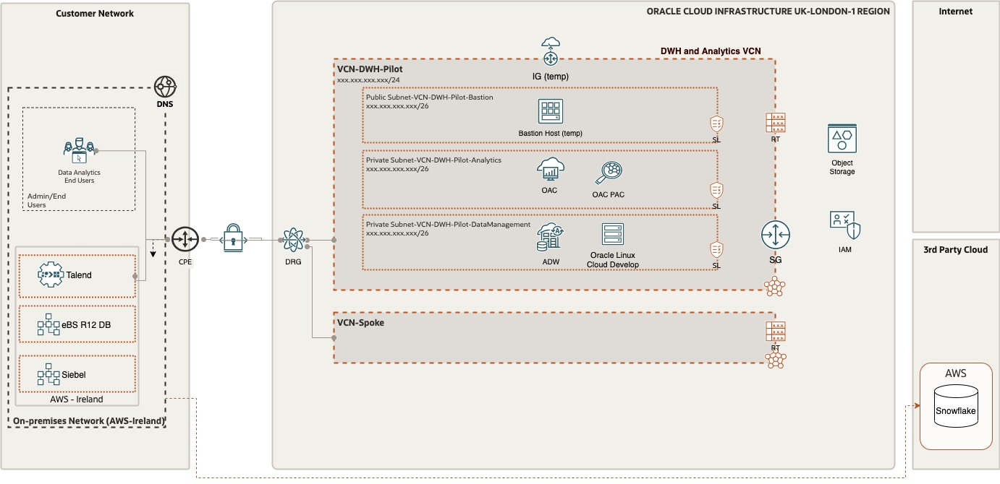
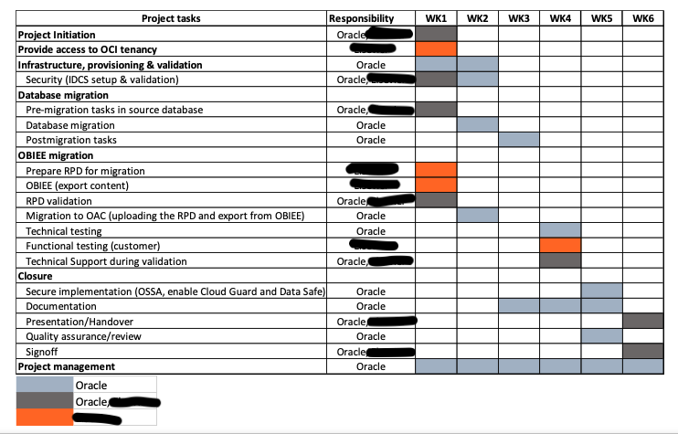
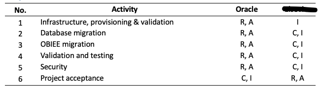

# Document Control

*Guide:*

*The first chapter of the document describes the metadata for the document. Such as versioning and team members.*

## Version Control

*Guide:*

*A section describing the versions of this document and its changes.*

*Example:*

| Version | Authors      | Date             | Comments                              |
|:--------|:-------------|:-----------------|:--------------------------------------|
| 0.1     | Name Surname | 01 February 2023 | Initial version based on old template |
| 0.2     | Name Surname | 20 July 2023     | New Solution Definition template      |

## Team

*Guide:*

*A section describing the Oracle team.*

*Example:*

| Name         | Email                | Role                     | Company |
|:-------------|:---------------------|:-------------------------|:--------|
| Name Surname | example@example.com  | Tech Solution Specialist | Oracle  |
| second Name  | example2@example.com | Template reviewer        | Oracle  |

## Abbreviations and Acronyms (Optional)

*Guide:*

*If needed, maintain a list of:*

-   *Abbreviation: a shortened form of a word or phrase.*
-   *Acronyms: an abbreviation formed from the initial letters of other words and pronounced as a word (e.g. ASCII, NASA ).*

*Example:*

| Term  | Meaning                                         |
|:------|:------------------------------------------------|
| ADW   | Autonomous Data Warehouse                       |
| CIDR  | Classless Inter-Domain Routing                  |
| DNS   | Domain Name System                              |
| DRG   | Dynamic Routing Gateway                         |
| ETL   | Extract Transform Load                          |
| IAM   | Identity and Access Management                  |
| IGW   | Internet Gateway                                |
| LFS   | Liberty Financial Services                      |
| NSG   | Network Security Groups                         |
| OAC   | Oracle Analytics Cloud                          |
| OBIA  | Oracle Business Intelligence Applications       |
| OBIEE | Oracle Business Intelligence Enterprise Edition |
| OCPU  | Oracle Compute Unit                             |
| ODI   | Oracle Data Integrator                          |
| OSN   | Oracle Service Network                          |
| PVO   | Public View Object                              |
| SGW   | Service Gateway                                 |
| VCN   | Virtual Cloud Network                           |
| VNIC  | Virtual Network Interface Card                  |

## Document Purpose

*Guide:*

*Describe the purpose of this document and the Oracle-specific terminology, specifically around 'Workload'.*

*Example:*

This document provides a high-level solution definition for the Oracle solution and aims at describing the current state, to-be state as well as a potential '\<Service Provider\>' project scope and timeline. The \<Service Provider\> parts will be described as a physical implementable solution. The intended purpose is to provide all parties involved with a clear and well-defined insight into the scope of work and intention of the project as it will be done as part of the Oracle \<Service Provider\> service.

The document may refer to a 'Workload', which summarizes the full technical solution for a customer (You) during a single engagement. The Workload is described in chapter [Workload Requirements and Architecture](#workload-requirements-and-architecture). In some cases Oracle offers an implementation service called '\<Service Provider\>', which has its dedicated scope and is typically a subset of the initial Workload. The \<Service Provider\> project, architecture, and implementation details are documented in chapter Oracle \<Service Provider\> Project and Architecture and in chapter Oracle \<Service Provider\> Implementation.

This is a living document, additional sections will be added as the engagement progresses resulting in a final Workload Architecture Document to be handed over at the end of the engagement. Where Oracle \<Service Provider\> is involved, detailed design sections will be added after customer acceptance of the content of the Workload Architecture Document as it stands at the time acceptance is requested.

# Business Context

(Customer A) is a company that \_\_\_\_\_\_\_\_\_\_\_\_\_\_\_\_\_\_\_\_\_\_\_\_\_\_\_\_\_\_\_\_\_\_\_\_\_\_\_\_\_\_\_\_\_\_\_\_\_\_\_\_\_\_\_\_\_\_. (Customer A) initially explored the options to migrate their long-running BI Applications solution to a modern platform which triggered the possibility to migrate their OBIEE solution and related Data Warehouse Database to Oracle Analytics Cloud and Autonomous Data Warehouse. Taking that step modernizes these components significantly and will reduce overhead activities due to the Platform as a Service nature of the solutions. In this first phase, the customer will run a pilot with a production-like volume of data to determine how well this solution fits their need and solves the currently existing performance issues going forward.

This pilot will facilitate some decision-making that is planned for DATE. The customer has defined the following pilot success criteria. The implementation project success criteria are a subset of those criteria.

| Description                                                                                                                                                                         | Success criteria                                                                                                                                                  | Owner | Notes |
|-------------------------------------------------------------------------------------------------------------------------------------------------------------------------------------|-------------------------------------------------------------------------------------------------------------------------------------------------------------------|-------|-------|
| Migration of OBIEE 11.1.1.9 to Oracle Analytics cloud                                                                                                                               | The secure migration of our RPD and reports from OBIEE to OAC                                                                                                     |       |       |
| Oracle database 11g R2 (11.2.0.4.0) to Oracle 19c(cloud)                                                                                                                            | The secure migration of our SDW database to Oracle autonomous ( target version can be ignored. transparent with ADW )19                                           |       |       |
| Network connection established to run Talend loads from (Customer A) network/servers/laptops.                                                                                       | Confirmed network connectivity that can be used by Talend                                                                                                         |       |       |
| Network connection established to run reports from (Customer A) network/servers/laptops.                                                                                            | Confirmed access and usage of OAC within (Customer A) Network and confirmation that OAC equivalent reports of OBIEE can be run                                    |       |       |
| Demonstrate that once on the Oracle Analytics Cloud the solution is performant – it needs to be useable (vs. the current on-premise version where performance is a key driver away) | OBIEE report performance preferably improved by 30%. List of reports that will be tested https://(Customer A).atlassian.net/l/c/H1xAvV1U with current load times. |       |       |

After Discussion with (Customer A) and the implementation team, the pilot priorities for xxxxxxx milestone, are:

1.  Migrate database data into OCI ADW without validation of data.
2.  Migrate OBIEE metadata to OAC, set connections to ADW to be ready to test 1 report
3.  Have connection in Talend set to ADW as Target and run some test load

## Executive Summary

*Guide:*

*A section describing the Oracle differentiator and key values of the solution of our solution for the customer, allowing the customer to make decisions quickly.*

## Workload Business Value

This implementation project will give the Customer a kickstart into a new Oracle Analytics world, allowing them to increase their agility and gain deeper insights to make data-driven decisions. The project will deliver a foundation based on the best practices of OCI with a sound basis to extend and expand.

This migration from OBIEE to OAC will bring the customer to a cloud-native supported analytics solution still leveraging their OBIEE investment with minimal effort and get the advantage of the additional visualization functionality that is part of OAC. The migration from a regular 11.2.0.4 database to the Autonomous Data Warehouse (ADW) Database will help (Customer A) to reduce cost and maximize security and flexibility due to the possibility of autoscaling and other build-in features of ADW like self-securing, self-repairing and self-optimizing capabilities of the ADW database.

For (Customer A) 2 other aspects of this migration are important:

1.  Being able to reconnect their xxxxxxx ETL solution to update the content of the database that has been migrated to ADW, with a good performance.
2.  Find a solution to facilitate their xxxxxx reporting, which currently is using a Snowflake data warehouse with a replication of data from the Oracle Database to Snowflake using AWS - Glue. The current replication mechanism is not meeting customers' requirements in terms of replication duration. An Alternative solution may be explored and suggested. A direct connection from Tableau to ADW would remove replication duration and delay completely.

# Workload Requirements and Architecture

## Overview

The workload requirement is to migrate 2 components from the solution which currently are running in AWS to Oracle Cloud Infrastructure (OCI). The component OBIEE 11.1.1.9 migrates to OAC, and Oracle Database 11.2.0.4 migrates to ADW-S. The Database has a size of 11 TB which requires to be migrated through an export-import data pump. For the pilot, some key schemas are being identified and indexes are excluded to reduce the volume being exported. Autoscaling is going to be enabled to accommodate to spikes in the workload of the database.

Once the OBIEE and Database content have been migrated to OCI, (Customer A) wants to test data load runs from their Talend solution from AWS into the OCI ADW database and check the performance. Within OAC, the customer will test report and analytics performance in comparison with their OBIEE solution. Finally, the customer wants to evaluate the synchronization from the ADW database to their Snowflake solution which is running as a SaaS solution. Snowflake is used for Tableau reporting. The Tableau-Snowflake solution has been put in place as an alternative for OBIEE because of some badly performing reports. In Snowflake some data aggregations and preparations are happening for a good-performing Tableau reporting output. For the replication of data from ADW to Snowflake it is important to know that the replication should not have a performance impact on the ADW database.

Data Transfer through Talend is daily incremental. Data synchronization to Snowflake with Glue is done also daily incremental and 1 weekly full refresh.

In the As-Is situation, the customer is using an Active Directory for user provisioning. This is not in the scope of this pilot. Some users will be created manually to run some tests in OAC. For the pilot, some key schemas have been identified and indexes are excluded and the volume of database size being exported is 5TB. The data pump export size is approx 600GB (compressed).

## Non Functional Requirements

| 

(Customer A) wants to use Terraform to deploy infrastructure and environments.\| For OCI users Multi-Factor Authentication needs to be enabled.\| (Customer A) wants to use their encryption keys.\|

### Regulations and Compliances

### Environments

| Name           | Size of Prod | Location    | Scope |
|:---------------|:-------------|:------------|:------|
| Pilot - (Test) | 100%         | uk-london-1 | Yes   |
| Prod           | 100%         | uk-london-1 | No    |
| Dev            | xxx%         | uk-london-1 | No    |

### High Availability and Disaster Recovery Requirement

For the pilot, no additional measures are put in place for resilience and recovery. For OAC the regular functionality of creating snapshots can be used to backup the RPD and Presentation Catalog. For ADW the automatic Backup mechanism is sufficient for the Pilot.

Once the Pilot is concluded and a decision might be taken to move ahead with this solution, the Pilot environment could become the Development environment and other environments like Production and Test can created with additional measures for Resilience and Recovery.

### Security Requirements

For the pilot, some users will be created manually in Oracle IAM Identity Domains to accommodate the OAC report and analytics testing. All services are to be accessed from within the (Customer A) network and no public internet access will be created.

For Data security from within OAC, the initialization blocks and data filters together with the application roles assigned to the users will be used for Data and Object security.

Access to OCI will be enabled with Multi Factor Authentication, assuming that Oracle IAM Identity Domains is available at tenancy creation.

## Future State Architecture

### Mandatory Security Best Practices

*Guide:*

*Use this text for every engagament. Do not change. Aligned with the Cloud Adoption Framework*

The safety of the Customer A's Oracle Cloud Infrastructure (OCI) environment and data is the Customer A’s priority.

To following table of OCI Security Best Practices lists the recommended topics to provide a secure foundation for every OCI implementation. It applies to new and existing tenancies and should be implemented before the Workload defined in this document will be implemented.

Workload related security requirements and settings like tenancy structure, groups, and permissions are defined in the respective chapters.

Any deviations from these recommendations needed for the scope of this document will be documented in chapters below. They must be approved by Customer A.

Customer A is responsible for implementing, managing, and maintaining all listed topics.

<table style="width:25%;">
<colgroup>
<col style="width: 2%" />
<col style="width: 2%" />
<col style="width: 19%" />
</colgroup>
<thead>
<tr class="header">
<th>CATEGORY</th>
<th>TOPIC</th>
<th>DETAILS</th>
</tr>
</thead>
<tbody>
<tr class="odd">
<td>User Management</td>
<td>IAM Default Domain</td>
<td>
Multi-factor Authentication (MFA) should be enabled and enforced for every non-federated OCI user account.

<ul>
<li>For configuration details see <a href="https://docs.oracle.com/en-us/iaas/Content/Identity/mfa/understand-multi-factor-authentication.htm">Managing Multi-Factor Authentication</a>.</li>
</ul>

In addition to enforce MFA for local users, Adaptive Security will be enabled to track the Risk Score of each user of the Default Domain.

<ul>
<li>For configuration details see <a href="https://docs.oracle.com/en-us/iaas/Content/Identity/adaptivesecurity/overview.htm">Managing Adaptive Security and Risk Providers</a>.</li>
</ul></td>
</tr>
<tr class="even">
<td></td>
<td>OCI Emergency Users</td>
<td>
A maximum of <strong>three</strong> non-federated OCI user accounts should be present with the following requirements:

<ul>
<li>Username does not match any username in the Customer’s Enterprise Identity Management System</li>
<li>Are real humans.</li>
<li>Have a recovery email address that differs from the primary email address.</li>
<li>User capabilities has Local Password enabled only.</li>
<li>Has MFA enabled and enforced (see IAM Default Domain).</li>
</ul></td>
</tr>
<tr class="odd">
<td></td>
<td>OCI Administrators</td>
<td>
Daily business OCI Administrators are managed by the Customer’s Enterprise Identity Management System . This system is federated with the IAM Default Domain following these configuration steps:

<ul>
<li>Federation Setup</li>
<li>User Provisioning</li>
<li>For configuration guidance for major Identity Providers see the OCI IAM Identity Domain tutorials.</li>
</ul></td>
</tr>
<tr class="even">
<td></td>
<td>Application Users</td>
<td>Application users like OS users, Database users, or PaaS users are not managed in the IAM Default Domain but either directly or in dedicated identity domains. These identity domains and users are covered in the Workload design. For additional information see <a href="https://docs.oracle.com/en-us/iaas/Content/cloud-adoption-framework/iam-security-structure.htm">Design Guidance for IAM Security Structure</a>.</td>
</tr>
<tr class="odd">
<td>Cloud Posture Management</td>
<td>OCI Cloud Guard</td>
<td>
OCI Cloud Guard will be enabled at the root compartment of the tenancy home region. This way it covers all future extensions, like new regions or new compartments, of your tenancy automatically. It will use the Oracle Managed Detector and Responder recipes at the beginning and can be customized by the Customer to fulfil the Customer’s security requirements.

<ul>
<li>For configuration details see <a href="https://docs.oracle.com/en-us/iaas/cloud-guard/using/part-start.htm">Getting Started with Cloud Guard</a>. Customization of the Cloud Guard Detector and Responder recipes to fit with the Customer’s requirements is highly recommended. This step requires thorough planning and decisions to make.</li>
<li>For configuration details see <a href="https://docs.oracle.com/en-us/iaas/cloud-guard/using/part-customize.htm">Customizing Cloud Guard Configuration</a></li>
</ul></td>
</tr>
<tr class="even">
<td></td>
<td>OCI Vulnerability Scanning Service</td>
<td>
In addition to OCI Cloud Guard, the OCI Vulnerability Scanning Service will be enabled at the root compartment in the home region. This service provides vulnerability scanning of all Compute instances once they are created.

<ul>
<li>For configuration details see <a href="https://docs.oracle.com/en-us/iaas/scanning/home.htm">Vulnerability Scanning</a>.</li>
</ul></td>
</tr>
<tr class="odd">
<td>Monitoring</td>
<td>SIEM Integration</td>
<td>Continuous monitoring of OCI resources is key for maintaining the required security level (see <a href="#regulations-and-compliances-requirements">Regulations and Compliance</a> for specific requirements). See <a href="https://docs.oracle.com/en-us/iaas/Content/cloud-adoption-framework/siem-integration.htm">Design Guidance for SIEM Integration</a> to implement integration with the existing SIEM system.</td>
</tr>
<tr class="even">
<td>Additional Services</td>
<td>Budget Control</td>
<td>
OCI Budget Control provides an easy to use and quick notification on changes of the tenancy’s budget consumption. It will be configured to quickly identify unexpected usage of the tenancy.

<ul>
<li>For configuration details see <a href="https://docs.oracle.com/en-us/iaas/Content/Billing/Tasks/managingbudgets.htm">Managing Budgets</a></li>
</ul></td>
</tr>
</tbody>
</table>

### OCI Secure Landing Zone Architecture

*Guide:*

*This chapter describes landing zone best practices and usually does not require any changes. If changes are required please refer to [landing zone confluence](https://confluence.oraclecorp.com/confluence/x/GZ-VHQE). The full landing zone needs to be described in the Solution Design by the service provider.*

*Use this template ONLY for new cloud deployments and remove for brown field deployments.*

The design considerations for an OCI Cloud Landing Zone have to do with OCI and industry architecture best practices, along with Customer A specific architecture requirements that reflect the Cloud Strategy (hybrid, multi-cloud, etc). An OCI Cloud Landing zone involves a variety of fundamental aspects that have a broad level of sophistication. A good summary of a Cloud Landing Zone has been published in the [OCI User Guide](https://docs.oracle.com/en-us/iaas/Content/cloud-adoption-framework/landing-zone.htm).

#### Naming Convention

A naming convention is an important part of any deployment to ensure consistency as well as security within your tenancy. Hence we jointly agree on a naming convention, matching Oracle's best practices and Customer A requirements.

Please find the agreed naming convention in the chapter [Resource Naming Convention](#resource-naming-convention).

#### Security and Identity Management

This chapter covers the Security and Identity Management definitions and resources which will be implemented for Customer A.

##### Universal Security and Identity and Access Management Principles

-   Groups will be configured at the tenancy level and access will be governed by policies configured in OCI.
-   Any new project deployment in OCI will start with the creation of a new compartment. Compartments follow a hierarchy, and the compartment structure will be decided as per the application requirements.
-   It is also proposed to keep any shared resources, such as Object Storage, Networks etc. in a shared services compartment. This will allow the various resources in different compartments to access and use the resources deployed in the shared services compartment and user access can be controlled by policies related to specific resource types and user roles.
-   Policies will be configured in OCI to maintain the level of access / control that should exist between resources in different compartments. These will also control user access to the various resources deployed in the tenancy.
-   The tenancy will include a pre-provisioned Identity Cloud Service (IDCS) instance (the primary IDCS instance) or, where applicable, the Default Identity Domain. Both provide access management across all Oracle cloud services for IaaS, PaaS and SaaS cloud offerings.
-   The primary IDCS or the Default Identity Domain will be used as the access management system for all users administrating (OCI Administrators) the OCI tenant.

##### Authentication and Authorization for OCI

Provisioning of respective OCI administration users will be handled by Customer A.

###### User Management

Only OCI Administrators are granted access to the OCI Infrastructure. As a good practice, these users are managed within the pre-provisioned and pre-integrated Oracle Identity Cloud Service (primary IDCS) or, where applicable, the OCI Default Identity Domain, of OCI tenancy. These users are members of groups. IDCS Groups can be mapped to OCI groups while Identity Domains groups do not require any mapping. Each mapped group membership will be considered during login.

**Local Users**

The usage of OCI Local Users is not recommended for the majority of users and is restricted to a few users only. These users include the initial OCI Administrator created during the tenancy setup, and additional emergency administrators.

**Local Users are considered as Emergency Administrators and should not be used for daily administration activities!**

**No additional users are to be, nor should be, configured as local users.**

**Customer A is responsible to manage and maintain local users for emergency use cases.**

**Federated Users**

Unlike Local Users, Federated Users are managed in the Federated or Enterprise User Management system. In the OCI User list Federated Users may be distinguished by a prefix which consists of the name of the federated service in lower case, a '/' character followed by the user name of the federated user, for example:

`oracleidentityservicecloud/user@example.com`

In order to provide the same attributes (OCI API Keys, Auth Tokens, Customer Secret Keys, OAuth 2.0 Client Credentials, and SMTP Credentials) for Local and *Federated Users* federation with third-party Identity Providers should only be done in the pre-configured primary IDCS or the Default Identity Domain where applicable.

All users have the same OCI-specific attributes (OCI API Keys, Auth Tokens, Customer Secret Keys, OAuth 2.0 Client Credentials, and SMTP Credentials).

OCI Administration user should only be configured in the pre-configured primary IDCS or the Default Identity Domain where applicable.

**Note:** Any federated user can be a member of 100 groups only. The OCI Console limits the number of groups in a SAML assertion to 100 groups. User Management in the Enterprise Identity Management system will be handled by Customer A.

**Authorization**

In general, policies hold permissions granted to groups. Policy and Group naming follows the Resource Naming Conventions.

**Tenant Level Authorization**

The policies and groups defined at the tenant level will provide access to administrators and authorized users, to manage or view resources across the entire tenancy. Tenant level authorization will be granted to tenant administrators only.

These policies follow the recommendations of the [CIS Oracle Cloud Infrastructure Foundations Benchmark v1.2.0, recommendations 1.1, 1.2, 1.3](https://www.cisecurity.org/cis-benchmarks).

**Service Policy**

A Service Policy is used to enable services at the tenancy level. It is not assigned to any group.

**Shared Compartment Authorization**

Compartment level authorization for the cmp-shared compartment structure uses the following specific policies and groups.

Apart from tenant level authorization, authorization for the cmp-shared compartment provides specific policies and groups. In general, policies will be designed that lower-level compartments are not able to modify resources of higher-level compartments.

Policies for the cmp-shared compartment follow the recommendations of the [CIS Oracle Cloud Infrastructure Foundations Benchmark v1.2.0, recommendations 1.1, 1.2, 1.3](https://www.cisecurity.org/cis-benchmarks).

**Compartment Level Authorization**

Apart from tenant level authorization, compartment level authorization provides compartment structure specific policies and groups. In general, policies will be designed that lower-level compartments are not able to modify resources of higher-level compartments.

**Authentication and Authorization for Applications and Databases**

Application (including Compute Instances) and Database User management is completely separate of and done outside of the primary IDCS or Default Identity Domain. The management of these users is the sole responsibility of Customer A using the application, compute instance and database specific authorization.

##### Security Posture Management

**Oracle Cloud Guard**

Oracle Cloud Guard Service will be enabled using the pcy-service policy and with the following default configuration. Customization of the Detector and Responder Recipes will result in clones of the default (Oracle Managed) recipes.

Cloud Guard default configuration provides a number of good settings. It is expected that these settings may not match with Customer A's requirements.

**Targets**

In accordance with the [CIS Oracle Cloud Infrastructure Foundations Benchmark, v1.2.0, Chapter 3.15](https://www.cisecurity.org/cis-benchmarks), Cloud Guard will be enabled in the root compartment.

**Detectors**

The Oracle Default Configuration Detector Recipes and Oracle Default Activity Detector Recipes are implemented. To better meet the requirements, the default detectors must be cloned and configured by Customer A.

**Responder Rules**

The default Cloud Guard Responders will be implemented. To better meet the requirements, the default detectors must be cloned and configured by Customer A.

**Vulnerability Scanning Service**

In accordance with the [CIS Oracle Cloud Infrastructure Foundations Benchmark, v1.2.0, OCI Vulnerability Scanning](https://www.cisecurity.org/cis-benchmarks) will be enabled using the pcy-service policy.

Compute instances which should be scanned *must* implement the *Oracle Cloud Agent* and enable the *Vulnerability Scanning plugin*.

**OCI OS Management Service**

Required policy statements for OCI OS Management Service are included in the pcy-service policy.

By default, the *OS Management Service Agent plugin* of the *Oracle Cloud Agent* is enabled and running on current Oracle Linux 6, 7, 8 and 9 platform images.

##### Monitoring, Auditing and Logging

In accordance with the [CIS Oracle Cloud Infrastructure Foundations Benchmark, v1.2.0, Chapter 3 Logging and Monitoring](https://www.cisecurity.org/cis-benchmarks) the following configurations will be made:

-   OCI Audit log retention period set to 365 days.
-   At least one notification topic and subscription to receive monitoring alerts.
-   Notification for Identity Provider changes.
-   Notification for IdP group mapping changes.
-   Notification for IAM policy changes.
-   Notification for IAM group changes.
-   Notification for user changes.
-   Notification for VCN changes.
-   Notification for changes to route tables.
-   Notification for security list changes.
-   Notification for network security group changes.
-   Notification for changes to network gateways.
-   VCN flow logging for all subnets.
-   Write level logging for all Object Storage Buckets.
-   Notification for Cloud Guard detected problems.
-   Notification for Cloud Guard remedied problems.

For IDCS or OCI Identity Domain Auditing events, the respective Auditing API can be used to retrieve all required information.

##### Data Encryption

All data will be encrypted at rest and in transit. Encryption keys can be managed by Oracle or the customer and will be implemented for identified resources.

###### Key Management

All keys for **OCI Block Volume**, **OCI Container Engine for Kubernetes**, **OCI Database**, **OCI File Storage**, **OCI Object Storage**, and **OCI Streaming** are centrally managed in a shared or a private virtual vault will be implemented and placed in the compartment cmp-security.

**Object Storage Security**

For Object Storage security the following guidelines are considered.

-   **Access to Buckets** -- Assign least privileged access for IAM users and groups to resource types in the object-family (Object Storage Buckets & Object)
-   **Encryption at rest** -- All data in the Object Storage is encrypted at rest using AES-256 and is on by default. This cannot be turned off and objects are encrypted with a master encryption key.

**Data Residency**

It is expected that data will be held in the respective region and additional steps will be taken when exporting the data to other regions to comply with the applicable laws and regulations. This should be review for every project onboard into the tenancy.

##### Operational Security

**Security Zones**

Whenever possible OCI Security Zones will be used to implement a security compartment for Compute instances or Database resources. For more information on Security Zones refer to the in the *Oracle Cloud Infrastructure User Guide* chapter on [Security Zones](https://docs.oracle.com/en-us/iaas/security-zone/using/security-zones.htm).

**Remote Access to Compute Instances or Private Database Endpoints**

To allow remote access to Compute Instances or Private Database Endpoints, the OCI Bastion will be implemented for defined compartments.

To be able to use OCI services to for OS management, Vulnerability Scanning, Bastion Service, etc. it is highly recommended to implement the Oracle Cloud Agent as documented in the *Oracle Cloud Infrastructure User Guide* chapter [Managing Plugins with Oracle Cloud Agent](https://docs.oracle.com/en-us/iaas/Content/Compute/Tasks/manage-plugins.htm).

##### Network Time Protocol Configuration for Compute Instance

Synchronized clocks are a necessity for securely operating environments. OCI provides a Network Time Protocol (NTP) server using the OCI global IP number 169.254.169.254. All compute instances should be configured to use this NTP service.

##### Regulations and Compliance

Customer A is responsible for setting the access rules to services and environments that require stakeholders’ integration to the tenancy to comply with all applicable regulations. Oracle will support in accomplishing this task.

### Logical Architecture

The architecture focuses on the following logical divisions:

-   **Data refinery** Ingests and refines the data for use in each of the data layers in the architecture. The shape is intended to illustrate the differences in processing costs for storing and refining data at each level and for moving data between them.

-   **Data persistence platform** Facilitates access and navigation of the data to show the current business view. For relational technologies, data may be logical or physically structured in simple relational, longitudinal, dimensional or OLAP forms. For non-relational data, this layer contains one or more pools of data, either output from an analytical process or data optimized for a specific analytical task.

-   **Access and interpretation** Abstracts the logical business view of the data for the consumers. This abstraction facilitates agile approaches to development, migration to the target architecture, and the provision of a single reporting layer from multiple federated sources.

The architecture has the following components:

-   **Data integration** (Customer A) is using Talend as their ETL and orchestration solution for ETL jobs. For this architecture, the idea is that when (Customer A) AWS network is connected to Oracle OCI through VPN IP-Sec tunnel, (Customer A) will reconnect from the AWS database to the ADW database.

-   **Autonomous data warehouse** Oracle Autonomous Data Warehouse is a fully managed, preconfigured database environment. You do not need to configure or manage any hardware or install any software. After provisioning, you can scale the number of CPU cores or the storage capacity of the database at any time without impacting availability or performance.

-   **Object Storage** Oracle Cloud Infrastructure Object Storage is an internet-scale, high-performance storage platform that offers reliable and cost-efficient data durability. Oracle Cloud Infrastructure Object Storage can store an unlimited amount of unstructured data of any content type, including analytic data. You can safely and securely store or retrieve data directly from the internet or from within the cloud platform. Multiple management interfaces let you easily start small and scale seamlessly, without experiencing any degradation in performance or service reliability.

-   **Analytics** Oracle Analytics Cloud is a scalable and secure cloud service that provides a full set of capabilities to explore and perform collaborative analytics for you, your workgroup, and your enterprise. With Oracle Analytics Cloud you also get flexible service management capabilities, including fast setup, easy scaling and patching, and automated lifecycle management.

-   **Tableau/Snowflake** Snowflake is in a SaaS mode and data is loaded and Transformed from the Oracle DB through AWS - Glue. Loads are done on a daily frequency but with a delay of one day due to the order of loading and dependency of the Talend load. The AWS - Glue needs reconnection to the ADW database to re-establish those loads. Tableau is connected to Snowflake to run reports and analyses. In the Architecture also direct connections from Tableau to ADW have been created as it will be worth investigating how well Tableau works with ADW. It would prevent another transfer of data. In that case, some transformations currently done in AWS - Glue may have to be rebuilt in ADW. Options to do such transformations within ADW are OCI Data Integrator, but this requires some further exploration based on analysis of what type of transformations are being done.

### Physical Future State Architecture

### Deployment Architecture

## Solution Considerations

### Security

The proposed solution consists of OAC in OCI which is fully managed by Oracle. The authentication and authorization of users is done by Oracle IAM Identity Domains. Protecting the communication between the on-premises and cloud services over the Internet is achieved by leveraging a VPN IP-Sec connection.

OAC and ADW instances are placed into private subnets which can't be accessed over the Internet. The users can access OAC via the corporate network, the VPN IP-Sec connection will be leveraged for that.

The OCI Bastion host will allow temporary access by the development team during the project. Only during the implementation phase, the OCI Bastion host will be used by the Oracle Implementation team to access the ADW and OAC instances. The Bastion Host allows the implementation team to access ADW and OAC via the internet with an SSH tunnel.

Once the Implementation team has finished their work the Bastion host can be deactivated or removed.

### Identity and Access Management

To facilitate the identity and access management the solution will make use of the standard Oracle OCI Identity and Access Management (IAM) with the IDCS Foundation integration. IDCS will be used to create the users and configure access and roles for OAC. When going forward Identity and Access management can be setup to use an Active Directory.

### Resilience & Recovery Requirements

**ADW Backups** By default the Automatic Backup feature for the Autonomous Data Warehouse is enabled. The service creates the following on an ongoing basis: One weekly level 0 backup, generally created on a specified weekend day. A level 0 backup is the equivalent of a full backup. A daily level 1 backup, which is an incremental backup created on each day for the six days following the level 0 backup day and an ongoing archived redo log backup (with a minimum frequency of every 60 minutes). The automatic backup process used to create level 0 and level 1 backups can run at any time within the daily backup window (between midnight and 6:00 AM). Automatic incremental backups (level 0 and level 1) are retained in Object Storage for 30 days by default. Level 0 and level 1 backups are stored in Object Storage and have an assigned OCID.

**Autonomous Dataguard** In addition to the automatic backup and manual backups that can be created from the Autonomous Data Warehouse database it is possible to enable Autonomous Data Guard. When you enable Autonomous Data Guard the system creates a standby database that is continuously updated with the changes from the primary database. You can enable Autonomous Data Guard with a standby in the current region, a local standby, or with a standby in a different region, a cross-region standby. You can also enable Autonomous Data Guard with both a local standby and a cross-region standby.

**OAC Snapshots** will be used to perform full and partial backups of the OAC content. The data can be either restored on the same or a different OAC instance. OAC automatically takes a snapshot when changes are made to the data model. Those automatically created snapshots will be used by Oracle for recovery. It keeps up to the 5 most recent snapshots taken in 1-hour intervals at most if you need to revert to an earlier model version. Up to 40 snapshots can be stored. For manual recovery, manual snapshots have to be created.

Please check this [link](https://docs.oracle.com/en/cloud/paas/analytics-cloud/acabi/snapshots.html#GUID-FAE709DE-3370-457C-9015-2E088ACA6181) for more details about OAC Snapshots.

### Hub and Spoke

For this deployment architecture, a Hub and Spoke topology is designed. A hub-and-spoke network, often called a star network, has a central component that's connected to multiple networks around it.

The dynamic routing gateway (DRG) is a virtual router that provides a path for private network traffic between a virtual cloud network (VCN) inside and outside the region, such as a VCN in another Oracle Cloud Infrastructure region, an on-premises network, or a network from another cloud provider.

The DRG connects to multiple VCNs, adding flexibility to how you design your cloud network.

The hub VCN has an internet gateway for network traffic to and from the public internet. It also has a dynamic routing gateway (DRG) to enable private connectivity with your on-premises network, which you can implement by using Oracle Cloud Infrastructure FastConnect, Site-to-Site VPN, or both.

You can use an OCI Bastion service to provide secure access to your resources. This architecture uses Bastion Service.

### VCN and Subnets

For security reasons, the Data Warehouse and Analytics components are positioned in a separate VCN. Spoke VCNs are not accessible from the internet. All components are placed in private subnets. The subnets where OAC, ADW and the Linux developer instance can be configured to be accessible from customers network or accessed through the Bastion Service in the Hub VCN. VCNs require to have CIDR ranges that are not overlapping with other VCNs and are also not overlapping with IP ranges used in Customer A network.

### Network Firewall

Optionally a managed Network Firewall can be leveraged to increase the security posture of the workload.

OCI Network Firewall is a next-generation managed network firewall and intrusion detection and prevention service for VCNs, powered by Palo Alto Networks®. The Network Firewall service offers simple setup and deployment and gives visibility into traffic entering the cloud environment (North-south network traffic) as well traffic between subnets (East-west network traffic).

Use network firewall and its advanced features together with other Oracle Cloud Infrastructure security services to create a layered network security solution.

A network firewall is a highly available and scalable instance that you create in the subnet of your choice. The firewall applies business logic to traffic that is specified in an attached firewall policy. Routing in the VCN is used to direct network traffic to and from the firewall.

Above a simple example is presented where a Network Firewall is deployed in a DMZ subnet and for which all incoming traffic via the DRG as well as all the outgoing traffic from the private subnet is routed to the Network Firewall so that policies are enforced to secure traffic.

## Sizing and Bill of Materials

| Environment | Component                                       | Quantity                                                                                                                          | Metric    |
|-------------|-------------------------------------------------|-----------------------------------------------------------------------------------------------------------------------------------|-----------|
| Pilot       | OAC Enterprise Edition                          | 6                                                                                                                                 | OCPU      |
| Pilot       | ADW-S                                           | 2 (Autoscaling enabled) For the Database migration activities the initial scale to be set at 6 OCPU. Later for BAU set size to 2. | OCPU      |
| Pilot       | Object Storage                                  | 12                                                                                                                                | Terrabyte |
| Pilot       | Compute Cloud - Oracle Free Linux Cloud Develop | 1                                                                                                                                 | OCPU      |
| Pilot       | Compute Cloud for Bastion Host                  | 1                                                                                                                                 | OCPU      |
| Pilot       | Exadata Storage                                 | 10                                                                                                                                | Terrabyte |
| Pilot       | Block Volume                                    | 500                                                                                                                               | Gb        |

### Network Firewall BoM

| Environment | Description                 | Metric            | Size | Monthly Cost | Annual Cost | Hours p/m |
|-------------|-----------------------------|-------------------|------|--------------|-------------|-----------|
| Prod        | Network Firewall (optional) | Instance per Hour | 1    |              |             | 744       |

| Part Number | Component                                               | Unit of Measure   | Units |
|:------------|:--------------------------------------------------------|:------------------|------:|
| B95403      | Oracle Cloud Infrastructure - Network Firewall Instance | Instance per Hour |   744 |

Further details can be found [here](https://docs.oracle.com/en-us/iaas/Content/network-firewall/overview.htm)

# Project Implementation (Only for Oracle Implementations!)

## Solution Scope

-   OBIEE 11.1.1.9 will be migrated to OAC (in a private subnet). All data will be migrated, but testing will be done on a limited number of reports.
-   Oracle Database will be migrated to ADW
-   For the connection between Analytics and ADW, Oracle will offer support in case there are any questions, but the connection will be the customer's responsibility.

### Disclaimer

*Guide:*

*A scope disclaimer should limit scope changes and create awareness that a change of scope needs to be agreed upon by both parties.*

*Example:*

As part of the Oracle \<Service Provider\> Project, any scope needs to be agreed upon by both the customer and Oracle. A scope can change but must be confirmed again by both parties. Oracle can reject scope changes for any reason and may only design and implement a previously agreed scope. A change of scope can change any agreed times or deadlines and needs to be technically feasible.

All items not explicitly stated to be within the scope of the \<Service Provider\> project will be considered out of scope. Oracle recommends the use of professional services to implement extensions or customizations beyond the original scope, as well as to operate the solution, with an Oracle-certified partner.

### Overview

-   OBIEE 11.1.1.9 will be migrated to OAC (in a private subnet). All data will be migrated, but testing will be done on a limited number of reports.
-   Oracle Database will be migrated to ADW
-   Informatica PowerCenter will be migrated to Informatica IDMC (IDMC)
-   Solution for DAC to be defined and not in the scope of this solution pack

### Business Value

### Success Criteria

The below-listed success criteria are for implementation only. Partner activities and success criteria are not listed in this documentation.

-   Provision of all OCI resources required for this Pilot
-   Establish all required network connectivity
-   Successfully pass the OBIEE/OAC and Talend test cases as mentioned in the following documents shared by (Customer A) (Document name)
-   The customer will have a functional OAC environment with the existing reports built by them in OBIEE
-   On-premises Oracle database migrated to the OCI environment
-   Finished handover with documentation
-   Complete the Implementation Security Checklist

## Workplan

### Deliverables

A Workload Architecture Document (WAD) which includes:

-   Solution Definition
-   Solution Design
-   An OCI environment with an OAC instance (including the OBIEE migrated content) and ADW instance with the agreed migrated data
-   Handover Documentation

### Included Activities

#### Oracle Autonomous Database

-   Pre-migration tasks in the source database:
    -   Support to copy Datapump files to OCI Object Storage which will be done by the customer.
    -   Configure Working Migration Development (Developer cloud service, oracle client, OCI CLI, etc.)
    -   Provision of Autonomous Data Warehouse in the OCI tenant.
    -   Create cloud credentials and test access bucket
-   Support S3 Bucket Replication to OCI Object Storage
-   Database Migration using Oracle Datapump.
-   Postmigration tasks:
    -   Fix warning detected in the migration to ADW.
    -   Support Connections ETL and Analytics tools
    -   Support Predefined ADB services

#### Oracle Analytics Cloud

-   Provisioning of the OAC instance
-   establishing the connectivity between ADW and OAC (Private Access Channel will be used)
-   migration of the existing reports and dashboards
-   testing for a limited number of reports (up to 10 reports)

#### Documentation

Oracle will provide an implementation document at the end of the project.

#### Additional supporting documentation

The migration to OAC will be done using a JAR file as suggested in Oracle's official documentation (https://docs.oracle.com/en/cloud/paas/analytics-cloud/acmgb/migrate-oracle-bi-enterprise-edition.html#GUID-AB5F5552-82F0-4664-822B-F99F1EF7917E). The customer will use the migration utility to export the content to a JAR file.

#### Security

Configuration of groups and users will be done by following the documentation under (https://www.ateam-oracle.com/implementing-object-and-data-level-security-in-oracle-analytics-cloud-using-identity-cloud). To assign user responsibilities to OAC user sessions via initialization blocks in **Oracle Analytics Client Tools** (https://www.oracle.com/middleware/technologies/oac-tools-downloads.html) is used. Session initialization blocks will execute each time a user logs into OAC.

### Recommended Activities

This workload is designed to assist the customer to rapidly start utilizing Oracle Cloud Infrastructure and allow them to explore the benefits of the solution to them for further rollout. Once the implementation team finishes the work, the customer can leverage the knowledge acquired from this project to create additional environments themselves or with the help of Oracle Consulting and/or a partner.

The following components and activities are out of scope:

-   Provisioning and configuration of a second instance (only a NONPROD instance will be provisioned).
-   Any third-party or Customer on-premises integration.
-   Third-party products, Backup tools, Firewall implementation, Security tools, monitoring tools implementation.
-   Load Testing, Performance benchmarking testing, Functional/code change & tuning of any component in the solution.
-   Any Vulnerability Assessment and Penetration Testing.
-   Training on deployed products and cloud services.
-   Any other activity not listed under the “In-Scope” section.
-   Migration Apex workspaces in case of use.
-   There are some changes in ADB that could affect the applications due to the restrictions imposed by the Autonomous Database that could require application modifications to adapt to ADB. These application modifications to adapt to ADB are out of the scope of Database migration. Changes detected that could affect applications:
    -   There are database links. Database links don't be migrated. Autonomous Database Shared Infrastructure doesn't allow a database link to a source that is not configured with TCPS. Database Links need to be created manually in ADB using DBMS_CLOUD_ADMIN.CREATE_DATABASE_LINK.
    -   There are external tables. Applications relying on user-created external tables will not function as expected.
    -   There are directories objects in the source database.
    -   There are references to packages that are not supported or only partially supported in OWF_MGR, SDW_SUPER_USER, WH_OWNER schemas. (UTL_HTTP, UTL_SMTP and UTL_TCP).
    -   The source database character set is WE8MSWIN1252 and a character set conversion to AL32UTF8 is required to migrate to ADW. Possible loss of data in rows that exceeds the maximum size of a column or any other issue due to the character set conversion will be ignored during the Database migration.

### Timeline

This high-level project timeline shows a representative timeline and is intended for planning purposes only.

As per agreement during the WAD call on 12th of April 2022, we have agreed on the following: On Tuesday 19th of April and Friday 22nd of April 2022 2 checkpoints will be used to determine the Pilot feasibility and continuation, to have valuable input on achievability and indication of performance to take decisions going forward

### Implementation RACI

| 

\|

### Assumptions

All work will be done remotely and within either local time or Indian Standard Time within normal office working hours. The following assumptions have been made about the project, which will impact delivery:

-   OBIEE is on version 11.1.1.9
-   RPD is in a consistent state
-   Usage tracking will not be re-configured
-   The customer will send us the RPD and the export from OBIEE
-   Agents and schedulers will not be tested
-   BI Publisher reports will not be tested
-   No JS and/or CSS customization of the reports
-   No special characters (including spaces) are used in the names of the reports and entities in the catalog
-   Unsupported functionality such as "Act As" is not used
-   Disaster Recovery is not in the scope
-   Reporting performance will remain as found (no performance improvement activities will be carried out)
-   The tenancy is provisioned as new with the availability of Identity and Access Management Identity Domains
-   The customer will have the export data pump prepared and he will copy data pump files to the Oracle Object Storage
-   For the pilot customer accepts to pass warnings and errors when loading the data in the database.

### Obligations

-   You will have purchased the appropriate Universal Credits for the services required for the project.
-   The implementation team will have admin access to the customer's tenancy for implementation.
-   You will ensure the appropriate product training has been obtained to maintain and support the implementation.
-   Your business team will be available for the Testing phase, which will be completed within the agreed testing window.
-   You will provide project management for the project and will manage any third-party suppliers or vendors.
-   Complete the OCI Site-to-Site VPN Request Form as supplied by the Oracle Workload Architect.
-   Complete the OCI Fast Connect Request Form as supplied by the Oracle Workload Architect.
-   Test cases to be defined and provided by the customer
-   The customer to provide necessary encryption keys is required

### Transition Plan

*Guide:*

*The Transition Plan describes the handover of the project, after the implementation. Please ensure the accepting transition party is filled out.*

#### Introduction

Following the deployment of the solution to Oracle Cloud Infrastructure by the \<Service Provider\> team, it is important to ensure a smooth handover to a technical team, or a partner. \<Service Provider\> values the continuation of the cloud journey and we focus our efforts to ensure you start with the best possible foundation, to set you up for success in OCI.

When \<Service Provider\> completes the deliverables as described in the [Workplan](#workplan) section of this document, \<Service Provider\> will hand over the controls of the new OCI environment.

Customer A, or a partner of your choice, will assume the ownership of the OCI tenancy and responsibility for further development of the OCI environment. From that moment forward, having completed the [Solution Scope](#solution-scope), \<Service Provider\> will disengage. For post-implementation support, Oracle provides you with three distinct resources:

1.  Oracle Account Cloud Engineer (ACE) – This is your first point of contact and will provide technical leadership and support for Oracle cloud technologies and your cloud transformation.
2.  Cloud Adoption Manager (CAM) - Introduces and plans operation monitoring and optimization advisory activities, and continues working with you on the next milestones. Please contact your ACE for further information.
3.  [My Oracle Support](https://support.oracle.com/portal/)

#### Transition Acceptance

When \<Service Provider\> completes the deliverables as specified in the [Workplan](#workplan) section of this document, a closure session will be scheduled within 1-2 weeks to recap the project and to hand it over to the accepting party. In the case of this project, the accepting party is Customer A. Customer A is now responsible for the OCI tenancy.

From this moment forward, the Oracle \<Service Provider\> team will fully remove their access from your OCI tenancy and provide the access credentials to the accepting party. This marks the completion of the \<Service Provider\> project. There is no sign-off signature required.

### Risks

-   Talend ETL Load times are dependent on Internet Bandwidth
-   OAC report performance may be due to badly designed RPD/Report and improvement can be limited
-   Ambitious project timelines in combination with Public Holidays.
-   Adjusted to the Database imposed by the Autonomous Database may require modifications to applications making use of ADW
-   If many records drop out due to the migration the purpose of the pilot might become less relevant.

# Annex

## Security Guidelines

### Oracle Security, Identity, and Compliance

Oracle Cloud Infrastructure (OCI) is designed to protect customer workloads with a security-first approach across compute, network, and storage – down to the hardware. It’s complemented by essential security services to provide the required levels of security for your most business-critical workloads.

-   [Security Strategy](https://docs.oracle.com/en-us/iaas/Content/cloud-adoption-framework/security-strategy.htm) – To create a successful security strategy and architecture for your deployments on OCI, it's helpful to understand Oracle's security principles and the OCI security services landscape.
-   The [security pillar capabilities](https://docs.oracle.com/en-us/iaas/Content/cloud-adoption-framework/security.htm#capabilities) pillar capabilities reflect fundamental security principles for architecture, deployment, and maintenance. The best practices in the security pillar help your organization to define a secure cloud architecture, identify and implement the right security controls, and monitor and prevent issues such as configuration drift.

#### References

-   The Best Practices Framework for OCI provides architectural guidance about how to build OCI services in a secure fashion, based on recommendations in the [Best practices framework for Oracle Cloud Infrastructure](https://docs.oracle.com/en/solutions/oci-best-practices).
-   Learn more about [Oracle Cloud Security Practices](https://www.oracle.com/corporate/security-practices/cloud/).
-   For detailed information about security responsibilities in Oracle Cloud Infrastructure, see the [Oracle Cloud Infrastructure Security Guide](https://docs.oracle.com/iaas/Content/Security/Concepts/security_guide.htm).

### Compliance and Regulations

Cloud computing is fundamentally different from traditionally on-premises computing. In the traditional model, organizations are typically in full control of their technology infrastructure located on-premises (e.g., physical control of the hardware, and full control over the technology stack in production). In the cloud, organizations leverage resources and practices that are under the control of the cloud service provider, while still retaining some control and responsibility over other components of their IT solution. As a result, managing security and privacy in the cloud is often a shared responsibility between the cloud customer and the cloud service provider. The distribution of responsibilities between the cloud service provider and customer also varies based on the nature of the cloud service (IaaS, PaaS, SaaS).

## Additional Resources

-   [Oracle Cloud Compliance](https://www.oracle.com/corporate/cloud-compliance/) – Oracle is committed to helping customers operate globally in a fast-changing business environment and address the challenges of an ever more complex regulatory environment. This site is a primary reference for customers on Shared Management Model with Attestations and Advisories.
-   [Oracle Security Practices](https://www.oracle.com/corporate/security-practices/) – Oracle’s security practices are multidimensional, encompassing how the company develops and manages enterprise systems, and cloud and on-premises products and services.
-   [Oracle Cloud Security Practices](https://www.oracle.com/corporate/security-practices/cloud/) documents.
-   [Contract Documents](https://www.oracle.com/contracts/cloud-services/#online) for Oracle Cloud Services.
-   [OCI Shared Security Model](https://docs.oracle.com/en-us/iaas/Content/cloud-adoption-framework/security.htm#shared-security-model)
-   [OCI Cloud Adoption Framework Security Strategy](https://docs.oracle.com/en-us/iaas/Content/cloud-adoption-framework/security-strategy.htm)
-   [OCI Security Guide](https://docs.oracle.com/en-us/iaas/Content/Security/Concepts/security_guide.htm)
-   [OCI Cloud Adoption Framework Security chapter](https://docs.oracle.com/en-us/iaas/Content/cloud-adoption-framework/security.htm)
