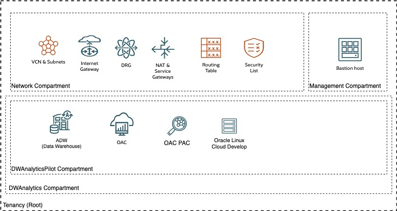
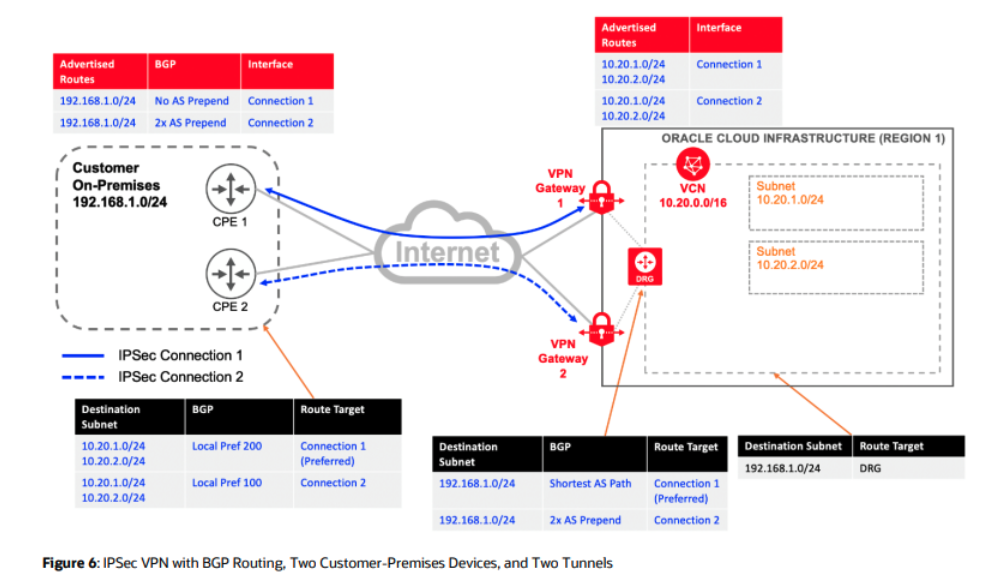

# Document Control

*Guide:*

*The first chapter of the document describes the metadata for the document. Such as versioning and team members.*

## Version Control

*Guide:*

*A section describing the versions of this document and its changes.*

*Example:*

| Version | Authors      | Date             | Comments                     |
|:--------|:-------------|:-----------------|:-----------------------------|
| 0.1     | Name Surname | 01 February 2023 | WAD content in WAD           |
| 0.2     | Name Surname | 20 July 2023     | New Solution Design template |

## Team

*Guide:*

*A section describing the Oracle team.*

*Example:*

| Name         | Email                | Role                     | Company |
|:-------------|:---------------------|:-------------------------|:--------|
| Name Surname | example@example.com  | Tech Solution Specialist | Oracle  |
| Second Name  | axample2@example.com | Template reviewer        | Oracle  |

## Abbreviations and Acronyms (Optional)

*Guide:*

*If needed, maintain a list of:*

-   *Abbreviation: a shortened form of a word or phrase.*
-   *Acronyms: an abbreviation formed from the initial letters of other words and pronounced as a word (e.g. ASCII, NASA ).*

*Example:*

| Term  | Meaning                                         |
|:------|:------------------------------------------------|
| ADW   | Autonomous Data Warehouse                       |
| CIDR  | Classless Inter-Domain Routing                  |
| DNS   | Domain Name System                              |
| DRG   | Dynamic Routing Gateway                         |
| ETL   | Extract Transform Load                          |
| IAM   | Identity and Access Management                  |
| IGW   | Internet Gateway                                |
| LFS   | Liberty Financial Services                      |
| NSG   | Network Security Groups                         |
| OAC   | Oracle Analytics Cloud                          |
| OBIA  | Oracle Business Intelligence Applications       |
| OBIEE | Oracle Business Intelligence Enterprise Edition |
| OCPU  | Oracle Compute Unit                             |
| ODI   | Oracle Data Integrator                          |
| OSN   | Oracle Service Network                          |
| PVO   | Public View Object                              |
| SGW   | Service Gateway                                 |
| VCN   | Virtual Cloud Network                           |
| VNIC  | Virtual Network Interface Card                  |

## Document Purpose

*Guide:*

*Describe the purpose of this document and the Oracle-specific terminology, specifically around 'Workload'.*

*Example:*

This document provides a high-level solution definition for the Oracle solution and aims at describing the current state, to-be state as well as a potential '\<Service Provider\>' project scope and timeline. The \<Service Provider\> parts will be described as a physical implementable solution. The intended purpose is to provide all parties involved with a clear and well-defined insight into the scope of work and intention of the project as it will be done as part of the Oracle \<Service Provider\> service.

The document may refer to a 'Workload', which summarizes the full technical solution for a customer (You) during a single engagement. The Workload is described in chapter [Workload Requirements and Architecture](#workload-requirements-and-architecture). In some cases Oracle offers an implementation service called '\<Service Provider\>', which has its dedicated scope and is typically a subset of the initial Workload. The \<Service Provider\> project, architecture, and implementation details are documented in chapter Oracle \<Service Provider\> Project and Architecture and in chapter Oracle \<Service Provider\> Implementation.

This is a living document, additional sections will be added as the engagement progresses resulting in a final Workload Architecture Document to be handed over at the end of the engagement. Where Oracle \<Service Provider\> is involved, detailed design sections will be added after customer acceptance of the content of the Workload Architecture Document as it stands at the time acceptance is requested.

# Oracle \<Service Provider\> Implementation

## Deployment Build




VPN deployment **(IP Address and names are examples)**



```{=tex}
\newpage
```
## Deployment Build

### Customer / OCI Network (Optional)

#### Customer Premise Equipment

| Name      | Compartment | Customer Router IP | Vendor and Version |     |
|-----------|-------------|--------------------|--------------------|-----|
| Cpe-dwh-1 | Network     | xxx.xxx.xxx.xxx    | Palo Alto          |     |
| Cpe-dwh-2 | Network     | xxx.xxx.xxx.xxx    | Palo Alto          |     |
| ``{=html} |             |                    |                    |     |

#### IPSec Connections

| Name      | Compartment | DRG   | CPE | CPE IKE dentifier |     |     |
|-----------|-------------|-------|-----|-------------------|-----|-----|
| Vpn-dwh-1 | Network     | DRG-1 |     |                   |     |     |
| Vpn-dwh-2 | Network     | DRG-1 |     |                   |     |     |
| ``{=html} |             |       |     |                   |     |     |

#### Tunnels

| Name      | Oracle VPN IP | Routing Type | Oracle Cloud CIDRs | On-Premise CIDRs |     |
|-----------|---------------|--------------|--------------------|------------------|-----|
| ``{=html} |               |              |                    |                  |     |

#### FastConnect (Optional)

*Example:*

Details of the customer's FastConnect On-Premise to OCI network connection are detailed in the document "CUSTOMERNAME_OCI *Fast Connect_Request Form_v1.0*.xlsx"

## Project Plan (Optional)

*Guide:*

*The final 'alive' project plan which gets maintained throughout the complete implementation. Do not replicate a project plan in this document, it is a separate document which is only mentioned here. Link to a shared repository, such as customer Confluence Spaces, OraSites or possible slack channels. Alternatively a Project Plans and updates can be shared via emails.*

*Include Customer Responsibilities from previous chapter.*

*Exaple:*

The implementation project plan can be found in our shared project repository [here](www.google.com).

*Example:*

Project plans are communicated bi-weekly to the following recipients via email:

-   hello.world@oracle.common
-   will.smith@acme.com

```{=tex}
\newpage
\blandscape
```
## Deployment Build

*Guide:*

*The Deployment Build is a list of all OCI resources needed for the implementation. It serves two purposes: as a customers documentation; and as a implementer handover. The checklist below defines mandatory requirements as per project scope for the implementation. This table replaces the CD3 file for the architecture team.*

*Agile Approach: The architect creates and fills in the first version of this table. We work together with our customers to get and confirm the detailed data. Afterwards, the architect and the implementer are working together to iteratively fill these tables. In the meantime some development might already been done by the implementers.*

*RACI: The architect is Accountable and Responsible for this section. The implementer will actively Consult to provide missing data.*

*Automatic Parsing: This section is going to be automatically parsed by the implementers. As architects, please try to avoid changing the sub-section names or table structures and attributes. Change only with a strong need, and let me (Alexander Hodicke) know if you need a change here. In addition, please put a comment around each table as seen in the example below - Do not delete them.*

### Phase 1: `<name>`{=html}

*Guide:*

*Please group the Deployment Build into phases depending on the size of the engagement. Each chapter of the Deployment Build belongs to a phase and represents an iterative implementation. First we implement phase 1 and we need to collect data here for that phase. Rearrange the chapters to fit to the right phases. An implementation could have as many phases as needed, and if it has just one, do not group it into just a single phase.*

#### Compartments

*Guide:*

*All the fields are mandatory except Tags.* *Parent Compartment:- Leave it empty or mention 'root' to create under root compartment, mention compartment in compartment1:compartment2 order if not below root compartment.* *Region:- Home Region of Tenancy.*

*Example:*

| Name              | Region      | Parent Compartment | Description                                | Tags    |
|:------------------|:------------|:-------------------|:-------------------------------------------|:--------|
| DWHAnalytics      | UK-London-1 | Root               | Data Warehouse Analytics Compartment       | ADW-OAC |
| DWHAnalyticsPilot | UK-London-1 | DWHAnalytics       | Data Warehouse Analytics Pilot Compartment | ADW-OAC |
| Network           | UK-London-1 | Root               | Network Infrastructure Compartment for DWH | ADW-OAC |
| Management        | UK-London-1 | Root               | Management Compartment                     | ADW-OAC |

#### Policies

*Guide:*

*All the fields are mandatory except Tags.* *Statements:- Policy to create.* *Region: Home region of Tenancy*

*Example:*

| Name                                                                      | Statements                                                             | Region      | Compartment                | Description                                   | Tags    |
|:--------------------------------------------------------------------------|:-----------------------------------------------------------------------|:------------|:---------------------------|:----------------------------------------------|:--------|
| Network_Admins_Policy                                                     | Allow group Network_Admins to manage virtual-network-family in tenancy | UK-London-1 | Network                    | policy to allow access to Network compartment | ADW-OAC |
| Compute_Admins_Policy                                                     | Allow group Compute_Admins to manage instance-family in tenancy        | UK-London-1 | Policy for Compute_Admins  |                                               | ADW-OAC |
| Allow group Compute_Admins to manage compute-management-family in tenancy | UK-London-1                                                            |             |                            | ADW-OAC                                       |         |
| Allow group Compute_Admins to use volume-family in tenancy                | UK-London-1                                                            |             |                            | ADW-OAC                                       |         |
| Database_Admins_Policy                                                    | Allow group Database_Admins to manage database-family in tenancy       | UK-London-1 | Policy for Database_Admins |                                               | ADW-OAC |
| Allow group Database_Admins to manage buckets in tenancy                  | UK-London-1                                                            |             |                            | ADW-OAC                                       |         |
| Allow group Database_Admins to use virtual-network-family in tenancy      | UK-London-1                                                            |             |                            | ADW-OAC                                       |         |

#### Groups

*Example:*

| Name             | Matching Rule                  | Region      | Authentication | Description                                                         | Tags    |
|:-----------------|:-------------------------------|:------------|:---------------|:--------------------------------------------------------------------|:--------|
| AdminGroup       |                                | UK-London-1 | IAM            | Users that have admin access to network, DB, WLS, user management   | ADW-OAC |
| Analyticsusers   |                                | UK-London-1 |                | Analytics                                                           | ADW-OAC |
| Oacadw_group_dev | All {instance.compartment.id = | UK-London-1 |                | Dynamic Group for installation of OAC, ADW in the compartment Pilot | ADW-OAC |

#### Dynamic Group Policies

*Example:*

| Name             | Policy      | Region      | Description | Tags    |
|:-----------------|:------------|:------------|:------------|:--------|
| DHWADW_GROUP     |             | UK-London-1 |             | ADW-OAC |
| Oacadw_group_dev |             | UK-London-1 |             | ADW-OAC |
|                  | UK-London-1 |             | ADW-OAC     |         |

#### Tags

*Guide:*

*All the fields are mandatory.* *Tag Namespace: Specify the Tag Namespace.* *Namespace Description: Description of Tags Namespace.* *Cost Tracking: Specify "Yes" if tag is cost tracking tag else "No".*

*Example:*

| Tag Namespace | Namespace Description | Tag Keys    | Tag Description                              | Cost Tracking | Tag Values | Region      |
|:--------------|:----------------------|:------------|:---------------------------------------------|:--------------|:-----------|:------------|
| ADW-OAC-Tag   | ADW-OAC-Tag           | ADW-OAC-POC | Pilot to migrate OBIEE and DB to OAC and ADW | Yes           | ADW-OAC    | UK-London-1 |

#### Users

*Example:*

| Name        | Email        | Group          | Description   |
|:------------|:-------------|:---------------|:--------------|
| xxxxxxxxxxx | Xxxxxxxxxxxx | Administrators | Administrator |
| Xxxxxxxxxxx | Xxxxxxxxxxxx | Administrators | Administrator |

#### Virtual Cloud Networks

*Guide:*

*All the fields are mandatory except Tags and DNS Label. If DNS Label is left empty, DNS Label will be created with VCN Name.* *IGW:- Internet Gateway, mention the name of internet gateway, enter None if not needed, if left empty it will treated as None.* *SGW:- Service Gateway, mention the name of Service gateway, enter None if not needed, if left empty it will treated as None.* *NGW:- NAT Gateway, mention the name of NAT gateway, enter None if not needed, if left empty it will treated as None.* *DRG:- Dynamic Routing Gateway, enter the name of Dynamic Routing gateway, mention None if not needed, if left empty it will treated as None. DRG should be unique in the region. If same DRG to be attached to multiple VCN please mention same in respective VCN's.* *Region:- Region under which VCN's to be created*

*Example:*

| Compartment | VCN Name      | CIDR Block        | DNS Label     | IGW | DRG | NGW | SGW | Region      | Tags    |
|:------------|:--------------|:------------------|:--------------|:----|:----|:----|:----|:------------|:--------|
| Network     | VCN-DWH-Pilot | 10.xxx.xxx.xxx/24 | VCN-DWH-Pilot | Y   | Y   | N   | Y   | UK-London-1 | ADW-OAC |

#### Virtual Cloud Network Information

*Guide:*

*None of the fields are mandatory.* *onprem_destinations: Enter on-premise CIDR, separated by comma.* *ngw_destination: Enter NAT Gatewat CIDR.* *igw_destination: Enter Internet Gatewat CIDR.* *subnet_name_attach_cidr: Mention y if you want to attachd AD and CIDR to object's display name; defaults to n.*

*Example:*

| Property                | Value               |
|:------------------------|:--------------------|
| onprem_destinations     | xxx.xxx.xxx.xxx/16, |
| ngw_destination         | 0.0.0.0/0           |
| igw_destination         | 0.0.0.0/0           |
| Saw_destination         |                     |
| subnet_name_attach_cidr | n                   |

#### Subnets

*Guide:*

*All the fields are mandatory except Security List Name, Route Table Name and Tags.* *Subnet Span:- Valid Values are AD1/AD2/AD3/Regional.* *Type:- Valid Values are Private/Public* *Security List Name:- Specify Security list to be attached to subnet, if left blank security list with name as that of subnet will attached, specify None if not to attach any custom security list.* *Route Table Name:- Specify Route Table Name to be attached to subnet, if left blank route Table with name as that of subnet will attached, specify None if not to attach any custom route table.*

*Example:*

| Compartment | VCN Name      | Subnet Name               | CIDR Block        | Subnet Span | Type    | Security List Name        | Route Table Name                      | Region      | Tags    |
|:------------|:--------------|:--------------------------|:------------------|:------------|:--------|:--------------------------|:--------------------------------------|:------------|:--------|
| Network     | VCN-DWH-Pilot | sn-private-DataManagement | xxx.xxx.xxx.xxx26 | Regional    | Private | sl-private-DataManagement | Default_Route_table_for_VCN-DWH-Pilot | UK-London-1 | ADW-OAC |
| Network     | VCN-DWH-Pilot | sn-private-Analytics      | xxx.xxx.xxx.xxx26 | Regional    | Private | sl-private-analytics      | Default_Route_table_for_VCN-DWH-Pilot | UK-London-1 | ADW-OAC |
| Network     | VCN-DWH-Pilot | sn-public-DataManagement  | xxx.xxx.xxx.xxx26 | Regional    | Public  | sl-public-DataManagement  | Default_Route_table_for_VCN-DWH-Pilot | UK-London-1 | ADW-OAC |

#### DNS Zones

*Example:*

| Zone Name | Compartment | Region | Zone Type | Domain | TTL | IP Address | View Name | Tags |
|:----------|:------------|:-------|:----------|:-------|:----|:-----------|:----------|:-----|
| ToBeAdded |             |        |           |        |     |            |           |      |

#### DNS Endpoint

*Example:*

| Name | Subnet | Endpoint Type | NSG | IPAddress (Listner/Forwarder) |
|:-----|:-------|:--------------|:----|:------------------------------|
|      |        |               |     |                               |

#### Dynamic Routing Gateways Attachment

*Guide:*

*All the fields are mandatory except Tags.* *IPSEC/Virtual Circuit: Ipsec VPN or FastConnect Virtual Circuit Name, Leave empty if not needed.*

*Example:*

| Name  | VCN           | Compartment | IPSEC/ Virtual Circuit | Region      | Tags    |
|:------|:--------------|:------------|:-----------------------|:------------|:--------|
| DRG-1 | VCN-DWH-Pilot | Network     | Vpn-dwh-1, vpn-dwh-2   | UK-London-1 | ADW-OAC |

#### Route Tables

*Guide:*

*All the fields are mandatory except Tags.* *Table Compartment: Specify Compartment in which route table is to be created.* *Destination CIDR: Specify the destination CIDR.* *Target Type: Valid options are CIDR_BLOCK/Service* *Target Compartment: Specify the Compartment in which Target Exist.* *Target: Valid Targets are Name of the DRG/IGW/SGW/LPG/Private IP/NGW*

*Example:*

| Name                                  | Table Compartment | Destination CIDR                           | Target Type | Target Compartment | Target             | Region      | Description       | Tags    | VCN Name      |
|:--------------------------------------|:------------------|:-------------------------------------------|:------------|:-------------------|:-------------------|:------------|:------------------|:--------|:--------------|
| RT-ODI-Pilot                          | Network           | 0.0.0.0/0                                  | IGW         | Network            | Igw-VCN-DWH-Pilot  | UK-London-1 |                   | ADW-OAC | VCN-DWH-Pilot |
| RT-OAC-Pilot                          | Network           | xxx.xxx.xxx.xxx16                          | DRG         | Network            | DRG-1              | UK-London-1 | Rule for Desktops | ADW-OAC | VCN-DWH-Pilot |
| RT-OAC-Pilot                          | Network           | xxx.xxx.xxx.xxx/26                         | DRG         | Network            | DRG-1              | UK-London-1 | Rule for AWS      | ADW-OAC | VCN-DWH-Pilot |
| RT-OAC-Pilot                          | Network           | All LHR Services In Oracle Service Network | SGW         | Network            | Saw-IVCN-DWH-Pilot | UK-London-1 | OSN               | ADW-OAC | VCN-DWH-Pilot |
| Default Route Table for VCN-DWH-Pilot | Network           | xxx.xxx.xxx.xxx/16                         | DRG         | Network            | DRG-1              | UK-London-1 | Rule for Desktops | ADW-OAC | VCN-DWH-Pilot |
| Default Route Table for VCN-DWH-Pilot | Network           | xxx.xxx.xxx.xxx/26                         | DRG         | Network            | DRG-1              | UK-London-1 | Rule for AWS      | ADW-OAC | VCN-DWH-Pilot |
| Default Route Table for VCN-DWH-Pilot | Network           | All LHR Services In Oracle Service Network | SGW         | Network            | Saw-IVCN-DWH-Pilot | UK-London-1 | OSN               | ADW-OAC | VCN-DWH-Pilot |

#### Network Security Groups

*Guide:*

*All the fields are mandatory.*

*Example:*

| Name              | VCN           | Compartment | Region      | Description       | Tags    |
|:------------------|:--------------|:------------|:------------|:------------------|:--------|
| NSG_DWH_ADW_Pilot | VCN-DWH-Pilot | Network     | UK-London-1 | NSG_DWH_ADW_Pilot | ADW-OAC |
| NSG_DWH_OAC_Pilot | VCN-DWH-Pilot | Network     | UK-London-1 | NSG_DWH_OAC_Pilot | ADW-OAC |

#### NSG Rules (Egress)

*Example:*

*All the fields are mandatory.* *Egress Type: Valid options are CIDR_BLOCK/NETWORK_SECURITY_GROUP/SERVICE_CIDR_BLOCK.* *protocol: Valid options are TCP/UDP/HTTP.* *Destination: Specify the Destination CIDR.* *Destination Port: Specify the Destination Port.* *Attached Components: Leave it empty as of now*

*Example:*

| NSG Name          | Egress Type                     | Destination        | Protocol | Source Port | Dest. Port | Region      | Description                        | Tags    |
|:------------------|:--------------------------------|:-------------------|:---------|:------------|:-----------|:------------|:-----------------------------------|:--------|
| NSG_DWH_OAC_Pilot | Stateful/NETWORK_SECURITY_GROUP | xxx.xxx.xxx.xxx/26 | All      | all         | 1521-1522  | UK-London-1 | Outbound data from Database to OAC | ADW-OAC |
|                   |                                 |                    |          |             |            |             |                                    |         |

#### NSG Rules (Ingress)

*Guide:*

*All the fields are mandatory.* *Ingress Type: Valid options are CIDR_BLOCK/NETWORK_SECURITY_GROUP/SERVICE_CIDR_BLOCK.* *protocol: Valid options are TCP/UDP/HTTP.* *Source: Specify the Source CIDR.* *Source Port: Specify the Source Port.* *Attached Components: Leave it empty as of now*

*Example:*

| NSG Name          | Ingress Type                    | Source             | Protocol | Source Port | Dest. Port | Region      | Description                  | Tags    |
|:------------------|:--------------------------------|:-------------------|:---------|:------------|:-----------|:------------|:-----------------------------|:--------|
| NSG_DWH_OAC_Pilot | Stateful/NETWORK_SECURITY_GROUP | xxx.xxx.xxx.xxx/26 | All      | 1521-1522   | All        | UK-London-1 | Inbound Data from OAC to ADW | ADW-OAC |
| NSG_DWH_ADW_Pilot | Stateful/NETWORK_SECURITY_GROUP | xxx.xxx.xxx.xxx/16 | All      | 1522        | All        | UK-London-1 | Inbound Data from OAC to ADW | ADW-OAC |
| NSG_DWH_ADW_Pilot | Stateful/NETWORK_SECURITY_GROUP | xxx.xxx.xxx.xxx/26 | TCP      | All         | 1522       | UK-London-1 | Inbound Data from OAC to ADW | ADW-OAC |
| NSG_DWH_ADW_Pilot | Stateful/NETWORK_SECURITY_GROUP | xxx.xxx.xxx.xxx/26 | TCP      | All         | 1522       | UK-London-1 | Inbound Data from OAC to ADW | ADW-OAC |
| NSG_DWH_ADW_Pilot | Stateful/NETWORK_SECURITY_GROUP | xxx.xxx.xxx.xxx/26 | TCP      | All         | 1522       | UK-London-1 | Inbound Data from OAC to ADW | ADW-OAC |
| NSG_DWH_ADW_Pilot | Stateful/NETWORK_SECURITY_GROUP | xxx.xxx.xxx.xxx/26 | TCP      | All         | 22         | UK-London-1 | Inbound Data from OAC to ADW | ADW-OAC |

#### Security Lists (Egress)

*Guide:*

*All the fields are mandatory except Tags.* *Destination: Specify Destination CIDR.* *Protocol: Specify the protocol For Example: TCP/HTTP/ICMP* *Destination Port: Specify egress port to allow.* *Egress Type: Valid option is CIDR*

*Example:*

| Name                                    | Compartment | Egress Type   | Destination | Protocol                     | Source Port | Dest. Port | VCN Name      | Region      | Description | Tags    |
|:----------------------------------------|:------------|:--------------|:------------|:-----------------------------|:------------|:-----------|:--------------|:------------|:------------|:--------|
| Default Security List for VCN-DWH-Pilot | Network     | Stateful/CIDR | 0.0.0.0/0   | All                          |             | all        | VCN-DWH-Pilot | UK-London-1 |             | ADW-OAC |
| sl-private-DataManagement               | Network     | Stateful/CIDR | 0.0.0.0/0   | TCPsl-private-DataManagement | all         | all        | VCN-DWH-Pilot | UK-London-1 |             | ADW-OAC |
| sl-private-Analytics                    | Network     | Stateful/CIDR | 0.0.0.0/0   | All                          |             | all        | VCN-DWH-Pilot | UK-London-1 |             | ADW-OAC |
| sl-public-DataManagement                | Network     | Stateful/CIDR | 0.0.0.0/0   | TCP                          |             | all        | VCN-DWH-Pilot | UK-London-1 |             | ADW-OAC |

#### Security Lists (Ingress)

*Guide:*

*All the fields are mandatory except Tags.* *Destination: Specify Destination CIDR.* *Protocol: Specify the protocol For Example: TCP/HTTP/ICMP* *Destination Port: Specify ingress port to allow.* *Ingress Type: Valid option is CIDR*

*Example:*

| Name                                    | Compartment | Ingress Type  | Source             | Protocol | Source Port | Dest. Port | VCN Name      | Region      | Description | Tags    |
|:----------------------------------------|:------------|:--------------|:-------------------|:---------|:------------|:-----------|:--------------|:------------|:------------|:--------|
| Default Security List for VCN-DWH-Pilot | Network     | Stateful/CIDR | 0.0.0.0/0          | ICMP     |             | all        | VCN-DWH-Pilot | UK-London-1 |             | ADW-OAC |
| Default Security List for VCN-DWH-Pilot | Network     | Stateful/CIDR | xxx.xxx.xxx.xxx/24 | ICMP     |             | all        | VCN-DWH-Pilot | UK-London-1 |             | ADW-OAC |
| sl-private-DataManagement               | Network     | Stateful/CIDR | xxx.xxx.xxx.xxx/26 | TCP      |             | 22         | VCN-DWH-Pilot | UK-London-1 |             | ADW-OAC |
| sl-private-DataManagement               | Network     | Stateful/CIDR | xxx.xxx.xxx.xxx/26 | TCP      |             | 1522       | VCN-DWH-Pilot | UK-London-1 |             | ADW-OAC |
| sl-private-DataManagement               | Network     | Stateful/CIDR | xxx.xxx.xxx.xxx/26 | TCP      |             | 1522       | VCN-DWH-Pilot | UK-London-1 |             | ADW-OAC |
| sl-private-DataManagement               | Network     | Stateful/CIDR | xxx.xxx.xxx.xxx/26 | TCP      |             | 1522       | VCN-DWH-Pilot | UK-London-1 |             | ADW-OAC |
| sl-private-DataManagement               | Network     | Stateful/CIDR | xxx.xxx.xxx.xxx/32 | TCP      |             | 1522       | VCN-DWH-Pilot | UK-London-1 |             | ADW-OAC |
| sl-private-DataManagement               | Network     | Stateful/CIDR | xxx.xxx.xxx.xxx/32 | TCP      |             | 1522       | VCN-DWH-Pilot | UK-London-1 |             | ADW-OAC |
| sl-private-DataManagement               | Network     | Stateful/CIDR | xxx.xxx.xxx.xxx/16 | TCP      |             | 1522       | VCN-DWH-Pilot | UK-London-1 |             | ADW-OAC |
| sl-private-DataManagement               | Network     | Stateful/CIDR | xxx.xxx.xxx.xxx/16 | TCP      |             | 22         | VCN-DWH-Pilot | UK-London-1 |             | ADW-OAC |
| sl-private-DataManagement               | Network     | Stateful/CIDR | xxx.xxx.xxx.xxx/26 | TCP      |             | 22         | VCN-DWH-Pilot | UK-London-1 |             | ADW-OAC |
| sl-private-DataManagement               | Network     | Stateful/CIDR | xxx.xxx.xxx.xxx/26 | TCP      |             | 1522       | VCN-DWH-Pilot | UK-London-1 |             | ADW-OAC |
| sl-private-Analytics                    | Network     | Stateful/CIDR | xxx.xxx.xxx.xxx/24 | TCP      |             | 443        | VCN-DWH-Pilot | UK-London-1 |             | ADW-OAC |
| sl-private-Analytics                    | Network     | Stateful/CIDR | xxx.xxx.xxx.xxx/16 | TCP      |             | 443        | VCN-DWH-Pilot | UK-London-1 |             | ADW-OAC |
| sl-private-Analytics                    | Network     | Stateful/CIDR | xxx.xxx.xxx.xxx/26 | TCP      |             | 443        | VCN-DWH-Pilot | UK-London-1 |             | ADW-OAC |
| Sl-public-DataManagement                | Network     | Stateful/CIDR | 0.0.0.0/0          | TCP      |             | All        | VCN-DWH-Pilot | UK-London-1 |             | ADW-OAC |

#### Local Peering Gateways (Optional)

*Example:*

| Name       | LPG Compartment | Source VCN | Target VCN  | Region | Description | Tags |
|:-----------|:----------------|:-----------|:------------|:-------|:------------|:-----|
| examplelpg | Networks        | examplevcn | examplevcn2 | Region |             |      |

#### Compute Instances

*Guide:*

*All the fields are mandatory except NSG and Tags.* *Availability Domain:- Valid values are AD1/AD2/AD3 which also depend upon Region.* *Fault Domain:- Valid values are FD1/FD2/FD3 or FD-1/FD-2/FD-3, if left blank OCI will take it default.* *OS Image:- Valid Values are image name with version without period(.) For Example: OracleLinux79 or Windows2012, to create instance from boot volume bootvolume OCID.* *Shape: Valid Values are compute shapes, for Flex shapes specify Flexshape::NoCPU For Example: VM.Standard.E3.Flex::2.* *Backup Policy: Valid Values are Gold/Silver/Bronze*

*Example:*

| Compartment      | Availability Domain | Name           | Fault Domain | Subnet                                      | OS Image                                       | Shape               | Backup Policy | Region      | NSG               | Tags    |
|:-----------------|:--------------------|:---------------|:-------------|:--------------------------------------------|:-----------------------------------------------|:--------------------|:--------------|:------------|:------------------|:--------|
| DWAnalyticsPilot | AD1                 | OLCloudDevelop | FD2          | Private Subnet-VCN-DWH-Pilot-DataManagement | Oracle Linux Cloud Developer (8) 2021.08.27.00 | VM.Standard.E4.Flex |               | UK-London-1 | NSG_DWH_ODI_Pilot | ADW-OAC |
| Management       | AD1                 | BastionHost    | FD2          | Public Subnet-VCN-DWH-Pilot-Bastion         | Oracle Linux (8) 2022.02.25-0                  | VM.Standard.E4.Flex |               | UK-London-1 |                   |         |

#### Block Volumes

*Guide:*

*All the fields are mandatory except tags.* *Size (in GB):- Specify Block Volume size in GB's.* *Availability Domain:- Valid values are AD1/AD2/AD3, make sure to specify same AD in which instance is provisioned.* *Attached to Instance:- Instance to which Block Volume to be attached.* *Backup Policy:- Valid values are Gold/Silver/bronze*

*Example:*

| Compartment      | Name               | Size (in GB) | Availability Domain | Attached to Instance | Backup Policy | Region      | Tags    |
|:-----------------|:-------------------|:-------------|:--------------------|:---------------------|:--------------|:------------|:--------|
| DWAnalyticsPilot | Elk-OLCloudDevelop | 400          | AD1                 | OLCloudDevelop       |               | UK-London-1 | ADW-OAC |

#### Object Storage Buckets (Optional)

*Example:*

| Compartment      | Bucket        | Visibility | Region      | Description                              | Tags    |
|:-----------------|:--------------|:-----------|:------------|:-----------------------------------------|:--------|
| DWAnalyticsPilot | Datamigration | Private    | UK-London-1 | Bucket to store database migration files | ADW-OAC |

#### File Storage (Optional)

*Example:*

| Compartment | Availability Domain | Mount Target Name | Mount Target Subnet | FSS Name | Path | IP Whitelist | Region | NSG | Tags |
|:------------|:--------------------|:------------------|:--------------------|:---------|:-----|:-------------|:-------|:----|:-----|

#### Load Balancers

*Guide:*

*All the fields are mandatory except tags* *LB Name:- Specify LB Name* *Shape:- Specify LB Shapes in 10Mbps/100Mbps/400Mbps/8000Mbps* *Visibility:- Valid values are Private/Public* *LBR Hostname: Valid values are Name:Hostname*

*Example:*

| Compartment | LB Name | Shape | Subnet | Visibility | Hostnames | NSG | Region | Tags |
|:------------|:--------|:------|:-------|:-----------|:----------|:----|:-------|:-----|

##### Backend Sets

*Guide:*

*All the fields are Mandatory.* *LB Name:- Load Balancer Name should exist in Load Balancer Chapter.* *Backend Set Name: Specify Backend Set Name.* *Backend Server:Port: Specify Backend Server name:Port.Backend server should exist in tenancy.* *Backend Policy:- Valid options for backend policy is LEAST_CONNECTIONS/IP_HASH/ROUND_ROBIN.* *SSL: Valid option to use SSL is 'yes'/'no'.* *HC Protocol: Health Check Protocol valid options are HTTP/TCP.* *HC Port: Health Check Port Specify Health Check Port.*

*Example:*

| LB Name | Backend Set Name | Backend Server Port | Backend Policy | SSL | Region | Tags | HC Protocol | HC Port |
|:--------|:-----------------|:--------------------|:---------------|:----|:-------|:-----|:------------|:--------|

##### Listeners

*Guide:*

*All the fields are mandatory.* *LB Name: Specify Load Balancer Name should exist in Load Balancer Chapter.* *Backend Set Name: Specify Backend Set Name should exist in Backend Sets Chapter.* *Hostname: Spcify name ( name:hostnames ) hostname fields from Load Balancer Chapter.* *SSL: Specify 'yes' if SSL Listener 'no' if non SSL Listener.* *Protocol: Valid options are HTTP/TCP.*

*Example:*

| LB Name | Backend Set Name | Hostname | SSL | Listener Name | Protocol | Port | Region |
|:--------|:-----------------|:---------|:----|:--------------|:---------|:-----|:-------|

#### Databases

##### DBSystem Info

*Guide:*

*All the Fields are Mandatory Except Tags.* *Shape: Specify VM.Standard for VM DBCS BM.DenseIO2 for Bare Metal DBCS and Exadata for Exadata DBCS System.* *DB Software Edition: Valid Options are ENTERPRISE_EDITION_EXTREME_PERFORMANCE, STANDARD_EDITION, ENTERPRISE_EDITION, ENTERPROSE_EDITION_HIGH_PERFORMANCE.* *DB Size: Specify DB Size in GB's.* *DB Disk Redundancy: Valid options are High/Low.*

*Example:*

| Region | Compartment | Display Name | Shape | Total Node Count | DB Software Edition | DB Size (TB) | DB Disk Redundancy | Tags |
|:-------|:------------|:-------------|:------|:-----------------|:--------------------|:-------------|:-------------------|:-----|

##### DBSystem Network

*Guide:*

*All the Fields are mandatory* *Display Name: Specify the display name should exist in DBSystem Info Chapter.* *Availability Domain: Valid Options are AD1/AD2/AD3, AD varies Region to Region.* *License Type: Valid options are LICENSE_INCLUDED/BRING_YOUR_OWN_LICENSE, please specify one of them.* *Time Zone: Specify the appropriate time zone.*

*Example:*

| Display Name | Hostname Prefix | Subnet Name | Availability Domain | License Type | Time Zone |
|:-------------|:----------------|:------------|:--------------------|:-------------|:----------|

##### Database

*Guide:*

*All the Fields are mandatory* *Display Name: Specify the display name should exist in DBSystem Info Chapter.* *Workload Type: Valid Options are OLTP/DSS.* *Database Version: Valid options are given below. Please specify one from the below.* *11.2.0.4 or 11.2.0.4.201020 or 11.2.0.4.210119 or 11.2.0.4.210420 or 12.1.0.2 or 12.1.0.2.201020 or 12.1.0.2.210119 or 12.1.0.2.210420 or 12.2.0.1 or 12.2.0.1.201020 or 12.2.0.1.210119 or 12.2.0.1.210420 or 18.0.0.0 or 18.12.0.0 or 18.13.0.0 or 18.14.0.0 or 19.0.0.0 or 19.10.0.0 or 19.11.0.0 or 19.9.0.0 or 21.0.0.0 or 21.1.0.0* *nCharacter Set: Valid Options are AL16UTF16/UTF8.*

*Example:*

| Display Name | PDB Name | Workload Type | Database Name | Database Version | Character Set | ncharacter Set |
|:-------------|:---------|:--------------|:--------------|:-----------------|:--------------|:---------------|

#### Autonomous Databases

##### Autonomous Database Information

*Guide:*

*All the fields are mandatory except Tags.* *Workload Type: Valid options are ADW/ATP.* *Infrastructure Type: Valid Options are Shared/Dedicated.*

*Example:*

| Compartment      | Display Name | DB Name  | Workload Type | Infra. Type | DB Version | OCPU Count  | Storage (TB) | Region            | Tags        |
|:-----------------|:-------------|:---------|:--------------|:------------|:-----------|:------------|:-------------|:------------------|:------------|
| DWAnalyticsPilot | STDWPOC1     | STDWPOC1 | ADW           | Shared      | 19c        | 2 ( temp 6) | 10           | NSG_DWH_ODI_Pilot | UK-London-1 |

##### Automation Database Network

*Guide:*

*All the Fields are mandatory* *Display Name: Specify the display name should exist in Autonomous Database Information Chapter.* *Auto Scaling: Valid Options are Yes/No.* *Network Access: Valid options are Shared/Private.* *Access Control Rules: Leave it Blank as of now.* *License Type: Valid Options BYOL/LICENSE_INCLUDED*

*Example:*

| Display Name | Auto Scaling | Network Access | Access Control Rules | Subnet Name | License Type | NSG |
|:-------------|:-------------|:---------------|:---------------------|:------------|:-------------|:----|

### Analytics Instances

| Compartment       | Name     | Capacity | Subnet               | Access type | IP address      | Identity Provider | Tags    | VCN           |
|-------------------|----------|----------|----------------------|-------------|-----------------|-------------------|---------|---------------|
| DWHAnalyticsPilot | OACPilot | 6 OCPU   | sn-private-Analytics | Private     | xxx.xxx.xxx.xxx | IDCS              | ADW-OAC | VCN-DWH-Pilot |
| ``{=html}         |          |          |                      |             |                 |                   |         |               |

### Private Access Channel

| Compartment       | VCN           | Subnet                                 | Name         | OAC instance Associated | DNS Zones | IP              | Egress IP                       | Tags    |     |
|-------------------|---------------|----------------------------------------|--------------|-------------------------|-----------|-----------------|---------------------------------|---------|-----|
| DWHAnalyticsPilot | VCN-DWH-Pilot | Private Subnet-VCN-DWH-Pilot-Analytics | Pac-oacpliot | OACPilot                | Xxxxxxx   | xxx.xxx.xxx.xxx | xxx.xxx.xxx.xxx xxx.xxx.xxx.xxx | ADW-OAC |     |

#### Key Management System Vaults (Optional)

*Example:*

| Compartment | Name | Type                | Region | Description | Tags |
|:------------|:-----|:--------------------|:-------|:------------|:-----|
| A           | B    | Virtual private     | Region |             |      |
| A           | B    | Non virtual private | Region |             |      |

#### Key Management System Keys (Optional)

*Example:*

| Compartment | Protection Mode | Name | Key Algorithm | Key Length |
|:------------|:----------------|:-----|:--------------|:-----------|

```{=tex}
\elandscape
\newpage
```
# Glossary (Optional)

*Guide:*

*A chapter for Product, Technology or Concept descriptions*

*Please avoid describing products, and link to product documentation at the first occurrence of a product.*

*Example:*

You can learn about Oracle Cloud Infrastructure terms and concepts in this [glossary](https://docs.oracle.com/en-us/iaas/Content/libraries/glossary/glossary-intro.htm). Further terms, product names or concepts are described below in each subsection.

## 2-Factor Authentication

A second verification factor is required each time that a user signs in. Users can't sign in using just their user name and password.

For more information please visit our documentation for [Administering Oracle identity Cloud](https://docs.oracle.com/en/cloud/paas/identity-cloud/uaids/enable-multi-factor-authentication-security-oracle-cloud.html).

## Other
