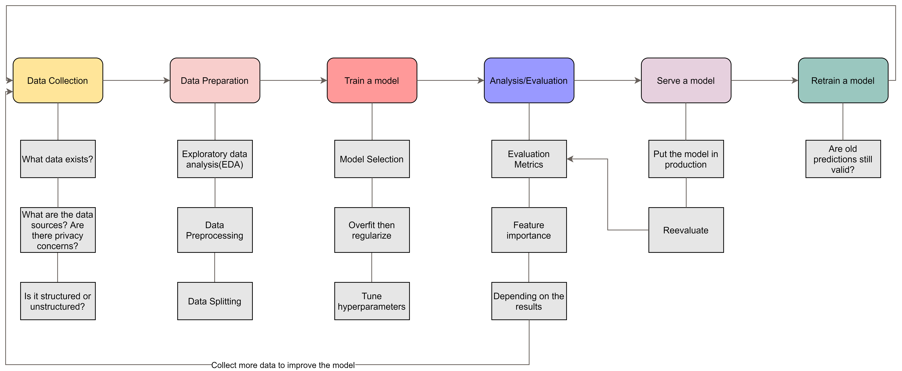
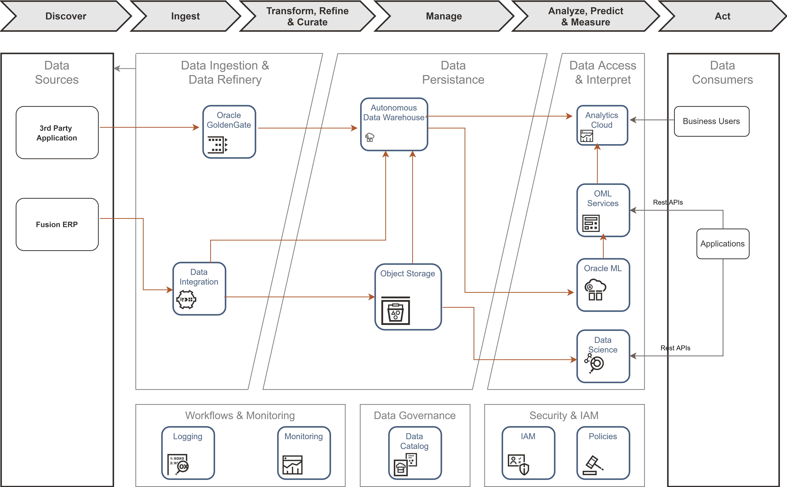
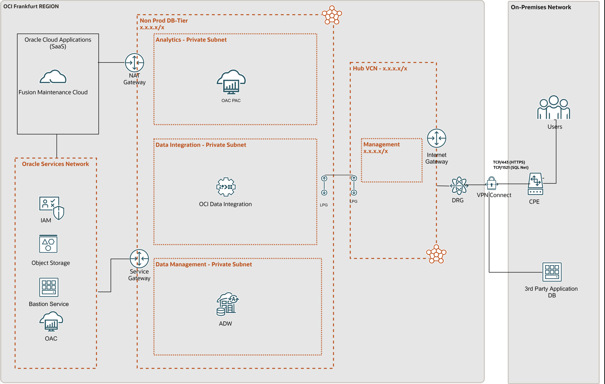
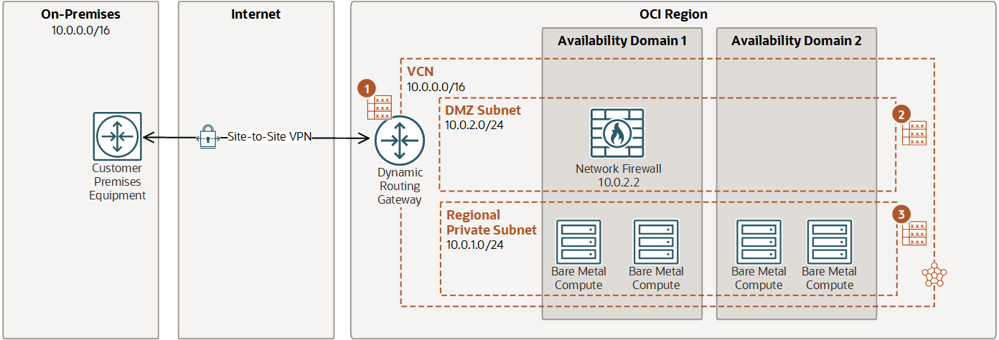

# Document Control

## Version Control

*Example*

<table>
<caption></caption>
<colgroup>
<col style="width: 10%" />
<col style="width: 30%" />
<col style="width: 20%" />
<col style="width: 40%" />
</colgroup>
<thead>
<tr class="header">
<th style="text-align: left;">Version</th>
<th style="text-align: left;">Authors</th>
<th style="text-align: left;">Date</th>
<th style="text-align: left;">Comments</th>
</tr>
</thead>
<tbody>
<tr class="odd">
<td style="text-align: left;">1.3</td>
<td style="text-align: left;">Ismael Hassane</td>
<td style="text-align: left;">24 July 2023</td>
<td style="text-align: left;">Public version</td>
</tr>
</tbody>
</table>

## Table of Acronyms

| Term | Meaning                                           |
| :--- | :------------------------------------------------ |
| AD   | Availability Domain                               |
| ADB  | Autonomous Database including ATP, ADW, AJD, etc. |
| ADW  | Autonomous Data Warehouse                         |
| ATP  | Autonomous Transaction Processing                 |
| DEV  | Development Environment                           |
| DI   | Data Integration                                  |
| DLH  | Data Lakehouse                                    |
| DRG  | Dynamic Routing Gateway                           |
| DWH  | Data Warehouse                                    |
| ELT  | Extract-Load-Transform                            |
| ETA  | Estimated Time of Arrival                         |
| IaaS | Infrastructure as a Service                       |
| LB   | Load Balancer                                     |
| NSG  | Network Security Group                            |
| OCI  | Oracle Cloud Infrastructure                       |
| PROD | Production Environment                            |
| SLA  | Service Level Agreement                           |
| UAT  | User Acceptance Test Environment                  |
| VCN  | Virtual Cloud Network                             |

## Team

*Guide:*

*A section describing the Oracle team.*

*Example:*

| Name         | Email             | Role                   | Company |
| :----------- | :---------------- | :--------------------- | :------ |
| Name Surname | name@example.com  | Solution Architect     | example |
| Name Surname | name@lexample.com | Account Cloud Engineer | example |

## Document Purpose

*Guide:*

*Describe the purpose of this document and the Oracle-specific terminology, specifically around 'Workload'.*

*Example:*

This document provides a high-level solution definition for the Oracle solution and aims at describing the current state, current state requirements, and to-be state. 

The document may refer to a ‘Workload’, which summarizes the full technical solution for a customer (You) during a single engagement. The Workload is described in the chapter [Workload Requirements and Architecture](#workload-requirements-and-architecture).

This is a living document, additional sections will be added as the engagement progresses resulting in a final Document to be handed over to the \<Service Provider\>.

# Business Context

*Guide:*

*Describe the customer's business and background. What is the context of the customer's industry and LoB? What are the business needs and goals which this Workload is an enabler for? How does this technical solution impact and support the customer's business goals? Does this solution support a specific customer strategy, or maybe certain customer values? How does this solution help our customers to either generate more revenue or save costs?*

## Executive Summary

*Guide:*

*A section describing the background of the Customer and the context of the Workload migration*

*Example:*

-   Brief history of the Customer

-   Current Solution and Rationale for moving to Oracle Cloud Infrastructure (OCI)

## Workload Business Value

*Guide:*

*A section describing the business value of the workload on OCI*

*Example:*

The client is developing a new line of business where they will provide credit financing to importers and exporters. The approval process for the credit solution will be quicker than with banks. At the time of booking a consignment, the booking agent can offer it in real-time, saving a great deal of time on paperwork and approval procedures.

A precise credit risk scoring algorithm is crucial for this new service. Machine learning and data science can use historical trade information and make classifications and predictions about importer or exporter credit worthiness. Machine learning models will use 3rd party data and Fusion ERP data since this data is based on factual audited trade information that provides high confidence in data quality.

# Workload Requirements and Architecture

## Overview

*Guide:*

*A section describing the Current workload of the Customer. Describe the Workload: What applications and environments are part of this Workload, specify their names and details. The implementation will be scoped later and is typically a subset of the Workload. For example, a Workload could exist with two environment, but the implementer would only include one environment. The workload chapter is about the whole Workload and the implementation scope will be described late in the chapter.*

*Example:*

This is a green field project, i.e. no existing workload to migrate from. The client is developing a new line of business where they will provide credit financing to importers and exporters. The approval process for the credit solution will be quicker than with banks. At the time of booking a consignment, the booking agent can offer it in real-time, saving a great deal of time on paperwork and approval procedures.

A precise credit risk scoring algorithm is crucial for this new service. Machine learning and data science can use historical trade information and make classifications and predictions about importer or exporter credit worthiness. Machine learning models will use 3rd party data and Fusion ERP data since this data is based on factual audited trade information that provides high confidence in data quality.  

There will be 3 environments (Production, Test, Disaster Recovery).

## Functional Requirements

In-database machine learning refers to the integration of machine learning algorithms and models directly into a database system. This approach offers several advantages, including reduced data movement, faster predictions, and enhanced security. Here are some use cases for in-database machine learning:

### Use Cases

#### Real-time Credit Risk Assessment

Credit scoring is a crucial process in the banking industry that assesses the creditworthiness of individuals or businesses applying for loans or credit. In-database machine learning can significantly improve the efficiency and accuracy of credit scoring models.

When customers apply for credit, banks need to make quick and informed decisions about their creditworthiness. Traditional credit scoring models may involve transferring large volumes of data to external systems for analysis, leading to delays in processing applications and potential security risks. In-database machine learning can address these challenges by building credit scoring models directly within the banking database.

By integrating machine learning algorithms into the database, banks can analyze a customer's historical financial data, credit history, transaction behavior, and other relevant factors in real-time. This enables immediate credit risk assessment and decision-making during the application process. In-database machine learning models can quickly evaluate a customer's credit risk profile and provide an instant credit score, facilitating faster approvals for credit products like loans, credit cards, and overdrafts.

Moreover, in-database machine learning allows banks to continuously update and fine-tune their credit scoring models as new data becomes available, ensuring that the models stay relevant and accurate over time. This adaptability is especially important in the dynamic and ever-changing financial landscape.

By leveraging in-database machine learning for credit scoring, banks can streamline their lending processes, improve customer experiences, and mitigate credit risks effectively. Additionally, it helps in maintaining data privacy and security, as sensitive customer information remains within the secure confines of the database.

#### Fraud Detection

In the financial industry, fraud detection is a critical application. By leveraging in-database machine learning, financial institutions can develop and deploy fraud detection models directly within their databases. This enables real-time analysis of transactions and customer behavior, reducing the time between data collection and prediction. With in-database machine learning, suspicious activities can be quickly flagged and appropriate actions taken to prevent fraudulent transactions, leading to enhanced security and reduced financial losses.

#### Customer Churn Prediction

For businesses with large customer bases, understanding and predicting customer churn (i.e., when customers stop using their services) is vital. By employing in-database machine learning, companies can build churn prediction models directly within their databases. These models can analyze historical customer data, such as transaction history, customer interactions, and usage patterns, to identify potential churners. The in-database approach allows businesses to make real-time predictions and take proactive measures, such as personalized retention offers, to retain valuable customers.

#### Personalized Recommendations

E-commerce platforms and content providers often rely on recommendation systems to offer personalized suggestions to their users. In-database machine learning can be used to develop recommendation models within the database itself. By analyzing user behavior, purchase history, and preferences in real-time, the database can generate personalized recommendations without the need to transfer vast amounts of data to external systems. This not only ensures faster response times but also protects the privacy and security of user data.

In all these use cases, the integration of machine learning directly within the database optimizes data processing, minimizes data movement, and enhances overall system performance. It also simplifies model deployment and maintenance, making it an attractive solution for various data-intensive applications.

### Machine Learning Model steps

The below schema lists the necessary tasks in the lifecycle of a machine learning model ranging from data collection to model retraining when performance decays.

### Data Dictionary

### Data Flow

| Element            | Description                                                                                                                                                                                                                                                                                            |
|:-------------------|:-------------------------------------------------------------------------------------------------------------------------------------------------------------------------------------------------------------------------------------------------------------------------------------------------------|
| Use Case 1         | Preparing near real-time Credit Risk solution by using AutoML in Autonomous Data Warehouse                                                                                                                                                                                                             |
| Stakeholder        | Customer name                                                                                                                                                                                                                                                                                          |
| Use Case Overview  | This use case will create a new business line for the company.                                                                                                                                                                                                                                         |
| Precondition 1     | Business requirements will be defined by the customer                                                                                                                                                                                                                                                  |
| Trigger            | Whenever there is new data in the 3rd party application database, it will be loaded into Autonomous Data Warehouse by OCI GG. Fusion ERP data will be integrated daily.                                                                                                                                |
| Basic Flow         | The data from 3rd party applications and Fusion ERP will be integrated to Autonomous Data Warehouse daily and AutoML will provide the best ML model over historical data. Applications will access the results through OML Services and the Business users will access through Oracle Analytics Cloud. |
| Alternative Flow 1 | If the customer would like to use Jupyter Environment and they can also use OCI Data Science Cloud                                                                                                                                                                                                     |
| Alternative Flow 2 | If the customer would like to integrate new data sources, they can be integrated with OCI Data Integration                                                                                                                                                                                             |

### Functional Capabilities

### Requirement Matrix

| Requirements                                      | OAC[^1] | ADW | OCI DI | OCI GG |
|---------------------------------------------------|---------|-----|--------|--------|
| Access report and advanced visualization          | Y       |     |        |        |
| Self-Service reporting and advanced visualization | Y       |     |        |        |
| Profile and analyze data and KPIs                 | Y       | Y   |        |        |
| Data loading                                      |         |     | Y      | Y      |
| Data processing                                   |         |     | Y      |        |
| Data persistence (storage)                        |         | Y   |        |        |

## Non Functional Requirements

*Guide:*

*Describe the high-level technical requirements for the Workload. Consider all sub-chapters, but decide and choose which Non-Functional Requirements are necessary for your engagement. You might not need to capture all requirements for all sub-chapters.*

### Integration and Interfaces

| Name                 | Source                          | Target | Mode     | Function            |
|:---------------------|:--------------------------------|:-------|:---------|:--------------------|
| OCI Data Integration | Oracle Fusion Maintenance Cloud | ADW    | Batch    | Batch extraction    |
| OCI Golden Gate      | 3rd party Application DB        | ADW    | realtime | Change data capture |

### Regulations and Compliances

*Guide:*

*This section captures specific regulatory or compliance requirements for the Workload. These may limit the types of technologies that can be used and may drive some architectural decisions.*

*The Oracle Cloud Infrastructure Compliance Documents service lets you view and download compliance documents: https://docs.oracle.com/en-us/iaas/Content/ComplianceDocuments/Concepts/compliancedocsoverview.htm*

*If there are none, then please state it. Leave the second sentence as a default in the document.*

*Example:*

At the time of this document creation, no Regulatory and Compliance requirements have been specified.

In addition to these requirements, the [CIS Oracle Cloud Infrastructure Foundation Benchmark, v1.2](https://www.cisecurity.org/benchmark/Oracle_Cloud) will be applied to the Customer tenancy.

### Environments

*Guide:*

*A section describing the Current workload of the Customer: Environment details*

| Name              | Size of Prod | Location  | MAA  | Scope                  |
| :---------------- | :----------- | :-------- | :--- | :--------------------- |
| Production        | 100%         | Madrid    | Gold | Not in Scope / On-prem |
| Dev & Test        | 25%          | Madrid    | None | Lift Project           |
| Disaster Recovery | 50%          | Marseille | None | Implementation Partner |

### High Availability and Disaster Recovery Requirements

*Guide:*

*This section captures the resilience and recovery requirements for the Workload. Note that these may be different from the current system.*

*The Recovery Point Objective (RPO) and Recovery Time Objective (RTO) requirement of each environment should be captured in the environments section above, and wherever possible.*

-   *What are the RTO and RPO requirements of the Application?*
-   *What are the SLAs of the application?*
-   *What are the backup requirements*

*Example:*

The recovery time objective (downtime tolerance) and recovery point objective (data loss tolerance) details are very important considerations for the Customer. The overall DR requirement is a cross-region DR strategy with the goal of minimizing RTO.

At the time of this document creation, no Resilience or Recovery requirements have been specified.

### Management and Monitoring

*Example:*

| Type       | Tool                    | Task                                                                                                                      | Target          | Location | Notes |
|:-----------|:------------------------|:--------------------------------------------------------------------------------------------------------------------------|:----------------|:---------|:------|
| Monitoring | OAC console             | monitor user sessions and cache status                                                                                    | OAC             | OCI      |       |
| Monitoring | Performance Hub         | monitor performance, CPU utilization, consumed storage, running SQL statements and sessions amongst other metrics exposed | ADW             | OCI      |       |
| Management | Identity Domain console | manage users and perform role assignment for those users                                                                  | Identity Domain | OCI      |       |
| Management | OCI Console             | database management tasks for Autonomous Databases                                                                        | ADW             | OCI      |       |
| Management | Using the API           | database management tasks for Autonomous Databases                                                                        | ADW             | OCI      |       |
| Management | OAC console             | manage OAC settings, create and restore snapshots                                                                         | OAC             | OCI      |       |

### Security

*Guide:*

*Capture the Non-Functional Requirements for security-related topics. Security is a mandatory subsection that is to be reviewed by the x-workload security team. The requirements can be separated into:*

-   *Identity and Access Management*
-   *Data Security*

*Other security topics, such as network security, application security, or others can be added if needed.*

*Example:*

The foundation of security is access control, which refers to how the system is being accessed and by whom. User security consists of three principal components: authentication, authorization, and an audit trail. All current browser-based password login screens send the password as a parameter in the HTTP form submission. Using an HTTPS connection will encrypt this information. The best practice is therefore to use HTTPS for all web-based access. The requirement is to take extra steps to ensure security is not compromised, either from the Infrastructure side or from the Application endpoints.

At the time of this document creation, no Security requirements have been specified.

#### Identity and Access Management

The proposed solution consists of ADW, Oracle Analytics Cloud (OAC) and OCI Golden Gate which are fully managed by Oracle (OCI PaaS), and therefore have very small attack surface. Authentication and authorization of users is done with the enterprise-grade Identity and Access Management (IAM) services of OCI.

#### Data Security

Elaborate on data security at-rest and in-motion.

## Constraints and Risks

| Name               | Description                                                              | Type       | Impact             | Mitigation Approach                                   |
|:-------------------|:-------------------------------------------------------------------------|:-----------|:-------------------|:------------------------------------------------------|
| OCI skills         | Limited OCI skills in customers organization                             | Risk       | No Operating Model | Involve Ops partner, for example Oracle ACS           |
| Team Availability  | A certain person is only available on Friday CET time zone               | Constraint |                    | Arrange meetings to fit that persons availability     |
| Access Restriction | We are not allowed to access a certain tenancy without customer presence | Constraint |                    | Invite customer key person to implementation sessions |

## Future State Architecture

*Guide:*

*The Workload Future State Architecture can be described in various forms. In the easiest case, we describe a Logical Architecture, possibly with a System Context Diagram. A high-level physical architecture is mandatory as a description of your solution.*

*Additional architectures, in the subsections, can be used to describe needs for specific workloads.*

*Example*

**Main Components:**

### Data Ingestion & Data Refinery

-   **Oracle Cloud Infrastructure Data Integration** will be used to process and transform data that is coming from Fusion ERP and ingest it into Autonomous Database.

-   **OCI Golden Gate** will be used to replicate the data from the database of 3rd Party Application Database to Autonomous Database.

### Serving/Data Persistance

-   **Oracle Autonomous Data Warehouse** will serve as the source of the curated data that will be used to create the AutoML data preparation and feature engineering. By leveraging Autonomous Oracle Database and the power of Exadata in the cloud, data preparation over historical data will perform better.

-   **Object Storage** - is an internet-scale, high-performance storage platform that offers reliable and cost-efficient data durability. Object Storage can also be used as a cold storage layer for the Autonomous Databases by storing data that is used infrequently and then joining it seamlessly with the most recent data by using hybrid tables in the Oracle Database.

### Data Access & Interpretation

**Data Science & Machine Learning**

-   **Predict**

**Oracle Machine Learning Services** extend Oracle Machine Learning (OML) functionality to support model deployment and model lifecycle management for both in-database Oracle Machine Learning models and third-party Open Neural Networks Exchange (**ONNX**) machine learning models via REST APIs. Oracle Machine Learning Services supports real-time and small-batch scoring for applications and dashboards.

The REST API for Oracle Machine Learning Services provides REST endpoints with authentication via Autonomous Data Warehouse. These endpoints enable the storage and management of machine learning models and their metadata. These endpoints also allow for the creation of scoring endpoints for models.

Oracle Machine Learning Services supports third-party classification or regression models that can be built using packages like Scikit-learn and TensorFlow, among others and then exported in ONNX format. Oracle Machine Learning Services supports integrated cognitive text analytics for topic discovery, keywords, summary, sentiment, and similarity. Oracle Machine Learning Services also supports image classification via third-party ONNX format model deployment, and supports scoring using images or tensors.

Users can also predict directly in the database using in-database models from SQL, R, and Python for singleton, small batch, and large-scale batch scoring. Users can leverage OML4Py embedded Python execution to invoke user-defined Python function with models produced from third-party packages and make predictions from Python and REST interfaces.

-   **Learn**

Oracle Machine Learning **Notebooks** provide a collaborative user interface for data scientists and business and data analysts to work with SQL and Python interpreters while also performing machine learning in Oracle Autonomous Database—which includes Autonomous Data Warehouse (ADW), Autonomous Transaction Processing (ATP), and Autonomous JSON Database (AJD). Oracle Machine Learning Notebooks enable the broader data science team (data scientists, citizen data scientists, data analysts, data engineers, DBAs) to work together to explore their data visually and to develop analytical methodologies using OML4SQL and OML4Py. The Notebooks interface provides access to Oracle's high-performance, parallel, and scalable in-database implementations of machine learning algorithms via Python, SQL, and PL/SQL. In-database functionality can also be accessed through connection to Autonomous Database via external interfaces, such as SQL Developer, open source notebook environments, and third-party IDEs.

**OML4Py** also provides a Python API for automated machine learning (AutoML) for automated algorithm and feature selection, and for automated model tuning and selection.

Oracle Machine Learning **AutoML** User Interface (OML AutoML UI) is a no-code user interface that provides automated machine learning with ease of deployment to Oracle Machine Learning Services. Business users without extensive data science background can use OML AutoML UI to create and deploy machine learning models as well as generate an OML notebook containing the corresponding OML4Py code to rebuild the model and score data programmatically.

Expert data scientists may use OML AutoML UI as a productivity accelerator for faster model exploration, for ease of deployment, and for starter notebook generation.

**Visualize and Learn**

**Oracle Analytics Cloud** Business users will have access to the customer's final data/variables and the evaluation of their credit score results in Oracle Analytics Dashboards. It is scalable and secure public self-service & enterprise Visualization service that provides a full set of capabilities to explore and perform collaborative analytics.

OAC supports **Oracle Machine Learning** models deployments along with OCI AI services such as **OCI Vision** for image detection.

**Governance**

-   **OCI Data Catalog** - is a crucial component in governing the data and information landscape providing visibility to where technical assets such as metadata and respective attributes reside as well as offering the ability to maintain a business glossary that is mapped to that technical metadata. Data Catalog can also serve metadata to be consumed by ADB in order to facilitate external tables creation in those autonomous databases.

-   **Data Safe** - is a unified control center for Oracle Databases which helps you understand the sensitivity of your data, evaluate risks to data, mask sensitive data, implement and monitor security controls, assess user security, monitor user activity, and address data security compliance requirements. Data Safe will be used to 1) audit and implement security controls namely on the production database as well as 2) sensitive data discovery and masking of non prod environments that might originate from production copies/replicas.

**CI/CD**

-   **OCI DevOps Service** Oracle Cloud Infrastructure DevOps service is a complete continuous integration/continuous delivery (CI/CD) platform for developers to simplify and automate their software development lifecycle. The OCI DevOps service enables developers and operators to collaboratively develop, build, test, and deploy software. Developers and operators get visibility across the full development lifecycle with a history of source commit through build, test, and deploy phases.

**Security & IAM**

-   **IAM** - OCI Identity and Access Management allows controlling who has access to cloud resources.

    OCI IAM provides identity and access management features such as authentication, single sign-on (SSO), and identity lifecycle management for Oracle Cloud as well as Oracle and non-Oracle applications, whether SaaS, cloud-hosted, or on-premises. Employees, business partners, and customers can access applications at any time, from anywhere, and on any device in a secure manner.

    IAM integrates with existing identity stores, external identity providers, and applications across cloud and on-premises to facilitate easy access for end users. It provides the security platform for Oracle Cloud, which allows users to securely and easily access, develop, and deploy business applications such as Oracle Human Capital Management (HCM) and Oracle Sales Cloud, and platform services such as Oracle Java Cloud Service, Oracle Analytics Cloud, and others.

    It can control what type of access a group of users have and to which specific cloud resources. It is a key component of segregating resources and restricting access only to authorised groups and users. OCI IAM, and in fact, OCI as a whole implements a [Zero Trust Security](https://www.oracle.com/security/what-is-zero-trust/#link1) model of which one of the guiding principles is least privilege access; in fact, a user by default doesn't have access to any resources and policies need to be created explicitly to grant groups of users access to cloud resources.

Workload resilience is achieved by the intrinsic capabilities of ExaCS and OAC and providing Service Level Objectives as described in ["Oracle PaaS and IaaS Public Cloud Services Pillar Document"](https://www.oracle.com/assets/paas-iaas-pub-cld-srvs-pillar-4021422.pdf).

### High Availability and Disaster Recovery

*Guide:*

*Please describe the Oracle MAA in the context of the designed data platform.*

*Example:*

For each component, recovery in the case of the disaster can be achieved by leveraging:

- **OAC** :

  - **OAC system-generated backups :** Oracle regularly do system-generated backups (daily, and also when a change is done on the data model and keep them for 30 days) of the entire Oracle Analytics Cloud environment, including system configuration and user content. Oracle Support Services use these system-generated backups to restore an environment that becomes corrupt, but these system-generated backups aren't accessible to customers and they’re not intended to provide customer-requested recovery points. Customer must use the snapshot feature (described below) to back up and restore user content.

  - **OAC Snapshots** : Customer should regularly back up the content that users create to a file called a snapshot. User content includes catalog content such as reports, dashboards, data visualization workbooks, and pixel perfect reports, datasets, data flows, data models, security roles, service settings, and so on. If something goes wrong with your content or service, you can revert to the content you saved in a snapshot. Snapshots are also useful if there is a requirement to move or share content from one service to another. Oracle Analytics Cloud Snapshot is described [here](https://docs.oracle.com/en/cloud/paas/analytics-cloud/acabi/snapshots.html#GUID-FAE709DE-3370-457C-9015-2E088ACA6181)

    Oracle recommends to take snapshots at significant checkpoints, for example, before making a major change to the content or environment. In addition, Oracle recommends taking regular weekly snapshots or at defined frequency based on the rate of change of the environment and rollback requirements. These Snapshots are can be downloaded to in order to store them locally.

  - To implement a disaster recovery, a well-architected business continuity plan should be designed in order to recover as quickly as possible and continue to provide services to Oracle Analytics Cloud users. Oracle recommends to do snapshots regularly and restore the content to a redundant Oracle Analytics Cloud environment (that can be only powered on during restore process) in another region if possible to mitigate the risk of region-wide events.

- **OCI DI** :

  -   **Applications in ODI Data Integration** : In order to achieve disaster recovery, version upgrade and cross environment code promotion, we use the notion of Applications in OCI Data Integration. An Application in Data Integration is a container at the workspace level that holds runtime objects such as published tasks and task runs. You have the flexibility to [create a new Application](https://docs.oracle.com/en-us/iaas/data-integration/using/applications.htm#creating-applications) from scratch or make a copy of an existing one. Disaster Recovery will be achieve by automating backup creation and trigger restauration in the event of a disaster.

- **ADW** :

  - **ADW automated backups** : that have a retention period of 60 days and that allow to restore and recover the ADW database to any point-in-time in this retention period. Manual backups can also be performed and stored in an Object Storage bucket, if needed, for instance to have a higher retention period.

  - **Oracle Database Autonomous Recovery Service** You can select Recovery Service as the backup destination for automatic backups.

  - **Autonomous Data Guard** you can add an Autonomous Data Guard standby database, the system creates a standby database that continuously gets updated with the changes from the primary database

  - **OML** backup and recovery are also immediate as part of ADW.

    

### Physical Architecture

*Guide:*

*A section describing the Deployment Design and its associated Components in OCI*

*Example:*

In the **following sections** we are describing the **Deployment Design Diagram** as well as all the relevant components present in the Design diagram.

This section's physical future state architecture serves as the first iteration of the Credit Risk system that will be provisioned in OCI. As a result, the physical future state architecture will be refined in accordance with the customer's low level requirements, and those refinements and the final solution will be detailed in WAD in the future.

-   **Oracle Analytics Cloud (OAC)** will be provisioned in a private subnet.
-   **Oracle Cloud Analytics Private Access Channel (OAC PAC)** will be used to connect the OAC to the ADW residing in the private subnet.
-   **ADW** will be provisioned in the private subnet.
-   **OCI Data integration** will be prepared in the private subnet.
-   **Data Catalog** will be ready to use when the tenancy is created.
-   **Object storage** will be ready to use when the tenancy is created.
-   **Monitoring/Logging** tools ready to use to monitor OCI Services and related Logs.
-   **OCI IAM Identity Domains** is automatically provided and ready to use at the tenancy level.
-   **OCI VCN and Subnets** Lift team will check the existing VCN and subnets and create new ones if needed.
-   **Bastion Service** will be used by the Oracle Lift team to have external access to VCNs
-   **NAT Gateway** -A NAT gateway enables private resources in a VCN to access hosts on the internet, without exposing those resources to incoming internet connections. It will be used for OCI Data integration and BICC.
-   **Dynamic Routing Gateway (DRG)** is the virtual router that secures and manages traffic between on-premises networks and Virtual Cloud Networks (VCN) in Oracle Cloud.
-   **Service Gateways** allow private access to Oracle managed services with public IP addresses from on-premises and from VCNs, without exposing the traffic to the public Internet.
-   **Virtual Cloud Networks (VCN) and Subnets** will contain private resources like computing instances, database systems, and private endpoints for Oracle managed resources like Autonomous Data Warehouse and Oracle Analytics Cloud.

#### Network Firewall

Optionally a managed Network Firewall can be leveraged to increase security posture of the workload.

OCI Network Firewall is a next-generation managed network firewall and intrusion detection and prevention service for VCNs, powered by Palo Alto Networks. The Network Firewall service offers simple setup and deployment and gives visibility into traffic entering the cloud environment (North-south network traffic) as well traffic between subnets (East-west network traffic).

Use network firewall and its advanced features together with other Oracle Cloud Infrastructure security services to create a layered network security solution.

A network firewall is a highly available and scalable instance that you create in the subnet of your choice. The firewall applies business logic to traffic that is specified in an attached firewall policy. Routing in the VCN is used to direct network traffic to and from the firewall.

Above a simple example is presented where a Network Firewall is deployed in a DMZ subnet and for which all incoming traffic via the DRG as well as all the outgoing traffic from the private subnet is routed to the Network Firewall so that policies are enforced to secure traffic.

*Reference:*

*[The Oracle Cloud Notation, OCI Architecture Diagram Toolkits](https://docs.oracle.com/en-us/iaas/Content/General/Reference/graphicsfordiagrams.htm)*

### Mandatory Security Best Practices

*Guide:*

*Use this text for every engagement. Do not change. Aligned with the Cloud Adoption Framework*

*Example:*

The safety of the Customer's Oracle Cloud Infrastructure (OCI) environment and data is the priority.

The following table of OCI Security Best Practices lists the recommended topics to provide a secure foundation for every OCI implementation. It applies to new and existing tenancies and should be implemented before the Workload defined in this document will be implemented.

Workload-related security requirements and settings like tenancy structure, groups, and permissions are defined in the respective chapters.

Any deviations from these recommendations needed for the scope of this document will be documented in the chapters below. They must be approved by Customer.

Customer is responsible for implementing, managing, and maintaining all listed topics.

<table style="width:25%;">
<colgroup>
<col style="width: 2%" />
<col style="width: 2%" />
<col style="width: 19%" />
</colgroup>
<thead>
<tr class="header">
<th>CATEGORY</th>
<th>TOPIC</th>
<th>DETAILS</th>
</tr>
</thead>
<tbody>
<tr class="odd">
<td>User Management</td>
<td>IAM Default Domain</td>
<td>
Multi-factor Authentication (MFA) should be enabled and enforced for every non-federated OCI user account.

<ul>
<li>For configuration details see <a href="https://docs.oracle.com/en-us/iaas/Content/Identity/mfa/understand-multi-factor-authentication.htm">Managing Multi-Factor Authentication</a>.</li>
</ul>

In addition to enforcing MFA for local users, Adaptive Security will be enabled to track the Risk Score of each user of the Default Domain.

<ul>
<li>For configuration details see <a href="https://docs.oracle.com/en-us/iaas/Content/Identity/adaptivesecurity/overview.htm">Managing Adaptive Security and Risk Providers</a>.</li>
</ul></td>
</tr>
<tr class="even">
<td></td>
<td>OCI Emergency Users</td>
<td>
A maximum of <strong>three</strong> non-federated OCI user accounts should be present with the following requirements:

<ul>
<li>Username does not match any username in the Customer’s Enterprise Identity Management System</li>
<li>Are real humans.</li>
<li>Have a recovery email address that differs from the primary email address.</li>
<li>User capabilities have Local Password enabled only.</li>
<li>Has MFA enabled and enforced (see IAM Default Domain).</li>
</ul></td>
</tr>
<tr class="odd">
<td></td>
<td>OCI Administrators</td>
<td>
Daily business OCI Administrators are managed by the Customer’s Enterprise Identity Management System. This system is federated with the IAM Default Domain following these configuration steps:

<ul>
<li>Federation Setup</li>
<li>User Provisioning</li>
<li>For configuration guidance for major Identity Providers see the OCI IAM Identity Domain tutorials.</li>
</ul></td>
</tr>
<tr class="even">
<td></td>
<td>Application Users</td>
<td>Application users like OS users, Database users, or PaaS users are not managed in the IAM Default Domain but either directly or in dedicated identity domains. These identity domains and users are covered in the Workload design. For additional information see <a href="https://docs.oracle.com/en-us/iaas/Content/cloud-adoption-framework/iam-security-structure.htm">Design Guidance for IAM Security Structure</a>.</td>
</tr>
<tr class="odd">
<td>Cloud Posture Management</td>
<td>OCI Cloud Guard</td>
<td>
OCI Cloud Guard will be enabled at the root compartment of the tenancy home region. This way it covers all future extensions, like new regions or new compartments, of your tenancy automatically. It will use the Oracle Managed Detector and Responder recipes at the beginning and can be customized by the Customer to fulfill the Customer’s security requirements.

<ul>
<li>For configuration details see <a href="https://docs.oracle.com/en-us/iaas/cloud-guard/using/part-start.htm">Getting Started with Cloud Guard</a>. Customization of the Cloud Guard Detector and Responder recipes to fit the Customer’s requirements is highly recommended. This step requires thorough planning and decisions to make.</li>
<li>For configuration details see <a href="https://docs.oracle.com/en-us/iaas/cloud-guard/using/part-customize.htm">Customizing Cloud Guard Configuration</a></li>
</ul></td>
</tr>
<tr class="even">
<td></td>
<td>OCI Vulnerability Scanning Service</td>
<td>
In addition to OCI Cloud Guard, the OCI Vulnerability Scanning Service will be enabled at the root compartment in the home region. This service provides vulnerability scanning of all Compute instances once they are created.

<ul>
<li>For configuration details see <a href="https://docs.oracle.com/en-us/iaas/scanning/home.htm">Vulnerability Scanning</a>.</li>
</ul></td>
</tr>
<tr class="odd">
<td>Monitoring</td>
<td>SIEM Integration</td>
<td>Continuous monitoring of OCI resources is key for maintaining the required security level (see <a href="#regulations-and-compliances-requirements">Regulations and Compliance</a> for specific requirements). See <a href="https://docs.oracle.com/en-us/iaas/Content/cloud-adoption-framework/siem-integration.htm">Design Guidance for SIEM Integration</a> to implement integration with the existing SIEM system.</td>
</tr>
<tr class="even">
<td>Additional Services</td>
<td>Budget Control</td>
<td>
OCI Budget Control provides an easy-to-use and quick notification on changes in the tenancy’s budget consumption. It will be configured to quickly identify unexpected usage of the tenancy.

<ul>
<li>For configuration details see <a href="https://docs.oracle.com/en-us/iaas/Content/Billing/Tasks/managingbudgets.htm">Managing Budgets</a></li>
</ul></td>
</tr>
</tbody>
</table>
## Sizing and Bill of Materials

### Sizing

The benefit of Oracle Cloud Infrastructure is that services can be set up with a small footprint and can be easily scaled as more use cases and workloads are migrated over to the new architecture. ``{=html} The following represents a Bill of Materials with an OCPU sizing estimates :

| Phase    | OCI Service                                          | Feature Set          | Size    | Comment |
| :------- | :--------------------------------------------------- | :------------------- | :------ | :------ |
| **PROD** | Autonomous Data Warehouse                            | **License Included** | **TBD** |         |
| **PROD** | Autonomous Data Warehouse-Exadata Storage            |                      | **TBD** |         |
| **PROD** | Oracle Analytics Cloud-Enterprise                    | **License Included** | **TBD** |         |
| **PROD** | OCI Data Integration - Pipeline Operator Execution   |                      | **TBD** |         |
| **PROD** | OCI Data Integration - GB of Data processed per hour |                      | **TBD** |         |
| **PROD** | OCI Golden Gate                                      | **License Included** | **TBD** |         |
| **PROD** | Network Firewall (optional) - B95403                 |                      | **TBD** |         |

The sizing defined above is the recommended sizing from Oracle team to accommodate the expected volume of data and meet the scalability of the predicted data processing; since the OCI services can be scaled up and scaled down the customer can always revisit this sizing in the future and adjust it as needed.

-   (1) With Autoscaling enabled, ADW will automatically scale to 3x time of base OCPUs. With 1 OCPU, it can scale up to 3 OCPUs. We recommend enabling Autoscaling for production workloads.

-   (2) For OAC, 1 OCPU is recommended for Trials only. OAC instances with 1 OCPU are restricted in how many rows they may return (see https://docs.oracle.com/en-us/iaas/analytics-cloud/doc/create-services.html for details.

### Bill of Material

*Guide*

Use the following website for the I.T. infrastructure cost estimation.

- https://www.oracle.com/cloud/costestimator.html 

## OCI Cloud Landing Zone Architecture

The design considerations for an OCI Cloud Landing Zone have to do with OCI and industry architecture best practices, along with customer specific architecture requirements that reflect the Cloud Strategy (hybrid, multi-cloud, etc). An OCI Cloud Landing zone involves a variety of fundamental aspects that have a broad level of sophistication. A good summary of a Cloud Landing Zone has been published by [Cap Gemini](https://www.capgemini.com/2019/06/cloud-landing-zone-the-best-practices-for-every-cloud/).

### Resource Naming Convention

Oracle recommends the following Resource Naming Convention:

-   The name segments are separated by “-“
-   Within a name segment avoid using `<space>`{=html} and “.”
-   Where possible intuitive/standard abbreviations should be considered (e.g. “shared“ compared to "shared.cloud.team”)
-   When referring to the compartment full path, use “:” as separator, e.g. cmp-shared:cmp-security

Some examples of naming are given below:

-   cmp-shared
-   cmp-\<workload\>
-   cmp-networking

The patterns used are these:

-   \<resource-type\>-\<environment\>-\<location\>-\<purpose\>
-   \<resource-type\>-\<environment\>-\<source-location\>-\<destination-location\>-\<purpose\>
-   \<resource-type\>-\<entity/sub-entity\>-\<environment\>-\<function/department\>-\<project\>-\<custom\>
-   \<resource-type\>-\<environment\>-\<location\>-\<purpose\>

Abbreviation per resource type are listed below. This list may not be complete.

| Resource type                      | Abbreviation       | Example                                                     |
|------------------------------------|--------------------|-------------------------------------------------------------|
| Bastion Service                    | bst                | bst-\<location\>-\<network\>                                |
| Block Volume                       | blk                | blk-\<location\>-\<project\>-\<purpose\>                    |
| Compartment                        | cmp                | cmp-shared, cmp-shared-security                             |
| Customer Premise Equipment         | cpe                | cpe-\<location\>-\<destination\>                            |
| DNS Endpoint Forwarder             | dnsepf             | dnsepf-\<location\>                                         |
| DNS Endpoint Listener              | dnsepl             | dnsepl-\<location\>                                         |
| Dynamic Group                      | dgp                | dpg-security-functions                                      |
| Dynamic Routing Gateway            | drg                | drg-prod-\<location\>                                       |
| Dynamic Routing Gateway Attachment | drgatt             | drgatt-prod-\<location\>-\<source_vcn\>-\<destination_vcn\> |
| Fast Connect                       | fc# \<# := 1...n\> | fc0-\<location\>-\<destination\>                            |
| File Storage                       | fss                | fss-prod-\<location\>-\<project\>                           |
| Internet Gateway                   | igw                | igw-dev-\<location\>-\<project\>                            |
| Jump Server                        | js                 | js-\<location\>-xxxxx                                       |
| Load Balancer                      | lb                 | lb-prod-\<location\>-\<project\>                            |
| Local Peering Gateway              | lpg                | lpg-prod-\<source_vcn\>-\<destination_vcn\>                 |
| NAT Gateway                        | nat                | nat-prod-\<location\>-\<project\>                           |
| Network Security Group             | nsg                | nsg-prod-\<location\>-waf                                   |
| Managed key                        | key                | key-prod-\<location\>-\<project\>-database01                |
| OCI Function Application           | fn                 | fn-security-logs                                            |
| Object Storage Bucket              | bkt                | bkt-audit-logs                                              |
| Policy                             | pcy                | pcy-services, pcy-tc-security-administration                |
| Region Code, Location              | xxx                | fra, ams, zch \# three letter region code                   |
| Routing Table                      | rt                 | rt-prod-\<location\>-network                                |
| Secret                             | sec                | sec-prod-wls-admin                                          |
| Security List                      | sl                 | sl-\<location\>                                             |
| Service Connector Hub              | sch                | sch-\<location\>                                            |
| Service Gateway                    | sgw                | sgw-\<location\>                                            |
| Subnet                             | sn                 | sn-\<location\>                                             |
| Tenancy                            | tc                 | tc                                                          |
| Vault                              | vlt                | vlt-\<location\>                                            |
| Virtual Cloud Network              | vcn                | vcn-\<location\>                                            |
| Virtual Machine                    | vm                 | vm-xxxx                                                     |
|                                    |                    |                                                             |

**Note:** Resource names are limited to 100 characters.

#### Group Names

OCI Group Names should follow the naming scheme of the Enterprise Identity Management system for Groups or Roles.

Examples for global groups are:

-   \<prefix\>-\<purpose\>-admins
-   \<prefix\>-\<purpose\>-users

For departmental groups:

-   \<prefix\>-\<compartment\>-\<purpose\>-admins
-   \<prefix\>-\<compartment\>-\<purpose\>-users

The value for \<prefix\> or the full names **must be agreed** with customer.

### Security and Identity Management

This chapter covers the Security and Identity Management definitions and resources which will be implemented for customer.

#### Universal Security and Identity and Access Management Principles

-   Groups will be configured at the tenancy level and access will be governed by policies configured in OCI.
-   Any new project deployment in OCI will start with the creation of a new compartment. Compartments follow a hierarchy, and the compartment structure will be decided as per the application requirements.
-   It is also proposed to keep any shared resources, such as Object Storage, Networks etc. in a shared services compartment. This will allow the various resources in different compartments to access and use the resources deployed in the shared services compartment and user access can be controlled by policies related to specific resource types and user roles.
-   Policies will be configured in OCI to maintain the level of access / control that should exist between resources in different compartments. These will also control user access to the various resources deployed in the tenancy.
-   The tenancy will include a pre-provisioned Identity Cloud Service (IDCS) instance (the primary IDCS instance) or, where applicable, the Default Identity Domain. Both provide access management across all Oracle cloud services for IaaS, PaaS and SaaS cloud offerings.
-   The primary IDCS or the Default Identity Domain will be used as the access management system for all users administrating (OCI Administrators) the OCI tenant.

#### Authentication and Authorization for OCI

Provisioning of respective OCI administration users will be handled by the customer.

##### User Management

Only OCI Administrators are granted access to the OCI Infrastructure. As a good practice, these users are managed within the pre-provisioned and pre-integrated Oracle Identity Cloud Service (primary IDCS) or, where applicable, the OCI Default Identity Domain, of OCI tenancy. These users are members of groups. IDCS Groups can be mapped to OCI groups while Identity Domains groups do not require any mapping. Each mapped group membership will be considered during login.

**Local Users**

The usage of OCI Local Users is not recommended for the majority of users and is restricted to a few users only. These users include the initial OCI Administrator created during the tenancy setup, and additional emergency administrators.

**Local Users are considered as Emergency Administrators and should not be used for daily administration activities!**

**No additional users are to be, nor should be, configured as local users.**

**The customer is responsible to manage and maintain local users for emergency use cases.**

**Federated Users**

Unlike Local Users, Federated Users are managed in the Federated or Enterprise User Management system. In the OCI User list Federated Users may be distinguished by a prefix which consists of the name of the federated service in lower case, a '/' character followed by the user name of the federated user, for example:

`oracleidentityservicecloud/user@example.com`

In order to provide the same attributes (OCI API Keys, Auth Tokens, Customer Secret Keys, OAuth 2.0 Client Credentials, and SMTP Credentials) for Local and *Federated Users* federation with third-party Identity Providers should only be done in the pre-configured primary IDCS or the Default Identity Domain where applicable.

All users have the same OCI-specific attributes (OCI API Keys, Auth Tokens, Customer Secret Keys, OAuth 2.0 Client Credentials, and SMTP Credentials).

OCI Administration user should only be configured in the pre-configured primary IDCS or the Default Identity Domain where applicable.

**Note:** Any federated user can be a member of 100 groups only. The OCI Console limits the number of groups in a SAML assertion to 100 groups. User Management in the Enterprise Identity Management system will be handled by the customer.

**Authorization**

In general, policies hold permissions granted to groups. Policy and Group naming follows the Resource Naming Conventions.

**Tenant Level Authorization**

The policies and groups defined at the tenant level will provide access to administrators and authorized users, to manage or view resources across the entire tenancy. Tenant level authorization will be granted to tenant administrators only.

These policies follow the recommendations of the [CIS Oracle Cloud Infrastructure Foundations Benchmark v1.1.0, recommendations 1.1, 1.2, 1.3](https://www.cisecurity.org/cis-benchmarks).

**Service Policy**

A Service Policy is used to enable services at the tenancy level. It is not assigned to any group.

**Shared Compartment Authorization**

Compartment level authorization for the cmp-shared compartment structure uses the following specific policies and groups.

Apart from tenant level authorization, authorization for the cmp-shared compartment provides specific policies and groups. In general, policies will be designed that lower-level compartments are not able to modify resources of higher-level compartments.

Policies for the cmp-shared compartment follow the recommendations of the [CIS Oracle Cloud Infrastructure Foundations Benchmark v1.1.0, recommendations 1.1, 1.2, 1.3](https://www.cisecurity.org/cis-benchmarks).

**Compartment Level Authorization**

Apart from tenant level authorization, compartment level authorization provides compartment structure specific policies and groups. In general, policies will be designed that lower-level compartments are not able to modify resources of higher-level compartments.

**Authentication and Authorization for Applications and Databases**

Application (including Compute Instances) and Database User management is completely separate of and done outside of the primary IDCS or Default Identity Domain. The management of these users is the sole responsibility of the customer using the application, compute instance and database specific authorization.

#### Security Posture Management

**Oracle Cloud Guard**

Oracle Cloud Guard Service will be enabled using the pcy-service policy and with the following default configuration. Customization of the Detector and Responder Recipes will result in clones of the default (Oracle Managed) recipes.

Cloud Guard default configuration provides a number of good settings. It is expected that these settings may not match with the customer's requirements.

**Targets**

In accordance with the [CIS Oracle Cloud Infrastructure Foundations Benchmark, v1.1.0, Chapter 3.15](https://www.cisecurity.org/cis-benchmarks), Cloud Guard will be enabled in the root compartment.

**Detectors**

The Oracle Default Configuration Detector Recipes and Oracle Default Activity Detector Recipes are implemented. To better meet the requirements, the default detectors must be cloned and configured by the customer.

**Responder Rules**

The default Cloud Guard Responders will be implemented. To better meet the requirements, the default detectors must be cloned and configured by the customer.

**Vulnerability Scanning Service**

In accordance with the [CIS Oracle Cloud Infrastructure Foundations Benchmark, v1.1.0, OCI Vulnerability Scanning](https://www.cisecurity.org/cis-benchmarks) will be enabled using the pcy-service policy.

Compute instances which should be scanned *must* implement the *Oracle Cloud Agent* and enable the *Vulnerability Scanning plugin*.

**OCI OS Management Service**

Required policy statements for OCI OS Management Service are included in the pcy-service policy.

By default, the *OS Management Service Agent plugin* of the *Oracle Cloud Agent* is enabled and running on current Oracle Linux 6 and Oracle Linux 7 platform images.

#### Monitoring, Auditing and Logging

In accordance with the [CIS Oracle Cloud Infrastructure Foundations Benchmark, v1.1.0, Chapter 3 Logging and Monitoring](https://www.cisecurity.org/cis-benchmarks) the following configurations will be made:

-   OCI Audit log retention period set to 365 days. See [CIS Oracle Cloud Infrastructure Foundations Benchmark, v1.1.0, Chapter 3.1](https://www.cisecurity.org/cis-benchmarks)
-   At least one notification topic and subscription to receive monitoring alerts. See [CIS Oracle Cloud Infrastructure Foundations Benchmark, v1.1.0, Chapter 3.3](https://www.cisecurity.org/cis-benchmarks)
-   Notification for Identity Provider changes. [See CIS Oracle Cloud Infrastructure Foundations Benchmark, v1.1.0, Chapter 3.4](https://www.cisecurity.org/cis-benchmarks)
-   Notification for IdP group mapping changes. [See CIS Oracle Cloud Infrastructure Foundations Benchmark, v1.1.0, Chapter 3.5](https://www.cisecurity.org/cis-benchmarks)
-   Notification for IAM policy changes. See [CIS Oracle Cloud Infrastructure Foundations Benchmark, v1.1.0, Chapter 3.6](https://www.cisecurity.org/cis-benchmarks)
-   Notification for IAM group changes. See [CIS Oracle Cloud Infrastructure Foundations Benchmark, v1.1.0, Chapter 3.7](https://www.cisecurity.org/cis-benchmarks)
-   Notification for user changes. See [CIS Oracle Cloud Infrastructure Foundations Benchmark, v1.1.0, Chapter 3.8](https://www.cisecurity.org/cis-benchmarks)
-   Notification for VCN changes. See [CIS Oracle Cloud Infrastructure Foundations Benchmark, v1.1.0, Chapter 3.9](https://www.cisecurity.org/cis-benchmarks)
-   Notification for changes to route tables. See [CIS Oracle Cloud Infrastructure Foundations Benchmark, v1.1.0, Chapter 3.10](https://www.cisecurity.org/cis-benchmarks)
-   Notification for security list changes. See [CIS Oracle Cloud Infrastructure Foundations Benchmark, v1.1.0, Chapter 3.11](https://www.cisecurity.org/cis-benchmarks)
-   Notification for network security group changes. See [CIS Oracle Cloud Infrastructure Foundations Benchmark, v1.1.0, Chapter 3.12](https://www.cisecurity.org/cis-benchmarks)
-   Notification for changes to network gateways. See [CIS Oracle Cloud Infrastructure Foundations Benchmark, v1.1.0, Chapter 3.13](https://www.cisecurity.org/cis-benchmarks)
-   VCN flow logging for all subnets. See [CIS Oracle Cloud Infrastructure Foundations Benchmark, v1.1.0, Chapter 3.14](https://www.cisecurity.org/cis-benchmarks)
-   Write level logging for all Object Storage Buckets. See [CIS Oracle Cloud Infrastructure Foundations Benchmark, v1.1.0, Chapter 3.17](https://www.cisecurity.org/cis-benchmarks)
-   Notification for Cloud Guard detected problems.
-   Notification for Cloud Guard remedied problems.

For IDCS or OCI Identity Domain Auditing events, the respective Auditing API can be used to retrieve all required information.

#### Data Encryption

All data will be encrypted at rest and in transit. Encryption keys can be managed by Oracle or the customer and will be implemented for identified resources.

##### Key Management

All keys for **OCI Block Volume**, **OCI Container Engine for Kubernetes**, **OCI Database**, **OCI File Storage**, **OCI Object Storage**, and **OCI Streaming** are centrally managed in a shared or a private virtual vault will be implemented and placed in the compartment cmp-security.

**Object Storage Security**

For Object Storage security the following guidelines are considered.

-   **Access to Buckets** -- Assign least privileged access for IAM users and groups to resource types in the object-family (Object Storage Buckets & Object)
-   **Encryption at rest** -- All data in the Object Storage is encrypted at rest using AES-256 and is on by default. This cannot be turned off and objects are encrypted with a master encryption key.

**Data Residency**

It is expected that data will be held in the respective region and additional steps will be taken when exporting the data to other regions to comply with the applicable laws and regulations. This should be review for every project onboard into the tenancy.

#### Operational Security

**Security Zones**

Whenever possible OCI Security Zones will be used to implement a security compartment for Compute instances or Database resources. For more information on Security Zones refer to the in the *Oracle Cloud Infrastructure User Guide* chapter on [Security Zones](https://docs.oracle.com/en-us/iaas/security-zone/using/security-zones.htm).

**Remote Access to Compute Instances or Private Database Endpoints**

To allow remote access to Compute Instances or Private Database Endpoints, the OCI Bastion will be implemented for defined compartments.

To be able to use OCI services to for OS management, Vulnerability Scanning, Bastion Service, etc. it is highly recommended to implement the Oracle Cloud Agent as documented in the *Oracle Cloud Infrastructure User Guide* chapter [Managing Plugins with Oracle Cloud Agent](https://docs.oracle.com/en-us/iaas/Content/Compute/Tasks/manage-plugins.htm).

#### Network Time Protocol Configuration for Compute Instance

Synchronized clocks are a necessity for securely operating environments. OCI provides a Network Time Protocol (NTP) server using the OCI global IP number 169.254.169.254. All compute instances should be configured to use this NTP service.

#### Regulations and Compliance

The customer is responsible for setting the access rules to services and environments that require stakeholders’ integration to the tenancy to comply with all applicable regulations. Oracle will support in accomplishing this task.

## Operations

This chapter provides an introduction and collection of useful resources, to relevant topics to operate the solution on Oracle Infrastructure Cloud.

| Cloud Operations Topic                     | Short Summary                                                                                                                                                                                                                                                                                                                                                                                         | References                                                                                                                                                                                                  |
|:-------------------------------------------|:------------------------------------------------------------------------------------------------------------------------------------------------------------------------------------------------------------------------------------------------------------------------------------------------------------------------------------------------------------------------------------------------------|:------------------------------------------------------------------------------------------------------------------------------------------------------------------------------------------------------------|
| Cloud Shared Responsibility Model          | The shared responsibility model conveys how a cloud service provider is responsible for managing the security of the public cloud while the subscriber of the service is responsible for securing what is in the cloud.                                                                                                                                                                               | [Shared Services Link](https://www.oracle.com/a/ocom/docs/cloud/oracle-ctr-2020-shared-responsibility.pdf)                                                                                                  |
| Oracle Support Portal                      | Search Oracle knowledge base and engage communities to learn about products, services, and to find help resolving issues.                                                                                                                                                                                                                                                                             | [Oracle Support Link](https://support.oracle.com/portal/)                                                                                                                                                   |
| Support Management API                     | Use the Support Management API to manage support requests                                                                                                                                                                                                                                                                                                                                             | [API Documentation Link](https://docs.oracle.com/en-us/iaas/api/#/en/incidentmanagement/20181231/) and [Other OCI Support Link](https://docs.oracle.com/en-us/iaas/Content/GSG/Tasks/contactingsupport.htm) |
| OCI Status                                 | Use this link to check the global status of all OCI Cloud Services in all Regions and Availability Domains.                                                                                                                                                                                                                                                                                           | [OCI Status Link](https://ocistatus.oraclecloud.com/)                                                                                                                                                       |
| Oracle Incident Response                   | Reflecting the recommended practices in prevalent security standards issued by the International Organization for Standardization (ISO), the United States National Institute of Standards and Technology (NIST), and other industry sources, Oracle has implemented a wide variety of preventive, detective, and corrective security controls with the objective of protecting information assets.   | [Oracle Incident Response Link](https://ocistatus.oraclecloud.com/)                                                                                                                                         |
| Oracle Cloud Hosting and Delivery Policies | Describe the Oracle Cloud hosting and delivery policies in terms of security, continuity, SLAs, change management, support, and termination.                                                                                                                                                                                                                                                          | [Oracle Cloud Hosting and Delivery Policies](https://www.oracle.com/us/corporate/contracts/ocloud-hosting-delivery-policies-3089853.pdf)                                                                    |
| OCI SLAs                                   | Mission-critical workloads require consistent performance, and the ability to manage, monitor, and modify resources running in the cloud at any time. Only Oracle offers end-to-end SLAs covering performance, availability, manageability of services. This document applies to Oracle PaaS and IaaS Public Cloud Services purchased, and supplements the Oracle Cloud Hosting and Delivery Policies | [OCI SLA's](https://www.oracle.com/cloud/sla/) and [PDF Link](https://www.oracle.com/assets/paas-iaas-pub-cld-srvs-pillar-4021422.pdf)                                                                      |

## Roadmap

# Annex

## Security Guidelines

### Oracle Security, Identity, and Compliance

Oracle Cloud Infrastructure (OCI) is designed to protect customer workloads with a security-first approach across compute, network, and storage – down to the hardware. It’s complemented by essential security services to provide the required levels of security for your most business-critical workloads.

-   [Security Strategy](https://docs.oracle.com/en-us/iaas/Content/cloud-adoption-framework/security-strategy.htm) – To create a successful security strategy and architecture for your deployments on OCI, it's helpful to understand Oracle's security principles and the OCI security services landscape.
-   The [security pillar capabilities](https://docs.oracle.com/en-us/iaas/Content/cloud-adoption-framework/security.htm#capabilities) pillar capabilities reflect fundamental security principles for architecture, deployment, and maintenance. The best practices in the security pillar help your organization to define a secure cloud architecture, identify and implement the right security controls, and monitor and prevent issues such as configuration drift.

#### References

-   The Best Practices Framework for OCI provides architectural guidance about how to build OCI services in a secure fashion, based on recommendations in the [Best practices framework for Oracle Cloud Infrastructure](https://docs.oracle.com/en/solutions/oci-best-practices).
-   Learn more about [Oracle Cloud Security Practices](https://www.oracle.com/corporate/security-practices/cloud/).
-   For detailed information about security responsibilities in Oracle Cloud Infrastructure, see the [Oracle Cloud Infrastructure Security Guide](https://docs.oracle.com/iaas/Content/Security/Concepts/security_guide.htm).

### Compliance and Regulations

Cloud computing is fundamentally different from traditionally on-premises computing. In the traditional model, organizations are typically in full control of their technology infrastructure located on-premises (e.g., physical control of the hardware, and full control over the technology stack in production). In the cloud, organizations leverage resources and practices that are under the control of the cloud service provider, while still retaining some control and responsibility over other components of their IT solution. As a result, managing security and privacy in the cloud is often a shared responsibility between the cloud customer and the cloud service provider. The distribution of responsibilities between the cloud service provider and customer also varies based on the nature of the cloud service (IaaS, PaaS, SaaS).

## Additional Resources

-   [Oracle Cloud Compliance](https://www.oracle.com/corporate/cloud-compliance/) – Oracle is committed to helping customers operate globally in a fast-changing business environment and address the challenges of an ever more complex regulatory environment. This site is a primary reference for customers on Shared Management Model with Attestations and Advisories.
-   [Oracle Security Practices](https://www.oracle.com/corporate/security-practices/) – Oracle’s security practices are multidimensional, encompassing how the company develops and manages enterprise systems, and cloud and on-premises products and services.
-   [Oracle Cloud Security Practices](https://www.oracle.com/corporate/security-practices/cloud/) documents.
-   [Contract Documents](https://www.oracle.com/contracts/cloud-services/#online) for Oracle Cloud Services.
-   [OCI Shared Security Model](https://docs.oracle.com/en-us/iaas/Content/cloud-adoption-framework/security.htm#shared-security-model)
-   [OCI Cloud Adoption Framework Security Strategy](https://docs.oracle.com/en-us/iaas/Content/cloud-adoption-framework/security-strategy.htm)
-   [OCI Security Guide](https://docs.oracle.com/en-us/iaas/Content/Security/Concepts/security_guide.htm)
-   [OCI Cloud Adoption Framework Security chapter](

# Glossary

You can learn about Oracle Cloud Infrastructure terms and concepts in this [glossary](https://docs.oracle.com/en-us/iaas/Content/libraries/glossary/glossary-intro.htm). Further terms, product names or concepts are described below in each subsection.

## 2-Factor Authentication

A second verification factor is required each time that a user signs in. Users can't sign in using just their user name and password.

For more information please visit our documentation for [Administering Oracle identity Cloud](https://docs.oracle.com/en/cloud/paas/identity-cloud/uaids/enable-multi-factor-authentication-security-oracle-cloud.html).

## Other

[^1]: **OAC**:Oracle Analytics Cloud, **ADW**: Autonomous Data Warehouse, **OCI DI**: OCI Data Integration, **OCI GG**: OCI Golden Gate

[TOC]

