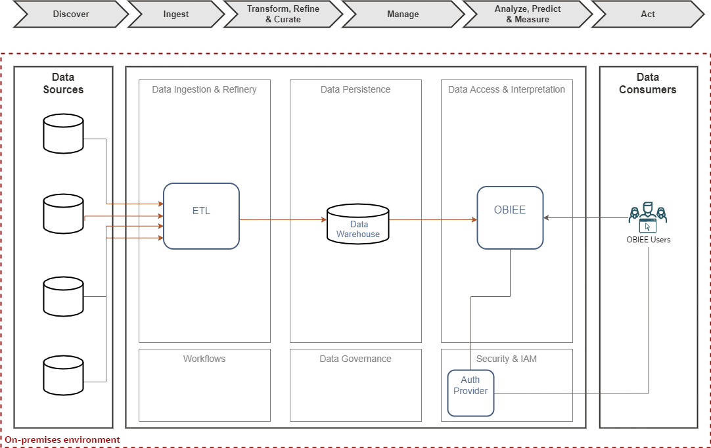
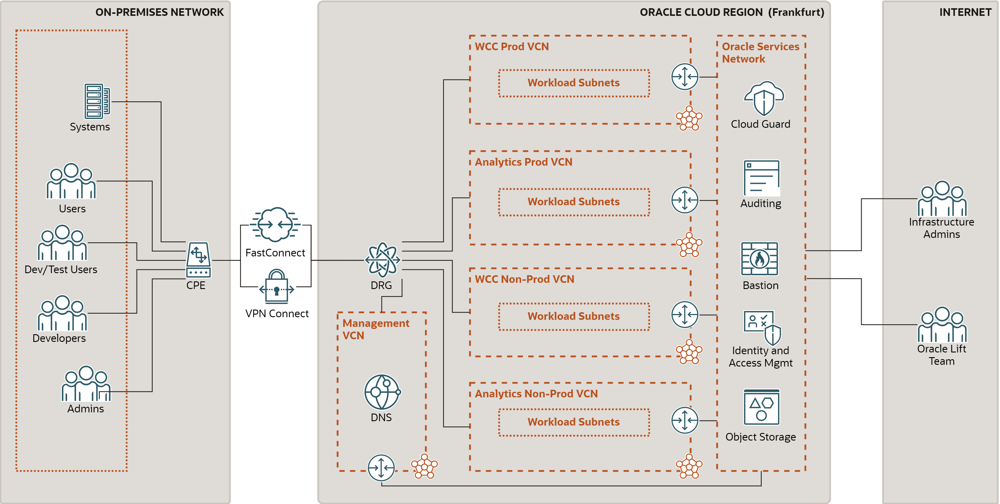

# Document Control

## Version Control

| Version | Author | Date | Comment |
|:--------|:-------|:-----|:--------|

## Team

| Name | Contact | Role | Company |
|:-----|:--------|:-----|:--------|

## Abbreviations and Acronyms

| Term                      | Meaning                     |
|:--------------------------|:----------------------------|
| OCI                       | Oracle Cloud Infrastructure |
| Database Cloud Service    | DBCS                        |
| Autonomous Data Warehouse | ADW                         |
| Oracle Data Integrator    | ODI                         |
| Oracle Analytics Cloud    | OAC                         |

## Document Purpose

This document provides a high-level solution definition for the Oracle solution and aims at describing the current state, to-be state as well as a potential 'Lift' project scope and timeline. The Lift parts will be described as a physical implementable solution. The intended purpose is to provide all parties involved with a clear and well-defined insight into the scope of work and intention of the project as it will be done as part of the Oracle Lift service.

The document may refer to a 'Workload', which summarizes the full technical solution for a customer (You) during a single engagement. The Workload is described in chapter [Workload Requirements and Architecture](#workload-requirements-and-architecture). In some cases, Oracle offers an implementation service called 'Lift', which has its dedicated scope and is typically a subset of the initial Workload. The Lift project, architecture, and implementation details are documented in the chapter Oracle Lift Project and Architecture and in the chapter Oracle Lift Implementation.

This is a living document, additional sections will be added as the engagement progresses resulting in a final Workload Architecture Document to be handed over at the end of the engagement. Where Oracle Lift is involved, detailed design sections will be added after customer acceptance of the content of the Workload Architecture Document as it stands at the time acceptance is requested.

The solution proposed in this document is about the migration of an existing Data Warehouse and BI system to Oracle Cloud Infrastructure (OCI).

A Company Making Everything should use this document to review the architecture and migration approach; and to validate the scope, assumptions, and timelines of the project.

The document will be also used as a reference by the Oracle Lift team when deploying the Database Cloud Service (DBCS), Autonomous Data Warehouse (ADW), Oracle Data Integrator (ODI), and Oracle Analytics Cloud (OAC) solution in Oracle Cloud Infrastructure (OCI); configuring the integration, connectivity, and identity; and planning the migration.

## Related Documents

# Business Context

## A Company Making Everything Background

## Workload Description

A Company Making Everything currently has Data Warehouse and BI system on-premises, based on Oracle technologies. It uses the system to provide insights into its business.

A Company Making Everything wants to migrate the existing Data Warehouse and BI system to Oracle Cloud, in order to modernize the system, provide new analytical features to users, and to better manage the costs of the system. It plans to migrate the Oracle Data Warehouse Database to Autonomous Data Warehouse (ADW) and the OBIEE and BI Publisher reports to Oracle Analytics Cloud (OAC).

The migration project includes provisioning of the OCI infrastructure, connectivity from the on-premises network to OCI, establishing Standby databases in OCI for operational data, migration of Data Warehouse database to ADW, migration of ODI from on-premises to ODI on OCI, and migration of OBIEE and BI Publisher dashboards and reports to OAC.

# Workload Requirements and Architecture

## Workload Requirements

### Current State

#### Overview

The logical architecture of the current Data Warehouse and BI system is depicted below.



-   **Data Sources** - represent the various data sources from which A Company Making Everything collects its data.

-   **ETL** - is the ETL tool used to extract data from various sources, transform them and load them into Data Warehouse.

-   **Data Warehouse** - a central location where all data is stored. This creates a single source of truth and allows for further manipulation of data.

-   **Oracle Business Intelligence Enterprise Edition (OBIEE)** - A Company Making Everything's central reporting platform. Used daily by A Company Making Everything to access various reports, dashboards, and visualizations.

-   **Auth Provider** - the Authentication and Authorization provider deployed by A Company Making Everything

-   **OBIEE Users** - represents the end users of OBIEE.

#### Data Sources

#### Analytics

#### ETL

### Functional Requirements

#### Data Warehouse

#### ODI

#### Analytics

### Non-Functional Requirements

#### Security

-   All communications, including intra-services, will be encrypted via SSL, with version TLS1.2 or higher. ``{=html}
-   The security certificates will be renewed and managed autonomously.
-   Users will be authenticated through security integration via SAML2.
-   Users will be authorized through security integration with LDAP groups.

#### Connectivity

-   Access to services should be possibly from A Company Making Everything network only.

#### Backup and Monitoring

-   Databases in OCI must be periodically backed up.
-   OAC models, reports, and dashboards must be periodically backed up.
-   The platform should support monitoring and self-diagnostic tool that monitors the correct operation of services.

#### Environments

-   Production environment (PRO).
-   Pre-Production environment (PRE).

#### Documentation

-   Document describing installed services and their configuration.
-   Document describing restore procedures (either for the whole solution or individual components).
-   Document describing ODI management including ETL workflow scheduling and monitoring.
-   User documentation for OAC outputs.

The document describing installed services must contain the following information:

-   Service endpoint names, and IP addresses of each service.
-   List of components and versions installed in each layer and environment.
-   URLs and open ports.
-   Location of logs and the main configurations.
-   Stop/start procedures and health checks of components.

## Future State Architecture

### Logical Architecture

#### Overview

The target logical architecture is shown below.


-   **OCI FastConnect and/or VPN Connect** must be established either before or as part of the project. Private connectivity from on-premises to OCI is required for Active Data Guard replication, for OAC accessing on-premises sources, and for users accessing OAC services.

-   **Data Source** will remain on premises

-   **Oracle Data Integrator (ODI)** will be deployed on OCI VM, using the Marketplace image.

-   **Autonomous Data Warehouse (ADW)** will become the primary data source for Dashboards in OAC. ODI will regularly load information into ADW. ADW will be also used for ODI Repository.

-   **Oracle Analytics Cloud (OAC)** will be A Company Making Everything's target central reporting platform in the cloud. Will be used daily by A Company Making Everything to access various reports, dashboards, and visualizations.

-   **Identity Cloud Service (IDCS)** will be used by OAC to authenticate and authorize OAC users.

-   **OCI Object Storage** (not shown) will be used as durable storage for database backups.

#### Identity Design

Users of Oracle Cloud services include OAC users (report consumers, developers, data analysts), OCI users (database and application services administrators), and administrators of OCI tenancy. All Oracle Cloud users and groups are managed in IDCS.

The proposed IDCS design is based on the separation of Production and Pre-Production users and groups, using different IDCS instances for each.

-   **Production IDCS Instance** `idcsprod` will be used by Production users and groups. It will be linked with the Production OAC instance and Production OCI services.

-   **Pre-Production IDCS Instance** `idcspreprod` will be used by Pre-Production users and groups. It will be linked with the Pre-Production OAC instance and Pre-Production OCI services.

-   **Primordial IDCS Instance** is the initial instance created when OCI tenancy is provisioned. This instance will be used only by tenancy administrators; it will not be used by users and administrators of Oracle Cloud services.

### Physical Architecture

#### Overview

The following diagram outlines the connectivity between the on-premises network and Oracle Cloud that will be used in the future architecture with the Oracle Data Warehouse and BI System, as well as WebCenter Content System.



-   **FastConnect** provides the dedicated, high-capacity connection between the on-premises network and Oracle Cloud. VPN Connect may provide a backup connection in case FastConnect is not available.

-   **Dynamic Routing Gateway (DRG)** is the virtual router that secures and manages traffic between on-premises networks and Virtual Cloud Networks (VCN) in Oracle Cloud.

-   **Service Gateways** allow private access to Oracle-managed services with public IP addresses from on-premises and from VCNs, without exposing the traffic to the public Internet.

-   **Virtual Cloud Networks (VCN) and Subnets** will contain private resources like compute instances, database systems, and private endpoints for Oracle-managed resources like Autonomous Data Warehouse and Oracle Analytics Cloud.

-   **Private DNS** maps IP addresses of Oracle Cloud private resources to hostnames. You may use a private DNS listener to resolve DNS requests to Oracle Cloud hostnames from on-premises.

-   **Bastion Service** provides secure access to private resources from over the Internet. Bastion uses SSH (22) to either connect to servers or tunnel HTTPS or SQL Net traffic. Bastion will be used by the Oracle Lift team to perform the migration, and by Infrastructure admins in break-glass scenarios.

-   **Cloud Guard** monitors OCI resources, identifies possible security or configuration problems, and it reports the discovered issues. Cloud Guard may be also configured to respond to identified problems.

#### Firewall Requirements

The following table shows traffic between A Company Making Everything's on-premises network and Oracle Cloud Infrastructure (OCI). Traffic from the Internet to OCI is prohibited with the exception of Bastion service.

| Purpose                             | Origin                      | Destination                      | Protocol      | Port |
|:------------------------------------|:----------------------------|:---------------------------------|:--------------|:-----|
| User access to OCI Console          | On-premises - User Browsers | OCI Frankfurt OSN - OCI Console  | HTTPS / TCP   | 443  |
| User access to OAC                  | On-premises - User Browsers | OCI Frankfurt VCN - OAC (1)      | HTTPS / TCP   | 443  |
| User access to ADW Tools            | On-premises - User Browsers | OCI Frankfurt VCN - ADW (3)      | HTTPS / TCP   | 443  |
| User access to IDCS (login)         | On-premises - User Browsers | OCI Frankfurt OSN - IDCS         | HTTPS / TCP   | 443  |
| User access to ODI instances        | On-premises - SSH Clients   | OCI Frankfurt VCN - ODI          | SSH / TCP     | 22   |
| SQL access to ADW                   | On-premises - DB clients    | OCI Frankfurt VCN - ADW (3)      | SQL / TCP     | 1522 |
| Calling OCI API                     | On-premises - automation    | OCI Frankfurt OSN - OCI API      | HTTPS / TCP   | 443  |
| Transfer of files to Object Storage | On-premises - DB servers    | OCI Frankfurt OSN - OCI API      | HTTPS / TCP   | 443  |
| DNS resolution of OCI hostnames     | On-premises - DNS requests  | OCI Frankfurt VCN - DNS listener | DNS / TCP,UDP | 53   |
| External access to VCN (4)          | Internet                    | OCI Frankfurt OSN - Bastion      | SSH / TCP     | 22   |
| External access to VCN (5)          | Internet                    | OCI Frankfurt VCN - Bastion      | SSH / TCP     | 22   |

-   (1) Oracle Analytics Cloud will be accessed from on-premises and OCI via Private Endpoint.

-   (2) Oracle Analytics Cloud will access private and on-premises data sources via Private Access Channel (PAC).

-   (3) Autonomous Data Warehouse will be accessed from on-premises and OCI via Private Endpoint.

-   (4) External access to VCNs via Bastion Service will be used by the Oracle Lift team and (exceptionally) by infra admins.

-   (5) In addition to Bastion Service, Bastion host is required for database and OBIEE migration.

A Company Making Everything is responsible for configuring its network to allow the above traffic between the on-premises network and OCI Frankfurt region over FastConnect and VPN Connect and to establish the routing from on-premises to OCI (BGP is strongly preferred).

##### Network Firewall

Optionally a managed Network Firewall can be leveraged to increase the security posture of the workload.

OCI Network Firewall is a next-generation managed network firewall and intrusion detection and prevention service for VCNs, powered by Palo Alto Networks®. The Network Firewall service offers simple setup and deployment and gives visibility into traffic entering the cloud environment (North-south network traffic) as well traffic between subnets (East-west network traffic).

Use network firewall and its advanced features together with other Oracle Cloud Infrastructure security services to create a layered network security solution.

A network firewall is a highly available and scalable instance that you create in the subnet of your choice. The firewall applies business logic to traffic that is specified in an attached firewall policy. Routing in the VCN is used to direct network traffic to and from the firewall.


Above a simple example is presented where a Network Firewall is deployed in a DMZ subnet and for which all incoming traffic via the DRG as well as all the outgoing traffic from the private subnet is routed to the Network Firewall so that policies are enforced to secure traffic.

### Architecture Decisions

When designing the future state architecture and sizing, we made the following decisions:

-   **OCI as Extension of On-premises Network.** To meet the connectivity requirements, OCI services will be accessible from an on-premises network only, via secure links such as FastConnect or VPN Connect. Application components such as DBCS, ODI, OAC, and ADW will be deployed with private endpoints.

-   **FastConnect or VPN Connect.** For real-time data transfer it is necessary to establish a FastConnect link, which provides sufficient bandwidth. We recommend using VPN Connect as a backup option only, to provide connectivity in case FastConnect fails.

-   **Edition of Identity Cloud Service (IDCS).** Depending on A Company Making Everything Identity needs, multiple options are available. In the rest of the document, IDCS Standard will be used

-   **Database for Data Warehouse.** We choose Autonomous Data Warehouse (ADW) as a data warehousing platform on OCI. ADW provides a fully managed, optimized data warehouse environment, that eliminates many manual operational and administration tasks. It also includes tools for analysts, data scientists, and low-code development (APEX).

-   **Edition of Oracle Analytics Cloud.** Enterprise Analytics is required as this option supports migration of the OBIEE model, data catalog, and BI Publisher reports into OAC. Self-Service Analytics supports data visualizations only.

### Sizing and Bill of Materials

#### Sizing

The following tables detail the size of the components that have been initially estimated to be used by Data Warehouse and Analytics in the Oracle Cloud. You may scale up and down the sizing for many components later (e.g. DBCS, ADW, OAC, ODI), to perform adjustments based on the observed utilization of services.

**Tenancy** components (shared with Web Center Content):

| Component              | Purpose                                        | Quantity | Notes (per component) |
|:-----------------------|:-----------------------------------------------|:--------:|:----------------------|
| FastConnect            | Connection with on-premises (to the main site) |    1     | 1 GB Port Speed (1)   |
| Identity Cloud Service | Identity and access management                 |   ???    | Enterprise Users      |

**Production** environment:

| Component                           | Purpose                                                   | Quantity | Notes (per component)               |
|:------------------------------------|:----------------------------------------------------------|:--------:|:------------------------------------|
| Oracle Analytics Cloud              | OAC with BI Publisher functionality                       |    1     | 2 OCPUs, Enterprise Analytics       |
| Block Volume (Balanced Performance) | Block Volume for Standby CDB database                     |    1     | 4096 GB                             |
| Object Storage                      | Object Storage DBCS and ADW migrations (2)                |    1     | 4 TB                                |
| Autonomous Data Warehouse           | ADW database                                              |    1     | 1 OCPU with Autoscaling enabled (3) |
| Exadata Storage                     | Storage for ADW database                                  |    1     | 1 TB (minimum)                      |
| Compute (VM.Standard2.4)            | ODI server                                                |    1     | 4 OCPUs                             |
| Block Volume (Balanced Performance) | Block Volume for ODI server                               |    1     | 512 GB                              |
| Compute (VM.Standard2.2)            | Bastion host (needed for migration only)                  |    1     | 2 OCPUs                             |
| Network Firewall                    | To improve security posture and filter traffic (optional) |    1     |                                     |

**Pre-Production** environment:

| Component                           | Purpose                                   | Quantity | Notes (per component)             |
|:------------------------------------|:------------------------------------------|:--------:|:----------------------------------|
| Oracle Analytics Cloud              | OAC with BI Publisher functionality       |    1     | 2 OCPUs, Enterprise Analytics (4) |
| Object Storage                      | Object Storage DBCS and ADW migrations(2) |    1     | 4 TB                              |
| Autonomous Data Warehouse           | ADW database                              |    1     | 1 OCPU with Autoscaling disabled  |
| Exadata Storage                     | Storage for ADW database                  |    1     | 1 TB (minimum)                    |
| Compute (VM.Standard2.4)            | ODI server                                |    1     | 4 OCPUs                           |
| Block Volume (Balanced Performance) | Block Volume for ODI server               |    1     | 512 GB                            |
| Compute (VM.Standard2.2)            | Bastion host (needed for migration only)  |    1     | 2 OCPUs                           |

#### Bill of Materials

The following tables summarises Oracle Cloud part numbers of the components that have been estimated to be used by Data Watehousing and Analytics in the Oracle Cloud. The numbers are aggregated across all environments.

| Part Number | Component                                                             | Unit of Measure   | Units |
|:------------|:----------------------------------------------------------------------|:------------------|------:|
| B88325      | Oracle Cloud Infrastructure - FastConnect 1 Gbps                      | Count             |     1 |
| B88514      | Oracle Cloud Infrastructure - Compute - Virtual Machine Standard - X7 | OCPUs             | 8 (7) |
| B89039      | Oracle Autonomous Data Warehouse                                      | OCPUs             |     2 |
| B89041      | Oracle Autonomous Data Warehouse - Exadata Storage                    | TB                |     2 |
| B90555      | Oracle Identity Cloud Service - Enterprise User                       | Users             |   ??? |
| B89637      | Oracle Analytics Cloud - Enterprise                                   | OCPUs             |     4 |
| B91627      | Oracle Cloud Infrastructure - Object Storage - Requests (5)           | Requests          |   n/a |
| B91628      | Oracle Cloud Infrastructure - Object Storage - Storage                | TB                |     8 |
| B91961      | Oracle Cloud Infrastructure - Block Volume Storage                    | GB                |  1024 |
| B91962      | Oracle Cloud Infrastructure - Block Volume Performance (6)            | VPU               | 91920 |
| B95403      | Oracle Cloud Infrastructure - Network Firewall Instance (optional)    | Instance per Hour |   744 |

-   (1) We assume the FastConnect 1 Gbps bandwidth is sufficient for both Data Guard and user traffic, however, we were unable to validate this assumption as we do not have information about the redo logs generated.

-   (2) Object Storage required for Database migration might be released after the migration finishes.

-   (3) With Autoscaling enabled, ADW will automatically scale to 3x the time of base OCPUs. With 1 OCPU, it can scale up to 3 OCPUs. We recommend enabling Autoscaling for production workloads.

-   (4) For OAC, 1 OCPU is recommended for Trials only. OAC instances with 1 OCPU are restricted in how many rows they may return (see https://docs.oracle.com/en-us/iaas/analytics-cloud/doc/create-services.html for details.

-   (5) We are unable to estimate the number of Object Storage - Requests. However, because the cost of Object Storage Requests is usually negligible compared with the cost of Object Storage - Storage, this metric is not important for estimates.

-   (6) We assume Balanced Performance will be used for Block Storage Volume Performance. With Balanced Performance, 1 GB of storage corresponds to 10 VPUs.

-   (7) An extra 4 OCPUs are required for Bastion hosts (2 for production, 2 for pre-production). The Bastion hosts are needed for the migration only and they may be terminated once the migration is finished.

## OCI Cloud Landing Zone Architecture

The design considerations for an OCI Cloud Landing Zone have to do with OCI and industry architecture best practices, along with A Company Making Everything specific architecture requirements that reflect the Cloud Strategy (hybrid, multi-cloud, etc). An OCI Cloud Landing zone involves a variety of fundamental aspects that have a broad level of sophistication. A good summary of a Cloud Landing Zone has been published in the [OCI User Guide](https://docs.oracle.com/en-us/iaas/Content/cloud-adoption-framework/landing-zone.htm).

### Naming Convention

A naming convention is an important part of any deployment to ensure consistency as well as security within your tenancy. Hence we jointly agree on a naming convention, matching Oracle's best practices and A Company Making Everything requirements.

Please find the agreed naming convention in the chapter [Resource Naming Convention](#resource-naming-convention).

### Security and Identity Management

This chapter covers the Security and Identity Management definitions and resources which will be implemented for A Company Making Everything.

#### Universal Security and Identity and Access Management Principles

-   Groups will be configured at the tenancy level and access will be governed by policies configured in OCI.
-   Any new project deployment in OCI will start with the creation of a new compartment. Compartments follow a hierarchy, and the compartment structure will be decided as per the application requirements.
-   It is also proposed to keep any shared resources, such as Object Storage, Networks, etc. in a shared services compartment. This will allow the various resources in different compartments to access and use the resources deployed in the shared services compartment and user access can be controlled by policies related to specific resource types and user roles.
-   Policies will be configured in OCI to maintain the level of access/control that should exist between resources in different compartments. These will also control user access to the various resources deployed in the tenancy.
-   The tenancy will include a pre-provisioned Identity Cloud Service (IDCS) instance (the primary IDCS instance) or, where applicable, the Default Identity Domain. Both provide access management across all Oracle cloud services for IaaS, PaaS, and SaaS cloud offerings.
-   The primary IDCS or the Default Identity Domain will be used as the access management system for all users administrating (OCI Administrators) the OCI tenant.

#### Authentication and Authorization for OCI

Provisioning of respective OCI administration users will be handled by A Company Making Everything.

##### User Management

Only OCI Administrators are granted access to the OCI Infrastructure. As a good practice, these users are managed within the pre-provisioned and pre-integrated Oracle Identity Cloud Service (primary IDCS) or, where applicable, the OCI Default Identity Domain, of OCI tenancy. These users are members of groups. IDCS Groups can be mapped to OCI groups while Identity Domains groups do not require any mapping. Each mapped group membership will be considered during login.

**Local Users**

The usage of OCI Local Users is not recommended for the majority of users and is restricted to a few users only. These users include the initial OCI Administrator created during the tenancy setup and additional emergency administrators.

**Local Users are considered Emergency Administrators and should not be used for daily administration activities!**

**No additional users are to be, nor should be, configured as local users.**

**A Company Making Everything is responsible to manage and maintain local users for emergency use cases.**

**Federated Users**

Unlike Local Users, Federated Users are managed in the Federated or Enterprise User Management system. In the OCI User list Federated Users may be distinguished by a prefix that consists of the name of the federated service in lower case, a '/' character followed by the user name of the federated user, for example:

`oracleidentityservicecloud/user@example.com`

In order to provide the same attributes (OCI API Keys, Auth Tokens, Customer Secret Keys, OAuth 2.0 Client Credentials, and SMTP Credentials) for Local and *Federated Users* federation with third-party Identity Providers should only be done in the pre-configured primary IDCS or the Default Identity Domain where applicable.

All users have the same OCI-specific attributes (OCI API Keys, Auth Tokens, Customer Secret Keys, OAuth 2.0 Client Credentials, and SMTP Credentials).

OCI Administration users should only be configured in the pre-configured primary IDCS or the Default Identity Domain where applicable.

**Note:** Any federated user can be a member of 100 groups only. The OCI Console limits the number of groups in a SAML assertion to 100 groups. User Management in the Enterprise Identity Management system will be handled by A Company Making Everything.

**Authorization**

In general, policies hold permissions granted to groups. Policy and Group naming follows the Resource Naming Conventions.

**Tenant Level Authorization**

The policies and groups defined at the tenant level will provide access to administrators and authorized users, to manage or view resources across the entire tenancy. Tenant-level authorization will be granted to tenant administrators only.

These policies follow the recommendations of the [CIS Oracle Cloud Infrastructure Foundations Benchmark v1.2.0, recommendations 1.1, 1.2, 1.3](https://www.cisecurity.org/cis-benchmarks).

**Service Policy**

A Service Policy is used to enable services at the tenancy level. It is not assigned to any group.

**Shared Compartment Authorization**

Compartment-level authorization for the cmp-shared compartment structure uses the following specific policies and groups.

Apart from tenant-level authorization, authorization for the cmp-shared compartment provides specific policies and groups. In general, policies will be designed so that lower-level compartments are not able to modify the resources of higher-level compartments.

Policies for the cmp-shared compartment follow the recommendations of the [CIS Oracle Cloud Infrastructure Foundations Benchmark v1.2.0, recommendations 1.1, 1.2, 1.3](https://www.cisecurity.org/cis-benchmarks).

**Compartment Level Authorization**

Apart from tenant-level authorization, compartment-level authorization provides compartment structure-specific policies and groups. In general, policies will be designed so that lower-level compartments are not able to modify the resources of higher-level compartments.

**Authentication and Authorization for Applications and Databases**

Application (including Compute Instances) and Database User management are completely separate and done outside of the primary IDCS or Default Identity Domain. The management of these users is the sole responsibility of A Company Making Everything using the application, compute instance, and database-specific authorization.

#### Security Posture Management

**Oracle Cloud Guard**

Oracle Cloud Guard Service will be enabled using the pcy-service policy and with the following default configuration. Customization of the Detector and Responder Recipes will result in clones of the default (Oracle Managed) recipes.

Cloud Guard default configuration provides a number of good settings. It is expected that these settings may not match A Company Making Everything's requirements.

**Targets**

In accordance with the [CIS Oracle Cloud Infrastructure Foundations Benchmark, v1.2.0, Chapter 3.15](https://www.cisecurity.org/cis-benchmarks), Cloud Guard will be enabled in the root compartment.

**Detectors**

The Oracle Default Configuration Detector Recipes and Oracle Default Activity Detector Recipes are implemented. To better meet the requirements, the default detectors must be cloned and configured by A Company Making Everything.

**Responder Rules**

The default Cloud Guard Responders will be implemented. To better meet the requirements, the default detectors must be cloned and configured by A Company Making Everything.

**Vulnerability Scanning Service**

In accordance with the [CIS Oracle Cloud Infrastructure Foundations Benchmark, v1.2.0, OCI Vulnerability Scanning](https://www.cisecurity.org/cis-benchmarks) will be enabled using the pcy-service policy.

Compute instances that should be scanned *must* implement the *Oracle Cloud Agent* and enable the *Vulnerability Scanning plugin*.

**OCI OS Management Service**

Required policy statements for OCI OS Management Service are included in the pcy-service policy.

By default, the *OS Management Service Agent plugin* of the *Oracle Cloud Agent* is enabled and running on current Oracle Linux 6, 7, 8, and 9 platform images.

#### Monitoring, Auditing, and Logging

In accordance with the [CIS Oracle Cloud Infrastructure Foundations Benchmark, v1.2.0, Chapter 3 Logging and Monitoring](https://www.cisecurity.org/cis-benchmarks) the following configurations will be made:

-   OCI Audit log retention period set to 365 days.
-   At least one notification topic and subscription to receive monitoring alerts.
-   Notification for Identity Provider changes.
-   Notification for IdP group mapping changes.
-   Notification for IAM policy changes.
-   Notification for IAM group changes.
-   Notification for user changes.
-   Notification for VCN changes.
-   Notification for changes to route tables.
-   Notification for security list changes.
-   Notification for network security group changes.
-   Notification for changes to network gateways.
-   VCN flow logging for all subnets.
-   Write level logging for all Object Storage Buckets.
-   Notification for Cloud Guard detected problems.
-   Notification for Cloud Guard remedied problems.

For IDCS or OCI Identity Domain Auditing events, the respective Auditing API can be used to retrieve all required information.

#### Data Encryption

All data will be encrypted at rest and in transit. Encryption keys can be managed by Oracle or the customer and will be implemented for identified resources.

##### Key Management

All keys for **OCI Block Volume**, **OCI Container Engine for Kubernetes**, **OCI Database**, **OCI File Storage**, **OCI Object Storage**, and **OCI Streaming** are centrally managed in a shared or a private virtual vault will be implemented and placed in the compartment cmp-security.

**Object Storage Security**

For Object Storage security the following guidelines are considered.

-   **Access to Buckets** -- Assign least privileged access for IAM users and groups to resource types in the object-family (Object Storage Buckets & Object)
-   **Encryption at rest** -- All data in the Object Storage is encrypted at rest using AES-256 and is on by default. This cannot be turned off and objects are encrypted with a master encryption key.

**Data Residency**

It is expected that data will be held in the respective region and additional steps will be taken when exporting the data to other regions to comply with the applicable laws and regulations. This should be reviewed for every project onboard into the tenancy.

#### Operational Security

**Security Zones**

Whenever possible OCI Security Zones will be used to implement a security compartment for Compute instances or Database resources. For more information on Security Zones refer to the *Oracle Cloud Infrastructure User Guide* chapter on [Security Zones](https://docs.oracle.com/en-us/iaas/security-zone/using/security-zones.htm).

**Remote Access to Compute Instances or Private Database Endpoints**

To allow remote access to Compute Instances or Private Database Endpoints, the OCI Bastion will be implemented for defined compartments.

To be able to use OCI services for OS management, Vulnerability Scanning, Bastion Service, etc. it is highly recommended to implement the Oracle Cloud Agent as documented in the *Oracle Cloud Infrastructure User Guide* chapter [Managing Plugins with Oracle Cloud Agent](https://docs.oracle.com/en-us/iaas/Content/Compute/Tasks/manage-plugins.htm).

#### Network Time Protocol Configuration for Compute Instance

Synchronized clocks are a necessity for securely operating environments. OCI provides a Network Time Protocol (NTP) server using the OCI global IP number 169.254.169.254. All compute instances should be configured to use this NTP service.

#### Regulations and Compliance

A Company Making Everything is responsible for setting the access rules to services and environments that require stakeholders’ integration to the tenancy to comply with all applicable regulations. Oracle will support in accomplishing this task.

# Oracle Lift Implementation

## Disclaimer

As part of the Oracle Lift Project, any scope change against this document needs to be agreed upon by both A Company Making Everything and Oracle. Oracle can reject scope changes for any reason and it may design and implement an originally agreed scope only. A change of scope may impact agreed timelines and budget. Any change also needs to be technically feasible.

## Scope

This section describes services that Oracle Lift will provide as part of the Data Warehouse and BI migration project. These are marked as "Oracle Lift Activities".

Furthermore, there are activities that must be performed either by Oracle Consulting (OC) as the implementation partner, or by A Company Making Everything personnel. These activities are marked as "Activities not Provided by Oracle Lift".

### Infrastructure

**Oracle Lift Activities:**

-   Create compartments, groups, and policies.
-   Support provisioning and configuration of FastConnect and VPN Connect (task shared with WCC project).
-   Create VCNs, subnets, DRG and other gateways, security rules & NSG, and route tables.
-   Create Bastion service and sessions to reach private resources.
-   Configure Private DNS listener for DNS queries from on-premises.
-   Provision Production and Pre-Production ADW instances with Private Endpoint.
-   Provision Production and Pre-Production ODI Marketplace instances, with a repository in ADW.
-   Provision Production and Pre-Production OAC instances with Private Endpoint and Private Access Channel (PAC).
-   Provision Object Storage buckets for Standby instantiation and ADW migration.
-   Create and configure Cloud Guard with the default configuration.

**Activities Not Provided by Oracle Lift:**

-   Provision and configure FastConnect and VPN Connect.
-   Configure on-premises network, routers, firewalls, resolvers, and DNS.
-   Test connectivity from on-premises to OCI services.
-   Registering DNS entry for OAC Vanity URL hostname.
-   Purchasing certificate matching OAC Vanity URL hostname (for SSL).

### Identity and Access Management

**Oracle Lift Activities:**

-   Create secondary IDCS instances for Production and Pre-Production users and groups.

**Activities Not Provided by Oracle Lift:**

-   Configure and test SAML2 integration between secondary IDCS instances and Shibboleth as an identity provider (SSO).
-   Implement and test provisioning of users and groups from LDAP to IDCS secondary instances.
-   Map IDCS groups to OCI IAM groups.
-   Map IDCS groups to OAC roles.

### Data Warehouse Database Migration

**Oracle Lift Activities:**

-   Migration of A Company Making Everything database to ADW for all environments, Pre-Production and Production.
-   Validate the migration was performed successfully.

**Activities Not Provided by Oracle Lift:**

-   None - Data Warehouse database migration to ADW is fully delivered by Oracle Lift.

### Oracle Data Integrator Migration

**Oracle Lift Activities:**

Migration to ODI Marketplace and deployment in all environments, Pre-Production, and Production.

-   Technical Migration of the Pre-production repository
-   Configuration of connections.
-   Technical validation tests.
-   Deploy in the rest of the environments of the ODI repository and configuration of connections.

**Activities Not Provided by Oracle Lift:**

-   Functional Testing.
-   Functional updates or modifications.

### OBIEE Migration

**Oracle Lift Activities:**

Migration from OBIEE to OAC and deploy in all environments, Pre-Production, and Production.

-   Technical Migration of the production repository and catalog, from OBIEE 12.2.0.4 to OAC.
-   Review Errors and Warnings of the repository.
-   Configuration of connections pools.
-   Revision Warnings/Errors.
-   Technical validation tests of 3 Dashboards.
-   Deploy in the rest of the environments (Pre-Production) of the repository and catalog shared and configuration of connections.
-   Management & Coordinate tasks with Oracle Consulting.

**Activities Not Provided by Oracle Lift:**

-   Migrate Publisher Catalog to OAC.
-   Connections configuration for Publisher.
-   Technical validation tests of BI Publisher connections and sample reports.
-   Functional Testing.
-   Functional updates or modifications.
-   Configuration of security and mapping of OAC roles with groups of OBIEE.
-   Review of BI Publisher templates.
-   Configuration of Vanity URL for instances of OAC.
-   Implementation of automated OAC snapshots for backups of OAC content.

### Documentation

**Oracle Lift Activities:**

-   Deployment reference document, providing details of provisioned infrastructure components.
-   Technical migration document, covering ADW, ODI, and OAC migrations.

## Assumptions

When scoping the Oracle Lift Project, we made the following key assumptions.

### Generic Assumptions

-   Oracle Lift Project will perform migration of existing components and functions only; it will not implement new components and new functionality.

### Infrastructure

-   A Company Making Everything has provisioned OCI tenancy with sufficient limits for OCI services described in this document.
-   A Company Making Everything configured its on-premises network (routers, firewalls, DNS) for the connectivity of services running on-premises and in OCI.
-   Oracle Lift Team members will receive access to A Company Making Everything's OCI tenancy and they will have sufficient privileges for provisioning and configuring OCI services.

### Identity and Access Management

### Data Warehouse Database Migration

-   A Company Making Everything database meets the requirements for migration to Autonomous Data Warehouse. You can use Oracle Autonomous Database Schema Advisor to test for objects that cannot be migrated.

### Oracle Data Integrator Migration

-   Connections to sources will be available.
-   ODI will only have as a source the ADG Standby database in OCI.
-   Deployment of target database for Data warehouse.
-   Migration strategy and coordination with project teams will be done by Oracle Consulting.
-   The Pre-production environment will be migrated and deployed in the rest, the Production environment.
-   Oracle Lift will only perform technical, not functional tests.

### OBIEE Migration

-   OAC Dashboards will only access Autonomous Datawarehouse in Cloud.
-   Security in IDCS will have been configured prior to migration.
-   The Production environment will be migrated and deployed in the Pre-Production environment.
-   Oracle Lift will only perform technical, not functional tests.
-   OBIEE does not use any layout customizations with CSS.

## Success Criteria

The following criteria will be used to determine the successful outcome of the Data Warehouse and BI Migration Project.

-   Infrastructure and components described in this document are provisioned.
-   ADW database in OCI is migrated from A Company Making Everything's database.
-   ODI mappings and tasks are migrated from on-premises to ODI Marketplace in OCI and they run without errors.
-   OBIEE dashboards are migrated to OAC and they run without errors.
-   Users have access to dashboards as in the current system.

## Timelines

The high-level plan for the Oracle Lift Project is shown in the following diagram.

Please note the dependency on the provisioned FastConnect. Although connectivity and network configuration both in OCI and on-premises is part of the project, FastConnect provisioning should start well before the other activities. It is our experience that FastConnect provisioning could take 4 or more weeks and delay depending on tasks.

## Deployment Build

### Resource Naming Convention

Oracle recommends the following Resource Naming Convention:

-   The name segments are separated by “-“
-   Within a name segment avoid using `<space>`{=html} and “.”
-   Where possible intuitive/standard abbreviations should be considered (e.g. “shared“ compared to "shared.cloud.team”)
-   When referring to the compartment full path, use “:” as a separator, e.g. cmp-shared:cmp-security

Some examples of naming are given below:

-   cmp-shared
-   cmp-\<workload\>
-   cmp-networking

The patterns used are these:

-   \<resource-type\>-\<environment\>-\<location\>-\<purpose\>
-   \<resource-type\>-\<environment\>-\<source-location\>-\<destination-location\>-\<purpose\>
-   \<resource-type\>-\<entity/sub-entity\>-\<environment\>-\<function/department\>-\<project\>-\<custom\>
-   \<resource-type\>-\<environment\>-\<location\>-\<purpose\>

Abbreviations per resource type are listed below. This list may not be complete.

| Resource type                      | Abbreviation       | Example                                                     |
|------------------------------------|--------------------|-------------------------------------------------------------|
| Bastion Service                    | bst                | bst-\<location\>-\<network\>                                |
| Block Volume                       | blk                | blk-\<location\>-\<project\>-\<purpose\>                    |
| Compartment                        | cmp                | cmp-shared, cmp-shared-security                             |
| Customer Premise Equipment         | cpe                | cpe-\<location\>-\<destination\>                            |
| DNS Endpoint Forwarder             | dnsepf             | dnsepf-\<location\>                                         |
| DNS Endpoint Listener              | dnsepl             | dnsepl-\<location\>                                         |
| Dynamic Group                      | dgp                | dpg-security-functions                                      |
| Dynamic Routing Gateway            | drg                | drg-prod-\<location\>                                       |
| Dynamic Routing Gateway Attachment | drgatt             | drgatt-prod-\<location\>-\<source_vcn\>-\<destination_vcn\> |
| Fast Connect                       | fc# \<# := 1...n\> | fc0-\<location\>-\<destination\>                            |
| File Storage                       | fss                | fss-prod-\<location\>-\<project\>                           |
| Internet Gateway                   | igw                | igw-dev-\<location\>-\<project\>                            |
| Jump Server                        | js                 | js-\<location\>-xxxxx                                       |
| Load Balancer                      | lb                 | lb-prod-\<location\>-\<project\>                            |
| Local Peering Gateway              | lpg                | lpg-prod-\<source_vcn\>-\<destination_vcn\>                 |
| NAT Gateway                        | nat                | nat-prod-\<location\>-\<project\>                           |
| Network Security Group             | nsg                | nsg-prod-\<location\>-waf                                   |
| Managed key                        | key                | key-prod-\<location\>-\<project\>-database01                |
| OCI Function Application           | fn                 | fn-security-logs                                            |
| Object Storage Bucket              | bkt                | bkt-audit-logs                                              |
| Policy                             | pcy                | pcy-services, pcy-tc-security-administration                |
| Region Code, Location              | xxx                | fra, ams, zch \# three letter region code                   |
| Routing Table                      | rt                 | rt-prod-\<location\>-network                                |
| Secret                             | sec                | sec-prod-wls-admin                                          |
| Security List                      | sl                 | sl-\<location\>                                             |
| Service Connector Hub              | sch                | sch-\<location\>                                            |
| Service Gateway                    | sgw                | sgw-\<location\>                                            |
| Subnet                             | sn                 | sn-\<location\>                                             |
| Tenancy                            | tc                 | tc                                                          |
| Vault                              | vlt                | vlt-\<location\>                                            |
| Virtual Cloud Network              | vcn                | vcn-\<location\>                                            |
| Virtual Machine                    | vm                 | vm-xxxx                                                     |
|                                    |                    |                                                             |

For the Data Warehouse and BI system we will use the application name `dwh`. For the shared management components, we will use the application name `mgmt`. We will also use `prod` for the production environment and `preprod` for the pre-production environment.

Words are separated by a hyphen `-`, with the exception of resources that do not support hyphens (such as OAC instances). Only ASCII lowercase letters `[a-z]` and numerical digits `[0-9]` will be used.

**Note:** Resource names are limited to 100 characters.

#### Group Names

OCI Group Names should follow the naming scheme of the Enterprise Identity Management system for Groups or Roles.

Examples of global groups are:

-   \<prefix\>-\<purpose\>-admins
-   \<prefix\>-\<purpose\>-users

For departmental groups:

-   \<prefix\>-\<compartment\>-\<purpose\>-admins
-   \<prefix\>-\<compartment\>-\<purpose\>-users

The value for \<prefix\> or the full names **must be agreed** with A Company Making Everything.

### Compartments

Compartments are logical collections of OCI resources, used for isolating the resources, managing access, and monitoring usage and billing. Typically, compartments correspond to projects, application domains, or departments. Since OCI groups and compartments are used to manage access to OCI resources, they should be aligned with the operating model of your IT organization.


| Name             | Parent Compartment | Description                                             | Tags             |
|:-----------------|:-------------------|:--------------------------------------------------------|:-----------------|
| cmp-dwh          | root               | Parent compartment for DWH/BI resources                 | application:dwh  |
| cmp-dwh-prod     | cmp-dwh            | Sub-compartment for DWH/BI production components        | application:dwh  |
| cmp-dwh-preprod  | cmp-dwh            | Sub-compartment for DWH/BI pre-production components    | application:dwh  |
| cmp-mgmt         | root               | Parent compartment for shared Management resources      | application:mgmt |
| cmp-mgmt-network | cmp-mgmt           | Sub-compartment for shared Management network resources | application:mgmt |

### Groups

| Name               | Authentication | Description                                                      | Tags             |
|:-------------------|:---------------|:-----------------------------------------------------------------|:-----------------|
| group-dwh-admins   | IDCS/IAM (TBD) | DWH/BI Administrators with all privileges                        | application:dwh  |
| group-dwh-prod     | IDCS/IAM (TBD) | DWH/BI Application administrators for production environment     | application:dwh  |
| group-dwh-preprod  | IDCS/IAM (TBD) | DWH/BI Application administrators for pre-production environment | application:dwh  |
| group-mgmt-admins  | IDCS/IAM (TBD) | Management Administrators with all privileges                    | application:mgmt |
| group-mgmt-network | IDCS/IAM (TBD) | Management Network administrators                                | application:mgmt |

### Policies

| Name                      | Statements                                                                                              | Compartment | Description                   | Tags |
|:--------------------------|:--------------------------------------------------------------------------------------------------------|:------------|:------------------------------|:-----|
| policy-group-dwh-admins   | allow group group-dwh-admins to manage all-resources in compartment cmp-dwh                             | root        | Policy for group-dwh-admins   |      |
|                           | allow group group-dwh-admins to use network-family in compartment cmp-mgmt-network                      |             |                               |      |
|                           | allow group group-dwh-admins to inspect work-requests in tenancy                                        |             |                               |      |
|                           | allow group group-dwh-admins to use tag-namespaces in tenancy                                           |             |                               |      |
|                           | allow group group-dwh-admins to use cloud-shell in tenancy                                              |             |                               |      |
| policy-group-dwh-prod     | allow group group-dwh-prod to manage autonomous-database-family in compartment cmp-dwh-prod             | cmp-dwh     | Policy for group-dwh-prod     |      |
|                           | allow group group-dwh-prod to manage analytics-instances in compartment cmp-dwh-prod                    |             |                               |      |
|                           | allow group group-dwh-prod to manage analytics-instance-work-requests in compartment cmp-dwh-prod       |             |                               |      |
|                           | allow group group-dwh-prod to manage instance-family in compartment cmp-dwh-prod                        |             |                               |      |
|                           | allow group group-dwh-prod to manage volume-family in compartment cmp-dwh-prod                          |             |                               |      |
|                           | allow group group-dwh-prod to manage object-family in compartment cmp-dwh-prod                          |             |                               |      |
|                           | allow group group-dwh_prod to manage bastion in compartment cmp-dwh-prod                                |             |                               |      |
|                           | allow group group-dwh_prod to manage bastion-session in compartment cmp-dwh-prod                        |             |                               |      |
|                           | allow group group-dwh-prod to use network-family in compartment cmp-mgmt-network                        |             |                               |      |
|                           | allow group group-dwh-prod to inspect work-requests in tenancy                                          |             |                               |      |
|                           | allow group group-dwh-prod to use tag-namespaces in tenancy                                             |             |                               |      |
|                           | allow group group-dwh-prod to use cloud-shell in tenancy                                                |             |                               |      |
| policy-group-dwh-preprod  | allow group group-dwh-preprod to manage autonomous-database-family in compartment cmp-dwh-preprod       | cmp-dwh     | Policy for group-dwh-preprod  |      |
|                           | allow group group-dwh-preprod to manage analytics-instances in compartment cmp-dwh-preprod              |             |                               |      |
|                           | allow group group-dwh-preprod to manage analytics-instance-work-requests in compartment cmp-dwh-preprod |             |                               |      |
|                           | allow group group-dwh-preprod to manage instance-family in compartment cmp-dwh-preprod                  |             |                               |      |
|                           | allow group group-dwh-preprod to manage volume-family in compartment cmp-dwh-preprod                    |             |                               |      |
|                           | allow group group-dwh-preprod to manage object-family in compartment cmp-dwh-preprod                    |             |                               |      |
|                           | allow group group-dwh_preprod to manage bastion in compartment cmp-dwh-preprod                          |             |                               |      |
|                           | allow group group-dwh_preprod to manage bastion-session in compartment cmp-dwh-preprod                  |             |                               |      |
|                           | allow group group-dwh-preprod to use network-family in compartment cmp-mgmt-network                     |             |                               |      |
|                           | allow group group-dwh-preprod to inspect work-requests in tenancy                                       |             |                               |      |
|                           | allow group group-dwh-preprod to use tag-namespaces in tenancy                                          |             |                               |      |
|                           | allow group group-dwh-preprod to use cloud-shell in tenancy                                             |             |                               |      |
| policy-group-mgmt-admins  | allow group group-mgmt-admins to manage all-resources in compartment cmp-mgmt                           | root        | Policy for group-mgmt-admins  |      |
|                           | allow group group-mgmt-admins to use tag-namespaces in tenancy                                          |             |                               |      |
|                           | allow group group-mgmt-admins to use cloud-shell in tenancy                                             |             |                               |      |
| policy-group-mgmt-network | allow group group-mgmt-network to manage virtual-network-family in compartment cmp-mgmt-network         | cmp-mgmt    | Policy for group-mgmt-network |      |
|                           | allow group group-mgmt-network to manage drgs in compartment cmp-mgmt-network                           |             |                               |      |
|                           | allow group group-mgmt-network to use tag-namespaces in tenancy                                         |             |                               |      |
|                           | allow group group-mgmt-network to use cloud-shell in tenancy                                            |             |                               |      |

### Users

No technical OCI users are required for the DWH and BI workload. Administrators, developers, and business users are out of the scope of this document. Hence the following table is empty.

| Name | Email | Group | Description |
|:-----|:------|:------|:------------|
|      |       |       |             |

### Tags

| Tag Namespace | Namespace Description        | Tag Keys    | Tag Description     | Cost Tracking | Tag Values                                 |
|:--------------|:-----------------------------|:------------|:--------------------|:--------------|:-------------------------------------------|
| Inventory     | Standard resource attributes | Application | Name of application | Yes           | dwh/wcc/mgmt                               |
|               |                              | Environment | Type of environment | Yes           | production/pre-production/test/development |

### Virtual Cloud Networks

The proposed network design is based on hub-and-spoke topology, with Dynamic Routing Gateway (DRG) `drg-fra-1` acting as the hub connecting the on-premises network and virtual cloud networks (VCN) in OCI. Production and pre-production environments are separated into production VCN `vcn-dwh-prod-fra` and pre-production VCN `vcn-dwh-preprod-fra`. Management VCN `vcn-mgmt-fra` contains shared services such as DNS listener. It also provides transit routing for the on-premises network to reach Oracle Services Network.


| Compartment      | VCN Name            | CIDR Block | DNS Label        | IGW | DRG | NGW | SGW | Region    | Tags             |
|:-----------------|:--------------------|:-----------|:-----------------|:----|:----|:----|:----|:----------|:-----------------|
| cmp-mgmt-network | vcn-dwh-prod-fra    | X.X.X.X/22 | vcndwhprodfra    | yes | yes | yes | yes | Frankfurt | application:dwh  |
| cmp-mgmt-network | vcn-dwh-preprod-fra | X.X.X.X/22 | vcndwhpreprodfra | yes | yes | yes | yes | Frankfurt | application:dwh  |
| cmp-mgmt-network | vcn-mgmt-fra        | X.X.X.X/22 | vcnmgmtfra       | no  | yes | no  | yes | Frankfurt | application:mgmt |

Note that Internet gateways in networks `vcn-dwh-prod-fra` and `vcn-dwh-preprod-fra` may be terminated once the migration is finished. These gateways are needed for Bastion hosts which are used only during the database and OBIEE migration.

### Subnets

| Compartment      | VCN Name            | Subnet Name              | CIDR Block | Subnet Span | Type    | Security List Name          | Route Table Name            | Region    | Tags             |
|:-----------------|:--------------------|:-------------------------|:-----------|:------------|:--------|:----------------------------|:----------------------------|:----------|:-----------------|
| cmp-mgmt-network | vcn-dwh-prod-fra    | snet-dwh-prod-oac        | X.X.X.X/24 | Regional    | Private | sl-snet-dwh-prod-oac        | rt-snet-dwh-prod-oac        | Frankfurt | application:dwh  |
| cmp-mgmt-network | vcn-dwh-prod-fra    | snet-dwh-prod-db         | X.X.X.X/24 | Regional    | Private | sl-snet-dwh-prod-db         | rt-snet-dwh-prod-db         | Frankfurt | application:dwh  |
| cmp-mgmt-network | vcn-dwh-prod-fra    | snet-dwh-prod-etl        | X.X.X.X/24 | Regional    | Private | sl-snet-dwh-prod-etl        | rt-snet-dwh-prod-etl        | Frankfurt | application:dwh  |
| cmp-mgmt-network | vcn-dwh-prod-fra    | snet-dwh-prod-bastion    | X.X.X.X/24 | Regional    | Public  | sl-snet-dwh-prod-bastion    | rt-snet-dwh-prod-bastion    | Frankfurt | application:dwh  |
| cmp-mgmt-network | vcn-dwh-preprod-fra | snet-dwh-preprod-oac     | X.X.X.X/24 | Regional    | Private | sl-snet-dwh-preprod-oac     | rt-snet-dwh-preprod-oac     | Frankfurt | application:dwh  |
| cmp-mgmt-network | vcn-dwh-preprod-fra | snet-dwh-preprod-db      | X.X.X.X/24 | Regional    | Private | sl-snet-dwh-preprod-db      | rt-snet-dwh-preprod-db      | Frankfurt | application:dwh  |
| cmp-mgmt-network | vcn-dwh-preprod-fra | snet-dwh-preprod-etl     | X.X.X.X/24 | Regional    | Private | sl-snet-dwh-preprod-etl     | rt-snet-dwh-preprod-etl     | Frankfurt | application:dwh  |
| cmp-mgmt-network | vcn-dwh-preprod-fra | snet-dwh-preprod-bastion | X.X.X.X/24 | Regional    | Public  | sl-snet-dwh-preprod-bastion | rt-snet-dwh-preprod-bastion | Frankfurt | application:dwh  |
| cmp-mgmt-network | vcn-mgmt-fra        | snet-mgmt-dns            | X.X.X.X/24 | Regional    | Private | sl-snet-mgmt-dns            | rt-snet-mgmt-dns            | Frankfurt | application:mgmt |

### DNS Private Views

OCI automatically manages private views and it resolves hostnames within a VCN. To enable hostname resolution across VCNs and from on-premises, it is necessary to add private views to Management VCN's DNS resolver `vcn-mgmt-fra`.

| VCN          | DNS Resolver | Private View        | Compartment      | Description                             |
|:-------------|:-------------|:--------------------|:-----------------|:----------------------------------------|
| vcn-mgmt-fra | vcn-mgmt-fra | vcn-dwh-prod-fra    | cmp-mgmt-network | Resolve BI/DWH production hostnames     |
| vcn-mgmt-fra | vcn-mgmt-fra | vcn-dwh-preprod-fra | cmp-mgmt-network | Resolve BI/DWH pre-production hostnames |

### DNS Endpoint

| Name                  | Subnet        | Endpoint Type | NSG          | IPAddress(Listener/Forwarder) |
|:----------------------|:--------------|:--------------|:-------------|:------------------------------|
| vcnmgmtfradnslistener | snet-mgmt-dns | Listening     | nsg-mgmt-dns |                               |

### Dynamic Routing Gateways Attachment

| Name      | VCN                 | Compartment      | IPSEC/Virtual Circuit | Region    | Tags |
|:----------|:--------------------|:-----------------|:----------------------|-----------|------|
| drg-fra-1 |                     | cmp-mgmt-network | fc-fra-1              | Frankfurt |      |
| drg-fra-1 |                     | cmp-mgmt-network | vpn-fra-1             | Frankfurt |      |
| drg-fra-1 | vcn-dwh-prod-fra    | cmp-mgmt-network |                       | Frankfurt |      |
| drg-fra-1 | vcn-dwh-preprod-fra | cmp-mgmt-network |                       | Frankfurt |      |
| drg-fra-1 | vcn-mgmt-fra        | cmp-mgmt-network |                       | Frankfurt |      |

### Route Tables

| Name                        | Table Compartment | Destination CIDR        | Target Type      | Target Compartment | Target                  | Region    | Description                 | Tags | VCN Name |
|:----------------------------|:------------------|:------------------------|:-----------------|:-------------------|:------------------------|:----------|:----------------------------|:-----|:---------|
| rt-snet-dwh-prod-oac        | cmp-mgmt-network  | {on-premises CIDR}      | DRG              | cmp-mgmt-network   | drg-fra-1               | Frankfurt | On-premises traffic to DRG  |      |          |
| rt-snet-dwh-prod-oac        | cmp-mgmt-network  | {vcn-mgmt-fra CIDR}     | DRG              | cmp-mgmt-network   | drg-fra-1               | Frankfurt | Management traffic to DRG   |      |          |
| rt-snet-dwh-prod-oac        | cmp-mgmt-network  | All FRA Services in OSN | Service Gateway  | cmp-mgmt-network   | sgw-vcn-dwh-prod-fra    | Frankfurt | OSN traffic to SGW          |      |          |
| rt-snet-dwh-prod-db         | cmp-mgmt-network  | {on-premises CIDR}      | DRG              | cmp-mgmt-network   | drg-fra-1               | Frankfurt | On-premises traffic to DRG  |      |          |
| rt-snet-dwh-prod-db         | cmp-mgmt-network  | {vcn-mgmt-fra CIDR}     | DRG              | cmp-mgmt-network   | drg-fra-1               | Frankfurt | Management traffic to DRG   |      |          |
| rt-snet-dwh-prod-db         | cmp-mgmt-network  | All FRA Services in OSN | Service Gateway  | cmp-mgmt-network   | sgw-vcn-dwh-prod-fra    | Frankfurt | OSN traffic to SGW          |      |          |
| rt-snet-dwh-prod-db         | cmp-mgmt-network  | 0.0.0.0/0               | NAT              | cmp-mgmt-network   | nat-vcn-dwh-prod-fra    | Frankfurt | Other traffic to NAT        |      |          |
| rt-snet-dwh-prod-etl        | cmp-mgmt-network  | {on-premises CIDR}      | DRG              | cmp-mgmt-network   | drg-fra-1               | Frankfurt | On-premises traffic to DRG  |      |          |
| rt-snet-dwh-prod-etl        | cmp-mgmt-network  | {vcn-mgmt-fra CIDR}     | DRG              | cmp-mgmt-network   | drg-fra-1               | Frankfurt | Management traffic to DRG   |      |          |
| rt-snet-dwh-prod-etl        | cmp-mgmt-network  | All FRA Services in OSN | Service Gateway  | cmp-mgmt-network   | sgw-vcn-dwh-prod-fra    | Frankfurt | OSN traffic to SGW          |      |          |
| rt-snet-dwh-prod-etl        | cmp-mgmt-network  | 0.0.0.0/0               | NAT              | cmp-mgmt-network   | nat-vcn-dwh-prod-fra    | Frankfurt | Other traffic to NAT        |      |          |
| rt-snet-dwh-prod-bastion    | cmp-mgmt-network  | 0.0.0.0/0               | Internet Gateway | cmp-mgmt-network   | igw-vcn-dwh-prod-fra    | Frankfurt | Bastion traffic to Internet |      |          |
| rt-snet-dwh-preprod-oac     | cmp-mgmt-network  | {on-premises CIDR}      | DRG              | cmp-mgmt-network   | drg-fra-1               | Frankfurt | On-premises traffic to DRG  |      |          |
| rt-snet-dwh-preprod-oac     | cmp-mgmt-network  | {vcn-mgmt-fra CIDR}     | DRG              | cmp-mgmt-network   | drg-fra-1               | Frankfurt | Management traffic to DRG   |      |          |
| rt-snet-dwh-preprod-oac     | cmp-mgmt-network  | All FRA Services in OSN | Service Gateway  | cmp-mgmt-network   | sgw-vcn-dwh-preprod-fra | Frankfurt | OSN traffic to SGW          |      |          |
| rt-snet-dwh-preprod-db      | cmp-mgmt-network  | {on-premises CIDR}      | DRG              | cmp-mgmt-network   | drg-fra-1               | Frankfurt | On-premises traffic to DRG  |      |          |
| rt-snet-dwh-preprod-db      | cmp-mgmt-network  | {vcn-mgmt-fra CIDR}     | DRG              | cmp-mgmt-network   | drg-fra-1               | Frankfurt | Management traffic to DRG   |      |          |
| rt-snet-dwh-preprod-db      | cmp-mgmt-network  | All FRA Services in OSN | Service Gateway  | cmp-mgmt-network   | sgw-vcn-dwh-preprod-fra | Frankfurt | OSN traffic to SGW          |      |          |
| rt-snet-dwh-preprod-db      | cmp-mgmt-network  | 0.0.0.0/0               | NAT              | cmp-mgmt-network   | nat-vcn-dwh-preprod-fra | Frankfurt | Other traffic to NAT        |      |          |
| rt-snet-dwh-preprod-etl     | cmp-mgmt-network  | {on-premises CIDR}      | DRG              | cmp-mgmt-network   | drg-fra-1               | Frankfurt | On-premises traffic to DRG  |      |          |
| rt-snet-dwh-preprod-etl     | cmp-mgmt-network  | {vcn-mgmt-fra CIDR}     | DRG              | cmp-mgmt-network   | drg-fra-1               | Frankfurt | Management traffic to DRG   |      |          |
| rt-snet-dwh-preprod-etl     | cmp-mgmt-network  | All FRA Services in OSN | Service Gateway  | cmp-mgmt-network   | sgw-vcn-dwh-preprod-fra | Frankfurt | OSN traffic to SGW          |      |          |
| rt-snet-dwh-preprod-etl     | cmp-mgmt-network  | 0.0.0.0/0               | NAT              | cmp-mgmt-network   | nat-vcn-dwh-preprod-fra | Frankfurt | Other traffic to NAT        |      |          |
| rt-snet-dwh-preprod-bastion | cmp-mgmt-network  | 0.0.0.0/0               | Internet Gateway | cmp-mgmt-network   | igw-vcn-dwh-preprod-fra | Frankfurt | Bastion traffic to Internet |      |          |
| rt-snet-mgmt-dns            | cmp-mgmt-network  | {on-premises CIDR}      | DRG              | cmp-mgmt-network   | drg-fra-1               | Frankfurt | On-premises traffic to DRG  |      |          |
| rt-snet-mgmt-dns            | cmp-mgmt-network  | All FRA Services in OSN | Service Gateway  | cmp-mgmt-network   | sgw-vcn-dwh-prod-fra    | Frankfurt | OSN traffic to SGW          |      |          |

The text in curly brackets `{}` will be replaced by CIDR block(s) once IP address ranges are known.

### Network Security Groups

Network Security Groups (NSG) are preferred way of specifying firewall rules for traffic from and into compute, database, and other instances in VCNs.

| Compartment      | VCN                 | NSG Name           | Region    | Description                           | Tags             |
|:-----------------|:--------------------|:-------------------|:----------|:--------------------------------------|:-----------------|
| cmp-mgmt-network | vcn-dwh-prod-fra    | nsg-dwh-prod-db    | Frankfurt | NSG for production ODS and DWH DB     | application:dwh  |
| cmp-mgmt-network | vcn-dwh-preprod-fra | nsg-dwh-preprod-db | Frankfurt | NSG for pre-production ODS and DWH DB | application:dwh  |
| cmp-mgmt-network | vcn-mgmt-fra        | nsg-mgmt-dns       | Frankfurt | NSG for DNS listener                  | application:mgmt |

### NSG Rules (Egress)

| NSG Name           | Egress Type      | Destination             | Protocol | Source Port | Destination Port | Region    | Description                            | Tags |
|:-------------------|:-----------------|:------------------------|:---------|:------------|:-----------------|:----------|:---------------------------------------|:-----|
| nsg-dwh-prod-db    | Stateful/CIDR    | {on-premises CIDR}      | TCP      |             | 1521-1522        | Frankfurt | SQL Net access to on-premises (for DG) |      |
| nsg-dwh-prod-db    | Stateful/Service | All FRA Services in OSN | TCP      |             |                  | Frankfurt | All TCP traffic to OSN                 |      |
| nsg-dwh-preprod-db | Stateful/CIDR    | {on-premises CIDR}      | TCP      |             | 1521-1522        | Frankfurt | SQL Net access to on-premises (for DG) |      |
| nsg-dwh-preprod-db | Stateful/Service | All FRA Services in OSN | TCP      |             |                  | Frankfurt | All TCP traffic to OSN                 |      |

The text in curly brackets `{}` will be replaced by CIDR block(s) once IP address ranges are known.

### NSG Rules (Ingress)

| NSG Name           | Ingress Type  | Source                       | Protocol | Source Port | Destination Port | Region    | Description                              | Tags |
|:-------------------|:--------------|:-----------------------------|:---------|:------------|:-----------------|:----------|:-----------------------------------------|:-----|
| nsg-dwh-prod-db    | Stateful/CIDR | {on-premises CIDR}           | TCP      |             | 1521-1522        | Frankfurt | SQL Net access from on-premises          |      |
| nsg-dwh-prod-db    | Stateful/CIDR | {on-premises CIDR}           | TCP      |             | 443              | Frankfurt | HTTPS access from on-premises            |      |
| nsg-dwh-prod-db    | Stateful/CIDR | {vcn-dwh-prod-fra CIDR}      | TCP      |             | 1521-1522        | Frankfurt | SQL Net access from DWH/BI prod VCN      |      |
| nsg-dwh-prod-db    | Stateful/CIDR | {vcn-dwh-prod-fra CIDR}      | TCP      |             | 443              | Frankfurt | HTTPS access from DWH/BI prod VCN        |      |
| nsg-dwh-prod-db    | Stateful/CIDR | {snet-mgmt-bastion-dwh CIDR} | TCP      |             | 1521-1522        | Frankfurt | SQL Net access from Bastion subnet       |      |
| nsg-dwh-prod-db    | Stateful/CIDR | {snet-mgmt-bastion-dwh CIDR} | TCP      |             | 443              | Frankfurt | HTTPS access from Bastion subnet         |      |
| nsg-dwh-preprod-db | Stateful/CIDR | {on-premises CIDR}           | TCP      |             | 1521-1522        | Frankfurt | SQL Net access from on-premises          |      |
| nsg-dwh-preprod-db | Stateful/CIDR | {on-premises CIDR}           | TCP      |             | 443              | Frankfurt | HTTPS access from on-premises            |      |
| nsg-dwh-preprod-db | Stateful/CIDR | {vcn-dwh-preprod-fra CIDR}   | TCP      |             | 1521-1522        | Frankfurt | SQL Net access from DWH/BI preprod VCN   |      |
| nsg-dwh-preprod-db | Stateful/CIDR | {vcn-dwh-preprod-fra CIDR}   | TCP      |             | 443              | Frankfurt | HTTPS access from DWH/BI preprod VCN     |      |
| nsg-dwh-preprod-db | Stateful/CIDR | {snet-mgmt-bastion-dwh CIDR} | TCP      |             | 1521-1522        | Frankfurt | SQL Net access from Bastion subnet       |      |
| nsg-dwh-preprod-db | Stateful/CIDR | {snet-mgmt-bastion-dwh CIDR} | TCP      |             | 443              | Frankfurt | HTTPS access from Bastion subnet         |      |
| nsg-mgmt-dns       | Stateful/CIDR | {on-premises CIDR}           | TCP      |             | 53               | Frankfurt | DNS queries from on-premises over TCP    |      |
| nsg-mgmt-dns       | Stateful/CIDR | {on-premises CIDR}           | UDP      |             | 53               | Frankfurt | DNS queries from on-premises over UDP    |      |
| nsg-mgmt-dns       | Stateful/CIDR | {snet-mgmt-bastion-dwh CIDR} | TCP      |             | 53               | Frankfurt | DNS queries from Bastion subnet over TCP |      |
| nsg-mgmt-dns       | Stateful/CIDR | {snet-mgmt-bastion-dwh CIDR} | UDP      |             | 53               | Frankfurt | DNS queries from Bastion subnet over UDP |      |

The text in curly brackets `{}` will be replaced by CIDR block(s) once IP address ranges are known.

### Security Lists (Egress)

Security Lists complement the NSGs. They are used for services not supporting NSG (such as OAC or ODI Marketplace) and for default ICMP settings.

| Name                     | Compartment      | Egress Type      | Destination                 | Protocol | Source Port | Destination Port | VCN Name            | Region    | Description                        | tags |
|--------------------------|------------------|------------------|-----------------------------|----------|-------------|------------------|---------------------|-----------|------------------------------------|------|
| snet-dwh-prod-oac        | cmp-mgmt-network | Stateful/CIDR    | {snet-dwh-prod-db CIDR}     | TCP      |             | 1521-1522        | vcn-dwh-prod-fra    | Frankfurt | SQL Net access to DBs from OAC PAC |      |
| snet-dwh-prod-etl        | cmp-mgmt-network | Stateful/Service | All FRA Services in OSN     | TCP      |             |                  | vcn-dwh-prod-fra    | Frankfurt | All TCP traffic to OSN             |      |
| snet-dwh-prod-etl        | cmp-mgmt-network | Stateful/CIDR    | {snet-dwh-prod-db CIDR}     | TCP      |             | 1521-1522        | vcn-dwh-prod-fra    | Frankfurt | SQL Net access to DBs from ODI     |      |
| snet-dwh-prod-bastion    | cmp-mgmt-network | Stateful/CIDR    | {snet-dwh-prod-db CIDR}     | TCP      |             | 1521-1522        | vcn-dwh-prod-fra    | Frankfurt | SQL Net access to DBs from Bastion |      |
| snet-dwh-prod-bastion    | cmp-mgmt-network | Stateful/CIDR    | {snet-dwh-prod-db CIDR}     | TCP      |             | 443              | vcn-dwh-prod-fra    | Frankfurt | HTTPS access to DBs from Bastion   |      |
| snet-dwh-prod-bastion    | cmp-mgmt-network | Stateful/CIDR    | {snet-dwh-prod-db CIDR}     | TCP      |             | 22               | vcn-dwh-prod-fra    | Frankfurt | SSH access to DBs from Bastion     |      |
| snet-dwh-prod-bastion    | cmp-mgmt-network | Stateful/CIDR    | {snet-dwh-prod-etl CIDR}    | TCP      |             | 22               | vcn-dwh-prod-fra    | Frankfurt | SSH access to ODI from Bastion     |      |
| snet-dwh-prod-bastion    | cmp-mgmt-network | Stateful/CIDR    | {snet-dwh-prod-etl CIDR}    | TCP      |             | 5901-5910        | vcn-dwh-prod-fra    | Frankfurt | VNC access to ODI from Bastion     |      |
| snet-dwh-prod-bastion    | cmp-mgmt-network | Stateful/CIDR    | {snet-dwh-prod-oac CIDR}    | TCP      |             | 443              | vcn-dwh-prod-fra    | Frankfurt | HTTPS access to OAC from Bastion   |      |
| snet-dwh-preprod-oac     | cmp-mgmt-network | Stateful/CIDR    | {snet-dwh-preprod-db CIDR}  | TCP      |             | 1521-1522        | vcn-dwh-preprod-fra | Frankfurt | SQL Net access to DBs from OAC PAC |      |
| snet-dwh-preprod-etl     | cmp-mgmt-network | Stateful/Service | All FRA Services in OSN     | TCP      |             |                  | vcn-dwh-preprod-fra | Frankfurt | All TCP traffic to OSN             |      |
| snet-dwh-preprod-etl     | cmp-mgmt-network | Stateful/CIDR    | {snet-dwh-preprod-db CIDR}  | TCP      |             | 1521-1522        | vcn-dwh-preprod-fra | Frankfurt | SQL Net access to DBs from ODI     |      |
| snet-dwh-preprod-bastion | cmp-mgmt-network | Stateful/CIDR    | {snet-dwh-preprod-db CIDR}  | TCP      |             | 1521-1522        | vcn-dwh-preprod-fra | Frankfurt | SQL Net access to DBs from Bastion |      |
| snet-dwh-preprod-bastion | cmp-mgmt-network | Stateful/CIDR    | {snet-dwh-preprod-db CIDR}  | TCP      |             | 443              | vcn-dwh-preprod-fra | Frankfurt | HTTPS access to DBs from Bastion   |      |
| snet-dwh-preprod-bastion | cmp-mgmt-network | Stateful/CIDR    | {snet-dwh-preprod-db CIDR}  | TCP      |             | 22               | vcn-dwh-preprod-fra | Frankfurt | SSH access to DBs from Bastion     |      |
| snet-dwh-preprod-bastion | cmp-mgmt-network | Stateful/CIDR    | {snet-dwh-preprod-etl CIDR} | TCP      |             | 22               | vcn-dwh-preprod-fra | Frankfurt | SSH access to ODI from Bastion     |      |
| snet-dwh-preprod-bastion | cmp-mgmt-network | Stateful/CIDR    | {snet-dwh-preprod-etl CIDR} | TCP      |             | 5901-5910        | vcn-dwh-preprod-fra | Frankfurt | VNC access to ODI from Bastion     |      |
| snet-dwh-preprod-bastion | cmp-mgmt-network | Stateful/CIDR    | {snet-dwh-preprod-oac CIDR} | TCP      |             | 443              | vcn-dwh-preprod-fra | Frankfurt | HTTPS access to OAC from Bastion   |      |

The text in curly brackets `{}` will be replaced by CIDR block(s) once IP address ranges are known.

### Security Lists (Ingress)

Security Lists complement the NSGs. They are used for services not supporting NSG (such as OAC or ODI Marketplace) and for default ICMP settings.

| Name                        | Compartment      | Ingress Type  | Source                          | Protocol | Source Port | Destination Port | VCN Name            | Region    | Description                          | tags |
|-----------------------------|------------------|---------------|---------------------------------|----------|-------------|------------------|---------------------|-----------|--------------------------------------|------|
| sl-snet-dwh-prod-oac        | cmp-mgmt-network | Stateful/CIDR | 0.0.0.0/0                       | ICMP     |             | Type 3, Code 4   | vcn-dwh-prod-fra    | Frankfurt | Default: ICMP type 3, code 4         |      |
| sl-snet-dwh-prod-oac        | cmp-mgmt-network | Stateful/CIDR | {vcn-dwh-prod-fra CIDR}         | ICMP     |             | Type 3           | vcn-dwh-prod-fra    | Frankfurt | Default: ICMP type 3                 |      |
| sl-snet-dwh-prod-oac        | cmp-mgmt-network | Stateful/CIDR | 0.0.0.0/0                       | ICMP     |             | Type 8           | vcn-dwh-prod-fra    | Frankfurt | Default: ICMP type 8 (ping)          |      |
| sl-snet-dwh-prod-oac        | cmp-mgmt-network | Stateful/CIDR | {on-premises CIDR}              | TCP      |             | 443              | vcn-dwh-prod-fra    | Frankfurt | HTTPS access to OAC from on-premises |      |
| sl-snet-dwh-prod-oac        | cmp-mgmt-network | Stateful/CIDR | {snet-dwh-prod-bastion CIDR}    | TCP      |             | 443              | vcn-dwh-prod-fra    | Frankfurt | HTTPS access to OAC from Bastion     |      |
| sl-snet-dwh-prod-db         | cmp-mgmt-network | Stateful/CIDR | 0.0.0.0/0                       | ICMP     |             | Type 3, Code 4   | vcn-dwh-prod-fra    | Frankfurt | Default: ICMP type 3, code 4         |      |
| sl-snet-dwh-prod-db         | cmp-mgmt-network | Stateful/CIDR | {vcn-dwh-prod-fra CIDR}         | ICMP     |             | Type 3           | vcn-dwh-prod-fra    | Frankfurt | Default: ICMP type 3                 |      |
| sl-snet-dwh-prod-db         | cmp-mgmt-network | Stateful/CIDR | 0.0.0.0/0                       | ICMP     |             | Type 8           | vcn-dwh-prod-fra    | Frankfurt | Default: ICMP type 8 (ping)          |      |
| sl-snet-dwh-prod-etl        | cmp-mgmt-network | Stateful/CIDR | 0.0.0.0/0                       | ICMP     |             | Type 3, Code 4   | vcn-dwh-prod-fra    | Frankfurt | Default: ICMP type 3, code 4         |      |
| sl-snet-dwh-prod-etl        | cmp-mgmt-network | Stateful/CIDR | {vcn-dwh-prod-fra CIDR}         | ICMP     |             | Type 3           | vcn-dwh-prod-fra    | Frankfurt | Default: ICMP type 3                 |      |
| sl-snet-dwh-prod-etl        | cmp-mgmt-network | Stateful/CIDR | 0.0.0.0/0                       | ICMP     |             | Type 8           | vcn-dwh-prod-fra    | Frankfurt | Default: ICMP type 8 (ping)          |      |
| sl-snet-dwh-prod-etl        | cmp-mgmt-network | Stateful/CIDR | {on-premises CIDR}              | TCP      |             | 22               | vcn-dwh-prod-fra    | Frankfurt | SSH access to ODI from on-premises   |      |
| sl-snet-dwh-prod-etl        | cmp-mgmt-network | Stateful/CIDR | {snet-dwh-prod-bastion CIDR}    | TCP      |             | 22               | vcn-dwh-prod-fra    | Frankfurt | SSH access to ODI from Bastion       |      |
| sl-snet-dwh-prod-bastion    | cmp-mgmt-network | Stateful/CIDR | {IPs of Oracle personnel}       | TCP      |             | 22               | vcn-dwh-prod-fra    | Frankfurt | SSH access to Bastion from Internet  |      |
| sl-snet-dwh-prod-bastion    | cmp-mgmt-network | Stateful/CIDR | 0.0.0.0/0                       | ICMP     |             | Type 3, Code 4   | vcn-dwh-prod-fra    | Frankfurt | Default: ICMP type 3, code 4         |      |
| sl-snet-dwh-prod-bastion    | cmp-mgmt-network | Stateful/CIDR | {vcn-mgmt-fra CIDR}             | ICMP     |             | Type 3           | vcn-dwh-prod-fra    | Frankfurt | Default: ICMP type 3                 |      |
| sl-snet-dwh-prod-bastion    | cmp-mgmt-network | Stateful/CIDR | 0.0.0.0/0                       | ICMP     |             | Type 8           | vcn-dwh-prod-fra    | Frankfurt | Default: ICMP type 8 (ping)          |      |
| sl-snet-dwh-preprod-oac     | cmp-mgmt-network | Stateful/CIDR | 0.0.0.0/0                       | ICMP     |             | Type 3, Code 4   | vcn-dwh-preprod-fra | Frankfurt | Default: ICMP type 3, code 4         |      |
| sl-snet-dwh-preprod-oac     | cmp-mgmt-network | Stateful/CIDR | {vcn-dwh-preprod-fra CIDR}      | ICMP     |             | Type 3           | vcn-dwh-preprod-fra | Frankfurt | Default: ICMP type 3                 |      |
| sl-snet-dwh-preprod-oac     | cmp-mgmt-network | Stateful/CIDR | 0.0.0.0/0                       | ICMP     |             | Type 8           | vcn-dwh-preprod-fra | Frankfurt | Default: ICMP type 8 (ping)          |      |
| sl-snet-dwh-preprod-oac     | cmp-mgmt-network | Stateful/CIDR | {on-premises CIDR}              | TCP      |             | 443              | vcn-dwh-preprod-fra | Frankfurt | HTTPS access to OAC from on-premises |      |
| sl-snet-dwh-preprod-oac     | cmp-mgmt-network | Stateful/CIDR | {snet-dwh-preprod-bastion CIDR} | TCP      |             | 443              | vcn-dwh-preprod-fra | Frankfurt | HTTPS access to OAC from Bastion     |      |
| sl-snet-dwh-preprod-db      | cmp-mgmt-network | Stateful/CIDR | 0.0.0.0/0                       | ICMP     |             | Type 3, Code 4   | vcn-dwh-preprod-fra | Frankfurt | Default: ICMP type 3, code 4         |      |
| sl-snet-dwh-preprod-db      | cmp-mgmt-network | Stateful/CIDR | {vcn-dwh-preprod-fra CIDR}      | ICMP     |             | Type 3           | vcn-dwh-preprod-fra | Frankfurt | Default: ICMP type 3                 |      |
| sl-snet-dwh-preprod-db      | cmp-mgmt-network | Stateful/CIDR | 0.0.0.0/0                       | ICMP     |             | Type 8           | vcn-dwh-preprod-fra | Frankfurt | Default: ICMP type 8 (ping)          |      |
| sl-snet-dwh-preprod-etl     | cmp-mgmt-network | Stateful/CIDR | 0.0.0.0/0                       | ICMP     |             | Type 3, Code 4   | vcn-dwh-preprod-fra | Frankfurt | Default: ICMP type 3, code 4         |      |
| sl-snet-dwh-preprod-etl     | cmp-mgmt-network | Stateful/CIDR | {vcn-dwh-preprod-fra CIDR}      | ICMP     |             | Type 3           | vcn-dwh-preprod-fra | Frankfurt | Default: ICMP type 3                 |      |
| sl-snet-dwh-preprod-etl     | cmp-mgmt-network | Stateful/CIDR | 0.0.0.0/0                       | ICMP     |             | Type 8           | vcn-dwh-preprod-fra | Frankfurt | Default: ICMP type 8 (ping)          |      |
| sl-snet-dwh-preprod-etl     | cmp-mgmt-network | Stateful/CIDR | {on-premises CIDR}              | TCP      |             | 22               | vcn-dwh-preprod-fra | Frankfurt | SSH access to ODI from on-premises   |      |
| sl-snet-dwh-preprod-etl     | cmp-mgmt-network | Stateful/CIDR | {snet-dwh-preprod-bastion CIDR} | TCP      |             | 22               | vcn-dwh-preprod-fra | Frankfurt | SSH access to ODI from Bastion       |      |
| sl-snet-dwh-preprod-bastion | cmp-mgmt-network | Stateful/CIDR | {IPs of Oracle personnel}       | TCP      |             | 22               | vcn-dwh-preprod-fra | Frankfurt | SSH access to Bastion from Internet  |      |
| sl-snet-dwh-preprod-bastion | cmp-mgmt-network | Stateful/CIDR | 0.0.0.0/0                       | ICMP     |             | Type 3, Code 4   | vcn-dwh-preprod-fra | Frankfurt | Default: ICMP type 3, code 4         |      |
| sl-snet-dwh-preprod-bastion | cmp-mgmt-network | Stateful/CIDR | {vcn-mgmt-fra CIDR}             | ICMP     |             | Type 3           | vcn-dwh-preprod-fra | Frankfurt | Default: ICMP type 3                 |      |
| sl-snet-dwh-preprod-bastion | cmp-mgmt-network | Stateful/CIDR | 0.0.0.0/0                       | ICMP     |             | Type 8           | vcn-dwh-preprod-fra | Frankfurt | Default: ICMP type 8 (ping)          |      |
| sl-snet-mgmt-dns-dwh        | cmp-mgmt-network | Stateful/CIDR | 0.0.0.0/0                       | ICMP     |             | Type 3, Code 4   | vcn-mgmt-fra        | Frankfurt | Default: ICMP type 3, code 4         |      |
| sl-snet-mgmt-dns-dwh        | cmp-mgmt-network | Stateful/CIDR | {vcn-mgmt-fra CIDR}             | ICMP     |             | Type 3           | vcn-mgmt-fra        | Frankfurt | Default: ICMP type 3                 |      |
| sl-snet-mgmt-dns-dwh        | cmp-mgmt-network | Stateful/CIDR | 0.0.0.0/0                       | ICMP     |             | Type 8           | vcn-mgmt-fra        | Frankfurt | Default: ICMP type 8 (ping)          |      |

The text in curly brackets `{}` will be replaced by CIDR block(s) once IP address ranges are known.

### Compute Instances

The ODI compute instances `vm-dwh-prod-odi` and `vm-dwh-preprod-odi` should be provisioned using the "Data Integrator: Classic" OCI Marketplace image. In both cases, the repository must be created in the Autonomous Database, in `adb-dwh-prod` and `adb-dwh-preprod` respectively.

| Compartment     | Availability Domain | Name                   | Fault Domain | Subnet                   | OS Image         | Shape          | Backup Policy | Region    | NSG | Tags            |
|:----------------|:--------------------|:-----------------------|:-------------|:-------------------------|:-----------------|:---------------|:--------------|:----------|:----|:----------------|
| cmp-dwh-prod    | AD1                 | vm-dwh-prod-odi        | FD1          | snet-dwh-prod-etl        | Oracle Linux 7.9 | VM.Standard2.4 |               | Frankfurt |     | application:dwh |
| cmp-dwh-prod    | AD1                 | vm-dwh-prod-bastion    | FD1          | snet-dwh-prod-bastion    | Oracle Linux 7.9 | VM.Standard2.2 |               | Frankfurt |     | application:dwh |
| cmp-dwh-preprod | AD1                 | vm-dwh-preprod-odi     | FD1          | snet-dwh-preprod-etl     | Oracle Linux 7.9 | VM.Standard2.4 |               | Frankfurt |     | application:dwh |
| cmp-dwh-preprod | AD1                 | vm-dwh-preprod-bastion | FD1          | snet-dwh-preprod-bastion | Oracle Linux 7.9 | VM.Standard2.2 |               | Frankfurt |     | application:dwh |

Note that Bastion computes `vm-dwh-prod-bastion` and `vm-dwh-preprod-bastion` may be terminated once the migration is finished. Bastion hosts are used only during the database and OBIEE migration.

### Object Storage Buckets

| Compartment     | Bucket                     | Visibility | Region    | Description                                     | Tags            |
|:----------------|:---------------------------|:-----------|:----------|:------------------------------------------------|:----------------|
| cmp-dwh-prod    | bucket-dwh-db-prod-migr    | Private    | Frankfurt | Bucket for DWH production database migratin     | application:dwh |
| cmp-dwh-preprod | bucket-dwh-db-preprod-migr | Private    | Frankfurt | Bucket for DWH pre-production database migratin | application:dwh |

### Databases

### Autonomous Databases

#### Autonomous Database Information

| Compartment     | Display Name    | DB Name    | Workload Type | Infrastructure Type | DB Version | OCPU Count | Storage (TB) | Region    | Tags            |
|:----------------|:----------------|:-----------|:--------------|:--------------------|:-----------|:----------:|:------------:|:----------|:----------------|
| cmp-dwh-prod    | adb-dwh-prod    | DWHPROD    | ADW           | Shared              | 19c        |     1      |      1       | Frankfurt | application:dwh |
| cmp-dwh-preprod | adb-dwh-preprod | DWHPREPROD | ADW           | Shared              | 19c        |     1      |      1       | Frankfurt | application:dwh |

#### Autonomous Database Network

| Displayname     | Auto Scaling | Network Access | Access Control Rules | Subnet Name         | License Type | NSG                |
|:----------------|:-------------|:---------------|:---------------------|:--------------------|:-------------|:-------------------|
| adb-dwh-prod    | Yes          | Private        |                      | snet-dwh-prod-db    | BYOL         | nsg-dwh-prod-db    |
| adb-dwh-preprod | No           | Private        |                      | snet-dwh-preprod-db | BYOL         | nsg-dwh-preprod-db |

### Oracle Analytics Cloud

#### Oracle Analytics Cloud Information

| Compartment     | Name            | Feature Set          | IDCS Stripe | Licensed By | OCPU Count | Region    | Tags            |
|:----------------|:----------------|:---------------------|:------------|:------------|:----------:|:----------|:----------------|
| cmp-dwh-prod    | oac-dwh-prod    | Enterprise Analytics | Shared      | OCPU        |     2      | Frankfurt | application:dwh |
| cmp-dwh-preprod | oac-dwh-preprod | Enterprise Analytics | Shared      | OCPU        |     2      | Frankfurt | application:dwh |

#### Oracle Analytics Cloud Network

| Name            | Network Access | Subnet Name          | PAC Name            | PAC Subnet Name      | License Type |
|:----------------|:---------------|:---------------------|:--------------------|:---------------------|:-------------|
| oac-dwh-prod    | Private        | snet-dwh-prod-oac    | pac-oac-dwh-prod    | snet-dwh-prod-oac    | BYOL         |
| oac-dwh-preprod | Private        | snet-dwh-preprod-oac | pac-oac-dwh-preprod | snet-dwh-preprod-oac | BYOL         |

```{=tex}
\elandscape
```
Ing SE
