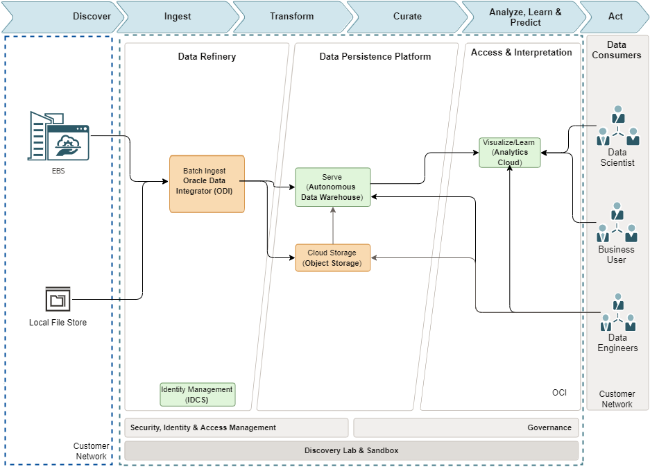

# Document Control

## Version Control

| Version | Author | Date | Comment |
|---------|--------|------|---------|

## Team

| Name | eMail | Role | Company |
|------|-------|------|---------|

## Document Purpose

This document provides a high-level solution definition for the Oracle solution and aims at describing the current state, to-be state as well as a potential 'Lift' project scope and timeline. The Lift parts will be described as a physical implementable solution. The intended purpose is to provide all parties involved with a clear and well-defined insight into the scope of work and intention of the project as it will be done as part of the Oracle Lift service.

The document may refer to a 'Workload', which summarizes the full technical solution for a customer (You) during a single engagement. The Workload is described in chapter [Workload Requirements and Architecture](#workload-requirements-and-architecture). In some cases Oracle offers an implementation service called 'Lift', which has its dedicated scope and is typically a subset of the initial Workload. The Lift project, architecture, and implementation details are documented in chapter Oracle Lift Project and Architecture and in chapter Oracle Lift Implementation.

This is a living document, additional sections will be added as the engagement progresses resulting in a final Workload Architecture Document to be handed over at the end of the engagement. Where Oracle Lift is involved, detailed design sections will be added after customer acceptance of the content of the Workload Architecture Document as it stands at the time acceptance is requested.

# Business Context

A Company Making Everything will be provided with a next-generation analytics solution for their finance reporting to deliver enhanced finance reporting capability for their finance business users.

Business users will have the potential to gain new insight into their financial status, which will help them to run their business more productively.

## Workload Business Value

This solution can satisfy the A Company Making Everything desire to provide increased insight in their GL reporting to their Finance team. The customer can capitalise on the capabilities of a modern analytics platform to provide benefits to business users and to IT. Business benefits mean users would have access to standard reports and be able to augment them with their own data or create additional visualisations without the need and wait for IT to implement. IT benefits by having an analytics solution on platform services that are managed by Oracle on Oracle Cloud Infrastructure (OCI). A Company Making Everything will have an up to date platform that will automatically scale up or down with business demand.

The Finance team can augment the pre-packaged set of Finance dashboards and KPIs provided with their own data or create their own visualisations for personal analysis and gain greater insight, giving them greater control over their reporting. The IT department can focus on adding business value through data and curated reporting by freeing up time spent on platform maintenance.

Using Lift to implement the core EBS Analytics Finance Accelerator will set the foundation for A Company Making Everything to extend the content to deliver customer-specific analyses.

# Workload Requirements and Architecture

## Overview

This project will implement the E-Business Suite Analytics Accelerator for Financials (Accelerator) to provide content, Oracle Analytics Cloud (OAC) for reporting with Autonomous Data Warehouse (ADW) for data management and Oracle Data Integrator - Marketplace (ODI) for data integration and transformation as the technology platform. The data source will be E-Business Suite (EBS).

## Non Functional Requirements

## Current State Architecture

## Future State Architecture

In the future state target architecture ODI-Marketplace will be used to extract data from EBS tables, load and transform them into ADW where the Analytics data model will reside. OAC will access the ADW for reporting.

### Logical Architecture

The following diagram illustrates the logical architecture of the components for the Accelerator.

The architecture focuses on the following logical divisions:

-   **Data refinery**` `{=html} Ingests and refines the data for use in each of the data layers in the architecture. The shape is intended to illustrate the differences in processing costs for storing and refining data at each level and for moving data between them.

-   **Data persistence platform (curated information layer)**` `{=html} Facilitates access and navigation of the data to show the current business view. For relational technologies, data may be logical or physically structured in simple relational, longitudinal, dimensional or OLAP forms. For non-relational data, this layer contains one or more pools of data, either output from an analytical process or data optimized for a specific analytical task.

-   **Access and interpretation**` `{=html} Abstracts the logical business view of the data for the consumers. This abstraction facilitates agile approaches to development, migration to the target architecture, and the provision of a single reporting layer from multiple federated sources.

As a data source we assume that EBS is the primary data source, but additional information might be brought in using files in the local file store.

The architecture has the following components:

-   **Data integration**` `{=html} Oracle Data Integrator is a comprehensive data integration platform that covers all data integration requirements: from high-volume, high-performance batch loads, to event-driven, trickle-feed integration processes, to SOA-enabled data services. You can download Oracle Data Integrator from Oracle Cloud Marketplace.

    The Accelerator provides pre-built ODI code to extract data from EBS and load it into the data warehouse.

-   **Autonomous data warehouse**` `{=html} Oracle Autonomous Data Warehouse is a fully managed, preconfigured database environment. You do not need to configure or manage any hardware, or install any software. After provisioning, you can scale the number of CPU cores or the storage capacity of the database at any time without impacting availability or performance.

    The Accelerator provides the physical tables for the data persistence.

-   **Object Storage**` `{=html} Oracle Cloud Infrastructure Object Storage is an internet-scale, high-performance storage platform that offers reliable and cost-efficient data durability. Oracle Cloud Infrastructure Object Storage can store an unlimited amount of unstructured data of any content type, including analytic data. You can safely and securely store or retrieve data directly from the internet or from within the cloud platform. Multiple management interfaces let you easily start small and scale seamlessly, without experiencing any degradation in performance or service reliability.

-   **Analytics**` `{=html} Oracle Analytics Cloud is a scalable and secure public cloud service that provides a full set of capabilities to explore and perform collaborative analytics for you, your workgroup, and your enterprise.

    With Oracle Analytics Cloud you also get flexible service management capabilities, including fast setup, easy scaling and patching, and automated lifecycle management.

    The Accelerator provides pre-built dashboards and reports for OAC.

    ### Security

    The solution will use Oracle Identity Cloud Service for authentication and authorization. Tighter integration between EBS and OAC will be left as an optional extension, which we recommend is done by Oracle Consulting. Further discussion of this topic can be found in the following A-Team blog post: https://www.ateam-oracle.com/post/implementing-data-level-security-in-oracle-analytics-cloud-using-identity-cloud-service

    Up to five (5) users will be manually created in Oracle Identity Cloud Service (IDCS) for authentication and linked to OAC.

## OCI Cloud Landing Zone Architecture

The design considerations for an OCI Cloud Landing Zone have to do with OCI and industry architecture best practices, along with A Company Making Everything specific architecture requirements that reflect the Cloud Strategy (hybrid, multi-cloud, etc). An OCI Cloud Landing zone involves a variety of fundamental aspects that have a broad level of sophistication. A good summary of a Cloud Landing Zone has been published in the [OCI User Guide](https://docs.oracle.com/en-us/iaas/Content/cloud-adoption-framework/landing-zone.htm).

### Naming Convention

A naming convention is an important part of any deployment to ensure consistency as well as security within your tenancy. Hence we jointly agree on a naming convention, matching Oracle's best practices and A Company Making Everything requirements.

Please find the agreed naming convention in the chapter [Resource Naming Convention](#resource-naming-convention).

### Security and Identity Management

This chapter covers the Security and Identity Management definitions and resources which will be implemented for A Company Making Everything.

#### Universal Security and Identity and Access Management Principles

-   Groups will be configured at the tenancy level and access will be governed by policies configured in OCI.
-   Any new project deployment in OCI will start with the creation of a new compartment. Compartments follow a hierarchy, and the compartment structure will be decided as per the application requirements.
-   It is also proposed to keep any shared resources, such as Object Storage, Networks etc. in a shared services compartment. This will allow the various resources in different compartments to access and use the resources deployed in the shared services compartment and user access can be controlled by policies related to specific resource types and user roles.
-   Policies will be configured in OCI to maintain the level of access / control that should exist between resources in different compartments. These will also control user access to the various resources deployed in the tenancy.
-   The tenancy will include a pre-provisioned Identity Cloud Service (IDCS) instance (the primary IDCS instance) or, where applicable, the Default Identity Domain. Both provide access management across all Oracle cloud services for IaaS, PaaS and SaaS cloud offerings.
-   The primary IDCS or the Default Identity Domain will be used as the access management system for all users administrating (OCI Administrators) the OCI tenant.

#### Authentication and Authorization for OCI

Provisioning of respective OCI administration users will be handled by A Company Making Everything.

##### User Management

Only OCI Administrators are granted access to the OCI Infrastructure. As a good practice, these users are managed within the pre-provisioned and pre-integrated Oracle Identity Cloud Service (primary IDCS) or, where applicable, the OCI Default Identity Domain, of OCI tenancy. These users are members of groups. IDCS Groups can be mapped to OCI groups while Identity Domains groups do not require any mapping. Each mapped group membership will be considered during login.

**Local Users**

The usage of OCI Local Users is not recommended for the majority of users and is restricted to a few users only. These users include the initial OCI Administrator created during the tenancy setup, and additional emergency administrators.

**Local Users are considered as Emergency Administrators and should not be used for daily administration activities!**

**No additional users are to be, nor should be, configured as local users.**

**A Company Making Everything is responsible to manage and maintain local users for emergency use cases.**

**Federated Users**

Unlike Local Users, Federated Users are managed in the Federated or Enterprise User Management system. In the OCI User list Federated Users may be distinguished by a prefix which consists of the name of the federated service in lower case, a '/' character followed by the user name of the federated user, for example:

`oracleidentityservicecloud/user@example.com`

In order to provide the same attributes (OCI API Keys, Auth Tokens, Customer Secret Keys, OAuth 2.0 Client Credentials, and SMTP Credentials) for Local and *Federated Users* federation with third-party Identity Providers should only be done in the pre-configured primary IDCS or the Default Identity Domain where applicable.

All users have the same OCI-specific attributes (OCI API Keys, Auth Tokens, Customer Secret Keys, OAuth 2.0 Client Credentials, and SMTP Credentials).

OCI Administration user should only be configured in the pre-configured primary IDCS or the Default Identity Domain where applicable.

**Note:** Any federated user can be a member of 100 groups only. The OCI Console limits the number of groups in a SAML assertion to 100 groups. User Management in the Enterprise Identity Management system will be handled by A Company Making Everything.

**Authorization**

In general, policies hold permissions granted to groups. Policy and Group naming follows the Resource Naming Conventions.

**Tenant Level Authorization**

The policies and groups defined at the tenant level will provide access to administrators and authorized users, to manage or view resources across the entire tenancy. Tenant level authorization will be granted to tenant administrators only.

These policies follow the recommendations of the [CIS Oracle Cloud Infrastructure Foundations Benchmark v1.2.0, recommendations 1.1, 1.2, 1.3](https://www.cisecurity.org/cis-benchmarks).

**Service Policy**

A Service Policy is used to enable services at the tenancy level. It is not assigned to any group.

**Shared Compartment Authorization**

Compartment level authorization for the cmp-shared compartment structure uses the following specific policies and groups.

Apart from tenant level authorization, authorization for the cmp-shared compartment provides specific policies and groups. In general, policies will be designed that lower-level compartments are not able to modify resources of higher-level compartments.

Policies for the cmp-shared compartment follow the recommendations of the [CIS Oracle Cloud Infrastructure Foundations Benchmark v1.2.0, recommendations 1.1, 1.2, 1.3](https://www.cisecurity.org/cis-benchmarks).

**Compartment Level Authorization**

Apart from tenant level authorization, compartment level authorization provides compartment structure specific policies and groups. In general, policies will be designed that lower-level compartments are not able to modify resources of higher-level compartments.

**Authentication and Authorization for Applications and Databases**

Application (including Compute Instances) and Database User management is completely separate of and done outside of the primary IDCS or Default Identity Domain. The management of these users is the sole responsibility of A Company Making Everything using the application, compute instance and database specific authorization.

#### Security Posture Management

**Oracle Cloud Guard**

Oracle Cloud Guard Service will be enabled using the pcy-service policy and with the following default configuration. Customization of the Detector and Responder Recipes will result in clones of the default (Oracle Managed) recipes.

Cloud Guard default configuration provides a number of good settings. It is expected that these settings may not match with A Company Making Everything's requirements.

**Targets**

In accordance with the [CIS Oracle Cloud Infrastructure Foundations Benchmark, v1.2.0, Chapter 3.15](https://www.cisecurity.org/cis-benchmarks), Cloud Guard will be enabled in the root compartment.

**Detectors**

The Oracle Default Configuration Detector Recipes and Oracle Default Activity Detector Recipes are implemented. To better meet the requirements, the default detectors must be cloned and configured by A Company Making Everything.

**Responder Rules**

The default Cloud Guard Responders will be implemented. To better meet the requirements, the default detectors must be cloned and configured by A Company Making Everything.

**Vulnerability Scanning Service**

In accordance with the [CIS Oracle Cloud Infrastructure Foundations Benchmark, v1.2.0, OCI Vulnerability Scanning](https://www.cisecurity.org/cis-benchmarks) will be enabled using the pcy-service policy.

Compute instances which should be scanned *must* implement the *Oracle Cloud Agent* and enable the *Vulnerability Scanning plugin*.

**OCI OS Management Service**

Required policy statements for OCI OS Management Service are included in the pcy-service policy.

By default, the *OS Management Service Agent plugin* of the *Oracle Cloud Agent* is enabled and running on current Oracle Linux 6, 7, 8 and 9 platform images.

#### Monitoring, Auditing and Logging

In accordance with the [CIS Oracle Cloud Infrastructure Foundations Benchmark, v1.2.0, Chapter 3 Logging and Monitoring](https://www.cisecurity.org/cis-benchmarks) the following configurations will be made:

-   OCI Audit log retention period set to 365 days.
-   At least one notification topic and subscription to receive monitoring alerts.
-   Notification for Identity Provider changes.
-   Notification for IdP group mapping changes.
-   Notification for IAM policy changes.
-   Notification for IAM group changes.
-   Notification for user changes.
-   Notification for VCN changes.
-   Notification for changes to route tables.
-   Notification for security list changes.
-   Notification for network security group changes.
-   Notification for changes to network gateways.
-   VCN flow logging for all subnets.
-   Write level logging for all Object Storage Buckets.
-   Notification for Cloud Guard detected problems.
-   Notification for Cloud Guard remedied problems.

For IDCS or OCI Identity Domain Auditing events, the respective Auditing API can be used to retrieve all required information.

#### Data Encryption

All data will be encrypted at rest and in transit. Encryption keys can be managed by Oracle or the customer and will be implemented for identified resources.

##### Key Management

All keys for **OCI Block Volume**, **OCI Container Engine for Kubernetes**, **OCI Database**, **OCI File Storage**, **OCI Object Storage**, and **OCI Streaming** are centrally managed in a shared or a private virtual vault will be implemented and placed in the compartment cmp-security.

**Object Storage Security**

For Object Storage security the following guidelines are considered.

-   **Access to Buckets** -- Assign least privileged access for IAM users and groups to resource types in the object-family (Object Storage Buckets & Object)
-   **Encryption at rest** -- All data in the Object Storage is encrypted at rest using AES-256 and is on by default. This cannot be turned off and objects are encrypted with a master encryption key.

**Data Residency**

It is expected that data will be held in the respective region and additional steps will be taken when exporting the data to other regions to comply with the applicable laws and regulations. This should be review for every project onboard into the tenancy.

#### Operational Security

**Security Zones**

Whenever possible OCI Security Zones will be used to implement a security compartment for Compute instances or Database resources. For more information on Security Zones refer to the in the *Oracle Cloud Infrastructure User Guide* chapter on [Security Zones](https://docs.oracle.com/en-us/iaas/security-zone/using/security-zones.htm).

**Remote Access to Compute Instances or Private Database Endpoints**

To allow remote access to Compute Instances or Private Database Endpoints, the OCI Bastion will be implemented for defined compartments.

To be able to use OCI services to for OS management, Vulnerability Scanning, Bastion Service, etc. it is highly recommended to implement the Oracle Cloud Agent as documented in the *Oracle Cloud Infrastructure User Guide* chapter [Managing Plugins with Oracle Cloud Agent](https://docs.oracle.com/en-us/iaas/Content/Compute/Tasks/manage-plugins.htm).

#### Network Time Protocol Configuration for Compute Instance

Synchronized clocks are a necessity for securely operating environments. OCI provides a Network Time Protocol (NTP) server using the OCI global IP number 169.254.169.254. All compute instances should be configured to use this NTP service.

#### Regulations and Compliance

A Company Making Everything is responsible for setting the access rules to services and environments that require stakeholders’ integration to the tenancy to comply with all applicable regulations. Oracle will support in accomplishing this task.

## Bill of Materials

| Environment | Description                                                           | Metric            | Size      | Monthly Cost | Annual Cost | Hours p/m |
|-------------|-----------------------------------------------------------------------|-------------------|-----------|--------------|-------------|-----------|
| Prod        | Oracle Analytics Cloud Service–Enterprise                             | OCPU/Hr           | 2         |              |             | 744       |
| Prod        | Oracle Autonomous Data Warehouse                                      | OCPU/Hr           | 1         |              |             | 744       |
| Prod        | Oracle Autonomous Data Warehouse-Storage                              | TB/Month          | 1         |              |             |           |
| Prod        | VM, Compute & Storage to run Oracle Data Integrator Marketplace image |                   |           |              |             | 744       |
| Prod        | Network Firewall (optional)                                           | Instance per Hour | 1         |              |             | 744       |
|             |                                                                       |                   | **TOTAL** | **XXX**      | **XXX**     |           |

# Oracle Lift Project and Architecture

==**the Lift part below here is not yet confirmed nor validated by Lift team if achievable or realistic**==

## Solution Scope

### Disclaimer

As part of the Oracle Lift Project, any scope needs to be agreed upon by both the customer and Oracle. A scope can change but must be confirmed again by both parties. Oracle can reject scope changes for any reason and may only design and implement a previously agreed scope. A change of scope can change any agreed times or deadlines and needs to be technically feasible.

All items not explicitly stated to be within the scope of the Lift project will be considered out of scope. Oracle recommends the use of professional services to implement extensions or customizations beyond the original scope, as well as to operate the solution, with an Oracle-certified partner.

### Overview

The EBS Financial Analytics Accelerator will provide:

-   Eighty five (85) pre-built reports
-   Three (3) pre-built dashboards for Accounts Receivable, Accounts Payable and General Ledger
-   Six (6) data models: 2 AR, 2 AP, 2 GL
-   Chart of accounts are pre-configured for X (x) standard segments

The Lift implementation team will:

-   Design and configure A Company Making Everything's OCI tenancy and provision a new instance of OAC, ADW and OCI for ODI Marketplace for one (1) non-prod environment
-   Implement the standard EBS Analytics Accelerator for Financials
-   Configuration will be for one (1) primary ledger
-   Max 500 GB of data can be loaded
-   Configure up to five (5) users in IDCS to access OAC
-   Perform an initial data load to populate the standard reports
-   Conduct SIT testing
-   Deliver one (1) language (US)

### Business Value

This Lift implementation of the Accelerator would give A Company Making Everything a kickstart in providing greater business capability to their finance users increasing their ability to gain deeper insight to make data driven decisions. It will provide a foundation of recommended practice on OCI with a sound basis to extend and expand. By utilizing Lift, A Company Making Everything will have an extensible foundation for analytics provided while making use of pre-purchased Universal Credits for OCI that would otherwise be unused.

### Success Criteria

A Company Making Everything will be able to see their data in the Accelerator dashboards and reports on the A Company Making Everything OCI tenancy by the end of the project timeline. Project timeline is set forth in the 'project timeline' section of this document.

## Workplan

### Deliverables

-   A Workload Architecture Document (WAD) which includes:
    -   Solution Definition
    -   Solution Design
-   Handover Documentation

### Included Activities

This section provides more details on the implementation of the Accelerator.

-   The OCI tenancy will be configured and the services identified in the scope will be provisioned.
-   Configure Bastion host
-   Connect OAC to ADW
-   Unbox and implement Finance accelerator with the below tasks
    -   Unbox the Accelerator package
    -   Gather the details of the pre-requisite functional parameters in a spreadsheet Oracle will supply. It will include items such as the chart of accounts configuration, data-load parameters, transaction type, etc.
    -   Configure the connection between EBS and ODI Marketplace
    -   Configure the connection between ODI Marketplace and ADW
    -   Run data load to ADW to cater the reports in the OAC
    -   Max 500 GB of data will be loaded for reporting
    -   Single Language ‘US’ will be implemented and all levels of reporting will be in English
    -   A Company Making Everything have X segments, all will be considered (list segments here)
    -   One (primary) currency will be implemented (- GL Budget data does not exist in EBS. So, GL Budget dashboard page will be hidden.) (- ODI scenarios related to GL Budget fact and dimensions will be unchecked from project load plan.)

### Recommended Activities

This Lift workload is designed to assist A Company Making Everything to rapidly start utilising Oracle Cloud Infrastructure and allow them to explore the benefits of the solution to them for further rollout. In discussion with A Company Making Everything and from our own experience, we suggest A Company Making Everything consider engaging Oracle Consulting to implement some or all of the following activities to enrich the Accelerator. Below is not exhaustive list but includes:

Activities which extend functionality, such as:

-   Incorporate Descriptive Flex Fields from EBS, which may be needed for reporting
-   Develop ETL to address customisations of EBS
-   Implement OAC Usage Tracking
-   After the initial bedding in period to get users directly accessing the system, implement scheduling reports through OAC Agents or Delivers
-   Develop extensions to incorporate data that is not in AP, AR or GL either within EBS or an additional data source to augment the analytics
-   Extend the classic Dashboard and Reports delivered as standard with additional dashboards and reports or with data visualisations
-   Modify the standard reports to address A Company Making Everything-specific requirements
-   Performance tuning
-   Identity and Access Management integration between EBS and OAC users via IDCS Standard

Activities which improve security, such as:

-   Implement custom Row/column level security changes
-   Implement a VPN Firewall
-   Conduct vulnerability assessment and/or penetration testing
-   IP whitelisting to access Bastion host

Activities which affect the tenancy, such as:

-   Provision and/or configuration of a second environment
-   Configure FTP server certificates if needed
-   Server hardening, audit certification implementation

### Timeline

This high-level project timeline shows a representative timeline and is intended for planning purposes only

### Implementation RACI

| No. | Activity                                                                                                    | Oracle Lift | A Company Making Everything |
|-----|-------------------------------------------------------------------------------------------------------------|-------------|-----------------------------|
| 1   | Perform tasks that must be done on the root level (compartment, admins group, Oracle users etc.)            | R,A         | I,C                         |
| 2   | Provide access to A Company Making Everything's OCI tenancy, with administration privileges for compartment | I,C         | R,A                         |
| 3   | Provide EBS user to be used in accelerator                                                                  | I,C         | R,A                         |
| 4   | Provide information required to setup environments                                                          | I,C         | R,A                         |
| 5   | Perform any changes in network (VPN setup, routing, hostname resolution)                                    | I, C        | R, A                        |
| 6   | Provide complete details of pre-requisite functional parameter details                                      | I,C         | R,A                         |
| 7   | Unboxing and implementation of the Finance EBS accelerator                                                  | R,A         | I,C                         |
| 8   | Technical validation of all the out of the box reports                                                      | R,A         | I,C                         |
| 9   | Functional validation                                                                                       | I           | R,A                         |
| 10  | Project kick off                                                                                            | R,A         | I,C                         |
| 11  | Project management                                                                                          | R,A         | R,A                         |

R:Responsible A:Accountable C:Consulted I:Informed

### Assumptions

The following assumptions have been made about the project, which will impact delivery:

-   A Company Making Everything is able to respond swiftly to questions arising on EBS configuration, networking and security, or Accelerator configuration.
-   A Company Making Everything will extend or customise the Accelerator if required.
-   A Company Making Everything will perform UAT and validation testing performing any changes required as necessary.
-   A new ODI Marketplace, ADW and OAC service will be created as part of this delivery.
-   EBS data will be clean and EBS Application is the only source of data for the EBS Analytics Accelerator.
-   There will be no updates to the EBS Database during implementation.
-   The solution will be delivered against the current EBS implementation (version 12.1 or higher).
-   Port opening will be done well before by the A Company Making Everything
-   All work will be done remotely and within either X time or India standard time within normal office working hours.
-   No problems, issues, errors and anomalies should exist in current database & applications. These issues and SRs will continue to be owned by A Company Making Everything during and after the migration.

### Obligations

The following obligations will be required to be met for the project:

-   A Company Making Everything will have purchased the appropriate Universal Credits for the services required for the project.
-   A Company Making Everything will provide Oracle with users with admin access to the A Company Making Everything tenancy.
-   A Company Making Everything will provide functional or business subject matter experts who understand the A Company Making Everything E-Business Suite configuration to answer functional questions that arise.
-   A Company Making Everything will create a cutoff plan for Go Live.
-   A Company Making Everything will ensure the appropriate product training has been obtained to maintain and support the implementation
-   A Company Making Everything's business team will be available for the Testing phase, which will be completed within the agreed testing window.
-   A Company Making Everything will provide project management for the project and will manage any third party suppliers or vendors.

### Resource Naming Convention

Oracle recommends the following Resource Naming Convention:

-   The name segments are separated by “-“
-   Within a name segment avoid using `<space>`{=html} and “.”
-   Where possible intuitive/standard abbreviations should be considered (e.g. “shared“ compared to "shared.cloud.team”)
-   When referring to the compartment full path, use “:” as separator, e.g. cmp-shared:cmp-security

Some examples of naming are given below:

-   cmp-shared
-   cmp-\<workload\>
-   cmp-networking

The patterns used are these:

-   \<resource-type\>-\<environment\>-\<location\>-\<purpose\>
-   \<resource-type\>-\<environment\>-\<source-location\>-\<destination-location\>-\<purpose\>
-   \<resource-type\>-\<entity/sub-entity\>-\<environment\>-\<function/department\>-\<project\>-\<custom\>
-   \<resource-type\>-\<environment\>-\<location\>-\<purpose\>

Abbreviation per resource type are listed below. This list may not be complete.

| Resource type                      | Abbreviation       | Example                                                     |
|------------------------------------|--------------------|-------------------------------------------------------------|
| Bastion Service                    | bst                | bst-\<location\>-\<network\>                                |
| Block Volume                       | blk                | blk-\<location\>-\<project\>-\<purpose\>                    |
| Compartment                        | cmp                | cmp-shared, cmp-shared-security                             |
| Customer Premise Equipment         | cpe                | cpe-\<location\>-\<destination\>                            |
| DNS Endpoint Forwarder             | dnsepf             | dnsepf-\<location\>                                         |
| DNS Endpoint Listener              | dnsepl             | dnsepl-\<location\>                                         |
| Dynamic Group                      | dgp                | dpg-security-functions                                      |
| Dynamic Routing Gateway            | drg                | drg-prod-\<location\>                                       |
| Dynamic Routing Gateway Attachment | drgatt             | drgatt-prod-\<location\>-\<source_vcn\>-\<destination_vcn\> |
| Fast Connect                       | fc# \<# := 1...n\> | fc0-\<location\>-\<destination\>                            |
| File Storage                       | fss                | fss-prod-\<location\>-\<project\>                           |
| Internet Gateway                   | igw                | igw-dev-\<location\>-\<project\>                            |
| Jump Server                        | js                 | js-\<location\>-xxxxx                                       |
| Load Balancer                      | lb                 | lb-prod-\<location\>-\<project\>                            |
| Local Peering Gateway              | lpg                | lpg-prod-\<source_vcn\>-\<destination_vcn\>                 |
| NAT Gateway                        | nat                | nat-prod-\<location\>-\<project\>                           |
| Network Security Group             | nsg                | nsg-prod-\<location\>-waf                                   |
| Managed key                        | key                | key-prod-\<location\>-\<project\>-database01                |
| OCI Function Application           | fn                 | fn-security-logs                                            |
| Object Storage Bucket              | bkt                | bkt-audit-logs                                              |
| Policy                             | pcy                | pcy-services, pcy-tc-security-administration                |
| Region Code, Location              | xxx                | fra, ams, zch \# three letter region code                   |
| Routing Table                      | rt                 | rt-prod-\<location\>-network                                |
| Secret                             | sec                | sec-prod-wls-admin                                          |
| Security List                      | sl                 | sl-\<location\>                                             |
| Service Connector Hub              | sch                | sch-\<location\>                                            |
| Service Gateway                    | sgw                | sgw-\<location\>                                            |
| Subnet                             | sn                 | sn-\<location\>                                             |
| Tenancy                            | tc                 | tc                                                          |
| Vault                              | vlt                | vlt-\<location\>                                            |
| Virtual Cloud Network              | vcn                | vcn-\<location\>                                            |
| Virtual Machine                    | vm                 | vm-xxxx                                                     |
|                                    |                    |                                                             |

**Note:** Resource names are limited to 100 characters.

#### Group Names

OCI Group Names should follow the naming scheme of the Enterprise Identity Management system for Groups or Roles.

Examples for global groups are:

-   \<prefix\>-\<purpose\>-admins
-   \<prefix\>-\<purpose\>-users

For departmental groups:

-   \<prefix\>-\<compartment\>-\<purpose\>-admins
-   \<prefix\>-\<compartment\>-\<purpose\>-users

The value for \<prefix\> or the full names **must be agreed** with A Company Making Everything.
