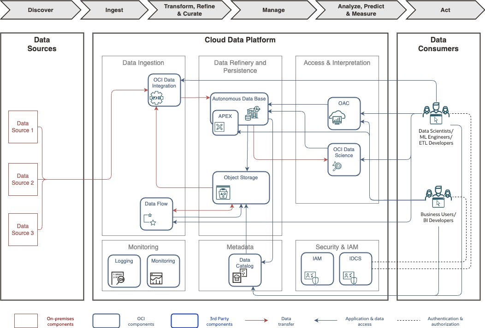
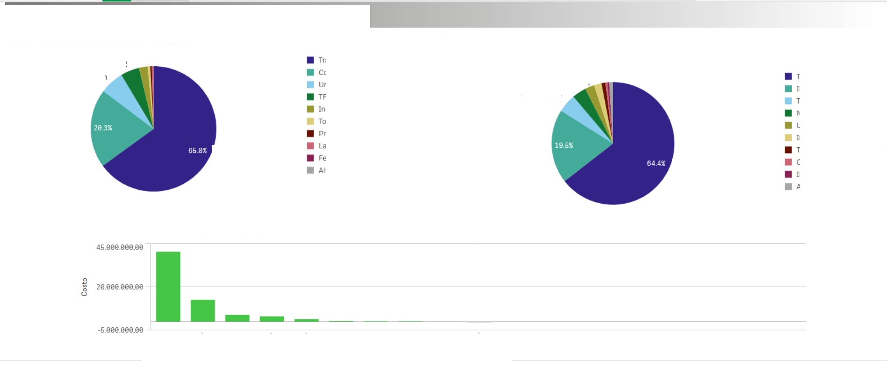
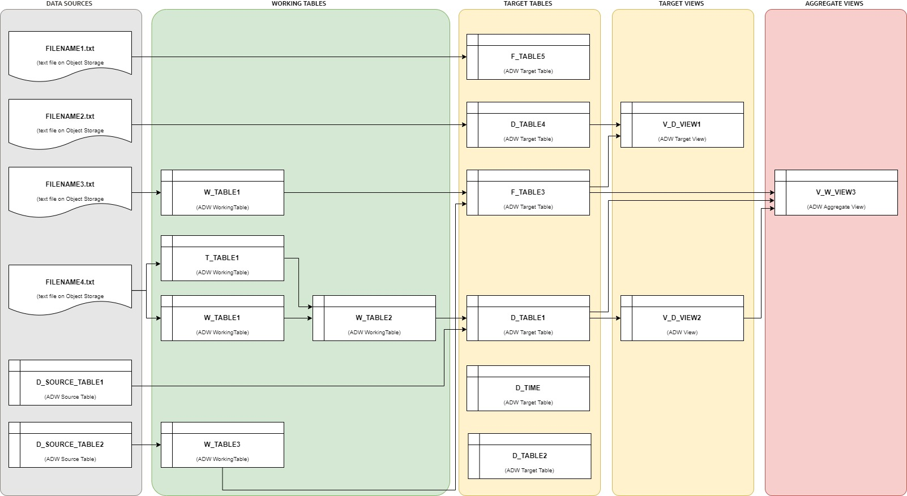

---
doc:
  author: Gianluca Rossi
  config:
    impl:
      type: Lift
  cover:
    subtitle:
    - Workload Architecture Document
    - Solution Definition and Design
    title:
    - A Company Making Everything
    - Serverless Lakehouse
  customer:
    alias: ACME
    name: A Company Making Everything
  version: 1.2
---

# Document Control

## Version Control

| Version | Author         | Date            | Comment                           |
|---------|----------------|-----------------|-----------------------------------|
| 1.0     | Gianluca Rossi | June 21st, 2022 | Initial version                   |
| 1.1     | Gianluca Rossi | March 2nd, 2022 | Internal review                   |
| 1.2     | Gianluca Rossi | July 21st, 2023 | Updated OCI Services descriptions |

## Team

| Name           | eMail                     | Role               | Company |
|----------------|---------------------------|--------------------|---------|
| Gianluca Rossi | gianluca.rossi@oracle.com | Workload Architect | Oracle  |

## Document Purpose

The purpose of this document is to describe the objectives, approach, architecture and solution definition regarding A Company Making Everything's new HR analytical platform.

This document provides a high-level solution definition for the Oracle solution and aims at describing the current state, to-be state as well as a potential 'Lift' project scope and timeline. The Lift parts will be described as a physical implementable solution. The intended purpose is to provide all parties involved with a clear and well-defined insight into the scope of work and intention of the project as it will be done as part of the Oracle Lift service.

The document may refer to a 'Workload', which summarizes the full technical solution for a customer (You) during a single engagement. The Workload is described in chapter [Workload Requirements and Architecture](#workload-requirements-and-architecture). In some cases Oracle offers an implementation service called 'Lift', which has its dedicated scope and is typically a subset of the initial Workload. The Lift project, architecture, and implementation details are documented in chapter Oracle Lift Project and Architecture and in chapter Oracle Lift Implementation.

This is a living document, additional sections will be added as the engagement progresses resulting in a final Workload Architecture Document to be handed over at the end of the engagement. Where Oracle Lift is involved, detailed design sections will be added after customer acceptance of the content of the Workload Architecture Document as it stands at the time acceptance is requested.

# Business Context

A Company Making Everything has more than two thousand employees and is looking for a solution that supports the analysis, monitoring and prediction of personnel costs and helps in the main decision-making processes concerning HR management.

# Workload Requirements and Architecture

## Overview

The Workload includes a new analytical application that allows A Company Making Everything to produce analyzes on human resources data and in particular on typical indicators of cost of labor. The application will:

-   Store data into Oracle's Cloud systems and platforms
-   Manage metadata and business glossaries for the included data domains.
-   Integrate, transform and enrich data according to the Business rules for calculating cost of labor.
-   Model data with the goal of enabling analysis with advanced visualization.
-   Enable data scientists to develop and execute Machine Learning models by leveraging in a self-service way all the typical features of a ML process: data discovery, data preparation, data processing, ...

The application will have two environments based on Oracle Cloud infrastructure and platforms:

-   Development/Test
-   Production

## Functional Requirements

A Company Making Everything needs a solution to manage Human Resource data from an analytical perspective. They need to monitor the current values of salary, retribution, cost of labor, presences/absences in current and past A Company Making Everything's organizational structure for different employee types. They also need to understand historical trends of the main KPIs and predict possible future scenarios.

### Use cases

Different type of users will leverage the new analytic platform capabilities:

-   **Analysts** in A Company Making Everything will profile and analyze data to identify and prototype KPIs, visualizations, dashboards and other outputs useful for A Company Making Everythings's business users.
-   **Report Developers** in A Company Making Everything will prepare and publish KPIs, visualizations and dashboards, that will be used by A Company Making Everything's business users to understand history and trends of various data sets managed by A Company Making Everything.
-   **Data Scientists** in A Company Making Everything need an environment to load and prepare data, develop, and test ML models, so that they can create new insights from data in the new analytic platform.
-   A Company Making Everything's **Business Users** (HR Managers, HR Specialists, etc...), need interactive dashboards and visualizations, to analyze HR management KPIs values (cost of labor, salaries, absences/presences) and other characteristics of the service they are responsible for. They also need a Graphical User Interface to manage some master data updates ("D_SOURCE_TABLE1 voci di retribuzione" - i.e. "Payslip items grouping" and "Categoria di Storno" - i.e. "Reversal Category").
-   **All A Company Making Everything's users** needs a supporting tool to manage metadata and main business glossaries of the data included in the analytic solution.

### Requirement Matrix

| Requirements                                      | OAC[^1] | ADW | Data Science | Data Flow | OCI DI | Data Catalog | APEX |
|---------------------------------------------------|---------|-----|--------------|-----------|--------|--------------|------|
| Access report and advanced visualization          | Y       |     |              |           |        |              |      |
| Self-Service reporting and advanced visualization | Y       |     |              |           |        |              |      |
| Profile and analyze data and KPIs                 | Y       | Y   | Y            |           |        |              |      |
| Develop and test ML models                        |         |     | Y            |           |        |              |      |
| Data Loading and processing                       |         |     |              | Y         | Y      |              |      |
| Self Service data Loading and processing          | Y       | Y   |              | Y         | Y      |              |      |
| Manage metadata and business glossaries           |         |     |              |           |        | Y            |      |
| Web GUI to update data                            |         |     |              |           |        |              | Y    |

## Non Functional Requirements

### Integration and Interfaces

The new system extracts data from on-premises application (HR System on Oracle DB, some master data on MS SQL Server System, some accounting information on EBS) and stores them on OCI Object Storage. Integrations with on-premises source system have to be done to extract data on daily bases through batch processes.

| Name                       | Source        | Target         | Protocol | Function        | Connection      |
|----------------------------|---------------|----------------|----------|-----------------|-----------------|
| HR System Integration      | HR System     | Object Storage | Batch    | Data extraction | VPN/FastConnect |
| General Ledger Integration | EBS           | Object Storage | Batch    | Data extraction | VPN/FastConnect |
| HR Master Data Integration | MS SQL Server | Object Storage | Batch    | Data Extraction | VPN/FastConnect |

### Regulations and Compliances

The HR reporting data for A Company Making Everything uses personal data. 'Personal data’ means any information relating to an identified or identifiable natural person (‘data subject’); an identifiable natural person is one who can be identified, directly or indirectly, in particular by reference to an identifier such as a name, an identification number, location data, an online identifier or to one or more factors specific to the physical, physiological, genetic, mental, economic, cultural or social identity of that natural person. Furthermore, under GDPR, this only applies to personal data processed in one of two ways:

-   Personal data processed wholly or partly by automated means (or, information in electronic form); and
-   Personal data processed in a non-automated manner which forms part of, or is intended to form part of, a ‘filing system’ (or, written records in a manual filing system).

**In relation to this Workload, all HR data will be anonymized (masked/pseudonymized to make data not attributable to a single employee) by A Company Making Everything prior to being uploaded in the Oracle Cloud.**

### Environments

The new workload includes two environment, Development/Test and Production.

### Resilience and Recovery

Since this is not a mission critical workload resilience is achieved by the intrinsic capabilities of ADW, OAC, OCI Data Integrator and the Compute services and providing Service Level Objectives as described in ["Oracle PaaS and IaaS Public Cloud Services Pillar Document"](https://www.oracle.com/assets/paas-iaas-pub-cld-srvs-pillar-4021422.pdf "Oracle PaaS and IaaS Public Cloud Services Pillar Document")

Resilience and recovery and can be achieved by leveraging:

-   **ADW automated backups**: by default the Automatic Backup feature for the Autonomous Data Warehouse is enabled. Backups have a retention period of 60 days and that allow to restore and recover the ADW database to any point-in-time in this retention period.
-   **OAC Snapshots** that can be used to perform full or partial backups of OAC content and that can be either restored on the same or a different OAC instance.
-   **OCI Object Storage objects replication**: stored objects are automatically replicated across fault domains or across availability domains. Object Storage offers also automatic self-healing: when a data integrity issue is identified, corrupt data is automatically ‘healed’ from redundant copies.
-   **OCI Data Flow serverless Spark environment** (without infrastructure to deploy or manage) and its code persisted on Object Storage.
-   **OCI Data Science Block Volume built-in redundancy**: block storage of the compute instances of the OCI Data Science Notebooks are automatically replicated to protect against data loss. Multiple copies of data are stored redundantly across storage servers with built-in repair mechanisms. In addition, Block Volumes are persistent and durable beyond the lifespan of a virtual machine.

### Management and Monitoring

Management of the system will be done via:

-   **OCI console** - to get access to the service instances supporting the architecture and be able to manage them, for instance, start/stop instances, configure backups, ...
-   **ADW console** - to start/stop the ADW instance, create a clone, download and rotate the ADW wallet, restore from a backup, change admin password or set resource management rules
-   **OAC console** - to manage OAC settings, create and restore snapshots and manage ADW connection settings amongst other admin tasks
-   **IDCS console** - to manage users and perform role assignment for those users
-   **OCI SDK** and **OCI CLI** provide the capability to interact with services programmatically (e.g. launch OCI Data Integration tasks, OCI Data Science jobs)

Monitoring will be performed leveraging OCI base capabilities as well as the specific services capabilities and will be done via:

-   **OCI console** - to see and monitor the OAC, ADW, OCI DI and OCI Compute metrics; can also be used to trigger alarms and notifications based on those metrics
-   **ADW console and Performance Monitor** - monitor performance, CPU utilization, consumed storage, running SQL statements and sessions amongst other metrics exposed
-   **OAC console** - to monitor user sessions and cache status
-   **OCI Data Integrator Monitor Application** - to see and monitor workspaces and application runs.
-   **OCI Data Flow** - simplifies common operational tasks like log management and access to operational UIs. It offers simple debugging and diagnostics with a consolidated view of log output. Administrators can easily discover and stop live Spark jobs that are running for too long or consuming too many resources.
-   **OCI Data Science** - Data Science monitors running notebook sessions, collects and reports metrics including: CPU Utilization, Memory Utilization, Network Bytes In, Network Bytes Out. You can view the default metric charts for all the notebook sessions in a compartment using the OCI Monitoring service.

### Capacity

The following tables shows the main capacity metrics collected for this Workload:

| System     | Capacity                 | KPI      | Unit   | Value     | Notes              |
|:-----------|:-------------------------|:---------|:-------|:----------|:-------------------|
| DB server  | DB size                  | MaxVol   | TB     | 1         |                    |
| ETL Server | Data processed daily     | MaxFlow  | GB/day | 20        |                    |
| OAC        | Users                    | Users    | Users  | 1200-1400 |                    |
| OAC        | Simultaneous users       | MaxUsers | Users  | 120-140   | 10% of total users |
| OAC        | Data Visualization users | MaxUsers | Users  | 240-280   | 20% of total users |

### Security

The proposed solution consists of OCI Data Integration (DI), Oracle Autonomous Data Warehouse (ADW), Oracle Analytics Cloud (OAC) and other services in OCI which are fully managed by Oracle (OCI PaaS), and therefore have very small attack surface. Authentication and authorization of users done by enterprise-grade identity and access management services of OCI.

#### Identity and Access Management

To facilitate identity and access management the solution will make use of the standard Oracle OCI IAM with IDCS foundation integration. Oracle Cloud Infrastructure Identity and Access Management (IAM) lets A Company Making Everything control who has access to the subscribed OCI cloud resources. After A Company Making Everything signs up for an Oracle account and Identity Domain, Oracle sets up a default administrator for the account. This A Company Making Everything tenancy also automatically has a policy that gives the Administrators group access to all of the Oracle Cloud resources in the tenancy. A Company Making Everything can control what type of access a group of users have and to which specific resources. The different Groups and associated policies for A Company Making Everything will consider the different type of A Company Making Everything's user and the different type of service they will use to perform their job. A Company Making Everything's main type of users are:

-   **Business Analysts** (HR Manager, HR Specialists): must have the possibility to visualize data, to create report and dashboard with OAC.
-   **Data Scientists**: must have the possibility to run data processing (with Data Flow, Data Integration), to access to the different type of data (raw data in Object Storage, enriched/transformed data in ADW), to analyze and discover data (with Data Science projects, OAC self-service analytics) and to train and test AI models (with Data Science projects).
-   **BI Developer**: must have the possibility to create visualization, report and dashboard with OAC and to administer OAC applications.
-   **ETL Developer**: must have the possibility to create Data Set, Data Flows and Pipelines with OCI Data Integrator.
-   **IT Administrators**: must have the possibility to administer the Oracle Cloud Infrastructure (Networks, Compartments, Groups, Policies,...) and Oracle Cloud Platforms (ADW, OAC, ...).

Currently, for this workload, there isn't a requirement to federate users with A Company Making Everything on-premises identity and access management system.

#### Data Security

There is a specific requirement regarding data security in Dev/Test environment. Data managed by this workload includes personal data of A Company Making Everything employees (e.g: Name, Surname, Fiscal Code) associated to their salary and retribution details. A Company Making Everything will perform the masking process on-premises before loading source data files on Object Storage buckets. That masking process will make impossible to attribute data to a single employee.

For the Production environment of this workload the pseudonymization of personal data is under discussion. Anyhow, as per the data masking process, the pseudonymization process will be developed by A Company Making Everything and will be executed on the on-premises data prior to load them in Oracle Cloud.

## Constraints, Challenges and other Requirements

Two of the datasets used by the workload as data sources will come as results of data manipulation done by Business Users through dedicated new Web Applications. Those applications are not already available, they will be developed by A Company Making Everything using Oracle APEX in Oracle Cloud. For the solution definition and the Lift implementation we need to share with A Company Making Everything the expected data set structure - tables output of the APEX Applications - that will be used as data sources.

## Future State Architecture

### Logical Architecture

The following are the main building blocks that compose this cloud architecture.

**Data Persistence and Data Governance**:

-   **OCI Object Storage**: is a cloud native, highly scalable and resilient storage that will be used to support the Data Lake to store any type of data, be it relational or non-relational. Object Storage can be leveraged by a variety of clients and processing engines. It is a managed, durable, scalable, and cost-effective cloud storage for Data Lake and many other use cases. Data in Object Storage is organized in buckets. Object name prefix may be used to group data into logical entities and partitions.
-   **Autonomous Data Warehouse (ADW)**: Oracle Autonomous Data Warehouse (ADW) is a fully managed, preconfigured data warehouse environment. After provisioning, you can scale the number of CPU cores or the storage capacity of the database at any time without impacting availability or performance. ADW can also virtualize data that resides on Object Storage as external tables and hybrid partitioned tables so data consumption derived from other data sources can seamlessly be consumed and joined with the warehouse data. Furthermore one can also leverage Object Storage as a tier of cold storage, if needed, and move part of the historical data from the warehouse into object storage and then consume it seamlessly via Hybrid Partitioned Tables. ADW can also take advantage of the metadata stored on the Data Catalog, meaning, it can consume metadata previously harvested, in order to support external tables creation without the need to explicitly define manually all metadata needed for creating those tables; it even synchs automatically the metadata updates in the Data Catalog with the external tables definition to keep consistency overtime, simplify management and reduce effort. Furthermore, ADW offers solutions to enable data sharing without duplicating or propagating data to all recipients, significantly reducing storage and bandwidth requirements: Delta Sharing and Cloud Links. **Delta Sharing**, a modern open data sharing protocol introduced by Databricks, enables secure and efficient data sharing across organizations. It provides a unified, high-performance, and cost-effective solution for sharing large datasets without the need for data duplication or complex ETL processes. **Cloud Links** are a cutting-edge data sharing solution native to Oracle Autonomous Databases. Leveraging the Oracle Cloud Infrastructure and its metadata Cloud Links enable secure and efficient data sharing between single databases or groups of databases, for example, on a compartmental level. The A Company Making Everything instance will be used to support the HR Management Data Lake to be analyzed by all the tools and services of this new OCI analytical system. The built in **APEX** platform will support the development of the Web Application that Business User will use to modify specific HR data that will be used as data input by the HR data-mart.
-   **OCI Data Catalog**: provides metadata describing data sets in the Data Lake. Metadata includes technical metadata such as location, type and format of data sets; and business metadata defining the logical categories and terms. In A Company Making Everything, Data Catalog can be used by users for searching and understanding available data (metadata of files in Object Storage and tables in ADW) and also to map data to **ADW external tables** (from source files). In addition, Data Catalog Metastore also provides a highly available and scalable central repository of metadata for a Hive cluster. It stores metadata for data structures such as databases, tables, and partitions in a relational database, backed by files maintained in Object Storage. OCI Data Flow jobs with Apache Spark can makes use of Data Catalog Metastore for this purpose.

**Analytics and Data Science**:

-   **Oracle Analytics Cloud (OAC)**: managed BI service supporting reports, dashboards, self-service, and augmented analytics. With OAC, users can prepare data and run self-service data transformations, they can discover and visualize data, collaborate in teams and share analysis, and develop dashboards and rich visualizations for consumers. In this workload, it will support the reporting to provide visibility on the overall HR Management KPIs (cost of labor, salaries, retribution) as well as to drill down on detailed employee information.
-   **OCI Data Science**: provides infrastructure, open source technologies, libraries, and packages, and data science tools for data science teams to build, train, and manage machine learning (ML) models in Oracle Cloud Infrastructure. The collaborative and project-driven workspace provides an end-to-end cohesive user experience and supports the lifecycle of predictive models. Data Science Model Deployment feature allows data scientists to deploy trained models as fully managed HTTP endpoints that serve predictions in real time infusing intelligence into processes and applications and allowing the business to react to events of relevance as they occur. For long running machine learning process, the results can be also stored in Autonomous Data Base or files in Object Storage to be consumed by external applications. A Company Making Everything will implement a ML model to predict cost of labour by leveraging OCI Data Science capabilities.

**Batch Ingestion and Processing**:

-   **OCI Data Integration (DI)**: is a serverless, no code, fully managed ETL service to integrate, transform, move data in the OCI ecosystem. It will be used to develop and execute the data integration pipelines that ingest data from data sources as micro batches or batches, transform that data leveraging Spark and persists the data on the targets, on this case, Autonomous Data Warehouse. It will support data extract, transformation and loading to build the analytical data layer in ADW. A Company Making Everything's data analysts and data scientists can leverage its graphical no-code interface for operations that require self-service ETL.
-   **OCI Data Flow**: managed service for running Apache Spark applications. Data Flow applications are reusable templates consisting of a Spark application, its dependencies, default parameters, and a default runtime resource specification. Since it's a perfectly elastic pay-as-you-go service, Data Flow can be used by A Company Making Everything Data Engineers and Data Scientists whenever they need to perform scalable and large scale data processing on Data Lake. Furthermore, OCI Data lows offers Data Flow SQL Endpoints that are designed for developers, data scientists, and advanced analysts to interactively query data directly where it lives in the data lake. Using Data Flow SQL Endpoints, you can economically process large amounts of raw data, with cloud native security used to control access.

**Identity and Access Management**:

-   **Identity Cloud Service (IDCS)** manages user identities, access and entitlements across a wide range of cloud and on-premises applications and services, such as OCI, OAC, and many other Oracle and non-Oracle services. IDCS may be federated with external identity systems such as Active Directory, both for SSO and user and group provisioning. For this workload A Company Making Everything can use IDCS to authenticate users and define users/groups memberships. In future A Company Making Everything can leverage IDCS federation capabilities to enable a hybrid Cloud/on-premises security model.
-   **OCI Identity and Access Management (IAM)** control who can access OCI resources in Data Lake. Access control rules are described in flexible and powerful policy statements, using service types, compartments, tags, locations, and other attributes to allow access to OCI. Access is granted either to Groups (for humans as principals) or to Dynamic Groups (for VMs or Functions as principals).

### Deployment Architecture

Below is a high level deployment architecture to show how the OCI services would be deployed to deliver the logical architecture above. This architecture supports different environments of solution.

Below there is a brief explanation of each architecture component.

-   **OCI Region** An Oracle Cloud Infrastructure region is a localized geographic area that contains one or more data centers, called availability domains.
-   **IDCS** - Identity Cloud Service is the service that allows to manage identities and permissions for the various OCI services users and can be integrated/federated with external Identity Providers, on this case, A Company Making Everything's (Azure) Active Directory.
-   **IAM** - OCI Identity and Access Management allows controlling who has access to cloud resources. It can control what type of access a group of users have and to which specific cloud resources. It is a key component of segregating resources and restricting access only to authorized groups and users. OCI IAM, and in fact, OCI as a whole implements a [Zero Trust Security](https://www.oracle.com/security/what-is-zero-trust/#link1model) of which one of the guiding principles is least privilege access; in fact, a user by default doesn’t have access to any resources and policies need to be created explicitly to grant groups of users access to cloud resources.
-   **Cloud Guard** - Cloud Guard continuously collects and analyses configuration, audit logs and other information in a customer’s tenancy and reports its findings as “Problems” based on its Detector Recipes. When Cloud Guard triggers detects a problem, transform and send the problem data to an external SIEM system, leveraging OCI Event and OCI Functions.
-   **Vault** - OCI Vault allows to centrally manage the encryption keys that protect your data and the secret credentials that you use to securely access resources. Vault allows to import customer key in order to own and manage the key material outside Oracle Cloud infrastructure for additional durability, and for recovery purpose.
-   **Logging** - Logging provides access to logs from Oracle Cloud Infrastructure resources. These logs include critical diagnostic information that describes how resources are performing and being accessed.
-   **Networking**: the OCI network architecture will be provisioned as hub-and-spoke network. the OCI network architecture will be provisioned as hub-and-spoke network. This architecture uses a DRG as the hub, and enables communication between on-premises network and multiple VCNs (associated to the same DRG) in the same region, over a single FastConnect private virtual circuit or Site-to-Site VPN:
    -   **OCI Site-to-Site VPN** provides a site-to-site IPSec connection between on-premises network and the virtual cloud network (VCN) on OCI. The IPSec protocol suite encrypts IP traffic before the packets are transferred from the source to the destination and decrypts the traffic when it arrives. OCI Site-to-Site VPN it's free of charge and provides secure and reliable connections between on-premises network and OCI VCNs. Customers who prefer alternative solutions, may also install and configure third party software in OCI to manage VPN connections. The configuration of the CPE (the customer-premises equipment at end of Site-to-Site VPN) is needed for traffic to flow between your on-premises network and virtual cloud network (VCN). CPE can be any equipment (router, firewall, etc.) that the customer uses to manage IPsec connections. Oracle provides configuration instructions for the CPE verified devices (e.g. Checkpoint, Cisco ASA, Cisco IOS,...). For details and best practice refers to the [CPE configuration documentation](https://docs.oracle.com/en-us/iaas/Content/Network/Tasks/configuringCPE.htm)
    -   **OCI FastConnect** - FastConnect provides an easy way to create a dedicated, private connection between on-premises data center and Oracle Cloud Infrastructure. FastConnect provides higher-bandwidth options, and a more reliable and consistent networking experience compared to internet-based connections.
    -   **VCN and Subnets** A VCN is a software-defined network that you set up in the Oracle Cloud Infrastructure data centers in a particular region. A subnet is a subdivision of a VCN.
    -   **Dynamic routing gateway (DRG)**- The DRG is a virtual router that provides a path for private network traffic between VCNs in the same OCI Regions but also between a VCN and a network outside the region, such as a VCN in another Oracle Cloud Infrastructure region, an on-premises network, or a network in another cloud provider.
    -   **Security list**- For each subnet, you can create security rules that specify the source, destination, and type of traffic that must be allowed in and out of the subnet.
    -   **Route table**- Virtual route tables contain rules to route traffic from subnets to destinations outside a VCN, typically through gateways.
-   **Data Lakehouse Platform** - A data lakehouse is a modern, open architecture that enables you to store, understand, and analyze all your data. It combines the power and richness of data warehouses with the breadth and flexibility of the most popular open source data lake technologies. Main Lakehouse components for this workload:
    -   **Autonomous Data Warehouse** - Oracle Autonomous Data Warehouse (ADW) is a fully managed, preconfigured data warehouse environment. After provisioning, you can scale the number of CPU cores or the storage capacity of the database at any time without impacting availability or performance. ADW can also virtualize data that resides on Object Storage as external tables and hybrid partitioned tables so data consumption derived from other data sources can seamlessly be consumed and joined with the warehouse data. Furthermore one can also leverage Object Storage as a tier of cold storage, if needed, and move part of the historical data from the warehouse into object storage and then consume it seamlessly via Hybrid Partitioned Tables. ADW can also take advantage of the metadata stored on the Data Catalog, meaning, it can consume metadata previously harvested, in order to support external tables creation without the need to explicitly define manually all metadata needed for creating those tables; it even synchs automatically the metadata updates in the Data Catalog with the external tables definition to keep consistency overtime, simplify management and reduce effort. For A Company Making Everything two ADW instances will be provisioned one for Production and the other for Dev/Test environment, both will have private end-points.
    -   **Object Storage** - is a cloud native, highly scalable and resilient storage that will be used to support the data lake to store any type of data, be it relational or non-relational. Object Storage can be leveraged by a variety of clients and processing engines and effectively.
-   **OCI Data Integration** - is a serverless, no code, fully managed ETL service that will be used to develop and execute the data integration pipelines that ingest data from data sources as micro batches or batches, transform that data leveraging Spark and persists the data on the targets, on this case, Autonomous Data Warehouse. It will be used to support any ETL needed on the data platform and to capture data from the majority of the systems based on Oracle DB and MS SQL, recent versions. OCI Data Integration is used in A Company Making Everything for data ingestion processes that load the HR Analytics data model. There will be two OCI DI workspaces, one for each environment.
-   **Oracle Analytics Cloud** - OAC is a scalable and secure cloud service that provides a full set of capabilities to explore and perform collaborative analytics for you, your workgroup, and your enterprise. With Oracle Analytics Cloud you also get flexible service management capabilities, including fast setup, easy scaling and patching, and automated lifecycle management. There will be two OAC instances, one for each environment, both with private end-points.
-   **Data Catalog**, ready to use when the tenancy is created.
-   **OCI Data Flow** and **OCI Data Science** are available to A Company Making Everything's data scientists and data analysts. They will create Data Science projects or Data Flow applications whenever they need.

#### Network Firewall

Optionally a managed Network Firewall can be leveraged to increase security posture of the workload.

OCI Network Firewall is a next-generation managed network firewall and intrusion detection and prevention service for VCNs, powered by Palo Alto Networks®. The Network Firewall service offers simple setup and deployment and gives visibility into traffic entering the cloud environment (North-south network traffic) as well traffic between subnets (East-west network traffic).

Use network firewall and its advanced features together with other Oracle Cloud Infrastructure security services to create a layered network security solution.

A network firewall is a highly available and scalable instance that you create in the subnet of your choice. The firewall applies business logic to traffic that is specified in an attached firewall policy. Routing in the VCN is used to direct network traffic to and from the firewall.

Above a simple example is presented where a Network Firewall is deployed in a DMZ subnet and for which all incoming traffic via the DRG as well as all the outgoing traffic from the private subnet is routed to the Network Firewall so that policies are enforced to secure traffic.

### OCI Cloud Landing Zone Architecture

The design considerations for an OCI Cloud Landing Zone have to do with OCI and industry architecture best practices, along with A Company Making Everything specific architecture requirements that reflect the Cloud Strategy (hybrid, multi-cloud, etc). An OCI Cloud Landing zone involves a variety of fundamental aspects that have a broad level of sophistication. A good summary of a Cloud Landing Zone has been published in the [OCI User Guide](https://docs.oracle.com/en-us/iaas/Content/cloud-adoption-framework/landing-zone.htm).

#### Naming Convention

A naming convention is an important part of any deployment to ensure consistency as well as security within your tenancy. Hence we jointly agree on a naming convention, matching Oracle's best practices and A Company Making Everything requirements.

Please find the agreed naming convention in the chapter [Resource Naming Convention](#resource-naming-convention).

#### Security and Identity Management

This chapter covers the Security and Identity Management definitions and resources which will be implemented for A Company Making Everything.

##### Universal Security and Identity and Access Management Principles

-   Groups will be configured at the tenancy level and access will be governed by policies configured in OCI.
-   Any new project deployment in OCI will start with the creation of a new compartment. Compartments follow a hierarchy, and the compartment structure will be decided as per the application requirements.
-   It is also proposed to keep any shared resources, such as Object Storage, Networks etc. in a shared services compartment. This will allow the various resources in different compartments to access and use the resources deployed in the shared services compartment and user access can be controlled by policies related to specific resource types and user roles.
-   Policies will be configured in OCI to maintain the level of access / control that should exist between resources in different compartments. These will also control user access to the various resources deployed in the tenancy.
-   The tenancy will include a pre-provisioned Identity Cloud Service (IDCS) instance (the primary IDCS instance) or, where applicable, the Default Identity Domain. Both provide access management across all Oracle cloud services for IaaS, PaaS and SaaS cloud offerings.
-   The primary IDCS or the Default Identity Domain will be used as the access management system for all users administrating (OCI Administrators) the OCI tenant.

##### Authentication and Authorization for OCI

Provisioning of respective OCI administration users will be handled by A Company Making Everything.

###### User Management

Only OCI Administrators are granted access to the OCI Infrastructure. As a good practice, these users are managed within the pre-provisioned and pre-integrated Oracle Identity Cloud Service (primary IDCS) or, where applicable, the OCI Default Identity Domain, of OCI tenancy. These users are members of groups. IDCS Groups can be mapped to OCI groups while Identity Domains groups do not require any mapping. Each mapped group membership will be considered during login.

**Local Users**

The usage of OCI Local Users is not recommended for the majority of users and is restricted to a few users only. These users include the initial OCI Administrator created during the tenancy setup, and additional emergency administrators.

**Local Users are considered as Emergency Administrators and should not be used for daily administration activities!**

**No additional users are to be, nor should be, configured as local users.**

**A Company Making Everything is responsible to manage and maintain local users for emergency use cases.**

**Federated Users**

Unlike Local Users, Federated Users are managed in the Federated or Enterprise User Management system. In the OCI User list Federated Users may be distinguished by a prefix which consists of the name of the federated service in lower case, a '/' character followed by the user name of the federated user, for example:

`oracleidentityservicecloud/user@example.com`

In order to provide the same attributes (OCI API Keys, Auth Tokens, Customer Secret Keys, OAuth 2.0 Client Credentials, and SMTP Credentials) for Local and *Federated Users* federation with third-party Identity Providers should only be done in the pre-configured primary IDCS or the Default Identity Domain where applicable.

All users have the same OCI-specific attributes (OCI API Keys, Auth Tokens, Customer Secret Keys, OAuth 2.0 Client Credentials, and SMTP Credentials).

OCI Administration user should only be configured in the pre-configured primary IDCS or the Default Identity Domain where applicable.

**Note:** Any federated user can be a member of 100 groups only. The OCI Console limits the number of groups in a SAML assertion to 100 groups. User Management in the Enterprise Identity Management system will be handled by A Company Making Everything.

**Authorization**

In general, policies hold permissions granted to groups. Policy and Group naming follows the Resource Naming Conventions.

**Tenant Level Authorization**

The policies and groups defined at the tenant level will provide access to administrators and authorized users, to manage or view resources across the entire tenancy. Tenant level authorization will be granted to tenant administrators only.

These policies follow the recommendations of the [CIS Oracle Cloud Infrastructure Foundations Benchmark v1.2.0, recommendations 1.1, 1.2, 1.3](https://www.cisecurity.org/cis-benchmarks).

**Service Policy**

A Service Policy is used to enable services at the tenancy level. It is not assigned to any group.

**Shared Compartment Authorization**

Compartment level authorization for the cmp-shared compartment structure uses the following specific policies and groups.

Apart from tenant level authorization, authorization for the cmp-shared compartment provides specific policies and groups. In general, policies will be designed that lower-level compartments are not able to modify resources of higher-level compartments.

Policies for the cmp-shared compartment follow the recommendations of the [CIS Oracle Cloud Infrastructure Foundations Benchmark v1.2.0, recommendations 1.1, 1.2, 1.3](https://www.cisecurity.org/cis-benchmarks).

**Compartment Level Authorization**

Apart from tenant level authorization, compartment level authorization provides compartment structure specific policies and groups. In general, policies will be designed that lower-level compartments are not able to modify resources of higher-level compartments.

**Authentication and Authorization for Applications and Databases**

Application (including Compute Instances) and Database User management is completely separate of and done outside of the primary IDCS or Default Identity Domain. The management of these users is the sole responsibility of A Company Making Everything using the application, compute instance and database specific authorization.

##### Security Posture Management

**Oracle Cloud Guard**

Oracle Cloud Guard Service will be enabled using the pcy-service policy and with the following default configuration. Customization of the Detector and Responder Recipes will result in clones of the default (Oracle Managed) recipes.

Cloud Guard default configuration provides a number of good settings. It is expected that these settings may not match with A Company Making Everything's requirements.

**Targets**

In accordance with the [CIS Oracle Cloud Infrastructure Foundations Benchmark, v1.2.0, Chapter 3.15](https://www.cisecurity.org/cis-benchmarks), Cloud Guard will be enabled in the root compartment.

**Detectors**

The Oracle Default Configuration Detector Recipes and Oracle Default Activity Detector Recipes are implemented. To better meet the requirements, the default detectors must be cloned and configured by A Company Making Everything.

**Responder Rules**

The default Cloud Guard Responders will be implemented. To better meet the requirements, the default detectors must be cloned and configured by A Company Making Everything.

**Vulnerability Scanning Service**

In accordance with the [CIS Oracle Cloud Infrastructure Foundations Benchmark, v1.2.0, OCI Vulnerability Scanning](https://www.cisecurity.org/cis-benchmarks) will be enabled using the pcy-service policy.

Compute instances which should be scanned *must* implement the *Oracle Cloud Agent* and enable the *Vulnerability Scanning plugin*.

**OCI OS Management Service**

Required policy statements for OCI OS Management Service are included in the pcy-service policy.

By default, the *OS Management Service Agent plugin* of the *Oracle Cloud Agent* is enabled and running on current Oracle Linux 6, 7, 8 and 9 platform images.

##### Monitoring, Auditing and Logging

In accordance with the [CIS Oracle Cloud Infrastructure Foundations Benchmark, v1.2.0, Chapter 3 Logging and Monitoring](https://www.cisecurity.org/cis-benchmarks) the following configurations will be made:

-   OCI Audit log retention period set to 365 days.
-   At least one notification topic and subscription to receive monitoring alerts.
-   Notification for Identity Provider changes.
-   Notification for IdP group mapping changes.
-   Notification for IAM policy changes.
-   Notification for IAM group changes.
-   Notification for user changes.
-   Notification for VCN changes.
-   Notification for changes to route tables.
-   Notification for security list changes.
-   Notification for network security group changes.
-   Notification for changes to network gateways.
-   VCN flow logging for all subnets.
-   Write level logging for all Object Storage Buckets.
-   Notification for Cloud Guard detected problems.
-   Notification for Cloud Guard remedied problems.

For IDCS or OCI Identity Domain Auditing events, the respective Auditing API can be used to retrieve all required information.

##### Data Encryption

All data will be encrypted at rest and in transit. Encryption keys can be managed by Oracle or the customer and will be implemented for identified resources.

###### Key Management

All keys for **OCI Block Volume**, **OCI Container Engine for Kubernetes**, **OCI Database**, **OCI File Storage**, **OCI Object Storage**, and **OCI Streaming** are centrally managed in a shared or a private virtual vault will be implemented and placed in the compartment cmp-security.

**Object Storage Security**

For Object Storage security the following guidelines are considered.

-   **Access to Buckets** -- Assign least privileged access for IAM users and groups to resource types in the object-family (Object Storage Buckets & Object)
-   **Encryption at rest** -- All data in the Object Storage is encrypted at rest using AES-256 and is on by default. This cannot be turned off and objects are encrypted with a master encryption key.

**Data Residency**

It is expected that data will be held in the respective region and additional steps will be taken when exporting the data to other regions to comply with the applicable laws and regulations. This should be review for every project onboard into the tenancy.

##### Operational Security

**Security Zones**

Whenever possible OCI Security Zones will be used to implement a security compartment for Compute instances or Database resources. For more information on Security Zones refer to the in the *Oracle Cloud Infrastructure User Guide* chapter on [Security Zones](https://docs.oracle.com/en-us/iaas/security-zone/using/security-zones.htm).

**Remote Access to Compute Instances or Private Database Endpoints**

To allow remote access to Compute Instances or Private Database Endpoints, the OCI Bastion will be implemented for defined compartments.

To be able to use OCI services to for OS management, Vulnerability Scanning, Bastion Service, etc. it is highly recommended to implement the Oracle Cloud Agent as documented in the *Oracle Cloud Infrastructure User Guide* chapter [Managing Plugins with Oracle Cloud Agent](https://docs.oracle.com/en-us/iaas/Content/Compute/Tasks/manage-plugins.htm).

##### Network Time Protocol Configuration for Compute Instance

Synchronized clocks are a necessity for securely operating environments. OCI provides a Network Time Protocol (NTP) server using the OCI global IP number 169.254.169.254. All compute instances should be configured to use this NTP service.

##### Regulations and Compliance

A Company Making Everything is responsible for setting the access rules to services and environments that require stakeholders’ integration to the tenancy to comply with all applicable regulations. Oracle will support in accomplishing this task.

## Bill of Materials

The following table includes a Bill of Materials and sizing estimates for the workload environments:

| Product                                | Metric      | Env.     | Quantity | Notes     |
|:---------------------------------------|:------------|:---------|:---------|:----------|
| Autonomous Data Warehouse              | OCPU/h      | DEV      | 2        |           |
| Autonomous Data Warehouse              | OCPU/h      | PROD     | 8        |           |
| Autonomous Data Warehouse Storage      | TB/month    | DEV      | 1        |           |
| Autonomous Data Warehouse Storage      | TB/month    | PROD     | 1        |           |
| OCI Data Integration - Workspace       | Workspace/h | DEV      | 1        |           |
| OCI Data Integration - Workspace       | Workspace/h | PROD     | 1        |           |
| OCI Data Integration - Data Processing | GB/h        | DEV      | 20       | 20 Gb/day |
| OCI Data Integration - Data Processing | GB/h        | PROD     | 20       | 20 Gb/day |
| Oracle Analytics Cloud                 | OCPU/h      | PROD     | 6        |           |
| Oracle Analytics Cloud                 | OCPU/h      | DEV/PROD | 2        |           |

# Oracle Lift Project and Architecture

## Scope

### Disclaimer

As part of the Oracle Lift Project, any scope needs to be agreed by both the customer and Oracle. A scope can change, but must be confirmed again by both parties. Oracle can reject scope changes for any reason and may only design and implement a previously agreed scope. A change of scope can change any agreed times or deadlines, and needs to be technical feasible.

### Overview

The Lift project will provision and configure the Oracle Cloud Environments. Using DEV environment, a complete analytics workflow will be implemented focusing on "Cost of labor" data. Source data will be read form Object Storage buckets and then transformed in the Oracle Data Warehouse database to provide analytical capabilities both to Business Users/BI Developers who creates reports with Oracle Analytics Cloud and to Data Scientists/Data Engineers who develops ML models with Data Science notebooks. In addition, sample OAC reports and dashboards will be developed using OAC visualizations.

### Success Criteria

The following project success criteria have been defined:

| \#  | Success Criteria                   | Description                                                                                                                                                                                                                      |
|:----|:-----------------------------------|:---------------------------------------------------------------------------------------------------------------------------------------------------------------------------------------------------------------------------------|
| 1   | Deployment of technical components | Technical and network components have been deployed as described in the physical architecture (Compartments, VCNs, Subnets - ADW, OAC, OCI DI instances)                                                                         |
| 2   | User Access                        | Users have been created the appropriate user groups and policies in an OCI IDCS stripe for the analytics environments. Users are able to access the OAC environment and see the reports and dashboard for the selected use cases |
| 3   | Data Mart creation                 | Creating the database objects and perform the initial data load from the source files into the target ADW                                                                                                                        |
| 4   | Daily data loading                 | Daily batch data loading processes successfully updates the data access layers in ADW (full loading, not incremental)                                                                                                            |
| 5   | Report creation                    | The required report runs successfully (with no errors). Sample reports are created and runs successfully                                                                                                                         |
| 6   | Logical model in OAC               | Building 1 Subject Area (OAC repository logical model) in OAC                                                                                                                                                                    |

### Assumptions

-   A Company Making Everything to provide lists of Users and related IAM/IDCS Groups membership (max 20 users)
-   A Company Making Everything to provide lists OAC Application Roles and related users associations (max 2 custom OAC Application Roles)
-   Data is assumed to be already masked/pseudonymized by A Company Making Everything managed processes (executed on-premises).
-   Data sources will be:
    -   maximum 5 text files (csv), uploaded by A Company Making Everything on OCI Object Storage buckets
    -   maximum 2 Oracle tables in Oracle Autonomous Data Warehouse. Those tables are the output of the APEX applications that HR Business users will use to modify some master data related to the payslip items. The APEX application will be developed by A Company Making Everything in parallel with the Lift project.
-   A Company Making Everything to provides the tables structures output of the APEX web applications (that are source tables for this workload) before the beginning of the project implementation.
-   Data prepared in the sources files and source tables is considered "ready to be loaded" (no quality checks or discarded records management)
-   Batch loading processes will perform a full data loading (no incremental loading).
-   Batch loading process will run on monthly bases (only consolidated monthly data will be loaded).
-   OAC reports/dashboards/visualizations will be implemented using the standard OAC theme (Redwood)
-   A Company Making Everything Application team will be available for the Testing Phase and will be completed within the agreed testing window.
-   It is assumed that all work will be done remotely and within either central European time or India standard time normal office working hours.

## Specific Requirements and Constraints

### Reporting and Visualization Requirements

There is a specific requirement only for the implementation of one report. That report is shown in the figure below:

A Company Making Everything has provided other reports as examples to be considered when implementing additional OAC visualization for the "Cost of labor":

### Specific Non Functional Requirements

A Company Making Everything team (members of A Company Making Everything IT department and A Company Making Everything Partners) needs to be involved during the execution of the Lift implementation. The handover sessions will be scheduled accordingly with the project progress and not only at the end of the project. A Company Making Everything's requirement is to be ready to design extensions of the workload before the end of the Lift implementation project.

Main handover session will be focused on:

-   OCI DI data loading applications
-   ADW data models
-   OAC reports and dashboards
-   Administering OCI (infrastructure, platforms, security, monitoring)

## Activities and Deliverables

Main implementation activities as part of the Lift service are:

-   Provisioning and configuration of Oracle Cloud Infrastructure Components for two environments as per Deployment Architecture (Compartments, VCNs, Subnets).
-   Provisioning and configuration of Oracle Cloud Platforms for two environments as per Deployment Architecture (ADW, OAC, OCI DI instances).
-   Harvesting in the Data Catalog of the data source files metadata (used as external tables by ADW).
-   Creation of data loading process with OCI Data Integration (Data Assets, Task, Data Flows, Data Pipelines). There are maximum 7 source datasets (5 txt files and 2 database tables in ADW).
-   Creation of a relational data-mart model (expected 2 Fact Tables and 4 dimensions table)
-   Implementation of batch data loading process for the relational data mart model (full loading for all the target tables).
-   Implementation of 1 OAC Subject Area
-   Creation of OAC reports and visualizations. Only one report is strictly required. Other OAC sample reports will be provided (max 15 visualizations).
-   Creation of users/groups/policies with OCI IDCS/IAM.
-   Association of OAC users to OAC Application Roles (standard and custom roles).
-   Unit test of the data loading processes.
-   Unit test of the OAC reports and visualizations.
-   Deployment in Production environment.
-   Handover sessions to A Company Making Everything's System Integrator partner and to A Company Making Everything's IT Department.

## Excluded Activities

-   SAML Federation for Single-Sign-On and synchronization of users/group with on-premises identity management system is out of scope.
-   The development of processes that access directly to on-premises data source to extract data is out of scope.
-   The development of the Web Application with APEX is out of scope.
-   The management of the data source tables (output of APEX applications) is out of scope.
-   Data quality process or discarded records management is out of scope (data sources are considered ready to be loaded, no check for data quality for the inputs data will be performed).
-   Row-level security implementation is out of scope.
-   OAC customizations is out of scope (OAC out-of-the-box functionality and configurations will be used)
-   Data Catalog metadata will be created only for the data source files. The creation of any other metadata with OCI Data Catalog is out of scope.
-   Performance testing & tuning of any component in the solution.
-   Any Vulnerability Assessment and Penetration Testing.
-   Trainings on deployed products and Cloud services.
-   Any other activity not listed under “Activities and Deliverables” section.

## Timeline

High-level project timeline definition

'\*' The above timeline shows a representative timeline and is intended for planning purposes only

## Implementation RACI

Find below the RACI matrix for the high level tasks:

| **Activity**                                                                                            | **Oracle** | **Customer** | **Notes**                                                                           |
|---------------------------------------------------------------------------------------------------------|------------|--------------|-------------------------------------------------------------------------------------|
| Create new OCI IAM users for named Oracle consultants                                                   | I,C        | R,A          |                                                                                     |
| Provisioning and configuration of Oracle Cloud Infrastructure Components as per Deployment Architecture | A,R        | I,C          | Compartments, Networking (VCN, Security Lists, Route Tables, ...)                   |
| Provisioning and configuration of Oracle Cloud Platforms as per Deployment Architecture                 | A,R        | C,I          |                                                                                     |
| Harvesting in the Data Catalog the data source files metadata                                           | A,R        | I,C          |                                                                                     |
| Creation of data loading process with OCI Data Integration                                              | A,R        | I,C          |                                                                                     |
| Implementation of 1 OAC Subject Area                                                                    | A,R        | I,C          |                                                                                     |
| Provide OAC Subject Area (Presentation Layer) columns names/comments                                    | I,C        | R,A          |                                                                                     |
| Creation of OAC reports and visualizations                                                              | A,R        | I,C          |                                                                                     |
| Provide OAC users details (usernames, roles)                                                            | I,C        | A,R          | Key users to be created in the new OAC environments and related OAC Roles to assign |
| Creation of OAC users with IDCS and associations to OAC Roles                                           | A,R        | I            |                                                                                     |
| Unit test of the data loading processes                                                                 | A,R        | C,I          |                                                                                     |
| Unit test of the OAC reports and visualizations                                                         | A,R        | C,I          |                                                                                     |
| Deployment in Production environment                                                                    | A,R        | C,I          |                                                                                     |
| Testing by A Company Making Everything                                                                  | I          | R,A          |                                                                                     |

R:Responsible A:Accountable C:Consulted I:Informed

# Oracle Lift Implementation

## Approach

Preparation of Oracle Cloud tenancy:

-   Preparation of the OCI tenancy and provisioning all networks components including gateways

Provisioning of Oracle Cloud services:

-   Provisioning and configuration of 1 OAC instance.
-   Provisioning and configuration of 2 ADW instances.
-   Configuration of 2 OCI Data Integration Workspaces.

Implementation of the solution:

-   ADW Data Model creation
-   Implementation of data loading process (from source file in Object Storage to data model in ADW)
-   Implementation of OAC report and visualizations

## Deliverables

The Lift implementation project will have the following main deliverables:

-   1 OAC instance.
-   2 ADW instances.
-   OCI Data Integration Workspaces and artifacts.
-   OAC Subject Area, reports and visualizations

## Deployment Build

### Resource Naming Convention

Oracle recommends the following Resource Naming Convention:

-   The name segments are separated by “-“
-   Within a name segment avoid using `<space>`{=html} and “.”
-   Where possible intuitive/standard abbreviations should be considered (e.g. “shared“ compared to "shared.cloud.team”)
-   When referring to the compartment full path, use “:” as separator, e.g. cmp-shared:cmp-security

Some examples of naming are given below:

-   cmp-shared
-   cmp-\<workload\>
-   cmp-networking

The patterns used are these:

-   \<resource-type\>-\<environment\>-\<location\>-\<purpose\>
-   \<resource-type\>-\<environment\>-\<source-location\>-\<destination-location\>-\<purpose\>
-   \<resource-type\>-\<entity/sub-entity\>-\<environment\>-\<function/department\>-\<project\>-\<custom\>
-   \<resource-type\>-\<environment\>-\<location\>-\<purpose\>

Abbreviation per resource type are listed below. This list may not be complete.

| Resource type                      | Abbreviation       | Example                                                     |
|------------------------------------|--------------------|-------------------------------------------------------------|
| Bastion Service                    | bst                | bst-\<location\>-\<network\>                                |
| Block Volume                       | blk                | blk-\<location\>-\<project\>-\<purpose\>                    |
| Compartment                        | cmp                | cmp-shared, cmp-shared-security                             |
| Customer Premise Equipment         | cpe                | cpe-\<location\>-\<destination\>                            |
| DNS Endpoint Forwarder             | dnsepf             | dnsepf-\<location\>                                         |
| DNS Endpoint Listener              | dnsepl             | dnsepl-\<location\>                                         |
| Dynamic Group                      | dgp                | dpg-security-functions                                      |
| Dynamic Routing Gateway            | drg                | drg-prod-\<location\>                                       |
| Dynamic Routing Gateway Attachment | drgatt             | drgatt-prod-\<location\>-\<source_vcn\>-\<destination_vcn\> |
| Fast Connect                       | fc# \<# := 1...n\> | fc0-\<location\>-\<destination\>                            |
| File Storage                       | fss                | fss-prod-\<location\>-\<project\>                           |
| Internet Gateway                   | igw                | igw-dev-\<location\>-\<project\>                            |
| Jump Server                        | js                 | js-\<location\>-xxxxx                                       |
| Load Balancer                      | lb                 | lb-prod-\<location\>-\<project\>                            |
| Local Peering Gateway              | lpg                | lpg-prod-\<source_vcn\>-\<destination_vcn\>                 |
| NAT Gateway                        | nat                | nat-prod-\<location\>-\<project\>                           |
| Network Security Group             | nsg                | nsg-prod-\<location\>-waf                                   |
| Managed key                        | key                | key-prod-\<location\>-\<project\>-database01                |
| OCI Function Application           | fn                 | fn-security-logs                                            |
| Object Storage Bucket              | bkt                | bkt-audit-logs                                              |
| Policy                             | pcy                | pcy-services, pcy-tc-security-administration                |
| Region Code, Location              | xxx                | fra, ams, zch \# three letter region code                   |
| Routing Table                      | rt                 | rt-prod-\<location\>-network                                |
| Secret                             | sec                | sec-prod-wls-admin                                          |
| Security List                      | sl                 | sl-\<location\>                                             |
| Service Connector Hub              | sch                | sch-\<location\>                                            |
| Service Gateway                    | sgw                | sgw-\<location\>                                            |
| Subnet                             | sn                 | sn-\<location\>                                             |
| Tenancy                            | tc                 | tc                                                          |
| Vault                              | vlt                | vlt-\<location\>                                            |
| Virtual Cloud Network              | vcn                | vcn-\<location\>                                            |
| Virtual Machine                    | vm                 | vm-xxxx                                                     |
|                                    |                    |                                                             |

**Note:** Resource names are limited to 100 characters.

#### Group Names

OCI Group Names should follow the naming scheme of the Enterprise Identity Management system for Groups or Roles.

Examples for global groups are:

-   \<prefix\>-\<purpose\>-admins
-   \<prefix\>-\<purpose\>-users

For departmental groups:

-   \<prefix\>-\<compartment\>-\<purpose\>-admins
-   \<prefix\>-\<compartment\>-\<purpose\>-users

The value for \<prefix\> or the full names **must be agreed** with customer.

### Compartments

Compartments are logical collections of OCI resources, used for isolating the resources, managing access, and monitoring usage and billing. Typically, compartments correspond to projects, application domains or departments. For the CAP solution, we will create the compartments as defined below:

| Compartment Name    | Description                                                              | Parent |
|:--------------------|:-------------------------------------------------------------------------|:-------|
| datalakeDev         | Compartment for all the development resources for Lakehouse applications | root   |
| DatalakeProd        | Compartment for all the production resources for Lakehouse applications  | root   |
| network-compartment | Compartment for all OCI network resources                                | root   |
| DatalakeMetadata    | Compartment for all the metadata for Lakehouse                           | root   |

### Groups

OCI group is a collection of users who all need the same type of access to a particular set of OCI resources or compartment. All access controls in OCI are managed on the level of groups; it is not possible to assign access to individual users.

| OCI Group Name  | IDCS Group Name      | Description                                                           |
|:----------------|:---------------------|:----------------------------------------------------------------------|
| catalog-admin   | IDCS_Catalog-Admin   | OCI Data Catalog administrators                                       |
| analytics-admin | IDCS_AnalyticsAdmins | Administrators responsible for the usage of analytics resources (OAC) |
| di-admin        | di-admin             | OCI Data Integration administrators                                   |
| data-scientists | idcs-data-scientists | OCI Data Science administrators who can manage all OCI DS resources   |

### Dynamic Groups

OCI dynamic group Dynamic groups allow to group Oracle Cloud Infrastructure instances as "principal" actors (similar to user groups). The following policies may be considered for the initial setup of the tenancy.

| Dynamic Group Name          | Description                                                                                                     | Matching Rule                                                                                                                                                       |
|:----------------------------|:----------------------------------------------------------------------------------------------------------------|:--------------------------------------------------------------------------------------------------------------------------------------------------------------------|
| lakehouse-adw-dynamic-group | Dynamic group for Autonomous Data Warehouse instance to manage OCI Data Catalog and read Object Storage buckets | resource.id = 'ocid1.autonomousdatabase.oc1.eu-frankfurt-1.xyz'                                            |
| dcatalog-dg                 | dynamic group for data catalog                                                                                  | Any {resource.id = 'ocid1.datacatalog.oc1.eu-frankfurt-1.xyz'}                                             |
|                             |                                                                                                                 | Any {resource.id = 'ocid1.datacatalog.oc1.eu-frankfurt-1.xyz'}                                             |
| data-science-dynamic-group  | Dynamic group to enable ResourcePrincipal for DataScience                                                       | ALL {resource.type = 'datasciencenotebooksession', resource.compartment.id = 'ocid1.compartment.oc1..xyz'} |

### Policies

Policy documents define which groups or services can access which OCI resource and what level of access they are allowed. The following policies may be considered for the initial setup of the tenancy.

| Policy Name              | Compartment | Description                                                                                        | Statements                                                                                                     |
|:-------------------------|:------------|:---------------------------------------------------------------------------------------------------|:---------------------------------------------------------------------------------------------------------------|
| datacatalog-policy-root  | root        | Grant access to all resources in any compartment in the tenancy                                    | allow service datacatalog to read object-family in tenancy                                                     |
|                          |             |                                                                                                    | allow dynamic-group dcatalog-dg to read object-family in tenancy                                               |
| di-policies-root         | root        | Grant admin access to all OCI DI workspaces in the tenancy                                         | allow group di-admin to manage dis-family in tenancy                                                           |
|                          |             |                                                                                                    | allow group di-admin to inspect compartments in tenancy                                                        |
| analytics-admin-policy   | root        | Policies for Analytics Administrators                                                              | allow group analytics-admin to manage analytics-instances in tenancy                                           |
|                          |             |                                                                                                    | allow group analytics-admin to manage analytics-instance-work-requests in tenancy                              |
| data-science-policies2   | root        | Grant admin access to all OCI Data Science resources in the tenancy                                | allow dynamic-group data-science-dynamic-group to read compartments in tenancy                                 |
|                          |             |                                                                                                    | allow dynamic-group data-science-dynamic-group to read users in tenancy                                        |
|                          |             |                                                                                                    | allow dynamic-group data-science-dynamic-group to manage object-family in compartment datalakeDev              |
|                          |             |                                                                                                    | allow any-user to use log-content in tenancy where ALL {request.principal.type = 'datasciencemodeldeployment'} |
| adw-objectstorage-policy | root        | Policy per consentire di leggere oggetti dell'Object Storage al gruppo lakehouse-adw-dynamic-group | allow dynamic-group lakehouse-adw-dynamic-group to read objects in tenancy                                     |
| adw-datacatalog-policy   | root        | Policy per consentire la gestione del Data Catalog al gruppo lakehouse-adw-dynamic-group           | allow dynamic-group lakehouse-adw-dynamic-group to manage data-catalog-family in tenancy                       |

In the future, you can create additional new Policy Names or add policies to the existing ones.

### Tags

Tags are key/value metadata added to OCI resources, that are used to organize and list resources based on your needs. Defined tags may be automatically populated based on tag variables. For the initial use case, you might consider the following tag namespaces:

| Tag Namespace           | Namespace Description                                    |
|:------------------------|:---------------------------------------------------------|
| operation-tag-namespace | Tags related to provisioning and operating OCI resources |

The *operation-tag-namespace* namespace might have the following tag key definitions. Tag environment is used to classify environment types, while *Project* may be used to identify the project associated to the resources.

| Tag Namespace           | Tag Keys    | Tag Description   | Cost Tracking | Tag Values (Examples) |
|:------------------------|:------------|:------------------|:--------------|:----------------------|
| operation-tag-namespace | Project     | Id of the project | No            | Lakehouse             |
| operation-tag-namespace | Environment | Environment       | No            | Prod, Test, Dev       |

You can add additional tag namespaces and tag keys in the future.

### Users

To be Defined

| Name | Email | Group | Description |
|:-----|:------|:------|:------------|
|      |       |       |             |

### Virtual Cloud Networks

| Compartment         | VCN Name           | CIDR Block      | DNS Label        |
|:--------------------|:-------------------|:----------------|:-----------------|
| network-compartment | vcn-lakehouse-prod | 10.50.82.128/25 | vcnlakehouseprod |
| network-compartment | vcn-lakehouse-dev  | 10.50.80.128/25 | vcnlakehousedev  |

### Subnets

| Compartment         | VCN Name           | Subnet Name                  | CIDR Block      | Subnet Span | Type    | Route Tables                | Security Lists                |
|:--------------------|:-------------------|:-----------------------------|:----------------|:------------|:--------|:----------------------------|:------------------------------|
| network-compartment | vcn-lakehouse-prod | sn-lkh-prod-analytics-priv   | 10.50.82.128/27 | Regional    | Private | lakehouse-fra-route-table-1 | lakehouse-fra-security-list-1 |
| network-compartment | vcn-lakehouse-prod | sn-lkh-prod-data-priv        | 10.50.82.160/27 | Regional    | Private | lakehouse-fra-route-table-1 | lakehouse-fra-security-list-1 |
| network-compartment | vcn-lakehouse-prod | sn-lkh-prod-integration-priv | 10.50.82.192/27 | Regional    | Private | lakehouse-fra-route-table-1 | lakehouse-fra-security-list-1 |
| network-compartment | vcn-lakehouse-dev  | sn-lkh-dev-analytics-priv    | 10.50.80.128/27 | Regional    | Private | lakehouse-fra-route-table-2 | lakehouse-fra-security-list-2 |
| network-compartment | vcn-lakehouse-dev  | sn-lkh-dev-data-priv         | 10.50.80.160/27 | Regional    | Private | lakehouse-fra-route-table-2 | lakehouse-fra-security-list-2 |
| network-compartment | vcn-lakehouse-dev  | sn-lkh-dev-analytics-priv    | 10.50.80.128/27 | Regional    | Private | lakehouse-fra-route-table-2 | lakehouse-fra-security-list-2 |

### Route Tables

We create Route Tables:

-   To grant resources in private subnet to access to the public internet through the NAT Gateway.
-   To grant resources in private subnet to access the endpoints of Oracle Services in the Oracle Service Network (Object Storage, ADW, ...)

| Compartment         | Route Table Name            | Target Type     | Destination CIDR/Service                   | NAT/Service Gateway Name |
|:--------------------|:----------------------------|:----------------|:-------------------------------------------|:-------------------------|
| network-compartment | lakehouse-fra-route-table-1 | Service Gateway | All FRA Services in Oracle Service Network | lakehouse-fra-sgw-1      |
| network-compartment | lakehouse-fra-route-table-2 | Service Gateway | All FRA Services in Oracle Service Network | lakehouse-fra-sgw-2      |

### Security Lists (Egress)

We create Security List egress rules (stateful) to allow the resources in subnets to reach the endpoints of the services in the Oracle Service Network.

| Compartment         | Security List Name            | Rule Type | Dest. Type | Rule CIDR                                  | IP Protocol | Source Port | Dest. Port |
|:--------------------|:------------------------------|:----------|:-----------|:-------------------------------------------|:------------|:------------|:-----------|
| network-compartment | lakehouse-fra-security-list-1 | Egress    | Service    | All FRA Services in Oracle Service Network | TCP         | All         | All        |
| network-compartment | lakehouse-fra-security-list-2 | Egress    | Service    | All FRA Services in Oracle Service Network | TCP         | All         | All        |

### Object Storage Buckets

Object Storage buckets to store the datasource files uploaded in OCI by A Company Making Everything. We create two buckets (one for Development), one for Production) that will store the HR costs source files.

| Compartment  | Bucket       | Visibility | Region | Description                              | Tags                                  |
|:-------------|:-------------|:-----------|:-------|:-----------------------------------------|:--------------------------------------|
| datalakeDev  | HRCosts-dev  | Private    | FRA    | Dev Bucket for source files of HR Costs  | Project: Lakehouse, Environment: Dev  |
| DatalakeProd | HRCosts-prod | Private    | FRA    | Prod Bucket for source files of HR Costs | Project: Lakehouse, Environment: Prod |

### Databases

### Autonomous Databases

#### Autonomous Database Information

We create two Autonomous Data Warehouse instances one for Development environment and the other for Production environment:

| Compartment  | Display name             | DB Name    | Workl. Type | Infr. Type | DB Version | OCPU Count | Storage (TB) | Region | Tags                                  |
|:-------------|:-------------------------|:-----------|:------------|:-----------|:-----------|:-----------|:-------------|:-------|:--------------------------------------|
| datalakeDev  | lakehouse-dev-fra-adw-1  | LHDEVADW1  | ADW         | Shared     | 19c        | 2          | 1            | FRA    | Project: Lakehouse, Environment: Dev  |
| DatalakeProd | lakehouse-prod-fra-adw-1 | LHPRODADW1 | ADW         | Shared     | 19c        | 8          | 1            | FRA    | Project: Lakehouse, Environment: Prod |

#### Automation Database Network

| Displayname              | Auto Scaling | Network Access | Access Control Rules          | License Type |
|:-------------------------|:-------------|:---------------|:------------------------------|:-------------|
| lakehouse-prod-fra-adw-1 | No           | Shared         | Secure Access from everywhere | BYOL         |
| lakehouse-dev-fra-adw-1  | No           | Shared         | Secure Access from everywhere | BYOL         |

### Oracle Analytics Cloud

We create an Oracle Analytics Cloud instance (Enterprise) with public end-point.

| Compartment  | OAC Instance Name | Feature Set          | Capacity | OCPU | License  | Network Access | Tags                                  |
|:-------------|:------------------|:---------------------|:---------|:-----|:---------|:---------------|:--------------------------------------|
| DatalakeProd | lakehouseprodoac1 | Enterprise Analytics | OCPU     | 6    | Included | Private        | Project: Lakehouse, Environment: Prod |
| DatalakeProd | lakehousedevoac1  | Enterprise Analytics | OCPU     | 2    | Included | Private        | Project: Lakehouse, Environment: Dev  |

### OCI Data Catalog

We create an OCI Data Catalog instance to harvest data source files. A Company Making Everything can then use the same Data Catalog instance to harvest other data assets (e.g: lakehouse data models tables in ADW) as needed.

| Compartment      | Data Catalog Instance Name | Tags               |
|:-----------------|:---------------------------|:-------------------|
| DatalakeMetadata | lakehouse-data-catalog     | Project: Lakehouse |

We have to add a data asset using the Object Storage buckets that contains data source files.

| Data Asset Name                           | Description                            | Type                  | URL                                 | Namespace                                 |
|:------------------------------------------|:---------------------------------------|:----------------------|:------------------------------------|:------------------------------------------|
| Lakehouse-Source Files Object Storage-Dev | Data Asset to harvest dev source files | Oracle Object Storage | *\<uri of the bucket HRCosts-dev\>* | *\<namespace of the bucket HRCosts-dev\>* |

We need also to add a connection to the data *asset*:

| Data Asset Name                           | Connection Name               | Description                      | Region         | Compartment OCID                          | Default |
|:------------------------------------------|:------------------------------|:---------------------------------|:---------------|:------------------------------------------|:--------|
| Lakehouse-Source Files Object Storage-Dev | Object Storage Connection Dev | Connessione a Object Storage Dev | eu-frankfurt-1 | *\<OCID of the compartment datalakeDev\>* | Yes     |

## Solution Build

### Data Processing

The figure below shows the high level data processing to load the HR analytics data model in ADW:

-   **Data Sources**: data sources are 4 text files loaded by A Company Making Everything in Object Storage buckets and 2 ADW tables (output of APEX application)
-   **Working Tables**: tables to calculate intermediate results to be loaded then to the final target schemas
-   **Target Tables and Views**: lakehouse HR target tables and Views (accessed by OAC for dashboards and visualizations)
-   **Aggregated views**: aggregated views created to run ML Model

#### ADW Users/Schemas

Two users/schemas will be created to manage the ADW data model and the ADW data sources:

-   LHHR: user/schema for working tables and target tables.
-   LHAPP: user/schema for the application tables that are the data sources for the HR analytics workload.

#### Data Sources

Data sources files will be stored by A Company Making Everything in the reserved specific Object Storage buckets:

-   **HRCosts-Dev** for development data source files
-   **HRCosts-Prod** for production data source files

Source files are:

-   **filename1.txt**: csv files with ";" as separator. It contains historical data regarding A Company Making Everything's employees and their organizational units. Repeated for every month you can find the organizational units to which employees belong.
-   **filename2.txt**: csv files with ";" as separator. It contains historical data regarding A Company Making Everything's salary slip items. Each item may have additional rows with related reference month, in case change to the item description occurs.
-   **filename3.txt**: csv files with ";" as separator. It contains historical data regarding A Company Making Everything's employee retributions. Level of detail for the amounts is: month, salary slip item, employee.
-   **filename4.txt**: csv files with ";" as separator. It contains historical data regarding A Company Making Everything's employees salary as per accounting information (EBS). Level of detail for the amounts is: month, salary slip item, employee category (manager/employee).

For detailed descriptions of the source file structure including columns name, columns type and columns description refer to the sheet "Source Files" in the attached Excel file "\_A Company Making Everything*HRAnalytics_DataMapping.xlsx*"

Source tables are:

-   **D_SOURCE_TABLE1**: it contains the hierarchy levels for the salary slip items.
-   **D_SOURCE_TABLE2**: it contains information of the reversals of the salary that have to be considered to calculate values in the target fact table **F_TABLE1**.

#### Working Tables

We create two working tables:

-   **W_TABLE1**: used to elaborate the validity interval period for the salary slip items (included in the source file **filename2.txt**. To optimize the loading of **W_TABLE1** with OCI Data Integration two additional temporary/working table are used (**T_TABLE1**, **W_TABLE2**)
-   **W_TABLE3**: with the data of the TABLE2 table filtered by type of "*column1*" and with the calculation of the amounts of reversals and funds ("*column2*" and "*column3*").
-   **W_TABLE3** with the data of the filename3.txt file filtered for the last five years.

For detailed descriptions of the table structures and related mapping to load them refer to the sheet "Working Tables" in the attached Excel file "\_A Company Making Everything*HRAnalytics_DataMapping.xlsx*"

#### Target Tables and Views

The logical data model that includes the target table is shown in the figure below:

Target Tables and Views are:

-   Table **D_TABLE1**: It contains all the attributes regarding the salary payslip items. It Includes master-data coming from the **FILENAME1.txt** source file and the related hierarchy as per the information stored in the **D_SOURCE_TABLE1** source table. A consolidated validity period is calculated for each salary item.
-   View **V_D_VIEW1**: Using the group of salary items present in **D_TABLE1** it calculates a high level categorization ("*Category1*": "*Category1*", "*Category1*", "*Category4*", "*Category5*", "*Category6*"). This view is then used to calculate the aggregated view **V_W_VIEW2**.
-   Table **D_TABLE2**: It contains all the information regarding A Company Making Everything's organizational unit. It includes the information coming from the **FILENAME2.txt** source files.
-   View **V_D_TABLE2**: Starting from the data in the dimension **D_TABLE2** and in the fact table **F_TABLE3** we create also this database view that contains some additional records. The added records are the ones related to those employees that are still present in the SourceFile3.txt files but not in the SourceFile2.txt file anymore. This case happens after an employee resigned and, even if he/she is not part of A Company Making Everything organizational units anymore, he/she still receives last salaries from A Company Making Everything (then is present in the system and in SourceFile3.txt file)
-   **D_TIME**: Time dimension. The level of detail is month.
-   **D_TABLE4**: table manually loaded with the only two values for "accounting employee category" that are: "Impiegato" and "Dirigente". It is used as conformed dimension to compare values of the salary coming from HR System (stored in **F_TABLE3** target table) with the values for the salary coming from accounting systems (stored in **F_TABLE5** target table)
-   **F_TABLE3**: It contains the values of the employee salary and, eventually, the values of related reversals. Level of details are: month, employee, salary item.
-   **F_TABLE5**: It contains the values of the employee salary as managed in the accounting system. Level of details are: month, employee, employee accounting category.

For detailed descriptions of the table structures and related mapping to load them refer to the sheet "Target - Data Mart" in the attached Excel file "\_A Company Making Everything*HRAnalytics_DataMapping.xlsx*"

#### Aggregated Views

We create an aggregated view:

-   **V_W_VIEW3**: it's built with the data of **F_TABLE3**, **D_TABLE1** and **V_D_VIEW1**. It calculates all the values needed for an existing ML Model developed during a previous POC.

#### OAC Workbook

We create an OAC Workbook using the Subject Area "*HR Analysis*". The workbook contains a canvas with the report required by A Company Making Everything (see par. 4.2.1 - Fig.4). In addition the workbook will contain other visualizations as sample analyses with Cost of Labour data.

#### OAC security

There is no specific implementation required for OAC security. As starting point, we create for A Company Making Everything the users listed below (will be assigned to **BI Service Administrator** OAC role):

-   John Smith: john.smith@A Company Making Everything.com
-   Tom Scott : tom.scott@A Company Making Everything.com

A Company Making Everything will add further OAC users in the future.

[^1]: **OAC**:Oracle Analytics Cloud, **ADW**: Autonomous Data Warehouse, **OCI DI**: Data Integration, **APEX**: Oracle Application Express
